# 项目管理服务API

<cite>
**本文档引用的文件**
- [ProjectsController.cs](file://src/Services/Projects/ErpSystem.Projects/API/ProjectsController.cs)
- [TasksController.cs](file://src/Services/Projects/ErpSystem.Projects/API/TasksController.cs)
- [TimesheetsController.cs](file://src/Services/Projects/ErpSystem.Projects/API/TimesheetsController.cs)
- [ProjectAggregate.cs](file://src/Services/Projects/ErpSystem.Projects/Domain/ProjectAggregate.cs)
- [TimesheetAggregate.cs](file://src/Services/Projects/ErpSystem.Projects/Domain/TimesheetAggregate.cs)
- [Persistence.cs](file://src/Services/Projects/ErpSystem.Projects/Infrastructure/Persistence.cs)
- [Projections.cs](file://src/Services/Projects/ErpSystem.Projects/Infrastructure/Projections.cs)
- [Program.cs](file://src/Services/Projects/ErpSystem.Projects/Program.cs)
- [appsettings.json](file://src/Services/Projects/ErpSystem.Projects/appsettings.json)
- [DDDBase.cs](file://src/BuildingBlocks/ErpSystem.BuildingBlocks/Domain/DDDBase.cs)
</cite>

## 目录
1. [简介](#简介)
2. [项目结构](#项目结构)
3. [核心组件](#核心组件)
4. [架构概览](#架构概览)
5. [详细组件分析](#详细组件分析)
6. [API端点定义](#api端点定义)
7. [数据模型](#数据模型)
8. [项目管理流程](#项目管理流程)
9. [工时跟踪流程](#工时跟踪流程)
10. [性能考虑](#性能考虑)
11. [故障排除指南](#故障排除指南)
12. [结论](#结论)

## 简介

项目管理服务是ERP系统中的核心模块，提供完整的项目管理、任务管理和工时跟踪功能。该服务采用事件驱动架构（Event Sourcing）和领域驱动设计（DDD），支持实时协作和资源管理。

本服务包含三个主要控制器：
- **ProjectsController**: 项目管理核心功能
- **TasksController**: 任务管理与进度跟踪
- **TimesheetsController**: 工时记录与审批流程

## 项目结构

项目采用微服务架构，每个业务模块独立部署和扩展。项目管理服务位于 `src/Services/Projects/` 目录下，包含以下关键层次：

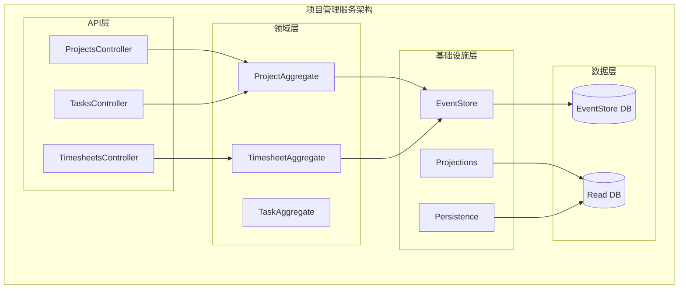

**图表来源**
- [Program.cs](file://src/Services/Projects/ErpSystem.Projects/Program.cs#L1-L49)
- [Persistence.cs](file://src/Services/Projects/ErpSystem.Projects/Infrastructure/Persistence.cs#L1-L127)

**章节来源**
- [Program.cs](file://src/Services/Projects/ErpSystem.Projects/Program.cs#L1-L49)
- [appsettings.json](file://src/Services/Projects/ErpSystem.Projects/appsettings.json#L1-L12)

## 核心组件

### 事件存储系统
项目使用事件溯源模式，所有业务状态变更都通过领域事件记录在事件存储中。事件存储提供：
- 完整的审计轨迹
- 时间旅行查询能力
- 分布式事务支持

### 读写分离架构
- **写模型**: 使用事件存储记录聚合根状态变更
- **读模型**: 使用投影器将事件转换为优化的查询模型

### 领域聚合
- **Project**: 项目聚合根，管理项目生命周期和团队成员
- **Timesheet**: 工时聚合根，处理工时记录和审批流程

**章节来源**
- [DDDBase.cs](file://src/BuildingBlocks/ErpSystem.BuildingBlocks/Domain/DDDBase.cs#L53-L152)
- [ProjectAggregate.cs](file://src/Services/Projects/ErpSystem.Projects/Domain/ProjectAggregate.cs#L280-L451)
- [TimesheetAggregate.cs](file://src/Services/Projects/ErpSystem.Projects/Domain/TimesheetAggregate.cs#L105-L218)

## 架构概览

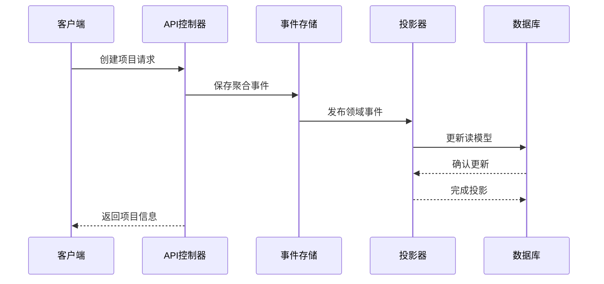

**图表来源**
- [Projections.cs](file://src/Services/Projects/ErpSystem.Projects/Infrastructure/Projections.cs#L19-L41)
- [Persistence.cs](file://src/Services/Projects/ErpSystem.Projects/Infrastructure/Persistence.cs#L8-L20)

## 详细组件分析

### 项目聚合分析

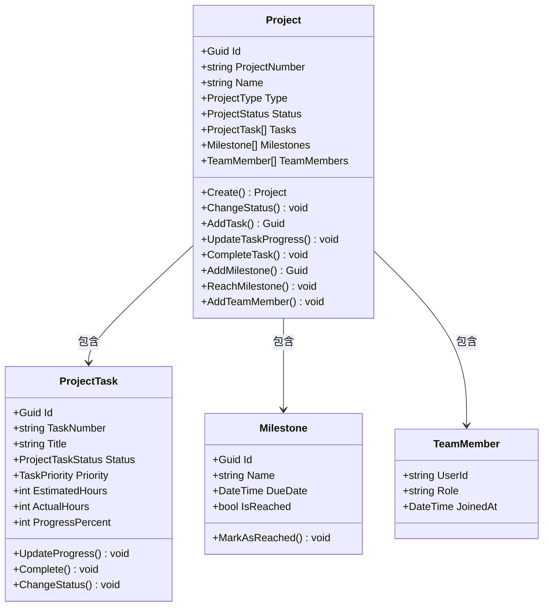

**图表来源**
- [ProjectAggregate.cs](file://src/Services/Projects/ErpSystem.Projects/Domain/ProjectAggregate.cs#L175-L448)

### 工时聚合分析

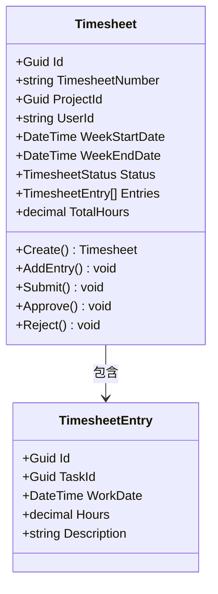

**图表来源**
- [TimesheetAggregate.cs](file://src/Services/Projects/ErpSystem.Projects/Domain/TimesheetAggregate.cs#L107-L215)

## API端点定义

### 项目管理API

#### 获取项目列表
- **方法**: GET
- **路径**: `/api/v1/projects/projects`
- **查询参数**:
  - `status`: 项目状态过滤
  - `type`: 项目类型过滤  
  - `managerId`: 项目经理ID过滤

**响应示例**:
```json
{
  "items": [
    {
      "id": "guid",
      "projectNumber": "PRJ-20241201-aBcDeFgH",
      "name": "项目名称",
      "type": "Internal",
      "status": "Planning",
      "startDate": "2024-12-01T00:00:00Z",
      "endDate": "2025-01-31T23:59:59Z",
      "plannedBudget": 100000.00,
      "actualCost": 0.00,
      "currency": "CNY",
      "customerId": "customer-id",
      "projectManagerId": "manager-id",
      "totalTasks": 0,
      "completedTasks": 0,
      "progressPercent": 0.0,
      "milestones": "[]",
      "teamMembers": "[]",
      "createdAt": "2024-12-01T10:00:00Z"
    }
  ],
  "total": 1
}
```

#### 获取单个项目详情
- **方法**: GET  
- **路径**: `/api/v1/projects/projects/{id}`

#### 创建新项目
- **方法**: POST
- **路径**: `/api/v1/projects/projects`
- **请求体**: CreateProjectRequest
- **响应**: 201 Created + 项目ID和项目编号

**请求体字段**:
- `name`: 项目名称 (必填)
- `type`: 项目类型 (必填: Internal/External/Research/Maintenance)
- `startDate`: 开始日期 (必填)
- `endDate`: 结束日期 (必填)
- `budget`: 预算金额 (必填)
- `currency`: 货币代码 (必填)
- `projectManagerId`: 项目经理ID (必填)
- `customerId`: 客户ID (可选)
- `description`: 项目描述 (可选)

#### 变更项目状态
- **方法**: PUT
- **路径**: `/api/v1/projects/projects/{id}/status`
- **请求体**: ChangeStatusRequest

**请求体字段**:
- `status`: 新状态 (必填: Planning/InProgress/OnHold/Completed/Cancelled)

#### 添加任务到项目
- **方法**: POST
- **路径**: `/api/v1/projects/projects/{id}/tasks`
- **请求体**: AddTaskRequest

**请求体字段**:
- `title`: 任务标题 (必填)
- `description`: 任务描述 (可选)
- `priority`: 优先级 (必填: Low/Medium/High/Critical)
- `dueDate`: 截止日期 (可选)
- `assigneeId`: 负责人ID (可选)
- `estimatedHours`: 预计工时 (必填)
- `parentTaskId`: 父任务ID (可选)

#### 添加里程碑
- **方法**: POST
- **路径**: `/api/v1/projects/projects/{id}/milestones`
- **请求体**: AddMilestoneRequest

**请求体字段**:
- `name`: 里程碑名称 (必填)
- `dueDate`: 截止日期 (必填)
- `description`: 描述 (可选)

#### 添加团队成员
- **方法**: POST
- **路径**: `/api/v1/projects/projects/{id}/team-members`
- **请求体**: AddTeamMemberRequest

**请求体字段**:
- `userId`: 用户ID (必填)
- `role`: 角色 (必填)

#### 获取项目统计信息
- **方法**: GET
- **路径**: `/api/v1/projects/projects/statistics`

**响应示例**:
```json
{
  "total": 10,
  "planning": 2,
  "inProgress": 6,
  "completed": 1,
  "onHold": 1,
  "totalBudget": 1500000.00,
  "avgProgress": 65.5
}
```

### 任务管理API

#### 获取任务列表
- **方法**: GET
- **路径**: `/api/v1/projects/tasks`
- **查询参数**:
  - `projectId`: 项目ID过滤
  - `status`: 状态过滤
  - `assigneeId`: 负责人ID过滤

#### 获取单个任务详情
- **方法**: GET
- **路径**: `/api/v1/projects/tasks/{id}`

#### 更新任务进度
- **方法**: PUT
- **路径**: `/api/v1/projects/tasks/{id}/progress`
- **请求体**: UpdateProgressRequest

**请求体字段**:
- `progressPercent`: 进度百分比 (0-100)

#### 完成任务
- **方法**: POST
- **路径**: `/api/v1/projects/tasks/{id}/complete`
- **请求体**: CompleteTaskRequest

**请求体字段**:
- `actualHours`: 实际工时

#### 获取看板视图
- **方法**: GET
- **路径**: `/api/v1/projects/tasks/kanban/{projectId}`

**响应示例**:
```json
{
  "columns": [
    {
      "status": "Open",
      "tasks": []
    },
    {
      "status": "InProgress", 
      "tasks": []
    },
    {
      "status": "InReview",
      "tasks": []
    },
    {
      "status": "Completed",
      "tasks": []
    }
  ]
}
```

#### 获取我的任务
- **方法**: GET
- **路径**: `/api/v1/projects/tasks/my-tasks`
- **查询参数**: `userId`: 用户ID

### 工时跟踪API

#### 获取工时记录列表
- **方法**: GET
- **路径**: `/api/v1/projects/timesheets`
- **查询参数**:
  - `projectId`: 项目ID过滤
  - `userId`: 用户ID过滤
  - `status`: 状态过滤

#### 获取单个工时记录详情
- **方法**: GET
- **路径**: `/api/v1/projects/timesheets/{id}`

#### 创建工时记录
- **方法**: POST
- **路径**: `/api/v1/projects/timesheets`
- **请求体**: CreateTimesheetRequest

**请求体字段**:
- `projectId`: 项目ID (必填)
- `userId`: 用户ID (必填)
- `weekStartDate`: 周开始日期 (必填)

#### 添加工时条目
- **方法**: POST
- **路径**: `/api/v1/projects/timesheets/{id}/entries`
- **请求体**: AddEntryRequest

**请求体字段**:
- `taskId`: 任务ID (必填)
- `workDate`: 工作日期 (必填)
- `hours`: 工时数 (必填: 0-24)
- `description`: 描述 (可选)

#### 提交工时记录
- **方法**: POST
- **路径**: `/api/v1/projects/timesheets/{id}/submit`

#### 批准工时记录
- **方法**: POST
- **路径**: `/api/v1/projects/timesheets/{id}/approve`
- **请求体**: ApproveRequest

**请求体字段**:
- `approvedByUserId`: 审批人ID (必填)

#### 拒绝工时记录
- **方法**: POST
- **路径**: `/api/v1/projects/timesheets/{id}/reject`
- **请求体**: RejectRequest

**请求体字段**:
- `rejectedByUserId`: 拒批人ID (必填)
- `reason`: 拒绝原因 (必填)

#### 获取待审批工时记录
- **方法**: GET
- **路径**: `/api/v1/projects/timesheets/pending-approval`

#### 获取工时统计摘要
- **方法**: GET
- **路径**: `/api/v1/projects/timesheets/summary`
- **查询参数**: `projectId`: 项目ID (必填)

**响应示例**:
```json
{
  "totalHours": 120.5,
  "totalTimesheets": 5,
  "byUser": [
    {
      "userId": "user-1",
      "totalHours": 45.0
    },
    {
      "userId": "user-2", 
      "totalHours": 75.5
    }
  ]
}
```

**章节来源**
- [ProjectsController.cs](file://src/Services/Projects/ErpSystem.Projects/API/ProjectsController.cs#L13-L129)
- [TasksController.cs](file://src/Services/Projects/ErpSystem.Projects/API/TasksController.cs#L13-L92)
- [TimesheetsController.cs](file://src/Services/Projects/ErpSystem.Projects/API/TimesheetsController.cs#L13-L127)

## 数据模型

### 项目数据模型

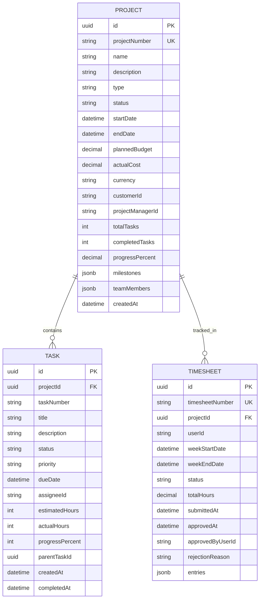

**图表来源**
- [Persistence.cs](file://src/Services/Projects/ErpSystem.Projects/Infrastructure/Persistence.cs#L67-L124)

### 项目状态流转

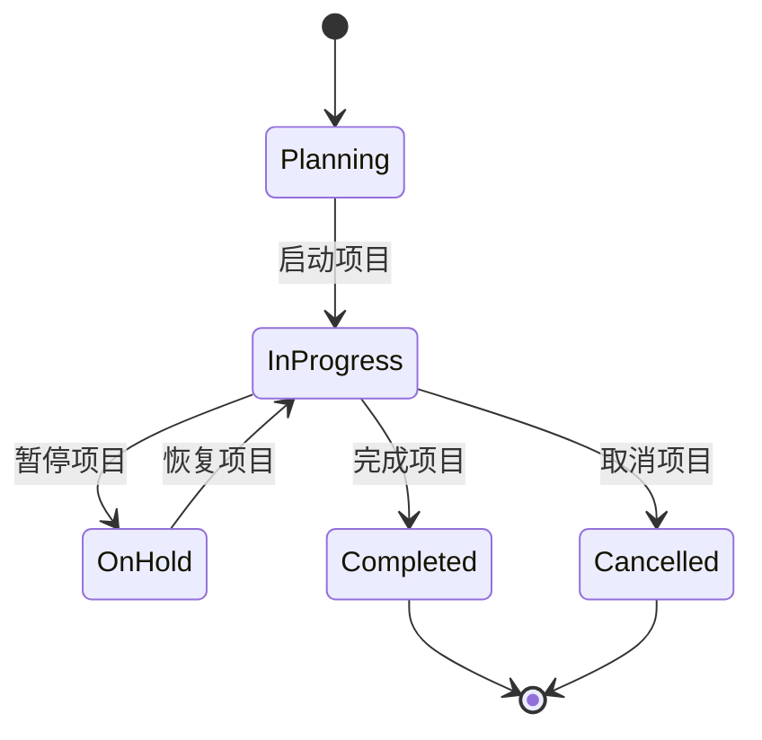

### 工时状态流转

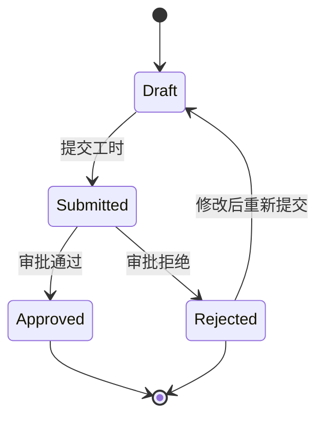

**章节来源**
- [ProjectAggregate.cs](file://src/Services/Projects/ErpSystem.Projects/Domain/ProjectAggregate.cs#L7-L41)
- [TimesheetAggregate.cs](file://src/Services/Projects/ErpSystem.Projects/Domain/TimesheetAggregate.cs#L67-L73)

## 项目管理流程

### 项目创建流程

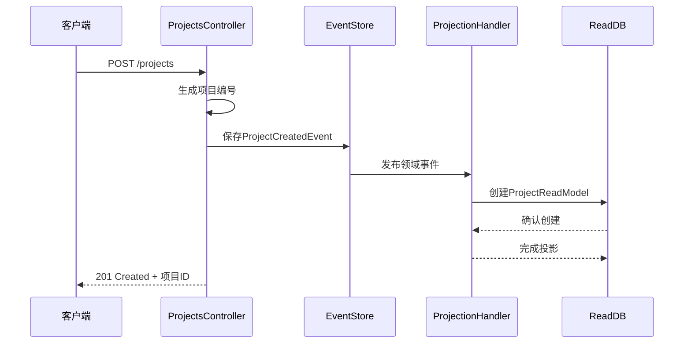

**图表来源**
- [ProjectsController.cs](file://src/Services/Projects/ErpSystem.Projects/API/ProjectsController.cs#L39-L60)
- [Projections.cs](file://src/Services/Projects/ErpSystem.Projects/Infrastructure/Projections.cs#L19-L41)

### 任务分配流程

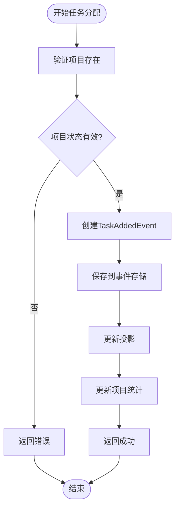

**图表来源**
- [ProjectsController.cs](file://src/Services/Projects/ErpSystem.Projects/API/ProjectsController.cs#L73-L91)
- [Projections.cs](file://src/Services/Projects/ErpSystem.Projects/Infrastructure/Projections.cs#L53-L78)

### 进度跟踪流程

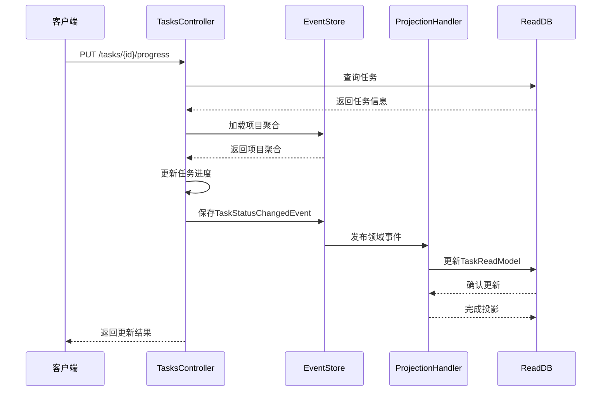

**图表来源**
- [TasksController.cs](file://src/Services/Projects/ErpSystem.Projects/API/TasksController.cs#L39-L51)
- [Projections.cs](file://src/Services/Projects/ErpSystem.Projects/Infrastructure/Projections.cs#L80-L100)

## 工时跟踪流程

### 工时记录流程

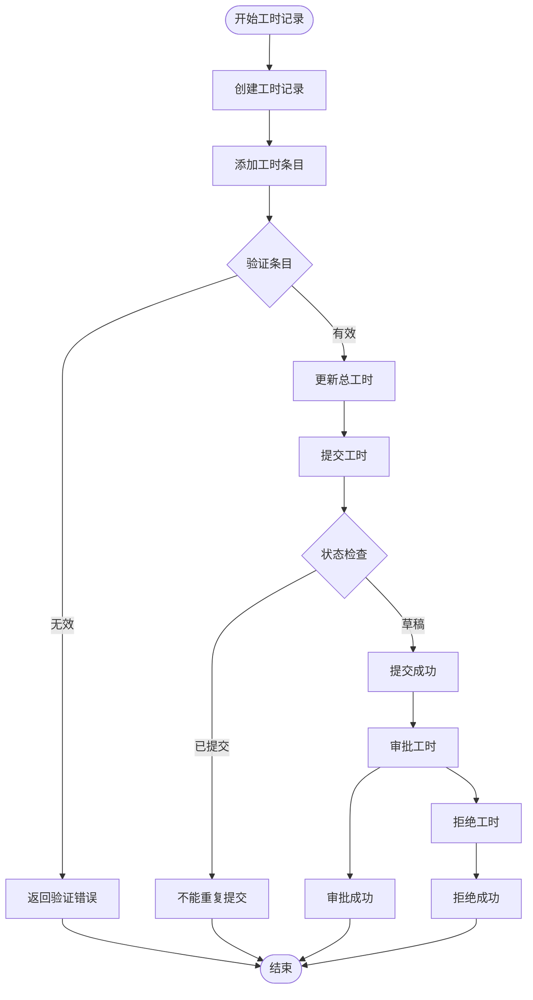

**图表来源**
- [TimesheetsController.cs](file://src/Services/Projects/ErpSystem.Projects/API/TimesheetsController.cs#L56-L98)
- [TimesheetAggregate.cs](file://src/Services/Projects/ErpSystem.Projects/Domain/TimesheetAggregate.cs#L138-L178)

## 性能考虑

### 数据库优化
- **索引策略**: 在项目、任务、工时表上建立适当的索引
- **查询优化**: 使用投影模型进行复杂查询
- **连接池**: 配置合适的数据库连接池大小

### 缓存策略
- **读模型缓存**: 缓存常用的查询结果
- **事件存储缓存**: 缓存最近使用的聚合状态

### 异步处理
- **事件发布**: 使用异步事件发布机制
- **投影处理**: 异步处理领域事件投影

## 故障排除指南

### 常见问题

**1. 事件存储连接失败**
- 检查数据库连接字符串配置
- 验证PostgreSQL服务可用性
- 确认网络连接正常

**2. 任务进度更新失败**
- 验证任务是否存在
- 检查项目状态是否允许进度更新
- 确认权限验证通过

**3. 工时记录提交失败**
- 检查工时记录状态
- 验证工作日期范围
- 确认工时条目有效性

### 错误响应码
- **400 Bad Request**: 请求参数无效
- **401 Unauthorized**: 认证失败
- **403 Forbidden**: 权限不足
- **404 Not Found**: 资源不存在
- **500 Internal Server Error**: 服务器内部错误

**章节来源**
- [Persistence.cs](file://src/Services/Projects/ErpSystem.Projects/Infrastructure/Persistence.cs#L8-L20)
- [ProjectAggregate.cs](file://src/Services/Projects/ErpSystem.Projects/Domain/ProjectAggregate.cs#L329-L370)
- [TimesheetAggregate.cs](file://src/Services/Projects/ErpSystem.Projects/Domain/TimesheetAggregate.cs#L150-L178)

## 结论

项目管理服务提供了完整的企业级项目管理解决方案，具有以下特点：

### 核心优势
- **事件驱动架构**: 提供完整的审计轨迹和时间旅行查询能力
- **实时协作**: 支持多用户同时协作和实时状态同步
- **灵活扩展**: 微服务架构支持独立部署和水平扩展
- **企业级安全**: 集成身份认证和授权机制

### 功能完整性
- **项目管理**: 全生命周期项目管理
- **任务跟踪**: 细粒度任务管理和进度监控
- **工时管理**: 完整的工时记录和审批流程
- **团队协作**: 多角色团队协作支持

### 技术先进性
- **现代技术栈**: 基于.NET 10和最新企业级模式
- **云原生设计**: 支持容器化和Kubernetes部署
- **可观测性**: 内置日志、监控和追踪功能

该服务为企业提供了强大的项目管理能力，支持复杂的业务场景和大规模并发访问需求。