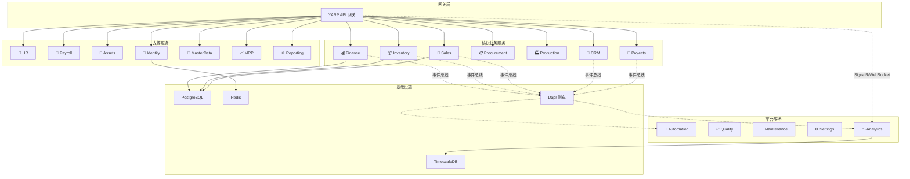
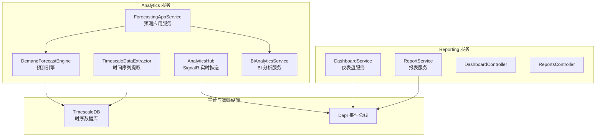
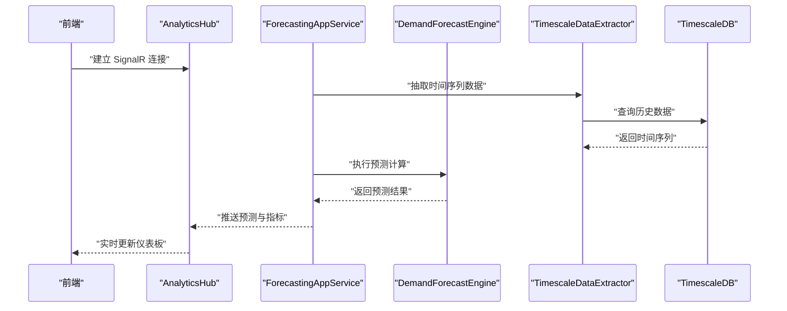
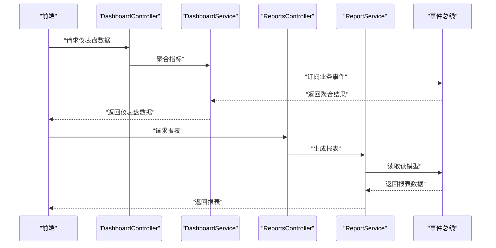
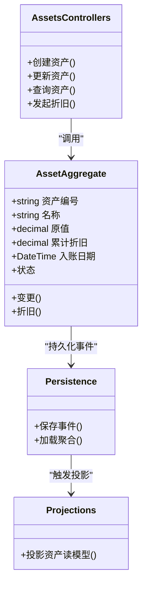
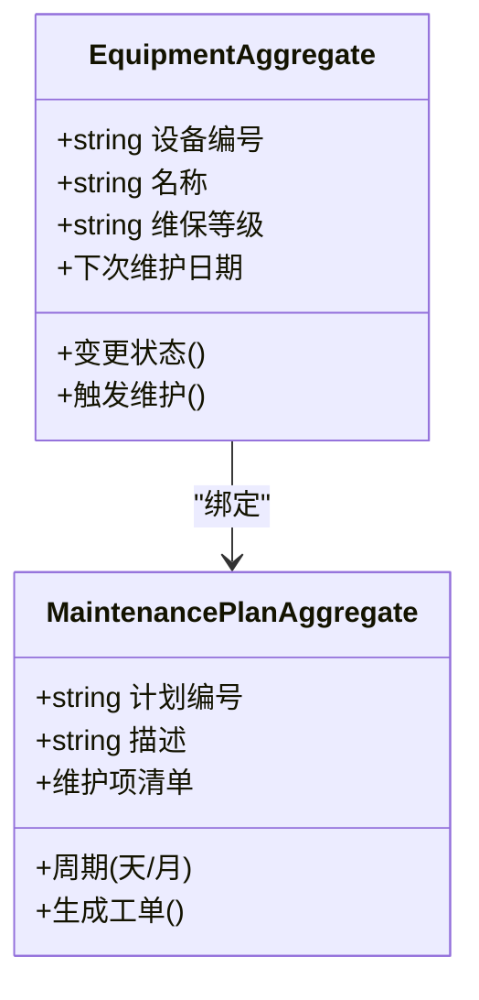
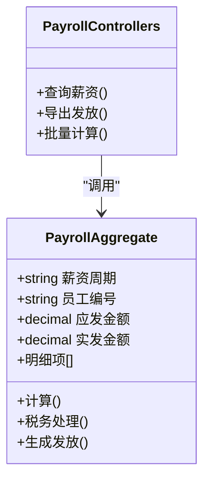
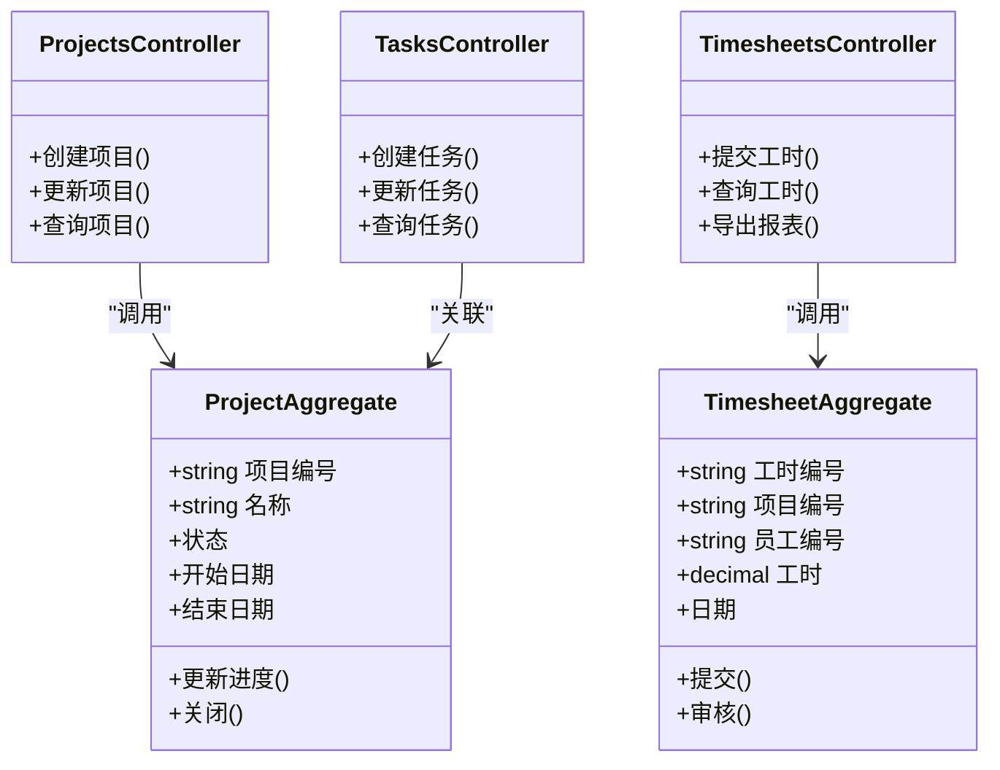
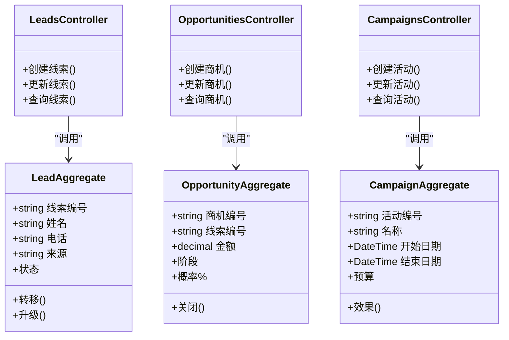
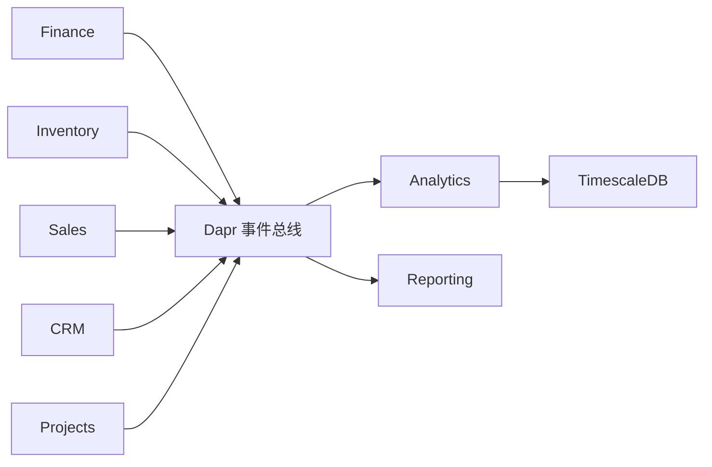

# 专业业务服务

<cite>
**本文引用的文件**
- [README.md](file://README.md)
- [Program.cs](file://src/Services/Analytics/ErpSystem.Analytics/Program.cs)
- [DashboardsController.cs](file://src/Services/Analytics/ErpSystem.Analytics/API/DashboardsController.cs)
- [AnalyticsHub.cs](file://src/Services/Analytics/ErpSystem.Analytics/API/Hubs/AnalyticsHub.cs)
- [ForecastingAppService.cs](file://src/Services/Analytics/ErpSystem.Analytics/Application/ForecastingAppService.cs)
- [DemandForecastEngine.cs](file://src/Services/Analytics/ErpSystem.Analytics/Infrastructure/DemandForecastEngine.cs)
- [BiAnalyticsService.cs](file://src/Services/Analytics/ErpSystem.Analytics/Infrastructure/BiAnalyticsService.cs)
- [TimescaleDataExtractor.cs](file://src/Services/Analytics/ErpSystem.Analytics/Infrastructure/TimescaleDataExtractor.cs)
- [Program.cs](file://src/Services/Reporting/ErpSystem.Reporting/Program.cs)
- [DashboardController.cs](file://src/Services/Reporting/ErpSystem.Reporting/Controllers/DashboardController.cs)
- [ReportsController.cs](file://src/Services/Reporting/ErpSystem.Reporting/Controllers/ReportsController.cs)
- [DashboardService.cs](file://src/Services/Reporting/ErpSystem.Reporting/Application/DashboardService.cs)
- [ReportService.cs](file://src/Services/Reporting/ErpSystem.Reporting/Application/ReportService.cs)
- [Program.cs](file://src/Services/Assets/ErpSystem.Assets/Program.cs)
- [AssetsControllers.cs](file://src/Services/Assets/ErpSystem.Assets/API/AssetsControllers.cs)
- [AssetAggregate.cs](file://src/Services/Assets/ErpSystem.Assets/Domain/AssetAggregate.cs)
- [Persistence.cs](file://src/Services/Assets/ErpSystem.Assets/Infrastructure/Persistence.cs)
- [Projections.cs](file://src/Services/Assets/ErpSystem.Assets/Infrastructure/Projections.cs)
- [Program.cs](file://src/Services/Maintenance/ErpSystem.Maintenance/Program.cs)
- [EquipmentAggregate.cs](file://src/Services/Maintenance/ErpSystem.Maintenance/Domain/EquipmentAggregate.cs)
- [MaintenancePlanAggregate.cs](file://src/Services/Maintenance/ErpSystem.Maintenance/Domain/MaintenancePlanAggregate.cs)
- [Program.cs](file://src/Services/Payroll/ErpSystem.Payroll/Program.cs)
- [PayrollControllers.cs](file://src/Services/Payroll/ErpSystem.Payroll/API/PayrollControllers.cs)
- [PayrollAggregate.cs](file://src/Services/Payroll/ErpSystem.Payroll/Domain/PayrollAggregate.cs)
- [Program.cs](file://src/Services/Projects/ErpSystem.Projects/Program.cs)
- [ProjectsController.cs](file://src/Services/Projects/ErpSystem.Projects/API/ProjectsController.cs)
- [TasksController.cs](file://src/Services/Projects/ErpSystem.Projects/API/TasksController.cs)
- [TimesheetsController.cs](file://src/Services/Projects/ErpSystem.Projects/API/TimesheetsController.cs)
- [ProjectAggregate.cs](file://src/Services/Projects/ErpSystem.Projects/Domain/ProjectAggregate.cs)
- [TimesheetAggregate.cs](file://src/Services/Projects/ErpSystem.Projects/Domain/TimesheetAggregate.cs)
- [Program.cs](file://src/Services/CRM/ErpSystem.CRM/Program.cs)
- [LeadsController.cs](file://src/Services/CRM/ErpSystem.CRM/API/LeadsController.cs)
- [OpportunitiesController.cs](file://src/Services/CRM/ErpSystem.CRM/API/OpportunitiesController.cs)
- [CampaignsController.cs](file://src/Services/CRM/ErpSystem.CRM/API/CampaignsController.cs)
- [LeadAggregate.cs](file://src/Services/CRM/ErpSystem.CRM/Domain/LeadAggregate.cs)
- [OpportunityAggregate.cs](file://src/Services/CRM/ErpSystem.CRM/Domain/OpportunityAggregate.cs)
- [CampaignAggregate.cs](file://src/Services/CRM/ErpSystem.CRM/Domain/CampaignAggregate.cs)
</cite>

## 目录
1. [引言](#引言)
2. [项目结构](#项目结构)
3. [核心组件](#核心组件)
4. [架构总览](#架构总览)
5. [详细组件分析](#详细组件分析)
6. [依赖分析](#依赖分析)
7. [性能考虑](#性能考虑)
8. [故障排除指南](#故障排除指南)
9. [结论](#结论)
10. [附录](#附录)

## 引言
本文件面向专业业务服务，围绕分析服务、报告服务、资产管理、维护管理、薪资管理、项目管理、客户关系管理等模块，系统阐述其架构、数据流、处理逻辑与集成点。内容既覆盖实时仪表板与预测分析等智能分析能力，也涵盖BI仪表板、报表生成与数据可视化等商业智能功能；同时包含资产生命周期管理、预防性维护与设备监控、薪资计算与税务处理、项目规划与工时跟踪、以及销售线索与商机管理等专业化业务能力。

## 项目结构
- 微服务采用领域驱动设计与事件溯源模式，核心业务服务包括：Finance、Inventory、Sales、Procurement、Production、CRM、Projects 等；支撑服务包括：HR、Payroll、Assets、Identity、MasterData、MRP、Reporting；平台服务包括：Automation、Quality、Maintenance、Settings、Analytics。
- 分析与报告服务分别提供实时仪表板、预测分析与BI仪表板、报表生成与可视化能力；资产管理、维护管理、薪资管理、项目管理、CRM等模块均采用事件溯源与CQRS分离读写模型。

图表来源
- [README.md](file://README.md#L130-L183)

章节来源
- [README.md](file://README.md#L130-L183)

## 核心组件
- 分析服务（Analytics）
  - 实时仪表板与预测分析：基于SignalR实现实时推送，结合ML.NET进行需求预测，使用TimescaleDB存储高维时间序列数据。
  - 关键组件：ForecastingAppService、DemandForecastEngine、BiAnalyticsService、TimescaleDataExtractor、AnalyticsHub。
- 报告服务（Reporting）
  - BI仪表板与报表生成：提供仪表盘聚合与报表服务，支持健康检查与Swagger文档。
  - 关键组件：DashboardService、ReportService、DashboardController、ReportsController。
- 资产管理（Assets）
  - 固定资产全生命周期：设备登记、折旧计算、维护计划与变更追踪，采用事件溯源与读模型投影。
  - 关键组件：AssetAggregate、AssetsControllers、Persistence、Projections。
- 维护管理（Maintenance）
  - 预防性维护与维修工单：设备与维护计划聚合，支持事件驱动的维护调度。
  - 关键组件：EquipmentAggregate、MaintenancePlanAggregate。
- 薪资管理（Payroll）
  - 薪酬计算与发放：薪资聚合与事件驱动处理，支持与HR/Finance集成。
  - 关键组件：PayrollAggregate、PayrollControllers。
- 项目管理（Projects）
  - 项目规划、任务管理与工时跟踪：项目与工时聚合，支持读模型投影。
  - 关键组件：ProjectAggregate、TimesheetAggregate、ProjectsController、TasksController、TimesheetsController。
- 客户关系管理（CRM）
  - 线索、商机与营销活动：线索与机会聚合，支持活动管理。
  - 关键组件：LeadAggregate、OpportunityAggregate、CampaignAggregate、LeadsController、OpportunitiesController、CampaignsController。

章节来源
- [Program.cs](file://src/Services/Analytics/ErpSystem.Analytics/Program.cs#L1-L83)
- [Program.cs](file://src/Services/Reporting/ErpSystem.Reporting/Program.cs#L1-L35)
- [Program.cs](file://src/Services/Assets/ErpSystem.Assets/Program.cs#L1-L45)
- [Program.cs](file://src/Services/Maintenance/ErpSystem.Maintenance/Program.cs#L1-L62)
- [Program.cs](file://src/Services/Payroll/ErpSystem.Payroll/Program.cs#L1-L45)
- [Program.cs](file://src/Services/Projects/ErpSystem.Projects/Program.cs#L1-L49)
- [Program.cs](file://src/Services/CRM/ErpSystem.CRM/Program.cs#L1-L74)

## 架构总览
- 事件溯源与CQRS：各服务均采用事件溯源记录变更，读模型独立投影，支持跨服务事件总线通信。
- 实时能力：Analytics服务通过SignalR提供实时仪表板，结合TimescaleDB实现高性能时间序列分析。
- 机器学习：Analytics服务内置预测分析引擎，支持需求预测与置信区间输出。
- BI与报表：Reporting服务提供仪表盘聚合与报表生成，支持健康检查与Swagger文档。

图表来源
- [Program.cs](file://src/Services/Analytics/ErpSystem.Analytics/Program.cs#L1-L83)
- [Program.cs](file://src/Services/Reporting/ErpSystem.Reporting/Program.cs#L1-L35)

章节来源
- [Program.cs](file://src/Services/Analytics/ErpSystem.Analytics/Program.cs#L1-L83)
- [Program.cs](file://src/Services/Reporting/ErpSystem.Reporting/Program.cs#L1-L35)

## 详细组件分析

### 分析服务（Analytics）
- 实时仪表板与预测分析
  - SignalR实时推送：AnalyticsHub提供WebSocket连接，向客户端推送最新指标与预测结果。
  - 需求预测：ForecastingAppService协调预测引擎，DemandForecastEngine执行预测计算，BiAnalyticsService提供BI分析能力，TimescaleDataExtractor负责从时序数据库抽取数据。
  - 时间序列存储：使用TimescaleDB存储高维时间序列，支持快速聚合与趋势分析。
- 数据流与处理逻辑
  - 事件溯源：服务通过事件总线接收业务事件，写入事件存储，再由投影生成读模型。
  - 预测流程：从事件流聚合销售/库存数据，经TimescaleDataExtractor转换为训练样本，DemandForecastEngine产出预测与置信区间，最终通过AnalyticsHub推送到前端。

图表来源
- [AnalyticsHub.cs](file://src/Services/Analytics/ErpSystem.Analytics/API/Hubs/AnalyticsHub.cs)
- [ForecastingAppService.cs](file://src/Services/Analytics/ErpSystem.Analytics/Application/ForecastingAppService.cs)
- [DemandForecastEngine.cs](file://src/Services/Analytics/ErpSystem.Analytics/Infrastructure/DemandForecastEngine.cs)
- [TimescaleDataExtractor.cs](file://src/Services/Analytics/ErpSystem.Analytics/Infrastructure/TimescaleDataExtractor.cs)

章节来源
- [Program.cs](file://src/Services/Analytics/ErpSystem.Analytics/Program.cs#L1-L83)
- [DashboardsController.cs](file://src/Services/Analytics/ErpSystem.Analytics/API/DashboardsController.cs)
- [AnalyticsHub.cs](file://src/Services/Analytics/ErpSystem.Analytics/API/Hubs/AnalyticsHub.cs)
- [ForecastingAppService.cs](file://src/Services/Analytics/ErpSystem.Analytics/Application/ForecastingAppService.cs)
- [DemandForecastEngine.cs](file://src/Services/Analytics/ErpSystem.Analytics/Infrastructure/DemandForecastEngine.cs)
- [BiAnalyticsService.cs](file://src/Services/Analytics/ErpSystem.Analytics/Infrastructure/BiAnalyticsService.cs)
- [TimescaleDataExtractor.cs](file://src/Services/Analytics/ErpSystem.Analytics/Infrastructure/TimescaleDataExtractor.cs)

### 报告服务（Reporting）
- BI仪表板与报表生成
  - DashboardService与ReportService提供仪表盘聚合与报表生成能力，支持健康检查与Swagger文档。
  - 控制器层提供REST接口，便于前端调用与集成。
- 数据来源与集成
  - 通过事件总线订阅核心业务事件，构建读模型，支持跨服务聚合与分析。

图表来源
- [DashboardController.cs](file://src/Services/Reporting/ErpSystem.Reporting/Controllers/DashboardController.cs)
- [ReportsController.cs](file://src/Services/Reporting/ErpSystem.Reporting/Controllers/ReportsController.cs)
- [DashboardService.cs](file://src/Services/Reporting/ErpSystem.Reporting/Application/DashboardService.cs)
- [ReportService.cs](file://src/Services/Reporting/ErpSystem.Reporting/Application/ReportService.cs)

章节来源
- [Program.cs](file://src/Services/Reporting/ErpSystem.Reporting/Program.cs#L1-L35)

### 资产管理（Assets）
- 设备管理与折旧计算
  - 资产聚合定义设备生命周期与折旧策略，支持资产登记、变更与处置。
  - 事件溯源记录资产状态变更，读模型投影用于报表与仪表板展示。
- 维护计划
  - 资产与维护计划关联，支持预防性维护提醒与工单生成。

图表来源
- [AssetAggregate.cs](file://src/Services/Assets/ErpSystem.Assets/Domain/AssetAggregate.cs)
- [AssetsControllers.cs](file://src/Services/Assets/ErpSystem.Assets/API/AssetsControllers.cs)
- [Persistence.cs](file://src/Services/Assets/ErpSystem.Assets/Infrastructure/Persistence.cs)
- [Projections.cs](file://src/Services/Assets/ErpSystem.Assets/Infrastructure/Projections.cs)

章节来源
- [Program.cs](file://src/Services/Assets/ErpSystem.Assets/Program.cs#L1-L45)

### 维护管理（Maintenance）
- 预防性维护与维修工单
  - 设备聚合与维护计划聚合共同构成维护管理体系，支持定期保养与突发维修。
- 事件驱动
  - 通过事件总线订阅设备状态变化，触发维护计划执行与工单创建。

图表来源
- [EquipmentAggregate.cs](file://src/Services/Maintenance/ErpSystem.Maintenance/Domain/EquipmentAggregate.cs)
- [MaintenancePlanAggregate.cs](file://src/Services/Maintenance/ErpSystem.Maintenance/Domain/MaintenancePlanAggregate.cs)

章节来源
- [Program.cs](file://src/Services/Maintenance/ErpSystem.Maintenance/Program.cs#L1-L62)

### 薪资管理（Payroll）
- 薪酬计算与税务处理
  - 薪资聚合管理员工薪酬构成、扣款与发放，支持与HR/Finance事件集成。
- 发放与报表
  - 通过控制器暴露薪资相关接口，支持查询与导出。

图表来源
- [PayrollAggregate.cs](file://src/Services/Payroll/ErpSystem.Payroll/Domain/PayrollAggregate.cs)
- [PayrollControllers.cs](file://src/Services/Payroll/ErpSystem.Payroll/API/PayrollControllers.cs)

章节来源
- [Program.cs](file://src/Services/Payroll/ErpSystem.Payroll/Program.cs#L1-L45)

### 项目管理（Projects）
- 项目规划、任务管理与工时跟踪
  - 项目聚合与工时聚合支撑项目全生命周期管理，读模型用于报表与仪表板。
- 协作与集成
  - 通过控制器提供REST接口，支持前端协作与移动端访问。

图表来源
- [ProjectAggregate.cs](file://src/Services/Projects/ErpSystem.Projects/Domain/ProjectAggregate.cs)
- [TimesheetAggregate.cs](file://src/Services/Projects/ErpSystem.Projects/Domain/TimesheetAggregate.cs)
- [ProjectsController.cs](file://src/Services/Projects/ErpSystem.Projects/API/ProjectsController.cs)
- [TasksController.cs](file://src/Services/Projects/ErpSystem.Projects/API/TasksController.cs)
- [TimesheetsController.cs](file://src/Services/Projects/ErpSystem.Projects/API/TimesheetsController.cs)

章节来源
- [Program.cs](file://src/Services/Projects/ErpSystem.Projects/Program.cs#L1-L49)

### 客户关系管理（CRM）
- 线索管理、商机跟踪与营销活动
  - 线索与机会聚合支撑销售漏斗管理，活动聚合支持营销效果追踪。
- 事件驱动与读模型
  - 通过事件总线订阅线索/机会状态变化，驱动营销活动与跟进任务。

图表来源
- [LeadAggregate.cs](file://src/Services/CRM/ErpSystem.CRM/Domain/LeadAggregate.cs)
- [OpportunityAggregate.cs](file://src/Services/CRM/ErpSystem.CRM/Domain/OpportunityAggregate.cs)
- [CampaignAggregate.cs](file://src/Services/CRM/ErpSystem.CRM/Domain/CampaignAggregate.cs)
- [LeadsController.cs](file://src/Services/CRM/ErpSystem.CRM/API/LeadsController.cs)
- [OpportunitiesController.cs](file://src/Services/CRM/ErpSystem.CRM/API/OpportunitiesController.cs)
- [CampaignsController.cs](file://src/Services/CRM/ErpSystem.CRM/API/CampaignsController.cs)

章节来源
- [Program.cs](file://src/Services/CRM/ErpSystem.CRM/Program.cs#L1-L74)

## 依赖分析
- 事件总线与跨服务通信：Finance、Inventory、Sales、CRM、Projects等核心服务通过Dapr事件总线发布/订阅领域事件，实现松耦合协作。
- 读模型与投影：各服务均包含读模型投影，用于报表与仪表板展示，避免直接查询写模型。
- 实时与时序：Analytics服务通过SignalR与TimescaleDB实现高性能实时与时间序列分析。

图表来源
- [README.md](file://README.md#L177-L182)

章节来源
- [README.md](file://README.md#L177-L182)

## 性能考虑
- 事件溯源与CQRS：分离读写模型，降低复杂查询对写模型的影响，提升并发性能。
- TimescaleDB：针对时间序列数据进行优化，支持高效聚合与趋势分析，适合预测分析与实时仪表板。
- SignalR：轻量级实时推送，适用于仪表板与监控场景，建议合理设置心跳与重连策略。
- 缓存与分布式缓存：结合共享构建模块中的缓存扩展，提升热点数据访问性能。

## 故障排除指南
- 服务启动失败
  - 检查数据库连接字符串与容器环境变量是否正确配置。
  - 确认事件总线（Dapr）与端口映射是否正常。
- 实时仪表板无数据
  - 确认AnalyticsHub连接状态与事件总线订阅是否生效。
  - 检查TimescaleDB数据导入与投影是否成功。
- 预测结果异常
  - 核对TimescaleDataExtractor的数据抽取逻辑与时间窗口。
  - 检查DemandForecastEngine的输入特征与模型参数。
- 报表为空
  - 确认事件总线事件是否到达，读模型投影是否完成。
  - 检查DashboardService/ReportService的查询条件与权限。

## 结论
本专业业务服务以事件溯源与CQRS为核心，结合Dapr事件总线与TimescaleDB，实现了从分析服务的实时仪表板与预测分析，到报告服务的BI仪表板与报表生成，再到资产管理、维护管理、薪资管理、项目管理与CRM等专业化模块的完整闭环。通过模块化设计与清晰的职责边界，系统具备良好的可扩展性与可维护性，能够满足企业级复杂业务场景的需求。

## 附录
- 快速启动与部署：参考项目根目录README中的快速启动与Kubernetes部署指南，确保本地与生产环境一致。
- 健康检查：Reporting服务提供健康检查端点，便于容器编排与运维监控。