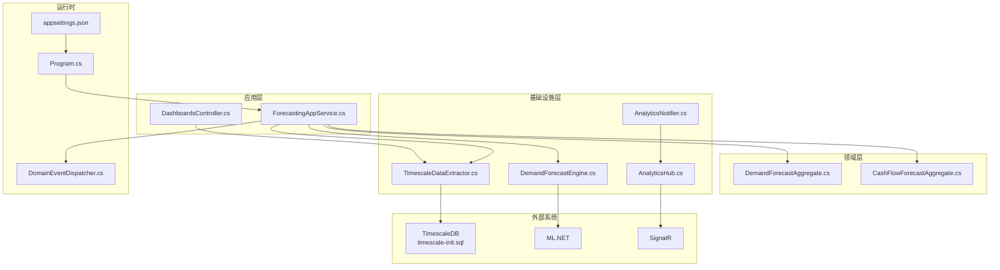
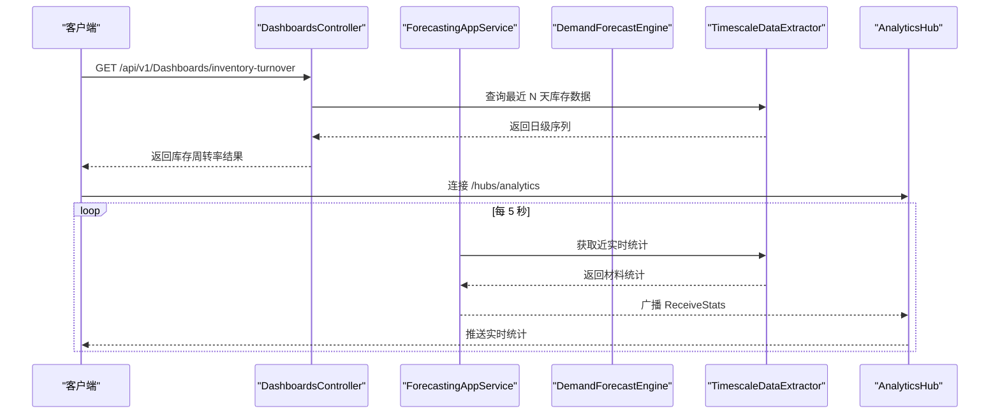
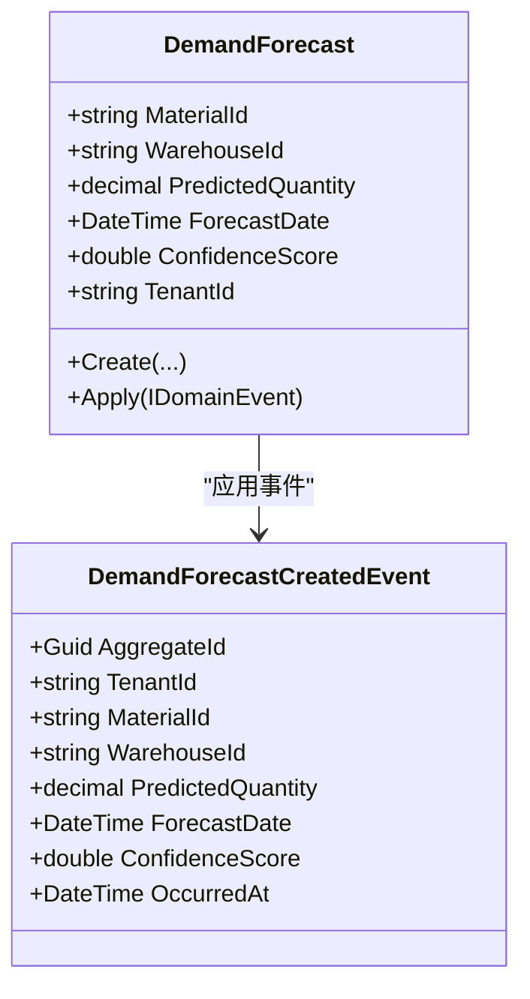
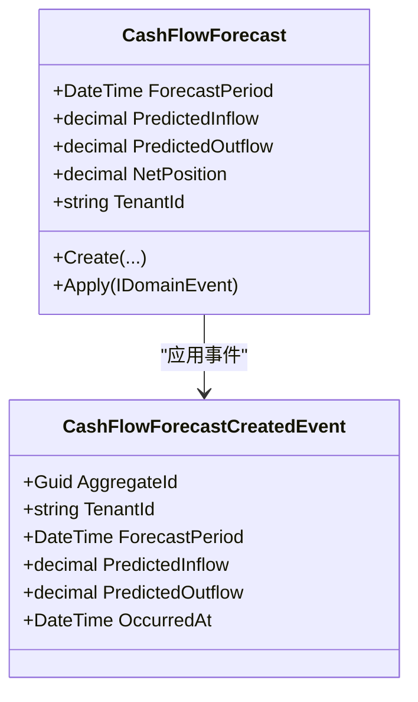
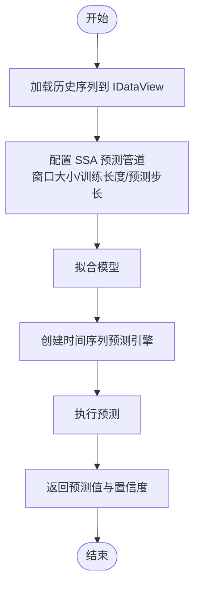
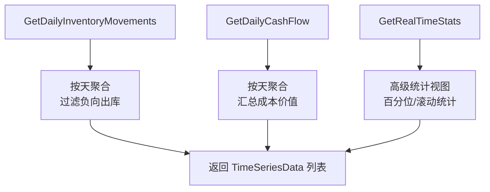
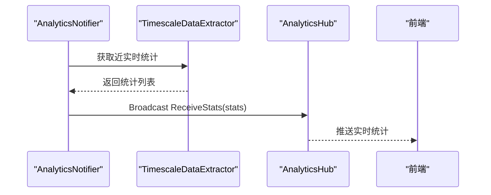
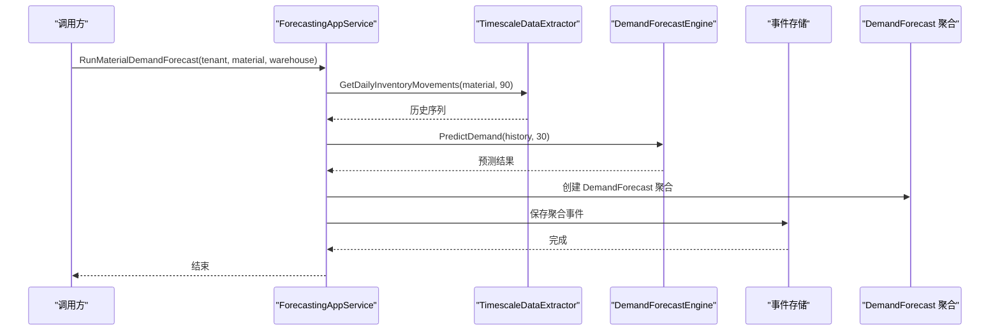
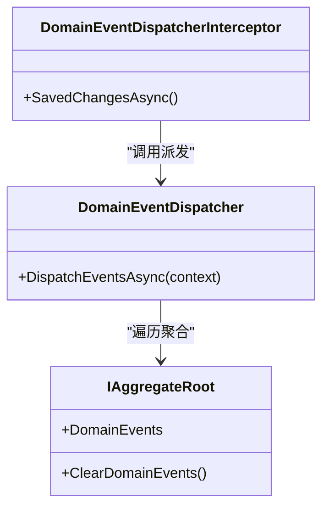
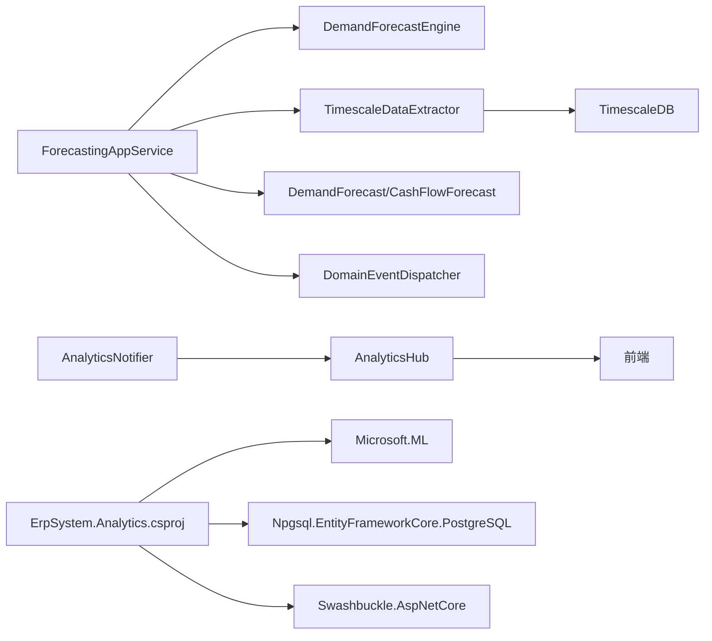

# 分析服务

<cite>
**本文引用的文件**
- [Program.cs](file://src/Services/Analytics/ErpSystem.Analytics/Program.cs)
- [ErpSystem.Analytics.csproj](file://src/Services/Analytics/ErpSystem.Analytics/ErpSystem.Analytics.csproj)
- [ForecastingAppService.cs](file://src/Services/Analytics/ErpSystem.Analytics/Application/ForecastingAppService.cs)
- [DemandForecastAggregate.cs](file://src/Services/Analytics/ErpSystem.Analytics/DemandForecastAggregate.cs)
- [CashFlowForecastAggregate.cs](file://src/Services/Analytics/ErpSystem.Analytics/CashFlowForecastAggregate.cs)
- [DemandForecastEngine.cs](file://src/Services/Analytics/ErpSystem.Analytics/Infrastructure/DemandForecastEngine.cs)
- [TimescaleDataExtractor.cs](file://src/Services/Analytics/ErpSystem.Analytics/Infrastructure/TimescaleDataExtractor.cs)
- [AnalyticsHub.cs](file://src/Services/Analytics/ErpSystem.Analytics/API/Hubs/AnalyticsHub.cs)
- [AnalyticsNotifier.cs](file://src/Services/Analytics/ErpSystem.Analytics/Infrastructure/BackgroundJobs/AnalyticsNotifier.cs)
- [DashboardsController.cs](file://src/Services/Analytics/ErpSystem.Analytics/API/DashboardsController.cs)
- [DomainEventDispatcher.cs](file://src/BuildingBlocks/ErpSystem.BuildingBlocks/Domain/DomainEventDispatcher.cs)
- [appsettings.json](file://src/Services/Analytics/ErpSystem.Analytics/appsettings.json)
- [timescale-init.sql](file://infrastructure/timescale-init.sql)
</cite>

## 目录
1. [简介](#简介)
2. [项目结构](#项目结构)
3. [核心组件](#核心组件)
4. [架构总览](#架构总览)
5. [详细组件分析](#详细组件分析)
6. [依赖关系分析](#依赖关系分析)
7. [性能考虑](#性能考虑)
8. [故障排除指南](#故障排除指南)
9. [结论](#结论)
10. [附录：API 接口文档](#附录api-接口文档)

## 简介
本文件为“分析服务”的全面技术文档，聚焦以下智能分析能力：
- 需求预测：基于时间序列的历史数据，使用 ML.NET 的 SSA（奇异谱分析）进行短期需求预测，并以事件溯源方式持久化预测结果。
- 现金流预测：通过 TimescaleDB 汇总成本与交易数据，形成日级现金流序列，用于流动性预测与风险评估。
- 实时仪表板：结合 SignalR 实时推送库存统计与异常波动，支持前端可视化与告警联动。
- 机器学习分析：集成 ML.NET 时间序列预测管线，支持可扩展的算法与特征工程。
- 数据基础设施：与 TimescaleDB 的时间序列表、连续聚合、压缩策略及统计视图深度集成，支撑高吞吐的历史分析与近实时统计。

## 项目结构
分析服务采用分层架构，围绕“应用层-领域层-基础设施层”组织代码，并通过事件总线与后台作业实现解耦与异步处理。

图表来源
- [Program.cs](file://src/Services/Analytics/ErpSystem.Analytics/Program.cs#L1-L83)
- [ForecastingAppService.cs](file://src/Services/Analytics/ErpSystem.Analytics/Application/ForecastingAppService.cs#L1-L42)
- [DemandForecastEngine.cs](file://src/Services/Analytics/ErpSystem.Analytics/Infrastructure/DemandForecastEngine.cs#L1-L62)
- [TimescaleDataExtractor.cs](file://src/Services/Analytics/ErpSystem.Analytics/Infrastructure/TimescaleDataExtractor.cs#L1-L142)
- [DemandForecastAggregate.cs](file://src/Services/Analytics/ErpSystem.Analytics/DemandForecastAggregate.cs#L1-L69)
- [CashFlowForecastAggregate.cs](file://src/Services/Analytics/ErpSystem.Analytics/CashFlowForecastAggregate.cs#L1-L60)
- [AnalyticsHub.cs](file://src/Services/Analytics/ErpSystem.Analytics/API/Hubs/AnalyticsHub.cs#L1-L13)
- [AnalyticsNotifier.cs](file://src/Services/Analytics/ErpSystem.Analytics/Infrastructure/BackgroundJobs/AnalyticsNotifier.cs#L1-L38)
- [DashboardsController.cs](file://src/Services/Analytics/ErpSystem.Analytics/API/DashboardsController.cs#L1-L26)
- [DomainEventDispatcher.cs](file://src/BuildingBlocks/ErpSystem.BuildingBlocks/Domain/DomainEventDispatcher.cs#L1-L72)
- [appsettings.json](file://src/Services/Analytics/ErpSystem.Analytics/appsettings.json#L1-L12)
- [timescale-init.sql](file://infrastructure/timescale-init.sql#L1-L139)

章节来源
- [Program.cs](file://src/Services/Analytics/ErpSystem.Analytics/Program.cs#L1-L83)
- [ErpSystem.Analytics.csproj](file://src/Services/Analytics/ErpSystem.Analytics/ErpSystem.Analytics.csproj#L1-L23)

## 核心组件
- 应用服务：协调预测任务，编排数据提取与模型推理，并保存预测聚合。
- 领域聚合：需求预测与现金流预测聚合根，封装业务不变式与事件应用逻辑。
- 预测引擎：基于 ML.NET 的 SSA 时间序列预测器，负责训练与预测。
- 数据提取器：从 TimescaleDB 读取日粒度库存与成本序列，以及近实时统计。
- 实时通道与通知：SignalR Hub 提供实时推送，后台作业周期性抓取统计并广播。
- 控制器：提供 BI 仪表板查询端点，如库存周转率与 OEE 等指标。
- 事件派发：EF Core 保存拦截器在提交后派发领域事件，确保与事件总线集成。

章节来源
- [ForecastingAppService.cs](file://src/Services/Analytics/ErpSystem.Analytics/Application/ForecastingAppService.cs#L1-L42)
- [DemandForecastAggregate.cs](file://src/Services/Analytics/ErpSystem.Analytics/DemandForecastAggregate.cs#L1-L69)
- [CashFlowForecastAggregate.cs](file://src/Services/Analytics/ErpSystem.Analytics/CashFlowForecastAggregate.cs#L1-L60)
- [DemandForecastEngine.cs](file://src/Services/Analytics/ErpSystem.Analytics/Infrastructure/DemandForecastEngine.cs#L1-L62)
- [TimescaleDataExtractor.cs](file://src/Services/Analytics/ErpSystem.Analytics/Infrastructure/TimescaleDataExtractor.cs#L1-L142)
- [AnalyticsHub.cs](file://src/Services/Analytics/ErpSystem.Analytics/API/Hubs/AnalyticsHub.cs#L1-L13)
- [AnalyticsNotifier.cs](file://src/Services/Analytics/ErpSystem.Analytics/Infrastructure/BackgroundJobs/AnalyticsNotifier.cs#L1-L38)
- [DashboardsController.cs](file://src/Services/Analytics/ErpSystem.Analytics/API/DashboardsController.cs#L1-L26)
- [DomainEventDispatcher.cs](file://src/BuildingBlocks/ErpSystem.BuildingBlocks/Domain/DomainEventDispatcher.cs#L1-L72)

## 架构总览
分析服务采用微服务架构，结合事件溯源、CQRS 与事件驱动的后台作业，实现预测、实时监控与 BI 查询的解耦协同。

图表来源
- [DashboardsController.cs](file://src/Services/Analytics/ErpSystem.Analytics/API/DashboardsController.cs#L1-L26)
- [ForecastingAppService.cs](file://src/Services/Analytics/ErpSystem.Analytics/Application/ForecastingAppService.cs#L1-L42)
- [TimescaleDataExtractor.cs](file://src/Services/Analytics/ErpSystem.Analytics/Infrastructure/TimescaleDataExtractor.cs#L1-L142)
- [AnalyticsHub.cs](file://src/Services/Analytics/ErpSystem.Analytics/API/Hubs/AnalyticsHub.cs#L1-L13)
- [AnalyticsNotifier.cs](file://src/Services/Analytics/ErpSystem.Analytics/Infrastructure/BackgroundJobs/AnalyticsNotifier.cs#L1-L38)

## 详细组件分析

### 需求预测聚合（DemandForecast）
需求预测聚合根负责管理单物料、单仓库的预测结果，包含预测值、置信度与过期时间等关键属性。通过领域事件记录创建过程，保证不可变的历史轨迹。

图表来源
- [DemandForecastAggregate.cs](file://src/Services/Analytics/ErpSystem.Analytics/DemandForecastAggregate.cs#L1-L69)

章节来源
- [DemandForecastAggregate.cs](file://src/Services/Analytics/ErpSystem.Analytics/DemandForecastAggregate.cs#L1-L69)

### 现金流预测聚合（CashFlowForecast）
现金流预测聚合根管理按日期维度的流入/流出预测，计算净头寸，便于流动性与偿债能力分析。

图表来源
- [CashFlowForecastAggregate.cs](file://src/Services/Analytics/ErpSystem.Analytics/CashFlowForecastAggregate.cs#L1-L60)

章节来源
- [CashFlowForecastAggregate.cs](file://src/Services/Analytics/ErpSystem.Analytics/CashFlowForecastAggregate.cs#L1-L60)

### 预测引擎（ML.NET SSA 时间序列）
预测引擎基于 ML.NET 的 ForecastBySsa 管线，对日级库存消耗序列进行短期预测，并输出预测值与置信区间。

图表来源
- [DemandForecastEngine.cs](file://src/Services/Analytics/ErpSystem.Analytics/Infrastructure/DemandForecastEngine.cs#L1-L62)

章节来源
- [DemandForecastEngine.cs](file://src/Services/Analytics/ErpSystem.Analytics/Infrastructure/DemandForecastEngine.cs#L1-L62)

### 数据提取器（TimescaleDB）
数据提取器从 TimescaleDB 中抽取两类数据：
- 日级库存消耗序列：用于需求预测。
- 日级现金流序列：用于现金流预测。
- 近实时统计：用于仪表板与告警。

图表来源
- [TimescaleDataExtractor.cs](file://src/Services/Analytics/ErpSystem.Analytics/Infrastructure/TimescaleDataExtractor.cs#L1-L142)

章节来源
- [TimescaleDataExtractor.cs](file://src/Services/Analytics/ErpSystem.Analytics/Infrastructure/TimescaleDataExtractor.cs#L1-L142)

### 实时通知与仪表板
- 后台作业每 5 秒抓取近实时统计并通过 SignalR 广播。
- 前端连接 AnalyticsHub，接收实时统计更新。
- BI 控制器提供库存周转率与 OEE 等查询端点。

图表来源
- [AnalyticsNotifier.cs](file://src/Services/Analytics/ErpSystem.Analytics/Infrastructure/BackgroundJobs/AnalyticsNotifier.cs#L1-L38)
- [TimescaleDataExtractor.cs](file://src/Services/Analytics/ErpSystem.Analytics/Infrastructure/TimescaleDataExtractor.cs#L88-L131)
- [AnalyticsHub.cs](file://src/Services/Analytics/ErpSystem.Analytics/API/Hubs/AnalyticsHub.cs#L1-L13)

章节来源
- [AnalyticsNotifier.cs](file://src/Services/Analytics/ErpSystem.Analytics/Infrastructure/BackgroundJobs/AnalyticsNotifier.cs#L1-L38)
- [DashboardsController.cs](file://src/Services/Analytics/ErpSystem.Analytics/API/DashboardsController.cs#L1-L26)
- [AnalyticsHub.cs](file://src/Services/Analytics/ErpSystem.Analytics/API/Hubs/AnalyticsHub.cs#L1-L13)

### 应用服务编排流程
应用服务协调一次完整的需求预测任务：提取历史、调用引擎、生成聚合、持久化事件。

图表来源
- [ForecastingAppService.cs](file://src/Services/Analytics/ErpSystem.Analytics/Application/ForecastingAppService.cs#L1-L42)
- [DemandForecastEngine.cs](file://src/Services/Analytics/ErpSystem.Analytics/Infrastructure/DemandForecastEngine.cs#L1-L62)
- [TimescaleDataExtractor.cs](file://src/Services/Analytics/ErpSystem.Analytics/Infrastructure/TimescaleDataExtractor.cs#L1-L48)
- [DemandForecastAggregate.cs](file://src/Services/Analytics/ErpSystem.Analytics/DemandForecastAggregate.cs#L1-L69)

章节来源
- [ForecastingAppService.cs](file://src/Services/Analytics/ErpSystem.Analytics/Application/ForecastingAppService.cs#L1-L42)

### 事件派发与集成
- 保存拦截器在 EF Core 提交后收集聚合的领域事件。
- 清理已派发事件，防止重复派发。
- 通过 MediatR 发布事件，与事件总线集成。

图表来源
- [DomainEventDispatcher.cs](file://src/BuildingBlocks/ErpSystem.BuildingBlocks/Domain/DomainEventDispatcher.cs#L1-L72)

章节来源
- [DomainEventDispatcher.cs](file://src/BuildingBlocks/ErpSystem.BuildingBlocks/Domain/DomainEventDispatcher.cs#L1-L72)

## 依赖关系分析
- 组件内聚：应用服务、聚合、引擎与提取器职责清晰，边界明确。
- 组件耦合：应用服务通过接口依赖引擎与提取器；聚合通过事件应用实现状态变更；事件派发通过 MediatR 解耦。
- 外部依赖：ML.NET 用于预测；Npgsql/EF Core 访问 TimescaleDB；SignalR 实现实时通信；Dapr 事件总线集成。

图表来源
- [ErpSystem.Analytics.csproj](file://src/Services/Analytics/ErpSystem.Analytics/ErpSystem.Analytics.csproj#L1-L23)
- [Program.cs](file://src/Services/Analytics/ErpSystem.Analytics/Program.cs#L1-L83)
- [AnalyticsNotifier.cs](file://src/Services/Analytics/ErpSystem.Analytics/Infrastructure/BackgroundJobs/AnalyticsNotifier.cs#L1-L38)
- [AnalyticsHub.cs](file://src/Services/Analytics/ErpSystem.Analytics/API/Hubs/AnalyticsHub.cs#L1-L13)

章节来源
- [ErpSystem.Analytics.csproj](file://src/Services/Analytics/ErpSystem.Analytics/ErpSystem.Analytics.csproj#L1-L23)
- [Program.cs](file://src/Services/Analytics/ErpSystem.Analytics/Program.cs#L1-L83)

## 性能考虑
- 时间序列建模：SSA 管线适合短期预测，窗口大小与训练长度需根据历史长度动态调整。
- 数据访问：使用 TimescaleDB 的时间桶与连续聚合，减少扫描范围；启用压缩策略降低存储与 IO。
- 实时推送：后台作业周期性抓取，避免高频查询导致的数据库压力；SignalR 广播仅在有新数据时触发。
- 缓存与索引：为常用查询建立索引（如物料/仓库），并利用物化视图加速统计查询。

## 故障排除指南
- 数据库连接失败：检查连接字符串与数据库可用性。
- TimescaleDB 视图缺失：确认初始化脚本已执行，连续聚合与统计视图已创建。
- 预测无结果：确认历史序列非空且包含足够天数；检查 SSA 管线参数设置。
- 实时推送不生效：确认 SignalR Hub 已映射，客户端已连接；检查后台作业日志。
- 事件未派发：确认保存拦截器已注册，聚合事件未被清理或重复派发。

章节来源
- [appsettings.json](file://src/Services/Analytics/ErpSystem.Analytics/appsettings.json#L1-L12)
- [timescale-init.sql](file://infrastructure/timescale-init.sql#L1-L139)
- [AnalyticsNotifier.cs](file://src/Services/Analytics/ErpSystem.Analytics/Infrastructure/BackgroundJobs/AnalyticsNotifier.cs#L1-L38)
- [DomainEventDispatcher.cs](file://src/BuildingBlocks/ErpSystem.BuildingBlocks/Domain/DomainEventDispatcher.cs#L1-L72)

## 结论
分析服务通过事件溯源、ML.NET 预测、TimescaleDB 时间序列与 SignalR 实时通信，构建了从历史分析到实时监控的完整闭环。需求预测与现金流预测聚合根清晰定义了业务语义，应用服务编排了数据提取、模型推理与结果持久化，BI 控制器与实时通知进一步增强了用户体验与响应速度。建议后续扩展更多算法与特征工程，并完善预测准确性评估与回测机制。

## 附录：API 接口文档

- 仪表板查询
  - GET /api/v1/Dashboards/inventory-turnover
    - 查询参数：days（默认 30）
    - 返回：库存周转率结果集合
  - GET /api/v1/Dashboards/oee
    - 返回：设备综合效率（OEE）结果集合

- 实时通知
  - 连接地址：/hubs/analytics
  - 事件名：ReceiveStats
  - 参数：实时统计列表（小时、物料、中位数变化、均值变化、标准差变化）

- 预测查询（内部编排）
  - POST /api/v1/Forecasting/run-material-demand-forecast
    - 请求体：tenantId、materialId、warehouseId
    - 行为：提取最近 90 天日级库存序列，预测未来 30 天需求，保存预测聚合

- 配置
  - 连接字符串：analyticsdb（用于事件存储）
  - 连接字符串：AnalyticsConnection（用于 TimescaleDB）

章节来源
- [DashboardsController.cs](file://src/Services/Analytics/ErpSystem.Analytics/API/DashboardsController.cs#L1-L26)
- [AnalyticsHub.cs](file://src/Services/Analytics/ErpSystem.Analytics/API/Hubs/AnalyticsHub.cs#L1-L13)
- [ForecastingAppService.cs](file://src/Services/Analytics/ErpSystem.Analytics/Application/ForecastingAppService.cs#L1-L42)
- [appsettings.json](file://src/Services/Analytics/ErpSystem.Analytics/appsettings.json#L1-L12)