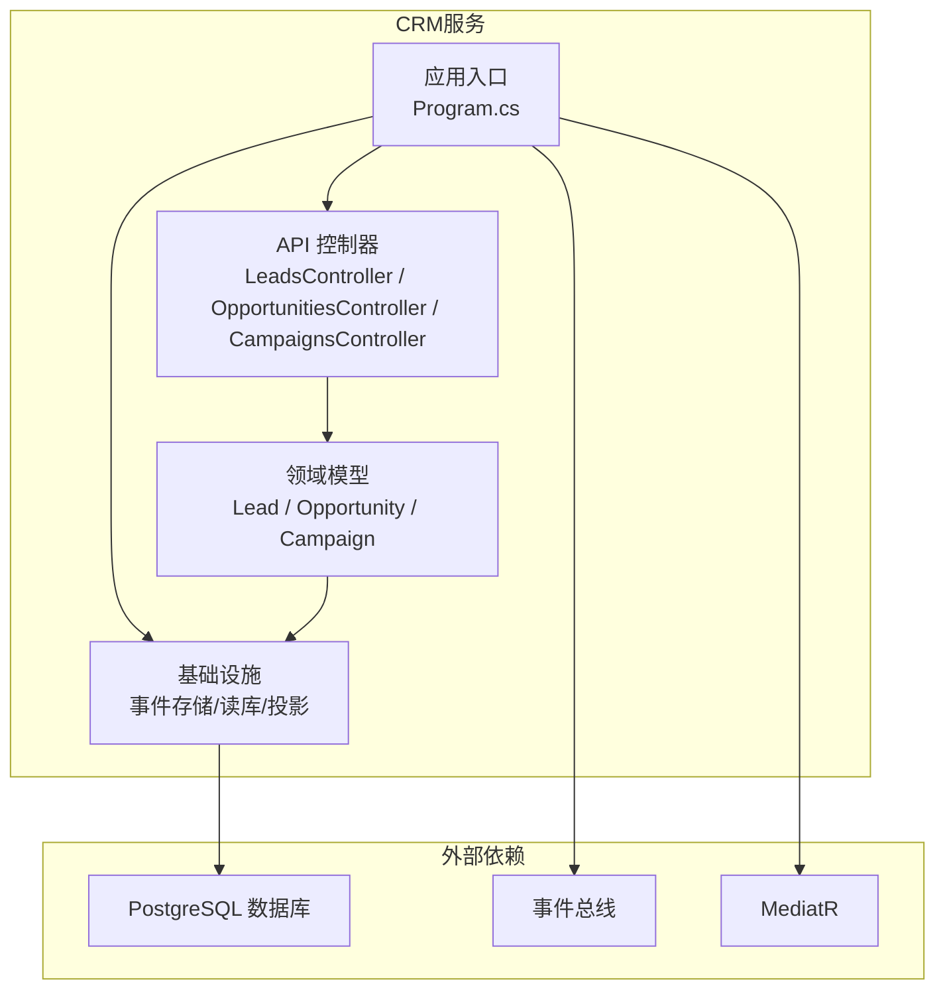
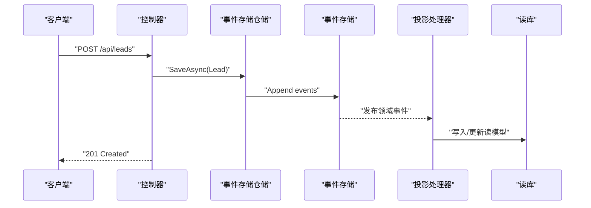
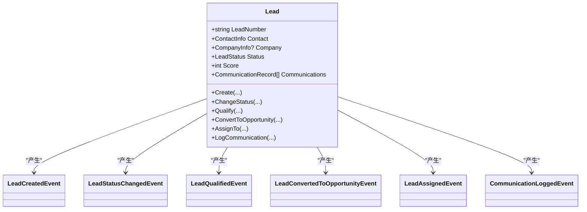
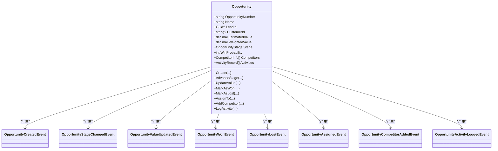
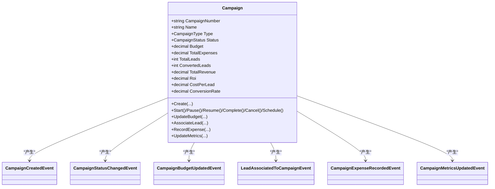
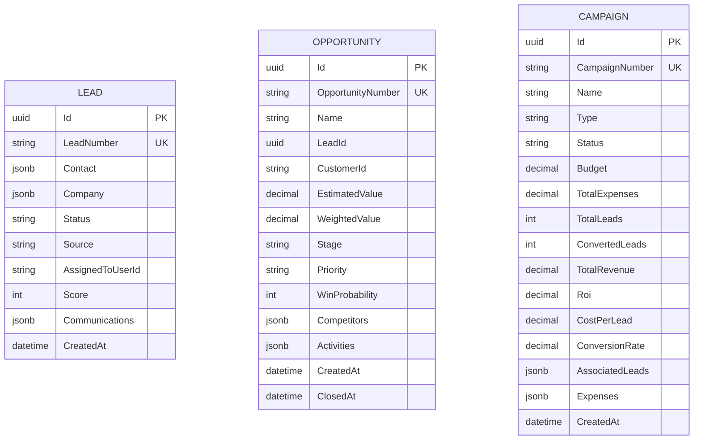
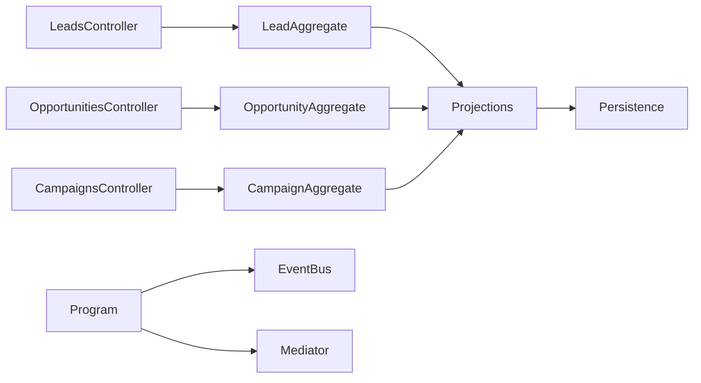
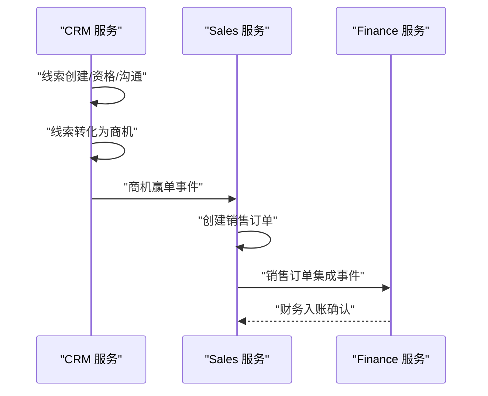

# 客户关系服务

<cite>
**本文引用的文件**
- [Program.cs](file://src/Services/CRM/ErpSystem.CRM/Program.cs)
- [LeadsController.cs](file://src/Services/CRM/ErpSystem.CRM/API/LeadsController.cs)
- [OpportunitiesController.cs](file://src/Services/CRM/ErpSystem.CRM/API/OpportunitiesController.cs)
- [CampaignsController.cs](file://src/Services/CRM/ErpSystem.CRM/API/CampaignsController.cs)
- [LeadAggregate.cs](file://src/Services/CRM/ErpSystem.CRM/Domain/LeadAggregate.cs)
- [OpportunityAggregate.cs](file://src/Services/CRM/ErpSystem.CRM/Domain/OpportunityAggregate.cs)
- [CampaignAggregate.cs](file://src/Services/CRM/ErpSystem.CRM/Domain/CampaignAggregate.cs)
- [Persistence.cs](file://src/Services/CRM/ErpSystem.CRM/Infrastructure/Persistence.cs)
- [Projections.cs](file://src/Services/CRM/ErpSystem.CRM/Infrastructure/Projections.cs)
- [appsettings.json](file://src/Services/CRM/ErpSystem.CRM/appsettings.json)
- [prd.md.resolved](file://src/prd.md.resolved)
</cite>

## 目录
1. [简介](#简介)
2. [项目结构](#项目结构)
3. [核心组件](#核心组件)
4. [架构总览](#架构总览)
5. [详细组件分析](#详细组件分析)
6. [依赖关系分析](#依赖关系分析)
7. [性能考虑](#性能考虑)
8. [故障排查指南](#故障排查指南)
9. [结论](#结论)
10. [附录](#附录)

## 简介
本文件为“客户关系服务”（CRM）的技术文档，聚焦线索管理、商机跟踪、营销活动等销售支持能力。系统采用事件驱动架构，结合事件存储与读模型投影，实现线索聚合、商机聚合、营销活动聚合等领域的数据建模与生命周期管理，并提供销售流程集成能力（如线索到商机的转化、商机到销售订单的衔接）。文档同时给出API接口清单、关键流程序列图、领域模型类图与依赖关系图，帮助开发者快速理解与扩展。

## 项目结构
CRM服务位于独立的微服务工程中，采用分层架构：
- API层：控制器暴露REST接口，负责请求解析与响应封装
- 领域层：聚合根与值对象定义业务规则与状态变迁
- 基础设施层：事件存储、读库、投影处理器
- 公共基础设施：BuildingBlocks提供通用能力（事件总线、MediatR、验证、缓存等）

图表来源
- [Program.cs](file://src/Services/CRM/ErpSystem.CRM/Program.cs#L11-L72)
- [Persistence.cs](file://src/Services/CRM/ErpSystem.CRM/Infrastructure/Persistence.cs#L8-L66)
- [Projections.cs](file://src/Services/CRM/ErpSystem.CRM/Infrastructure/Projections.cs#L9-L341)

章节来源
- [Program.cs](file://src/Services/CRM/ErpSystem.CRM/Program.cs#L11-L72)
- [appsettings.json](file://src/Services/CRM/ErpSystem.CRM/appsettings.json#L8-L10)

## 核心组件
- 事件存储与读库
  - 事件存储DbContext用于持久化事件流，读库DbContext用于查询投影后的只读模型
- 投影处理器
  - 将领域事件转换为读模型，支撑查询与分析
- 控制器
  - 提供线索、商机、营销活动的增删改查与统计分析接口
- 领域模型
  - Lead、Opportunity、Campaign聚合根定义业务状态与行为

章节来源
- [Persistence.cs](file://src/Services/CRM/ErpSystem.CRM/Infrastructure/Persistence.cs#L8-L66)
- [Projections.cs](file://src/Services/CRM/ErpSystem.CRM/Infrastructure/Projections.cs#L9-L341)
- [LeadsController.cs](file://src/Services/CRM/ErpSystem.CRM/API/LeadsController.cs#L11-L200)
- [OpportunitiesController.cs](file://src/Services/CRM/ErpSystem.CRM/API/OpportunitiesController.cs#L11-L251)
- [CampaignsController.cs](file://src/Services/CRM/ErpSystem.CRM/API/CampaignsController.cs#L11-L297)

## 架构总览
系统采用事件溯源与CQRS模式：
- 写模型：聚合根产生领域事件，事件存储持久化事件流
- 读模型：投影处理器监听事件，写入读库，供查询与分析
- API：控制器仅处理命令与查询，不直接访问数据库

图表来源
- [Program.cs](file://src/Services/CRM/ErpSystem.CRM/Program.cs#L32-L41)
- [Projections.cs](file://src/Services/CRM/ErpSystem.CRM/Infrastructure/Projections.cs#L17-L36)
- [LeadsController.cs](file://src/Services/CRM/ErpSystem.CRM/API/LeadsController.cs#L80-L116)

## 详细组件分析

### 线索管理（Leads）
- 职责
  - 创建线索、更新状态、资格评分、分配负责人、记录沟通、转化为商机
- 关键领域事件
  - LeadCreated、LeadStatusChanged、LeadQualified、LeadConvertedToOpportunity、LeadAssigned、CommunicationLogged
- 查询能力
  - 列表过滤（状态/来源/负责人）、详情查询、统计（按状态分组、平均分数）
- API要点
  - POST /api/leads 创建
  - PUT /api/leads/{id}/status 更新状态
  - POST /api/leads/{id}/qualify 资格评分
  - POST /api/leads/{id}/convert 转化为商机
  - PUT /api/leads/{id}/assign 分配负责人
  - POST /api/leads/{id}/communications 记录沟通

图表来源
- [LeadAggregate.cs](file://src/Services/CRM/ErpSystem.CRM/Domain/LeadAggregate.cs#L170-L304)

章节来源
- [LeadsController.cs](file://src/Services/CRM/ErpSystem.CRM/API/LeadsController.cs#L11-L200)
- [LeadAggregate.cs](file://src/Services/CRM/ErpSystem.CRM/Domain/LeadAggregate.cs#L170-L304)
- [Projections.cs](file://src/Services/CRM/ErpSystem.CRM/Infrastructure/Projections.cs#L17-L96)

### 商机管理（Opportunities）
- 职责
  - 创建商机、推进销售阶段、更新金额、标记赢单/输单、分配负责人、记录活动、记录竞争对手
- 关键领域事件
  - OpportunityCreated、OpportunityStageChanged、OpportunityValueUpdated、OpportunityWon、OpportunityLost、OpportunityAssigned、OpportunityCompetitorAdded、OpportunityActivityLogged
- 查询能力
  - 销售漏斗（按阶段统计数量/金额/加权价值）、胜率分析（按时间段统计）
- API要点
  - GET /api/opportunities/pipeline 销售漏斗
  - GET /api/opportunities/analysis 胜负分析
  - PUT /api/opportunities/{id}/stage 推进阶段
  - PUT /api/opportunities/{id}/value 更新金额
  - POST /api/opportunities/{id}/won/mark 赢单
  - POST /api/opportunities/{id}/lost/mark 输单
  - POST /api/opportunities/{id}/activities 记录活动
  - POST /api/opportunities/{id}/competitors 添加竞争对手

图表来源
- [OpportunityAggregate.cs](file://src/Services/CRM/ErpSystem.CRM/Domain/OpportunityAggregate.cs#L162-L344)

章节来源
- [OpportunitiesController.cs](file://src/Services/CRM/ErpSystem.CRM/API/OpportunitiesController.cs#L11-L251)
- [OpportunityAggregate.cs](file://src/Services/CRM/ErpSystem.CRM/Domain/OpportunityAggregate.cs#L162-L344)
- [Projections.cs](file://src/Services/CRM/ErpSystem.CRM/Infrastructure/Projections.cs#L112-L226)

### 营销活动（Campaigns）
- 职责
  - 创建活动、启动/暂停/恢复/完成/取消、预算调整、关联线索、记录支出、更新指标
- 关键领域事件
  - CampaignCreated、CampaignStatusChanged、CampaignBudgetUpdated、LeadAssociatedToCampaign、CampaignExpenseRecorded、CampaignMetricsUpdated
- 查询能力
  - ROI分析（单项与汇总）、活动列表与筛选
- API要点
  - POST /api/campaigns 创建
  - POST /api/campaigns/{id}/start 启动
  - POST /api/campaigns/{id}/pause 暂停
  - POST /api/campaigns/{id}/resume 恢复
  - POST /api/campaigns/{id}/complete 完成
  - POST /api/campaigns/{id}/cancel 取消
  - POST /api/campaigns/{id}/schedule 调度
  - PUT /api/campaigns/{id}/budget 预算调整
  - POST /api/campaigns/{id}/leads 关联线索
  - POST /api/campaigns/{id}/expenses 记录支出
  - PUT /api/campaigns/{id}/metrics 更新指标
  - GET /api/campaigns/{id}/roi 单项ROI
  - GET /api/campaigns/roi-summary 汇总ROI

图表来源
- [CampaignAggregate.cs](file://src/Services/CRM/ErpSystem.CRM/Domain/CampaignAggregate.cs#L139-L337)

章节来源
- [CampaignsController.cs](file://src/Services/CRM/ErpSystem.CRM/API/CampaignsController.cs#L11-L297)
- [CampaignAggregate.cs](file://src/Services/CRM/ErpSystem.CRM/Domain/CampaignAggregate.cs#L139-L337)
- [Projections.cs](file://src/Services/CRM/ErpSystem.CRM/Infrastructure/Projections.cs#L240-L339)

### 数据模型与读库投影
- 读模型
  - LeadReadModel、OpportunityReadModel、CampaignReadModel分别映射聚合当前状态
- 投影策略
  - 事件到读模型的增量更新，JSONB字段存储复杂值对象与集合
- 索引设计
  - 为常用查询维度建立索引（如线索状态、商机阶段、活动状态等）

图表来源
- [Persistence.cs](file://src/Services/CRM/ErpSystem.CRM/Infrastructure/Persistence.cs#L72-L143)
- [Projections.cs](file://src/Services/CRM/ErpSystem.CRM/Infrastructure/Projections.cs#L17-L339)

章节来源
- [Persistence.cs](file://src/Services/CRM/ErpSystem.CRM/Infrastructure/Persistence.cs#L26-L66)
- [Projections.cs](file://src/Services/CRM/ErpSystem.CRM/Infrastructure/Projections.cs#L9-L341)

## 依赖关系分析
- 组件耦合
  - 控制器依赖事件存储仓储与读库；聚合根仅依赖领域事件接口；投影处理器依赖读库
- 外部依赖
  - PostgreSQL作为事件存储与读库；Dapr事件总线；MediatR用于命令/查询编排
- 循环依赖
  - 未发现循环依赖；领域层不依赖基础设施层

图表来源
- [Program.cs](file://src/Services/CRM/ErpSystem.CRM/Program.cs#L23-L41)
- [Projections.cs](file://src/Services/CRM/ErpSystem.CRM/Infrastructure/Projections.cs#L9-L341)

章节来源
- [Program.cs](file://src/Services/CRM/ErpSystem.CRM/Program.cs#L18-L41)
- [Persistence.cs](file://src/Services/CRM/ErpSystem.CRM/Infrastructure/Persistence.cs#L8-L20)

## 性能考虑
- 事件存储
  - 使用JSONB存储事件载荷，支持高效追加与查询
- 读库优化
  - 对高频查询字段建立索引；投影时进行派生指标的增量计算
- 并发与一致性
  - 事件版本号保证聚合一致性；投影异步执行，避免阻塞写入
- API分页
  - 列表查询支持分页与过滤，降低单次返回量

## 故障排查指南
- 数据库连接
  - 检查连接字符串是否正确；确保数据库存在且可访问
- 事件总线
  - 确认事件总线服务可用；检查订阅配置
- 投影异常
  - 查看投影处理器日志；确认读库实体映射与JSON序列化正确
- API错误
  - 核对请求参数与枚举值范围；关注状态流转约束（如已关闭的商机不可再推进）

章节来源
- [appsettings.json](file://src/Services/CRM/ErpSystem.CRM/appsettings.json#L8-L10)
- [Program.cs](file://src/Services/CRM/ErpSystem.CRM/Program.cs#L52-L60)

## 结论
CRM服务以事件驱动为核心，通过清晰的领域模型与投影机制，实现了线索、商机、营销活动的全生命周期管理，并提供销售漏斗、胜率分析、ROI评估等关键分析能力。结合Sales服务，可实现从线索到销售订单的闭环集成。建议后续扩展：批量导入、跟进提醒、实时通知、GraphQL聚合查询等。

## 附录

### API接口清单（概览）
- 线索（Leads）
  - GET /api/leads、GET /api/leads/{id}、GET /api/leads/statistics
  - POST /api/leads
  - PUT /api/leads/{id}/status、POST /api/leads/{id}/qualify
  - POST /api/leads/{id}/convert、PUT /api/leads/{id}/assign
  - POST /api/leads/{id}/communications
- 商机（Opportunities）
  - GET /api/opportunities、GET /api/opportunities/{id}
  - GET /api/opportunities/pipeline、GET /api/opportunities/analysis
  - POST /api/opportunities
  - PUT /api/opportunities/{id}/stage、PUT /api/opportunities/{id}/value
  - POST /api/opportunities/{id}/won、POST /api/opportunities/{id}/lost
  - PUT /api/opportunities/{id}/assign
  - POST /api/opportunities/{id}/competitors、POST /api/opportunities/{id}/activities
- 营销活动（Campaigns）
  - GET /api/campaigns、GET /api/campaigns/{id}
  - GET /api/campaigns/{id}/roi、GET /api/campaigns/roi-summary
  - POST /api/campaigns
  - POST /api/campaigns/{id}/start、POST /api/campaigns/{id}/pause
  - POST /api/campaigns/{id}/resume、POST /api/campaigns/{id}/complete
  - POST /api/campaigns/{id}/cancel、POST /api/campaigns/{id}/schedule
  - PUT /api/campaigns/{id}/budget
  - POST /api/campaigns/{id}/leads、POST /api/campaigns/{id}/expenses
  - PUT /api/campaigns/{id}/metrics

章节来源
- [LeadsController.cs](file://src/Services/CRM/ErpSystem.CRM/API/LeadsController.cs#L18-L197)
- [OpportunitiesController.cs](file://src/Services/CRM/ErpSystem.CRM/API/OpportunitiesController.cs#L18-L248)
- [CampaignsController.cs](file://src/Services/CRM/ErpSystem.CRM/API/CampaignsController.cs#L18-L294)

### 销售流程集成（线索→商机→销售）

图表来源
- [prd.md.resolved](file://src/prd.md.resolved#L423-L427)
- [LeadAggregate.cs](file://src/Services/CRM/ErpSystem.CRM/Domain/LeadAggregate.cs#L222-L236)
- [OpportunityAggregate.cs](file://src/Services/CRM/ErpSystem.CRM/Domain/OpportunityAggregate.cs#L233-L241)