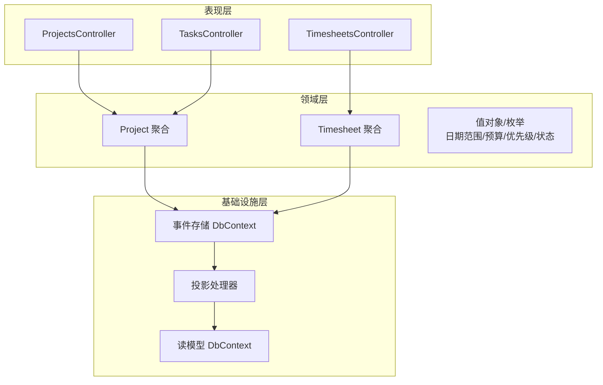
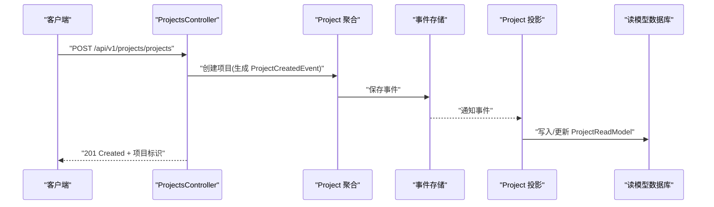
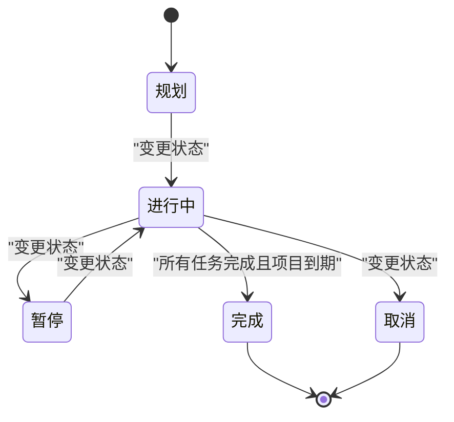
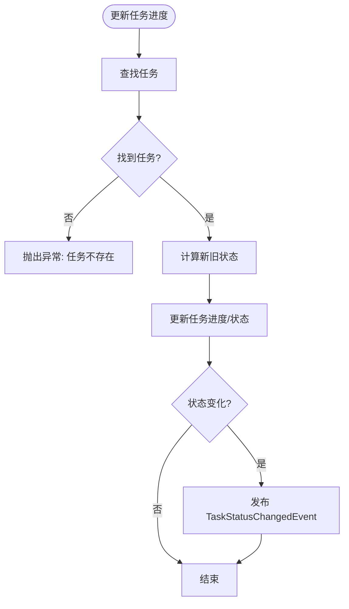
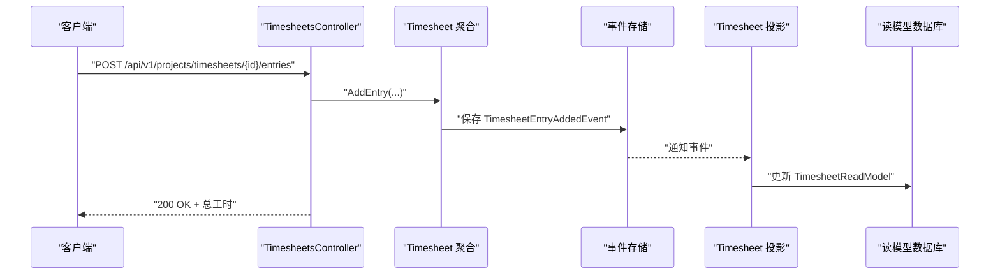
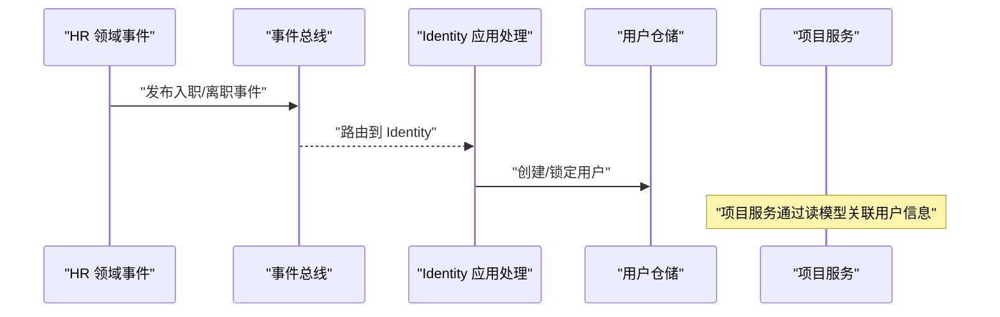
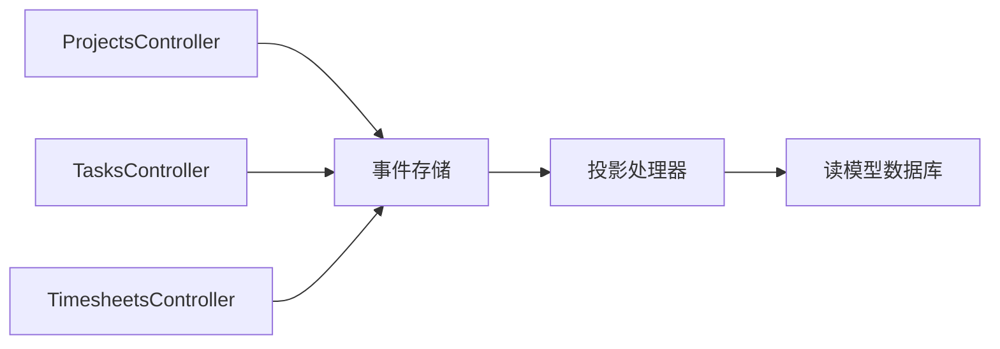

# 项目服务

<cite>
**本文引用的文件**
- [Program.cs](file://src/Services/Projects/ErpSystem.Projects/Program.cs)
- [ProjectsController.cs](file://src/Services/Projects/ErpSystem.Projects/API/ProjectsController.cs)
- [TasksController.cs](file://src/Services/Projects/ErpSystem.Projects/API/TasksController.cs)
- [TimesheetsController.cs](file://src/Services/Projects/ErpSystem.Projects/API/TimesheetsController.cs)
- [ProjectAggregate.cs](file://src/Services/Projects/ErpSystem.Projects/Domain/ProjectAggregate.cs)
- [TimesheetAggregate.cs](file://src/Services/Projects/ErpSystem.Projects/Domain/TimesheetAggregate.cs)
- [Persistence.cs](file://src/Services/Projects/ErpSystem.Projects/Infrastructure/Persistence.cs)
- [Projections.cs](file://src/Services/Projects/ErpSystem.Projects/Infrastructure/Projections.cs)
- [appsettings.json](file://src/Services/Projects/ErpSystem.Projects/appsettings.json)
- [EmployeeAggregate.cs](file://src/Services/HR/ErpSystem.HR/Domain/EmployeeAggregate.cs)
- [HREvents.cs](file://src/Services/HR/ErpSystem.HR/Domain/HREvents.cs)
- [HRIntegrationEvents.cs](file://src/Services/Identity/ErpSystem.Identity/Application/IntegrationEvents/HRIntegrationEvents.cs)
- [IntegrationEventHandlers.cs](file://src/Services/Identity/ErpSystem.Identity/Application/IntegrationEventHandlers.cs)
</cite>

## 目录
1. [简介](#简介)
2. [项目结构](#项目结构)
3. [核心组件](#核心组件)
4. [架构总览](#架构总览)
5. [详细组件分析](#详细组件分析)
6. [依赖关系分析](#依赖关系分析)
7. [性能考量](#性能考量)
8. [故障排查指南](#故障排查指南)
9. [结论](#结论)
10. [附录：API 接口文档](#附录api-接口文档)

## 简介
本文件为“项目服务”的全面技术文档，覆盖项目管理、任务管理、工时跟踪与审批、项目与工时聚合统计、项目生命周期与状态转换、以及与人力资源（HR）系统的集成机制。文档同时给出系统架构图、组件交互序列图、状态机图与流程图，帮助读者从高层到代码级全面理解项目服务的设计与实现。

## 项目结构
项目服务采用微服务分层架构，包含以下关键层次：
- 表现层（API 控制器）：提供 REST 接口，负责请求解析与响应封装
- 领域层（聚合与值对象）：定义业务规则、状态与事件
- 基础设施层（事件存储与读模型投影）：持久化事件流与构建只读视图
- 配置与启动：依赖注入、事件总线、MediatR、EF Core

图表来源
- [Program.cs](file://src/Services/Projects/ErpSystem.Projects/Program.cs#L1-L49)
- [ProjectsController.cs](file://src/Services/Projects/ErpSystem.Projects/API/ProjectsController.cs#L1-L163)
- [TasksController.cs](file://src/Services/Projects/ErpSystem.Projects/API/TasksController.cs#L1-L102)
- [TimesheetsController.cs](file://src/Services/Projects/ErpSystem.Projects/API/TimesheetsController.cs#L1-L141)
- [ProjectAggregate.cs](file://src/Services/Projects/ErpSystem.Projects/Domain/ProjectAggregate.cs#L1-L451)
- [TimesheetAggregate.cs](file://src/Services/Projects/ErpSystem.Projects/Domain/TimesheetAggregate.cs#L1-L218)
- [Persistence.cs](file://src/Services/Projects/ErpSystem.Projects/Infrastructure/Persistence.cs#L1-L127)
- [Projections.cs](file://src/Services/Projects/ErpSystem.Projects/Infrastructure/Projections.cs#L1-L220)

章节来源
- [Program.cs](file://src/Services/Projects/ErpSystem.Projects/Program.cs#L1-L49)
- [appsettings.json](file://src/Services/Projects/ErpSystem.Projects/appsettings.json#L1-L12)

## 核心组件
- 项目聚合（Project）：管理项目基本信息、状态、预算、里程碑、团队成员与任务集合；通过领域事件驱动读模型更新
- 工时聚合（Timesheet）：管理周工时表的生命周期（草稿/提交/审批/拒绝），支持按任务记录工时条目
- 控制器层：提供项目、任务、工时的 CRUD 与状态变更接口
- 投影层：监听领域事件，写入读模型数据库，支撑查询与报表
- 事件存储：基于 EF Core 的事件流表，使用 jsonb 存放事件载荷

章节来源
- [ProjectAggregate.cs](file://src/Services/Projects/ErpSystem.Projects/Domain/ProjectAggregate.cs#L280-L451)
- [TimesheetAggregate.cs](file://src/Services/Projects/ErpSystem.Projects/Domain/TimesheetAggregate.cs#L105-L218)
- [ProjectsController.cs](file://src/Services/Projects/ErpSystem.Projects/API/ProjectsController.cs#L1-L163)
- [TasksController.cs](file://src/Services/Projects/ErpSystem.Projects/API/TasksController.cs#L1-L102)
- [TimesheetsController.cs](file://src/Services/Projects/ErpSystem.Projects/API/TimesheetsController.cs#L1-L141)
- [Projections.cs](file://src/Services/Projects/ErpSystem.Projects/Infrastructure/Projections.cs#L1-L220)
- [Persistence.cs](file://src/Services/Projects/ErpSystem.Projects/Infrastructure/Persistence.cs#L1-L127)

## 架构总览
项目服务采用事件溯源与 CQRS 模式：
- 写模型：控制器接收请求，调用聚合根产生领域事件，事件存储持久化事件流
- 读模型：投影处理器监听事件，更新只读数据库中的读模型
- 查询：控制器直接查询读模型数据库，返回聚合后的结果

图表来源
- [ProjectsController.cs](file://src/Services/Projects/ErpSystem.Projects/API/ProjectsController.cs#L39-L60)
- [ProjectAggregate.cs](file://src/Services/Projects/ErpSystem.Projects/Domain/ProjectAggregate.cs#L306-L327)
- [Projections.cs](file://src/Services/Projects/ErpSystem.Projects/Infrastructure/Projections.cs#L19-L41)
- [Persistence.cs](file://src/Services/Projects/ErpSystem.Projects/Infrastructure/Persistence.cs#L8-L20)

## 详细组件分析

### 项目聚合与生命周期
- 关键状态：规划（Planning）、进行中（InProgress）、暂停（OnHold）、完成（Completed）、取消（Cancelled）
- 生命周期事件：创建、状态变更、任务添加、里程碑添加、成员加入、预算更新
- 进度计算：基于任务进度百分比的平均值
- 预算控制：支持预算更新事件，读模型同步最新预算

图表来源
- [ProjectAggregate.cs](file://src/Services/Projects/ErpSystem.Projects/Domain/ProjectAggregate.cs#L7-L41)
- [ProjectAggregate.cs](file://src/Services/Projects/ErpSystem.Projects/Domain/ProjectAggregate.cs#L405-L447)

章节来源
- [ProjectAggregate.cs](file://src/Services/Projects/ErpSystem.Projects/Domain/ProjectAggregate.cs#L280-L451)

### 任务管理与进度跟踪
- 任务状态：打开（Open）、进行中（InProgress）、审查中（InReview）、完成（Completed）、取消（Cancelled）
- 进度推进规则：进度达 100% 自动进入 InReview；从 Open 到 InProgress 的触发条件
- 支持按项目、负责人、状态查询，看板视图按状态分栏

图表来源
- [ProjectAggregate.cs](file://src/Services/Projects/ErpSystem.Projects/Domain/ProjectAggregate.cs#L350-L360)

章节来源
- [TasksController.cs](file://src/Services/Projects/ErpSystem.Projects/API/TasksController.cs#L1-L102)
- [ProjectAggregate.cs](file://src/Services/Projects/ErpSystem.Projects/Domain/ProjectAggregate.cs#L175-L246)

### 工时跟踪与审批
- 工时表状态：草稿（Draft）、提交（Submitted）、批准（Approved）、拒绝（Rejected）
- 工时条目约束：每周内工作日、单日工时 0~24 小时
- 审批流程：提交前必须有条目；仅提交态可批准或拒绝；拒绝需原因

图表来源
- [TimesheetsController.cs](file://src/Services/Projects/ErpSystem.Projects/API/TimesheetsController.cs#L56-L65)
- [TimesheetAggregate.cs](file://src/Services/Projects/ErpSystem.Projects/Domain/TimesheetAggregate.cs#L138-L148)
- [Projections.cs](file://src/Services/Projects/ErpSystem.Projects/Infrastructure/Projections.cs#L171-L182)

章节来源
- [TimesheetsController.cs](file://src/Services/Projects/ErpSystem.Projects/API/TimesheetsController.cs#L1-L141)
- [TimesheetAggregate.cs](file://src/Services/Projects/ErpSystem.Projects/Domain/TimesheetAggregate.cs#L105-L218)

### 项目与工时聚合统计
- 项目统计：总数、各状态数量、总预算、平均进度
- 工时汇总：按项目统计已批准工时总数、条目数、按用户分组统计
- 读模型字段：JSONB 存放里程碑与团队成员列表，便于灵活扩展

章节来源
- [ProjectsController.cs](file://src/Services/Projects/ErpSystem.Projects/API/ProjectsController.cs#L115-L129)
- [TimesheetsController.cs](file://src/Services/Projects/ErpSystem.Projects/API/TimesheetsController.cs#L110-L127)
- [Persistence.cs](file://src/Services/Projects/ErpSystem.Projects/Infrastructure/Persistence.cs#L67-L124)

### 与人力资源（HR）的集成
- HR 侧事件：员工入职、调动、晋升、离职等事件
- 集成事件：HR 向身份（Identity）服务发布集成事件
- Identity 侧处理：自动创建用户账户、锁定终止员工账户
- 项目侧影响：通过读模型与用户信息联动，用于任务分配、团队成员管理与权限校验

图表来源
- [HREvents.cs](file://src/Services/HR/ErpSystem.HR/Domain/HREvents.cs#L5-L21)
- [HRIntegrationEvents.cs](file://src/Services/Identity/ErpSystem.Identity/Application/IntegrationEvents/HRIntegrationEvents.cs#L5-L21)
- [IntegrationEventHandlers.cs](file://src/Services/Identity/ErpSystem.Identity/Application/IntegrationEventHandlers.cs#L8-L31)

章节来源
- [EmployeeAggregate.cs](file://src/Services/HR/ErpSystem.HR/Domain/EmployeeAggregate.cs#L76-L151)
- [HREvents.cs](file://src/Services/HR/ErpSystem.HR/Domain/HREvents.cs#L1-L21)
- [HRIntegrationEvents.cs](file://src/Services/Identity/ErpSystem.Identity/Application/IntegrationEvents/HRIntegrationEvents.cs#L1-L21)
- [IntegrationEventHandlers.cs](file://src/Services/Identity/ErpSystem.Identity/Application/IntegrationEventHandlers.cs#L1-L39)

## 依赖关系分析
- 控制器依赖事件存储与读模型上下文
- 聚合依赖事件总线与发布器以发布领域事件
- 投影依赖 MediatR 的通知接口，监听事件并更新读模型
- 数据库：事件存储与读模型分离，读模型索引优化查询

图表来源
- [Program.cs](file://src/Services/Projects/ErpSystem.Projects/Program.cs#L15-L30)
- [Projections.cs](file://src/Services/Projects/ErpSystem.Projects/Infrastructure/Projections.cs#L1-L220)
- [Persistence.cs](file://src/Services/Projects/ErpSystem.Projects/Infrastructure/Persistence.cs#L1-L127)

章节来源
- [Program.cs](file://src/Services/Projects/ErpSystem.Projects/Program.cs#L1-L49)
- [Persistence.cs](file://src/Services/Projects/ErpSystem.Projects/Infrastructure/Persistence.cs#L1-L127)

## 性能考量
- 事件存储：使用 jsonb 存放事件载荷，支持高吞吐事件写入
- 读模型：针对高频查询建立索引（项目编号、状态、负责人、工时状态等）
- 投影：异步处理事件，避免阻塞写入路径
- 分页与筛选：控制器对读模型查询支持分页与多维过滤，降低一次性返回量

## 故障排查指南
- 事件未入库：检查事件存储 DbContext 配置与连接字符串
- 读模型不同步：确认投影处理器已注册并运行，事件总线正确路由事件
- 工时提交失败：核对工时状态是否为草稿或被拒绝；是否包含条目；工作日是否在当周范围内
- 任务进度异常：确认任务存在且进度值在 0~100 区间；状态转换逻辑是否触发

章节来源
- [appsettings.json](file://src/Services/Projects/ErpSystem.Projects/appsettings.json#L9-L11)
- [TimesheetAggregate.cs](file://src/Services/Projects/ErpSystem.Projects/Domain/TimesheetAggregate.cs#L140-L158)
- [ProjectAggregate.cs](file://src/Services/Projects/ErpSystem.Projects/Domain/ProjectAggregate.cs#L220-L232)

## 结论
项目服务通过事件溯源与 CQRS 实现了清晰的职责分离与强一致的读写隔离。项目聚合与工时聚合分别承载项目计划、任务分解、资源分配与进度跟踪、工时记录与审批的核心业务。读模型与投影机制提供了高性能的查询能力，并为后续的预算控制、进度预测与资源优化奠定了基础。与 HR 的集成则确保项目资源（人员）信息的实时一致性，提升资源利用率与合规性。

## 附录：API 接口文档

### 项目管理
- 获取项目列表
  - 方法：GET
  - 路径：/api/v1/projects/projects
  - 查询参数：status、type、managerId
  - 返回：项目数组与总数
- 获取单个项目
  - 方法：GET
  - 路径：/api/v1/projects/projects/{id}
  - 返回：项目详情
- 创建项目
  - 方法：POST
  - 路径：/api/v1/projects/projects
  - 请求体：名称、类型、起止日期、预算、币种、项目经理、客户、描述
  - 返回：项目标识与编号
- 变更项目状态
  - 方法：PUT
  - 路径：/api/v1/projects/projects/{id}/status
  - 请求体：新状态
  - 返回：状态变更结果
- 添加任务
  - 方法：POST
  - 路径：/api/v1/projects/projects/{id}/tasks
  - 请求体：标题、描述、优先级、截止日期、负责人、预估工时、父任务ID
  - 返回：任务标识
- 添加里程碑
  - 方法：POST
  - 路径：/api/v1/projects/projects/{id}/milestones
  - 请求体：名称、截止日期、描述
  - 返回：里程碑标识
- 添加团队成员
  - 方法：POST
  - 路径：/api/v1/projects/projects/{id}/team-members
  - 请求体：用户ID、角色
  - 返回：空
- 项目统计
  - 方法：GET
  - 路径：/api/v1/projects/projects/statistics
  - 返回：总数、各状态数量、总预算、平均进度

章节来源
- [ProjectsController.cs](file://src/Services/Projects/ErpSystem.Projects/API/ProjectsController.cs#L13-L129)

### 任务管理
- 获取任务列表
  - 方法：GET
  - 路径：/api/v1/projects/tasks
  - 查询参数：projectId、status、assigneeId
  - 返回：任务数组与总数
- 获取单个任务
  - 方法：GET
  - 路径：/api/v1/projects/tasks/{id}
  - 返回：任务详情
- 更新任务进度
  - 方法：PUT
  - 路径：/api/v1/projects/tasks/{id}/progress
  - 请求体：进度百分比
  - 返回：进度更新结果
- 完成任务
  - 方法：POST
  - 路径：/api/v1/projects/tasks/{id}/complete
  - 请求体：实际工时
  - 返回：完成标记
- 看板视图
  - 方法：GET
  - 路径：/api/v1/projects/tasks/kanban/{projectId}
  - 返回：按状态分栏的任务集合
- 我的任务
  - 方法：GET
  - 路径：/api/v1/projects/tasks/my-tasks
  - 查询参数：userId
  - 返回：未完成任务按截止日期排序

章节来源
- [TasksController.cs](file://src/Services/Projects/ErpSystem.Projects/API/TasksController.cs#L13-L92)

### 工时管理
- 获取工时列表
  - 方法：GET
  - 路径：/api/v1/projects/timesheets
  - 查询参数：projectId、userId、status
  - 返回：工时数组与总数
- 获取单个工时
  - 方法：GET
  - 路径：/api/v1/projects/timesheets/{id}
  - 返回：工时详情
- 创建工时
  - 方法：POST
  - 路径：/api/v1/projects/timesheets
  - 请求体：项目ID、用户ID、周起始日期
  - 返回：工时标识与编号
- 添加工时条目
  - 方法：POST
  - 路径：/api/v1/projects/timesheets/{id}/entries
  - 请求体：任务ID、工作日期、工时、描述
  - 返回：工时ID与总工时
- 提交工时
  - 方法：POST
  - 路径：/api/v1/projects/timesheets/{id}/submit
  - 返回：状态变更
- 批准工时
  - 方法：POST
  - 路径：/api/v1/projects/timesheets/{id}/approve
  - 请求体：批准人ID
  - 返回：状态变更
- 拒绝工时
  - 方法：POST
  - 路径：/api/v1/projects/timesheets/{id}/reject
  - 请求体：拒绝人ID、原因
  - 返回：状态变更
- 待审批工时
  - 方法：GET
  - 路径：/api/v1/projects/timesheets/pending-approval
  - 返回：按提交时间排序的待审列表
- 工时汇总
  - 方法：GET
  - 路径：/api/v1/projects/timesheets/summary
  - 查询参数：projectId
  - 返回：总工时、条目数、按用户分组的工时统计

章节来源
- [TimesheetsController.cs](file://src/Services/Projects/ErpSystem.Projects/API/TimesheetsController.cs#L13-L127)