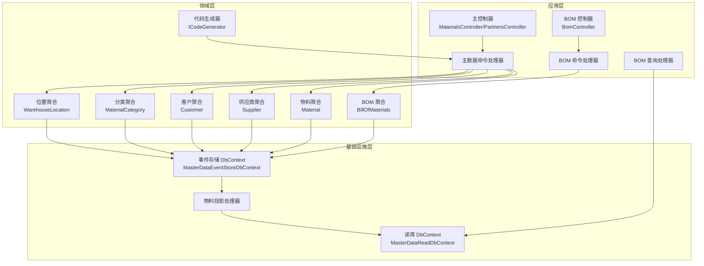
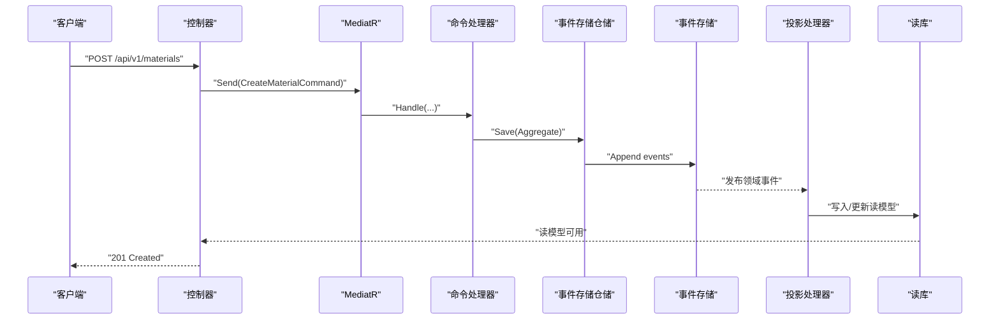
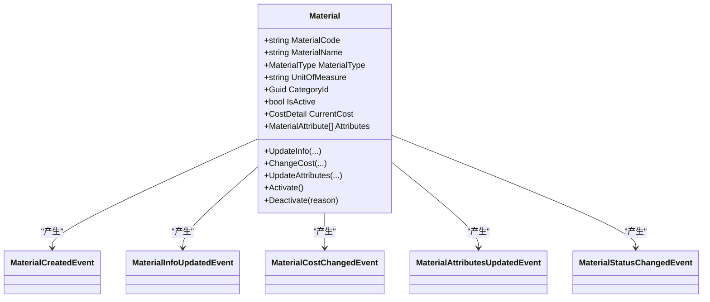
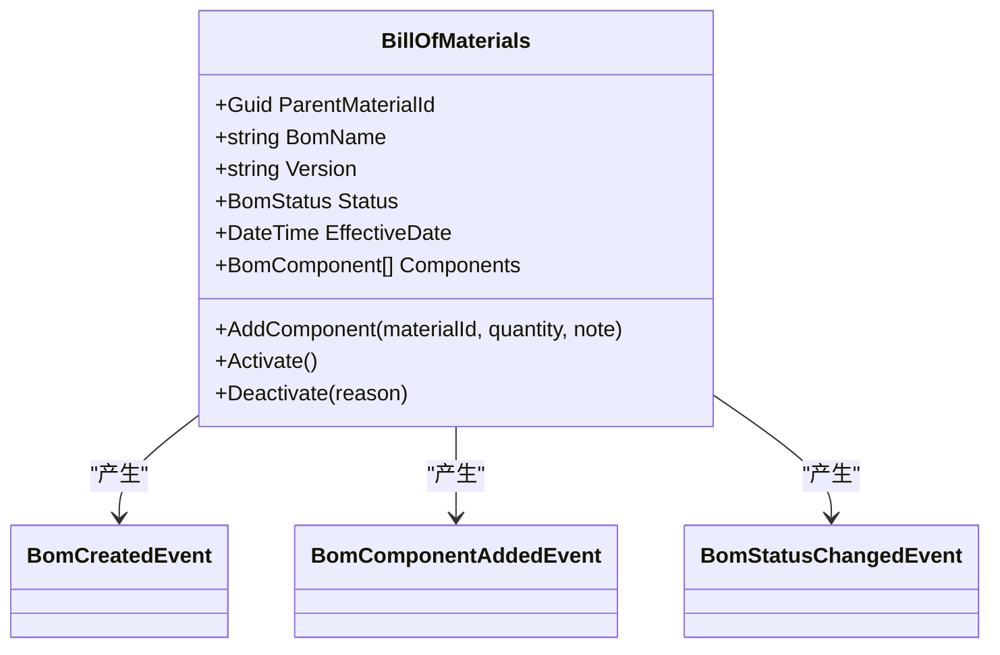
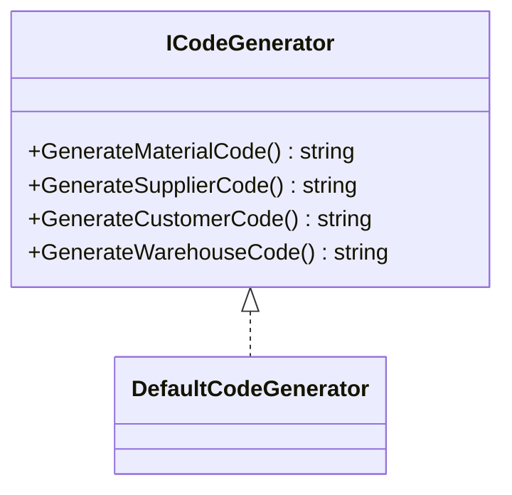
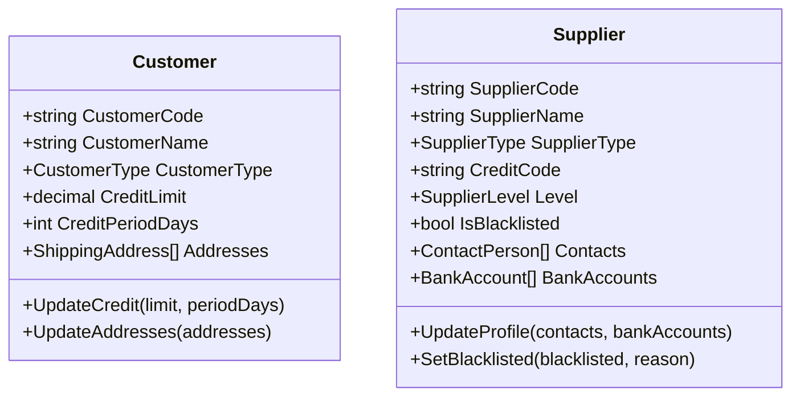
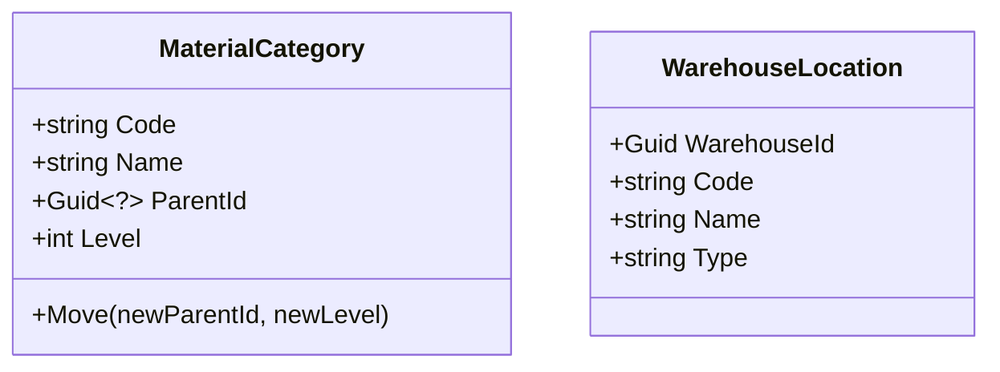
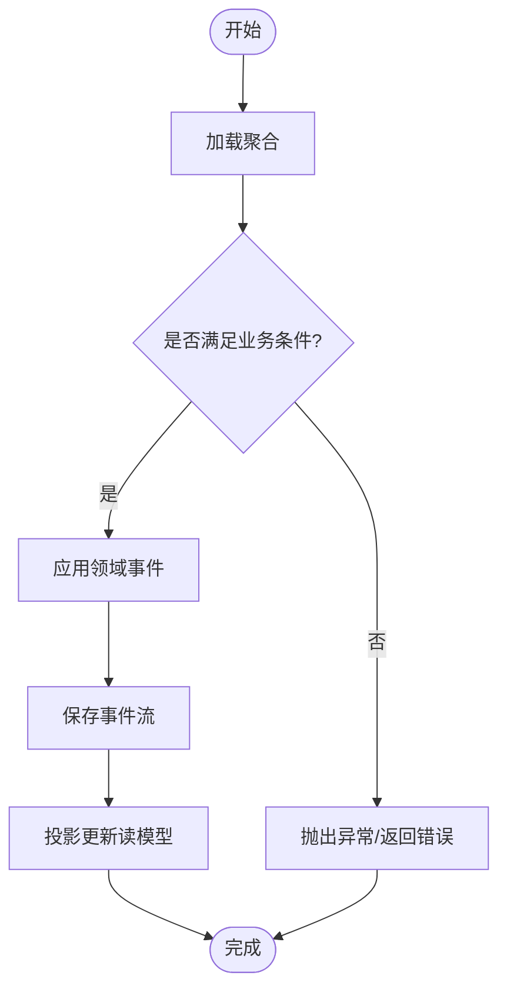
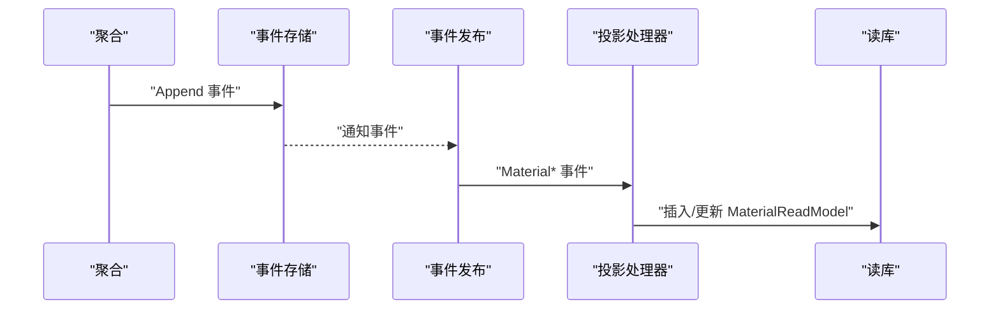

# 主数据服务

<cite>
**本文引用的文件**
- [Program.cs](file://src/Services/MasterData/ErpSystem.MasterData/Program.cs)
- [MasterControllers.cs](file://src/Services/MasterData/ErpSystem.MasterData/Controllers/MasterControllers.cs)
- [BOMController.cs](file://src/Services/MasterData/ErpSystem.MasterData/Controllers/BOMController.cs)
- [MasterCommands.cs](file://src/Services/MasterData/ErpSystem.MasterData/Application/MasterCommands.cs)
- [BOMCommands.cs](file://src/Services/MasterData/ErpSystem.MasterData/Application/BOMCommands.cs)
- [MaterialAggregate.cs](file://src/Services/MasterData/ErpSystem.MasterData/Domain/MaterialAggregate.cs)
- [BillOfMaterialsAggregate.cs](file://src/Services/MasterData/ErpSystem.MasterData/Domain/BillOfMaterialsAggregate.cs)
- [CodeGenerator.cs](file://src/Services/MasterData/ErpSystem.MasterData/Domain/CodeGenerator.cs)
- [EventStore.cs](file://src/Services/MasterData/ErpSystem.MasterData/Infrastructure/EventStore.cs)
- [MaterialProjections.cs](file://src/Services/MasterData/ErpSystem.MasterData/Infrastructure/MaterialProjections.cs)
- [BOMQueries.cs](file://src/Services/MasterData/ErpSystem.MasterData/Application/BOMQueries.cs)
- [CustomerAggregate.cs](file://src/Services/MasterData/ErpSystem.MasterData/Domain/CustomerAggregate.cs)
- [SupplierAggregate.cs](file://src/Services/MasterData/ErpSystem.MasterData/Domain/SupplierAggregate.cs)
- [CategoryAggregate.cs](file://src/Services/MasterData/ErpSystem.MasterData/Domain/CategoryAggregate.cs)
- [LocationAggregate.cs](file://src/Services/MasterData/ErpSystem.MasterData/Domain/LocationAggregate.cs)
</cite>

## 目录
1. [简介](#简介)
2. [项目结构](#项目结构)
3. [核心组件](#核心组件)
4. [架构总览](#架构总览)
5. [详细组件分析](#详细组件分析)
6. [依赖关系分析](#依赖关系分析)
7. [性能考虑](#性能考虑)
8. [故障排查指南](#故障排查指南)
9. [结论](#结论)
10. [附录：API 接口文档](#附录api-接口文档)

## 简介
本文件为 ERP 微服务系统中“主数据服务”的完整技术文档，覆盖物料、客户、供应商、仓库与位置、分类、BOM（物料清单）等核心主数据能力。文档从架构设计、聚合建模、命令与查询处理、事件存储与投影、到 API 规范与故障排查进行系统化阐述，并给出面向非技术读者的可读性说明。

## 项目结构
主数据服务采用分层与聚合驱动的架构组织：
- 应用层：命令与查询定义、处理器、控制器
- 领域层：聚合根与值对象、领域事件、业务规则
- 基础设施层：事件存储、读模型投影、数据库上下文
- 公共构建块：CQRS、MediatR、事件总线、幂等、日志、性能与重试策略等

图表来源
- [Program.cs](file://src/Services/MasterData/ErpSystem.MasterData/Program.cs#L1-L68)
- [MasterControllers.cs](file://src/Services/MasterData/ErpSystem.MasterData/Controllers/MasterControllers.cs#L1-L79)
- [BOMController.cs](file://src/Services/MasterData/ErpSystem.MasterData/Controllers/BOMController.cs#L1-L54)
- [MasterCommands.cs](file://src/Services/MasterData/ErpSystem.MasterData/Application/MasterCommands.cs#L1-L110)
- [BOMCommands.cs](file://src/Services/MasterData/ErpSystem.MasterData/Application/BOMCommands.cs#L1-L49)
- [MaterialAggregate.cs](file://src/Services/MasterData/ErpSystem.MasterData/Domain/MaterialAggregate.cs#L1-L178)
- [SupplierAggregate.cs](file://src/Services/MasterData/ErpSystem.MasterData/Domain/SupplierAggregate.cs#L1-L125)
- [CustomerAggregate.cs](file://src/Services/MasterData/ErpSystem.MasterData/Domain/CustomerAggregate.cs#L1-L96)
- [CategoryAggregate.cs](file://src/Services/MasterData/ErpSystem.MasterData/Domain/CategoryAggregate.cs#L1-L67)
- [LocationAggregate.cs](file://src/Services/MasterData/ErpSystem.MasterData/Domain/LocationAggregate.cs#L1-L49)
- [BillOfMaterialsAggregate.cs](file://src/Services/MasterData/ErpSystem.MasterData/Domain/BillOfMaterialsAggregate.cs#L1-L125)
- [CodeGenerator.cs](file://src/Services/MasterData/ErpSystem.MasterData/Domain/CodeGenerator.cs#L1-L22)
- [EventStore.cs](file://src/Services/MasterData/ErpSystem.MasterData/Infrastructure/EventStore.cs#L1-L19)
- [MaterialProjections.cs](file://src/Services/MasterData/ErpSystem.MasterData/Infrastructure/MaterialProjections.cs#L1-L75)

章节来源
- [Program.cs](file://src/Services/MasterData/ErpSystem.MasterData/Program.cs#L1-L68)

## 核心组件
- 事件存储与读库
  - 事件存储使用 JSONB 存储事件载荷，按聚合 ID+版本去重，确保事件幂等回放。
  - 读库为只读模型，通过投影处理器将领域事件转换为查询友好的实体。
- 聚合与领域事件
  - 物料聚合支持基础信息、成本、属性与状态变更；BOM 聚合支持草稿/激活/作废状态与组件管理。
  - 客户、供应商、分类、位置等聚合均以领域事件驱动状态演进。
- 命令与查询
  - 使用 MediatR 的命令处理器处理写操作，查询处理器直接访问读库。
- 代码生成器
  - 提供统一的唯一标识生成策略，模拟日期+序列模式，便于生产扩展为分布式序列或计数器。

章节来源
- [EventStore.cs](file://src/Services/MasterData/ErpSystem.MasterData/Infrastructure/EventStore.cs#L1-L19)
- [MaterialProjections.cs](file://src/Services/MasterData/ErpSystem.MasterData/Infrastructure/MaterialProjections.cs#L1-L75)
- [MaterialAggregate.cs](file://src/Services/MasterData/ErpSystem.MasterData/Domain/MaterialAggregate.cs#L1-L178)
- [BillOfMaterialsAggregate.cs](file://src/Services/MasterData/ErpSystem.MasterData/Domain/BillOfMaterialsAggregate.cs#L1-L125)
- [CustomerAggregate.cs](file://src/Services/MasterData/ErpSystem.MasterData/Domain/CustomerAggregate.cs#L1-L96)
- [SupplierAggregate.cs](file://src/Services/MasterData/ErpSystem.MasterData/Domain/SupplierAggregate.cs#L1-L125)
- [CategoryAggregate.cs](file://src/Services/MasterData/ErpSystem.MasterData/Domain/CategoryAggregate.cs#L1-L67)
- [LocationAggregate.cs](file://src/Services/MasterData/ErpSystem.MasterData/Domain/LocationAggregate.cs#L1-L49)
- [CodeGenerator.cs](file://src/Services/MasterData/ErpSystem.MasterData/Domain/CodeGenerator.cs#L1-L22)

## 架构总览
主数据服务遵循 CQRS + 事件溯源思想：
- 写模型：控制器接收命令，交由命令处理器执行业务规则，产生领域事件并持久化到事件存储。
- 读模型：投影处理器监听领域事件，更新只读数据库中的读模型，供查询端高效检索。
- 事件总线：通过 Dapr 事件总线实现跨服务集成（注册但未启用订阅路由）。

图表来源
- [MasterControllers.cs](file://src/Services/MasterData/ErpSystem.MasterData/Controllers/MasterControllers.cs#L1-L79)
- [MasterCommands.cs](file://src/Services/MasterData/ErpSystem.MasterData/Application/MasterCommands.cs#L1-L110)
- [EventStore.cs](file://src/Services/MasterData/ErpSystem.MasterData/Infrastructure/EventStore.cs#L1-L19)
- [MaterialProjections.cs](file://src/Services/MasterData/ErpSystem.MasterData/Infrastructure/MaterialProjections.cs#L1-L75)

## 详细组件分析

### 物料聚合与属性管理
- 聚合职责
  - 维护物料编码、名称、类型、计量单位、分类、成本、描述、规格、品牌、制造商、属性列表与启用状态。
- 关键领域事件
  - 创建、信息更新、成本变更、属性更新、状态变更（启用/停用）。
- 业务规则
  - 成本变更需记录生效日期与原因；状态变更需避免重复状态；默认创建为未激活。
- 属性管理
  - 属性集合在事件触发时整体替换，保持一致性。

图表来源
- [MaterialAggregate.cs](file://src/Services/MasterData/ErpSystem.MasterData/Domain/MaterialAggregate.cs#L1-L178)

章节来源
- [MaterialAggregate.cs](file://src/Services/MasterData/ErpSystem.MasterData/Domain/MaterialAggregate.cs#L1-L178)

### BOM 聚合与层级结构
- 聚合职责
  - 维护父级物料、版本、生效日期、状态（草稿/激活/作废）、组件清单。
- 关键领域事件
  - 创建、组件添加、状态变更。
- 业务规则
  - 仅草稿可添加组件；不可自引用；激活前必须有组件；重复状态无需再次激活。
- 查询优化
  - 通过读库 BomReadModel 支持按父物料筛选与全量查询。

图表来源
- [BillOfMaterialsAggregate.cs](file://src/Services/MasterData/ErpSystem.MasterData/Domain/BillOfMaterialsAggregate.cs#L1-L125)

章节来源
- [BillOfMaterialsAggregate.cs](file://src/Services/MasterData/ErpSystem.MasterData/Domain/BillOfMaterialsAggregate.cs#L1-L125)
- [BOMQueries.cs](file://src/Services/MasterData/ErpSystem.MasterData/Application/BOMQueries.cs#L1-L41)

### 代码生成器与唯一标识
- 设计目标
  - 为物料、供应商、客户、仓库生成全局唯一且具备可读性的编号。
- 实现要点
  - 默认实现采用日期+序列模式；生产环境建议替换为分布式序列或数据库计数器。
- 使用场景
  - 在创建命令处理器中调用，生成编码后交由聚合创建。

图表来源
- [CodeGenerator.cs](file://src/Services/MasterData/ErpSystem.MasterData/Domain/CodeGenerator.cs#L1-L22)

章节来源
- [CodeGenerator.cs](file://src/Services/MasterData/ErpSystem.MasterData/Domain/CodeGenerator.cs#L1-L22)
- [MasterCommands.cs](file://src/Services/MasterData/ErpSystem.MasterData/Application/MasterCommands.cs#L1-L110)

### 伙伴（客户/供应商）聚合
- 客户
  - 记录信用额度、账期、默认地址等；支持地址列表更新。
- 供应商
  - 记录联系人、银行账户、黑名单状态、等级；支持档案更新与状态变更。
- 事件驱动
  - 档案更新、信用更新、地址更新、状态变更等均通过事件驱动。

图表来源
- [CustomerAggregate.cs](file://src/Services/MasterData/ErpSystem.MasterData/Domain/CustomerAggregate.cs#L1-L96)
- [SupplierAggregate.cs](file://src/Services/MasterData/ErpSystem.MasterData/Domain/SupplierAggregate.cs#L1-L125)

章节来源
- [CustomerAggregate.cs](file://src/Services/MasterData/ErpSystem.MasterData/Domain/CustomerAggregate.cs#L1-L96)
- [SupplierAggregate.cs](file://src/Services/MasterData/ErpSystem.MasterData/Domain/SupplierAggregate.cs#L1-L125)

### 分类与位置聚合
- 分类
  - 支持树形结构（层级限制），支持移动到新父节点并更新层级。
- 位置
  - 与仓库关联，支持区域/货架/货位等类型划分。

图表来源
- [CategoryAggregate.cs](file://src/Services/MasterData/ErpSystem.MasterData/Domain/CategoryAggregate.cs#L1-L67)
- [LocationAggregate.cs](file://src/Services/MasterData/ErpSystem.MasterData/Domain/LocationAggregate.cs#L1-L49)

章节来源
- [CategoryAggregate.cs](file://src/Services/MasterData/ErpSystem.MasterData/Domain/CategoryAggregate.cs#L1-L67)
- [LocationAggregate.cs](file://src/Services/MasterData/ErpSystem.MasterData/Domain/LocationAggregate.cs#L1-L49)

### 应用服务与命令处理
- 主数据命令
  - 更新物料信息与属性、更新供应商档案、更新客户地址、创建分类与位置。
- BOM 命令
  - 添加组件、激活 BOM。
- 处理流程
  - 加载聚合 -> 执行业务方法 -> 应用领域事件 -> 保存事件流 -> 投影更新读模型。

图表来源
- [MasterCommands.cs](file://src/Services/MasterData/ErpSystem.MasterData/Application/MasterCommands.cs#L1-L110)
- [BOMCommands.cs](file://src/Services/MasterData/ErpSystem.MasterData/Application/BOMCommands.cs#L1-L49)
- [MaterialProjections.cs](file://src/Services/MasterData/ErpSystem.MasterData/Infrastructure/MaterialProjections.cs#L1-L75)

章节来源
- [MasterCommands.cs](file://src/Services/MasterData/ErpSystem.MasterData/Application/MasterCommands.cs#L1-L110)
- [BOMCommands.cs](file://src/Services/MasterData/ErpSystem.MasterData/Application/BOMCommands.cs#L1-L49)

### 事件存储与投影机制
- 事件存储
  - 使用 JSONB 存储事件载荷，主键为聚合 ID+版本，确保事件幂等。
- 投影
  - 物料投影处理器监听各类物料事件，写入/更新读库中的 MaterialReadModel。
- 读模型
  - 控制器与查询处理器直接访问读库，实现低延迟查询。

图表来源
- [EventStore.cs](file://src/Services/MasterData/ErpSystem.MasterData/Infrastructure/EventStore.cs#L1-L19)
- [MaterialProjections.cs](file://src/Services/MasterData/ErpSystem.MasterData/Infrastructure/MaterialProjections.cs#L1-L75)

章节来源
- [EventStore.cs](file://src/Services/MasterData/ErpSystem.MasterData/Infrastructure/EventStore.cs#L1-L19)
- [MaterialProjections.cs](file://src/Services/MasterData/ErpSystem.MasterData/Infrastructure/MaterialProjections.cs#L1-L75)

## 依赖关系分析
- 控制器依赖 MediatR 发送命令，命令处理器依赖事件存储仓储与代码生成器。
- 事件存储仓储负责事件流的持久化；投影处理器依赖读库上下文。
- 读库上下文用于查询与报表场景，避免写路径的复杂 JOIN。

图表来源
- [Program.cs](file://src/Services/MasterData/ErpSystem.MasterData/Program.cs#L1-L68)
- [MasterControllers.cs](file://src/Services/MasterData/ErpSystem.MasterData/Controllers/MasterControllers.cs#L1-L79)
- [BOMController.cs](file://src/Services/MasterData/ErpSystem.MasterData/Controllers/BOMController.cs#L1-L54)
- [MasterCommands.cs](file://src/Services/MasterData/ErpSystem.MasterData/Application/MasterCommands.cs#L1-L110)
- [BOMCommands.cs](file://src/Services/MasterData/ErpSystem.MasterData/Application/BOMCommands.cs#L1-L49)
- [MaterialProjections.cs](file://src/Services/MasterData/ErpSystem.MasterData/Infrastructure/MaterialProjections.cs#L1-L75)

章节来源
- [Program.cs](file://src/Services/MasterData/ErpSystem.MasterData/Program.cs#L1-L68)

## 性能考虑
- 读写分离：事件存储与读库分离，读模型独立扩展。
- 事件序列化：JSONB 存储事件载荷，注意字段大小与索引策略。
- 幂等性：事件存储主键包含版本号，确保重复回放不产生副作用。
- 查询优化：读库针对常用查询字段建立索引（如物料编码、客户/供应商代码、BOM 父物料）。
- 批量投影：在高吞吐场景下，可引入批处理与异步队列提升投影吞吐。

## 故障排查指南
- 常见错误与定位
  - BOM 激活失败：检查是否存在组件；确认状态为草稿。
  - BOM 添加组件失败：确认 BOM 状态为草稿；避免自引用。
  - 物料更新失败：确认聚合存在；检查事件应用是否成功。
  - 读库无数据：确认投影处理器已启动并处理事件。
- 日志与可观测性
  - 启用中间件日志与性能行为拦截器，定位慢请求与异常。
  - 使用 Dapr 事件总线监控消息投递与重试。
- 数据一致性
  - 事件存储与读库之间的时间差可通过重放事件补齐；生产环境建议增加补偿任务。

章节来源
- [BillOfMaterialsAggregate.cs](file://src/Services/MasterData/ErpSystem.MasterData/Domain/BillOfMaterialsAggregate.cs#L1-L125)
- [MaterialAggregate.cs](file://src/Services/MasterData/ErpSystem.MasterData/Domain/MaterialAggregate.cs#L1-L178)
- [MaterialProjections.cs](file://src/Services/MasterData/ErpSystem.MasterData/Infrastructure/MaterialProjections.cs#L1-L75)

## 结论
主数据服务通过清晰的聚合边界、事件驱动的读写分离与投影机制，实现了物料、客户、供应商、分类、位置与 BOM 的全生命周期管理。配合统一的代码生成器与严格的业务规则，保障了主数据的准确性与一致性。建议在生产环境中完善分布式序列、补偿任务与监控告警体系，持续优化读模型索引与投影吞吐。

## 附录：API 接口文档

### 物料管理
- 创建物料
  - 方法与路径：POST /api/v1/materials
  - 请求体：包含名称、类型、计量单位、分类、初始成本
  - 返回：201 + Location 指向详情
- 获取所有物料
  - 方法与路径：GET /api/v1/materials
  - 返回：物料读模型数组
- 获取指定物料
  - 方法与路径：GET /api/v1/materials/{id}
  - 返回：单个物料读模型或 404
- 更新物料信息
  - 方法与路径：PUT /api/v1/materials/{id}/info
  - 请求体：名称、描述、规格、品牌、制造商
  - 返回：204
- 更新物料属性
  - 方法与路径：PUT /api/v1/materials/{id}/attributes
  - 请求体：属性列表
  - 返回：204

章节来源
- [MasterControllers.cs](file://src/Services/MasterData/ErpSystem.MasterData/Controllers/MasterControllers.cs#L1-L79)

### 客户与供应商管理
- 创建供应商
  - 方法与路径：POST /api/v1/partners/suppliers
  - 请求体：名称、类型、统一社会信用代码
  - 返回：200 + 供应商 ID
- 更新供应商档案
  - 方法与路径：PUT /api/v1/partners/suppliers/{id}/profile
  - 请求体：联系人列表、银行账户列表
  - 返回：204
- 创建客户
  - 方法与路径：POST /api/v1/partners/customers
  - 请求体：名称、类型
  - 返回：200 + 客户 ID
- 获取供应商列表
  - 方法与路径：GET /api/v1/partners/suppliers
  - 返回：供应商读模型数组
- 获取客户列表
  - 方法与路径：GET /api/v1/partners/customers
  - 返回：客户读模型数组

章节来源
- [MasterControllers.cs](file://src/Services/MasterData/ErpSystem.MasterData/Controllers/MasterControllers.cs#L1-L79)

### 分类与位置管理
- 创建分类
  - 方法与路径：POST /api/v1/categories
  - 请求体：名称、父级 ID（可空）、层级
  - 返回：200 + 分类 ID
- 创建仓库位置
  - 方法与路径：POST /api/v1/locations
  - 请求体：仓库 ID、位置名称、类型
  - 返回：200 + 位置 ID

章节来源
- [MasterCommands.cs](file://src/Services/MasterData/ErpSystem.MasterData/Application/MasterCommands.cs#L1-L110)

### BOM 管理
- 获取全部 BOM
  - 方法与路径：GET /api/bom
  - 返回：BOM 读模型数组
- 获取指定 BOM
  - 方法与路径：GET /api/bom/{id}
  - 返回：BOM 读模型或 404
- 按父物料查询 BOM
  - 方法与路径：GET /api/bom/material/{materialId}
  - 返回：BOM 读模型数组
- 创建 BOM
  - 方法与路径：POST /api/bom
  - 请求体：父物料 ID、名称、版本、生效日期
  - 返回：201 + Location 指向详情
- 添加组件
  - 方法与路径：POST /api/bom/{id}/components
  - 请求体：子物料 ID、数量、备注
  - 返回：200
- 激活 BOM
  - 方法与路径：POST /api/bom/{id}/activate
  - 返回：200

章节来源
- [BOMController.cs](file://src/Services/MasterData/ErpSystem.MasterData/Controllers/BOMController.cs#L1-L54)
- [BOMQueries.cs](file://src/Services/MasterData/ErpSystem.MasterData/Application/BOMQueries.cs#L1-L41)