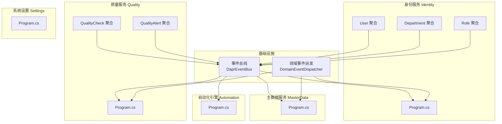
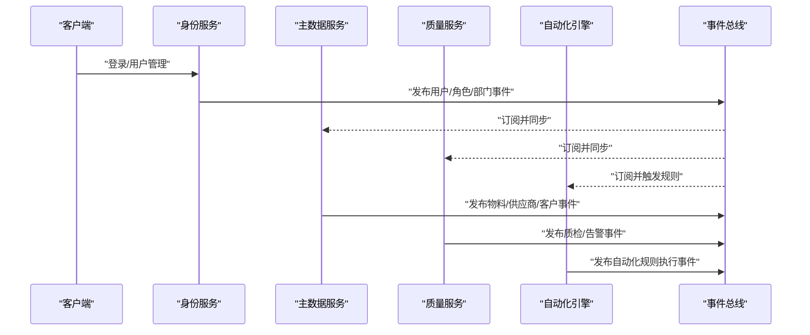
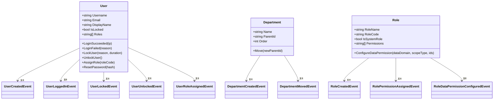
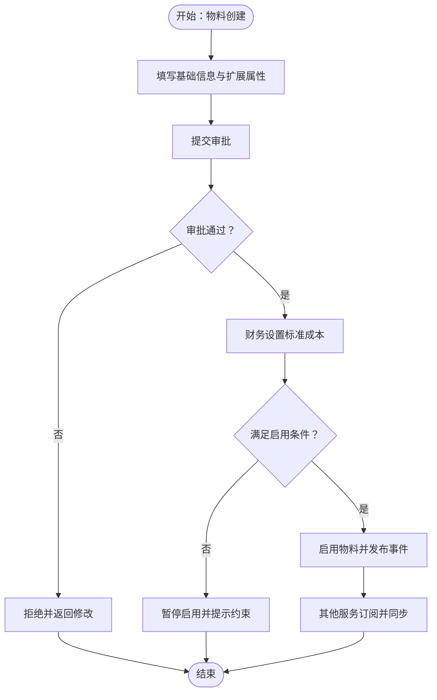
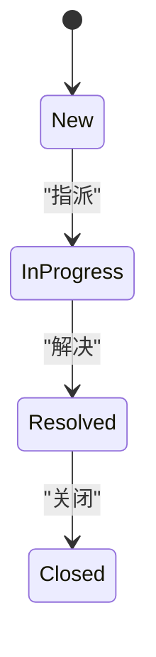
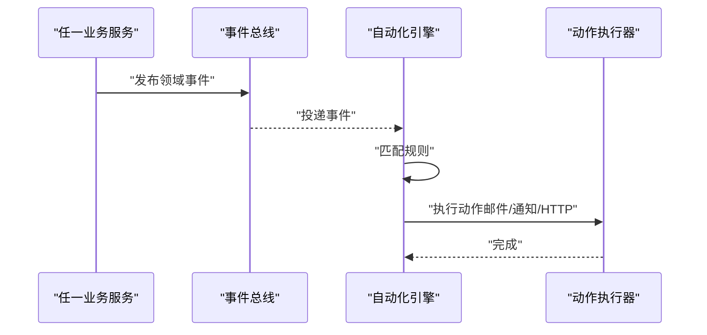
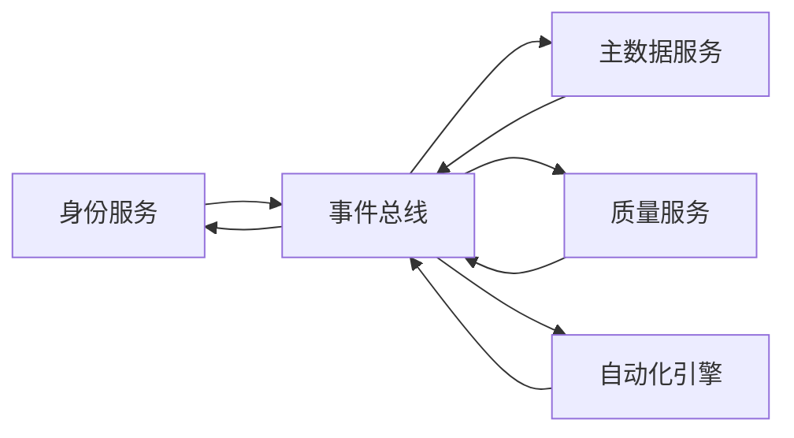

# 支撑业务服务

<cite>
**本文引用的文件**
- [PRD-01-MasterData-Service.md](file://docs/PRD-01-MasterData-Service.md)
- [PRD-09-Next-Iteration-Intelligence.md](file://docs/PRD-09-Next-Iteration-Intelligence.md)
- [Program.cs（身份服务）](file://src/Services/Identity/ErpSystem.Identity/Program.cs)
- [Program.cs（主数据服务）](file://src/Services/MasterData/ErpSystem.MasterData/Program.cs)
- [Program.cs（自动化引擎）](file://src/Services/Automation/ErpSystem.Automation/Program.cs)
- [Program.cs（质量服务）](file://src/Services/Quality/ErpSystem.Quality/Program.cs)
- [Program.cs（系统设置）](file://src/Services/Settings/ErpSystem.Settings/Program.cs)
- [DaprEventBus.cs](file://src/BuildingBlocks/ErpSystem.BuildingBlocks/EventBus/DaprEventBus.cs)
- [DomainEventDispatcher.cs](file://src/BuildingBlocks/ErpSystem.BuildingBlocks/Domain/DomainEventDispatcher.cs)
- [UserAggregate.cs](file://src/Services/Identity/ErpSystem.Identity/Domain/UserAggregate.cs)
- [DepartmentAggregate.cs](file://src/Services/Identity/ErpSystem.Identity/Domain/DepartmentAggregate.cs)
- [RoleAggregate.cs](file://src/Services/Identity/ErpSystem.Identity/Domain/RoleAggregate.cs)
- [QualityCheckAggregate.cs](file://src/Services/Quality/ErpSystem.Quality/Domain/QualityCheckAggregate.cs)
- [QualityAlertAggregate.cs](file://src/Services/Quality/ErpSystem.Quality/Domain/QualityAlertAggregate.cs)
</cite>

## 目录
1. [引言](#引言)
2. [项目结构](#项目结构)
3. [核心组件](#核心组件)
4. [架构总览](#架构总览)
5. [详细组件分析](#详细组件分析)
6. [依赖分析](#依赖分析)
7. [性能考虑](#性能考虑)
8. [故障排查指南](#故障排查指南)
9. [结论](#结论)
10. [附录](#附录)

## 引言
本文件面向支撑业务服务，聚焦以下关键模块：身份认证服务、主数据管理、质量控制、自动化引擎、系统设置。文档从架构、组件职责、数据流、处理逻辑、集成与事件传播、一致性保障等方面进行系统化说明，并结合仓库内的PRD与源码进行溯源与印证，帮助读者快速理解并落地实施。

## 项目结构
- 采用微服务分层：每个服务独立运行、独立数据库、独立事件总线订阅/发布。
- 通用基础设施：事件总线、领域事件派发、行为横切（日志/性能/幂等/验证）、可观测性、弹性策略等位于 BuildingBlocks 中，被各服务复用。
- 服务间通信：统一通过 Dapr Pub/Sub 发布/订阅领域事件，实现松耦合集成。
- 事件溯源：多数服务采用 EventStore 模式持久化事件流，配合只读投影（Read Model）满足查询需求。

图表来源
- [DaprEventBus.cs](file://src/BuildingBlocks/ErpSystem.BuildingBlocks/EventBus/DaprEventBus.cs#L1-L31)
- [DomainEventDispatcher.cs](file://src/BuildingBlocks/ErpSystem.BuildingBlocks/Domain/DomainEventDispatcher.cs#L1-L72)
- [Program.cs（身份服务）](file://src/Services/Identity/ErpSystem.Identity/Program.cs#L1-L71)
- [Program.cs（主数据服务）](file://src/Services/MasterData/ErpSystem.MasterData/Program.cs#L1-L71)
- [Program.cs（质量服务）](file://src/Services/Quality/ErpSystem.Quality/Program.cs#L1-L104)
- [Program.cs（自动化引擎）](file://src/Services/Automation/ErpSystem.Automation/Program.cs#L1-L120)
- [Program.cs（系统设置）](file://src/Services/Settings/ErpSystem.Settings/Program.cs#L1-L50)

章节来源
- [Program.cs（身份服务）](file://src/Services/Identity/ErpSystem.Identity/Program.cs#L1-L71)
- [Program.cs（主数据服务）](file://src/Services/MasterData/ErpSystem.MasterData/Program.cs#L1-L71)
- [Program.cs（质量服务）](file://src/Services/Quality/ErpSystem.Quality/Program.cs#L1-L104)
- [Program.cs（自动化引擎）](file://src/Services/Automation/ErpSystem.Automation/Program.cs#L1-L120)
- [Program.cs（系统设置）](file://src/Services/Settings/ErpSystem.Settings/Program.cs#L1-L50)
- [DaprEventBus.cs](file://src/BuildingBlocks/ErpSystem.BuildingBlocks/EventBus/DaprEventBus.cs#L1-L31)
- [DomainEventDispatcher.cs](file://src/BuildingBlocks/ErpSystem.BuildingBlocks/Domain/DomainEventDispatcher.cs#L1-L72)

## 核心组件
- 身份认证服务（Identity）
  - 用户管理：登录、锁定/解锁、角色分配、资料更新、密码变更。
  - 权限控制：基于角色的权限与数据域权限（自/部门/子部门/全部/自定义）。
  - 组织架构：部门树形结构、移动与排序。
  - 审计日志：通过领域事件记录关键行为，便于审计与追踪。
- 主数据服务（MasterData）
  - 物料：基础信息、标准成本、启用/停用、替代关系、BOM 关联、分类与多单位。
  - 供应商：基础档案、分级与绩效、黑名单。
  - 客户：基础档案、信用额度与期限、生命周期。
  - 仓库/库位：仓库档案与库位结构。
  - 事件发布：物料/供应商/客户相关事件，供其他服务订阅同步。
- 质量控制服务（Quality）
  - 质检流程：质量点配置、检查实例创建、通过/失败。
  - 缺陷管理：质量告警创建、指派、解决。
  - 质量分析：基于事件流与读模型进行统计与报表。
- 自动化引擎（Automation）
  - 事件驱动规则：订阅领域事件，按规则执行动作（邮件/通知/调用下游）。
  - 读模型：规则与事件类型映射，驱动自动化执行。
- 系统设置（Settings）
  - 用户偏好：个性化配置、界面与工作流偏好。
  - 系统配置：全局参数、开关与阈值。
  - 个性化定制：按租户/用户维度的差异化展示与行为。

章节来源
- [PRD-01-MasterData-Service.md](file://docs/PRD-01-MasterData-Service.md#L1-L827)
- [PRD-09-Next-Iteration-Intelligence.md](file://docs/PRD-09-Next-Iteration-Intelligence.md#L1-L99)
- [UserAggregate.cs](file://src/Services/Identity/ErpSystem.Identity/Domain/UserAggregate.cs#L1-L164)
- [DepartmentAggregate.cs](file://src/Services/Identity/ErpSystem.Identity/Domain/DepartmentAggregate.cs#L1-L56)
- [RoleAggregate.cs](file://src/Services/Identity/ErpSystem.Identity/Domain/RoleAggregate.cs#L1-L94)
- [QualityCheckAggregate.cs](file://src/Services/Quality/ErpSystem.Quality/Domain/QualityCheckAggregate.cs#L1-L116)
- [QualityAlertAggregate.cs](file://src/Services/Quality/ErpSystem.Quality/Domain/QualityAlertAggregate.cs#L1-L118)

## 架构总览
- 事件驱动：各服务通过 Dapr Pub/Sub 发布/订阅领域事件，实现跨服务解耦与最终一致性。
- 领域事件派发：EF Core 保存后自动收集聚合产生的领域事件，清空后再逐条发布，避免重复派发。
- 读模型：事件流投影为只读表，支撑查询与报表。
- 服务边界：每个服务拥有独立数据库与 API，通过事件协作。

图表来源
- [DaprEventBus.cs](file://src/BuildingBlocks/ErpSystem.BuildingBlocks/EventBus/DaprEventBus.cs#L1-L31)
- [DomainEventDispatcher.cs](file://src/BuildingBlocks/ErpSystem.BuildingBlocks/Domain/DomainEventDispatcher.cs#L1-L72)
- [Program.cs（身份服务）](file://src/Services/Identity/ErpSystem.Identity/Program.cs#L1-L71)
- [Program.cs（主数据服务）](file://src/Services/MasterData/ErpSystem.MasterData/Program.cs#L1-L71)
- [Program.cs（质量服务）](file://src/Services/Quality/ErpSystem.Quality/Program.cs#L1-L104)
- [Program.cs（自动化引擎）](file://src/Services/Automation/ErpSystem.Automation/Program.cs#L1-L120)

## 详细组件分析

### 身份认证服务（Identity）
- 用户管理
  - 登录成功/失败、锁定/解锁、角色分配、资料更新、密码变更均以领域事件记录，确保审计可追溯。
- 权限控制
  - 角色权限与数据域权限（ScopeType）支持细粒度控制，避免越权访问。
- 组织架构
  - 部门树形结构支持移动与排序，事件驱动保持一致。
- 审计日志
  - 通过领域事件派发器在保存后统一发布，避免重复派发。

图表来源
- [UserAggregate.cs](file://src/Services/Identity/ErpSystem.Identity/Domain/UserAggregate.cs#L1-L164)
- [DepartmentAggregate.cs](file://src/Services/Identity/ErpSystem.Identity/Domain/DepartmentAggregate.cs#L1-L56)
- [RoleAggregate.cs](file://src/Services/Identity/ErpSystem.Identity/Domain/RoleAggregate.cs#L1-L94)

章节来源
- [UserAggregate.cs](file://src/Services/Identity/ErpSystem.Identity/Domain/UserAggregate.cs#L1-L164)
- [DepartmentAggregate.cs](file://src/Services/Identity/ErpSystem.Identity/Domain/DepartmentAggregate.cs#L1-L56)
- [RoleAggregate.cs](file://src/Services/Identity/ErpSystem.Identity/Domain/RoleAggregate.cs#L1-L94)
- [DomainEventDispatcher.cs](file://src/BuildingBlocks/ErpSystem.BuildingBlocks/Domain/DomainEventDispatcher.cs#L1-L72)

### 主数据服务（MasterData）
- 物料主数据
  - 生命周期：创建（草稿）→审批→启用→停用→删除；支持标准成本、替代关系、BOM 关联、分类与多单位。
  - 事件发布：物料创建/更新/成本更新/启用/停用等事件，供其他服务订阅。
- 供应商/客户/仓库
  - 供应商分级与绩效、黑名单；客户信用额度与生命周期；仓库与库位管理。
- API 设计与集成
  - 提供物料/供应商/客户/仓库的 CRUD 与查询接口；与 Finance/Procurement/Inventory/Sales 等服务集成。

图表来源
- [PRD-01-MasterData-Service.md](file://docs/PRD-01-MasterData-Service.md#L400-L447)

章节来源
- [PRD-01-MasterData-Service.md](file://docs/PRD-01-MasterData-Service.md#L1-L827)
- [Program.cs（主数据服务）](file://src/Services/MasterData/ErpSystem.MasterData/Program.cs#L1-L71)

### 质量控制服务（Quality）
- 质检流程
  - 质量点配置后，创建检查实例，支持通过/失败，状态机受控。
- 缺陷管理
  - 质量告警创建、指派、解决，支持优先级与状态流转。
- 质量分析
  - 基于事件流与读模型进行统计分析与报表。

图表来源
- [QualityAlertAggregate.cs](file://src/Services/Quality/ErpSystem.Quality/Domain/QualityAlertAggregate.cs#L80-L86)

章节来源
- [QualityCheckAggregate.cs](file://src/Services/Quality/ErpSystem.Quality/Domain/QualityCheckAggregate.cs#L1-L116)
- [QualityAlertAggregate.cs](file://src/Services/Quality/ErpSystem.Quality/Domain/QualityAlertAggregate.cs#L1-L118)
- [Program.cs（质量服务）](file://src/Services/Quality/ErpSystem.Quality/Program.cs#L1-L104)

### 自动化引擎（Automation）
- 事件驱动规则
  - 订阅领域事件，匹配规则并执行动作（邮件/通知/调用下游）。
- 读模型
  - 规则与事件类型映射，驱动自动化执行。
- 执行器
  - 邮件与通知服务占位，便于扩展第三方集成。

图表来源
- [Program.cs（自动化引擎）](file://src/Services/Automation/ErpSystem.Automation/Program.cs#L1-L120)
- [DaprEventBus.cs](file://src/BuildingBlocks/ErpSystem.BuildingBlocks/EventBus/DaprEventBus.cs#L1-L31)

章节来源
- [Program.cs（自动化引擎）](file://src/Services/Automation/ErpSystem.Automation/Program.cs#L1-L120)

### 系统设置（Settings）
- 用户偏好与系统配置
  - 提供用户维度的个性化配置与系统全局参数。
- 读模型
  - 基于只读数据库投影用户偏好，支持快速查询与更新。

章节来源
- [Program.cs（系统设置）](file://src/Services/Settings/ErpSystem.Settings/Program.cs#L1-L50)

## 依赖分析
- 服务内依赖
  - 各服务均注册 MediatR、IPublisher、DaprEventBus、EventStore 与仓储。
- 服务间依赖
  - 通过 Dapr Pub/Sub 解耦，事件名即事件类型名，订阅方按类型接收。
- 事件派发
  - EF Core 保存后拦截派发，清空事件集合，避免重复派发。

图表来源
- [DaprEventBus.cs](file://src/BuildingBlocks/ErpSystem.BuildingBlocks/EventBus/DaprEventBus.cs#L1-L31)
- [Program.cs（身份服务）](file://src/Services/Identity/ErpSystem.Identity/Program.cs#L1-L71)
- [Program.cs（主数据服务）](file://src/Services/MasterData/ErpSystem.MasterData/Program.cs#L1-L71)
- [Program.cs（质量服务）](file://src/Services/Quality/ErpSystem.Quality/Program.cs#L1-L104)
- [Program.cs（自动化引擎）](file://src/Services/Automation/ErpSystem.Automation/Program.cs#L1-L120)

章节来源
- [DaprEventBus.cs](file://src/BuildingBlocks/ErpSystem.BuildingBlocks/EventBus/DaprEventBus.cs#L1-L31)
- [DomainEventDispatcher.cs](file://src/BuildingBlocks/ErpSystem.BuildingBlocks/Domain/DomainEventDispatcher.cs#L1-L72)

## 性能考虑
- 主数据服务
  - 查询与创建响应时间目标明确，支持高并发与大数据量。
- 事件总线
  - 使用 Dapr Pub/Sub，具备消息路由与可靠性保障。
- 读模型
  - 通过只读投影降低写路径压力，提升查询性能。
- 自动化引擎
  - 规则匹配与动作执行应异步化，避免阻塞事件处理。

## 故障排查指南
- 事件未发布/重复发布
  - 检查保存拦截器是否正确派发领域事件，确认事件集合在发布前已被清空。
- 事件未被订阅
  - 检查 Dapr Pub/Sub 配置与主题命名（与事件类型一致）。
- 数据不一致
  - 核查事件顺序与幂等处理，必要时引入幂等键与去重策略。
- 权限异常
  - 核查角色与数据域权限配置，确认 ScopeType 与 AllowedIds 正确。

章节来源
- [DomainEventDispatcher.cs](file://src/BuildingBlocks/ErpSystem.BuildingBlocks/Domain/DomainEventDispatcher.cs#L1-L72)
- [DaprEventBus.cs](file://src/BuildingBlocks/ErpSystem.BuildingBlocks/EventBus/DaprEventBus.cs#L1-L31)

## 结论
该支撑业务服务体系通过事件驱动与领域事件派发，实现了身份、主数据、质量、自动化与系统设置的解耦协作。结合只读投影与事件溯源，既保证了数据一致性与可审计性，又提升了系统的可扩展性与可维护性。建议在生产环境中完善规则引擎的可视化配置与监控告警体系，持续优化事件吞吐与查询性能。

## 附录
- 术语
  - 领域事件：聚合内部发生的业务事实，由事件总线广播。
  - 读模型：基于事件流投影的只读视图，用于查询与报表。
  - 事件溯源：以事件序列记录状态变化，支持回放与审计。
- 参考文档
  - 主数据服务 PRD：物料/供应商/客户/仓库管理与事件设计。
  - 智能化迭代 PRD：MRP 自动化、财务智能化、流程自动化与 AI 基础。