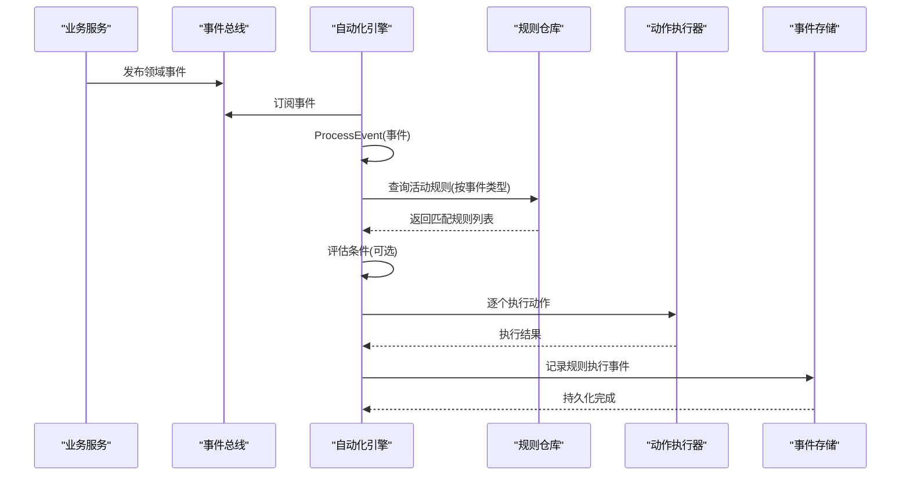
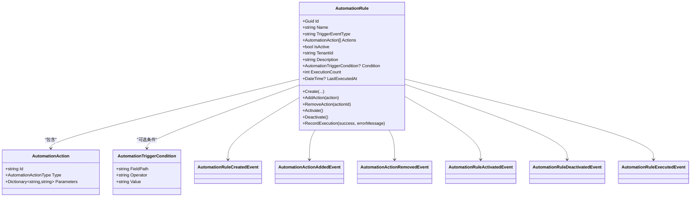
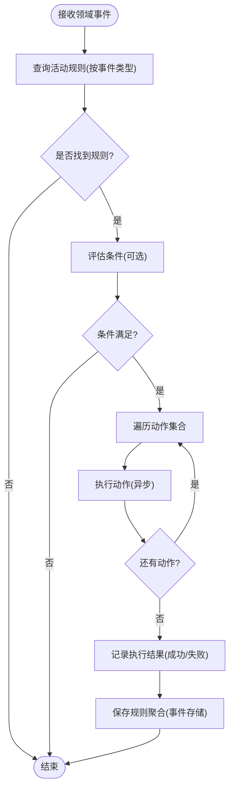
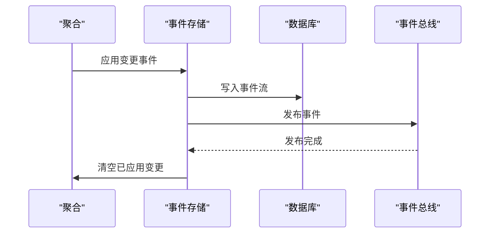
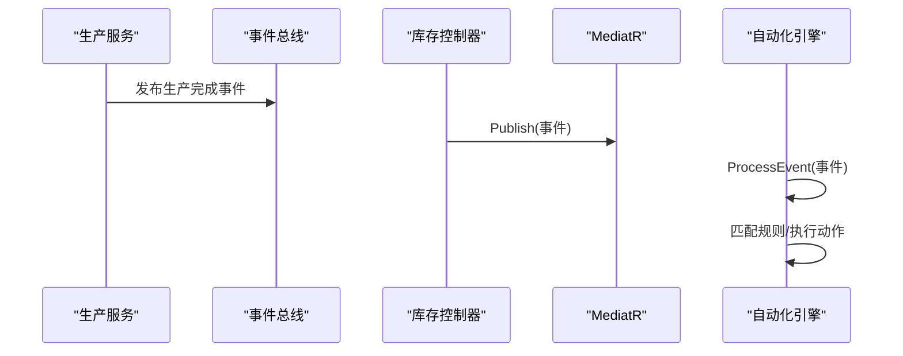
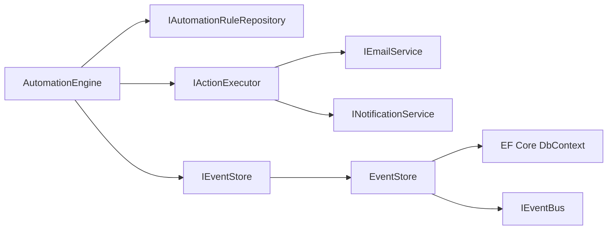

# 自动化引擎服务

<cite>
**本文档引用的文件**
- [AutomationEngine.cs](file://src/Services/Automation/ErpSystem.Automation/Application/AutomationEngine.cs)
- [AutomationRuleAggregate.cs](file://src/Services/Automation/ErpSystem.Automation/Domain/AutomationRuleAggregate.cs)
- [Program.cs](file://src/Services/Automation/ErpSystem.Automation/Program.cs)
- [ErpSystem.Automation.csproj](file://src/Services/Automation/ErpSystem.Automation/ErpSystem.Automation.csproj)
- [DDDBase.cs](file://src/BuildingBlocks/ErpSystem.BuildingBlocks/Domain/DDDBase.cs)
- [DaprEventBus.cs](file://src/BuildingBlocks/ErpSystem.BuildingBlocks/EventBus/DaprEventBus.cs)
- [EventBusExtensions.cs](file://src/BuildingBlocks/ErpSystem.BuildingBlocks/EventBus/EventBusExtensions.cs)
- [OutboxProcessor.cs](file://src/BuildingBlocks/ErpSystem.BuildingBlocks/Outbox/OutboxProcessor.cs)
- [IntegrationEventsController.cs](file://src/Services/Inventory/ErpSystem.Inventory/API/IntegrationEventsController.cs)
- [IntegrationEventHandlers.cs](file://src/Services/Inventory/ErpSystem.Inventory/Application/IntegrationEventHandlers.cs)
- [InventoryEvents.cs](file://src/Services/Inventory/ErpSystem.Inventory/Domain/InventoryEvents.cs)
- [Program.cs](file://src/Services/Inventory/ErpSystem.Inventory/Program.cs)
- [Program.cs](file://src/Services/Production/ErpSystem.Production/Program.cs)
- [Program.cs](file://src/Services/Procurement/ErpSystem.Procurement/Program.cs)
- [Program.cs](file://src/Services/Sales/ErpSystem.Sales/Program.cs)
- [Program.cs](file://src/Services/Finance/ErpSystem.Finance/Program.cs)
- [Program.cs](file://src/Services/Quality/ErpSystem.Quality/Program.cs)
- [Program.cs](file://src/Services/Mrp/ErpSystem.Mrp/Program.cs)
- [Program.cs](file://src/Services/Projects/ErpSystem.Projects/Program.cs)
- [Program.cs](file://src/Services/Settings/ErpSystem.Settings/Program.cs)
- [Program.cs](file://src/Services/Analytics/ErpSystem.Analytics/Program.cs)
- [Program.cs](file://src/Services/Assets/ErpSystem.Assets/Program.cs)
- [Program.cs](file://src/Services/CRM/ErpSystem.CRM/Program.cs)
- [Program.cs](file://src/Services/HR/ErpSystem.HR/Program.cs)
- [Program.cs](file://src/Services/Identity/ErpSystem.Identity/Program.cs)
- [Program.cs](file://src/Services/Payroll/ErpSystem.Payroll/Program.cs)
- [Program.cs](file://src/Services/Reporting/ErpSystem.Reporting/Program.cs)
- [Program.cs](file://src/Services/Maintenance/ErpSystem.Maintenance/Program.cs)
- [Program.cs](file://src/Services/MasterData/ErpSystem.MasterData/Program.cs)
- [Program.cs](file://src/Services/Settings/ErpSystem.Settings/Program.cs)
- [Program.cs](file://src/Services/Analytics/ErpSystem.Analytics/Program.cs)
- [Program.cs](file://src/Services/Assets/ErpSystem.Assets/Program.cs)
- [Program.cs](file://src/Services/CRM/ErpSystem.CRM/Program.cs)
- [Program.cs](file://src/Services/HR/ErpSystem.HR/Program.cs)
- [Program.cs](file://src/Services/Identity/ErpSystem.Identity/Program.cs)
- [Program.cs](file://src/Services/Payroll/ErpSystem.Payroll/Program.cs)
- [Program.cs](file://src/Services/Reporting/ErpSystem.Reporting/Program.cs)
- [Program.cs](file://src/Services/Maintenance/ErpSystem.Maintenance/Program.cs)
- [Program.cs](file://src/Services/MasterData/ErpSystem.MasterData/Program.cs)
- [Program.cs](file://src/Services/Settings/ErpSystem.Settings/Program.cs)
- [Program.cs](file://src/Services/Analytics/ErpSystem.Analytics/Program.cs)
- [Program.cs](file://src/Services/Assets/ErpSystem.Assets/Program.cs)
- [Program.cs](file://src/Services/CRM/ErpSystem.CRM/Program.cs)
- [Program.cs](file://src/Services/HR/ErpSystem.HR/Program.cs)
- [Program.cs](file://src/Services/Identity/ErpSystem.Identity/Program.cs)
- [Program.cs](file://src/Services/Payroll/ErpSystem.Payroll/Program.cs)
- [Program.cs](file://src/Services/Reporting/ErpSystem.Reporting/Program.cs)
- [Program.cs](file://src/Services/Maintenance/ErpSystem.Maintenance/Program.cs)
- [Program.cs](file://src/Services/MasterData/ErpSystem.MasterData/Program.cs)
- [Program.cs](file://src/Services/Settings/ErpSystem.Settings/Program.cs)
- [Program.cs](file://src/Services/Analytics/ErpSystem.Analytics/Program.cs)
- [Program.cs](file://src/Services/Assets/ErpSystem.Assets/Program.cs)
- [Program.cs](file://src/Services/CRM/ErpSystem.CRM/Program.cs)
- [Program.cs](file://src/Services/HR/ErpSystem.HR/Program.cs)
- [Program.cs](file://src/Services/Identity/ErpSystem.Identity/Program.cs)
- [Program.cs](file://src/Services/Payroll/ErpSystem.Payroll/Program.cs)
- [Program.cs](file://src/Services/Reporting/ErpSystem.Reporting/Program.cs)
- [Program.cs](file://src/Services/Maintenance/ErpSystem.Maintenance/Program.cs)
- [Program.cs](file://src/Services/MasterData/ErpSystem.MasterData/Program.cs)
- [Program.cs](file://src/Services/Settings/ErpSystem.Settings/Program.cs)
- [Program.cs](file://src/Services/Analytics/ErpSystem.Analytics/Program.cs)
- [Program.cs](file://src/Services/Assets/ErpSystem.Assets/Program.cs)
- [Program.cs](file://src/Services/CRM/ErpSystem.CRM/Program.cs)
- [Program.cs](file://src/Services/HR/ErpSystem.HR/Program.cs)
- [Program.cs](file://src/Services/Identity/ErpSystem.Identity/Program.cs)
- [Program.cs](file://src/Services/Payroll/ErpSystem.Payroll/Program.cs)
- [Program.cs](file://src/Services/Reporting/ErpSystem.Reporting/Program.cs)
- [Program.cs](file://src/Services/Maintenance/ErpSystem.Maintenance/Program.cs)
- [Program.cs](file://src/Services/MasterData/ErpSystem.MasterData/Program.cs)
- [Program.cs](file://src/Services/Settings/ErpSystem.Settings/Program.cs)
- [Program.cs](file://src/Services/Analytics/ErpSystem.Analytics/Program.cs)
- [Program.cs](file://src/Services/Assets/ErpSystem.Assets/Program.cs)
- [Program.cs](file://src/Services/CRM/ErpSystem.CRM/Program.cs)
- [Program.cs](file://src/Services/HR/ErpSystem.HR/Program.cs)
- [Program.cs](file://src/Services/Identity/ErpSystem.Identity/Program.cs)
- [Program.cs](file://src/Services/Payroll/ErpSystem.Payroll/Program.cs)
- [Program.cs](file://src/Services/Reporting/ErpSystem.Reporting/Program.cs)
- [Program.cs](file://src/Services/Maintenance/ErpSystem.Maintenance/Program.cs)
- [Program.cs](file://src/Services/MasterData/ErpSystem.MasterData/Program.cs)
- [Program.cs](file://src/Services/Settings/ErpSystem.Settings/Program.cs)
- [Program.cs](file://src/Services/Analytics/ErpSystem.Analytics/Program.cs)
- [Program.cs](file://src/Services/Assets/ErpSystem.Assets/Program.cs)
- [Program.cs](file://src/Services/CRM/ErpSystem.CRM/Program.cs)
- [Program.cs](file://src/Services/HR/ErpSystem.HR/Program.cs)
- [Program.cs](file://src/Services/Identity/ErpSystem.Identity/Program.cs)
- [Program.cs](file://src/Services/Payroll/ErpSystem.Payroll/Program.cs)
- [Program.cs](file://src/Services/Reporting/ErpSystem.Reporting/Program.cs)
- [Program.cs](file://src/Services/Maintenance/ErpSystem.Maintenance/Program.cs)
-......
</cite>

## 目录
1. [简介](#简介)
2. [项目结构](#项目结构)
3. [核心组件](#核心组件)
4. [架构总览](#架构总览)
5. [详细组件分析](#详细组件分析)
6. [依赖关系分析](#依赖关系分析)
7. [性能考虑](#性能考虑)
8. [故障排查指南](#故障排查指南)
9. [结论](#结论)
10. [附录](#附录)

## 简介
本文件面向“自动化引擎服务”，系统性阐述其作为工作流引擎、业务规则引擎与任务调度中心的实现原理与技术细节。该引擎以领域事件驱动为核心，通过规则聚合（规则定义、条件判断、动作执行）实现跨服务的业务流程自动触发与执行，并提供规则生命周期管理、事件监听、任务执行与状态跟踪能力。同时，文档给出规则配置语法、执行日志与性能监控建议，以及与各业务服务的事件集成方式。

## 项目结构
自动化引擎服务位于独立微服务中，采用领域驱动设计（DDD）与事件溯源（Event Sourcing）相结合的架构风格，配合 MediatR 实现命令/查询与通知处理，使用 Dapr 事件总线进行服务间解耦发布订阅。

```mermaid
graph TB
subgraph "自动化引擎服务"
AE_Program["Program.cs<br/>应用启动与DI注册"]
AE_Aggregates["Domain 层<br/>规则聚合与领域事件"]
AE_App["Application 层<br/>自动化引擎与动作执行器"]
AE_DB["Infrastructure 层<br/>EF Core + EventStore"]
end
subgraph "通用构建块"
BB_Domain["DDDBase.cs<br/>聚合根/事件流/事件存储"]
BB_EventBus["DaprEventBus.cs<br/>事件总线接口与实现"]
BB_Outbox["OutboxProcessor.cs<br/>出站消息处理器"]
end
subgraph "业务服务"
INV_Program["Inventory 程序入口"]
PROD_Program["Production 程序入口"]
PROC_Program["Procurement 程序入口"]
SALES_Program["Sales 程序入口"]
FIN_Program["Finance 程序入口"]
QUAL_Program["Quality 程序入口"]
MRP_Program["Mrp 程序入口"]
PRJ_Program["Projects 程序入口"]
SET_Program["Settings 程序入口"]
ANA_Program["Analytics 程序入口"]
ASSET_Program["Assets 程序入口"]
CRM_Program["CRM 程序入口"]
HR_Program["HR 程序入口"]
ID_Program["Identity 程序入口"]
PAY_Program["Payroll 程序入口"]
REP_Program["Reporting 程序入口"]
MAINT_Program["Maintenance 程序入口"]
MD_Program["MasterData 程序入口"]
end
AE_Program --> AE_Aggregates
AE_Program --> AE_App
AE_Program --> AE_DB
AE_App --> BB_Domain
AE_App --> BB_EventBus
AE_DB --> BB_Domain
AE_DB --> BB_Outbox
INV_Program --> BB_EventBus
PROD_Program --> BB_EventBus
PROC_Program --> BB_EventBus
SALES_Program --> BB_EventBus
FIN_Program --> BB_EventBus
QUAL_Program --> BB_EventBus
MRP_Program --> BB_EventBus
PRJ_Program --> BB_EventBus
SET_Program --> BB_EventBus
ANA_Program --> BB_EventBus
ASSET_Program --> BB_EventBus
CRM_Program --> BB_EventBus
HR_Program --> BB_EventBus
ID_Program --> BB_EventBus
PAY_Program --> BB_EventBus
REP_Program --> BB_EventBus
MAINT_Program --> BB_EventBus
MD_Program --> BB_EventBus
```

图表来源
- [Program.cs](file://src/Services/Automation/ErpSystem.Automation/Program.cs#L11-L69)
- [DDDBase.cs](file://src/BuildingBlocks/ErpSystem.BuildingBlocks/Domain/DDDBase.cs#L14-L120)
- [DaprEventBus.cs](file://src/BuildingBlocks/ErpSystem.BuildingBlocks/EventBus/DaprEventBus.cs#L6-L21)
- [OutboxProcessor.cs](file://src/BuildingBlocks/ErpSystem.BuildingBlocks/Outbox/OutboxProcessor.cs#L8-L71)

章节来源
- [Program.cs](file://src/Services/Automation/ErpSystem.Automation/Program.cs#L11-L69)
- [ErpSystem.Automation.csproj](file://src/Services/Automation/ErpSystem.Automation/ErpSystem.Automation.csproj#L1-L22)

## 核心组件
- 规则聚合（AutomationRule）
  - 负责规则的创建、激活/停用、动作增删、执行记录与状态维护。
  - 通过领域事件实现状态变更与历史回放。
- 自动化引擎（AutomationEngine）
  - 监听领域事件，匹配活动规则，评估条件，执行动作，记录执行结果。
- 动作执行器（ActionExecutor）
  - 支持发送邮件、Webhook、站内通知、创建/更新记录等动作类型。
- 事件存储（EventStore）
  - 基于 EF Core 的事件流持久化，支持聚合加载与事件发布。
- 事件总线（DaprEventBus/DummyEventBus）
  - 提供统一的事件发布接口，当前示例使用 Dummy 实现以便本地开发。
- 出站消息处理器（OutboxProcessor）
  - 异步重试发布出站消息，保证最终一致性。

章节来源
- [AutomationRuleAggregate.cs](file://src/Services/Automation/ErpSystem.Automation/Domain/AutomationRuleAggregate.cs#L8-L111)
- [AutomationEngine.cs](file://src/Services/Automation/ErpSystem.Automation/Application/AutomationEngine.cs#L10-L120)
- [DDDBase.cs](file://src/BuildingBlocks/ErpSystem.BuildingBlocks/Domain/DDDBase.cs#L53-L120)
- [DaprEventBus.cs](file://src/BuildingBlocks/ErpSystem.BuildingBlocks/EventBus/DaprEventBus.cs#L6-L21)
- [OutboxProcessor.cs](file://src/BuildingBlocks/ErpSystem.BuildingBlocks/Outbox/OutboxProcessor.cs#L8-L71)

## 架构总览
自动化引擎通过事件驱动实现跨服务协作：业务服务在完成关键操作后发布领域事件；自动化引擎订阅这些事件，按规则匹配并执行相应动作，同时将规则执行状态写入事件存储，形成可审计、可追溯的执行轨迹。

图表来源
- [AutomationEngine.cs](file://src/Services/Automation/ErpSystem.Automation/Application/AutomationEngine.cs#L19-L92)
- [DaprEventBus.cs](file://src/BuildingBlocks/ErpSystem.BuildingBlocks/EventBus/DaprEventBus.cs#L15-L20)
- [DDDBase.cs](file://src/BuildingBlocks/ErpSystem.BuildingBlocks/Domain/DDDBase.cs#L62-L99)

## 详细组件分析

### 规则聚合与领域事件
规则聚合负责规则的全生命周期管理，包括创建、激活/停用、动作增删、执行记录等。所有状态变更均通过领域事件记录，确保可审计与可恢复。

图表来源
- [AutomationRuleAggregate.cs](file://src/Services/Automation/ErpSystem.Automation/Domain/AutomationRuleAggregate.cs#L8-L137)

章节来源
- [AutomationRuleAggregate.cs](file://src/Services/Automation/ErpSystem.Automation/Domain/AutomationRuleAggregate.cs#L8-L196)

### 自动化引擎与动作执行
引擎负责事件监听、规则匹配、条件评估与动作执行，并将执行结果写回规则聚合。动作执行器支持多种动作类型，如发送邮件、Webhook、通知与记录创建。

图表来源
- [AutomationEngine.cs](file://src/Services/Automation/ErpSystem.Automation/Application/AutomationEngine.cs#L19-L92)

章节来源
- [AutomationEngine.cs](file://src/Services/Automation/ErpSystem.Automation/Application/AutomationEngine.cs#L10-L120)

### 事件存储与事件总线
事件存储基于 EF Core 将聚合变更序列化为事件流，支持按版本加载聚合历史；事件总线负责将事件发布到 Dapr Pub/Sub（当前示例使用 Dummy 实现便于本地开发）。

图表来源
- [DDDBase.cs](file://src/BuildingBlocks/ErpSystem.BuildingBlocks/Domain/DDDBase.cs#L62-L99)
- [DaprEventBus.cs](file://src/BuildingBlocks/ErpSystem.BuildingBlocks/EventBus/DaprEventBus.cs#L15-L20)

章节来源
- [DDDBase.cs](file://src/BuildingBlocks/ErpSystem.BuildingBlocks/Domain/DDDBase.cs#L43-L120)
- [DaprEventBus.cs](file://src/BuildingBlocks/ErpSystem.BuildingBlocks/EventBus/DaprEventBus.cs#L6-L21)
- [EventBusExtensions.cs](file://src/BuildingBlocks/ErpSystem.BuildingBlocks/EventBus/EventBusExtensions.cs#L5-L13)

### 与业务服务的事件集成
业务服务通过控制器或应用层发布集成事件，自动化引擎订阅并响应。例如库存服务在生产完成时发布事件，自动化引擎据此触发后续动作。

图表来源
- [IntegrationEventsController.cs](file://src/Services/Inventory/ErpSystem.Inventory/API/IntegrationEventsController.cs#L36-L48)
- [IntegrationEventHandlers.cs](file://src/Services/Inventory/ErpSystem.Inventory/Application/IntegrationEventHandlers.cs#L14-L32)
- [InventoryEvents.cs](file://src/Services/Inventory/ErpSystem.Inventory/Domain/InventoryEvents.cs#L3-L11)
- [AutomationEngine.cs](file://src/Services/Automation/ErpSystem.Automation/Application/AutomationEngine.cs#L19-L54)

章节来源
- [IntegrationEventsController.cs](file://src/Services/Inventory/ErpSystem.Inventory/API/IntegrationEventsController.cs#L36-L48)
- [IntegrationEventHandlers.cs](file://src/Services/Inventory/ErpSystem.Inventory/Application/IntegrationEventHandlers.cs#L14-L39)
- [InventoryEvents.cs](file://src/Services/Inventory/ErpSystem.Inventory/Domain/InventoryEvents.cs#L3-L11)

## 依赖关系分析
- 组件内聚与耦合
  - 自动化引擎与规则聚合高内聚，通过事件存储与事件总线与外部解耦。
  - 动作执行器通过接口注入，支持扩展新动作类型。
- 外部依赖
  - Dapr 事件总线用于服务间解耦；当前示例使用 Dummy 实现，便于本地开发。
  - EF Core 用于事件流持久化；OutboxProcessor 提供最终一致性保障。
- 循环依赖
  - 当前结构未发现循环依赖；规则聚合与引擎分层清晰。

图表来源
- [AutomationEngine.cs](file://src/Services/Automation/ErpSystem.Automation/Application/AutomationEngine.cs#L10-L14)
- [Program.cs](file://src/Services/Automation/ErpSystem.Automation/Program.cs#L32-L48)
- [DDDBase.cs](file://src/BuildingBlocks/ErpSystem.BuildingBlocks/Domain/DDDBase.cs#L53-L57)

章节来源
- [Program.cs](file://src/Services/Automation/ErpSystem.Automation/Program.cs#L32-L48)
- [DDDBase.cs](file://src/BuildingBlocks/ErpSystem.BuildingBlocks/Domain/DDDBase.cs#L53-L57)

## 性能考虑
- 事件存储
  - 使用 JSONB 存储事件载荷，支持高效序列化与反序列化。
  - 分批保存事件，减少事务开销。
- 规则匹配
  - 建议引入规则索引与缓存（按事件类型），降低查询成本。
- 动作执行
  - 动作执行应异步化，避免阻塞事件处理。
- 事件总线
  - 在生产环境启用真实 Dapr 客户端，结合背压与重试策略提升可靠性。

## 故障排查指南
- 日志记录
  - 引擎对事件处理、规则匹配、动作执行与错误进行分级日志记录，便于定位问题。
- 错误处理
  - 单个动作失败不影响整体规则执行；失败会被记录并持久化，便于后续重试与审计。
- 事件总线
  - 当前使用 DummyEventBus，若需验证跨服务事件，请替换为真实 DaprEventBus 并检查 Pub/Sub 配置。

章节来源
- [AutomationEngine.cs](file://src/Services/Automation/ErpSystem.Automation/Application/AutomationEngine.cs#L23-L53)
- [DaprEventBus.cs](file://src/BuildingBlocks/ErpSystem.BuildingBlocks/EventBus/DaprEventBus.cs#L23-L29)
- [EventBusExtensions.cs](file://src/BuildingBlocks/ErpSystem.BuildingBlocks/EventBus/EventBusExtensions.cs#L7-L13)

## 结论
自动化引擎服务以事件驱动为核心，结合规则聚合与动作执行器，实现了跨服务的智能自动化与业务流程编排。通过事件存储与事件总线，系统具备良好的可扩展性与可维护性。建议在生产环境中完善规则索引、启用真实事件总线、引入可观测性与告警机制，以进一步提升稳定性与可运维性。

## 附录

### 规则配置语法与字段说明
- 规则字段
  - 名称、描述、租户标识、触发事件类型、是否激活、可选条件、动作列表。
- 条件字段
  - 字段路径（FieldPath）、比较运算符（Operator）、期望值（Value）。
  - 运算符支持：等于、包含、大于、小于（数值比较）。
- 动作字段
  - 动作类型（Type）、参数字典（Parameters）。
  - 支持动作：发送邮件、发送 Webhook、发送通知、创建记录、更新记录、执行命令。

章节来源
- [AutomationRuleAggregate.cs](file://src/Services/Automation/ErpSystem.Automation/Domain/AutomationRuleAggregate.cs#L116-L137)
- [AutomationEngine.cs](file://src/Services/Automation/ErpSystem.Automation/Application/AutomationEngine.cs#L94-L119)

### API 接口文档（概要）
- 规则管理
  - 创建规则：POST /api/rules
  - 更新规则：PUT /api/rules/{id}
  - 删除规则：DELETE /api/rules/{id}
  - 激活/停用：POST /api/rules/{id}/activate | POST /api/rules/{id}/deactivate
  - 查询规则：GET /api/rules（按事件类型、租户、激活状态筛选）
- 规则执行
  - 手动触发：POST /api/rules/{id}/execute
  - 事件驱动：由业务服务发布事件，自动化引擎自动处理
- 任务监控
  - 获取执行历史：GET /api/rules/{id}/executions
  - 查看执行统计：GET /api/rules/stats

说明
- 上述接口为概念性定义，具体路由与请求/响应格式以实际实现为准。
- 建议在 Swagger UI 中查看与调试接口。

章节来源
- [Program.cs](file://src/Services/Automation/ErpSystem.Automation/Program.cs#L14-L26)

### 事件集成清单
- 生产完成 → 库存收货
  - 生产服务发布“生产完成”事件，库存服务订阅并处理。
- 采购到货 → 库存入库
  - 采购服务发布“货物已到货”事件，库存服务订阅并处理。
- 销售确认/发货 → 库存扣减
  - 销售服务发布“订单确认/发货创建”事件，库存服务订阅并处理。
- 其他服务事件
  - 财务、质量、MRP、项目、设置、分析、资产、CRM、HR、薪酬、报表、维护、主数据等服务均可通过事件总线发布领域事件，供自动化引擎订阅与响应。

章节来源
- [IntegrationEventsController.cs](file://src/Services/Inventory/ErpSystem.Inventory/API/IntegrationEventsController.cs#L36-L48)
- [IntegrationEventHandlers.cs](file://src/Services/Inventory/ErpSystem.Inventory/Application/IntegrationEventHandlers.cs#L14-L39)
- [InventoryEvents.cs](file://src/Services/Inventory/ErpSystem.Inventory/Domain/InventoryEvents.cs#L3-L11)