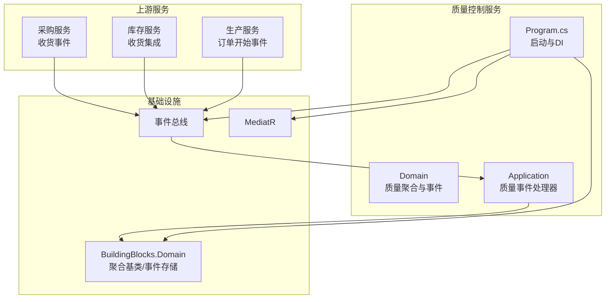
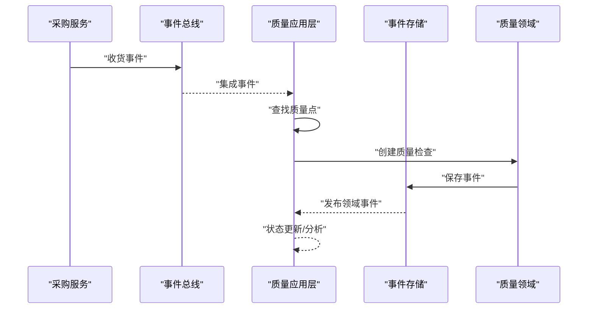
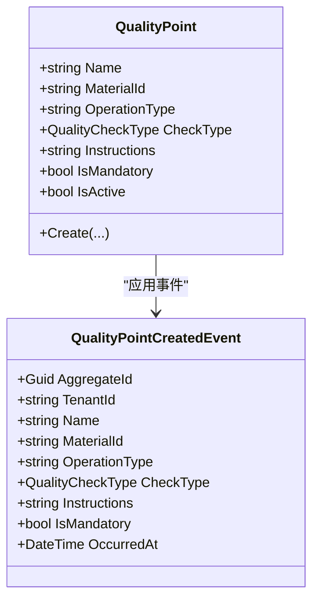
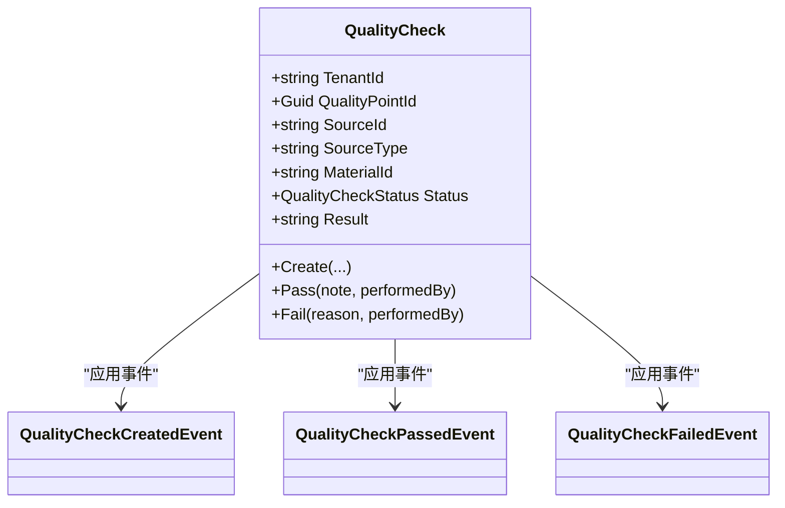
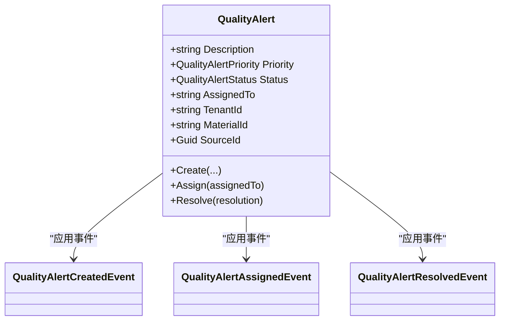
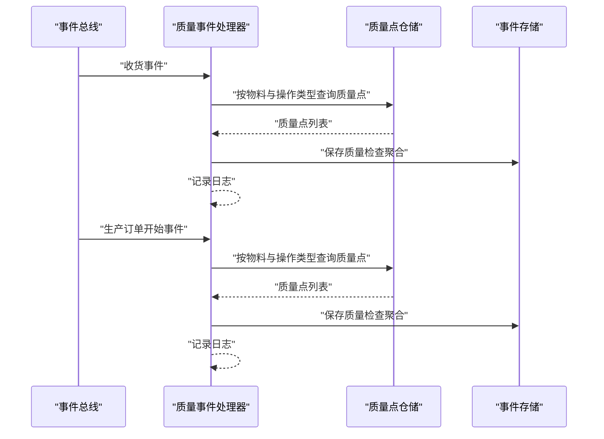
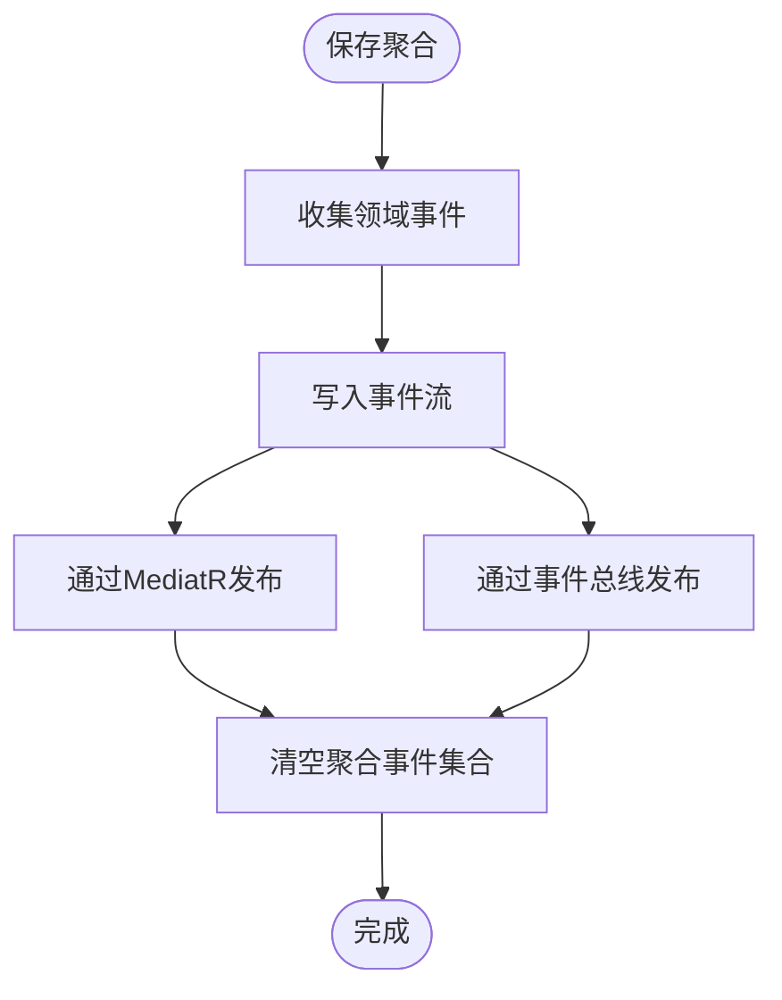
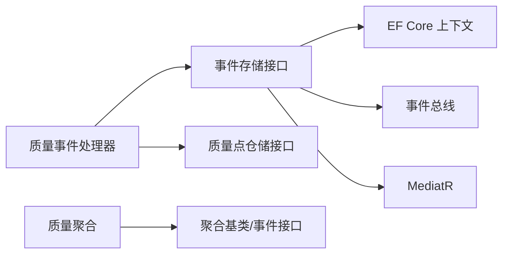

# 质量控制服务

<cite>
**本文引用的文件**
- [QualityCheckAggregate.cs](file://src/Services/Quality/ErpSystem.Quality/Domain/QualityCheckAggregate.cs)
- [QualityAlertAggregate.cs](file://src/Services/Quality/ErpSystem.Quality/Domain/QualityAlertAggregate.cs)
- [QualityPointAggregate.cs](file://src/Services/Quality/ErpSystem.Quality/Domain/QualityPointAggregate.cs)
- [QualityEventHandlers.cs](file://src/Services/Quality/ErpSystem.Quality/Application/QualityEventHandlers.cs)
- [Program.cs](file://src/Services/Quality/ErpSystem.Quality/Program.cs)
- [DDDBase.cs](file://src/BuildingBlocks/ErpSystem.BuildingBlocks/Domain/DDDBase.cs)
- [DomainEventDispatcher.cs](file://src/BuildingBlocks/ErpSystem.BuildingBlocks/Domain/DomainEventDispatcher.cs)
- [QualityWorkflowTests.cs](file://src/Tests/ErpSystem.IntegrationTests/Quality/QualityWorkflowTests.cs)
- [ProcurementEvents.cs](file://src/Services/Procurement/ErpSystem.Procurement/Domain/ProcurementEvents.cs)
- [IntegrationEventHandlers.cs](file://src/Services/Inventory/ErpSystem.Inventory/Application/IntegrationEventHandlers.cs)
- [PRD-05-Inventory-Service.md](file://docs/PRD-05-Inventory-Service.md)
</cite>

## 目录
1. [简介](#简介)
2. [项目结构](#项目结构)
3. [核心组件](#核心组件)
4. [架构总览](#架构总览)
5. [详细组件分析](#详细组件分析)
6. [依赖关系分析](#依赖关系分析)
7. [性能考虑](#性能考虑)
8. [故障排查指南](#故障排查指南)
9. [结论](#结论)
10. [附录](#附录)

## 简介
本技术文档面向质量控制服务，系统性阐述质量检查、质量预警、质量点管理等质量管理体系功能。文档重点解析质量检查聚合、质量预警聚合、质量点聚合等领域模型的设计理念，说明质量事件处理器的实现方式（质量事件监听、预警触发、质量分析），并给出与生产、采购、销售等业务流程的质量集成方案，实现质量数据的实时监控。同时，提供质量标准管理、检验规则配置、质量统计分析等业务功能的技术实现思路与接口设计。

## 项目结构
质量控制服务位于 src/Services/Quality/ErpSystem.Quality，采用领域驱动设计与事件溯源模式，结合 MediatR 与事件总线进行跨服务集成。核心目录与职责如下：
- Domain：定义质量领域的聚合根与领域事件，包括质量检查、质量预警、质量点三大聚合。
- Application：定义质量事件处理器，基于集成事件触发质量检查创建与状态流转。
- Program.cs：服务启动、依赖注入、EF Core 上下文与事件存储注册。

图表来源
- [Program.cs](file://src/Services/Quality/ErpSystem.Quality/Program.cs#L1-L104)
- [DDDBase.cs](file://src/BuildingBlocks/ErpSystem.BuildingBlocks/Domain/DDDBase.cs#L1-L137)
- [DomainEventDispatcher.cs](file://src/BuildingBlocks/ErpSystem.BuildingBlocks/Domain/DomainEventDispatcher.cs#L1-L72)
- [QualityEventHandlers.cs](file://src/Services/Quality/ErpSystem.Quality/Application/QualityEventHandlers.cs#L1-L95)

章节来源
- [Program.cs](file://src/Services/Quality/ErpSystem.Quality/Program.cs#L1-L104)

## 核心组件
- 质量点聚合（QualityPoint）：定义某物料在特定操作类型下的质量要求，包括检查类型、是否强制、是否启用等。
- 质量检查聚合（QualityCheck）：代表一次具体的检查实例，关联质量点，记录来源单据、物料、结果与状态。
- 质量预警聚合（QualityAlert）：当检测到质量问题时触发，记录描述、优先级、状态、指派与来源。
- 质量事件处理器（QualityIntegrationEventHandlers）：监听来自其他服务的集成事件，自动创建质量检查并推动状态流转。
- 事件存储（EventStore）：事件溯源持久化，保存领域事件并发布通知与事件总线消息。

章节来源
- [QualityPointAggregate.cs](file://src/Services/Quality/ErpSystem.Quality/Domain/QualityPointAggregate.cs#L1-L81)
- [QualityCheckAggregate.cs](file://src/Services/Quality/ErpSystem.Quality/Domain/QualityCheckAggregate.cs#L1-L116)
- [QualityAlertAggregate.cs](file://src/Services/Quality/ErpSystem.Quality/Domain/QualityAlertAggregate.cs#L1-L118)
- [QualityEventHandlers.cs](file://src/Services/Quality/ErpSystem.Quality/Application/QualityEventHandlers.cs#L1-L95)
- [DDDBase.cs](file://src/BuildingBlocks/ErpSystem.BuildingBlocks/Domain/DDDBase.cs#L43-L120)

## 架构总览
质量控制服务通过事件总线与 MediatR 实现松耦合集成。当采购收货、生产订单开始等业务事件发生时，质量事件处理器根据质量点配置自动生成质量检查；质量检查状态变化通过事件存储持久化并发布，供其他系统订阅与联动。

图表来源
- [QualityEventHandlers.cs](file://src/Services/Quality/ErpSystem.Quality/Application/QualityEventHandlers.cs#L18-L73)
- [DDDBase.cs](file://src/BuildingBlocks/ErpSystem.BuildingBlocks/Domain/DDDBase.cs#L59-L120)

## 详细组件分析

### 质量点聚合（QualityPoint）
- 设计理念：质量点是“标准”，描述在特定操作类型（如收货、生产开始）下对某物料的检查要求，支持强制与非强制两种策略。
- 关键属性：名称、物料标识、操作类型、检查类型（通过/测量/目视）、指令、是否强制、是否启用。
- 生命周期：创建即激活，后续可通过变更事件扩展。

图表来源
- [QualityPointAggregate.cs](file://src/Services/Quality/ErpSystem.Quality/Domain/QualityPointAggregate.cs#L8-L58)

章节来源
- [QualityPointAggregate.cs](file://src/Services/Quality/ErpSystem.Quality/Domain/QualityPointAggregate.cs#L1-L81)

### 质量检查聚合（QualityCheck）
- 设计理念：质量检查是“实例”，绑定质量点，记录来源单据与物料，承载检查结果与状态流转。
- 关键状态：待检、通过、失败。
- 操作约束：仅待检状态可执行通过/失败操作，确保状态机正确性。

图表来源
- [QualityCheckAggregate.cs](file://src/Services/Quality/ErpSystem.Quality/Domain/QualityCheckAggregate.cs#L8-L75)

章节来源
- [QualityCheckAggregate.cs](file://src/Services/Quality/ErpSystem.Quality/Domain/QualityCheckAggregate.cs#L1-L116)

### 质量预警聚合（QualityAlert）
- 设计理念：当质量检查失败或系统检测到异常时，生成质量预警，支持优先级与状态管理，便于追踪与闭环。
- 关键状态：新建、处理中、已解决、已关闭。
- 操作：创建、指派、解决。

图表来源
- [QualityAlertAggregate.cs](file://src/Services/Quality/ErpSystem.Quality/Domain/QualityAlertAggregate.cs#L8-L69)

章节来源
- [QualityAlertAggregate.cs](file://src/Services/Quality/ErpSystem.Quality/Domain/QualityAlertAggregate.cs#L1-L118)

### 质量事件处理器（QualityIntegrationEventHandlers）
- 监听集成事件：采购收货事件触发 Incoming Quality Control（IQC）检查；生产订单开始事件触发 Process Quality Control（PQC）检查。
- 触发机制：根据物料与操作类型查询质量点，为每个质量点创建质量检查并持久化。
- 日志与可观测性：记录处理过程与创建的检查标识，便于审计与排障。

图表来源
- [QualityEventHandlers.cs](file://src/Services/Quality/ErpSystem.Quality/Application/QualityEventHandlers.cs#L18-L73)

章节来源
- [QualityEventHandlers.cs](file://src/Services/Quality/ErpSystem.Quality/Application/QualityEventHandlers.cs#L1-L95)

### 事件存储与领域事件分发
- 事件存储：将聚合变更序列化为事件流，写入数据库并发布到事件总线与 MediatR。
- 领域事件分发：在 EF Core SaveChanges 后收集聚合产生的领域事件，清空后再发布，避免重复分发。

图表来源
- [DDDBase.cs](file://src/BuildingBlocks/ErpSystem.BuildingBlocks/Domain/DDDBase.cs#L59-L120)
- [DomainEventDispatcher.cs](file://src/BuildingBlocks/ErpSystem.BuildingBlocks/Domain/DomainEventDispatcher.cs#L17-L43)

章节来源
- [DDDBase.cs](file://src/BuildingBlocks/ErpSystem.BuildingBlocks/Domain/DDDBase.cs#L1-L137)
- [DomainEventDispatcher.cs](file://src/BuildingBlocks/ErpSystem.BuildingBlocks/Domain/DomainEventDispatcher.cs#L1-L72)

## 依赖关系分析
- 质量事件处理器依赖事件存储与质量点仓储接口，实现解耦与可替换。
- 事件存储依赖 EF Core 上下文、事件总线与 MediatR，形成事件溯源与通知通道。
- 质量聚合依赖 BuildingBlocks 的聚合基类与事件接口，统一事件序列化与版本管理。

图表来源
- [QualityEventHandlers.cs](file://src/Services/Quality/ErpSystem.Quality/Application/QualityEventHandlers.cs#L10-L40)
- [Program.cs](file://src/Services/Quality/ErpSystem.Quality/Program.cs#L30-L40)
- [DDDBase.cs](file://src/BuildingBlocks/ErpSystem.BuildingBlocks/Domain/DDDBase.cs#L53-L57)

章节来源
- [Program.cs](file://src/Services/Quality/ErpSystem.Quality/Program.cs#L1-L104)

## 性能考虑
- 事件存储批量写入：聚合变更逐条写入事件流，建议在批量创建质量检查时合并事务提交，减少 IO 次数。
- 事件序列化：使用 JSONB 存储事件负载，注意事件大小与索引策略，避免过长 payload 影响查询性能。
- 分发去重：领域事件分发器在发布前清空事件集合，防止重复分发导致的性能浪费。
- 查询优化：质量点查询按物料与操作类型建立索引，提高事件触发时的筛选效率。

## 故障排查指南
- 质量检查状态异常：检查是否在非待检状态下调用通过/失败方法，确保状态机约束生效。
- 未创建质量检查：确认上游事件是否正确发布、质量点仓储是否返回有效质量点列表。
- 事件未持久化：检查事件存储保存逻辑与数据库连接字符串，验证事件流表是否存在。
- 日志定位：利用处理器日志输出的检查标识与事件标识快速定位问题。

章节来源
- [QualityCheckAggregate.cs](file://src/Services/Quality/ErpSystem.Quality/Domain/QualityCheckAggregate.cs#L38-L52)
- [QualityEventHandlers.cs](file://src/Services/Quality/ErpSystem.Quality/Application/QualityEventHandlers.cs#L18-L73)
- [DDDBase.cs](file://src/BuildingBlocks/ErpSystem.BuildingBlocks/Domain/DDDBase.cs#L62-L99)

## 结论
质量控制服务通过事件驱动与事件溯源，实现了与采购、生产等业务流程的深度集成。质量点作为标准，质量检查作为实例，质量预警作为反馈闭环，三者协同构建了可扩展的质量管理体系。未来可进一步完善质量标准管理、检验规则配置与统计分析能力，持续提升质量数据的实时性与洞察力。

## 附录

### 业务集成与实时监控
- 与采购集成：采购收货事件触发 IQC 检查，确保来料质量可控。
- 与库存集成：库存收货流程完成后，质量检查状态可用于库存可用性判定与后续流程推进。
- 与生产集成：生产订单开始事件触发 PQC 检查，保障生产过程质量。

章节来源
- [ProcurementEvents.cs](file://src/Services/Procurement/ErpSystem.Procurement/Domain/ProcurementEvents.cs#L7-L19)
- [IntegrationEventHandlers.cs](file://src/Services/Inventory/ErpSystem.Inventory/Application/IntegrationEventHandlers.cs#L14-L32)
- [PRD-05-Inventory-Service.md](file://docs/PRD-05-Inventory-Service.md#L453-L472)
- [QualityEventHandlers.cs](file://src/Services/Quality/ErpSystem.Quality/Application/QualityEventHandlers.cs#L18-L73)

### 测试验证
- 质量点定义正确性：验证质量点的名称、物料、强制标志等属性。
- 质量检查通过流程：验证检查状态从待检到通过的状态转换。
- 质量预警跟踪：验证预警的创建、指派与解决流程。

章节来源
- [QualityWorkflowTests.cs](file://src/Tests/ErpSystem.IntegrationTests/Quality/QualityWorkflowTests.cs#L11-L74)