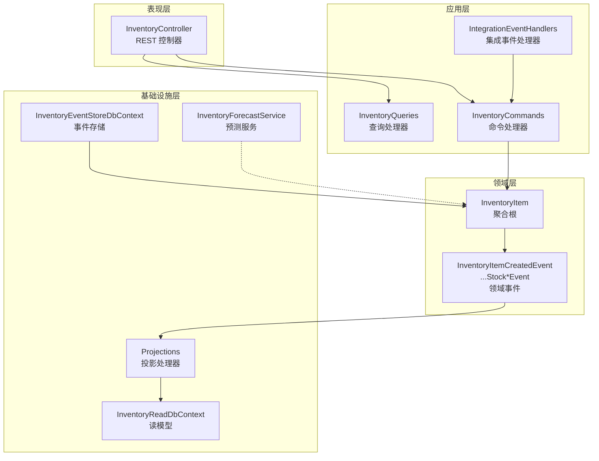
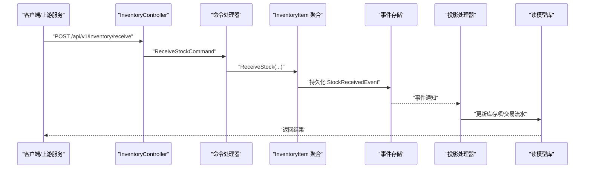
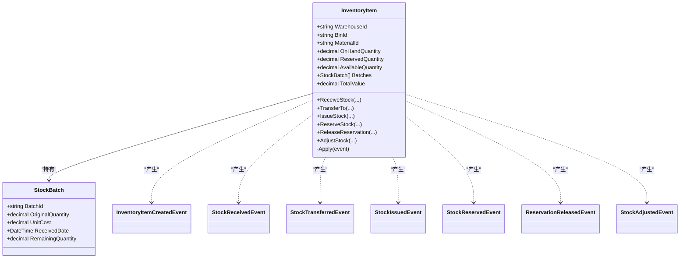
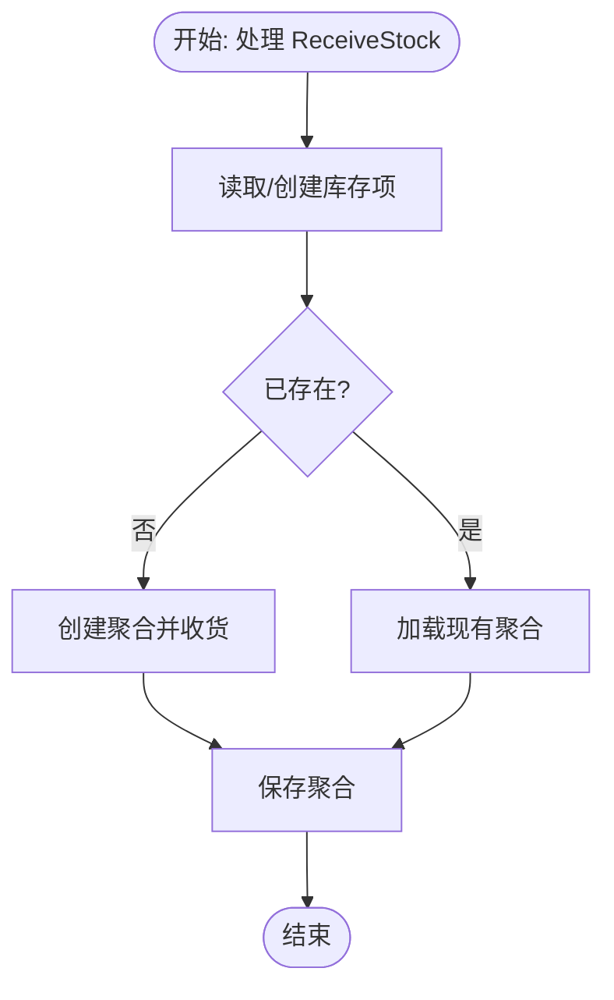
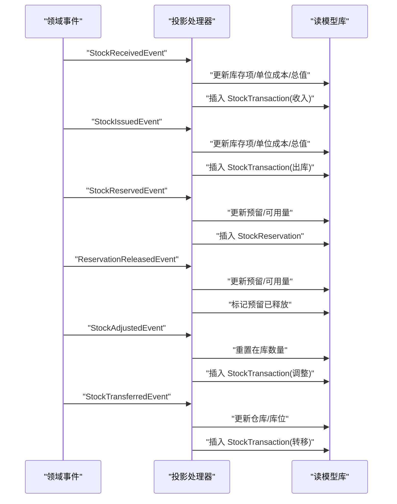
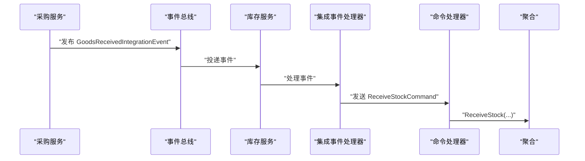
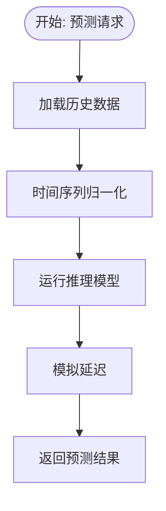
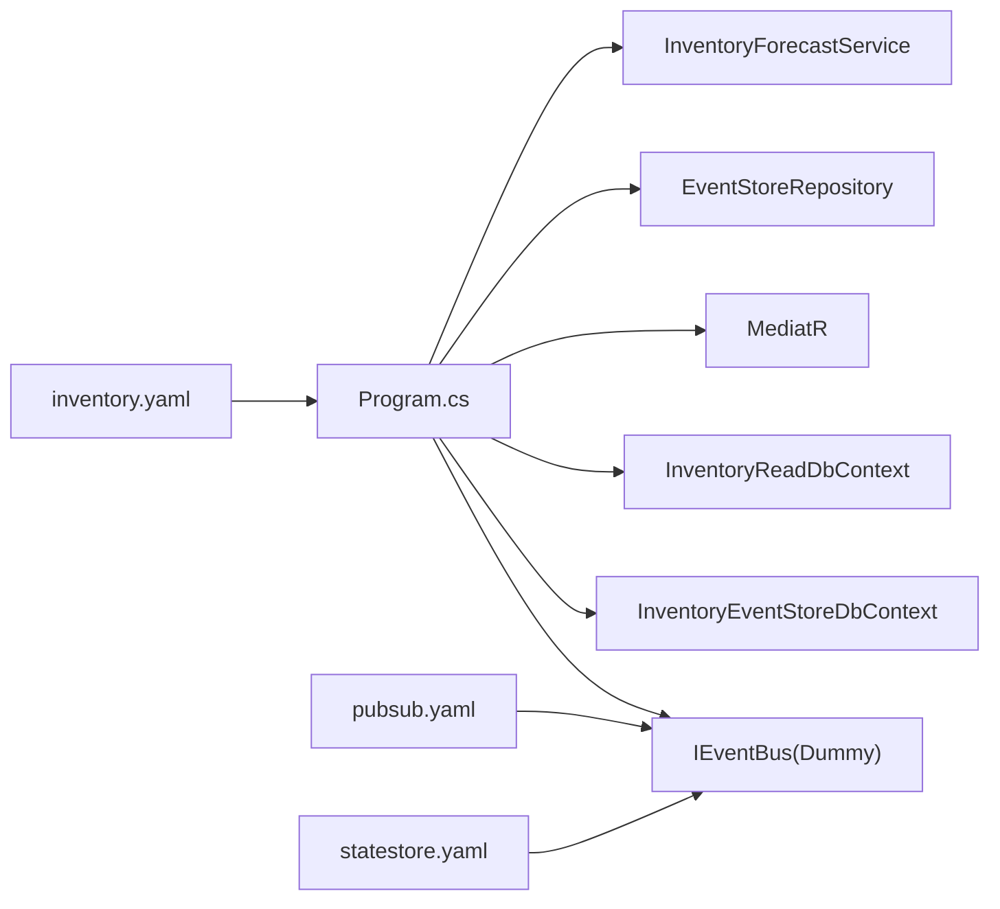

# 库存管理服务

<cite>
**本文引用的文件**
- [Program.cs](file://src/Services/Inventory/ErpSystem.Inventory/Program.cs)
- [InventoryController.cs](file://src/Services/Inventory/ErpSystem.Inventory/API/InventoryController.cs)
- [InventoryCommands.cs](file://src/Services/Inventory/ErpSystem.Inventory/Application/InventoryCommands.cs)
- [InventoryQueries.cs](file://src/Services/Inventory/ErpSystem.Inventory/Application/InventoryQueries.cs)
- [InventoryItemAggregate.cs](file://src/Services/Inventory/ErpSystem.Inventory/Domain/InventoryItemAggregate.cs)
- [InventoryForecastService.cs](file://src/Services/Inventory/ErpSystem.Inventory/Domain/Services/InventoryForecastService.cs)
- [Persistence.cs](file://src/Services/Inventory/ErpSystem.Inventory/Infrastructure/Persistence.cs)
- [Projections.cs](file://src/Services/Inventory/ErpSystem.Inventory/Infrastructure/Projections.cs)
- [IntegrationEventHandlers.cs](file://src/Services/Inventory/ErpSystem.Inventory/Application/IntegrationEventHandlers.cs)
- [InventoryEvents.cs](file://src/Services/Inventory/ErpSystem.Inventory/Domain/InventoryEvents.cs)
- [pubsub.yaml](file://components/pubsub.yaml)
- [statestore.yaml](file://components/statestore.yaml)
- [inventory.yaml](file://deploy/k8s/services/inventory.yaml)
- [EventBusExtensions.cs](file://src/BuildingBlocks/ErpSystem.BuildingBlocks/EventBus/EventBusExtensions.cs)
- [DaprEventBus.cs](file://src/BuildingBlocks/ErpSystem.BuildingBlocks/EventBus/DaprEventBus.cs)
- [PRD-05-Inventory-Service.md](file://docs/PRD-05-Inventory-Service.md)
</cite>

## 目录
1. [简介](#简介)
2. [项目结构](#项目结构)
3. [核心组件](#核心组件)
4. [架构总览](#架构总览)
5. [详细组件分析](#详细组件分析)
6. [依赖关系分析](#依赖关系分析)
7. [性能考虑](#性能考虑)
8. [故障排查指南](#故障排查指南)
9. [结论](#结论)
10. [附录](#附录)

## 简介
本技术文档面向库存管理服务，系统性阐述其在多仓库、批次管理、安全库存控制、库存调整等核心能力上的设计与实现；深入解析库存物品聚合模型（数量跟踪、批次信息、仓储位置）、库存事件模型（库存变动、调拨转移、盘点差异等）以及与采购、销售、生产等服务的事件集成机制；提供完整的API接口清单与调用说明，并介绍预测服务集成与Dapr事件总线的使用方式。

## 项目结构
库存管理服务采用分层与领域驱动设计（DDD）组织代码，核心分为四层：
- 表现层：控制器暴露REST API，统一路由至应用层命令/查询处理器
- 应用层：命令/查询定义与处理器，协调聚合与读模型更新
- 领域层：聚合根与领域事件，封装业务规则与状态演进
- 基础设施层：事件存储、读模型投影、数据库上下文与实体映射

图表来源
- [Program.cs](file://src/Services/Inventory/ErpSystem.Inventory/Program.cs#L10-L74)
- [InventoryController.cs](file://src/Services/Inventory/ErpSystem.Inventory/API/InventoryController.cs#L7-L44)
- [InventoryCommands.cs](file://src/Services/Inventory/ErpSystem.Inventory/Application/InventoryCommands.cs#L60-L142)
- [InventoryQueries.cs](file://src/Services/Inventory/ErpSystem.Inventory/Application/InventoryQueries.cs#L13-L50)
- [InventoryItemAggregate.cs](file://src/Services/Inventory/ErpSystem.Inventory/Domain/InventoryItemAggregate.cs#L91-L255)
- [Projections.cs](file://src/Services/Inventory/ErpSystem.Inventory/Infrastructure/Projections.cs#L7-L211)
- [Persistence.cs](file://src/Services/Inventory/ErpSystem.Inventory/Infrastructure/Persistence.cs#L6-L79)
- [InventoryForecastService.cs](file://src/Services/Inventory/ErpSystem.Inventory/Domain/Services/InventoryForecastService.cs#L12-L52)

章节来源
- [Program.cs](file://src/Services/Inventory/ErpSystem.Inventory/Program.cs#L10-L74)
- [InventoryController.cs](file://src/Services/Inventory/ErpSystem.Inventory/API/InventoryController.cs#L7-L44)

## 核心组件
- 事件存储与读模型
  - 事件存储：基于PostgreSQL的事件流表，保存聚合版本化事件
  - 读模型：InventoryReadDbContext维护库存项、交易流水、预留等只读视图
- 聚合根与事件
  - InventoryItem聚合根承载OnHand/Reserved/Available数量与批次队列，通过Apply变更事件驱动状态演进
- 投影与查询
  - Projections监听领域事件，更新读模型并生成StockTransaction
  - Queries提供库存搜索、可用量查询、交易流水查询
- 命令与集成事件
  - Commands封装接收、转移、出库、预留、释放、调整等业务动作
  - IntegrationEventHandlers订阅采购、销售、生产集成事件，自动完成库存联动
- 预测服务
  - InventoryForecastService提供库存耗尽预测接口，便于安全库存与补货策略制定

章节来源
- [Persistence.cs](file://src/Services/Inventory/ErpSystem.Inventory/Infrastructure/Persistence.cs#L6-L79)
- [Projections.cs](file://src/Services/Inventory/ErpSystem.Inventory/Infrastructure/Projections.cs#L7-L211)
- [InventoryItemAggregate.cs](file://src/Services/Inventory/ErpSystem.Inventory/Domain/InventoryItemAggregate.cs#L91-L255)
- [InventoryCommands.cs](file://src/Services/Inventory/ErpSystem.Inventory/Application/InventoryCommands.cs#L60-L142)
- [IntegrationEventHandlers.cs](file://src/Services/Inventory/ErpSystem.Inventory/Application/IntegrationEventHandlers.cs#L14-L112)
- [InventoryForecastService.cs](file://src/Services/Inventory/ErpSystem.Inventory/Domain/Services/InventoryForecastService.cs#L12-L52)

## 架构总览
库存服务通过CQRS+事件溯源模式实现，命令侧产生领域事件，事件被投影到读模型，查询侧直接访问读库；同时通过Dapr事件总线实现跨服务解耦集成。

图表来源
- [InventoryController.cs](file://src/Services/Inventory/ErpSystem.Inventory/API/InventoryController.cs#L21-L22)
- [InventoryCommands.cs](file://src/Services/Inventory/ErpSystem.Inventory/Application/InventoryCommands.cs#L68-L89)
- [InventoryItemAggregate.cs](file://src/Services/Inventory/ErpSystem.Inventory/Domain/InventoryItemAggregate.cs#L116-L120)
- [Projections.cs](file://src/Services/Inventory/ErpSystem.Inventory/Infrastructure/Projections.cs#L39-L81)
- [Persistence.cs](file://src/Services/Inventory/ErpSystem.Inventory/Infrastructure/Persistence.cs#L6-L18)

## 详细组件分析

### 库存物品聚合与事件模型
- 聚合职责
  - 维护仓库、库位、物料标识
  - 跟踪在库数量、预留数量、可用数量
  - 维护批次队列（FIFO），支持出库按批次扣减
- 关键事件
  - 库存创建、收货、转移、出库、预留、释放预留、库存调整
- 状态演进
  - 通过Apply方法根据事件类型更新聚合内字段与批次队列

图表来源
- [InventoryItemAggregate.cs](file://src/Services/Inventory/ErpSystem.Inventory/Domain/InventoryItemAggregate.cs#L91-L255)

章节来源
- [InventoryItemAggregate.cs](file://src/Services/Inventory/ErpSystem.Inventory/Domain/InventoryItemAggregate.cs#L91-L255)

### 命令与查询处理
- 命令处理
  - 接收入库：查找或创建库存项，触发收货事件并保存聚合
  - 转移出库：校验可用量后触发转移事件
  - 出库：按FIFO计算成本，触发出库事件并清理空批次
  - 预留/释放：更新预留数量与可用量
  - 库存调整：按新数量重置在库数
- 查询处理
  - 获取单个库存项：按仓库+库位+物料定位
  - 搜索库存项：支持仓库、库位、物料编码过滤与分页
  - 获取交易流水：按库存项ID分页查询

图表来源
- [InventoryCommands.cs](file://src/Services/Inventory/ErpSystem.Inventory/Application/InventoryCommands.cs#L68-L89)

章节来源
- [InventoryCommands.cs](file://src/Services/Inventory/ErpSystem.Inventory/Application/InventoryCommands.cs#L60-L142)
- [InventoryQueries.cs](file://src/Services/Inventory/ErpSystem.Inventory/Application/InventoryQueries.cs#L13-L50)

### 读模型投影与事务流水
- 投影逻辑
  - 新建：初始化库存项读模型
  - 收货：增加在库数量、更新单位成本与总值、记录收入流水
  - 出库：减少在库数量、更新单位成本与总值、记录出库流水
  - 预留/释放：更新预留数量与可用量、新增/标记预留记录
  - 调整：重置在库数量、记录调整流水
  - 转移：仅更新仓库与库位、记录转移流水
- 读模型表
  - InventoryItems：库存项快照
  - StockTransactions：出入库流水
  - StockReservations：预留记录

图表来源
- [Projections.cs](file://src/Services/Inventory/ErpSystem.Inventory/Infrastructure/Projections.cs#L16-L211)

章节来源
- [Projections.cs](file://src/Services/Inventory/ErpSystem.Inventory/Infrastructure/Projections.cs#L7-L211)
- [Persistence.cs](file://src/Services/Inventory/ErpSystem.Inventory/Infrastructure/Persistence.cs#L20-L79)

### 与采购、销售、生产的事件集成
- 采购集成
  - GoodsReceivedIntegrationEvent：自动执行收货入库
- 销售集成
  - OrderConfirmedIntegrationEvent：创建预留
  - ShipmentCreatedIntegrationEvent：执行出库并释放预留
- 生产集成
  - ProductionMaterialIssuedIntegrationEvent：执行出库
  - ProductionCompletedIntegrationEvent：执行收货入库

图表来源
- [IntegrationEventHandlers.cs](file://src/Services/Inventory/ErpSystem.Inventory/Application/IntegrationEventHandlers.cs#L14-L32)
- [InventoryCommands.cs](file://src/Services/Inventory/ErpSystem.Inventory/Application/InventoryCommands.cs#L68-L89)

章节来源
- [IntegrationEventHandlers.cs](file://src/Services/Inventory/ErpSystem.Inventory/Application/IntegrationEventHandlers.cs#L14-L112)

### 预测服务与库存优化
- 预测服务
  - 提供库存耗尽预测接口，返回预测日期与置信度
  - 当前为模拟实现，便于与外部AI服务对接
- 库存优化策略
  - 结合预测结果与安全库存阈值，辅助制定补货计划

图表来源
- [InventoryForecastService.cs](file://src/Services/Inventory/ErpSystem.Inventory/Domain/Services/InventoryForecastService.cs#L17-L42)

章节来源
- [InventoryForecastService.cs](file://src/Services/Inventory/ErpSystem.Inventory/Domain/Services/InventoryForecastService.cs#L12-L52)

### API 接口文档
- 库存查询
  - GET /api/v1/inventory/items：按仓库、库位、物料编码分页查询
  - GET /api/v1/inventory/available：查询指定仓库+库位+物料的可用量
- 库存变动
  - POST /api/v1/inventory/receive：收货入库
  - POST /api/v1/inventory/transfer：内部转移
  - POST /api/v1/inventory/issue：出库
  - POST /api/v1/inventory/reservations：预留
  - POST /api/v1/inventory/reservations/release：释放预留
  - POST /api/v1/inventory/adjust：库存调整
- 交易流水
  - GET /api/v1/inventory/items/{id}/transactions：按库存项ID分页查询交易流水

章节来源
- [InventoryController.cs](file://src/Services/Inventory/ErpSystem.Inventory/API/InventoryController.cs#L11-L43)

## 依赖关系分析
- 服务启动与容器
  - Program.cs注册EF上下文、MediatR、事件总线、聚合仓储与预测服务
  - Kubernetes部署启用Dapr，挂载环境变量与健康检查探针
- 事件总线
  - 通过BuildingBlocks中的扩展注册DummyEventBus（开发态），生产可通过DaprEventBus启用Redis PubSub
- 数据库
  - 事件存储与读模型分别使用独立DbContext，读模型建立唯一索引加速查询

图表来源
- [Program.cs](file://src/Services/Inventory/ErpSystem.Inventory/Program.cs#L17-L48)
- [EventBusExtensions.cs](file://src/BuildingBlocks/ErpSystem.BuildingBlocks/EventBus/EventBusExtensions.cs#L7-L13)
- [DaprEventBus.cs](file://src/BuildingBlocks/ErpSystem.BuildingBlocks/EventBus/DaprEventBus.cs#L11-L21)
- [inventory.yaml](file://deploy/k8s/services/inventory.yaml#L20-L22)

章节来源
- [Program.cs](file://src/Services/Inventory/ErpSystem.Inventory/Program.cs#L10-L74)
- [EventBusExtensions.cs](file://src/BuildingBlocks/ErpSystem.BuildingBlocks/EventBus/EventBusExtensions.cs#L5-L14)
- [DaprEventBus.cs](file://src/BuildingBlocks/ErpSystem.BuildingBlocks/EventBus/DaprEventBus.cs#L6-L21)
- [pubsub.yaml](file://components/pubsub.yaml#L1-L13)
- [statestore.yaml](file://components/statestore.yaml#L1-L13)
- [inventory.yaml](file://deploy/k8s/services/inventory.yaml#L1-L66)

## 性能考虑
- 读写分离：事件存储与读模型分离，避免写路径阻塞读查询
- 索引优化：读模型对仓库+库位+物料建立唯一索引，提升搜索效率
- 分页查询：查询接口默认分页，避免一次性返回大量数据
- 事件投影：投影在事件到达后异步更新读模型，降低写入延迟
- 缓存策略：可在读模型层引入缓存（如Redis）进一步提升热点查询性能（建议）

## 故障排查指南
- 常见错误与定位
  - 库存不足：出库或转移时可用量不足会抛出异常，检查预留与批次扣减逻辑
  - 聚合缺失：命令处理中若聚合不存在会抛出异常，确认读模型是否及时更新
  - 事件未投影：若读库无最新数据，检查事件总线与投影服务运行状态
- 日志与可观测性
  - 预测服务日志包含AI模型推理过程，便于评估性能与稳定性
  - 事件总线在开发态使用DummyEventBus，生产请替换为DaprEventBus并配置Redis PubSub
- 配置检查
  - 确认Kubernetes部署启用了Dapr注解与端口
  - 确认环境变量与连接字符串正确

章节来源
- [InventoryItemAggregate.cs](file://src/Services/Inventory/ErpSystem.Inventory/Domain/InventoryItemAggregate.cs#L122-L134)
- [Projections.cs](file://src/Services/Inventory/ErpSystem.Inventory/Infrastructure/Projections.cs#L16-L37)
- [InventoryForecastService.cs](file://src/Services/Inventory/ErpSystem.Inventory/Domain/Services/InventoryForecastService.cs#L17-L42)
- [EventBusExtensions.cs](file://src/BuildingBlocks/ErpSystem.BuildingBlocks/EventBus/EventBusExtensions.cs#L7-L13)
- [DaprEventBus.cs](file://src/BuildingBlocks/ErpSystem.BuildingBlocks/EventBus/DaprEventBus.cs#L15-L20)
- [inventory.yaml](file://deploy/k8s/services/inventory.yaml#L20-L22)

## 结论
库存管理服务以事件驱动为核心，结合CQRS与读模型投影，实现了多仓库、批次与预留等关键能力，并通过集成事件与预测服务支撑跨服务协同与智能决策。当前版本聚焦P0功能，后续可按PRD逐步扩展批次/库位管理、安全库存与更丰富的WMS作业。

## 附录
- 术语
  - 聚合：围绕不变性与一致性封装的状态与行为单元
  - 事件溯源：以事件序列记录状态变化，支持回放与审计
  - 读模型：针对查询优化的只读数据结构
  - 集成事件：跨服务的业务事件，用于解耦协作
- 参考PRD要点
  - P0：库存台账、收发存、预留与释放、基础查询
  - P1：与采购/销售/生产集成、盘点与调整
  - P2：批次/库位、安全库存、复杂WMS作业

章节来源
- [PRD-05-Inventory-Service.md](file://docs/PRD-05-Inventory-Service.md#L500-L521)