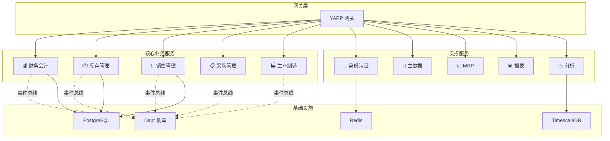
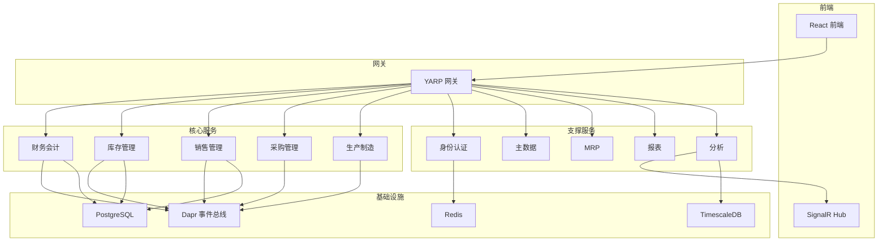
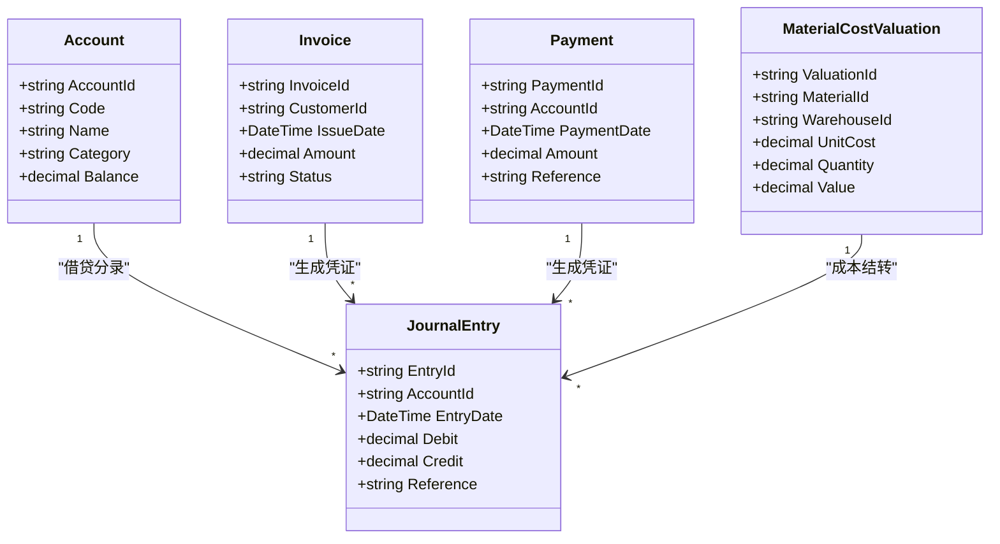
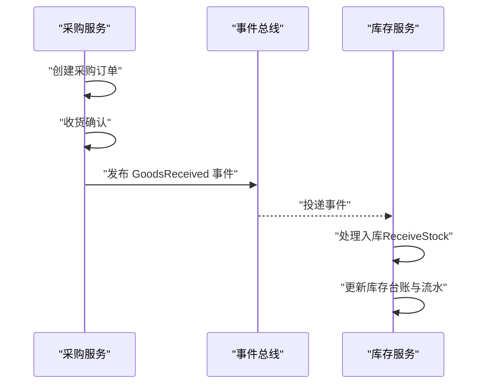
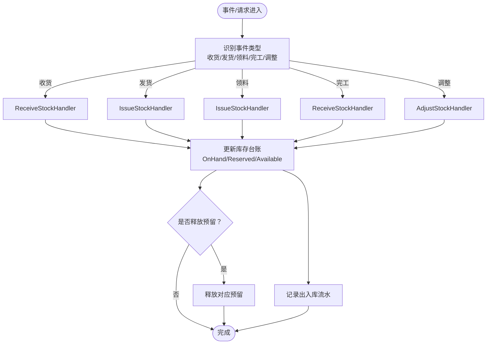
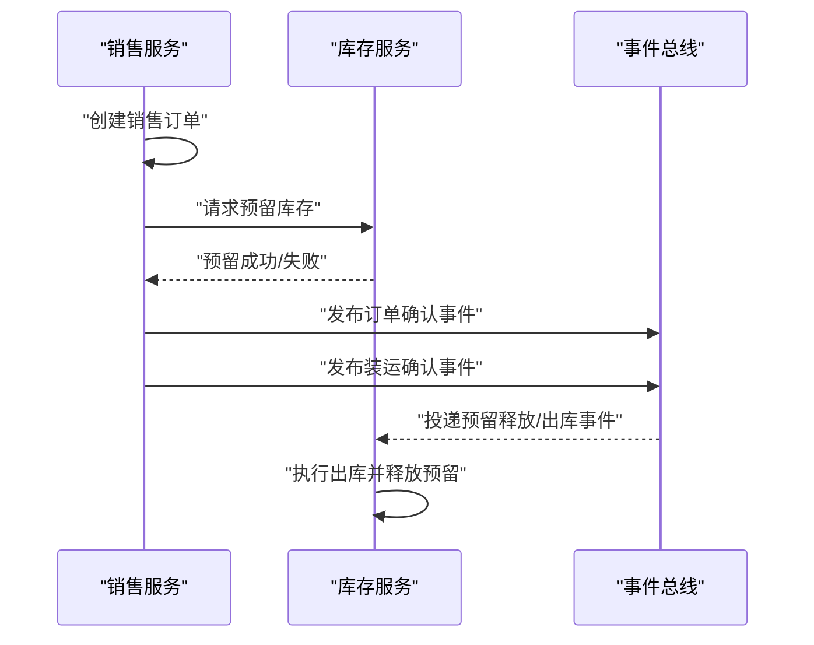
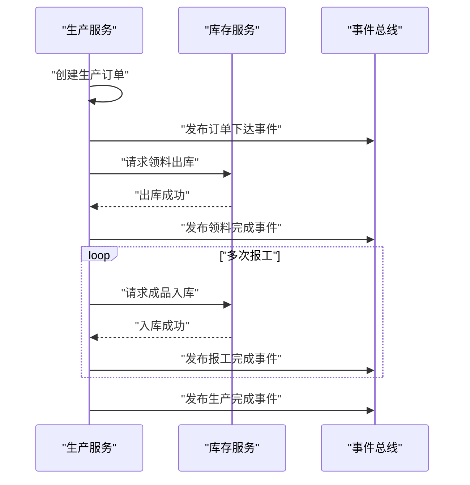
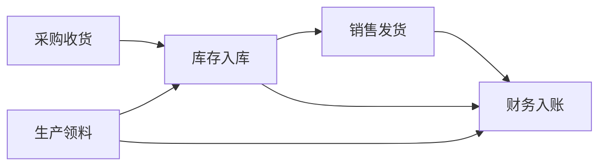
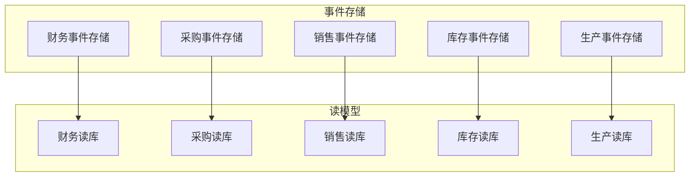

# 核心业务服务

<cite>
**本文引用的文件**
- [README.md](file://README.md)
- [PRD-05-Inventory-Service.md](file://docs/PRD-05-Inventory-Service.md)
- [PRD-07-Production-Service.md](file://docs/PRD-07-Production-Service.md)
- [Program.cs（财务）](file://src/Services/Finance/ErpSystem.Finance/Program.cs)
- [Program.cs（采购）](file://src/Services/Procurement/ErpSystem.Procurement/Program.cs)
- [Program.cs（销售）](file://src/Services/Sales/ErpSystem.Sales/Program.cs)
- [Program.cs（库存）](file://src/Services/Inventory/ErpSystem.Inventory/Program.cs)
- [Program.cs（生产）](file://src/Services/Production/ErpSystem.Production/Program.cs)
- [ErpSystem.BuildingBlocks.csproj](file://src/BuildingBlocks/ErpSystem.BuildingBlocks/ErpSystem.BuildingBlocks.csproj)
- [DependencyInjection.cs（BuildingBlocks）](file://src/BuildingBlocks/ErpSystem.BuildingBlocks/DependencyInjection.cs)
- [CQRS/Abstractions.cs（BuildingBlocks）](file://src/BuildingBlocks/ErpSystem.BuildingBlocks/CQRS/Abstractions.cs)
- [Domain/DomainEventDispatcher.cs（BuildingBlocks）](file://src/BuildingBlocks/ErpSystem.BuildingBlocks/Domain/DomainEventDispatcher.cs)
- [Outbox/OutboxInterceptor.cs（BuildingBlocks）](file://src/BuildingBlocks/ErpSystem.BuildingBlocks/Outbox/OutboxInterceptor.cs)
- [Outbox/OutboxProcessor.cs（BuildingBlocks）](file://src/BuildingBlocks/ErpSystem.BuildingBlocks/Outbox/OutboxProcessor.cs)
- [EventBus/DaprEventBus.cs（BuildingBlocks）](file://src/BuildingBlocks/ErpSystem.BuildingBlocks/EventBus/DaprEventBus.cs)
- [EventBus/EventBusExtensions.cs（BuildingBlocks）](file://src/BuildingBlocks/ErpSystem.BuildingBlocks/EventBus/EventBusExtensions.cs)
- [Behaviors/ValidationBehavior.cs（BuildingBlocks）](file://src/BuildingBlocks/ErpSystem.BuildingBlocks/Behaviors/ValidationBehavior.cs)
- [Behaviors/LoggingBehavior.cs（BuildingBlocks）](file://src/BuildingBlocks/ErpSystem.BuildingBlocks/Behaviors/LoggingBehavior.cs)
- [Behaviors/PerformanceBehavior.cs（BuildingBlocks）](file://src/BuildingBlocks/ErpSystem.BuildingBlocks/Behaviors/PerformanceBehavior.cs)
- [Behaviors/IdempotencyBehavior.cs（BuildingBlocks）](file://src/BuildingBlocks/ErpSystem.BuildingBlocks/Behaviors/IdempotencyBehavior.cs)
- [Middleware/Middlewares.cs（BuildingBlocks）](file://src/BuildingBlocks/ErpSystem.BuildingBlocks/Middleware/Middlewares.cs)
- [Auth/AuthExtensions.cs（BuildingBlocks）](file://src/BuildingBlocks/ErpSystem.BuildingBlocks/Auth/AuthExtensions.cs)
- [Auth/UserContext.cs（BuildingBlocks）](file://src/BuildingBlocks/ErpSystem.BuildingBlocks/Auth/UserContext.cs)
- [Auth/SignatureVerificationMiddleware.cs（BuildingBlocks）](file://src/BuildingBlocks/ErpSystem.BuildingBlocks/Auth/SignatureVerificationMiddleware.cs)
- [Analytics/Program.cs](file://src/Services/Analytics/ErpSystem.Analytics/Program.cs)
- [Analytics/BiAnalyticsService.cs](file://src/Services/Analytics/ErpSystem.Analytics/Infrastructure/BiAnalyticsService.cs)
- [Analytics/TimescaleDataExtractor.cs](file://src/Services/Analytics/ErpSystem.Analytics/Infrastructure/TimescaleDataExtractor.cs)
- [Analytics/DemandForecastEngine.cs](file://src/Services/Analytics/ErpSystem.Analytics/Infrastructure/DemandForecastEngine.cs)
- [Analytics/Hubs/AnalyticsHub.cs](file://src/Services/Analytics/ErpSystem.Analytics/API/Hubs/AnalyticsHub.cs)
- [Reporting/Program.cs](file://src/Services/Reporting/ErpSystem.Reporting/Program.cs)
- [Reporting/Controllers/DashboardController.cs](file://src/Services/Reporting/ErpSystem.Reporting/Controllers/DashboardController.cs)
- [Reporting/Application/DashboardService.cs](file://src/Services/Reporting/ErpSystem.Reporting/Application/DashboardService.cs)
- [Reporting/Application/ReportService.cs](file://src/Services/Reporting/ErpSystem.Reporting/Application/ReportService.cs)
- [Web前端入口（index.html）](file://src/Web/ErpSystem.Web/index.html)
- [Web前端页面（Dashboard.tsx）](file://src/Web/ErpSystem.Web/src/pages/Dashboard.tsx)
- [Web前端服务（api.ts）](file://src/Web/ErpSystem.Web/src/services/api.ts)
- [Web前端Hook（useAnalyticsHub.ts）](file://src/Web/ErpSystem.Web/src/hooks/useAnalyticsHub.ts)
- [Web前端布局（MainLayout.tsx）](file://src/Web/ErpSystem.Web/src/layout/MainLayout.tsx)
- [Web前端实时仪表盘（RealTimeDashboard.tsx）](file://src/Web/ErpSystem.Web/src/components/RealTimeDashboard.tsx)
- [Web前端设置API（settingsApi.ts）](file://src/Web/ErpSystem.Web/src/api/settingsApi.ts)
- [Web前端路由（App.tsx）](file://src/Web/ErpSystem.Web/src/App.tsx)
- [Web前端构建配置（vite.config.ts）](file://src/Web/ErpSystem.Web/vite.config.ts)
- [Web前端包配置（package.json）](file://src/Web/ErpSystem.Web/package.json)
- [Web前端样式（index.css）](file://src/Web/ErpSystem.Web/src/index.css)
- [Web前端TS配置（tsconfig.json）](file://src/Web/ErpSystem.Web/tsconfig.json)
- [Web前端TS配置（tsconfig.node.json）](file://src/Web/ErpSystem.Web/tsconfig.node.json)
- [Web前端PostCSS配置（postcss.config.cjs）](file://src/Web/ErpSystem.Web/postcss.config.cjs)
- [Web前端Tailwind配置（tailwind.config.cjs）](file://src/Web/ErpSystem.Web/tailwind.config.cjs)
- [Web前端Tailwind配置（tailwind.config.js）](file://src/Web/ErpSystem.Web/tailwind.config.js)
- [Web前端Dockerfile](file://src/Web/ErpSystem.Web/Dockerfile)
- [Gateway Program.cs](file://src/Gateways/ErpSystem.Gateway/Program.cs)
- [Gateway http请求示例](file://src/Gateways/ErpSystem.Gateway/ErpSystem.Gateway.http)
- [Kubernetes部署（finance.yaml）](file://deploy/k8s/services/finance.yaml)
- [Kubernetes部署（gateway.yaml）](file://deploy/k8s/services/gateway.yaml)
- [Kubernetes部署（inventory.yaml）](file://deploy/k8s/services/inventory.yaml)
- [Kubernetes部署（reporting.yaml）](file://deploy/k8s/services/reporting.yaml)
- [Helm Chart（Chart.yaml）](file://deploy/helm/erp-system/Chart.yaml)
- [Helm Values（values.yaml）](file://deploy/helm/erp-system/values.yaml)
- [Helm模板（deployment.yaml）](file://deploy/helm/erp-system/templates/deployment.yaml)
- [Helm模板（service.yaml）](file://deploy/helm/erp-system/templates/service.yaml)
- [Helm模板（ingress.yaml）](file://deploy/helm/erp-system/templates/ingress.yaml)
- [Helm模板（configmap.yaml）](file://deploy/helm/erp-system/templates/configmap.yaml)
- [Helm模板（_helpers.tpl）](file://deploy/helm/erp-system/templates/_helpers.tpl)
- [基础设施初始化SQL（init.sql）](file://infrastructure/init.sql)
- [TimescaleDB初始化SQL（timescale-init.sql）](file://infrastructure/timescale-init.sql)
- [集成测试（ProcurementToInventoryTests.cs）](file://src/Tests/ErpSystem.IntegrationTests/ProcurementToInventoryTests.cs)
- [集成测试（ProductionToInventoryTests.cs）](file://src/Tests/ErpSystem.IntegrationTests/ProductionToInventoryTests.cs)
- [集成测试（SalesToInventoryTests.cs）](file://src/Tests/ErpSystem.IntegrationTests/SalesToInventoryTests.cs)
- [集成测试（MrpCalculationTests.cs）](file://src/Tests/ErpSystem.IntegrationTests/MrpCalculationTests.cs)
- [集成测试（GLTests.cs）](file://src/Tests/ErpSystem.IntegrationTests/GLTests.cs)
- [集成测试（QualityWorkflowTests.cs）](file://src/Tests/ErpSystem.IntegrationTests/QualityWorkflowTests.cs)
- [集成测试（HRToIdentityTests.cs）](file://src/Tests/ErpSystem.IntegrationTests/HRToIdentityTests.cs)
- [集成测试（Analytics/PredictiveAnalyticsTests.cs）](file://src/Tests/ErpSystem.IntegrationTests/Analytics/PredictiveAnalyticsTests.cs)
</cite>

## 目录
1. [简介](#简介)
2. [项目结构](#项目结构)
3. [核心组件](#核心组件)
4. [架构总览](#架构总览)
5. [详细组件分析](#详细组件分析)
6. [依赖关系分析](#依赖关系分析)
7. [性能考虑](#性能考虑)
8. [故障排除指南](#故障排除指南)
9. [结论](#结论)
10. [附录](#附录)

## 简介
本文件为核心业务服务的技术与业务文档，聚焦财务会计、采购管理、库存管理、销售管理、生产制造五大核心模块。内容涵盖：
- 业务功能与数据模型定义
- API 接口与事件处理机制
- 服务间业务流程连接（采购到库存再到销售的供应链闭环）
- 事件溯源、CQRS、领域驱动设计（DDD）实践
- 服务配置、依赖注入、中间件与可观测性
- 为业务用户提供功能理解，为开发者提供架构设计与代码实现指导

## 项目结构
核心业务服务采用微服务架构，围绕事件总线与事件溯源构建，共享企业级“建筑块”（BuildingBlocks）能力，包含认证鉴权、行为管道、事件总线、CQRS 抽象、幂等性、审计、缓存、弹性与可观测性等。

图表来源
- [README.md](file://README.md#L130-L183)

章节来源
- [README.md](file://README.md#L289-L322)

## 核心组件
- 事件总线与事件溯源：各核心服务均注册事件总线与事件存储，结合 MediatR 实现命令/查询与领域事件解耦。
- CQRS：分离读写模型，使用 MediatR 的命令/查询处理器与投影服务。
- 领域驱动设计：聚合、值对象、领域事件与事件存储，确保业务一致性与可追溯性。
- 依赖注入与行为管道：统一注册 DbContext、事件存储、MediatR、行为（验证、日志、性能、幂等）。
- 中间件与认证：全局异常、请求日志、CorrelationId、JWT 鉴权与签名验证中间件。
- 实时分析与BI：SignalR 实时推送、TimescaleDB 时间序列分析、ML.NET 需求预测。

章节来源
- [Program.cs（财务）](file://src/Services/Finance/ErpSystem.Finance/Program.cs#L1-L88)
- [Program.cs（采购）](file://src/Services/Procurement/ErpSystem.Procurement/Program.cs#L1-L79)
- [Program.cs（销售）](file://src/Services/Sales/ErpSystem.Sales/Program.cs#L1-L79)
- [Program.cs（库存）](file://src/Services/Inventory/ErpSystem.Inventory/Program.cs#L1-L81)
- [Program.cs（生产）](file://src/Services/Production/ErpSystem.Production/Program.cs#L1-L79)
- [DependencyInjection.cs（BuildingBlocks）](file://src/BuildingBlocks/ErpSystem.BuildingBlocks/DependencyInjection.cs)
- [CQRS/Abstractions.cs（BuildingBlocks）](file://src/BuildingBlocks/ErpSystem.BuildingBlocks/CQRS/Abstractions.cs)
- [Domain/DomainEventDispatcher.cs（BuildingBlocks）](file://src/BuildingBlocks/ErpSystem.BuildingBlocks/Domain/DomainEventDispatcher.cs)
- [EventBus/DaprEventBus.cs（BuildingBlocks）](file://src/BuildingBlocks/ErpSystem.BuildingBlocks/EventBus/DaprEventBus.cs)
- [EventBus/EventBusExtensions.cs（BuildingBlocks）](file://src/BuildingBlocks/ErpSystem.BuildingBlocks/EventBus/EventBusExtensions.cs)
- [Behaviors/ValidationBehavior.cs（BuildingBlocks）](file://src/BuildingBlocks/ErpSystem.BuildingBlocks/Behaviors/ValidationBehavior.cs)
- [Behaviors/LoggingBehavior.cs（BuildingBlocks）](file://src/BuildingBlocks/ErpSystem.BuildingBlocks/Behaviors/LoggingBehavior.cs)
- [Behaviors/PerformanceBehavior.cs（BuildingBlocks）](file://src/BuildingBlocks/ErpSystem.BuildingBlocks/Behaviors/PerformanceBehavior.cs)
- [Behaviors/IdempotencyBehavior.cs（BuildingBlocks）](file://src/BuildingBlocks/ErpSystem.BuildingBlocks/Behaviors/IdempotencyBehavior.cs)
- [Middleware/Middlewares.cs（BuildingBlocks）](file://src/BuildingBlocks/ErpSystem.BuildingBlocks/Middleware/Middlewares.cs)
- [Auth/AuthExtensions.cs（BuildingBlocks）](file://src/BuildingBlocks/ErpSystem.BuildingBlocks/Auth/AuthExtensions.cs)
- [Auth/UserContext.cs（BuildingBlocks）](file://src/BuildingBlocks/ErpSystem.BuildingBlocks/Auth/UserContext.cs)
- [Auth/SignatureVerificationMiddleware.cs（BuildingBlocks）](file://src/BuildingBlocks/ErpSystem.BuildingBlocks/Auth/SignatureVerificationMiddleware.cs)

## 架构总览
核心业务服务遵循“事件驱动 + CQRS + DDD + 事件溯源”的架构风格，服务之间通过 Dapr 事件总线进行松耦合通信，读模型通过投影服务与数据库/时序库同步，前端通过网关访问各服务并借助 SignalR 实时接收分析数据。

图表来源
- [README.md](file://README.md#L130-L183)
- [Program.cs（财务）](file://src/Services/Finance/ErpSystem.Finance/Program.cs#L20-L46)
- [Program.cs（库存）](file://src/Services/Inventory/ErpSystem.Inventory/Program.cs#L19-L41)
- [Program.cs（销售）](file://src/Services/Sales/ErpSystem.Sales/Program.cs#L18-L42)
- [Program.cs（采购）](file://src/Services/Procurement/ErpSystem.Procurement/Program.cs#L18-L42)
- [Program.cs（生产）](file://src/Services/Production/ErpSystem.Production/Program.cs#L18-L42)
- [Analytics/Program.cs](file://src/Services/Analytics/ErpSystem.Analytics/Program.cs)
- [Reporting/Program.cs](file://src/Services/Reporting/ErpSystem.Reporting/Program.cs)

## 详细组件分析

### 财务会计服务（Finance）
- 业务功能
  - 总账（GL）：双分录、科目表、试算平衡与财务报表
  - 应收应付：发票、收款、付款与对账
  - 资产管理：资产登记、折旧与处置
  - 自动凭证：来自采购、销售、库存、生产的业务事件自动生成会计分录
- 数据模型
  - 科目（Account）、会计期间（FinancialPeriod）、日记账分录（JournalEntry）、发票（Invoice）、付款（Payment）、材料成本计价（MaterialCostValuation）
- API 接口
  - GL 控制器、发票控制器、集成事件控制器等
- 事件处理
  - 订阅采购、销售、库存、生产等服务的集成事件，生成总账分录与成本结转
- 事件溯源与 CQRS
  - 使用事件存储持久化领域事件，读模型通过投影服务同步到只读库
- 配置与依赖注入
  - 注册事件存储、MediatR、事件总线、DbContext、Swagger、授权

图表来源
- [Program.cs（财务）](file://src/Services/Finance/ErpSystem.Finance/Program.cs#L20-L46)

章节来源
- [Program.cs（财务）](file://src/Services/Finance/ErpSystem.Finance/Program.cs#L1-L88)

### 采购管理服务（Procurement）
- 业务功能
  - 供应商管理、采购申请与审批、采购订单生命周期、收货与质检、对账与付款
- 数据模型
  - 采购订单（PurchaseOrder）、采购订单行、收货单、质检记录
- API 接口
  - 采购控制器提供订单 CRUD、收货、对账等接口
- 事件处理
  - 发布“收货完成”等集成事件，驱动库存入库
- 事件溯源与 CQRS
  - 事件存储记录订单状态变迁，读模型投影用于查询
- 配置与依赖注入
  - 事件存储、MediatR、事件总线、DbContext、Swagger

图表来源
- [Program.cs（采购）](file://src/Services/Procurement/ErpSystem.Procurement/Program.cs#L18-L42)
- [Program.cs（库存）](file://src/Services/Inventory/ErpSystem.Inventory/Program.cs#L19-L41)

章节来源
- [Program.cs（采购）](file://src/Services/Procurement/ErpSystem.Procurement/Program.cs#L1-L79)

### 库存管理服务（Inventory）
- 业务功能
  - 实物数量管理：台账、出入库流水、库存预留、盘点与调整
  - 支持多仓库、未来支持批次/库位
- 数据模型
  - 库存台账（InventoryItem）、出入库流水（StockTransaction）、库存预留（StockReservation）、库存调整（StockAdjustment）
- API 接口
  - 可用库存查询、预留/释放、入库/出库、流水查询、调整接口
- 事件处理
  - 订阅采购收货、销售发货、生产领料/完工等事件，驱动库存变动
- 事件溯源与 CQRS
  - 事件存储记录库存变动，读模型投影用于查询与报表
- 配置与依赖注入
  - 事件存储、MediatR、事件总线、DbContext、Swagger、预测服务

图表来源
- [Program.cs（库存）](file://src/Services/Inventory/ErpSystem.Inventory/Program.cs#L19-L41)
- [PRD-05-Inventory-Service.md](file://docs/PRD-05-Inventory-Service.md#L164-L324)

章节来源
- [Program.cs（库存）](file://src/Services/Inventory/ErpSystem.Inventory/Program.cs#L1-L81)
- [PRD-05-Inventory-Service.md](file://docs/PRD-05-Inventory-Service.md#L1-L528)

### 销售管理服务（Sales）
- 业务功能
  - 客户管理、报价/订单、发货、开票、回款、销售分析
- 数据模型
  - 销售订单（SalesOrder）、销售订单行、装运（Shipment）、发票
- API 接口
  - 销售订单控制器、装运控制器、发票控制器
- 事件处理
  - 发布“订单确认”、“装运确认”等事件，驱动库存预留与出库
- 事件溯源与 CQRS
  - 事件存储记录订单状态变迁，读模型投影用于查询
- 配置与依赖注入
  - 事件存储、MediatR、事件总线、DbContext、Swagger

图表来源
- [Program.cs（销售）](file://src/Services/Sales/ErpSystem.Sales/Program.cs#L18-L42)
- [Program.cs（库存）](file://src/Services/Inventory/ErpSystem.Inventory/Program.cs#L19-L41)

章节来源
- [Program.cs（销售）](file://src/Services/Sales/ErpSystem.Sales/Program.cs#L1-L79)

### 生产制造服务（Production）
- 业务功能
  - 生产订单管理、投料（领料出库）、报工（半成品/成品入库）、在制品视图
- 数据模型
  - 生产订单（ProductionOrder）、投料记录（MaterialConsumption）、报工记录（ProductionReport）
- API 接口
  - 生产订单 CRUD、投料、报工、在制品查询
- 事件处理
  - 发布“领料完成”、“生产完成”等事件，驱动库存出入库
- 事件溯源与 CQRS
  - 事件存储记录订单状态变迁，读模型投影用于查询
- 配置与依赖注入
  - 事件存储、MediatR、事件总线、DbContext、Swagger

图表来源
- [Program.cs（生产）](file://src/Services/Production/ErpSystem.Production/Program.cs#L18-L42)
- [Program.cs（库存）](file://src/Services/Inventory/ErpSystem.Inventory/Program.cs#L19-L41)
- [PRD-07-Production-Service.md](file://docs/PRD-07-Production-Service.md#L238-L328)

章节来源
- [Program.cs（生产）](file://src/Services/Production/ErpSystem.Production/Program.cs#L1-L79)
- [PRD-07-Production-Service.md](file://docs/PRD-07-Production-Service.md#L1-L455)

### 供应链闭环（采购 → 库存 → 销售）

图表来源
- [PRD-05-Inventory-Service.md](file://docs/PRD-05-Inventory-Service.md#L326-L371)
- [PRD-07-Production-Service.md](file://docs/PRD-07-Production-Service.md#L312-L335)

## 依赖关系分析
- 服务间耦合
  - 通过 Dapr 事件总线进行异步解耦，避免直接调用
  - 读模型通过投影服务与数据库/时序库保持最终一致
- 外部依赖
  - PostgreSQL 用于事件存储与读模型
  - TimescaleDB 用于时间序列分析
  - Redis 用于身份认证缓存
- 循环依赖
  - 通过事件与投影避免循环调用，保持单向数据流

图表来源
- [Program.cs（财务）](file://src/Services/Finance/ErpSystem.Finance/Program.cs#L20-L24)
- [Program.cs（采购）](file://src/Services/Procurement/ErpSystem.Procurement/Program.cs#L18-L22)
- [Program.cs（销售）](file://src/Services/Sales/ErpSystem.Sales/Program.cs#L18-L22)
- [Program.cs（库存）](file://src/Services/Inventory/ErpSystem.Inventory/Program.cs#L19-L23)
- [Program.cs（生产）](file://src/Services/Production/ErpSystem.Production/Program.cs#L18-L22)

章节来源
- [Program.cs（财务）](file://src/Services/Finance/ErpSystem.Finance/Program.cs#L1-L88)
- [Program.cs（采购）](file://src/Services/Procurement/ErpSystem.Procurement/Program.cs#L1-L79)
- [Program.cs（销售）](file://src/Services/Sales/ErpSystem.Sales/Program.cs#L1-L79)
- [Program.cs（库存）](file://src/Services/Inventory/ErpSystem.Inventory/Program.cs#L1-L81)
- [Program.cs（生产）](file://src/Services/Production/ErpSystem.Production/Program.cs#L1-L79)

## 性能考虑
- 查询性能
  - 读写分离与投影服务，减少跨服务联表查询
  - 分页查询与索引优化，确保库存余额与流水查询在合理时间内返回
- 写入性能
  - 事件存储与事务性出站消息（Outbox），保证事件可靠发布
  - 幂等性处理避免重复事件导致的数据不一致
- 实时分析
  - TimescaleDB 高性能时间序列存储，SignalR 实时推送降低延迟
- 缓存与弹性
  - 分布式缓存与重试/熔断策略提升系统韧性

## 故障排除指南
- 事件未到达
  - 检查事件总线订阅与发布配置，确认事件类型与路由正确
- 库存不一致
  - 核对库存事件处理顺序与幂等性，检查调整/盘点流程
- 订单状态异常
  - 查看事件存储中的事件序列，定位状态机错误
- 性能问题
  - 检查数据库索引、查询计划与投影服务同步状态
- 认证与授权
  - 确认 JWT 配置与签名验证中间件生效，检查用户上下文与权限

章节来源
- [Outbox/OutboxInterceptor.cs（BuildingBlocks）](file://src/BuildingBlocks/ErpSystem.BuildingBlocks/Outbox/OutboxInterceptor.cs)
- [Outbox/OutboxProcessor.cs（BuildingBlocks）](file://src/BuildingBlocks/ErpSystem.BuildingBlocks/Outbox/OutboxProcessor.cs)
- [Behaviors/IdempotencyBehavior.cs（BuildingBlocks）](file://src/BuildingBlocks/ErpSystem.BuildingBlocks/Behaviors/IdempotencyBehavior.cs)
- [Auth/SignatureVerificationMiddleware.cs（BuildingBlocks）](file://src/BuildingBlocks/ErpSystem.BuildingBlocks/Auth/SignatureVerificationMiddleware.cs)

## 结论
本项目以事件驱动为核心，结合事件溯源、CQRS 与 DDD，构建了财务、采购、库存、销售、生产五大核心业务模块的闭环体系。通过统一的企业级建筑块，实现了认证、审计、缓存、弹性与可观测性等横切关注点，既满足业务用户的使用需求，也为开发者提供了清晰的架构与实现指导。

## 附录
- 前端与实时分析
  - 前端通过网关访问后端服务，使用 SignalR 实时接收分析数据
  - 提供仪表盘、销售趋势、库存报表等可视化界面
- 部署与运维
  - 支持 Kubernetes 与 Helm Chart，提供命名空间、ConfigMap、Secrets、Ingress 等资源
  - 基础设施包含 PostgreSQL、TimescaleDB、Redis 初始化脚本
- 测试与质量
  - 包含集成测试覆盖供应链闭环与核心模块，保障业务流程正确性

章节来源
- [Web前端入口（index.html）](file://src/Web/ErpSystem.Web/index.html)
- [Web前端页面（Dashboard.tsx）](file://src/Web/ErpSystem.Web/src/pages/Dashboard.tsx)
- [Web前端服务（api.ts）](file://src/Web/ErpSystem.Web/src/services/api.ts)
- [Web前端Hook（useAnalyticsHub.ts）](file://src/Web/ErpSystem.Web/src/hooks/useAnalyticsHub.ts)
- [Web前端布局（MainLayout.tsx）](file://src/Web/ErpSystem.Web/src/layout/MainLayout.tsx)
- [Web前端实时仪表盘（RealTimeDashboard.tsx）](file://src/Web/ErpSystem.Web/src/components/RealTimeDashboard.tsx)
- [Web前端设置API（settingsApi.ts）](file://src/Web/ErpSystem.Web/src/api/settingsApi.ts)
- [Web前端路由（App.tsx）](file://src/Web/ErpSystem.Web/src/App.tsx)
- [Web前端构建配置（vite.config.ts）](file://src/Web/ErpSystem.Web/vite.config.ts)
- [Web前端包配置（package.json）](file://src/Web/ErpSystem.Web/package.json)
- [Web前端样式（index.css）](file://src/Web/ErpSystem.Web/src/index.css)
- [Web前端TS配置（tsconfig.json）](file://src/Web/ErpSystem.Web/tsconfig.json)
- [Web前端TS配置（tsconfig.node.json）](file://src/Web/ErpSystem.Web/tsconfig.node.json)
- [Web前端PostCSS配置（postcss.config.cjs）](file://src/Web/ErpSystem.Web/postcss.config.cjs)
- [Web前端Tailwind配置（tailwind.config.cjs）](file://src/Web/ErpSystem.Web/tailwind.config.cjs)
- [Web前端Tailwind配置（tailwind.config.js）](file://src/Web/ErpSystem.Web/tailwind.config.js)
- [Web前端Dockerfile](file://src/Web/ErpSystem.Web/Dockerfile)
- [Gateway Program.cs](file://src/Gateways/ErpSystem.Gateway/Program.cs)
- [Gateway http请求示例](file://src/Gateways/ErpSystem.Gateway/ErpSystem.Gateway.http)
- [Kubernetes部署（finance.yaml）](file://deploy/k8s/services/finance.yaml)
- [Kubernetes部署（gateway.yaml）](file://deploy/k8s/services/gateway.yaml)
- [Kubernetes部署（inventory.yaml）](file://deploy/k8s/services/inventory.yaml)
- [Kubernetes部署（reporting.yaml）](file://deploy/k8s/services/reporting.yaml)
- [Helm Chart（Chart.yaml）](file://deploy/helm/erp-system/Chart.yaml)
- [Helm Values（values.yaml）](file://deploy/helm/erp-system/values.yaml)
- [Helm模板（deployment.yaml）](file://deploy/helm/erp-system/templates/deployment.yaml)
- [Helm模板（service.yaml）](file://deploy/helm/erp-system/templates/service.yaml)
- [Helm模板（ingress.yaml）](file://deploy/helm/erp-system/templates/ingress.yaml)
- [Helm模板（configmap.yaml）](file://deploy/helm/erp-system/templates/configmap.yaml)
- [Helm模板（_helpers.tpl）](file://deploy/helm/erp-system/templates/_helpers.tpl)
- [基础设施初始化SQL（init.sql）](file://infrastructure/init.sql)
- [TimescaleDB初始化SQL（timescale-init.sql）](file://infrastructure/timescale-init.sql)
- [集成测试（ProcurementToInventoryTests.cs）](file://src/Tests/ErpSystem.IntegrationTests/ProcurementToInventoryTests.cs)
- [集成测试（ProductionToInventoryTests.cs）](file://src/Tests/ErpSystem.IntegrationTests/ProductionToInventoryTests.cs)
- [集成测试（SalesToInventoryTests.cs）](file://src/Tests/ErpSystem.IntegrationTests/SalesToInventoryTests.cs)
- [集成测试（MrpCalculationTests.cs）](file://src/Tests/ErpSystem.IntegrationTests/MrpCalculationTests.cs)
- [集成测试（GLTests.cs）](file://src/Tests/ErpSystem.IntegrationTests/GLTests.cs)
- [集成测试（QualityWorkflowTests.cs）](file://src/Tests/ErpSystem.IntegrationTests/QualityWorkflowTests.cs)
- [集成测试（HRToIdentityTests.cs）](file://src/Tests/ErpSystem.IntegrationTests/HRToIdentityTests.cs)
- [集成测试（Analytics/PredictiveAnalyticsTests.cs）](file://src/Tests/ErpSystem.IntegrationTests/Analytics/PredictiveAnalyticsTests.cs)