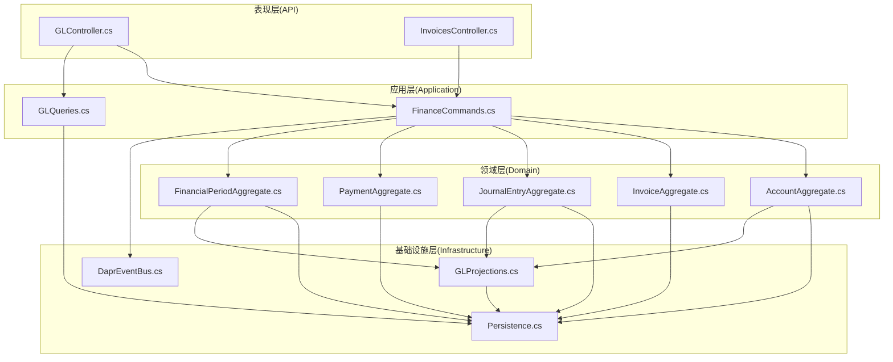
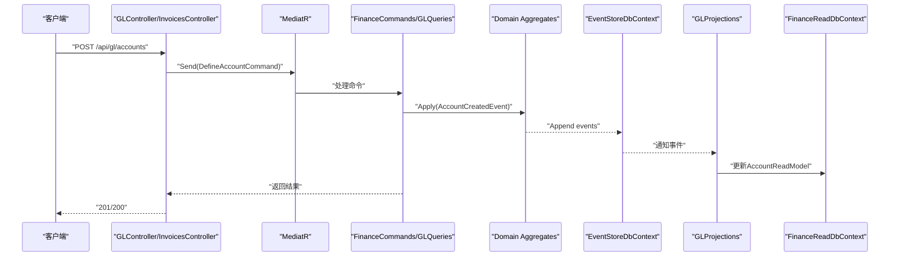
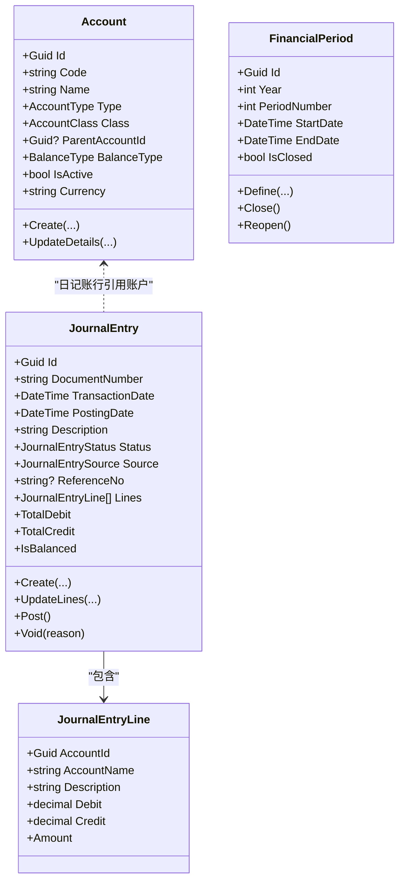
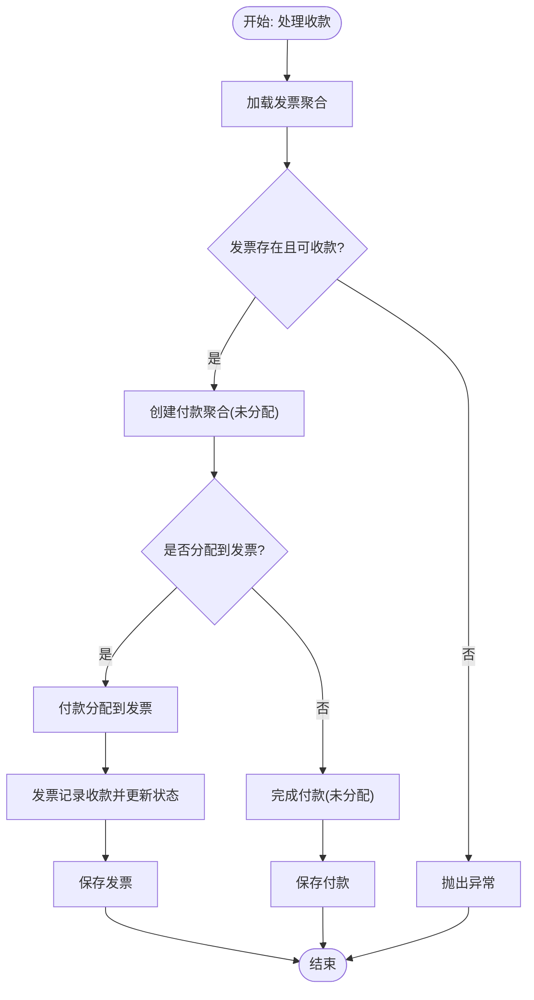
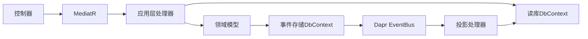

# 财务会计服务

<cite>
**本文引用的文件**
- [Program.cs](file://src/Services/Finance/ErpSystem.Finance/Program.cs)
- [appsettings.json](file://src/Services/Finance/ErpSystem.Finance/appsettings.json)
- [GLController.cs](file://src/Services/Finance/ErpSystem.Finance/API/GLController.cs)
- [InvoicesController.cs](file://src/Services/Finance/ErpSystem.Finance/API/InvoicesController.cs)
- [FinanceCommands.cs](file://src/Services/Finance/ErpSystem.Finance/Application/FinanceCommands.cs)
- [GLQueries.cs](file://src/Services/Finance/ErpSystem.Finance/Application/GLQueries.cs)
- [AccountAggregate.cs](file://src/Services/Finance/ErpSystem.Finance/Domain/AccountAggregate.cs)
- [InvoiceAggregate.cs](file://src/Services/Finance/ErpSystem.Finance/Domain/InvoiceAggregate.cs)
- [JournalEntryAggregate.cs](file://src/Services/Finance/ErpSystem.Finance/Domain/JournalEntryAggregate.cs)
- [PaymentAggregate.cs](file://src/Services/Finance/ErpSystem.Finance/Domain/PaymentAggregate.cs)
- [FinancialPeriodAggregate.cs](file://src/Services/Finance/ErpSystem.Finance/Domain/FinancialPeriodAggregate.cs)
- [Persistence.cs](file://src/Services/Finance/ErpSystem.Finance/Infrastructure/Persistence.cs)
- [GLProjections.cs](file://src/Services/Finance/ErpSystem.Finance/Infrastructure/GLProjections.cs)
- [DaprEventBus.cs](file://src/BuildingBlocks/ErpSystem.BuildingBlocks/EventBus/DaprEventBus.cs)
</cite>

## 目录
1. [简介](#简介)
2. [项目结构](#项目结构)
3. [核心组件](#核心组件)
4. [架构总览](#架构总览)
5. [详细组件分析](#详细组件分析)
6. [依赖关系分析](#依赖关系分析)
7. [性能考虑](#性能考虑)
8. [故障排除指南](#故障排除指南)
9. [结论](#结论)
10. [附录：API 接口文档](#附录api-接口文档)

## 简介
本文件为财务会计服务（ErpSystem.Finance）的全面技术文档，覆盖总账管理、应收应付管理、日记账与会计期间管理、以及基于事件溯源的财务审计与CQRS读写分离。文档重点解释账户聚合、发票聚合、日记账聚合等核心领域模型的设计理念；梳理财务事件处理、会计期间管理、付款处理等业务流程；提供完整的API接口定义；并深入说明事件存储配置、MediatR管道行为、Dapr事件总线集成等关键技术实现。

## 项目结构
财务会计服务采用分层与领域驱动设计（DDD）结合微服务架构，主要分为以下层次：
- 表现层（API 层）：控制器暴露REST接口，负责请求接收与响应返回。
- 应用层（Application）：命令/查询处理器，编排聚合操作与跨聚合协调。
- 领域层（Domain）：聚合根与值对象，封装业务规则与不变量。
- 基础设施层（Infrastructure）：事件存储、读模型投影、数据库上下文、事件总线适配器等。

图表来源
- [Program.cs](file://src/Services/Finance/ErpSystem.Finance/Program.cs#L20-L47)
- [GLController.cs](file://src/Services/Finance/ErpSystem.Finance/API/GLController.cs#L1-L76)
- [InvoicesController.cs](file://src/Services/Finance/ErpSystem.Finance/API/InvoicesController.cs#L1-L74)
- [FinanceCommands.cs](file://src/Services/Finance/ErpSystem.Finance/Application/FinanceCommands.cs#L1-L142)
- [GLQueries.cs](file://src/Services/Finance/ErpSystem.Finance/Application/GLQueries.cs#L1-L80)
- [AccountAggregate.cs](file://src/Services/Finance/ErpSystem.Finance/Domain/AccountAggregate.cs#L1-L87)
- [InvoiceAggregate.cs](file://src/Services/Finance/ErpSystem.Finance/Domain/InvoiceAggregate.cs#L1-L176)
- [JournalEntryAggregate.cs](file://src/Services/Finance/ErpSystem.Finance/Domain/JournalEntryAggregate.cs#L1-L136)
- [PaymentAggregate.cs](file://src/Services/Finance/ErpSystem.Finance/Domain/PaymentAggregate.cs#L1-L122)
- [FinancialPeriodAggregate.cs](file://src/Services/Finance/ErpSystem.Finance/Domain/FinancialPeriodAggregate.cs#L1-L73)
- [Persistence.cs](file://src/Services/Finance/ErpSystem.Finance/Infrastructure/Persistence.cs#L1-L132)
- [GLProjections.cs](file://src/Services/Finance/ErpSystem.Finance/Infrastructure/GLProjections.cs#L1-L151)
- [DaprEventBus.cs](file://src/BuildingBlocks/ErpSystem.BuildingBlocks/EventBus/DaprEventBus.cs#L1-L31)

章节来源
- [Program.cs](file://src/Services/Finance/ErpSystem.Finance/Program.cs#L1-L86)
- [appsettings.json](file://src/Services/Finance/ErpSystem.Finance/appsettings.json#L1-L12)

## 核心组件
- 事件存储与读库：使用PostgreSQL作为事件存储与读模型数据库，事件流以JSONB持久化，读模型包含账户、日记账、科目行、财务期间等。
- 事件总线：通过Dapr事件总线发布领域事件，支持跨服务解耦。
- MediatR：命令/查询管道，配合行为（日志、验证、幂等、性能）实现横切关注点。
- 领域模型：账户、发票、日记账、付款、财务期间等聚合根及事件，体现财务业务不变量。

章节来源
- [Persistence.cs](file://src/Services/Finance/ErpSystem.Finance/Infrastructure/Persistence.cs#L6-L50)
- [DaprEventBus.cs](file://src/BuildingBlocks/ErpSystem.BuildingBlocks/EventBus/DaprEventBus.cs#L11-L21)
- [Program.cs](file://src/Services/Finance/ErpSystem.Finance/Program.cs#L20-L47)

## 架构总览
财务会计服务采用事件溯源+CQRS架构：
- 写模型（命令侧）：聚合根记录领域事件，事件存储持久化事件流，事件由事件总线广播。
- 读模型（查询侧）：投影处理器监听事件，更新只读数据库中的读模型，查询端直接从读库取数。

图表来源
- [GLController.cs](file://src/Services/Finance/ErpSystem.Finance/API/GLController.cs#L12-L24)
- [FinanceCommands.cs](file://src/Services/Finance/ErpSystem.Finance/Application/FinanceCommands.cs#L53-L62)
- [AccountAggregate.cs](file://src/Services/Finance/ErpSystem.Finance/Domain/AccountAggregate.cs#L28-L38)
- [Persistence.cs](file://src/Services/Finance/ErpSystem.Finance/Infrastructure/Persistence.cs#L6-L18)
- [GLProjections.cs](file://src/Services/Finance/ErpSystem.Finance/Infrastructure/GLProjections.cs#L18-L34)
- [DaprEventBus.cs](file://src/BuildingBlocks/ErpSystem.BuildingBlocks/EventBus/DaprEventBus.cs#L15-L20)

## 详细组件分析

### 总账管理（账户与日记账）
- 账户聚合：支持资产、负债、权益、收入、费用五类，支持科目层级与余额方向控制，事件驱动状态变更。
- 日记账聚合：支持手工、销售、采购、库存、生产、薪资等来源，支持分录借贷平衡校验、过账与作废。
- 读模型：账户、日记账头与行、财务期间均以读模型形式维护，查询高效。

图表来源
- [AccountAggregate.cs](file://src/Services/Finance/ErpSystem.Finance/Domain/AccountAggregate.cs#L41-L87)
- [JournalEntryAggregate.cs](file://src/Services/Finance/ErpSystem.Finance/Domain/JournalEntryAggregate.cs#L55-L136)
- [FinancialPeriodAggregate.cs](file://src/Services/Finance/ErpSystem.Finance/Domain/FinancialPeriodAggregate.cs#L25-L73)

章节来源
- [AccountAggregate.cs](file://src/Services/Finance/ErpSystem.Finance/Domain/AccountAggregate.cs#L1-L87)
- [JournalEntryAggregate.cs](file://src/Services/Finance/ErpSystem.Finance/Domain/JournalEntryAggregate.cs#L1-L136)
- [FinancialPeriodAggregate.cs](file://src/Services/Finance/ErpSystem.Finance/Domain/FinancialPeriodAggregate.cs#L1-L73)
- [GLProjections.cs](file://src/Services/Finance/ErpSystem.Finance/Infrastructure/GLProjections.cs#L18-L149)
- [GLQueries.cs](file://src/Services/Finance/ErpSystem.Finance/Application/GLQueries.cs#L19-L79)

### 应收应付管理（发票与付款）
- 发票聚合：支持应收账款与应付账款类型，状态机覆盖草稿、已开票、部分收款、全部结清、核销、作废。
- 付款聚合：支持收支方向、多种付款方式，支持对发票进行分配与完成。
- 应用服务编排：创建发票、开票、收款登记、核销、取消等命令由应用层统一处理，必要时跨聚合协调。

图表来源
- [FinanceCommands.cs](file://src/Services/Finance/ErpSystem.Finance/Application/FinanceCommands.cs#L64-L105)

章节来源
- [InvoiceAggregate.cs](file://src/Services/Finance/ErpSystem.Finance/Domain/InvoiceAggregate.cs#L1-L176)
- [PaymentAggregate.cs](file://src/Services/Finance/ErpSystem.Finance/Domain/PaymentAggregate.cs#L1-L122)
- [FinanceCommands.cs](file://src/Services/Finance/ErpSystem.Finance/Application/FinanceCommands.cs#L1-L142)
- [InvoicesController.cs](file://src/Services/Finance/ErpSystem.Finance/API/InvoicesController.cs#L1-L74)

### 成本核算（材料成本计价）
- 材料成本计价聚合：用于记录材料入库、出库、计价策略与结转，支撑成本归集与结转。
- 事件存储与投影：事件驱动持久化，投影更新读模型，查询端按需统计。

章节来源
- [MaterialCostValuationAggregate.cs](file://src/Services/Finance/ErpSystem.Finance/Domain/MaterialCostValuationAggregate.cs)

### 财务报表（试算平衡）
- 查询处理器：按截止日期汇总已过账日记账行，计算每个科目的借方与贷方合计，生成试算平衡表。
- 性能建议：生产环境建议预计算或定期批处理生成余额快照，避免每次查询全量扫描。

章节来源
- [GLQueries.cs](file://src/Services/Finance/ErpSystem.Finance/Application/GLQueries.cs#L38-L78)

### 会计期间管理
- 财务期间聚合：定义期间、关闭、重新开启，期间状态影响凭证录入与报表生成。
- 投影同步：事件触发读模型更新，查询端根据期间状态过滤数据。

章节来源
- [FinancialPeriodAggregate.cs](file://src/Services/Finance/ErpSystem.Finance/Domain/FinancialPeriodAggregate.cs#L1-L73)
- [GLProjections.cs](file://src/Services/Finance/ErpSystem.Finance/Infrastructure/GLProjections.cs#L116-L149)

### 事件溯源与财务审计
- 事件存储：事件流按聚合ID与版本号存储，支持重放与审计追踪。
- 审计价值：完整记录每笔交易的“事实”，便于合规检查、回滚与问题定位。

章节来源
- [Persistence.cs](file://src/Services/Finance/ErpSystem.Finance/Infrastructure/Persistence.cs#L6-L18)
- [Program.cs](file://src/Services/Finance/ErpSystem.Finance/Program.cs#L40-L46)

### CQRS 在财务数据查询中的实现
- 写库（事件存储）：仅写入事件，保证一致性与可追溯性。
- 读库（只读）：投影更新读模型，查询端直接访问读库，提升查询性能。

章节来源
- [GLProjections.cs](file://src/Services/Finance/ErpSystem.Finance/Infrastructure/GLProjections.cs#L1-L151)
- [GLQueries.cs](file://src/Services/Finance/ErpSystem.Finance/Application/GLQueries.cs#L1-L80)

### Dapr 事件总线集成
- 事件发布：通过Dapr Pub/Sub发布领域事件，默认主题名为事件类型名。
- 解耦：服务间通过事件解耦，支持水平扩展与异步处理。

章节来源
- [DaprEventBus.cs](file://src/BuildingBlocks/ErpSystem.BuildingBlocks/EventBus/DaprEventBus.cs#L11-L21)
- [Program.cs](file://src/Services/Finance/ErpSystem.Finance/Program.cs#L26-L27)

## 依赖关系分析
- 组件耦合：控制器依赖MediatR；应用层依赖领域模型与读库；投影依赖事件总线与读库。
- 外部依赖：PostgreSQL（事件存储与读库）、Dapr（事件总线）。
- 潜在风险：事件重放与投影一致性、跨聚合事务边界（当前通过应用层编排与单事务事件存储约束）。

图表来源
- [Program.cs](file://src/Services/Finance/ErpSystem.Finance/Program.cs#L20-L47)
- [GLProjections.cs](file://src/Services/Finance/ErpSystem.Finance/Infrastructure/GLProjections.cs#L1-L151)
- [DaprEventBus.cs](file://src/BuildingBlocks/ErpSystem.BuildingBlocks/EventBus/DaprEventBus.cs#L11-L21)

## 性能考虑
- 读写分离：查询直接走读库，避免写路径阻塞。
- 索引优化：日记账行按日记账ID与账户ID建立索引，加速报表与试算平衡计算。
- 批处理与预计算：试算平衡等报表建议批处理生成快照，减少在线查询压力。
- 事件存储：事件流按聚合ID组织，避免跨聚合事务，提高吞吐。

章节来源
- [Persistence.cs](file://src/Services/Finance/ErpSystem.Finance/Infrastructure/Persistence.cs#L44-L48)
- [GLQueries.cs](file://src/Services/Finance/ErpSystem.Finance/Application/GLQueries.cs#L38-L78)

## 故障排除指南
- 命令处理异常：控制器对命令执行失败进行错误捕获与状态码返回，便于前端提示。
- 业务规则异常：聚合内部对非法状态转换抛出异常，应用层捕获并映射为HTTP错误。
- 数据库连接：确保PostgreSQL连接字符串正确，启动时自动创建数据库。
- 事件总线：确认Dapr Pub/Sub配置与主题订阅，避免事件丢失。

章节来源
- [GLController.cs](file://src/Services/Finance/ErpSystem.Finance/API/GLController.cs#L36-L44)
- [appsettings.json](file://src/Services/Finance/ErpSystem.Finance/appsettings.json#L9-L11)
- [Program.cs](file://src/Services/Finance/ErpSystem.Finance/Program.cs#L66-L71)

## 结论
财务会计服务通过事件溯源与CQRS实现了高可审计性与高性能查询能力，结合Dapr事件总线与多层架构，满足总账、应收应付、日记账与报表等核心财务场景。建议在生产环境中完善批处理与预计算、加强事件重放与一致性校验，并持续优化读模型索引与查询路径。

## 附录API 接口文档

### 总账管理
- 创建账户
  - 方法与路径：POST /api/gl/accounts
  - 请求体：DefineAccountCommand
  - 响应：201 Created，Location 指向账户列表
- 获取账户
  - 方法与路径：GET /api/gl/accounts
  - 响应：200 OK，账户列表
- 创建日记账分录
  - 方法与路径：POST /api/gl/journal-entries
  - 请求体：CreateJournalEntryCommand
  - 响应：200 OK，返回分录ID
- 过账日记账分录
  - 方法与路径：POST /api/gl/journal-entries/{id}/post
  - 响应：200 OK 或 400 Bad Request（如不平衡或状态不允许）
- 获取日记账详情
  - 方法与路径：GET /api/gl/journal-entries/{id}
  - 响应：200 OK 或 404 Not Found
- 试算平衡
  - 方法与路径：GET /api/gl/reports/trial-balance
  - 参数：asOfDate（可选）
  - 响应：200 OK，试算平衡行集合
- 定义会计期间
  - 方法与路径：POST /api/gl/periods
  - 请求体：DefineFinancialPeriodCommand
  - 响应：200 OK，返回期间ID
- 关闭会计期间
  - 方法与路径：POST /api/gl/periods/{id}/close
  - 响应：200 OK

章节来源
- [GLController.cs](file://src/Services/Finance/ErpSystem.Finance/API/GLController.cs#L12-L74)

### 应收应付管理
- 创建发票
  - 方法与路径：POST /api/v1/finance/invoices
  - 请求体：CreateInvoiceCommand
  - 响应：200 OK，返回发票ID
- 获取所有发票
  - 方法与路径：GET /api/v1/finance/invoices
  - 响应：200 OK，发票列表
- 获取发票详情
  - 方法与路径：GET /api/v1/finance/invoices/{id}
  - 响应：200 OK 或 404 Not Found
- 开票
  - 方法与路径：POST /api/v1/finance/invoices/{id}/issue
  - 响应：204 No Content
- 取消发票
  - 方法与路径：POST /api/v1/finance/invoices/{id}/cancel
  - 响应：204 No Content
- 核销发票
  - 方法与路径：POST /api/v1/finance/invoices/{id}/write-off
  - 请求体：string（核销原因）
  - 响应：204 No Content
- 录入收款
  - 方法与路径：POST /api/v1/finance/invoices/{id}/payments
  - 请求体：RecordPaymentCommand
  - 响应：200 OK，返回收款ID
- 获取发票收款明细
  - 方法与路径：GET /api/v1/finance/invoices/{id}/payments
  - 响应：200 OK，收款列表
- 应收/应付账龄分析
  - 方法与路径：GET /api/v1/finance/invoices/aging-analysis
  - 参数：type, asOf, partyId
  - 响应：200 OK，账龄分桶
- 获取逾期发票
  - 方法与路径：GET /api/v1/finance/invoices/overdue
  - 参数：type, asOf, partyId
  - 响应：200 OK，逾期发票列表

章节来源
- [InvoicesController.cs](file://src/Services/Finance/ErpSystem.Finance/API/InvoicesController.cs#L13-L73)