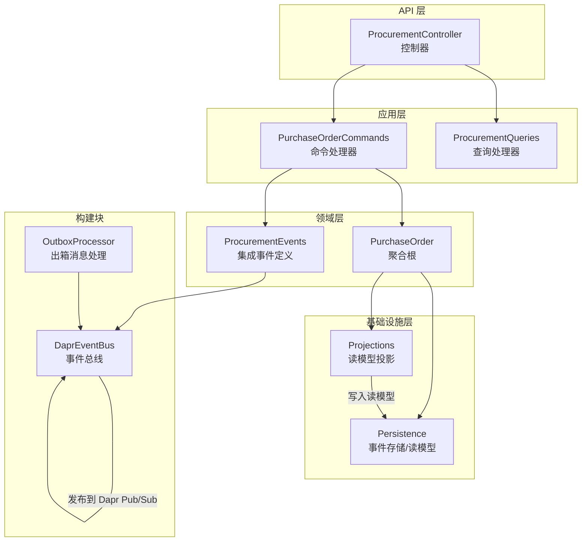
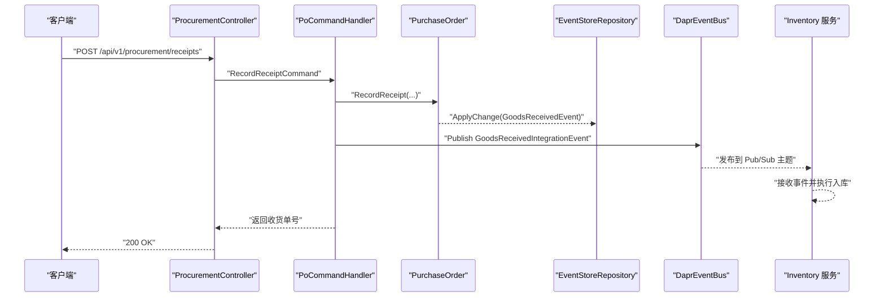
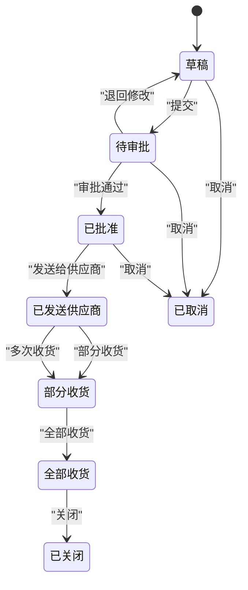
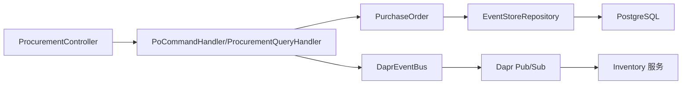
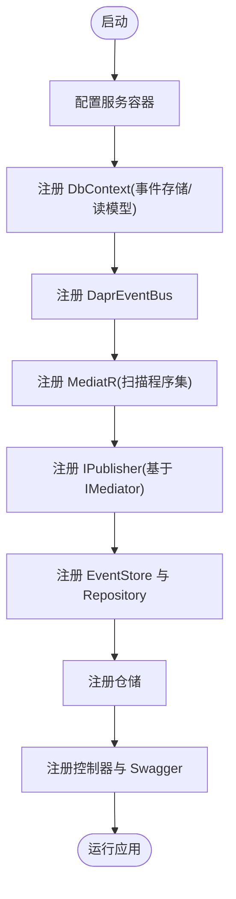

# 采购管理服务

<cite>
**本文引用的文件**
- [Program.cs](file://src/Services/Procurement/ErpSystem.Procurement/Program.cs)
- [ProcurementController.cs](file://src/Services/Procurement/ErpSystem.Procurement/API/ProcurementController.cs)
- [PurchaseOrderCommands.cs](file://src/Services/Procurement/ErpSystem.Procurement/Application/PurchaseOrderCommands.cs)
- [ProcurementQueries.cs](file://src/Services/Procurement/ErpSystem.Procurement/Application/ProcurementQueries.cs)
- [PurchaseOrderAggregate.cs](file://src/Services/Procurement/ErpSystem.Procurement/Domain/PurchaseOrderAggregate.cs)
- [ProcurementEvents.cs](file://src/Services/Procurement/ErpSystem.Procurement/Domain/ProcurementEvents.cs)
- [Persistence.cs](file://src/Services/Procurement/ErpSystem.Procurement/Infrastructure/Persistence.cs)
- [Projections.cs](file://src/Services/Procurement/ErpSystem.Procurement/Infrastructure/Projections.cs)
- [DaprEventBus.cs](file://src/BuildingBlocks/ErpSystem.BuildingBlocks/EventBus/DaprEventBus.cs)
- [OutboxProcessor.cs](file://src/BuildingBlocks/ErpSystem.BuildingBlocks/Outbox/OutboxProcessor.cs)
- [appsettings.json](file://src/Services/Procurement/ErpSystem.Procurement/appsettings.json)
- [ProcurementToInventoryTests.cs](file://src/Tests/ErpSystem.IntegrationTests/ProcurementToInventoryTests.cs)
- [IntegrationEventHandlers.cs](file://src/Services/Inventory/ErpSystem.Inventory/Application/IntegrationEventHandlers.cs)
</cite>

## 目录
1. [简介](#简介)
2. [项目结构](#项目结构)
3. [核心组件](#核心组件)
4. [架构概览](#架构概览)
5. [详细组件分析](#详细组件分析)
6. [依赖关系分析](#依赖关系分析)
7. [性能考虑](#性能考虑)
8. [故障排查指南](#故障排查指南)
9. [结论](#结论)
10. [附录](#附录)

## 简介
本文件为采购管理服务的技术文档，覆盖从采购申请到采购订单、收货处理、供应商结算的完整流程建模。重点阐述采购订单聚合的设计与状态机、物料清单处理、价格历史记录、事件驱动的集成机制，以及与库存服务的事件传播路径。同时提供基于 MediatR 的命令/查询处理、事件总线发布、读模型投影、以及端到端集成测试验证。

## 项目结构
采购服务采用分层架构：API 控制器接收请求，应用层通过 MediatR 处理命令/查询，领域层维护聚合与状态机，基础设施层负责事件存储与读模型投影，构建块提供事件总线、出箱消息处理等通用能力。

图表来源
- [Program.cs](file://src/Services/Procurement/ErpSystem.Procurement/Program.cs#L13-L46)
- [ProcurementController.cs](file://src/Services/Procurement/ErpSystem.Procurement/API/ProcurementController.cs#L9-L61)
- [PurchaseOrderCommands.cs](file://src/Services/Procurement/ErpSystem.Procurement/Application/PurchaseOrderCommands.cs#L27-L116)
- [ProcurementQueries.cs](file://src/Services/Procurement/ErpSystem.Procurement/Application/ProcurementQueries.cs#L13-L43)
- [PurchaseOrderAggregate.cs](file://src/Services/Procurement/ErpSystem.Procurement/Domain/PurchaseOrderAggregate.cs#L85-L198)
- [ProcurementEvents.cs](file://src/Services/Procurement/ErpSystem.Procurement/Domain/ProcurementEvents.cs#L5-L20)
- [Persistence.cs](file://src/Services/Procurement/ErpSystem.Procurement/Infrastructure/Persistence.cs#L6-L65)
- [Projections.cs](file://src/Services/Procurement/ErpSystem.Procurement/Infrastructure/Projections.cs#L7-L117)
- [DaprEventBus.cs](file://src/BuildingBlocks/ErpSystem.BuildingBlocks/EventBus/DaprEventBus.cs#L11-L21)
- [OutboxProcessor.cs](file://src/BuildingBlocks/ErpSystem.BuildingBlocks/Outbox/OutboxProcessor.cs#L8-L71)

章节来源
- [Program.cs](file://src/Services/Procurement/ErpSystem.Procurement/Program.cs#L1-L72)
- [appsettings.json](file://src/Services/Procurement/ErpSystem.Procurement/appsettings.json#L1-L12)

## 核心组件
- 依赖注入与运行时装配：在 Program 中注册数据库上下文、MediatR、事件总线、事件存储与仓储、控制器与 Swagger。
- 控制器：提供采购订单 CRUD 与状态变更接口，以及收货接口与价格历史查询接口。
- 应用层命令/查询：封装业务操作，协调聚合与事件发布。
- 领域层聚合：采购订单聚合根，定义状态机、业务规则与事件应用。
- 基础设施：事件存储 DbContext、读模型 DbContext、读模型投影。
- 构建块：事件总线（Dapr）、出箱消息后台处理。

章节来源
- [Program.cs](file://src/Services/Procurement/ErpSystem.Procurement/Program.cs#L13-L46)
- [ProcurementController.cs](file://src/Services/Procurement/ErpSystem.Procurement/API/ProcurementController.cs#L9-L61)
- [PurchaseOrderCommands.cs](file://src/Services/Procurement/ErpSystem.Procurement/Application/PurchaseOrderCommands.cs#L27-L116)
- [ProcurementQueries.cs](file://src/Services/Procurement/ErpSystem.Procurement/Application/ProcurementQueries.cs#L13-L43)
- [PurchaseOrderAggregate.cs](file://src/Services/Procurement/ErpSystem.Procurement/Domain/PurchaseOrderAggregate.cs#L85-L198)
- [Persistence.cs](file://src/Services/Procurement/ErpSystem.Procurement/Infrastructure/Persistence.cs#L6-L65)
- [Projections.cs](file://src/Services/Procurement/ErpSystem.Procurement/Infrastructure/Projections.cs#L7-L117)
- [DaprEventBus.cs](file://src/BuildingBlocks/ErpSystem.BuildingBlocks/EventBus/DaprEventBus.cs#L11-L21)
- [OutboxProcessor.cs](file://src/BuildingBlocks/ErpSystem.BuildingBlocks/Outbox/OutboxProcessor.cs#L8-L71)

## 架构概览
采购服务采用事件溯源与 CQRS 模式：
- 事件溯源：所有聚合变更以领域事件形式持久化，支持重放与审计。
- CQRS：写模型（聚合/事件存储）与读模型（投影）分离，读模型用于查询与报表。
- 事件驱动集成：通过 Dapr Pub/Sub 发布集成事件，库存服务订阅并执行入库。

图表来源
- [ProcurementController.cs](file://src/Services/Procurement/ErpSystem.Procurement/API/ProcurementController.cs#L57-L61)
- [PurchaseOrderCommands.cs](file://src/Services/Procurement/ErpSystem.Procurement/Application/PurchaseOrderCommands.cs#L72-L97)
- [PurchaseOrderAggregate.cs](file://src/Services/Procurement/ErpSystem.Procurement/Domain/PurchaseOrderAggregate.cs#L127-L140)
- [ProcurementEvents.cs](file://src/Services/Procurement/ErpSystem.Procurement/Domain/ProcurementEvents.cs#L7-L19)
- [DaprEventBus.cs](file://src/BuildingBlocks/ErpSystem.BuildingBlocks/EventBus/DaprEventBus.cs#L15-L20)
- [IntegrationEventHandlers.cs](file://src/Services/Inventory/ErpSystem.Inventory/Application/IntegrationEventHandlers.cs#L14-L32)

## 详细组件分析

### 采购订单聚合与状态管理
- 状态枚举：草稿、待审批、已批准、已发送供应商、部分收货、全部收货、已关闭、已取消。
- 关键方法与规则：
  - 提交：仅草稿可提交。
  - 审批：仅待审批可批准。
  - 发送：仅已批准可发送。
  - 收货：仅已发送或部分收货允许收货；校验行号存在；累计收货数量并更新状态。
  - 关闭/取消：关闭无业务限制；取消仅限特定阶段且未收货。
- 金额计算：行级单价×数量，聚合总金额为行级合计。

图表来源
- [PurchaseOrderAggregate.cs](file://src/Services/Procurement/ErpSystem.Procurement/Domain/PurchaseOrderAggregate.cs#L5-L15)
- [PurchaseOrderAggregate.cs](file://src/Services/Procurement/ErpSystem.Procurement/Domain/PurchaseOrderAggregate.cs#L109-L156)

章节来源
- [PurchaseOrderAggregate.cs](file://src/Services/Procurement/ErpSystem.Procurement/Domain/PurchaseOrderAggregate.cs#L5-L198)

### 物料清单与价格历史
- 物料清单：每行包含物料标识、编码、名称、订购数量、已收数量、单价、仓库、需求日期等；行级小计=订购数×单价。
- 价格历史：审批通过时，按行记录供应商、物料、单价、币种、生效时间的历史快照，便于后续结算与比价。

章节来源
- [PurchaseOrderAggregate.cs](file://src/Services/Procurement/ErpSystem.Procurement/Domain/PurchaseOrderAggregate.cs#L17-L30)
- [Projections.cs](file://src/Services/Procurement/ErpSystem.Procurement/Infrastructure/Projections.cs#L45-L61)
- [Persistence.cs](file://src/Services/Procurement/ErpSystem.Procurement/Infrastructure/Persistence.cs#L57-L65)

### 事件模型与集成
- 领域事件：订单创建、提交、审批、发送、收货、关闭、取消。
- 集成事件：收货后发布“货物已收”事件，携带物料、仓库、库位、数量等，库存服务据此入库。
- 事件总线：使用 Dapr Pub/Sub，默认主题名为事件类型名。

章节来源
- [PurchaseOrderAggregate.cs](file://src/Services/Procurement/ErpSystem.Procurement/Domain/PurchaseOrderAggregate.cs#L33-L82)
- [ProcurementEvents.cs](file://src/Services/Procurement/ErpSystem.Procurement/Domain/ProcurementEvents.cs#L7-L19)
- [DaprEventBus.cs](file://src/BuildingBlocks/ErpSystem.BuildingBlocks/EventBus/DaprEventBus.cs#L15-L20)

### 读模型与投影
- 事件到读模型：投影器监听领域事件，写入采购订单读模型、收货读模型与价格历史表。
- 查询优化：读库使用 JSONB 存储行集合，查询端按条件过滤与分页。

章节来源
- [Projections.cs](file://src/Services/Procurement/ErpSystem.Procurement/Infrastructure/Projections.cs#L16-L117)
- [Persistence.cs](file://src/Services/Procurement/ErpSystem.Procurement/Infrastructure/Persistence.cs#L20-L65)
- [ProcurementQueries.cs](file://src/Services/Procurement/ErpSystem.Procurement/Application/ProcurementQueries.cs#L13-L43)

### 依赖注入与 MediatR 注册
- 数据库：事件存储与读模型分别注册 DbContext。
- 事件总线：注册 DaprEventBus。
- MediatR：扫描当前程序集注册处理器。
- 事件存储：注册 EventStore 与 EventStoreRepository。
- 控制器：注册 API 控制器与 Swagger。

章节来源
- [Program.cs](file://src/Services/Procurement/ErpSystem.Procurement/Program.cs#L15-L46)

### API 接口定义
- 采购订单
  - POST /api/v1/procurement/purchase-orders：创建订单
  - GET /api/v1/procurement/purchase-orders：按供应商/状态分页查询
  - GET /api/v1/procurement/purchase-orders/{id}：按 ID 查询
  - POST /api/v1/procurement/purchase-orders/{id}/submit：提交
  - POST /api/v1/procurement/purchase-orders/{id}/approve：审批
  - POST /api/v1/procurement/purchase-orders/{id}/send：发送
  - POST /api/v1/procurement/purchase-orders/{id}/close：关闭
  - POST /api/v1/procurement/purchase-orders/{id}/cancel：取消
  - GET /api/v1/procurement/purchase-orders/prices：查询供应商价格历史
- 收货
  - POST /api/v1/procurement/receipts：记录收货

章节来源
- [ProcurementController.cs](file://src/Services/Procurement/ErpSystem.Procurement/API/ProcurementController.cs#L9-L61)
- [ProcurementQueries.cs](file://src/Services/Procurement/ErpSystem.Procurement/Application/ProcurementQueries.cs#L7-L11)

### 与库存服务的事件传播
- 采购收货完成后，发布“货物已收”集成事件。
- 库存服务订阅该事件，逐项执行入库操作（仓库、库位、物料、数量）。

章节来源
- [PurchaseOrderCommands.cs](file://src/Services/Procurement/ErpSystem.Procurement/Application/PurchaseOrderCommands.cs#L81-L94)
- [IntegrationEventHandlers.cs](file://src/Services/Inventory/ErpSystem.Inventory/Application/IntegrationEventHandlers.cs#L14-L32)

### 业务规则与数据一致性
- 业务规则：
  - 状态流转严格受控（草稿→提交→审批→发送→收货→关闭/取消）。
  - 收货前校验行号存在，避免错配。
  - 取消前检查是否已有收货。
- 一致性保障：
  - 事件存储确保聚合变更可追溯与重放。
  - 投影器同步更新读模型，查询与事件解耦。
  - 出箱消息后台处理保证跨服务事件最终一致。

章节来源
- [PurchaseOrderAggregate.cs](file://src/Services/Procurement/ErpSystem.Procurement/Domain/PurchaseOrderAggregate.cs#L109-L156)
- [Projections.cs](file://src/Services/Procurement/ErpSystem.Procurement/Infrastructure/Projections.cs#L69-L104)
- [OutboxProcessor.cs](file://src/BuildingBlocks/ErpSystem.BuildingBlocks/Outbox/OutboxProcessor.cs#L8-L71)

## 依赖关系分析
- 组件耦合：
  - 控制器依赖应用层命令/查询。
  - 应用层依赖领域聚合与事件总线。
  - 领域层依赖事件存储与读模型投影。
  - 事件总线依赖 Dapr 客户端。
- 外部依赖：
  - PostgreSQL 作为事件存储与读模型存储。
  - Dapr Pub/Sub 作为事件传输通道。

图表来源
- [Program.cs](file://src/Services/Procurement/ErpSystem.Procurement/Program.cs#L15-L46)
- [PurchaseOrderCommands.cs](file://src/Services/Procurement/ErpSystem.Procurement/Application/PurchaseOrderCommands.cs#L27-L116)
- [PurchaseOrderAggregate.cs](file://src/Services/Procurement/ErpSystem.Procurement/Domain/PurchaseOrderAggregate.cs#L85-L198)
- [DaprEventBus.cs](file://src/BuildingBlocks/ErpSystem.BuildingBlocks/EventBus/DaprEventBus.cs#L11-L21)
- [Persistence.cs](file://src/Services/Procurement/ErpSystem.Procurement/Infrastructure/Persistence.cs#L6-L31)

## 性能考虑
- 事件存储：批量写入与版本号递增，建议对事件表建立复合索引（聚合 ID+版本）。
- 读模型：JSONB 字段查询需结合合适的 GIN/索引策略；分页查询注意排序字段与过滤条件。
- 事件总线：批量处理与退避重试策略，避免瞬时峰值。
- 并发控制：聚合加载与保存采用乐观并发，冲突时重试或回滚。

## 故障排查指南
- 事件发布失败：
  - 检查 Dapr Pub/Sub 配置与主题订阅。
  - 使用出箱消息处理器日志定位失败消息。
- 状态流转异常：
  - 核对当前聚合状态与可用动作。
  - 查看事件存储中最近事件是否正确应用。
- 读模型不同步：
  - 确认投影器是否正常运行。
  - 检查读库连接与权限。
- 集成测试验证：
  - 通过集成测试链路验证从创建 PO 到收货再到库存入库的端到端流程。

章节来源
- [OutboxProcessor.cs](file://src/BuildingBlocks/ErpSystem.BuildingBlocks/Outbox/OutboxProcessor.cs#L8-L71)
- [ProcurementToInventoryTests.cs](file://src/Tests/ErpSystem.IntegrationTests/ProcurementToInventoryTests.cs#L13-L79)

## 结论
采购管理服务通过事件溯源与 CQRS 实现了高内聚的领域模型与清晰的读写分离，配合 Dapr 事件总线实现了与库存服务的松耦合集成。完善的业务规则与读模型投影保障了数据一致性与查询效率，适合在复杂供应链场景下演进与扩展。

## 附录

### 依赖注入与 MediatR 注册流程

图表来源
- [Program.cs](file://src/Services/Procurement/ErpSystem.Procurement/Program.cs#L15-L46)