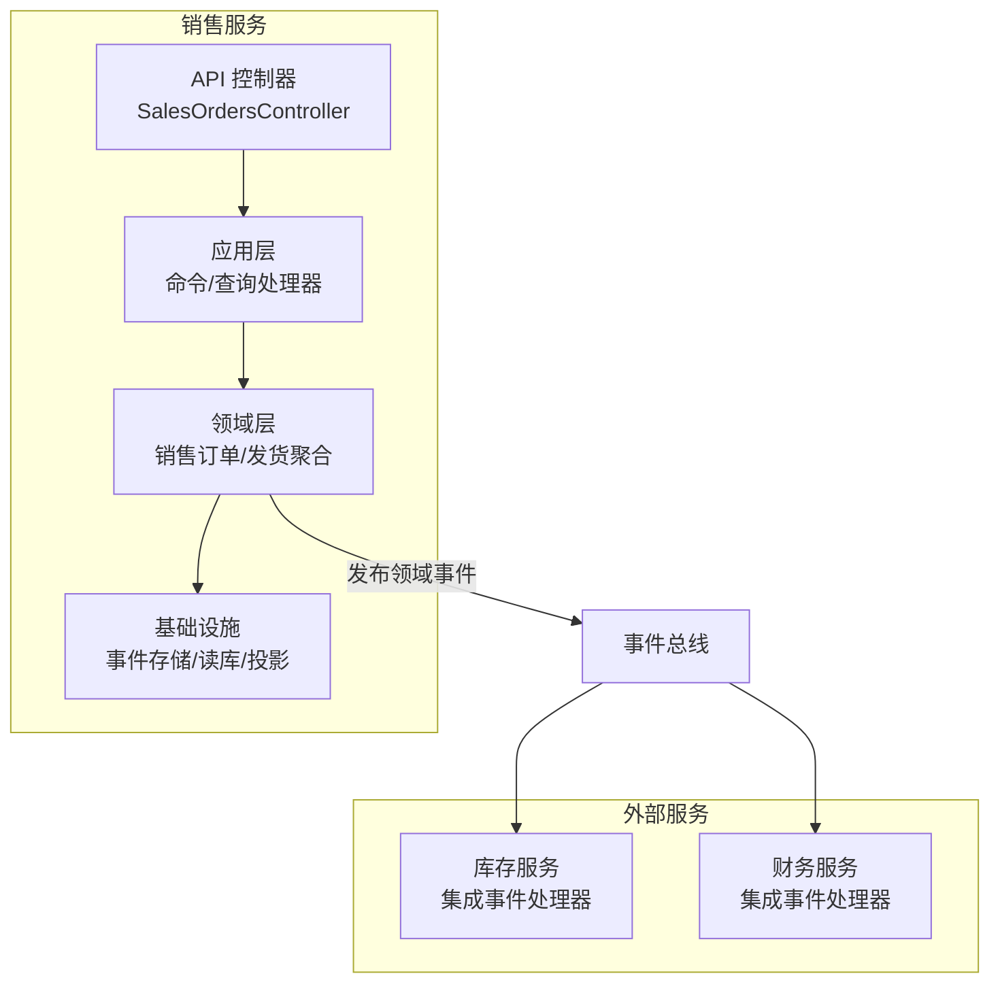
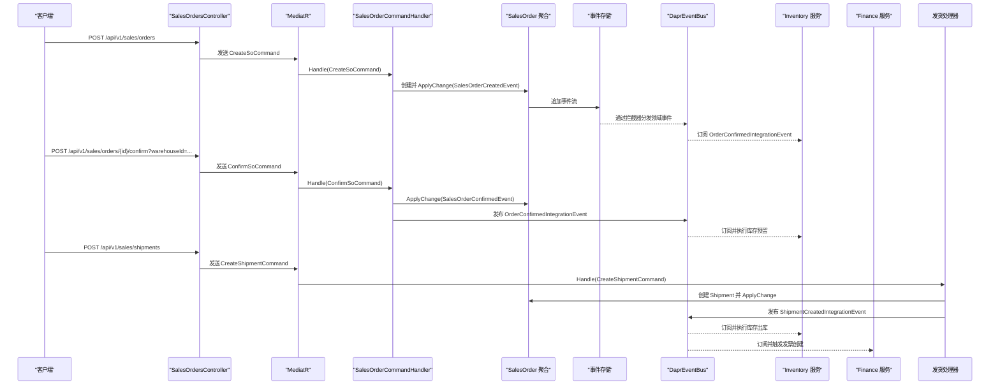
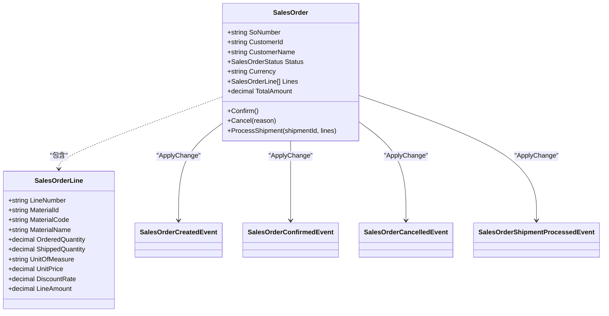
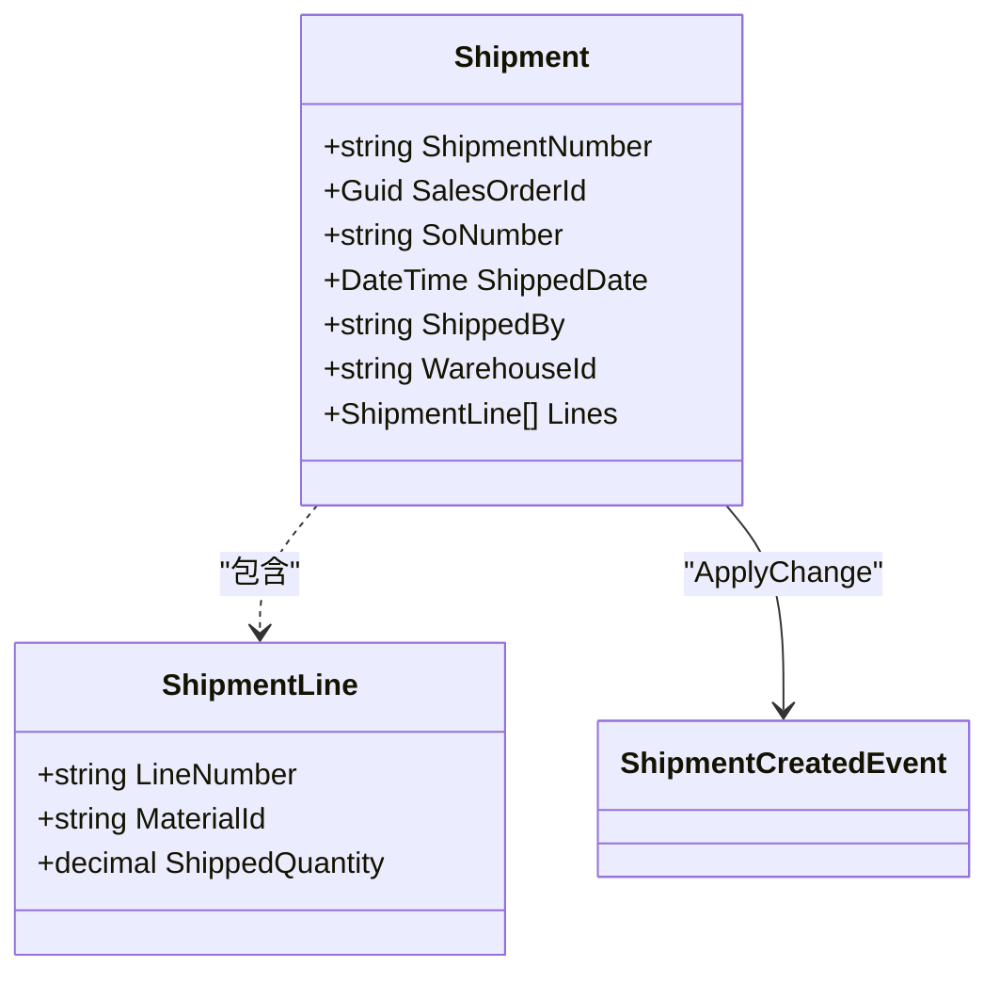
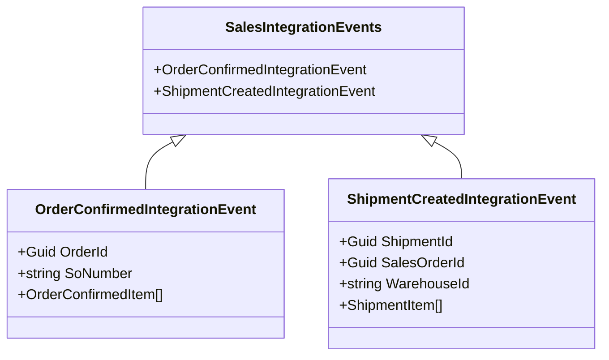
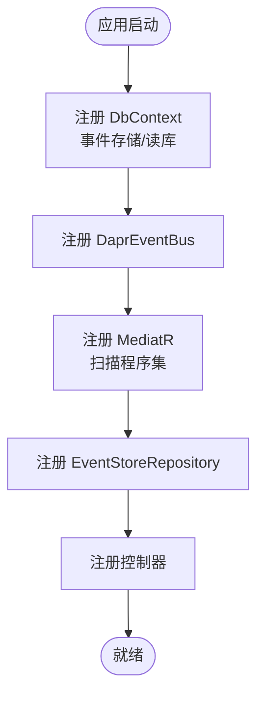
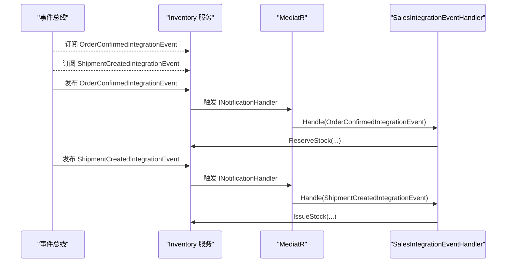
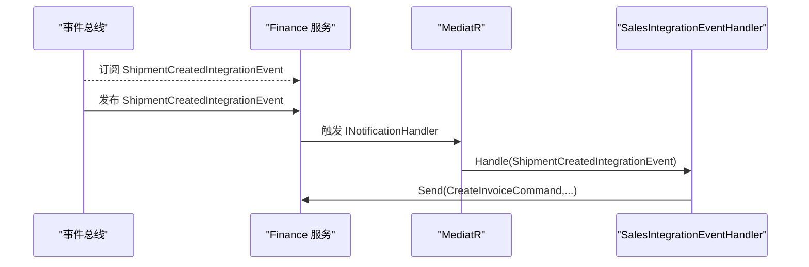
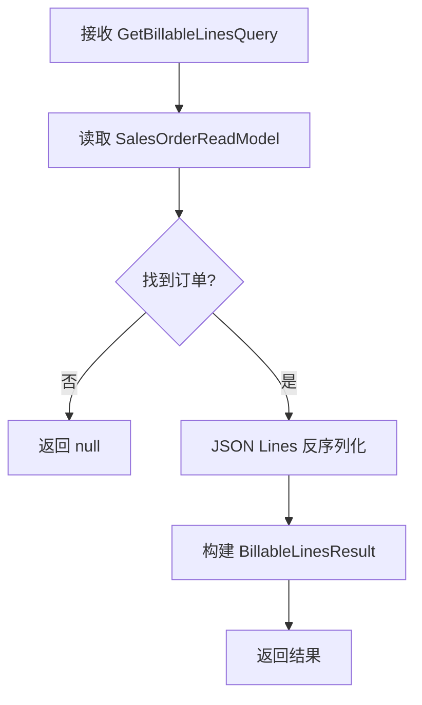
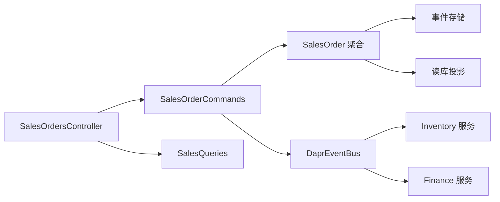

# 销售管理服务

<cite>
**本文引用的文件**
- [Program.cs](file://src/Services/Sales/ErpSystem.Sales/Program.cs)
- [SalesOrdersController.cs](file://src/Services/Sales/ErpSystem.Sales/API/SalesOrdersController.cs)
- [ShipmentCommands.cs](file://src/Services/Sales/ErpSystem.Sales/Application/ShipmentCommands.cs)
- [SalesOrderCommands.cs](file://src/Services/Sales/ErpSystem.Sales/Application/SalesOrderCommands.cs)
- [SalesQueries.cs](file://src/Services/Sales/ErpSystem.Sales/Application/SalesQueries.cs)
- [SalesOrderAggregate.cs](file://src/Services/Sales/ErpSystem.Sales/Domain/SalesOrderAggregate.cs)
- [ShipmentAggregate.cs](file://src/Services/Sales/ErpSystem.Sales/Domain/ShipmentAggregate.cs)
- [SalesEvents.cs](file://src/Services/Sales/ErpSystem.Sales/Domain/SalesEvents.cs)
- [Persistence.cs](file://src/Services/Sales/ErpSystem.Sales/Infrastructure/Persistence.cs)
- [Projections.cs](file://src/Services/Sales/ErpSystem.Sales/Infrastructure/Projections.cs)
- [DaprEventBus.cs](file://src/BuildingBlocks/ErpSystem.BuildingBlocks/EventBus/DaprEventBus.cs)
- [DomainEventDispatcher.cs](file://src/BuildingBlocks/ErpSystem.BuildingBlocks/Domain/DomainEventDispatcher.cs)
- [DependencyInjection.cs](file://src/BuildingBlocks/ErpSystem.BuildingBlocks/DependencyInjection.cs)
- [IntegrationEventHandlers.cs（Inventory）](file://src/Services/Inventory/ErpSystem.Inventory/Application/IntegrationEventHandlers.cs)
- [IntegrationEventHandlers.cs（Finance）](file://src/Services/Finance/ErpSystem.Finance/Application/IntegrationEventHandlers.cs)
</cite>

## 目录
1. [简介](#简介)
2. [项目结构](#项目结构)
3. [核心组件](#核心组件)
4. [架构总览](#架构总览)
5. [详细组件分析](#详细组件分析)
6. [依赖关系分析](#依赖关系分析)
7. [性能考虑](#性能考虑)
8. [故障排查指南](#故障排查指南)
9. [结论](#结论)
10. [附录：API 接口清单](#附录api-接口清单)

## 简介
本文件为销售管理服务的技术文档，覆盖销售订单管理、发货处理、客户开票、应收账款等完整销售流程。重点阐述销售订单聚合的设计（订单行项目管理、价格计算、折扣处理、交货安排）、销售事件模型（订单确认、发货完成、发票创建、收款处理等业务事件的处理机制）、与客户管理、库存管理、财务会计的事件集成，以及依赖注入配置、MediatR 处理器注册和事件存储集成。

## 项目结构
销售管理服务采用分层与领域驱动设计（DDD）结合的组织方式：
- API 层：控制器暴露 CRUD 与状态变更接口
- 应用层：命令/查询处理器，协调聚合与事件发布
- 领域层：聚合根与领域事件，定义业务规则与状态变迁
- 基础设施层：事件存储、读模型投影、EF Core 上下文
- 建筑块：事件总线、领域事件分发、通用依赖注入扩展

图表来源
- [Program.cs](file://src/Services/Sales/ErpSystem.Sales/Program.cs#L15-L46)
- [SalesOrdersController.cs](file://src/Services/Sales/ErpSystem.Sales/API/SalesOrdersController.cs#L7-L44)
- [SalesOrderAggregate.cs](file://src/Services/Sales/ErpSystem.Sales/Domain/SalesOrderAggregate.cs#L67-L147)
- [ShipmentAggregate.cs](file://src/Services/Sales/ErpSystem.Sales/Domain/ShipmentAggregate.cs#L21-L60)
- [Projections.cs](file://src/Services/Sales/ErpSystem.Sales/Infrastructure/Projections.cs#L7-L87)
- [DaprEventBus.cs](file://src/BuildingBlocks/ErpSystem.BuildingBlocks/EventBus/DaprEventBus.cs#L11-L21)

章节来源
- [Program.cs](file://src/Services/Sales/ErpSystem.Sales/Program.cs#L1-L72)
- [SalesOrdersController.cs](file://src/Services/Sales/ErpSystem.Sales/API/SalesOrdersController.cs#L1-L45)

## 核心组件
- 事件存储与读库：使用 PostgreSQL + EF Core，事件流持久化于事件表，读模型通过投影写入 SalesOrders/Shipments 表
- 领域事件与聚合：销售订单与发货分别以聚合根形式建模，状态机驱动业务流转
- 事件总线：基于 Dapr Pub/Sub 的发布机制，统一主题命名策略
- MediatR：命令/查询管道，行为横切（日志、验证）
- 投影：监听领域事件，更新读模型，支持搜索与账单行查询

章节来源
- [Persistence.cs](file://src/Services/Sales/ErpSystem.Sales/Infrastructure/Persistence.cs#L6-L56)
- [Projections.cs](file://src/Services/Sales/ErpSystem.Sales/Infrastructure/Projections.cs#L7-L87)
- [DaprEventBus.cs](file://src/BuildingBlocks/ErpSystem.BuildingBlocks/EventBus/DaprEventBus.cs#L11-L21)
- [DependencyInjection.cs](file://src/BuildingBlocks/ErpSystem.BuildingBlocks/DependencyInjection.cs#L10-L29)

## 架构总览
销售管理服务通过“事件溯源 + CQRS”的架构实现：
- 写模型（事件存储）：聚合根产生领域事件，经拦截器分发给 MediatR，再由事件总线发布到 Dapr Pub/Sub
- 读模型（投影）：各服务订阅集成事件，更新本地读库；销售服务自身也维护 SalesOrders/Shipments 读模型
- 业务闭环：库存服务根据“订单已确认”进行预留，根据“发货已创建”进行出库；财务服务在发货后自动生成应收发票

图表来源
- [SalesOrdersController.cs](file://src/Services/Sales/ErpSystem.Sales/API/SalesOrdersController.cs#L11-L35)
- [SalesOrderCommands.cs](file://src/Services/Sales/ErpSystem.Sales/Application/SalesOrderCommands.cs#L20-L55)
- [ShipmentCommands.cs](file://src/Services/Sales/ErpSystem.Sales/Application/ShipmentCommands.cs#L16-L60)
- [SalesEvents.cs](file://src/Services/Sales/ErpSystem.Sales/Domain/SalesEvents.cs#L5-L31)
- [DaprEventBus.cs](file://src/BuildingBlocks/ErpSystem.BuildingBlocks/EventBus/DaprEventBus.cs#L11-L21)
- [IntegrationEventHandlers.cs（Inventory）](file://src/Services/Inventory/ErpSystem.Inventory/Application/IntegrationEventHandlers.cs#L34-L74)
- [IntegrationEventHandlers.cs（Finance）](file://src/Services/Finance/ErpSystem.Finance/Application/IntegrationEventHandlers.cs#L6-L32)

## 详细组件分析

### 销售订单聚合与事件模型
- 聚合根：SalesOrder，包含编号、客户信息、币种、订单行、状态机与金额汇总
- 订单行：包含物料、数量、单价、折扣率与行金额计算
- 领域事件：订单创建、确认、取消、发货处理
- 状态机：草稿/待审批/已确认/部分发货/全部发货/关闭/作废

图表来源
- [SalesOrderAggregate.cs](file://src/Services/Sales/ErpSystem.Sales/Domain/SalesOrderAggregate.cs#L67-L147)
- [SalesOrderAggregate.cs](file://src/Services/Sales/ErpSystem.Sales/Domain/SalesOrderAggregate.cs#L16-L29)
- [SalesOrderAggregate.cs](file://src/Services/Sales/ErpSystem.Sales/Domain/SalesOrderAggregate.cs#L32-L62)

章节来源
- [SalesOrderAggregate.cs](file://src/Services/Sales/ErpSystem.Sales/Domain/SalesOrderAggregate.cs#L1-L148)

### 发货聚合与事件模型
- 聚合根：Shipment，记录发货单号、关联销售订单、仓库、发货日期与明细
- 领域事件：发货创建
- 与销售订单的协作：发货创建后，销售订单更新行级发货数量与整体状态

图表来源
- [ShipmentAggregate.cs](file://src/Services/Sales/ErpSystem.Sales/Domain/ShipmentAggregate.cs#L21-L60)
- [ShipmentAggregate.cs](file://src/Services/Sales/ErpSystem.Sales/Domain/ShipmentAggregate.cs#L5-L5)

章节来源
- [ShipmentAggregate.cs](file://src/Services/Sales/ErpSystem.Sales/Domain/ShipmentAggregate.cs#L1-L61)

### 销售事件模型与集成事件
- 集成事件：订单确认、发货创建
- 订阅方：库存服务（预留/出库）、财务服务（自动开票）

图表来源
- [SalesEvents.cs](file://src/Services/Sales/ErpSystem.Sales/Domain/SalesEvents.cs#L5-L31)

章节来源
- [SalesEvents.cs](file://src/Services/Sales/ErpSystem.Sales/Domain/SalesEvents.cs#L1-L32)

### 依赖注入与事件存储集成
- DbContext：事件存储上下文与读库上下文分离
- 事件存储：基于事件流表，聚合版本号作为联合主键
- 投影：监听领域事件，写入 SalesOrders/Shipments 读模型
- MediatR：注册处理器程序集，行为管道（日志、验证）
- 事件总线：Dapr Pub/Sub，默认主题名为事件类型名

图表来源
- [Program.cs](file://src/Services/Sales/ErpSystem.Sales/Program.cs#L15-L46)
- [Persistence.cs](file://src/Services/Sales/ErpSystem.Sales/Infrastructure/Persistence.cs#L6-L30)
- [Projections.cs](file://src/Services/Sales/ErpSystem.Sales/Infrastructure/Projections.cs#L7-L13)
- [DaprEventBus.cs](file://src/BuildingBlocks/ErpSystem.BuildingBlocks/EventBus/DaprEventBus.cs#L11-L21)
- [DependencyInjection.cs](file://src/BuildingBlocks/ErpSystem.BuildingBlocks/DependencyInjection.cs#L10-L29)

章节来源
- [Program.cs](file://src/Services/Sales/ErpSystem.Sales/Program.cs#L1-L72)
- [Persistence.cs](file://src/Services/Sales/ErpSystem.Sales/Infrastructure/Persistence.cs#L1-L56)
- [Projections.cs](file://src/Services/Sales/ErpSystem.Sales/Infrastructure/Projections.cs#L1-L88)
- [DaprEventBus.cs](file://src/BuildingBlocks/ErpSystem.BuildingBlocks/EventBus/DaprEventBus.cs#L1-L31)
- [DependencyInjection.cs](file://src/BuildingBlocks/ErpSystem.BuildingBlocks/DependencyInjection.cs#L1-L31)

### 与库存管理的事件集成
- 订单确认：库存服务预留对应物料数量
- 发货创建：库存服务执行出库扣减

图表来源
- [IntegrationEventHandlers.cs（Inventory）](file://src/Services/Inventory/ErpSystem.Inventory/Application/IntegrationEventHandlers.cs#L34-L74)
- [SalesEvents.cs](file://src/Services/Sales/ErpSystem.Sales/Domain/SalesEvents.cs#L7-L31)

章节来源
- [IntegrationEventHandlers.cs（Inventory）](file://src/Services/Inventory/ErpSystem.Inventory/Application/IntegrationEventHandlers.cs#L1-L112)

### 与财务会计的事件集成
- 发货创建：财务服务自动生成应收发票（示例中演示了自动创建逻辑）

图表来源
- [IntegrationEventHandlers.cs（Finance）](file://src/Services/Finance/ErpSystem.Finance/Application/IntegrationEventHandlers.cs#L6-L32)
- [SalesEvents.cs](file://src/Services/Sales/ErpSystem.Sales/Domain/SalesEvents.cs#L19-L31)

章节来源
- [IntegrationEventHandlers.cs（Finance）](file://src/Services/Finance/ErpSystem.Finance/Application/IntegrationEventHandlers.cs#L1-L33)

### 查询与账单行计算
- 查询处理器：按客户、状态、分页检索销售订单读模型；按订单计算可开票行
- 账单行：从读模型反序列化订单行，按已发货数量作为可开发票数量

图表来源
- [SalesQueries.cs](file://src/Services/Sales/ErpSystem.Sales/Application/SalesQueries.cs#L54-L76)
- [Persistence.cs](file://src/Services/Sales/ErpSystem.Sales/Infrastructure/Persistence.cs#L32-L55)

章节来源
- [SalesQueries.cs](file://src/Services/Sales/ErpSystem.Sales/Application/SalesQueries.cs#L1-L78)
- [Persistence.cs](file://src/Services/Sales/ErpSystem.Sales/Infrastructure/Persistence.cs#L1-L56)

## 依赖关系分析
- 组件内聚：API、应用、领域、基础设施职责清晰
- 组件耦合：通过事件总线解耦，避免直接调用
- 外部依赖：Dapr Pub/Sub、PostgreSQL、EF Core
- 循环依赖：未见循环引用，事件模型通过接口通知解耦

图表来源
- [SalesOrdersController.cs](file://src/Services/Sales/ErpSystem.Sales/API/SalesOrdersController.cs#L7-L44)
- [SalesOrderCommands.cs](file://src/Services/Sales/ErpSystem.Sales/Application/SalesOrderCommands.cs#L20-L66)
- [SalesQueries.cs](file://src/Services/Sales/ErpSystem.Sales/Application/SalesQueries.cs#L32-L77)
- [DaprEventBus.cs](file://src/BuildingBlocks/ErpSystem.BuildingBlocks/EventBus/DaprEventBus.cs#L11-L21)
- [Projections.cs](file://src/Services/Sales/ErpSystem.Sales/Infrastructure/Projections.cs#L7-L87)

章节来源
- [SalesOrdersController.cs](file://src/Services/Sales/ErpSystem.Sales/API/SalesOrdersController.cs#L1-L45)
- [SalesOrderCommands.cs](file://src/Services/Sales/ErpSystem.Sales/Application/SalesOrderCommands.cs#L1-L67)
- [SalesQueries.cs](file://src/Services/Sales/ErpSystem.Sales/Application/SalesQueries.cs#L1-L78)
- [Projections.cs](file://src/Services/Sales/ErpSystem.Sales/Infrastructure/Projections.cs#L1-L88)

## 性能考虑
- 事件存储：事件流按聚合+版本索引，适合顺序追加与幂等重放
- 读库投影：批量写入，避免复杂联表查询
- 分页查询：按时间倒序分页，控制单页大小
- 序列化成本：读模型中订单行以 JSONB 存储，投影时序列化/反序列化需注意性能
- 事件总线：异步发布，避免阻塞写路径

## 故障排查指南
- 订单不存在：确认订单 ID 是否正确，或是否已被删除
- 状态不可变更：检查当前状态是否允许确认/取消/发货处理
- 事件未到达：检查 Dapr Pub/Sub 订阅是否生效，主题名与事件类型一致
- 读模型不同步：检查投影处理器是否运行，数据库连接字符串是否正确
- 依赖注入问题：确认 MediatR 扫描程序集、事件总线注册顺序

章节来源
- [SalesOrderCommands.cs](file://src/Services/Sales/ErpSystem.Sales/Application/SalesOrderCommands.cs#L34-L65)
- [ShipmentCommands.cs](file://src/Services/Sales/ErpSystem.Sales/Application/ShipmentCommands.cs#L22-L44)
- [DaprEventBus.cs](file://src/BuildingBlocks/ErpSystem.BuildingBlocks/EventBus/DaprEventBus.cs#L11-L21)
- [Program.cs](file://src/Services/Sales/ErpSystem.Sales/Program.cs#L50-L58)

## 结论
销售管理服务通过事件溯源与 CQRS 实现了高内聚、低耦合的销售全流程管理。借助 Dapr 事件总线，实现了与库存、财务等服务的松耦合集成，保障了业务实时同步。读模型投影提升了查询性能与可观测性。建议后续增强信用控制、客户分析与回款跟踪能力，并完善跨服务的事务一致性与补偿机制。

## 附录：API 接口清单
- 销售订单
  - POST /api/v1/sales/orders：创建订单
  - GET /api/v1/sales/orders/{id}：按 ID 获取
  - GET /api/v1/sales/orders：按客户/状态分页查询
  - POST /api/v1/sales/orders/{id}/confirm?warehouseId=...：确认订单
  - POST /api/v1/sales/orders/{id}/cancel：作废订单
  - GET /api/v1/sales/orders/{id}/billable-lines：获取可开票行
- 发货
  - POST /api/v1/sales/shipments：创建发货

章节来源
- [SalesOrdersController.cs](file://src/Services/Sales/ErpSystem.Sales/API/SalesOrdersController.cs#L7-L44)