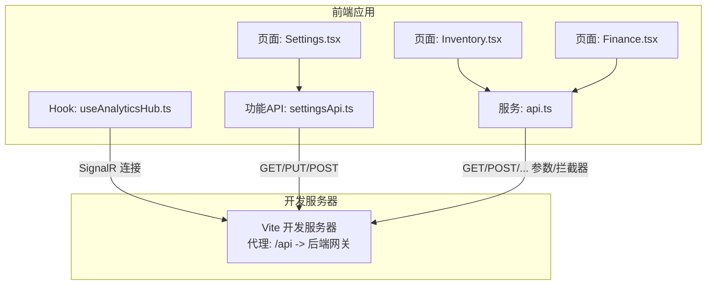
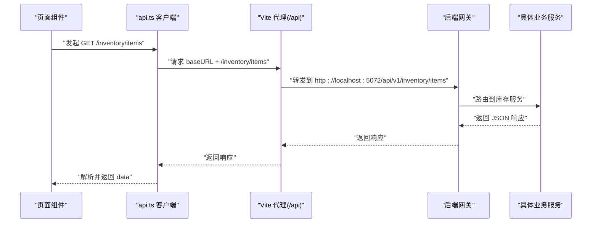
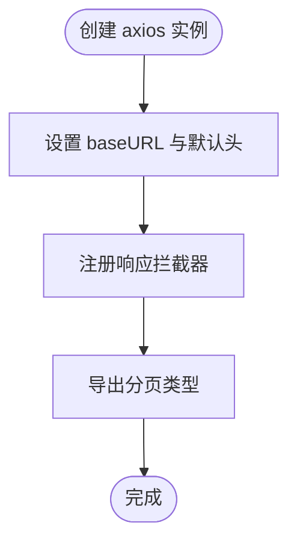
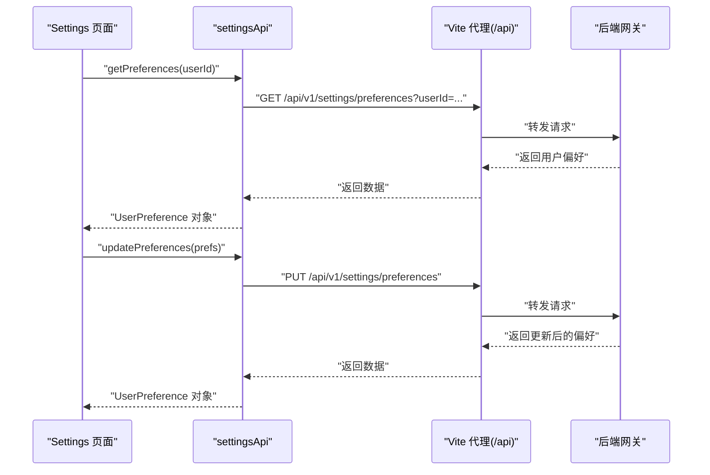
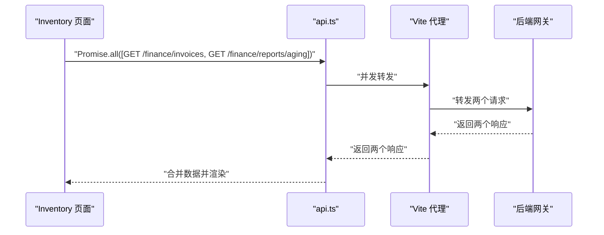
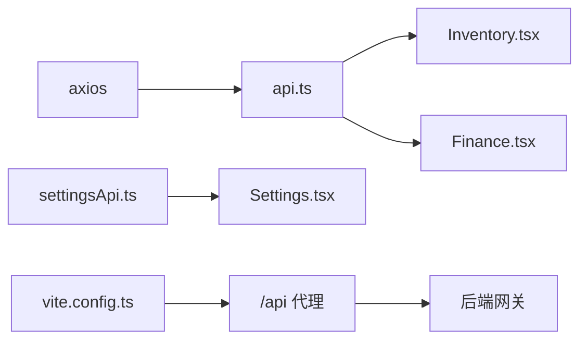

# API集成

<cite>
**本文引用的文件**
- [api.ts](file://src/Web/ErpSystem.Web/src/services/api.ts)
- [settingsApi.ts](file://src/Web/ErpSystem.Web/src/api/settingsApi.ts)
- [Settings.tsx](file://src/Web/ErpSystem.Web/src/pages/Settings.tsx)
- [Inventory.tsx](file://src/Web/ErpSystem.Web/src/pages/Inventory.tsx)
- [Finance.tsx](file://src/Web/ErpSystem.Web/src/pages/Finance.tsx)
- [useAnalyticsHub.ts](file://src/Web/ErpSystem.Web/src/hooks/useAnalyticsHub.ts)
- [vite.config.ts](file://src/Web/ErpSystem.Web/vite.config.ts)
- [package.json](file://src/Web/ErpSystem.Web/package.json)
- [SignatureVerificationMiddleware.cs](file://src/BuildingBlocks/ErpSystem.BuildingBlocks/Auth/SignatureVerificationMiddleware.cs)
- [AuthExtensions.cs](file://src/BuildingBlocks/ErpSystem.BuildingBlocks/Auth/AuthExtensions.cs)
- [ResiliencePolicies.cs](file://src/BuildingBlocks/ErpSystem.BuildingBlocks/Resilience/ResiliencePolicies.cs)
</cite>

## 目录
1. [简介](#简介)
2. [项目结构](#项目结构)
3. [核心组件](#核心组件)
4. [架构总览](#架构总览)
5. [详细组件分析](#详细组件分析)
6. [依赖关系分析](#依赖关系分析)
7. [性能考虑](#性能考虑)
8. [故障排查指南](#故障排查指南)
9. [结论](#结论)
10. [附录](#附录)

## 简介
本文件面向前端工程师与全栈开发者，系统性梳理 ERP 微服务前端的 API 集成方案。重点覆盖以下方面：
- RESTful 调用模式与 HTTP 客户端配置
- 服务封装、拦截器与错误处理机制
- 配置管理、动态 API 端点切换与环境变量处理
- 认证令牌管理、请求重试策略与超时处理
- API 版本管理、缓存策略与离线支持思路
- 数据转换、格式化与验证规则
- 最佳实践与性能优化技巧

## 项目结构
前端采用 Vite + React + TypeScript 技术栈，API 层分为两类：
- 通用 HTTP 客户端：通过 axios 封装基础配置与统一拦截器
- 功能域 API：按业务域拆分的服务模块（如设置域）

图表来源
- [Settings.tsx](file://src/Web/ErpSystem.Web/src/pages/Settings.tsx#L1-L377)
- [Inventory.tsx](file://src/Web/ErpSystem.Web/src/pages/Inventory.tsx#L1-L147)
- [Finance.tsx](file://src/Web/ErpSystem.Web/src/pages/Finance.tsx#L1-L157)
- [useAnalyticsHub.ts](file://src/Web/ErpSystem.Web/src/hooks/useAnalyticsHub.ts#L1-L51)
- [api.ts](file://src/Web/ErpSystem.Web/src/services/api.ts#L1-L29)
- [settingsApi.ts](file://src/Web/ErpSystem.Web/src/api/settingsApi.ts#L1-L42)
- [vite.config.ts](file://src/Web/ErpSystem.Web/vite.config.ts#L1-L23)

章节来源
- [package.json](file://src/Web/ErpSystem.Web/package.json#L1-L35)
- [vite.config.ts](file://src/Web/ErpSystem.Web/vite.config.ts#L1-L23)

## 核心组件
- 通用 HTTP 客户端
  - 基于 axios 创建实例，设置 base URL、默认头信息
  - 统一响应拦截器用于日志与错误透传
  - 导出泛型分页结果类型，便于接口契约约束
- 设置域 API
  - 用户偏好模型定义与 CRUD 方法封装
  - 支持用户维度的偏好读取、更新与重置
- 页面与 Hook 使用
  - 页面组件通过 api 或 settingsApi 发起请求
  - SignalR Hook 管理实时连接与自动重连

章节来源
- [api.ts](file://src/Web/ErpSystem.Web/src/services/api.ts#L1-L29)
- [settingsApi.ts](file://src/Web/ErpSystem.Web/src/api/settingsApi.ts#L1-L42)
- [Settings.tsx](file://src/Web/ErpSystem.Web/src/pages/Settings.tsx#L1-L377)
- [Inventory.tsx](file://src/Web/ErpSystem.Web/src/pages/Inventory.tsx#L1-L147)
- [Finance.tsx](file://src/Web/ErpSystem.Web/src/pages/Finance.tsx#L1-L157)
- [useAnalyticsHub.ts](file://src/Web/ErpSystem.Web/src/hooks/useAnalyticsHub.ts#L1-L51)

## 架构总览
前端通过 Vite 的代理将 /api 前缀转发到后端网关，实现本地开发时的跨域与统一入口。axios 实例负责所有 REST 请求；拦截器统一处理错误；页面组件按需选择通用或功能域 API。

图表来源
- [api.ts](file://src/Web/ErpSystem.Web/src/services/api.ts#L1-L29)
- [vite.config.ts](file://src/Web/ErpSystem.Web/vite.config.ts#L7-L20)
- [Inventory.tsx](file://src/Web/ErpSystem.Web/src/pages/Inventory.tsx#L28-L43)

## 详细组件分析

### 通用 HTTP 客户端：api.ts
- 基础配置
  - baseURL 来源于环境变量，优先级：VITE_API_URL > 本地代理前缀
  - 默认 Content-Type 为 application/json
- 拦截器
  - 响应拦截器统一输出错误信息并透传异常
- 辅助类型
  - 分页结果泛型，便于在多处复用

图表来源
- [api.ts](file://src/Web/ErpSystem.Web/src/services/api.ts#L3-L28)

章节来源
- [api.ts](file://src/Web/ErpSystem.Web/src/services/api.ts#L1-L29)

### 设置域 API：settingsApi.ts
- 数据模型
  - 用户偏好字段覆盖语言、时区、日期格式、货币、主题、通知开关等
- 接口方法
  - 获取偏好：支持指定用户 ID 查询
  - 更新偏好：提交整个偏好对象
  - 重置偏好：按用户 ID 执行重置
- 端点路径
  - 固定以 /api/v1 作为前缀，配合 Vite 代理

图表来源
- [settingsApi.ts](file://src/Web/ErpSystem.Web/src/api/settingsApi.ts#L26-L41)
- [Settings.tsx](file://src/Web/ErpSystem.Web/src/pages/Settings.tsx#L33-L60)
- [vite.config.ts](file://src/Web/ErpSystem.Web/vite.config.ts#L7-L20)

章节来源
- [settingsApi.ts](file://src/Web/ErpSystem.Web/src/api/settingsApi.ts#L1-L42)
- [Settings.tsx](file://src/Web/ErpSystem.Web/src/pages/Settings.tsx#L1-L377)

### 页面使用示例

#### Inventory 页面：参数化查询与并发请求
- 参数化查询：通过 params 传递过滤条件
- 并发请求：Promise.all 同时拉取多个资源，提升首屏性能
- 错误兜底：失败时填充演示数据，保证用户体验

图表来源
- [Finance.tsx](file://src/Web/ErpSystem.Web/src/pages/Finance.tsx#L30-L58)
- [Inventory.tsx](file://src/Web/ErpSystem.Web/src/pages/Inventory.tsx#L28-L43)
- [vite.config.ts](file://src/Web/ErpSystem.Web/vite.config.ts#L7-L20)

章节来源
- [Inventory.tsx](file://src/Web/ErpSystem.Web/src/pages/Inventory.tsx#L1-L147)
- [Finance.tsx](file://src/Web/ErpSystem.Web/src/pages/Finance.tsx#L1-L157)

#### Settings 页面：表单驱动的数据流与保存流程
- 表单状态：集中维护 UserPreference
- 加载与保存：异步加载与保存，期间显示加载态
- 错误提示：捕获异常并弹窗提示

章节来源
- [Settings.tsx](file://src/Web/ErpSystem.Web/src/pages/Settings.tsx#L1-L377)
- [settingsApi.ts](file://src/Web/ErpSystem.Web/src/api/settingsApi.ts#L26-L41)

### 实时通信：useAnalyticsHub.ts
- 基于 SignalR 的 Hub 连接
- 自动重连策略，日志级别可配置
- 接收“最新统计”推送，替换式更新状态

章节来源
- [useAnalyticsHub.ts](file://src/Web/ErpSystem.Web/src/hooks/useAnalyticsHub.ts#L1-L51)

## 依赖关系分析
- axios 作为 HTTP 客户端核心依赖
- Vite 提供开发代理，将 /api 前缀转发至后端网关
- 页面组件依赖通用 API 客户端或功能域 API

图表来源
- [package.json](file://src/Web/ErpSystem.Web/package.json#L11-L22)
- [api.ts](file://src/Web/ErpSystem.Web/src/services/api.ts#L1-L29)
- [settingsApi.ts](file://src/Web/ErpSystem.Web/src/api/settingsApi.ts#L1-L42)
- [vite.config.ts](file://src/Web/ErpSystem.Web/vite.config.ts#L7-L20)

章节来源
- [package.json](file://src/Web/ErpSystem.Web/package.json#L1-L35)
- [vite.config.ts](file://src/Web/ErpSystem.Web/vite.config.ts#L1-L23)

## 性能考虑
- 并发请求：对相互独立的资源使用 Promise.all 并发拉取，减少总等待时间
- 参数化查询：通过 params 传递过滤条件，避免一次性拉取全量数据
- 本地代理：开发阶段通过 /api 前缀统一转发，降低跨域与反向代理复杂度
- 信号通道：实时数据采用 SignalR，降低轮询开销

章节来源
- [Finance.tsx](file://src/Web/ErpSystem.Web/src/pages/Finance.tsx#L30-L58)
- [Inventory.tsx](file://src/Web/ErpSystem.Web/src/pages/Inventory.tsx#L28-L43)
- [vite.config.ts](file://src/Web/ErpSystem.Web/vite.config.ts#L7-L20)
- [useAnalyticsHub.ts](file://src/Web/ErpSystem.Web/src/hooks/useAnalyticsHub.ts#L17-L47)

## 故障排查指南
- 网络错误与拦截器
  - 响应拦截器会打印错误详情并透传异常，便于定位
  - 若 baseURL 未生效，请检查环境变量 VITE_API_URL 是否正确
- 代理问题
  - 确认 vite.config.ts 中 /api 代理指向正确的后端地址
- 401/签名校验
  - 后端提供基于签名的中间件，若出现 401，检查请求头是否包含必需的签名字段
- 重试与超时
  - 当前 axios 客户端未内置重试与超时策略，建议结合后端韧性策略或引入统一重试/超时管线

章节来源
- [api.ts](file://src/Web/ErpSystem.Web/src/services/api.ts#L13-L20)
- [vite.config.ts](file://src/Web/ErpSystem.Web/vite.config.ts#L7-L20)
- [SignatureVerificationMiddleware.cs](file://src/BuildingBlocks/ErpSystem.BuildingBlocks/Auth/SignatureVerificationMiddleware.cs#L14-L36)
- [AuthExtensions.cs](file://src/BuildingBlocks/ErpSystem.BuildingBlocks/Auth/AuthExtensions.cs#L6-L17)

## 结论
本前端 API 集成方案以 axios 为核心，通过统一客户端与功能域 API 解耦页面逻辑，配合 Vite 代理实现本地开发的高效联调。当前实现聚焦于基础的 REST 调用、错误拦截与实时通信。后续可在以下方面演进：
- 引入统一的重试、超时与断路器策略
- 建立 API 版本管理与缓存策略
- 增强认证令牌注入与刷新机制
- 探索离线支持与本地存储策略

## 附录

### 环境变量与代理配置
- 环境变量
  - VITE_API_URL：可覆盖默认 baseURL
- 代理规则
  - /api → 后端网关
  - /hubs → 支持 WebSocket 的 Hub 服务

章节来源
- [api.ts](file://src/Web/ErpSystem.Web/src/services/api.ts#L3-L4)
- [vite.config.ts](file://src/Web/ErpSystem.Web/vite.config.ts#L7-L20)

### 认证与安全扩展
- 后端签名中间件
  - 要求请求头包含应用标识、时间戳、随机数与签名
- 前端建议
  - 在拦截器中注入必要头部，或在后端提供令牌交换流程

章节来源
- [SignatureVerificationMiddleware.cs](file://src/BuildingBlocks/ErpSystem.BuildingBlocks/Auth/SignatureVerificationMiddleware.cs#L14-L36)
- [AuthExtensions.cs](file://src/BuildingBlocks/ErpSystem.BuildingBlocks/Auth/AuthExtensions.cs#L6-L17)

### 韧性与可靠性
- 后端韧性策略
  - 提供超时、重试与断路器组合管道
- 前端建议
  - 可在 axios 拦截器或自定义 Hook 中集成重试与超时

章节来源
- [ResiliencePolicies.cs](file://src/BuildingBlocks/ErpSystem.BuildingBlocks/Resilience/ResiliencePolicies.cs#L53-L90)