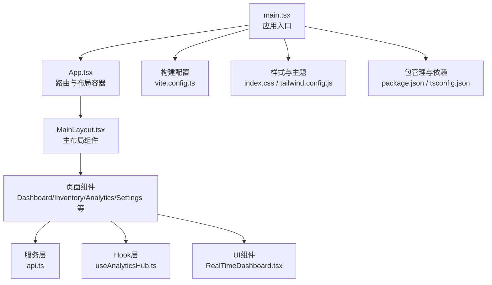
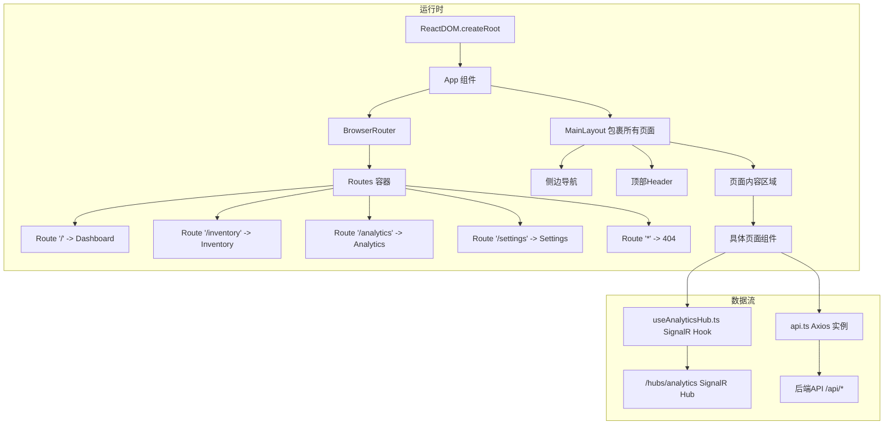
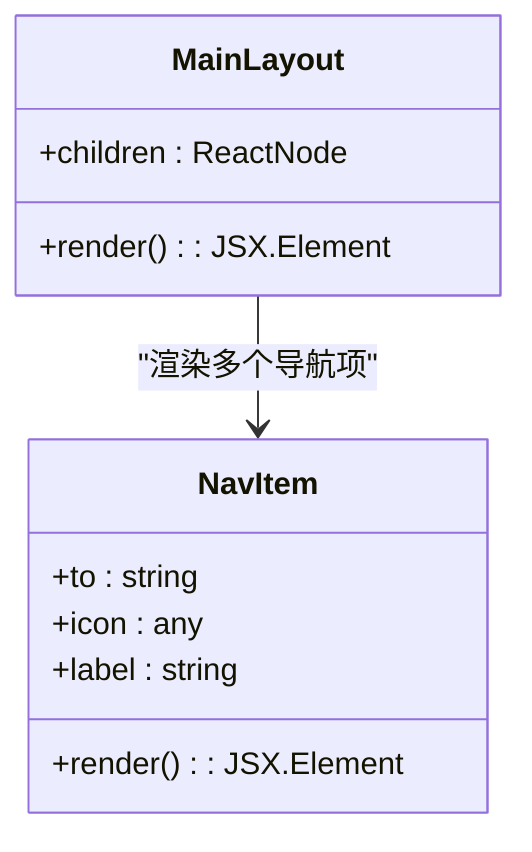
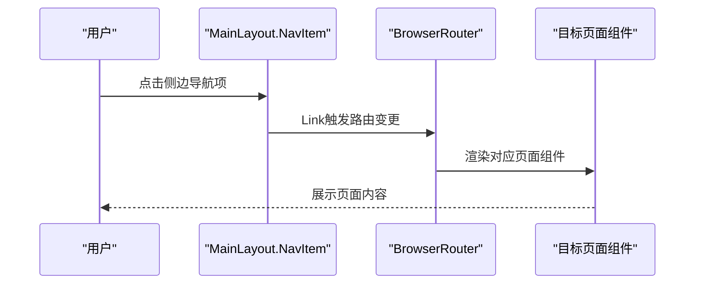
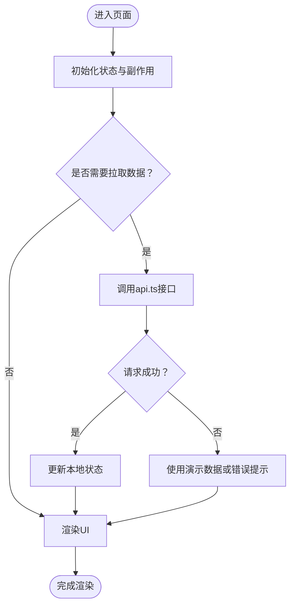
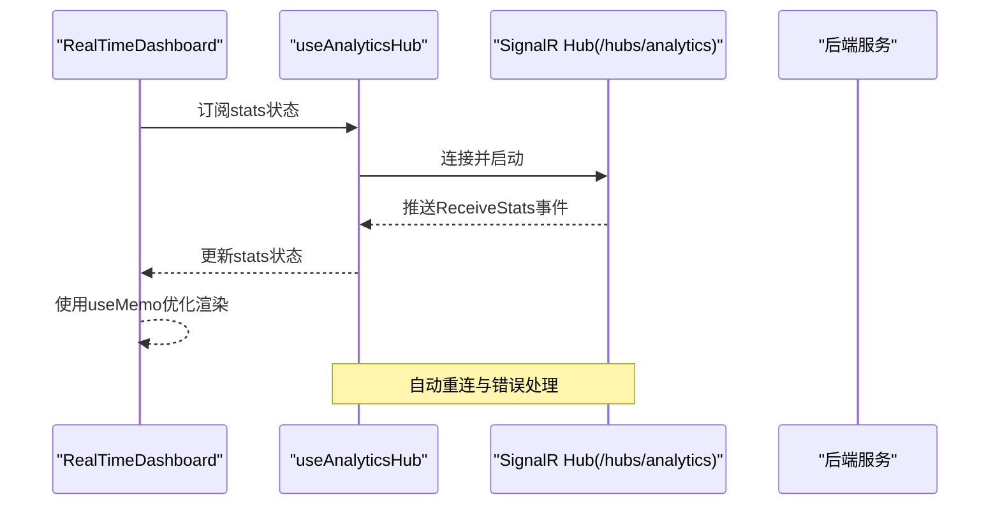
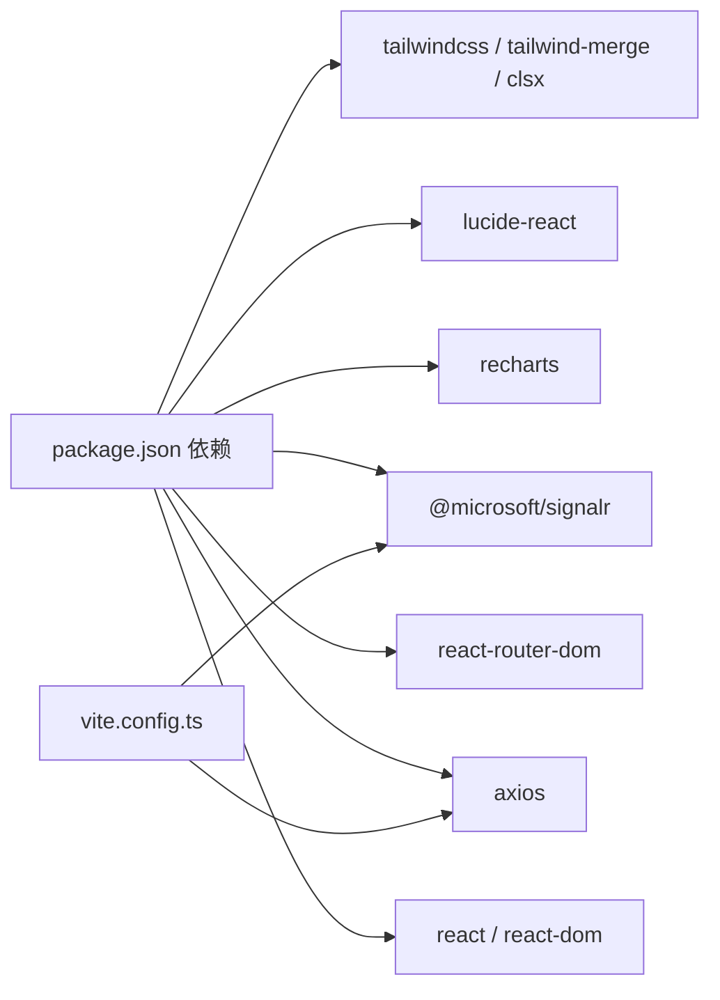

# React架构设计

<cite>
**本文档引用的文件**
- [main.tsx](file://src/Web/ErpSystem.Web/src/main.tsx)
- [App.tsx](file://src/Web/ErpSystem.Web/src/App.tsx)
- [MainLayout.tsx](file://src/Web/ErpSystem.Web/src/layout/MainLayout.tsx)
- [Dashboard.tsx](file://src/Web/ErpSystem.Web/src/pages/Dashboard.tsx)
- [Analytics.tsx](file://src/Web/ErpSystem.Web/src/pages/Analytics.tsx)
- [RealTimeDashboard.tsx](file://src/Web/ErpSystem.Web/src/components/RealTimeDashboard.tsx)
- [Inventory.tsx](file://src/Web/ErpSystem.Web/src/pages/Inventory.tsx)
- [Settings.tsx](file://src/Web/ErpSystem.Web/src/pages/Settings.tsx)
- [api.ts](file://src/Web/ErpSystem.Web/src/services/api.ts)
- [useAnalyticsHub.ts](file://src/Web/ErpSystem.Web/src/hooks/useAnalyticsHub.ts)
- [index.css](file://src/Web/ErpSystem.Web/src/index.css)
- [tailwind.config.js](file://src/Web/ErpSystem.Web/tailwind.config.js)
- [vite.config.ts](file://src/Web/ErpSystem.Web/vite.config.ts)
- [package.json](file://src/Web/ErpSystem.Web/package.json)
- [tsconfig.json](file://src/Web/ErpSystem.Web/tsconfig.json)
</cite>

## 目录
1. [引言](#引言)
2. [项目结构](#项目结构)
3. [核心组件](#核心组件)
4. [架构总览](#架构总览)
5. [详细组件分析](#详细组件分析)
6. [依赖关系分析](#依赖关系分析)
7. [性能考虑](#性能考虑)
8. [故障排除指南](#故障排除指南)
9. [结论](#结论)
10. [附录](#附录)

## 引言
本技术文档面向React前端架构，围绕企业级ERP系统的前端实现进行深入解析。重点涵盖组件层次结构、路由配置与布局系统设计；详细阐述MainLayout组件的实现原理、导航模式与样式体系；记录组件生命周期管理、状态提升策略与props传递模式；总结错误边界处理、代码分割与懒加载实践；提供组件复用策略、性能优化技巧与内存泄漏防护措施；解释TypeScript类型定义、接口设计与泛型使用模式。

## 项目结构
前端采用Vite + React 18 + TypeScript + TailwindCSS技术栈，目录组织遵循按功能域分层：入口、应用根组件、布局、页面、服务与工具。路由基于react-router-dom v7，构建代理支持API与SignalR实时通信。

**图表来源**
- [main.tsx](file://src/Web/ErpSystem.Web/src/main.tsx#L1-L11)
- [App.tsx](file://src/Web/ErpSystem.Web/src/App.tsx#L1-L50)
- [MainLayout.tsx](file://src/Web/ErpSystem.Web/src/layout/MainLayout.tsx#L1-L83)
- [api.ts](file://src/Web/ErpSystem.Web/src/services/api.ts#L1-L29)
- [useAnalyticsHub.ts](file://src/Web/ErpSystem.Web/src/hooks/useAnalyticsHub.ts#L1-L51)
- [RealTimeDashboard.tsx](file://src/Web/ErpSystem.Web/src/components/RealTimeDashboard.tsx#L1-L120)
- [vite.config.ts](file://src/Web/ErpSystem.Web/vite.config.ts#L1-L23)
- [index.css](file://src/Web/ErpSystem.Web/src/index.css#L1-L145)
- [tailwind.config.js](file://src/Web/ErpSystem.Web/tailwind.config.js#L1-L53)
- [package.json](file://src/Web/ErpSystem.Web/package.json#L1-L35)
- [tsconfig.json](file://src/Web/ErpSystem.Web/tsconfig.json#L1-L35)

**章节来源**
- [main.tsx](file://src/Web/ErpSystem.Web/src/main.tsx#L1-L11)
- [App.tsx](file://src/Web/ErpSystem.Web/src/App.tsx#L1-L50)
- [vite.config.ts](file://src/Web/ErpSystem.Web/vite.config.ts#L1-L23)
- [package.json](file://src/Web/ErpSystem.Web/package.json#L1-L35)
- [tsconfig.json](file://src/Web/ErpSystem.Web/tsconfig.json#L1-L35)

## 核心组件
- 应用入口与渲染：通过ReactDOM.createRoot在index.html挂载<App/>，启用React.StrictMode严格模式。
- 路由与布局：BrowserRouter包裹整个应用，App中定义多条静态路由，并以MainLayout作为页面内容的容器。
- 主布局MainLayout：固定侧边栏导航、顶部Header与主内容区域，使用useLocation计算导航高亮，支持移动端菜单按钮。
- 页面组件：Dashboard展示统计卡片与快捷链接；Inventory提供库存查询与筛选；Analytics包含实时仪表盘与智能分析；Settings提供用户偏好设置。
- 服务与Hook：api.ts封装Axios实例与响应拦截器；useAnalyticsHub.ts封装SignalR连接、自动重连与数据订阅；RealTimeDashboard消费Hook数据并可视化。

**章节来源**
- [main.tsx](file://src/Web/ErpSystem.Web/src/main.tsx#L1-L11)
- [App.tsx](file://src/Web/ErpSystem.Web/src/App.tsx#L1-L50)
- [MainLayout.tsx](file://src/Web/ErpSystem.Web/src/layout/MainLayout.tsx#L1-L83)
- [Dashboard.tsx](file://src/Web/ErpSystem.Web/src/pages/Dashboard.tsx#L1-L113)
- [Inventory.tsx](file://src/Web/ErpSystem.Web/src/pages/Inventory.tsx#L1-L147)
- [Analytics.tsx](file://src/Web/ErpSystem.Web/src/pages/Analytics.tsx#L1-L197)
- [RealTimeDashboard.tsx](file://src/Web/ErpSystem.Web/src/components/RealTimeDashboard.tsx#L1-L120)
- [api.ts](file://src/Web/ErpSystem.Web/src/services/api.ts#L1-L29)
- [useAnalyticsHub.ts](file://src/Web/ErpSystem.Web/src/hooks/useAnalyticsHub.ts#L1-L51)

## 架构总览
系统采用“路由驱动的页面容器”模式：App负责路由声明与MainLayout包裹；MainLayout提供统一的导航与头部；各页面组件专注业务逻辑与UI；服务层与Hook层解耦数据访问与实时通信。

**图表来源**
- [App.tsx](file://src/Web/ErpSystem.Web/src/App.tsx#L21-L47)
- [MainLayout.tsx](file://src/Web/ErpSystem.Web/src/layout/MainLayout.tsx#L24-L82)
- [api.ts](file://src/Web/ErpSystem.Web/src/services/api.ts#L6-L20)
- [useAnalyticsHub.ts](file://src/Web/ErpSystem.Web/src/hooks/useAnalyticsHub.ts#L12-L49)
- [vite.config.ts](file://src/Web/ErpSystem.Web/vite.config.ts#L7-L21)

## 详细组件分析

### MainLayout 组件分析
- 结构组成：固定侧边栏（250px宽）+ 顶部Header（64px高）+ 主内容区，使用CSS变量控制尺寸，支持暗色主题切换。
- 导航高亮：NavItem内部使用useLocation判断当前路径前缀匹配，动态设置激活态样式与指示点。
- 响应式与交互：Header包含移动端菜单按钮、用户头像徽标；侧边导航支持悬停与激活态颜色变化。
- 子组件复用：NavItem作为通用导航项，统一图标、标签与激活态逻辑，便于扩展新模块。

**图表来源**
- [MainLayout.tsx](file://src/Web/ErpSystem.Web/src/layout/MainLayout.tsx#L5-L22)
- [MainLayout.tsx](file://src/Web/ErpSystem.Web/src/layout/MainLayout.tsx#L24-L82)

**章节来源**
- [MainLayout.tsx](file://src/Web/ErpSystem.Web/src/layout/MainLayout.tsx#L1-L83)

### 路由与导航模式
- 路由声明：App中集中定义静态路由，覆盖Dashboard、Inventory、Finance、MasterData、Procurement、Sales、Projects、Payroll、Assets、Production、Mrp、Quality、Automation、Analytics、Settings等。
- 导航守卫：当前未实现全局路由守卫；可通过在需要鉴权的页面组件内添加条件渲染或自定义Hook实现权限校验。
- 页面导航：侧边栏与页面内Link均使用react-router-dom的Link组件，保持统一的SPA导航体验。

**图表来源**
- [MainLayout.tsx](file://src/Web/ErpSystem.Web/src/layout/MainLayout.tsx#L10-L21)
- [App.tsx](file://src/Web/ErpSystem.Web/src/App.tsx#L25-L43)

**章节来源**
- [App.tsx](file://src/Web/ErpSystem.Web/src/App.tsx#L1-L50)
- [MainLayout.tsx](file://src/Web/ErpSystem.Web/src/layout/MainLayout.tsx#L1-L83)

### 页面组件与状态管理
- Dashboard：展示统计卡片与快捷链接，使用Link跳转到相关模块。
- Inventory：使用useState与useEffect管理列表、筛选与加载状态；通过api.ts调用后端接口；当请求失败时回退到演示数据。
- Analytics：包含Tab切换与实时/历史两种视图；实时视图由RealTimeDashboard承载。
- Settings：Tab式设置面板，使用useState维护表单状态，异步加载与保存用户偏好。

**图表来源**
- [Inventory.tsx](file://src/Web/ErpSystem.Web/src/pages/Inventory.tsx#L19-L43)
- [api.ts](file://src/Web/ErpSystem.Web/src/services/api.ts#L28-L29)

**章节来源**
- [Dashboard.tsx](file://src/Web/ErpSystem.Web/src/pages/Dashboard.tsx#L1-L113)
- [Inventory.tsx](file://src/Web/ErpSystem.Web/src/pages/Inventory.tsx#L1-L147)
- [Analytics.tsx](file://src/Web/ErpSystem.Web/src/pages/Analytics.tsx#L1-L197)
- [Settings.tsx](file://src/Web/ErpSystem.Web/src/pages/Settings.tsx#L1-L377)
- [api.ts](file://src/Web/ErpSystem.Web/src/services/api.ts#L1-L29)

### 实时数据与信号流
- SignalR集成：useAnalyticsHub封装HubConnectionBuilder，自动重连与日志配置；接收ReceiveStats事件并更新状态。
- 数据消费：RealTimeDashboard订阅stats状态，使用Recharts进行可视化展示；表格展示最新统计数据。
- 后端代理：vite.config.ts配置/hubs代理到后端，确保开发环境WebSocket通信正常。

**图表来源**
- [useAnalyticsHub.ts](file://src/Web/ErpSystem.Web/src/hooks/useAnalyticsHub.ts#L12-L49)
- [RealTimeDashboard.tsx](file://src/Web/ErpSystem.Web/src/components/RealTimeDashboard.tsx#L6-L20)
- [vite.config.ts](file://src/Web/ErpSystem.Web/vite.config.ts#L14-L19)

**章节来源**
- [useAnalyticsHub.ts](file://src/Web/ErpSystem.Web/src/hooks/useAnalyticsHub.ts#L1-L51)
- [RealTimeDashboard.tsx](file://src/Web/ErpSystem.Web/src/components/RealTimeDashboard.tsx#L1-L120)
- [vite.config.ts](file://src/Web/ErpSystem.Web/vite.config.ts#L1-L23)

### 错误边界与容错处理
- Axios拦截器：api.ts在响应拦截器中统一打印错误信息并透传Promise.reject，便于页面组件捕获与展示。
- 页面级容错：Inventory在请求失败时回退演示数据，避免空白或崩溃。
- Hook清理：useAnalyticsHub在effect返回中停止连接，防止内存泄漏与重复连接。

**章节来源**
- [api.ts](file://src/Web/ErpSystem.Web/src/services/api.ts#L13-L20)
- [Inventory.tsx](file://src/Web/ErpSystem.Web/src/pages/Inventory.tsx#L33-L42)
- [useAnalyticsHub.ts](file://src/Web/ErpSystem.Web/src/hooks/useAnalyticsHub.ts#L44-L47)

### 组件复用与可维护性
- 通用导航项：NavItem抽象出图标、标签与激活态逻辑，便于新增模块时快速复用。
- 统一样式体系：index.css与tailwind.config.js结合，提供变量化主题与通用类名，降低样式耦合。
- 类型安全：api.ts导出PaginatedResult接口，Inventory.tsx定义InventoryItem接口，确保数据契约清晰。

**章节来源**
- [MainLayout.tsx](file://src/Web/ErpSystem.Web/src/layout/MainLayout.tsx#L5-L22)
- [index.css](file://src/Web/ErpSystem.Web/src/index.css#L1-L145)
- [tailwind.config.js](file://src/Web/ErpSystem.Web/tailwind.config.js#L1-L53)
- [api.ts](file://src/Web/ErpSystem.Web/src/services/api.ts#L22-L29)
- [Inventory.tsx](file://src/Web/ErpSystem.Web/src/pages/Inventory.tsx#L5-L17)

## 依赖关系分析
- 运行时依赖：react、react-dom、react-router-dom、lucide-react、axios、@microsoft/signalr、recharts、framer-motion、clsx、tailwind-merge。
- 开发依赖：@types/react、@types/react-dom、@vitejs/plugin-react、typescript、vite、tailwindcss等。
- 构建与代理：vite.config.ts配置API与SignalR代理，开发服务器转发至后端服务。

**图表来源**
- [package.json](file://src/Web/ErpSystem.Web/package.json#L11-L32)
- [vite.config.ts](file://src/Web/ErpSystem.Web/vite.config.ts#L7-L21)

**章节来源**
- [package.json](file://src/Web/ErpSystem.Web/package.json#L1-L35)
- [vite.config.ts](file://src/Web/ErpSystem.Web/vite.config.ts#L1-L23)

## 性能考虑
- 渲染优化：RealTimeDashboard使用useMemo缓存转换后的图表数据，避免每次渲染都重新计算。
- 图表性能：Recharts按需渲染，建议限制实时数据量（如仅保留最近N条），并在组件卸载时停止数据流。
- 样式体积：Tailwind按需扫描src/**/*.{js,ts,jsx,tsx}，减少未使用样式的打包体积。
- 构建优化：Vite原生ESM与快速热更新，生产构建使用Rollup打包，开启Tree-shaking与压缩。

**章节来源**
- [RealTimeDashboard.tsx](file://src/Web/ErpSystem.Web/src/components/RealTimeDashboard.tsx#L12-L20)
- [tailwind.config.js](file://src/Web/ErpSystem.Web/tailwind.config.js#L3-L6)
- [package.json](file://src/Web/ErpSystem.Web/package.json#L7-L10)

## 故障排除指南
- API请求失败：检查Vite代理配置与后端服务可用性；查看浏览器网络面板确认CORS与代理规则；在api.ts拦截器中定位错误详情。
- SignalR连接异常：确认/hubs代理已启用且ws:true；观察控制台日志；确保后端SignalR Hub正确部署。
- 页面空白或组件不更新：检查Inventory.tsx中的演示数据回退逻辑；确认useEffect依赖数组是否正确。
- 样式异常：核对Tailwind配置的content路径；确认CSS变量与暗色主题类名是否正确应用。

**章节来源**
- [vite.config.ts](file://src/Web/ErpSystem.Web/vite.config.ts#L7-L21)
- [api.ts](file://src/Web/ErpSystem.Web/src/services/api.ts#L13-L20)
- [useAnalyticsHub.ts](file://src/Web/ErpSystem.Web/src/hooks/useAnalyticsHub.ts#L17-L42)
- [Inventory.tsx](file://src/Web/ErpSystem.Web/src/pages/Inventory.tsx#L28-L43)
- [index.css](file://src/Web/ErpSystem.Web/src/index.css#L26-L40)

## 结论
该React前端架构以MainLayout为核心布局容器，配合集中式路由与服务层，实现了清晰的职责分离与良好的可扩展性。通过Axios与SignalR的组合，满足了REST与实时数据场景的需求。建议后续引入全局路由守卫、错误边界组件与代码分割策略，进一步提升安全性与性能表现。

## 附录

### TypeScript类型定义与接口设计
- 分页结果接口：PaginatedResult<T>，包含data、page、pageSize与totalCount。
- 实时统计接口：MaterialStats，包含hour、materialId、medianChange、averageChange、stdDevChange。
- 页面数据模型：InventoryItem，描述库存项字段集合。

**章节来源**
- [api.ts](file://src/Web/ErpSystem.Web/src/services/api.ts#L22-L29)
- [useAnalyticsHub.ts](file://src/Web/ErpSystem.Web/src/hooks/useAnalyticsHub.ts#L4-L10)
- [Inventory.tsx](file://src/Web/ErpSystem.Web/src/pages/Inventory.tsx#L5-L17)