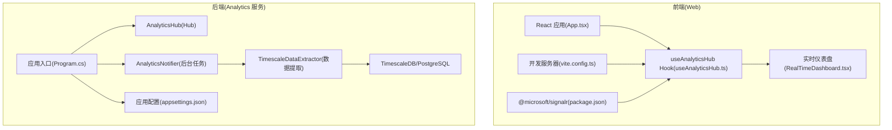
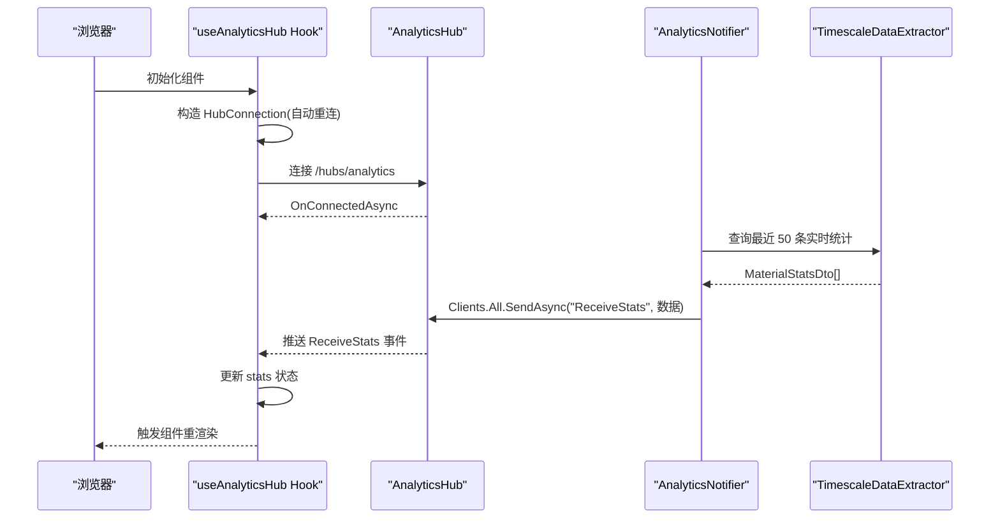
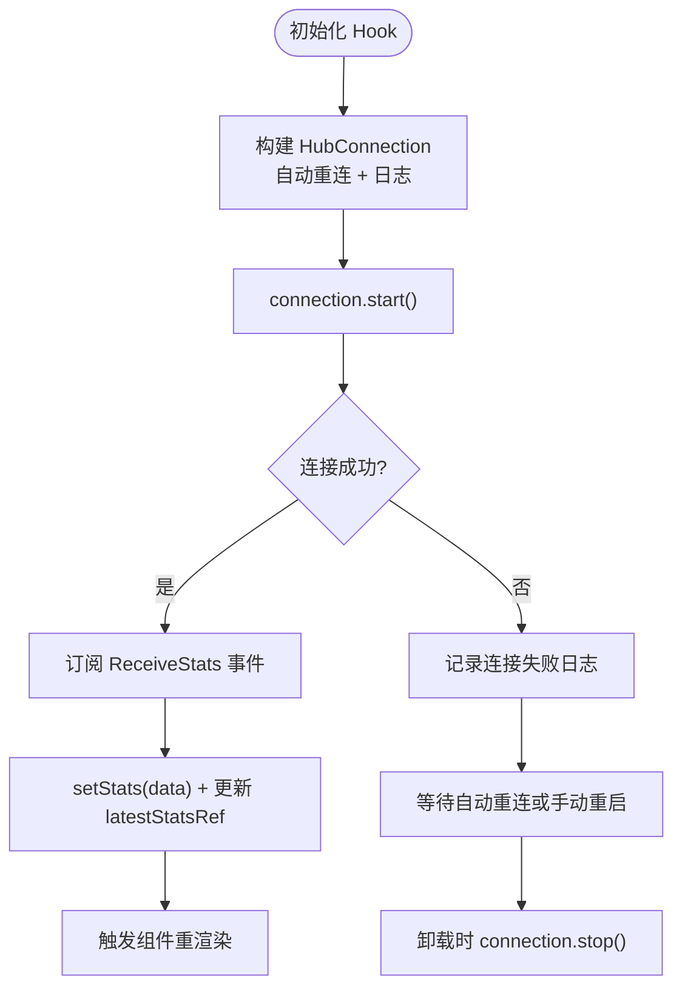
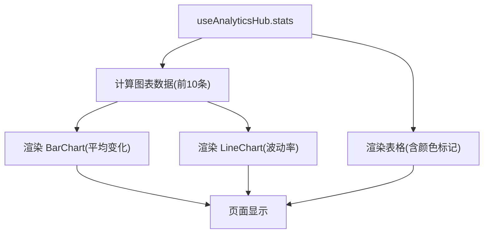
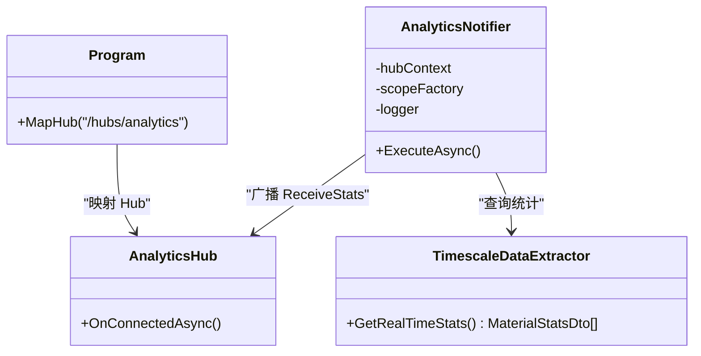
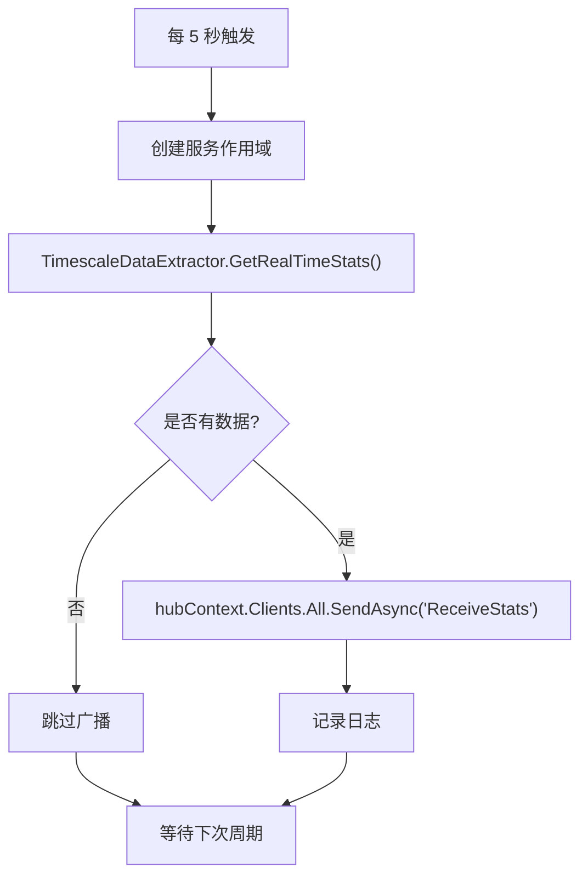
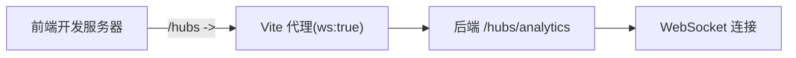
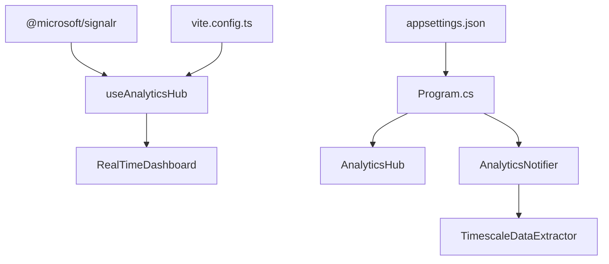

# 实时通信

<cite>
**本文引用的文件**
- [AnalyticsHub.cs](file://src/Services/Analytics/ErpSystem.Analytics/API/Hubs/AnalyticsHub.cs)
- [Program.cs](file://src/Services/Analytics/ErpSystem.Analytics/Program.cs)
- [AnalyticsNotifier.cs](file://src/Services/Analytics/ErpSystem.Analytics/Infrastructure/BackgroundJobs/AnalyticsNotifier.cs)
- [TimescaleDataExtractor.cs](file://src/Services/Analytics/ErpSystem.Analytics/Infrastructure/TimescaleDataExtractor.cs)
- [useAnalyticsHub.ts](file://src/Web/ErpSystem.Web/src/hooks/useAnalyticsHub.ts)
- [RealTimeDashboard.tsx](file://src/Web/ErpSystem.Web/src/components/RealTimeDashboard.tsx)
- [vite.config.ts](file://src/Web/ErpSystem.Web/vite.config.ts)
- [package.json](file://src/Web/ErpSystem.Web/package.json)
- [appsettings.json](file://src/Services/Analytics/ErpSystem.Analytics/appsettings.json)
- [App.tsx](file://src/Web/ErpSystem.Web/src/App.tsx)
- [Analytics.tsx](file://src/Web/ErpSystem.Web/src/pages/Analytics.tsx)
</cite>

## 目录
1. [简介](#简介)
2. [项目结构](#项目结构)
3. [核心组件](#核心组件)
4. [架构总览](#架构总览)
5. [详细组件分析](#详细组件分析)
6. [依赖关系分析](#依赖关系分析)
7. [性能考量](#性能考量)
8. [故障排查指南](#故障排查指南)
9. [结论](#结论)
10. [附录](#附录)

## 简介
本文件面向前端实时通信功能，系统性阐述基于 SignalR 的连接建立、Hub 协议与 WebSocket 通信机制；深入解析 useAnalyticsHub 自定义 Hook 的设计原理、连接状态管理与自动重连策略；记录 RealTimeDashboard 组件的实时数据更新、事件监听与状态同步实现；涵盖连接池管理、消息序列化与并发处理；提供错误恢复、心跳检测与网络异常处理方案；解释实时数据缓存、本地存储与断线重连机制；并给出性能监控、延迟优化与资源清理策略。

## 项目结构
前端通过 Vite 开发，使用 React + TypeScript 构建；SignalR 客户端位于前端工程中，后端在 Analytics 服务中提供 SignalR Hub，并由后台任务周期性抓取 TimescaleDB 的实时统计结果推送至所有客户端。

**图表来源**
- [App.tsx](file://src/Web/ErpSystem.Web/src/App.tsx#L21-L47)
- [useAnalyticsHub.ts](file://src/Web/ErpSystem.Web/src/hooks/useAnalyticsHub.ts#L12-L49)
- [RealTimeDashboard.tsx](file://src/Web/ErpSystem.Web/src/components/RealTimeDashboard.tsx#L6-L20)
- [vite.config.ts](file://src/Web/ErpSystem.Web/vite.config.ts#L7-L21)
- [package.json](file://src/Web/ErpSystem.Web/package.json#L11-L21)
- [Program.cs](file://src/Services/Analytics/ErpSystem.Analytics/Program.cs#L45-L65)
- [AnalyticsHub.cs](file://src/Services/Analytics/ErpSystem.Analytics/API/Hubs/AnalyticsHub.cs#L5-L12)
- [AnalyticsNotifier.cs](file://src/Services/Analytics/ErpSystem.Analytics/Infrastructure/BackgroundJobs/AnalyticsNotifier.cs#L6-L37)
- [TimescaleDataExtractor.cs](file://src/Services/Analytics/ErpSystem.Analytics/Infrastructure/TimescaleDataExtractor.cs#L88-L131)
- [appsettings.json](file://src/Services/Analytics/ErpSystem.Analytics/appsettings.json#L8-L10)

**章节来源**
- [App.tsx](file://src/Web/ErpSystem.Web/src/App.tsx#L21-L47)
- [vite.config.ts](file://src/Web/ErpSystem.Web/vite.config.ts#L7-L21)
- [package.json](file://src/Web/ErpSystem.Web/package.json#L11-L21)
- [Program.cs](file://src/Services/Analytics/ErpSystem.Analytics/Program.cs#L45-L65)
- [AnalyticsHub.cs](file://src/Services/Analytics/ErpSystem.Analytics/API/Hubs/AnalyticsHub.cs#L5-L12)
- [AnalyticsNotifier.cs](file://src/Services/Analytics/ErpSystem.Analytics/Infrastructure/BackgroundJobs/AnalyticsNotifier.cs#L6-L37)
- [TimescaleDataExtractor.cs](file://src/Services/Analytics/ErpSystem.Analytics/Infrastructure/TimescaleDataExtractor.cs#L88-L131)
- [appsettings.json](file://src/Services/Analytics/ErpSystem.Analytics/appsettings.json#L8-L10)

## 核心组件
- 前端 SignalR 客户端：通过 useAnalyticsHub Hook 封装连接生命周期、事件订阅与状态管理。
- 后端 AnalyticsHub：继承自 SignalR Hub，负责连接接入与广播通道。
- AnalyticsNotifier：后台任务，定时从 TimescaleDB 提取实时统计并广播给所有客户端。
- TimescaleDataExtractor：封装 PostgreSQL 连接与查询逻辑，返回 MaterialStatsDto 列表。
- RealTimeDashboard：消费 stats 状态并渲染可视化图表与表格。

**章节来源**
- [useAnalyticsHub.ts](file://src/Web/ErpSystem.Web/src/hooks/useAnalyticsHub.ts#L12-L49)
- [AnalyticsHub.cs](file://src/Services/Analytics/ErpSystem.Analytics/API/Hubs/AnalyticsHub.cs#L5-L12)
- [AnalyticsNotifier.cs](file://src/Services/Analytics/ErpSystem.Analytics/Infrastructure/BackgroundJobs/AnalyticsNotifier.cs#L6-L37)
- [TimescaleDataExtractor.cs](file://src/Services/Analytics/ErpSystem.Analytics/Infrastructure/TimescaleDataExtractor.cs#L88-L131)
- [RealTimeDashboard.tsx](file://src/Web/ErpSystem.Web/src/components/RealTimeDashboard.tsx#L6-L20)

## 架构总览
前端通过 /hubs/analytics 路径与后端建立 WebSocket 连接；后端在 Program.cs 中注册 SignalR 并映射 Hub；AnalyticsNotifier 每 5 秒从 TimescaleDB 抓取 MaterialStatsDto 并调用 hubContext.Clients.All.SendAsync 广播 ReceiveStats 事件；前端 useAnalyticsHub 订阅该事件并更新本地状态，RealTimeDashboard 基于状态渲染图表。

**图表来源**
- [useAnalyticsHub.ts](file://src/Web/ErpSystem.Web/src/hooks/useAnalyticsHub.ts#L18-L41)
- [AnalyticsHub.cs](file://src/Services/Analytics/ErpSystem.Analytics/API/Hubs/AnalyticsHub.cs#L7-L11)
- [Program.cs](file://src/Services/Analytics/ErpSystem.Analytics/Program.cs#L56-L56)
- [AnalyticsNotifier.cs](file://src/Services/Analytics/ErpSystem.Analytics/Infrastructure/BackgroundJobs/AnalyticsNotifier.cs#L23-L28)
- [TimescaleDataExtractor.cs](file://src/Services/Analytics/ErpSystem.Analytics/Infrastructure/TimescaleDataExtractor.cs#L88-L131)

## 详细组件分析

### useAnalyticsHub 自定义 Hook 设计
- 连接建立：使用 HubConnectionBuilder.withUrl('/hubs/analytics').withAutomaticReconnect().configureLogging(...) 构建连接。
- 生命周期：首次挂载时创建连接并启动；卸载时停止连接，避免内存泄漏。
- 事件订阅：连接成功后订阅 ReceiveStats 事件，接收后替换式更新 stats，并同步到 ref 以供外部读取。
- 状态管理：返回 stats 与 connection，供 RealTimeDashboard 使用。

**图表来源**
- [useAnalyticsHub.ts](file://src/Web/ErpSystem.Web/src/hooks/useAnalyticsHub.ts#L18-L47)

**章节来源**
- [useAnalyticsHub.ts](file://src/Web/ErpSystem.Web/src/hooks/useAnalyticsHub.ts#L12-L49)

### RealTimeDashboard 组件实现
- 数据消费：从 useAnalyticsHub 获取 stats。
- 可视化：使用 Recharts 渲染柱状图(平均变化)与折线图(波动率)。
- 表格展示：按小时与物料 ID 展示平均变化、中位数与标准差。
- 状态同步：stats 变化触发 useMemo 与重渲染，确保图表与表格实时更新。

**图表来源**
- [RealTimeDashboard.tsx](file://src/Web/ErpSystem.Web/src/components/RealTimeDashboard.tsx#L12-L20)
- [RealTimeDashboard.tsx](file://src/Web/ErpSystem.Web/src/components/RealTimeDashboard.tsx#L38-L70)
- [RealTimeDashboard.tsx](file://src/Web/ErpSystem.Web/src/components/RealTimeDashboard.tsx#L78-L113)

**章节来源**
- [RealTimeDashboard.tsx](file://src/Web/ErpSystem.Web/src/components/RealTimeDashboard.tsx#L6-L119)

### 后端 Hub 协议与广播
- Hub 类：AnalyticsHub 继承自 Hub，覆盖 OnConnectedAsync 用于连接建立后的可选初始化。
- 映射路径：Program.cs 中通过 app.MapHub<AnalyticsHub>("/hubs/analytics") 将 Hub 暴露为 WebSocket 端点。
- 广播事件：AnalyticsNotifier 每 5 秒查询 GetRealTimeStats，若非空则调用 hubContext.Clients.All.SendAsync("ReceiveStats", ...) 广播给所有连接。

**图表来源**
- [AnalyticsHub.cs](file://src/Services/Analytics/ErpSystem.Analytics/API/Hubs/AnalyticsHub.cs#L5-L12)
- [Program.cs](file://src/Services/Analytics/ErpSystem.Analytics/Program.cs#L56-L56)
- [AnalyticsNotifier.cs](file://src/Services/Analytics/ErpSystem.Analytics/Infrastructure/BackgroundJobs/AnalyticsNotifier.cs#L6-L37)
- [TimescaleDataExtractor.cs](file://src/Services/Analytics/ErpSystem.Analytics/Infrastructure/TimescaleDataExtractor.cs#L88-L131)

**章节来源**
- [AnalyticsHub.cs](file://src/Services/Analytics/ErpSystem.Analytics/API/Hubs/AnalyticsHub.cs#L5-L12)
- [Program.cs](file://src/Services/Analytics/ErpSystem.Analytics/Program.cs#L56-L56)
- [AnalyticsNotifier.cs](file://src/Services/Analytics/ErpSystem.Analytics/Infrastructure/BackgroundJobs/AnalyticsNotifier.cs#L12-L36)
- [TimescaleDataExtractor.cs](file://src/Services/Analytics/ErpSystem.Analytics/Infrastructure/TimescaleDataExtractor.cs#L88-L131)

### 数据提取与消息序列化
- 查询逻辑：TimescaleDataExtractor.GetRealTimeStats 通过 Npgsql 连接 TimescaleDB，执行包含近似分位数与聚合函数的 SQL，限制返回 50 条最新记录。
- 序列化：前端接收数组对象，字段包含 hour、materialId、medianChange、averageChange、stdDevChange。
- 并发处理：后台任务使用 PeriodicTimer 控制周期，每次查询完成后广播，避免阻塞主线程。

**图表来源**
- [AnalyticsNotifier.cs](file://src/Services/Analytics/ErpSystem.Analytics/Infrastructure/BackgroundJobs/AnalyticsNotifier.cs#L12-L36)
- [TimescaleDataExtractor.cs](file://src/Services/Analytics/ErpSystem.Analytics/Infrastructure/TimescaleDataExtractor.cs#L88-L131)

**章节来源**
- [TimescaleDataExtractor.cs](file://src/Services/Analytics/ErpSystem.Analytics/Infrastructure/TimescaleDataExtractor.cs#L88-L131)
- [AnalyticsNotifier.cs](file://src/Services/Analytics/ErpSystem.Analytics/Infrastructure/BackgroundJobs/AnalyticsNotifier.cs#L12-L36)

### 前端代理与 WebSocket 通信
- 开发代理：vite.config.ts 将 /hubs 前缀代理到后端地址，并开启 ws 支持，保证前端能通过 WebSocket 连接后端 Hub。
- 依赖版本：package.json 指定 @microsoft/signalr ^10.0.0，确保兼容当前 Hub 协议。

**图表来源**
- [vite.config.ts](file://src/Web/ErpSystem.Web/vite.config.ts#L14-L19)
- [package.json](file://src/Web/ErpSystem.Web/package.json#L12-L12)

**章节来源**
- [vite.config.ts](file://src/Web/ErpSystem.Web/vite.config.ts#L7-L21)
- [package.json](file://src/Web/ErpSystem.Web/package.json#L11-L21)

## 依赖关系分析
- 前端依赖：@microsoft/signalr 提供 HubConnection 与自动重连能力；React Hooks 管理连接生命周期与状态。
- 后端依赖：SignalR 注册与 Hub 映射；后台任务注入 IHubContext；数据提取依赖 Npgsql 与 TimescaleDB。
- 配置依赖：后端 appsettings.json 提供数据库连接字符串；前端 vite.config.ts 提供代理配置。

**图表来源**
- [package.json](file://src/Web/ErpSystem.Web/package.json#L12-L12)
- [useAnalyticsHub.ts](file://src/Web/ErpSystem.Web/src/hooks/useAnalyticsHub.ts#L1-L2)
- [RealTimeDashboard.tsx](file://src/Web/ErpSystem.Web/src/components/RealTimeDashboard.tsx#L1-L3)
- [vite.config.ts](file://src/Web/ErpSystem.Web/vite.config.ts#L7-L21)
- [Program.cs](file://src/Services/Analytics/ErpSystem.Analytics/Program.cs#L12-L12)
- [AnalyticsHub.cs](file://src/Services/Analytics/ErpSystem.Analytics/API/Hubs/AnalyticsHub.cs#L5-L5)
- [AnalyticsNotifier.cs](file://src/Services/Analytics/ErpSystem.Analytics/Infrastructure/BackgroundJobs/AnalyticsNotifier.cs#L6-L9)
- [TimescaleDataExtractor.cs](file://src/Services/Analytics/ErpSystem.Analytics/Infrastructure/TimescaleDataExtractor.cs#L8-L10)
- [appsettings.json](file://src/Services/Analytics/ErpSystem.Analytics/appsettings.json#L8-L10)

**章节来源**
- [package.json](file://src/Web/ErpSystem.Web/package.json#L11-L21)
- [Program.cs](file://src/Services/Analytics/ErpSystem.Analytics/Program.cs#L12-L12)
- [AnalyticsNotifier.cs](file://src/Services/Analytics/ErpSystem.Analytics/Infrastructure/BackgroundJobs/AnalyticsNotifier.cs#L6-L9)
- [TimescaleDataExtractor.cs](file://src/Services/Analytics/ErpSystem.Analytics/Infrastructure/TimescaleDataExtractor.cs#L8-L10)
- [appsettings.json](file://src/Services/Analytics/ErpSystem.Analytics/appsettings.json#L8-L10)

## 性能考量
- 广播频率：后台任务每 5 秒一次，建议根据业务峰值与带宽进行调优，避免过度广播导致客户端渲染压力。
- 数据量控制：后端限制返回 50 条记录，前端仅展示前 10 条图表数据，降低渲染与传输开销。
- 渲染优化：RealTimeDashboard 使用 useMemo 缓存计算结果，减少不必要的重渲染。
- 连接复用：前端使用单个 HubConnection 复用同一连接，避免多实例造成资源浪费。
- 数据库查询：TimescaleDB 使用近似分位数与聚合函数，减少扫描范围与 IO 压力。

[本节为通用性能指导，不直接分析具体文件]

## 故障排查指南
- 连接失败
  - 检查前端代理是否正确转发 /hubs 请求且启用 ws 支持。
  - 查看后端 Program.cs 是否映射了 /hubs/analytics。
  - 在 useAnalyticsHub 中确认 withAutomaticReconnect 是否生效。
- 广播无数据
  - 确认 AnalyticsNotifier 是否运行且未抛出异常。
  - 检查 TimescaleDataExtractor 查询是否返回空集，必要时增加降级策略。
- 图表空白
  - 确认 ReceiveStats 事件名一致，前端订阅与后端广播一致。
  - 检查 stats 状态是否被正确更新与传递给图表组件。
- 数据库连接
  - 校验 appsettings.json 中连接字符串是否正确。
  - 关注 TimescaleDataExtractor 对 PostgresException 的处理与日志输出。

**章节来源**
- [vite.config.ts](file://src/Web/ErpSystem.Web/vite.config.ts#L14-L19)
- [Program.cs](file://src/Services/Analytics/ErpSystem.Analytics/Program.cs#L56-L56)
- [useAnalyticsHub.ts](file://src/Web/ErpSystem.Web/src/hooks/useAnalyticsHub.ts#L18-L41)
- [AnalyticsNotifier.cs](file://src/Services/Analytics/ErpSystem.Analytics/Infrastructure/BackgroundJobs/AnalyticsNotifier.cs#L12-L36)
- [TimescaleDataExtractor.cs](file://src/Services/Analytics/ErpSystem.Analytics/Infrastructure/TimescaleDataExtractor.cs#L123-L128)
- [appsettings.json](file://src/Services/Analytics/ErpSystem.Analytics/appsettings.json#L8-L10)

## 结论
本方案采用 SignalR + WebSocket 实现实时推送，前端通过 useAnalyticsHub Hook 管理连接与状态，后端通过 AnalyticsNotifier 周期性抓取 TimescaleDB 并广播数据。整体架构清晰、扩展性强，具备自动重连、限流与渲染优化等特性，适合中大型 ERP 系统的实时仪表盘场景。

[本节为总结性内容，不直接分析具体文件]

## 附录

### 数据模型与接口
- MaterialStatsDto 字段
  - hour: 时间戳
  - materialId: 物料标识
  - medianChange: 中位数变化
  - averageChange: 平均变化
  - stdDevChange: 标准差变化

**章节来源**
- [TimescaleDataExtractor.cs](file://src/Services/Analytics/ErpSystem.Analytics/Infrastructure/TimescaleDataExtractor.cs#L134-L141)

### 页面路由与入口
- 应用路由包含 /analytics，进入后可切换到“Real-time”标签页加载 RealTimeDashboard。

**章节来源**
- [App.tsx](file://src/Web/ErpSystem.Web/src/App.tsx#L40-L40)
- [Analytics.tsx](file://src/Web/ErpSystem.Web/src/pages/Analytics.tsx#L31-L34)