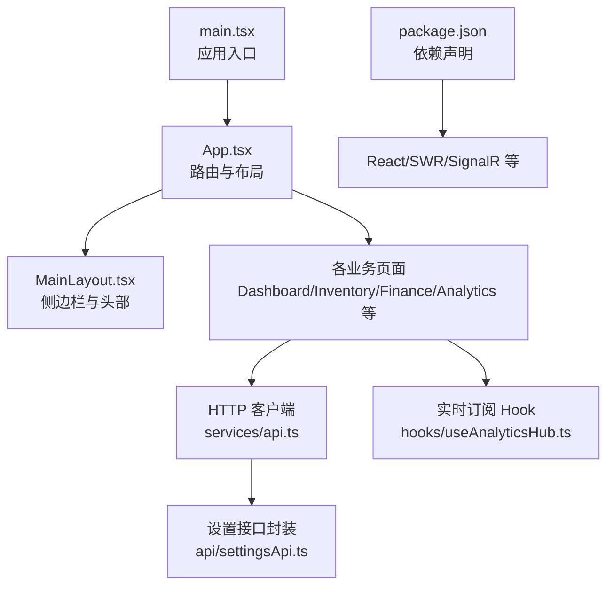
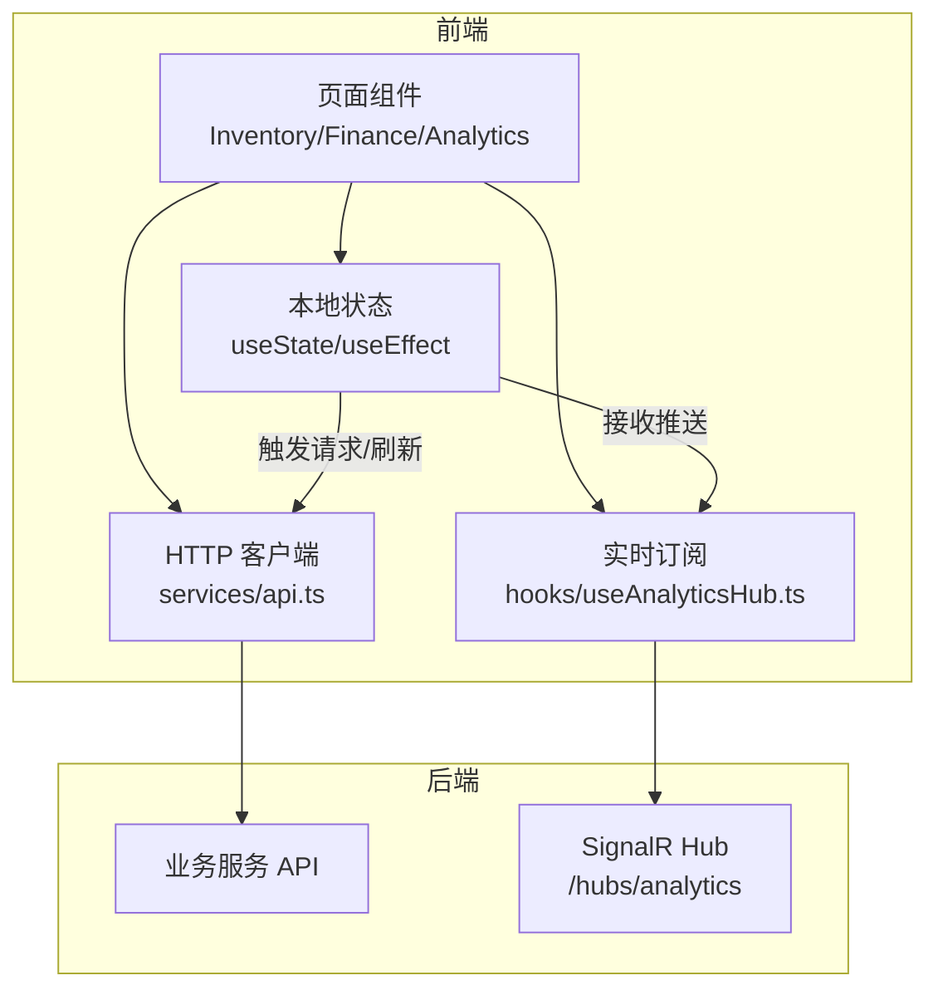
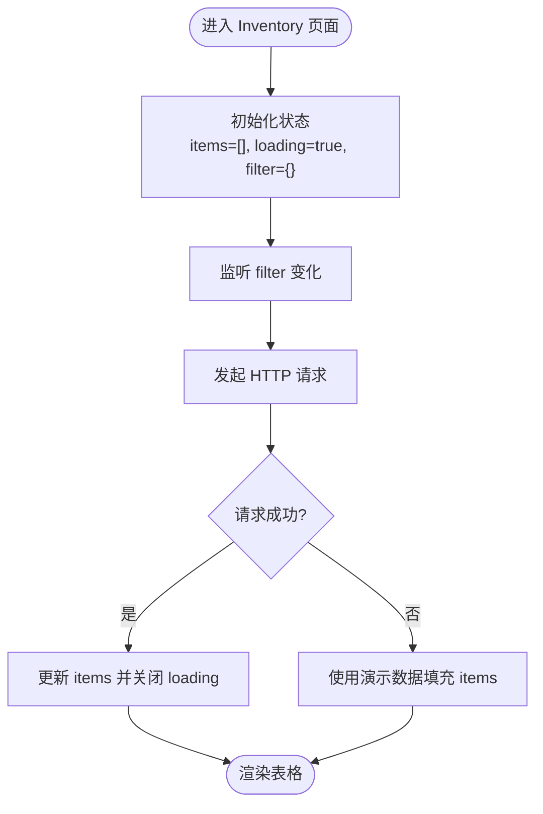
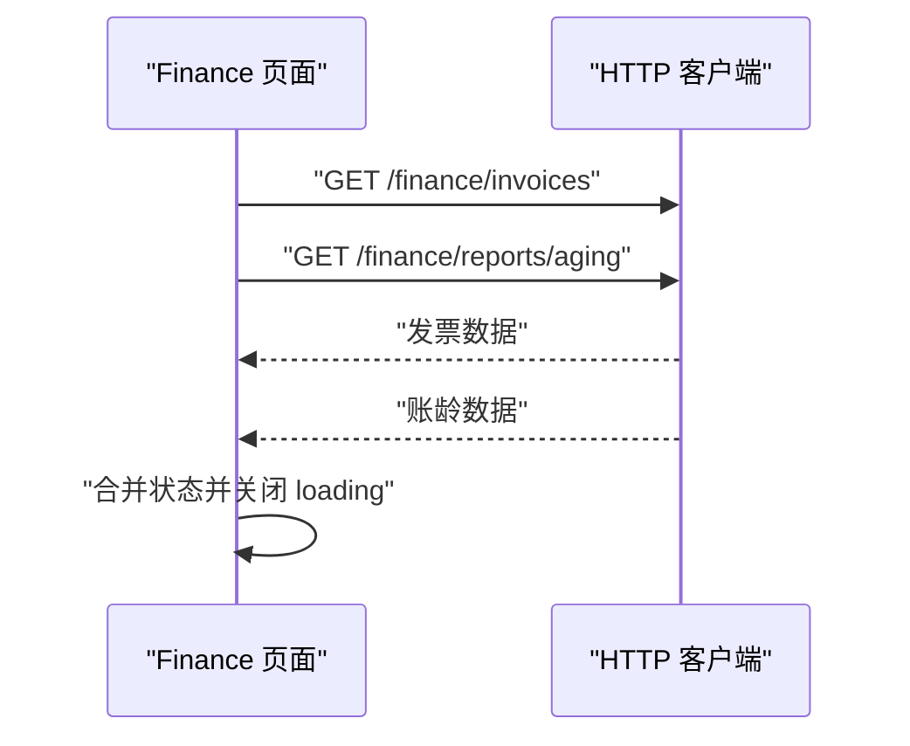
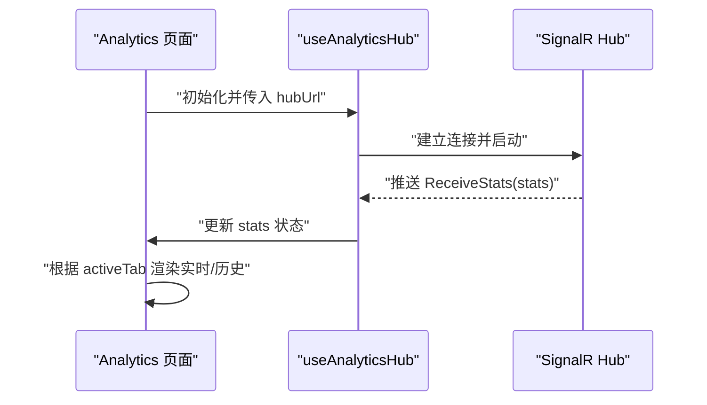
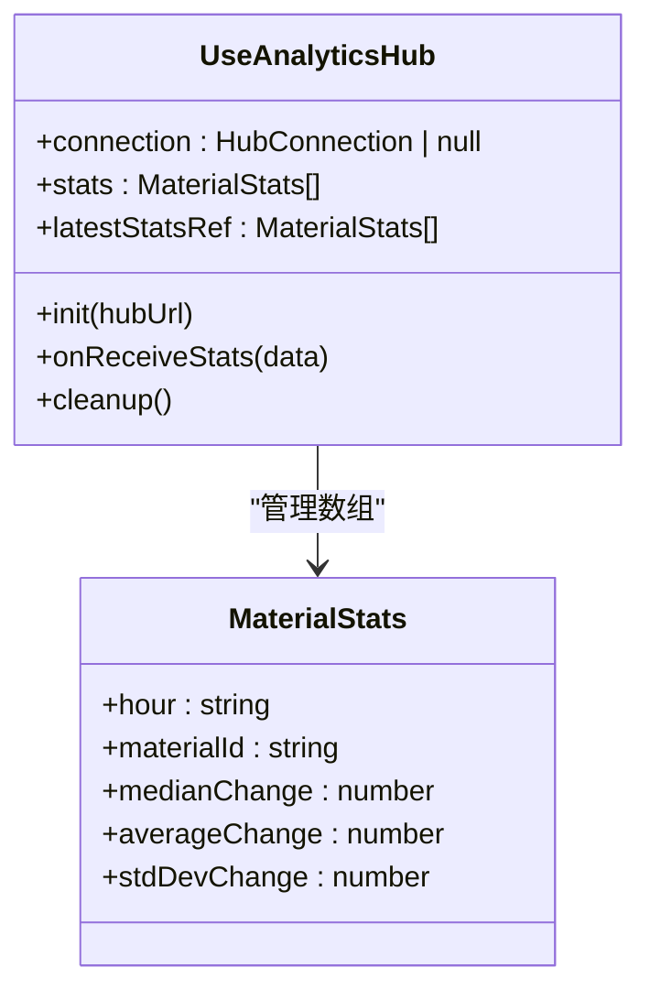
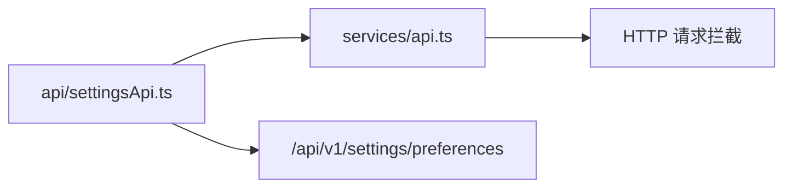
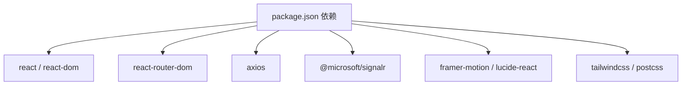

# 状态管理

<cite>
**本文引用的文件**
- [package.json](file://src/Web/ErpSystem.Web/package.json)
- [main.tsx](file://src/Web/ErpSystem.Web/src/main.tsx)
- [App.tsx](file://src/Web/ErpSystem.Web/src/App.tsx)
- [MainLayout.tsx](file://src/Web/ErpSystem.Web/src/layout/MainLayout.tsx)
- [Dashboard.tsx](file://src/Web/ErpSystem.Web/src/pages/Dashboard.tsx)
- [Analytics.tsx](file://src/Web/ErpSystem.Web/src/pages/Analytics.tsx)
- [Inventory.tsx](file://src/Web/ErpSystem.Web/src/pages/Inventory.tsx)
- [Finance.tsx](file://src/Web/ErpSystem.Web/src/pages/Finance.tsx)
- [useAnalyticsHub.ts](file://src/Web/ErpSystem.Web/src/hooks/useAnalyticsHub.ts)
- [settingsApi.ts](file://src/Web/ErpSystem.Web/src/api/settingsApi.ts)
- [api.ts](file://src/Web/ErpSystem.Web/src/services/api.ts)
</cite>

## 目录
1. [引言](#引言)
2. [项目结构](#项目结构)
3. [核心组件](#核心组件)
4. [架构总览](#架构总览)
5. [详细组件分析](#详细组件分析)
6. [依赖关系分析](#依赖关系分析)
7. [性能考量](#性能考量)
8. [故障排查指南](#故障排查指南)
9. [结论](#结论)
10. [附录](#附录)

## 引言
本文件面向前端状态管理，系统性梳理当前仓库中前端（React + TypeScript）的状态设计与实践，覆盖以下主题：
- 全局状态设计、状态提升策略与局部状态管理
- React 钩子使用模式（useState、useEffect、useRef）
- Context API 的应用现状与扩展建议
- 状态持久化实现思路
- Redux Toolkit 或 Zustand 的集成方式、action creators 与 reducer 设计
- 状态规范化、数据缓存与同步策略
- 状态调试工具、时间旅行调试与性能分析方法
- 状态迁移、版本兼容性与数据迁移方案
- 状态安全、权限控制与敏感数据保护

## 项目结构
前端位于 src/Web/ErpSystem.Web，采用 Vite + React 18 + TypeScript 构建，路由基于 react-router-dom。页面组件按功能模块组织，状态主要通过 React 本地状态与 HTTP 客户端交互实现。

图表来源
- [main.tsx](file://src/Web/ErpSystem.Web/src/main.tsx#L1-L11)
- [App.tsx](file://src/Web/ErpSystem.Web/src/App.tsx#L1-L50)
- [MainLayout.tsx](file://src/Web/ErpSystem.Web/src/layout/MainLayout.tsx#L1-L83)
- [Dashboard.tsx](file://src/Web/ErpSystem.Web/src/pages/Dashboard.tsx#L1-L113)
- [Inventory.tsx](file://src/Web/ErpSystem.Web/src/pages/Inventory.tsx#L1-L147)
- [Finance.tsx](file://src/Web/ErpSystem.Web/src/pages/Finance.tsx#L1-L157)
- [useAnalyticsHub.ts](file://src/Web/ErpSystem.Web/src/hooks/useAnalyticsHub.ts#L1-L51)
- [api.ts](file://src/Web/ErpSystem.Web/src/services/api.ts#L1-L29)
- [settingsApi.ts](file://src/Web/ErpSystem.Web/src/api/settingsApi.ts#L1-L42)
- [package.json](file://src/Web/ErpSystem.Web/package.json#L1-L35)

章节来源
- [main.tsx](file://src/Web/ErpSystem.Web/src/main.tsx#L1-L11)
- [App.tsx](file://src/Web/ErpSystem.Web/src/App.tsx#L1-L50)
- [package.json](file://src/Web/ErpSystem.Web/package.json#L1-L35)

## 核心组件
- 应用入口与路由：应用在入口处挂载 StrictMode，并通过 BrowserRouter 提供路由能力；App 统一注册所有页面路由与主布局。
- 主布局：MainLayout 负责侧边导航与头部展示，使用 react-router 的 Link 和 useLocation 实现导航高亮与面包屑基础逻辑。
- 页面级状态：
  - Dashboard：纯展示型页面，无复杂状态。
  - Inventory：本地状态用于列表数据、加载态与过滤条件，使用 axios 客户端获取后端数据。
  - Finance：并行请求发票与账龄报表，使用本地状态承载两类数据。
  - Analytics：本地状态用于切换“实时/历史”视图；实时面板通过 SignalR Hook 接收流式数据。
- 实时订阅：useAnalyticsHub 封装 SignalR 连接、自动重连与消息接收，维护连接实例与最新数据快照。
- HTTP 客户端：api.ts 基于 axios 创建实例，统一设置 base URL 与响应拦截器；settingsApi.ts 对设置类接口进行封装。

章节来源
- [App.tsx](file://src/Web/ErpSystem.Web/src/App.tsx#L1-L50)
- [MainLayout.tsx](file://src/Web/ErpSystem.Web/src/layout/MainLayout.tsx#L1-L83)
- [Dashboard.tsx](file://src/Web/ErpSystem.Web/src/pages/Dashboard.tsx#L1-L113)
- [Inventory.tsx](file://src/Web/ErpSystem.Web/src/pages/Inventory.tsx#L1-L147)
- [Finance.tsx](file://src/Web/ErpSystem.Web/src/pages/Finance.tsx#L1-L157)
- [Analytics.tsx](file://src/Web/ErpSystem.Web/src/pages/Analytics.tsx#L1-L197)
- [useAnalyticsHub.ts](file://src/Web/ErpSystem.Web/src/hooks/useAnalyticsHub.ts#L1-L51)
- [api.ts](file://src/Web/ErpSystem.Web/src/services/api.ts#L1-L29)
- [settingsApi.ts](file://src/Web/ErpSystem.Web/src/api/settingsApi.ts#L1-L42)

## 架构总览
前端状态流由“本地组件状态 + HTTP 客户端 + 实时订阅”构成，页面组件负责状态定义与更新，服务层负责数据获取与错误处理，实时层负责长连接与事件推送。

图表来源
- [Inventory.tsx](file://src/Web/ErpSystem.Web/src/pages/Inventory.tsx#L19-L43)
- [Finance.tsx](file://src/Web/ErpSystem.Web/src/pages/Finance.tsx#L21-L58)
- [Analytics.tsx](file://src/Web/ErpSystem.Web/src/pages/Analytics.tsx#L5-L34)
- [useAnalyticsHub.ts](file://src/Web/ErpSystem.Web/src/hooks/useAnalyticsHub.ts#L12-L49)
- [api.ts](file://src/Web/ErpSystem.Web/src/services/api.ts#L1-L29)

## 详细组件分析

### 组件 A：Inventory 页面（本地状态与数据获取）
- 状态设计
  - 列表数据 items：数组，承载后端返回的库存项集合
  - 加载态 loading：布尔值，控制加载指示器显示
  - 过滤条件 filter：对象，包含仓库与物料编码筛选
- 状态提升策略
  - 过滤条件集中于页面级状态，便于跨组件共享与复用
  - 列表数据与过滤条件联动，形成“输入 → 请求 → 更新”的单向数据流
- 局部状态管理
  - 使用 useState 管理 items、loading、filter
  - 使用 useEffect 在 filter 变更时触发数据拉取
- 数据获取与错误处理
  - 通过 api.ts 发起 GET 请求，Promise 包裹错误并在 catch 分支回退到演示数据
- 性能与可维护性
  - 将过滤条件与查询解耦，利于后续引入缓存与去抖
  - 错误兜底保证开发体验与演示可用性

图表来源
- [Inventory.tsx](file://src/Web/ErpSystem.Web/src/pages/Inventory.tsx#L19-L43)

章节来源
- [Inventory.tsx](file://src/Web/ErpSystem.Web/src/pages/Inventory.tsx#L1-L147)
- [api.ts](file://src/Web/ErpSystem.Web/src/services/api.ts#L1-L29)

### 组件 B：Finance 页面（并行请求与聚合状态）
- 状态设计
  - 发票列表 invoices：数组
  - 账龄报表 aging：对象或空值
  - 加载态 loading：布尔值
- 处理逻辑
  - 首次挂载时并行请求发票与账龄报表，使用 Promise.all 合并响应
  - 成功后分别写入对应状态；失败时回退演示数据
- 状态提升策略
  - 将两个维度的数据统一在页面级状态管理，避免跨组件重复请求
- 局部状态管理
  - 使用 useState 与 useEffect 控制生命周期与副作用
- 性能与可维护性
  - 并行请求减少总等待时间
  - 演示数据回退确保离线或联调阶段可用

图表来源
- [Finance.tsx](file://src/Web/ErpSystem.Web/src/pages/Finance.tsx#L21-L58)
- [api.ts](file://src/Web/ErpSystem.Web/src/services/api.ts#L1-L29)

章节来源
- [Finance.tsx](file://src/Web/ErpSystem.Web/src/pages/Finance.tsx#L1-L157)

### 组件 C：Analytics 页面（视图切换与实时数据）
- 视图切换
  - 使用本地状态 activeTab 控制“实时/历史”视图
  - 不同视图下渲染不同的内容区块
- 实时数据
  - 通过 RealTimeDashboard 组件消费 useAnalyticsHub 返回的 stats
  - Hook 内部建立 SignalR 连接，接收“最新统计”并更新状态
- 状态提升策略
  - 将“实时/历史”视图状态提升至 Analytics 页面，便于子组件共享
- 局部状态管理
  - 使用 useState 管理 activeTab
  - 通过 useRef 保存最新 stats 快照，避免渲染抖动

图表来源
- [Analytics.tsx](file://src/Web/ErpSystem.Web/src/pages/Analytics.tsx#L5-L34)
- [useAnalyticsHub.ts](file://src/Web/ErpSystem.Web/src/hooks/useAnalyticsHub.ts#L12-L49)

章节来源
- [Analytics.tsx](file://src/Web/ErpSystem.Web/src/pages/Analytics.tsx#L1-L197)
- [useAnalyticsHub.ts](file://src/Web/ErpSystem.Web/src/hooks/useAnalyticsHub.ts#L1-L51)

### 组件 D：SignalR Hook（useAnalyticsHub）
- 功能要点
  - 基于 @microsoft/signalr 建立连接，启用自动重连
  - 监听 ReceiveStats 事件，将数据写入状态并保存到 ref
  - 生命周期内自动清理连接
- 状态与副作用
  - 使用 useState 维护 connection 与 stats
  - 使用 useEffect 管理连接生命周期
- 性能与可靠性
  - 自动重连提升稳定性
  - ref 保存最新数据，避免不必要的渲染

图表来源
- [useAnalyticsHub.ts](file://src/Web/ErpSystem.Web/src/hooks/useAnalyticsHub.ts#L1-L51)

章节来源
- [useAnalyticsHub.ts](file://src/Web/ErpSystem.Web/src/hooks/useAnalyticsHub.ts#L1-L51)

### 组件 E：HTTP 客户端与设置接口封装
- HTTP 客户端
  - 基于 axios 创建实例，支持动态 base URL 与统一响应拦截
  - 导出分页结果类型辅助
- 设置接口封装
  - settingsApi.ts 提供用户偏好读取、更新与重置的封装
  - 通过 API 前缀统一管理设置类接口

图表来源
- [api.ts](file://src/Web/ErpSystem.Web/src/services/api.ts#L1-L29)
- [settingsApi.ts](file://src/Web/ErpSystem.Web/src/api/settingsApi.ts#L1-L42)

章节来源
- [api.ts](file://src/Web/ErpSystem.Web/src/services/api.ts#L1-L29)
- [settingsApi.ts](file://src/Web/ErpSystem.Web/src/api/settingsApi.ts#L1-L42)

## 依赖关系分析
- React 生态：React、react-router-dom、@microsoft/signalr、axios
- UI 与动画：framer-motion、lucide-react
- 构建与样式：vite、tailwindcss、postcss

图表来源
- [package.json](file://src/Web/ErpSystem.Web/package.json#L11-L22)

章节来源
- [package.json](file://src/Web/ErpSystem.Web/package.json#L1-L35)

## 性能考量
- 状态粒度与渲染范围
  - 将过滤条件提升至页面级，避免子组件重复请求
  - 将实时数据与静态视图分离，减少无关重渲染
- 请求优化
  - 并行请求多个接口，缩短首屏等待
  - 在网络异常时提供演示数据，改善用户体验
- 实时连接
  - 使用自动重连降低断线影响
  - 仅在需要时建立连接，避免常驻连接造成资源浪费
- 缓存与去抖
  - 可引入轻量缓存（如内存缓存）与去抖策略，减少重复请求
- 图表与大数据
  - 对于大量数据的可视化，建议虚拟滚动或分页展示

## 故障排查指南
- 网络请求失败
  - 检查 VITE_API_URL 是否正确指向后端网关或代理
  - 查看响应拦截器输出的错误信息
- SignalR 连接问题
  - 确认 Hub URL 正确且后端已部署
  - 关注自动重连日志，定位断线时机
- 状态不更新
  - 检查状态更新是否在正确的 effect 中触发
  - 确保事件回调中更新的是最新状态，必要时使用 ref 保存快照
- 类型与接口
  - 使用 settingsApi.ts 的类型定义确保偏好字段完整
  - 对齐后端接口字段，避免运行时类型错误

章节来源
- [api.ts](file://src/Web/ErpSystem.Web/src/services/api.ts#L14-L20)
- [useAnalyticsHub.ts](file://src/Web/ErpSystem.Web/src/hooks/useAnalyticsHub.ts#L17-L46)
- [settingsApi.ts](file://src/Web/ErpSystem.Web/src/api/settingsApi.ts#L26-L41)

## 结论
当前前端状态管理以“页面级本地状态 + HTTP 客户端 + SignalR 实时订阅”为主，结构清晰、职责明确。为进一步增强一致性与可维护性，建议：
- 引入状态持久化（如 localStorage/sessionStorage）保存关键 UI 状态与用户偏好
- 对高频接口引入缓存与失效策略，结合 SWR/React Query 优化并发与重试
- 对复杂页面引入轻量状态库（如 Redux Toolkit/Zustand），统一 action/reducer 设计
- 建立状态规范化与实体映射，提升跨页面共享与一致性
- 增强调试工具链（Redux DevTools/Zustand Devtools）、时间旅行与性能分析

## 附录

### 状态持久化实现思路
- 用户偏好与界面设置：使用 settingsApi.ts 读写后端偏好，同时可在本地存储中做快速回显
- 查询条件与筛选：将 filter 等状态序列化后存入 localStorage，页面挂载时恢复
- 实时订阅：在页面卸载时断开 SignalR 连接，避免内存泄漏

### Redux Toolkit/Zustand 集成建议
- Redux Toolkit
  - 使用 createSlice 定义 reducers 与 actions，结合 RTK Query 管理异步数据
  - 通过 createEntityAdapter 规范化实体状态，统一增删改查
- Zustand
  - 使用原子化状态切片，简化状态树结构
  - 结合中间件（如 devtools、persist）实现调试与持久化

### 状态规范化、缓存与同步策略
- 规范化
  - 将列表数据映射为“id → 实体”的字典，配合 ids 数组提升查找效率
- 缓存
  - 为 GET 请求设置缓存键（URL + 参数），命中则直接返回缓存
- 同步
  - 对于实时数据，采用“事件驱动 + 乐观更新 + 回退校验”的策略

### 状态调试、时间旅行与性能分析
- 调试工具
  - Redux：Redux DevTools 扩展
  - Zustand：zundo、valtio-devtools 等
- 时间旅行
  - 记录 action 日志，支持撤销/重做到任意历史状态
- 性能分析
  - 使用 React DevTools Profiler 分析渲染热点
  - 使用浏览器性能面板观察长任务与重排重绘

### 状态迁移、版本兼容与数据迁移
- 版本管理
  - 在用户偏好中加入 schemaVersion 字段，升级时执行迁移脚本
- 迁移策略
  - 逐步迁移旧字段到新结构，保留降级路径
  - 对于实体 ID 变更，建立映射表并批量修复

### 状态安全、权限控制与敏感数据保护
- 权限控制
  - 在路由层与页面层结合后端权限标识，限制不可见/不可操作区域
- 敏感数据
  - 避免在本地存储中持久化敏感字段（如令牌、密钥）
  - 对日志输出进行脱敏处理，避免泄露
- 传输安全
  - 通过 HTTPS 与安全的 Cookie/HttpOnly 令牌机制保障通信安全