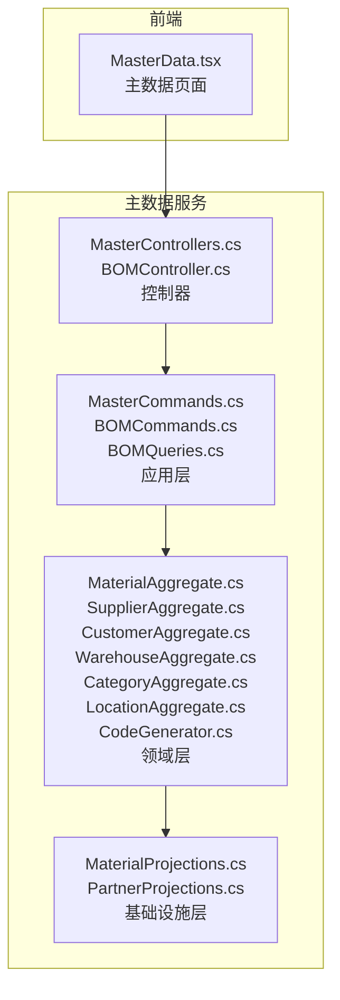
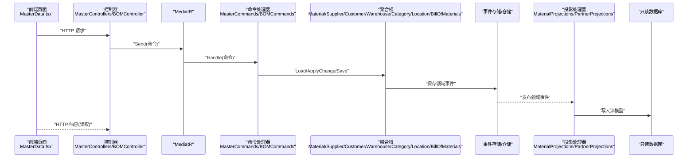
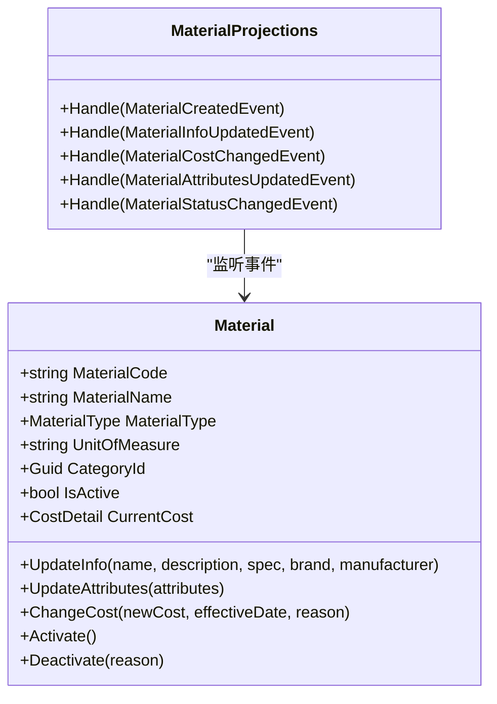
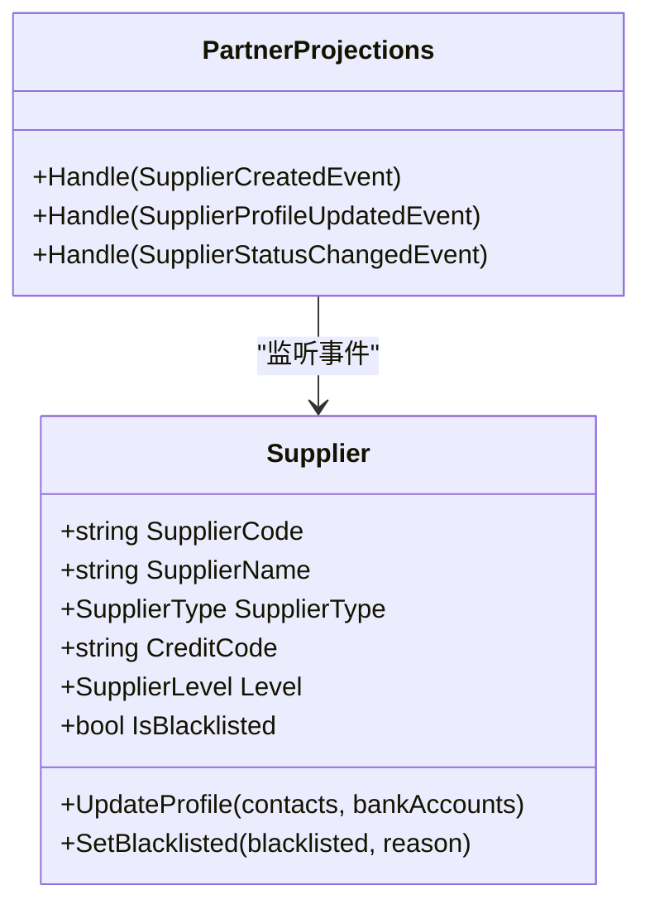
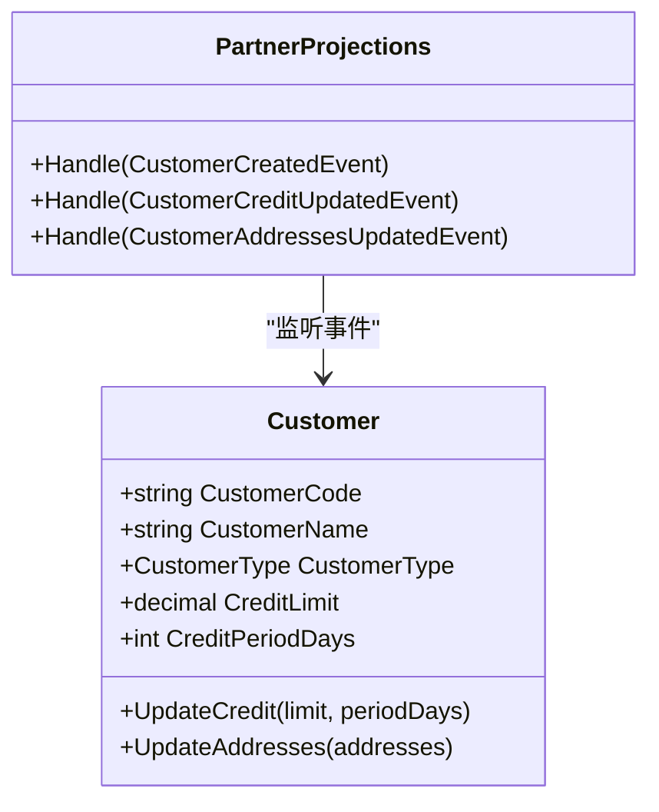
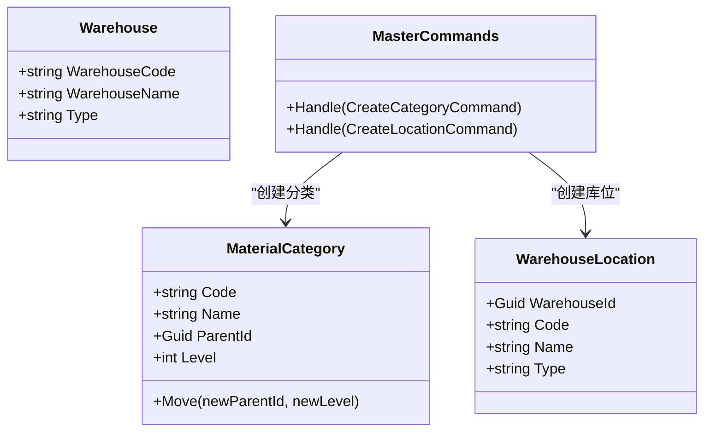
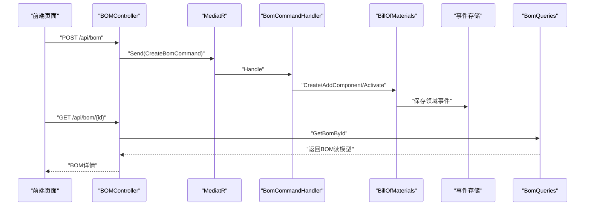
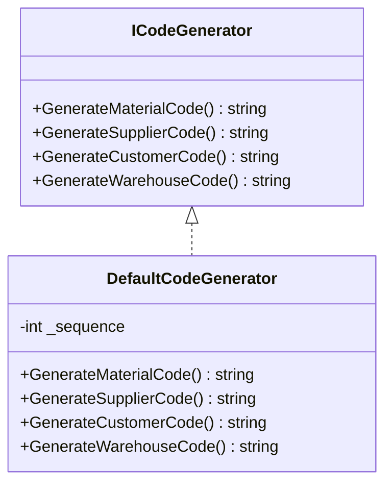
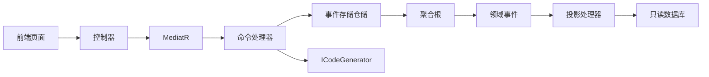

# 主数据管理页面

<cite>
**本文引用的文件**
- [MasterControllers.cs](file://src/Services/MasterData/ErpSystem.MasterData/Controllers/MasterControllers.cs)
- [BOMController.cs](file://src/Services/MasterData/ErpSystem.MasterData/Controllers/BOMController.cs)
- [MasterCommands.cs](file://src/Services/MasterData/ErpSystem.MasterData/Application/MasterCommands.cs)
- [BOMCommands.cs](file://src/Services/MasterData/ErpSystem.MasterData/Application/BOMCommands.cs)
- [BOMQueries.cs](file://src/Services/MasterData/ErpSystem.MasterData/Application/BOMQueries.cs)
- [MaterialAggregate.cs](file://src/Services/MasterData/ErpSystem.MasterData/Domain/MaterialAggregate.cs)
- [SupplierAggregate.cs](file://src/Services/MasterData/ErpSystem.MasterData/Domain/SupplierAggregate.cs)
- [CustomerAggregate.cs](file://src/Services/MasterData/ErpSystem.MasterData/Domain/CustomerAggregate.cs)
- [WarehouseAggregate.cs](file://src/Services/MasterData/ErpSystem.MasterData/Domain/WarehouseAggregate.cs)
- [CategoryAggregate.cs](file://src/Services/MasterData/ErpSystem.MasterData/Domain/CategoryAggregate.cs)
- [LocationAggregate.cs](file://src/Services/MasterData/ErpSystem.MasterData/Domain/LocationAggregate.cs)
- [CodeGenerator.cs](file://src/Services/MasterData/ErpSystem.MasterData/Domain/CodeGenerator.cs)
- [MaterialProjections.cs](file://src/Services/MasterData/ErpSystem.MasterData/Infrastructure/MaterialProjections.cs)
- [PartnerProjections.cs](file://src/Services/MasterData/ErpSystem.MasterData/Infrastructure/PartnerProjections.cs)
- [MasterData.tsx](file://src/Web/ErpSystem.Web/src/pages/MasterData.tsx)
- [PRD-01-MasterData-Service.md](file://docs/PRD-01-MasterData-Service.md)
</cite>

## 目录
1. [简介](#简介)
2. [项目结构](#项目结构)
3. [核心组件](#核心组件)
4. [架构总览](#架构总览)
5. [详细组件分析](#详细组件分析)
6. [依赖关系分析](#依赖关系分析)
7. [性能考虑](#性能考虑)
8. [故障排查指南](#故障排查指南)
9. [结论](#结论)
10. [附录](#附录)

## 简介
本文件面向“主数据管理页面”，围绕物料、供应商、客户、仓库及BOM等核心主数据的CRUD、表单校验、导入导出、批量编辑、编码规则、分类体系、属性配置、版本控制、变更历史与数据迁移等主题进行系统化说明。文档基于实际代码实现与PRD文档，提供从领域模型到应用层命令、控制器、读模型投影与前端页面的全链路解读，并辅以可视化图示帮助理解。

## 项目结构
主数据服务采用分层架构：
- 控制器层：暴露REST API，路由至应用层命令与查询。
- 应用层：MediatR命令/查询处理器，协调聚合与仓储。
- 领域层：聚合根与值对象，定义业务规则与领域事件。
- 基础设施层：事件存储与读模型投影，实现CQRS读写分离。
- 前端页面：主数据管理页，包含物料、BOM、合作伙伴三类视图。

图表来源
- [MasterControllers.cs](file://src/Services/MasterData/ErpSystem.MasterData/Controllers/MasterControllers.cs#L1-L79)
- [BOMController.cs](file://src/Services/MasterData/ErpSystem.MasterData/Controllers/BOMController.cs#L1-L54)
- [MasterCommands.cs](file://src/Services/MasterData/ErpSystem.MasterData/Application/MasterCommands.cs#L1-L110)
- [BOMCommands.cs](file://src/Services/MasterData/ErpSystem.MasterData/Application/BOMCommands.cs#L1-L49)
- [BOMQueries.cs](file://src/Services/MasterData/ErpSystem.MasterData/Application/BOMQueries.cs#L1-L41)
- [MaterialAggregate.cs](file://src/Services/MasterData/ErpSystem.MasterData/Domain/MaterialAggregate.cs#L1-L178)
- [SupplierAggregate.cs](file://src/Services/MasterData/ErpSystem.MasterData/Domain/SupplierAggregate.cs#L1-L125)
- [CustomerAggregate.cs](file://src/Services/MasterData/ErpSystem.MasterData/Domain/CustomerAggregate.cs#L1-L96)
- [WarehouseAggregate.cs](file://src/Services/MasterData/ErpSystem.MasterData/Domain/WarehouseAggregate.cs#L1-L44)
- [CategoryAggregate.cs](file://src/Services/MasterData/ErpSystem.MasterData/Domain/CategoryAggregate.cs#L1-L67)
- [LocationAggregate.cs](file://src/Services/MasterData/ErpSystem.MasterData/Domain/LocationAggregate.cs#L1-L49)
- [CodeGenerator.cs](file://src/Services/MasterData/ErpSystem.MasterData/Domain/CodeGenerator.cs#L1-L22)
- [MaterialProjections.cs](file://src/Services/MasterData/ErpSystem.MasterData/Infrastructure/MaterialProjections.cs#L1-L75)
- [PartnerProjections.cs](file://src/Services/MasterData/ErpSystem.MasterData/Infrastructure/PartnerProjections.cs#L1-L80)

章节来源
- [MasterControllers.cs](file://src/Services/MasterData/ErpSystem.MasterData/Controllers/MasterControllers.cs#L1-L79)
- [BOMController.cs](file://src/Services/MasterData/ErpSystem.MasterData/Controllers/BOMController.cs#L1-L54)
- [MasterCommands.cs](file://src/Services/MasterData/ErpSystem.MasterData/Application/MasterCommands.cs#L1-L110)
- [BOMCommands.cs](file://src/Services/MasterData/ErpSystem.MasterData/Application/BOMCommands.cs#L1-L49)
- [BOMQueries.cs](file://src/Services/MasterData/ErpSystem.MasterData/Application/BOMQueries.cs#L1-L41)
- [MaterialAggregate.cs](file://src/Services/MasterData/ErpSystem.MasterData/Domain/MaterialAggregate.cs#L1-L178)
- [SupplierAggregate.cs](file://src/Services/MasterData/ErpSystem.MasterData/Domain/SupplierAggregate.cs#L1-L125)
- [CustomerAggregate.cs](file://src/Services/MasterData/ErpSystem.MasterData/Domain/CustomerAggregate.cs#L1-L96)
- [WarehouseAggregate.cs](file://src/Services/MasterData/ErpSystem.MasterData/Domain/WarehouseAggregate.cs#L1-L44)
- [CategoryAggregate.cs](file://src/Services/MasterData/ErpSystem.MasterData/Domain/CategoryAggregate.cs#L1-L67)
- [LocationAggregate.cs](file://src/Services/MasterData/ErpSystem.MasterData/Domain/LocationAggregate.cs#L1-L49)
- [CodeGenerator.cs](file://src/Services/MasterData/ErpSystem.MasterData/Domain/CodeGenerator.cs#L1-L22)
- [MaterialProjections.cs](file://src/Services/MasterData/ErpSystem.MasterData/Infrastructure/MaterialProjections.cs#L1-L75)
- [PartnerProjections.cs](file://src/Services/MasterData/ErpSystem.MasterData/Infrastructure/PartnerProjections.cs#L1-L80)

## 核心组件
- 物料管理：支持创建、查询、按信息与属性更新；内置成本变更与状态变更事件；读模型投影同步。
- 供应商管理：支持创建、档案更新（联系人、银行账户）、黑名单状态变更。
- 客户管理：支持创建、信用额度与收货地址更新。
- 仓库与库位：仓库与库位聚合，支持创建与读模型投影。
- 分类与位置：物料分类树与仓库库位创建。
- BOM管理：BOM创建、组件添加、激活与查询。
- 编码规则：统一的ICodeGenerator接口与默认实现，按类型生成编码。
- 前端页面：主数据管理页，包含物料、BOM、合作伙伴三类表格视图。

章节来源
- [MasterControllers.cs](file://src/Services/MasterData/ErpSystem.MasterData/Controllers/MasterControllers.cs#L11-L45)
- [MasterControllers.cs](file://src/Services/MasterData/ErpSystem.MasterData/Controllers/MasterControllers.cs#L49-L78)
- [BOMController.cs](file://src/Services/MasterData/ErpSystem.MasterData/Controllers/BOMController.cs#L10-L53)
- [MasterCommands.cs](file://src/Services/MasterData/ErpSystem.MasterData/Application/MasterCommands.cs#L44-L109)
- [BOMCommands.cs](file://src/Services/MasterData/ErpSystem.MasterData/Application/BOMCommands.cs#L27-L48)
- [MaterialAggregate.cs](file://src/Services/MasterData/ErpSystem.MasterData/Domain/MaterialAggregate.cs#L84-L143)
- [SupplierAggregate.cs](file://src/Services/MasterData/ErpSystem.MasterData/Domain/SupplierAggregate.cs#L66-L96)
- [CustomerAggregate.cs](file://src/Services/MasterData/ErpSystem.MasterData/Domain/CustomerAggregate.cs#L46-L73)
- [WarehouseAggregate.cs](file://src/Services/MasterData/ErpSystem.MasterData/Domain/WarehouseAggregate.cs#L18-L29)
- [CategoryAggregate.cs](file://src/Services/MasterData/ErpSystem.MasterData/Domain/CategoryAggregate.cs#L27-L47)
- [LocationAggregate.cs](file://src/Services/MasterData/ErpSystem.MasterData/Domain/LocationAggregate.cs#L21-L33)
- [CodeGenerator.cs](file://src/Services/MasterData/ErpSystem.MasterData/Domain/CodeGenerator.cs#L3-L21)
- [MaterialProjections.cs](file://src/Services/MasterData/ErpSystem.MasterData/Infrastructure/MaterialProjections.cs#L7-L74)
- [PartnerProjections.cs](file://src/Services/MasterData/ErpSystem.MasterData/Infrastructure/PartnerProjections.cs#L7-L79)
- [MasterData.tsx](file://src/Web/ErpSystem.Web/src/pages/MasterData.tsx#L28-L183)

## 架构总览
主数据服务遵循CQRS与事件溯源思想：
- 写模型：控制器接收请求，MediatR派发命令，命令处理器加载聚合、应用领域事件、持久化事件。
- 读模型：领域事件由投影处理器异步写入只读数据库，前端通过HTTP接口读取。

图表来源
- [MasterControllers.cs](file://src/Services/MasterData/ErpSystem.MasterData/Controllers/MasterControllers.cs#L11-L45)
- [BOMController.cs](file://src/Services/MasterData/ErpSystem.MasterData/Controllers/BOMController.cs#L10-L53)
- [MasterCommands.cs](file://src/Services/MasterData/ErpSystem.MasterData/Application/MasterCommands.cs#L44-L109)
- [BOMCommands.cs](file://src/Services/MasterData/ErpSystem.MasterData/Application/BOMCommands.cs#L27-L48)
- [MaterialProjections.cs](file://src/Services/MasterData/ErpSystem.MasterData/Infrastructure/MaterialProjections.cs#L7-L74)
- [PartnerProjections.cs](file://src/Services/MasterData/ErpSystem.MasterData/Infrastructure/PartnerProjections.cs#L7-L79)

## 详细组件分析

### 物料管理（CRUD、属性、成本、状态）
- 控制器接口
  - 创建：POST /api/v1/materials
  - 查询全部：GET /api/v1/materials
  - 按ID查询：GET /api/v1/materials/{id}
  - 更新基础信息：PUT /api/v1/materials/{id}/info
  - 更新属性：PUT /api/v1/materials/{id}/attributes
- 应用层命令
  - UpdateMaterialInfoCommand：更新名称、描述、规格、品牌、制造商
  - UpdateMaterialAttributesCommand：更新扩展属性集合
- 领域模型
  - Material聚合：包含物料编码、类型、单位、分类、状态、成本、属性等；提供UpdateInfo、UpdateAttributes、ChangeCost、Activate/Deactivate等方法；通过ApplyChange应用领域事件。
  - 领域事件：MaterialCreatedEvent、MaterialInfoUpdatedEvent、MaterialCostChangedEvent、MaterialAttributesUpdatedEvent、MaterialStatusChangedEvent
- 读模型投影
  - MaterialProjections：监听Material系列事件，写入MaterialReadModel，包含编码、名称、类型、单位、分类、成本明细、是否激活等字段。

图表来源
- [MaterialAggregate.cs](file://src/Services/MasterData/ErpSystem.MasterData/Domain/MaterialAggregate.cs#L84-L143)
- [MaterialProjections.cs](file://src/Services/MasterData/ErpSystem.MasterData/Infrastructure/MaterialProjections.cs#L7-L74)

章节来源
- [MasterControllers.cs](file://src/Services/MasterData/ErpSystem.MasterData/Controllers/MasterControllers.cs#L11-L45)
- [MasterCommands.cs](file://src/Services/MasterData/ErpSystem.MasterData/Application/MasterCommands.cs#L16-L74)
- [MaterialAggregate.cs](file://src/Services/MasterData/ErpSystem.MasterData/Domain/MaterialAggregate.cs#L84-L143)
- [MaterialProjections.cs](file://src/Services/MasterData/ErpSystem.MasterData/Infrastructure/MaterialProjections.cs#L7-L74)

### 供应商管理（CRUD、联系人、银行账户、黑名单）
- 控制器接口
  - 创建供应商：POST /api/v1/partners/suppliers
  - 更新供应商档案：PUT /api/v1/partners/suppliers/{id}/profile
  - 查询供应商：GET /api/v1/partners/suppliers
- 应用层命令
  - UpdateSupplierProfileCommand：更新联系人与银行账户集合
- 领域模型
  - Supplier聚合：包含编码、名称、类型、信用代码、等级、黑名单状态；提供UpdateProfile/SetBlacklisted等方法；通过ApplyChange应用领域事件。
  - 领域事件：SupplierCreatedEvent、SupplierProfileUpdatedEvent、SupplierStatusChangedEvent、SupplierLevelChangedEvent
- 读模型投影
  - PartnerProjections：监听供应商事件，写入SupplierReadModel，包含编码、名称、类型、联系人、银行账户、黑名单状态等。

图表来源
- [SupplierAggregate.cs](file://src/Services/MasterData/ErpSystem.MasterData/Domain/SupplierAggregate.cs#L66-L96)
- [PartnerProjections.cs](file://src/Services/MasterData/ErpSystem.MasterData/Infrastructure/PartnerProjections.cs#L7-L79)

章节来源
- [MasterControllers.cs](file://src/Services/MasterData/ErpSystem.MasterData/Controllers/MasterControllers.cs#L49-L78)
- [MasterCommands.cs](file://src/Services/MasterData/ErpSystem.MasterData/Application/MasterCommands.cs#L77-L82)
- [SupplierAggregate.cs](file://src/Services/MasterData/ErpSystem.MasterData/Domain/SupplierAggregate.cs#L66-L96)
- [PartnerProjections.cs](file://src/Services/MasterData/ErpSystem.MasterData/Infrastructure/PartnerProjections.cs#L7-L79)

### 客户管理（CRUD、信用额度、收货地址）
- 控制器接口
  - 创建客户：POST /api/v1/partners/customers
  - 查询客户：GET /api/v1/partners/customers
- 应用层命令
  - UpdateCustomerAddressesCommand：更新收货地址集合
- 领域模型
  - Customer聚合：包含编码、名称、类型、信用额度、信用期限、地址集合；提供UpdateCredit/UpdateAddresses等方法；通过ApplyChange应用领域事件。
  - 领域事件：CustomerCreatedEvent、CustomerCreditUpdatedEvent、CustomerAddressesUpdatedEvent
- 读模型投影
  - PartnerProjections：监听客户事件，写入CustomerReadModel，包含编码、名称、类型、信用额度、地址集合等。

图表来源
- [CustomerAggregate.cs](file://src/Services/MasterData/ErpSystem.MasterData/Domain/CustomerAggregate.cs#L46-L73)
- [PartnerProjections.cs](file://src/Services/MasterData/ErpSystem.MasterData/Infrastructure/PartnerProjections.cs#L7-L79)

章节来源
- [MasterControllers.cs](file://src/Services/MasterData/ErpSystem.MasterData/Controllers/MasterControllers.cs#L49-L78)
- [MasterCommands.cs](file://src/Services/MasterData/ErpSystem.MasterData/Application/MasterCommands.cs#L84-L88)
- [CustomerAggregate.cs](file://src/Services/MasterData/ErpSystem.MasterData/Domain/CustomerAggregate.cs#L46-L73)
- [PartnerProjections.cs](file://src/Services/MasterData/ErpSystem.MasterData/Infrastructure/PartnerProjections.cs#L7-L79)

### 仓库与库位管理（CRUD、树形分类）
- 仓库
  - 聚合：Warehouse，包含编码、名称、类型；通过WarehouseCreatedEvent初始化。
- 库位
  - 聚合：WarehouseLocation，包含仓库ID、编码、名称、类型；通过LocationCreatedEvent初始化。
- 分类
  - 聚合：MaterialCategory，支持最多5级树形结构，支持Move与层级约束。
- 控制器
  - CreateCategoryCommand：创建分类
  - CreateLocationCommand：创建库位

图表来源
- [WarehouseAggregate.cs](file://src/Services/MasterData/ErpSystem.MasterData/Domain/WarehouseAggregate.cs#L18-L29)
- [LocationAggregate.cs](file://src/Services/MasterData/ErpSystem.MasterData/Domain/LocationAggregate.cs#L21-L33)
- [CategoryAggregate.cs](file://src/Services/MasterData/ErpSystem.MasterData/Domain/CategoryAggregate.cs#L27-L47)
- [MasterCommands.cs](file://src/Services/MasterData/ErpSystem.MasterData/Application/MasterCommands.cs#L92-L108)

章节来源
- [WarehouseAggregate.cs](file://src/Services/MasterData/ErpSystem.MasterData/Domain/WarehouseAggregate.cs#L18-L29)
- [LocationAggregate.cs](file://src/Services/MasterData/ErpSystem.MasterData/Domain/LocationAggregate.cs#L21-L33)
- [CategoryAggregate.cs](file://src/Services/MasterData/ErpSystem.MasterData/Domain/CategoryAggregate.cs#L27-L47)
- [MasterCommands.cs](file://src/Services/MasterData/ErpSystem.MasterData/Application/MasterCommands.cs#L92-L108)

### BOM管理（创建、组件添加、激活、查询）
- 控制器接口
  - 查询全部BOM：GET /api/bom
  - 按ID查询：GET /api/bom/{id}
  - 按父物料查询：GET /api/bom/material/{materialId}
  - 创建BOM：POST /api/bom
  - 添加组件：POST /api/bom/{id}/components
  - 激活BOM：POST /api/bom/{id}/activate
- 应用层命令
  - AddBomComponentCommand：向指定BOM添加子项组件
  - ActivateBomCommand：激活BOM
- 领域模型
  - BillOfMaterials聚合：包含父物料ID、名称、版本、状态、生效日期、组件集合；提供AddComponent/Activate/Deactivate等方法；通过ApplyChange应用领域事件。
  - 领域事件：BomCreatedEvent、BomComponentAddedEvent、BomStatusChangedEvent
- 查询
  - BomQueries：提供GetAllBoMs/GetBomById/GetBoMsByParentMaterial等查询。

图表来源
- [BOMController.cs](file://src/Services/MasterData/ErpSystem.MasterData/Controllers/BOMController.cs#L10-L53)
- [BOMCommands.cs](file://src/Services/MasterData/ErpSystem.MasterData/Application/BOMCommands.cs#L27-L48)
- [BOMQueries.cs](file://src/Services/MasterData/ErpSystem.MasterData/Application/BOMQueries.cs#L10-L39)
- [BillOfMaterialsAggregate.cs](file://src/Services/MasterData/ErpSystem.MasterData/Domain/BillOfMaterialsAggregate.cs#L55-L102)

章节来源
- [BOMController.cs](file://src/Services/MasterData/ErpSystem.MasterData/Controllers/BOMController.cs#L10-L53)
- [BOMCommands.cs](file://src/Services/MasterData/ErpSystem.MasterData/Application/BOMCommands.cs#L27-L48)
- [BOMQueries.cs](file://src/Services/MasterData/ErpSystem.MasterData/Application/BOMQueries.cs#L10-L39)
- [BillOfMaterialsAggregate.cs](file://src/Services/MasterData/ErpSystem.MasterData/Domain/BillOfMaterialsAggregate.cs#L55-L102)

### 表单验证、导入导出与批量编辑
- 表单验证
  - 控制器层：通过参数绑定与模型匹配进行基础校验（如路径参数与命令中的ID一致性校验）。
  - 应用层：命令对象作为轻量DTO，业务规则在聚合内执行（如BOM状态与组件合法性）。
- 导入导出
  - 当前代码未直接实现导入导出逻辑；可在应用层新增Import/Export命令与处理器，结合Excel/CSV解析与批量写入。
- 批量编辑
  - 可通过批量命令处理器实现（如批量更新属性、批量设置状态），在聚合内逐条应用事件并批量持久化。

章节来源
- [MasterControllers.cs](file://src/Services/MasterData/ErpSystem.MasterData/Controllers/MasterControllers.cs#L30-L44)
- [BOMController.cs](file://src/Services/MasterData/ErpSystem.MasterData/Controllers/BOMController.cs#L39-L52)
- [BOMCommands.cs](file://src/Services/MasterData/ErpSystem.MasterData/Application/BOMCommands.cs#L31-L38)

### 编码规则管理
- ICodeGenerator接口定义了物料、供应商、客户、仓库的编码生成方法。
- DefaultCodeGenerator提供默认实现：物料/供应商/客户采用“日期+序列号”模式，仓库采用简单序列号模式。
- 建议在生产环境替换为分布式序列或数据库计数器，确保全局唯一性与高并发稳定性。

图表来源
- [CodeGenerator.cs](file://src/Services/MasterData/ErpSystem.MasterData/Domain/CodeGenerator.cs#L3-L21)

章节来源
- [CodeGenerator.cs](file://src/Services/MasterData/ErpSystem.MasterData/Domain/CodeGenerator.cs#L3-L21)

### 分类体系与属性配置
- 分类体系
  - MaterialCategory支持最多5级树形结构，创建与移动均受层级约束。
- 属性配置
  - 物料支持MaterialAttribute键值对属性集合；可通过UpdateMaterialAttributesCommand批量更新。
  - PRD中提及“属性模板”“属性继承”，可在聚合或读模型中扩展以支持模板与继承规则。

章节来源
- [CategoryAggregate.cs](file://src/Services/MasterData/ErpSystem.MasterData/Domain/CategoryAggregate.cs#L27-L47)
- [MaterialAggregate.cs](file://src/Services/MasterData/ErpSystem.MasterData/Domain/MaterialAggregate.cs#L12-L12)
- [MasterCommands.cs](file://src/Services/MasterData/ErpSystem.MasterData/Application/MasterCommands.cs#L69-L74)

### 数据一致性与事件驱动
- 事件驱动：聚合通过ApplyChange应用领域事件，事件存储保障写入顺序与幂等。
- 投影同步：MaterialProjections/PartnerProjections监听事件，写入只读数据库，保证查询性能与最终一致。
- 读写分离：控制器仅负责命令与查询，不直接读写聚合，避免耦合。

章节来源
- [MaterialProjections.cs](file://src/Services/MasterData/ErpSystem.MasterData/Infrastructure/MaterialProjections.cs#L7-L74)
- [PartnerProjections.cs](file://src/Services/MasterData/ErpSystem.MasterData/Infrastructure/PartnerProjections.cs#L7-L79)

### 版本控制、变更历史与数据迁移
- 版本控制
  - 物料成本：CurrentCost与历史追踪可扩展为版本化结构（当前实现为单值，PRD建议历史版本不可删除、只能新增）。
  - BOM：BomName+Version形成版本标识，激活后不可随意修改。
- 变更历史
  - 通过领域事件记录关键变更（创建、更新、状态变更、成本变更等），投影写入读模型。
- 数据迁移
  - 建议通过事件回放与批量命令处理器实现历史数据迁移，确保新旧格式兼容与一致性。

章节来源
- [MaterialAggregate.cs](file://src/Services/MasterData/ErpSystem.MasterData/Domain/MaterialAggregate.cs#L43-L61)
- [BillOfMaterialsAggregate.cs](file://src/Services/MasterData/ErpSystem.MasterData/Domain/BillOfMaterialsAggregate.cs#L11-L42)
- [PRD-01-MasterData-Service.md](file://docs/PRD-01-MasterData-Service.md#L69-L88)

## 依赖关系分析
- 控制器依赖MediatR与查询对象，命令处理器依赖事件存储仓储与编码生成器。
- 聚合依赖领域事件与ApplyChange机制，投影依赖读模型上下文。
- 前端依赖API接口，当前页面包含物料、BOM、合作伙伴三类表格。

图表来源
- [MasterControllers.cs](file://src/Services/MasterData/ErpSystem.MasterData/Controllers/MasterControllers.cs#L11-L45)
- [BOMController.cs](file://src/Services/MasterData/ErpSystem.MasterData/Controllers/BOMController.cs#L10-L53)
- [MasterCommands.cs](file://src/Services/MasterData/ErpSystem.MasterData/Application/MasterCommands.cs#L44-L109)
- [BOMCommands.cs](file://src/Services/MasterData/ErpSystem.MasterData/Application/BOMCommands.cs#L27-L48)
- [MaterialProjections.cs](file://src/Services/MasterData/ErpSystem.MasterData/Infrastructure/MaterialProjections.cs#L7-L74)
- [PartnerProjections.cs](file://src/Services/MasterData/ErpSystem.MasterData/Infrastructure/PartnerProjections.cs#L7-L79)
- [MasterData.tsx](file://src/Web/ErpSystem.Web/src/pages/MasterData.tsx#L28-L183)

章节来源
- [MasterControllers.cs](file://src/Services/MasterData/ErpSystem.MasterData/Controllers/MasterControllers.cs#L11-L45)
- [BOMController.cs](file://src/Services/MasterData/ErpSystem.MasterData/Controllers/BOMController.cs#L10-L53)
- [MasterCommands.cs](file://src/Services/MasterData/ErpSystem.MasterData/Application/MasterCommands.cs#L44-L109)
- [BOMCommands.cs](file://src/Services/MasterData/ErpSystem.MasterData/Application/BOMCommands.cs#L27-L48)
- [MaterialProjections.cs](file://src/Services/MasterData/ErpSystem.MasterData/Infrastructure/MaterialProjections.cs#L7-L74)
- [PartnerProjections.cs](file://src/Services/MasterData/ErpSystem.MasterData/Infrastructure/PartnerProjections.cs#L7-L79)
- [MasterData.tsx](file://src/Web/ErpSystem.Web/src/pages/MasterData.tsx#L28-L183)

## 性能考虑
- 查询性能：读模型投影独立于写模型，查询接口直接访问只读数据库，降低写放大。
- 写入性能：事件存储按事件顺序写入，聚合应用事件后批量持久化，适合高吞吐场景。
- 并发控制：命令处理器加载聚合后应用事件，避免并发冲突；必要时引入乐观锁或去重键。
- 前端渲染：主数据页面采用分页与懒加载策略，减少一次性渲染压力。

## 故障排查指南
- 控制器参数校验失败
  - 症状：返回400 Bad Request
  - 排查：确认路径参数与命令对象中的ID一致；检查请求体字段类型与命名。
- 聚合不存在
  - 症状：BOM组件添加时报KeyNotFoundException
  - 排查：确认BOM ID存在且未被删除；检查事件存储是否完整。
- 业务规则触发异常
  - 症状：InvalidOperationException（如非草稿BOM添加组件、激活空BOM）
  - 排查：检查BOM状态与组件集合；确保先创建再添加组件。
- 读模型不同步
  - 症状：查询返回旧数据
  - 排查：确认事件已发布并被投影处理器消费；检查只读数据库连接与事务隔离级别。

章节来源
- [BOMCommands.cs](file://src/Services/MasterData/ErpSystem.MasterData/Application/BOMCommands.cs#L31-L38)
- [BillOfMaterialsAggregate.cs](file://src/Services/MasterData/ErpSystem.MasterData/Domain/BillOfMaterialsAggregate.cs#L78-L96)
- [MaterialProjections.cs](file://src/Services/MasterData/ErpSystem.MasterData/Infrastructure/MaterialProjections.cs#L14-L30)
- [PartnerProjections.cs](file://src/Services/MasterData/ErpSystem.MasterData/Infrastructure/PartnerProjections.cs#L15-L25)

## 结论
主数据管理页面以CQRS+事件驱动为核心，实现了物料、供应商、客户、仓库、库位与BOM的完整生命周期管理。通过清晰的分层与事件投影，系统具备良好的扩展性与一致性。建议在现有基础上补充导入导出、批量编辑、版本化成本与属性模板等功能，以满足复杂主数据治理需求。

## 附录
- 前端页面要点
  - 支持物料、BOM、合作伙伴三类标签页与表格展示。
  - 使用API接口获取数据，错误时回退到演示数据。
- PRD参考
  - 编码规则、分类层级、属性模板、版本控制与审计追踪等需求详见PRD文档。

章节来源
- [MasterData.tsx](file://src/Web/ErpSystem.Web/src/pages/MasterData.tsx#L28-L183)
- [PRD-01-MasterData-Service.md](file://docs/PRD-01-MasterData-Service.md#L36-L52)
- [PRD-01-MasterData-Service.md](file://docs/PRD-01-MasterData-Service.md#L130-L153)
- [PRD-01-MasterData-Service.md](file://docs/PRD-01-MasterData-Service.md#L107-L127)
- [PRD-01-MasterData-Service.md](file://docs/PRD-01-MasterData-Service.md#L690-L693)