# 生产管理页面

<cite>
**本文引用的文件**
- [PRD-07-Production-Service.md](file://docs/PRD-07-Production-Service.md)
- [Program.cs](file://src/Services/Production/ErpSystem.Production/Program.cs)
- [ProductionOrdersController.cs](file://src/Services/Production/ErpSystem.Production/API/ProductionOrdersController.cs)
- [ProductionOrderCommands.cs](file://src/Services/Production/ErpSystem.Production/Application/ProductionOrderCommands.cs)
- [ProductionQueries.cs](file://src/Services/Production/ErpSystem.Production/Application/ProductionQueries.cs)
- [ProductionOrderAggregate.cs](file://src/Services/Production/ErpSystem.Production/Domain/ProductionOrderAggregate.cs)
- [Persistence.cs](file://src/Services/Production/ErpSystem.Production/Infrastructure/Persistence.cs)
- [Projections.cs](file://src/Services/Production/ErpSystem.Production/Infrastructure/Projections.cs)
- [Production.tsx](file://src/Web/ErpSystem.Web/src/pages/Production.tsx)
- [RealTimeDashboard.tsx](file://src/Web/ErpSystem.Web/src/components/RealTimeDashboard.tsx)
- [Analytics.tsx](file://src/Web/ErpSystem.Web/src/pages/Analytics.tsx)
- [Dashboard.tsx](file://src/Web/ErpSystem.Web/src/pages/Dashboard.tsx)
- [DashboardService.cs](file://src/Services/Reporting/ErpSystem.Reporting/Application/DashboardService.cs)
- [BillOfMaterialsAggregate.cs](file://src/Services/MasterData/ErpSystem.MasterData/Domain/BillOfMaterialsAggregate.cs)
- [BOMQueries.cs](file://src/Services/MasterData/ErpSystem.MasterData/Application/BOMQueries.cs)
- [QualityCheckAggregate.cs](file://src/Services/Quality/ErpSystem.Quality/Domain/QualityCheckAggregate.cs)
- [QualityAlertAggregate.cs](file://src/Services/Quality/ErpSystem.Quality/Domain/QualityAlertAggregate.cs)
- [QualityWorkflowTests.cs](file://src/Tests/ErpSystem.IntegrationTests/Quality/QualityWorkflowTests.cs)
- [DemandForecastAggregate.cs](file://src/Services/Analytics/ErpSystem.Analytics/Domain/DemandForecastAggregate.cs)
- [BiAnalyticsService.cs](file://src/Services/Analytics/ErpSystem.Analytics/Infrastructure/BiAnalyticsService.cs)
</cite>

## 目录
1. [简介](#简介)
2. [项目结构](#项目结构)
3. [核心组件](#核心组件)
4. [架构总览](#架构总览)
5. [详细组件分析](#详细组件分析)
6. [依赖关系分析](#依赖关系分析)
7. [性能考量](#性能考量)
8. [故障排查指南](#故障排查指南)
9. [结论](#结论)
10. [附录](#附录)

## 简介
本文件面向生产管理页面，系统性阐述生产计划、工单管理、BOM管理与生产执行等模块的实现架构与数据流，覆盖从“创建生产订单”到“报工入库”的完整闭环。同时，结合前端可视化仪表盘与实时分析能力，提供产能分析、设备状态与质量控制的实时展示方案，并给出生产数据采集、工艺路线管理、生产调度优化、统计分析与成本核算的集成思路，以及智能化建议、异常预警与持续改进辅助工具的设计方向。

## 项目结构
生产管理页面由后端微服务与前端Web应用共同组成：
- 后端服务：生产服务（Production）提供生产订单、投料、报工与在制品视图；与库存（Inventory）、主数据（MasterData）、质量（Quality）、分析（Analytics）、报表（Reporting）等服务通过事件总线或HTTP接口集成。
- 前端应用：包含生产页面、实时分析仪表盘与综合仪表盘，支持生产订单列表、状态可视化与实时数据展示。

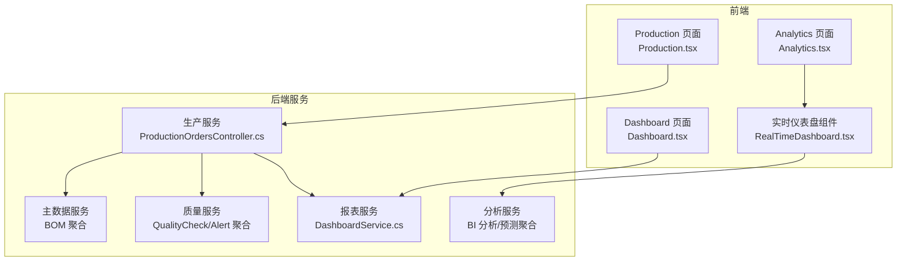

图表来源
- [Production.tsx](file://src/Web/ErpSystem.Web/src/pages/Production.tsx#L1-L90)
- [Analytics.tsx](file://src/Web/ErpSystem.Web/src/pages/Analytics.tsx#L1-L49)
- [Dashboard.tsx](file://src/Web/ErpSystem.Web/src/pages/Dashboard.tsx#L26-L64)
- [RealTimeDashboard.tsx](file://src/Web/ErpSystem.Web/src/components/RealTimeDashboard.tsx#L1-L47)
- [ProductionOrdersController.cs](file://src/Services/Production/ErpSystem.Production/API/ProductionOrdersController.cs#L1-L46)
- [DashboardService.cs](file://src/Services/Reporting/ErpSystem.Reporting/Application/DashboardService.cs#L20-L37)
- [BillOfMaterialsAggregate.cs](file://src/Services/MasterData/ErpSystem.MasterData/Domain/BillOfMaterialsAggregate.cs#L55-L124)
- [QualityCheckAggregate.cs](file://src/Services/Quality/ErpSystem.Quality/Domain/QualityCheckAggregate.cs#L8-L116)
- [QualityAlertAggregate.cs](file://src/Services/Quality/ErpSystem.Quality/Domain/QualityAlertAggregate.cs#L8-L44)

章节来源
- [Production.tsx](file://src/Web/ErpSystem.Web/src/pages/Production.tsx#L1-L90)
- [ProductionOrdersController.cs](file://src/Services/Production/ErpSystem.Production/API/ProductionOrdersController.cs#L1-L46)
- [Program.cs](file://src/Services/Production/ErpSystem.Production/Program.cs#L1-L72)

## 核心组件
- 生产订单聚合与状态机：定义生产订单生命周期与状态转换，支撑创建、下达、投料、报工、完成与关闭等关键流程。
- 应用层命令/查询：封装业务操作（创建、释放、投料、报工）与查询（按条件检索、在制品视图）。
- 基础设施层：事件存储与读模型投影，支持事件溯源与读写分离。
- 前端页面：生产订单列表与状态可视化，实时分析仪表盘与综合仪表盘。

章节来源
- [ProductionOrderAggregate.cs](file://src/Services/Production/ErpSystem.Production/Domain/ProductionOrderAggregate.cs#L63-L142)
- [ProductionOrderCommands.cs](file://src/Services/Production/ErpSystem.Production/Application/ProductionOrderCommands.cs#L33-L99)
- [ProductionQueries.cs](file://src/Services/Production/ErpSystem.Production/Application/ProductionQueries.cs#L13-L44)
- [Persistence.cs](file://src/Services/Production/ErpSystem.Production/Infrastructure/Persistence.cs#L6-L71)
- [Projections.cs](file://src/Services/Production/ErpSystem.Production/Infrastructure/Projections.cs#L6-L107)

## 架构总览
生产管理页面采用事件驱动与CQRS架构：
- 控制器接收请求，MediatR分发命令/查询至应用层处理器。
- 应用层处理器操作领域聚合，产生领域事件并持久化到事件存储。
- 投影器监听领域事件，更新读模型数据库，供查询使用。
- 前端通过HTTP接口访问后端API，实时仪表盘通过分析服务提供的数据进行可视化。

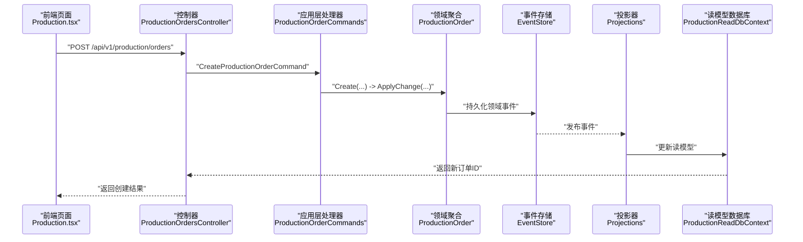

图表来源
- [ProductionOrdersController.cs](file://src/Services/Production/ErpSystem.Production/API/ProductionOrdersController.cs#L11-L12)
- [ProductionOrderCommands.cs](file://src/Services/Production/ErpSystem.Production/Application/ProductionOrderCommands.cs#L39-L46)
- [ProductionOrderAggregate.cs](file://src/Services/Production/ErpSystem.Production/Domain/ProductionOrderAggregate.cs#L72-L83)
- [Persistence.cs](file://src/Services/Production/ErpSystem.Production/Infrastructure/Persistence.cs#L6-L18)
- [Projections.cs](file://src/Services/Production/ErpSystem.Production/Infrastructure/Projections.cs#L13-L28)

## 详细组件分析

### 生产订单聚合与状态机
- 状态枚举：Created → Released → InProgress → PartiallyCompleted → Completed → Closed/Cancelled。
- 关键方法：创建、释放、投料、报工、完成判定。
- 事件驱动：每次状态变化产生相应领域事件，用于审计与集成。

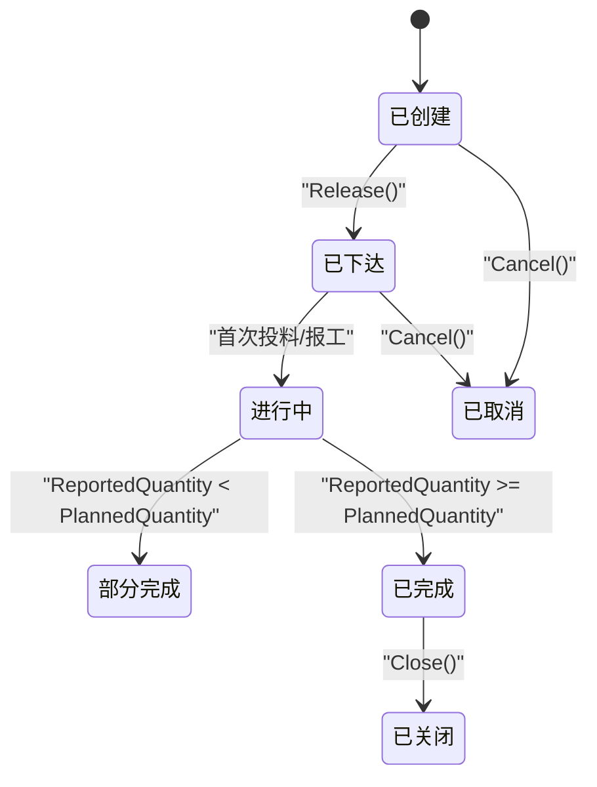

图表来源
- [ProductionOrderAggregate.cs](file://src/Services/Production/ErpSystem.Production/Domain/ProductionOrderAggregate.cs#L5-L14)
- [ProductionOrderAggregate.cs](file://src/Services/Production/ErpSystem.Production/Domain/ProductionOrderAggregate.cs#L85-L111)

章节来源
- [ProductionOrderAggregate.cs](file://src/Services/Production/ErpSystem.Production/Domain/ProductionOrderAggregate.cs#L63-L142)

### 应用层命令与查询
- 命令：创建、释放、投料、报工。
- 查询：按ID获取、列表检索（支持物料、状态、分页）、在制品视图。
- 事件发布：投料与报工时发布集成事件，驱动库存服务出/入库。

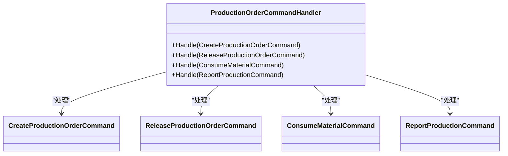

图表来源
- [ProductionOrderCommands.cs](file://src/Services/Production/ErpSystem.Production/Application/ProductionOrderCommands.cs#L8-L37)

章节来源
- [ProductionOrderCommands.cs](file://src/Services/Production/ErpSystem.Production/Application/ProductionOrderCommands.cs#L33-L99)
- [ProductionQueries.cs](file://src/Services/Production/ErpSystem.Production/Application/ProductionQueries.cs#L13-L44)

### 基础设施层（事件存储与投影）
- 事件存储：基于PostgreSQL的事件流表，支持JSONB事件载荷。
- 读模型：生产订单、报工记录、投料记录三类实体，支持高效查询。
- 投影：监听领域事件，更新读模型状态与统计数据。

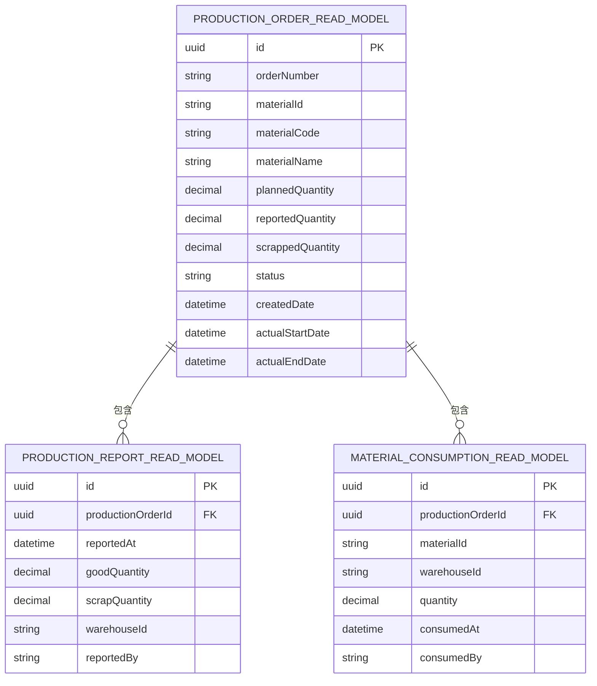

图表来源
- [Persistence.cs](file://src/Services/Production/ErpSystem.Production/Infrastructure/Persistence.cs#L34-L71)
- [Projections.cs](file://src/Services/Production/ErpSystem.Production/Infrastructure/Projections.cs#L13-L105)

章节来源
- [Persistence.cs](file://src/Services/Production/ErpSystem.Production/Infrastructure/Persistence.cs#L6-L71)
- [Projections.cs](file://src/Services/Production/ErpSystem.Production/Infrastructure/Projections.cs#L6-L107)

### 前端生产页面与可视化
- 生产页面：展示生产订单列表（编号、产品、数量、到期日、状态），支持创建与管理入口。
- 实时仪表盘：展示库存流动、预测与运营效率等指标，支持多维度切换。
- 综合仪表盘：汇总收入、库存、OEE与质量评分等关键指标。

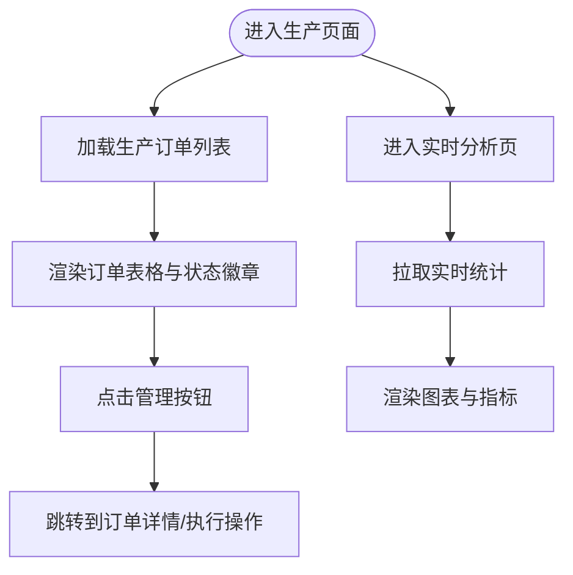

图表来源
- [Production.tsx](file://src/Web/ErpSystem.Web/src/pages/Production.tsx#L16-L89)
- [Analytics.tsx](file://src/Web/ErpSystem.Web/src/pages/Analytics.tsx#L1-L49)
- [RealTimeDashboard.tsx](file://src/Web/ErpSystem.Web/src/components/RealTimeDashboard.tsx#L6-L47)
- [Dashboard.tsx](file://src/Web/ErpSystem.Web/src/pages/Dashboard.tsx#L26-L64)

章节来源
- [Production.tsx](file://src/Web/ErpSystem.Web/src/pages/Production.tsx#L1-L90)
- [Analytics.tsx](file://src/Web/ErpSystem.Web/src/pages/Analytics.tsx#L1-L49)
- [RealTimeDashboard.tsx](file://src/Web/ErpSystem.Web/src/components/RealTimeDashboard.tsx#L1-L47)
- [Dashboard.tsx](file://src/Web/ErpSystem.Web/src/pages/Dashboard.tsx#L26-L64)

### BOM管理与工艺路线
- BOM聚合：支持草稿、激活、作废状态，维护父件与子件清单。
- 工艺路线：PRD中暂不实现，后续可扩展为工序级进度与报工。
- 与生产集成：生产投料可基于BOM标准用量进行校验与优化。

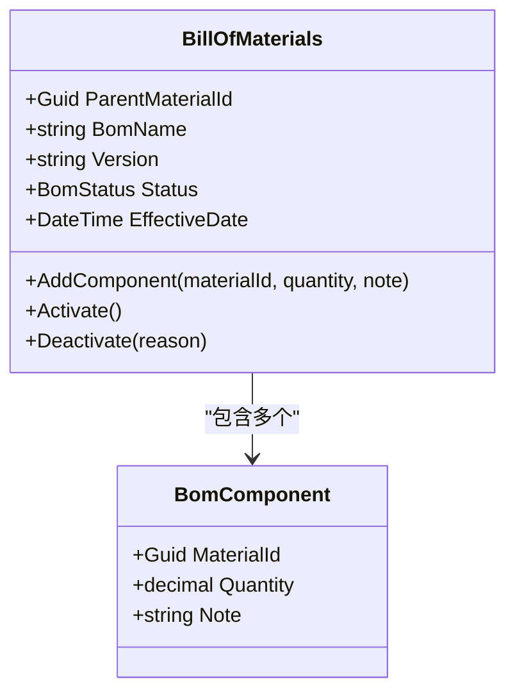

图表来源
- [BillOfMaterialsAggregate.cs](file://src/Services/MasterData/ErpSystem.MasterData/Domain/BillOfMaterialsAggregate.cs#L55-L124)

章节来源
- [BillOfMaterialsAggregate.cs](file://src/Services/MasterData/ErpSystem.MasterData/Domain/BillOfMaterialsAggregate.cs#L1-L125)
- [BOMQueries.cs](file://src/Services/MasterData/ErpSystem.MasterData/Application/BOMQueries.cs#L10-L29)

### 质量控制与异常预警
- 质检点与检查：支持创建、通过、失败状态，用于过程质量把关。
- 质量告警：支持创建、派发、解决，形成闭环管理。
- 测试验证：集成测试覆盖告警状态流转与优先级。

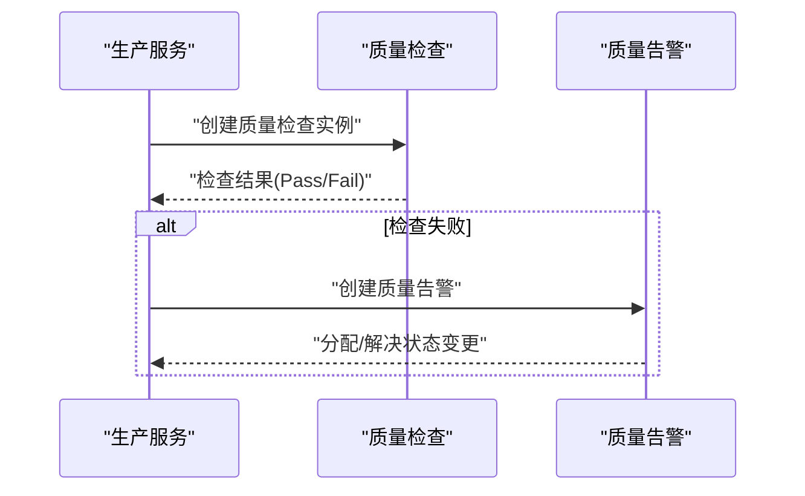

图表来源
- [QualityCheckAggregate.cs](file://src/Services/Quality/ErpSystem.Quality/Domain/QualityCheckAggregate.cs#L18-L52)
- [QualityAlertAggregate.cs](file://src/Services/Quality/ErpSystem.Quality/Domain/QualityAlertAggregate.cs#L18-L44)
- [QualityWorkflowTests.cs](file://src/Tests/ErpSystem.IntegrationTests/Quality/QualityWorkflowTests.cs#L49-L75)

章节来源
- [QualityCheckAggregate.cs](file://src/Services/Quality/ErpSystem.Quality/Domain/QualityCheckAggregate.cs#L1-L116)
- [QualityAlertAggregate.cs](file://src/Services/Quality/ErpSystem.Quality/Domain/QualityAlertAggregate.cs#L1-L44)
- [QualityWorkflowTests.cs](file://src/Tests/ErpSystem.IntegrationTests/Quality/QualityWorkflowTests.cs#L49-L75)

### 生产数据采集与集成
- 投料与报工：通过命令发布集成事件，驱动库存服务完成出/入库。
- 读模型查询：支持按物料、状态、日期范围检索，以及在制品视图。
- 与销售/财务集成：PRD预留接口，支持从销售订单生成生产需求与成本结转。

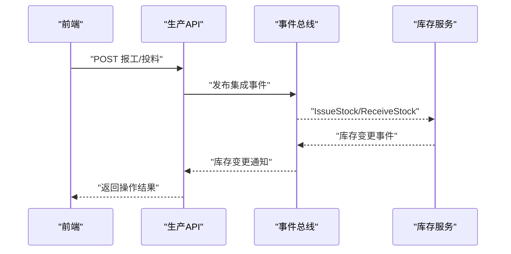

图表来源
- [ProductionOrderCommands.cs](file://src/Services/Production/ErpSystem.Production/Application/ProductionOrderCommands.cs#L65-L96)
- [ProductionOrdersController.cs](file://src/Services/Production/ErpSystem.Production/API/ProductionOrdersController.cs#L27-L39)

章节来源
- [ProductionOrderCommands.cs](file://src/Services/Production/ErpSystem.Production/Application/ProductionOrderCommands.cs#L57-L96)
- [ProductionQueries.cs](file://src/Services/Production/ErpSystem.Production/Application/ProductionQueries.cs#L18-L42)

### 生产统计分析与效率评估
- 综合仪表盘：汇总收入、订单、库存价值、低库存、待采购订单与活跃生产订单。
- 实时分析：库存流动、预测与运营效率（含OEE模拟）。
- BI分析：库存周转率计算、OEE组件分析（可用设备时间、性能、质量）。

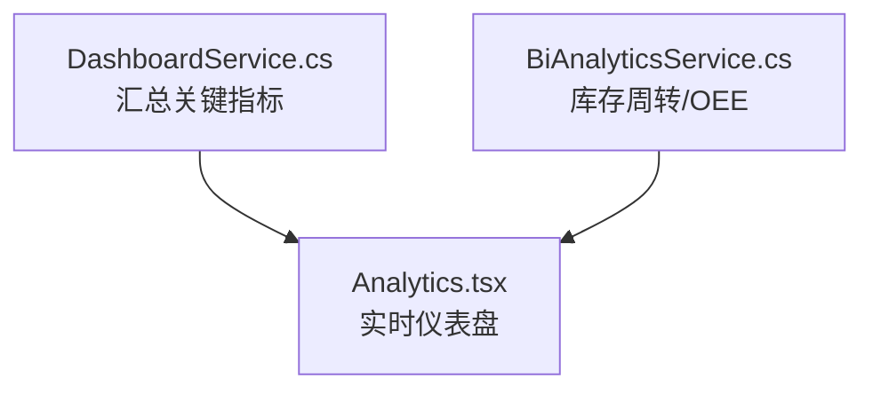

图表来源
- [DashboardService.cs](file://src/Services/Reporting/ErpSystem.Reporting/Application/DashboardService.cs#L22-L37)
- [BiAnalyticsService.cs](file://src/Services/Analytics/ErpSystem.Analytics/Infrastructure/BiAnalyticsService.cs#L72-L87)
- [Analytics.tsx](file://src/Web/ErpSystem.Web/src/pages/Analytics.tsx#L107-L122)

章节来源
- [DashboardService.cs](file://src/Services/Reporting/ErpSystem.Reporting/Application/DashboardService.cs#L20-L93)
- [BiAnalyticsService.cs](file://src/Services/Analytics/ErpSystem.Analytics/Infrastructure/BiAnalyticsService.cs#L36-L94)
- [Analytics.tsx](file://src/Web/ErpSystem.Web/src/pages/Analytics.tsx#L1-L49)

### 成本核算与调度优化（集成方案）
- 成本核算：基于订单级的投入（投料）与产出（报工）数据，为财务提供结构化成本归集依据。
- 调度优化：当前PRD暂不实现APS，建议后续引入产能分析与排程引擎，结合BOM与工艺路线进行智能排产。

章节来源
- [PRD-07-Production-Service.md](file://docs/PRD-07-Production-Service.md#L411-L455)

## 依赖关系分析
- 服务内聚：生产服务围绕生产订单聚合，职责清晰，事件驱动解耦。
- 服务耦合：与库存、主数据、质量、分析、报表服务通过事件或HTTP接口耦合，遵循CQRS与事件溯源原则。
- 前后端耦合：前端通过REST接口访问后端，实时分析通过分析服务的数据进行可视化。

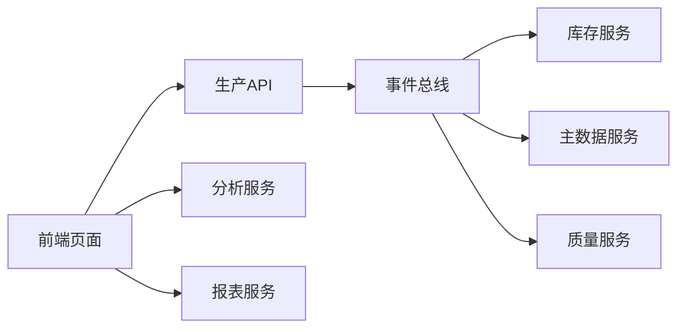

图表来源
- [ProductionOrdersController.cs](file://src/Services/Production/ErpSystem.Production/API/ProductionOrdersController.cs#L1-L46)
- [Program.cs](file://src/Services/Production/ErpSystem.Production/Program.cs#L24-L46)

章节来源
- [Program.cs](file://src/Services/Production/ErpSystem.Production/Program.cs#L1-L72)
- [ProductionOrdersController.cs](file://src/Services/Production/ErpSystem.Production/API/ProductionOrdersController.cs#L1-L46)

## 性能考量
- 查询性能：列表查询支持分页与过滤，建议在读模型表上建立索引（物料、状态、创建时间）。
- 事件处理：事件存储采用JSONB，建议定期清理旧事件流，保持查询性能。
- 实时分析：前端图表数据建议缓存与节流，避免频繁请求导致抖动。

## 故障排查指南
- 订单状态异常：检查领域事件是否正确发布与投影，确认读模型状态与聚合状态一致。
- 投料/报工失败：核对订单状态是否允许操作，检查事件发布是否成功，确认下游库存服务是否收到集成事件。
- 查询无数据：确认读模型投影是否完成，数据库连接字符串与迁移是否正确。

章节来源
- [Projections.cs](file://src/Services/Production/ErpSystem.Production/Infrastructure/Projections.cs#L13-L105)
- [ProductionOrderCommands.cs](file://src/Services/Production/ErpSystem.Production/Application/ProductionOrderCommands.cs#L57-L96)

## 结论
生产管理页面以事件驱动与CQRS为核心，实现了从生产订单到报工入库的闭环管理，并通过读模型与前端可视化提供实时监控与分析能力。后续可在BOM与工艺路线、APS排程、质量闭环与成本核算方面进一步深化，以实现更智能的生产调度与持续改进。

## 附录
- API参考（建议）：生产订单CRUD、释放、取消、关闭；投料与报工；在制品视图查询。
- 非功能性需求：性能、安全与审计要求已在PRD中明确，建议在实现过程中配套完善。

章节来源
- [PRD-07-Production-Service.md](file://docs/PRD-07-Production-Service.md#L338-L408)