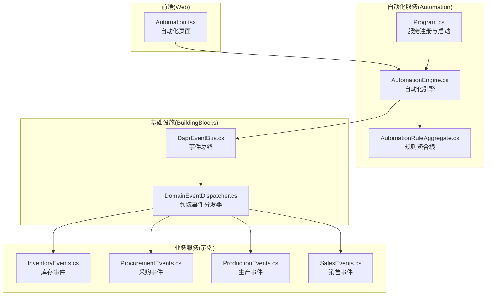
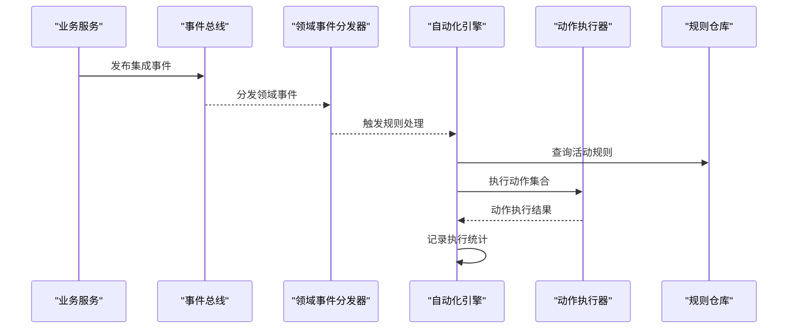
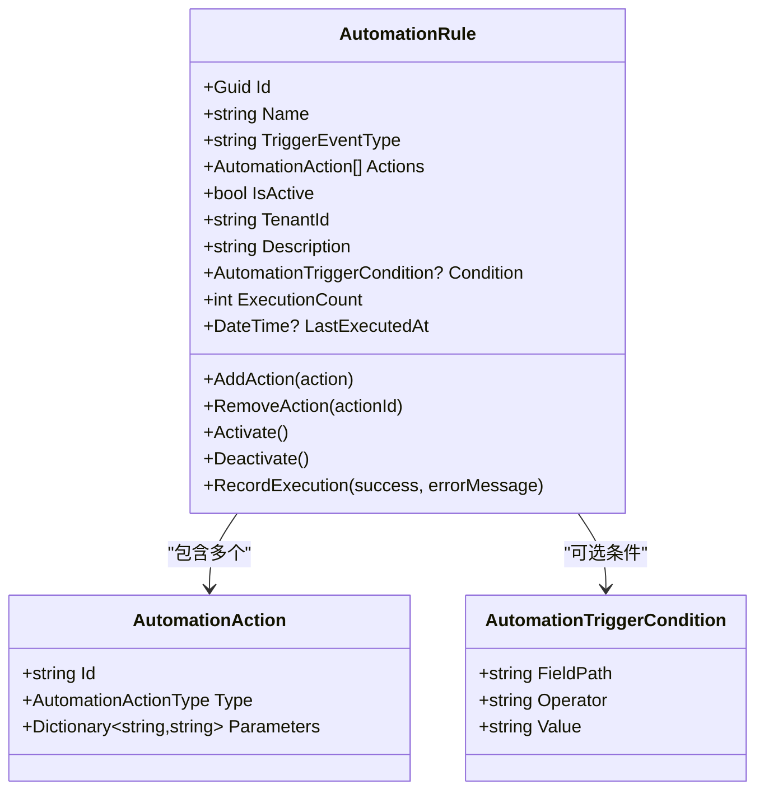
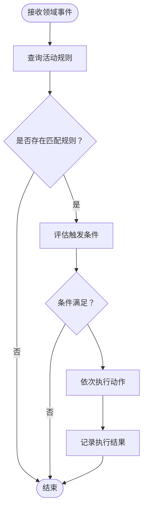
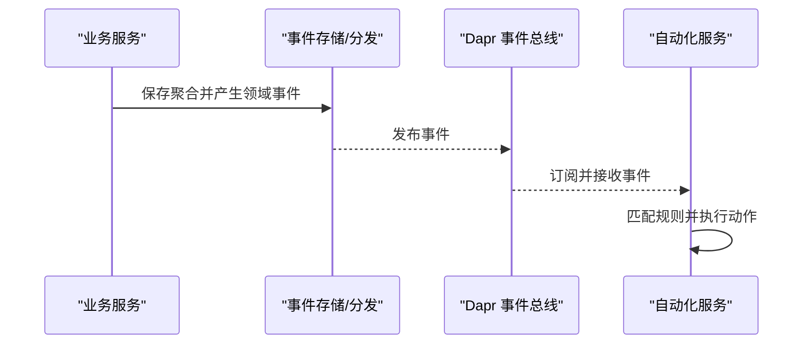
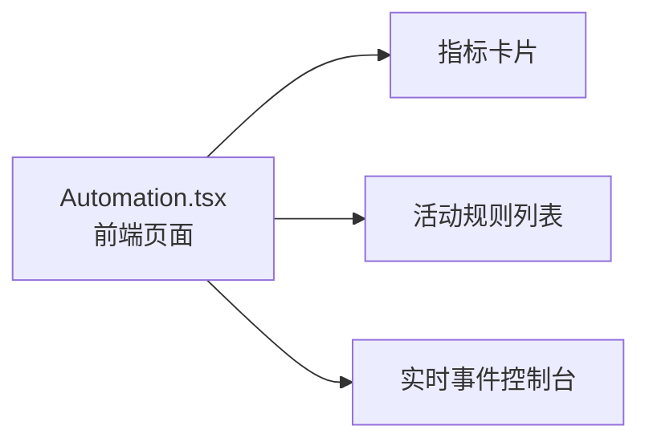
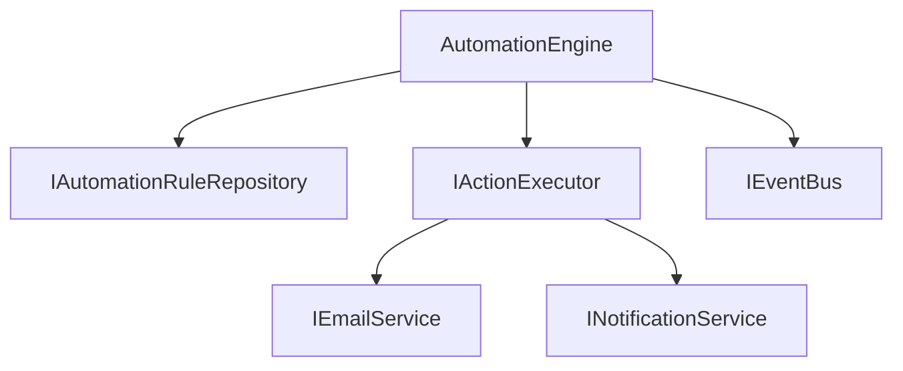

# 自动化页面

<cite>
**本文引用的文件**
- [Automation.tsx](file://src/Web/ErpSystem.Web/src/pages/Automation.tsx)
- [AutomationEngine.cs](file://src/Services/Automation/ErpSystem.Automation/Application/AutomationEngine.cs)
- [AutomationRuleAggregate.cs](file://src/Services/Automation/ErpSystem.Automation/Domain/AutomationRuleAggregate.cs)
- [Program.cs](file://src/Services/Automation/ErpSystem.Automation/Program.cs)
- [DomainEventDispatcher.cs](file://src/BuildingBlocks/ErpSystem.BuildingBlocks/Domain/DomainEventDispatcher.cs)
- [DaprEventBus.cs](file://src/BuildingBlocks/ErpSystem.BuildingBlocks/EventBus/DaprEventBus.cs)
- [InventoryEvents.cs](file://src/Services/Inventory/ErpSystem.Inventory/Domain/InventoryEvents.cs)
- [ProcurementEvents.cs](file://src/Services/Procurement/ErpSystem.Procurement/Domain/ProcurementEvents.cs)
- [ProductionEvents.cs](file://src/Services/Production/ErpSystem.Production/Domain/ProductionEvents.cs)
- [SalesEvents.cs](file://src/Services/Sales/ErpSystem.Sales/Domain/SalesEvents.cs)
</cite>

## 目录
1. [引言](#引言)
2. [项目结构](#项目结构)
3. [核心组件](#核心组件)
4. [架构总览](#架构总览)
5. [详细组件分析](#详细组件分析)
6. [依赖关系分析](#依赖关系分析)
7. [性能考虑](#性能考虑)
8. [故障排查指南](#故障排查指南)
9. [结论](#结论)
10. [附录](#附录)

## 引言
本文件面向“自动化页面”的实现与使用，系统性阐述自动化工作流设计器、规则引擎、任务调度与自动化监控等能力。文档覆盖以下要点：
- 可视化配置：节点设计、条件分支、异常处理
- 规则编写语法、执行引擎与性能监控机制
- 效果分析、ROI评估与优化建议
- 最佳实践、风险控制与治理框架

## 项目结构
自动化页面由前端页面与后端服务共同组成，前端负责展示与交互，后端提供规则定义、执行与监控能力。

**图表来源**
- [Automation.tsx](file://src/Web/ErpSystem.Web/src/pages/Automation.tsx#L1-L129)
- [AutomationEngine.cs](file://src/Services/Automation/ErpSystem.Automation/Application/AutomationEngine.cs#L1-L220)
- [AutomationRuleAggregate.cs](file://src/Services/Automation/ErpSystem.Automation/Domain/AutomationRuleAggregate.cs#L1-L196)
- [Program.cs](file://src/Services/Automation/ErpSystem.Automation/Program.cs#L36-L115)
- [DaprEventBus.cs](file://src/BuildingBlocks/ErpSystem.BuildingBlocks/EventBus/DaprEventBus.cs#L1-L31)
- [DomainEventDispatcher.cs](file://src/BuildingBlocks/ErpSystem.BuildingBlocks/Domain/DomainEventDispatcher.cs#L1-L72)
- [InventoryEvents.cs](file://src/Services/Inventory/ErpSystem.Inventory/Domain/InventoryEvents.cs#L1-L13)
- [ProcurementEvents.cs](file://src/Services/Procurement/ErpSystem.Procurement/Domain/ProcurementEvents.cs#L1-L21)
- [ProductionEvents.cs](file://src/Services/Production/ErpSystem.Production/Domain/ProductionEvents.cs#L1-L24)
- [SalesEvents.cs](file://src/Services/Sales/ErpSystem.Sales/Domain/SalesEvents.cs#L1-L32)

**章节来源**
- [Automation.tsx](file://src/Web/ErpSystem.Web/src/pages/Automation.tsx#L1-L129)
- [Program.cs](file://src/Services/Automation/ErpSystem.Automation/Program.cs#L36-L115)

## 核心组件
- 自动化引擎（AutomationEngine）：监听领域事件，匹配规则，执行动作，记录执行结果。
- 规则聚合根（AutomationRule）：定义规则名称、触发事件类型、条件、动作列表、激活状态与执行统计。
- 动作执行器（ActionExecutor）：根据动作类型执行具体操作（邮件、Webhook、通知、创建记录等）。
- 事件总线（DaprEventBus）：基于 Dapr 的发布订阅，将领域事件广播到订阅者。
- 领域事件分发器（DomainEventDispatcher）：在保存变更后收集并发布聚合产生的领域事件。

**章节来源**
- [AutomationEngine.cs](file://src/Services/Automation/ErpSystem.Automation/Application/AutomationEngine.cs#L10-L120)
- [AutomationRuleAggregate.cs](file://src/Services/Automation/ErpSystem.Automation/Domain/AutomationRuleAggregate.cs#L8-L111)
- [DaprEventBus.cs](file://src/BuildingBlocks/ErpSystem.BuildingBlocks/EventBus/DaprEventBus.cs#L11-L21)
- [DomainEventDispatcher.cs](file://src/BuildingBlocks/ErpSystem.BuildingBlocks/Domain/DomainEventDispatcher.cs#L17-L43)

## 架构总览
自动化页面采用事件驱动架构：业务服务产生集成事件，经领域事件分发器发布，自动化引擎捕获并按规则执行动作，同时记录执行日志与指标。

**图表来源**
- [DaprEventBus.cs](file://src/BuildingBlocks/ErpSystem.BuildingBlocks/EventBus/DaprEventBus.cs#L15-L20)
- [DomainEventDispatcher.cs](file://src/BuildingBlocks/ErpSystem.BuildingBlocks/Domain/DomainEventDispatcher.cs#L37-L42)
- [AutomationEngine.cs](file://src/Services/Automation/ErpSystem.Automation/Application/AutomationEngine.cs#L19-L92)
- [AutomationRuleAggregate.cs](file://src/Services/Automation/ErpSystem.Automation/Domain/AutomationRuleAggregate.cs#L72-L78)

## 详细组件分析

### 工作流设计器与可视化配置
- 节点设计：规则聚合根包含规则名称、触发事件类型、条件与动作列表，支持添加/移除动作，激活/停用规则。
- 条件分支：规则可配置触发条件（字段路径、比较运算符、阈值），引擎在执行前进行条件评估。
- 异常处理：规则执行失败会记录错误信息并持久化，保证可观测性与可恢复性。

**图表来源**
- [AutomationRuleAggregate.cs](file://src/Services/Automation/ErpSystem.Automation/Domain/AutomationRuleAggregate.cs#L8-L137)

**章节来源**
- [AutomationRuleAggregate.cs](file://src/Services/Automation/ErpSystem.Automation/Domain/AutomationRuleAggregate.cs#L20-L78)

### 规则引擎与执行逻辑
- 事件匹配：引擎根据领域事件类型查询活动规则，逐条执行。
- 条件评估：通过反射读取事件属性值，支持等于、包含、大于、小于等运算。
- 动作执行：按顺序执行规则中的动作，任一动作失败不影响其他动作继续执行（当前实现）。
- 结果记录：成功或失败均更新执行次数与最近执行时间。

**图表来源**
- [AutomationEngine.cs](file://src/Services/Automation/ErpSystem.Automation/Application/AutomationEngine.cs#L19-L92)
- [AutomationEngine.cs](file://src/Services/Automation/ErpSystem.Automation/Application/AutomationEngine.cs#L94-L119)

**章节来源**
- [AutomationEngine.cs](file://src/Services/Automation/ErpSystem.Automation/Application/AutomationEngine.cs#L19-L120)

### 任务调度与事件驱动
- 事件驱动：业务服务通过领域事件分发器发布事件，自动化引擎异步响应。
- 事件总线：使用 Dapr Pub/Sub 进行跨服务解耦，Topic 名称约定为事件类型名。
- 服务启动：自动化服务在启动时确保数据库存在并注册所需依赖。

**图表来源**
- [DomainEventDispatcher.cs](file://src/BuildingBlocks/ErpSystem.BuildingBlocks/Domain/DomainEventDispatcher.cs#L19-L42)
- [DaprEventBus.cs](file://src/BuildingBlocks/ErpSystem.BuildingBlocks/EventBus/DaprEventBus.cs#L15-L20)
- [Program.cs](file://src/Services/Automation/ErpSystem.Automation/Program.cs#L62-L69)

**章节来源**
- [Program.cs](file://src/Services/Automation/ErpSystem.Automation/Program.cs#L36-L69)
- [DaprEventBus.cs](file://src/BuildingBlocks/ErpSystem.BuildingBlocks/EventBus/DaprEventBus.cs#L11-L21)
- [DomainEventDispatcher.cs](file://src/BuildingBlocks/ErpSystem.BuildingBlocks/Domain/DomainEventDispatcher.cs#L17-L43)

### 自动化监控与前端展示
- 前端页面提供“自动化中心”概览，包含今日执行量、活动规则数、平均响应时间等关键指标。
- 实时事件控制台模拟展示事件接收、规则匹配与动作执行状态。
- 支持规则启停切换与配置入口，便于运维管理。

**图表来源**
- [Automation.tsx](file://src/Web/ErpSystem.Web/src/pages/Automation.tsx#L18-L121)

**章节来源**
- [Automation.tsx](file://src/Web/ErpSystem.Web/src/pages/Automation.tsx#L1-L129)

## 依赖关系分析
- 组件内聚：规则聚合根集中管理规则状态与事件历史；引擎专注匹配与执行；动作执行器封装外部调用。
- 组件耦合：引擎依赖规则仓库接口与动作执行器接口，便于替换与扩展。
- 外部依赖：事件总线依赖 Dapr 客户端；动作执行器依赖邮件、通知等外部服务接口。

**图表来源**
- [AutomationEngine.cs](file://src/Services/Automation/ErpSystem.Automation/Application/AutomationEngine.cs#L10-L14)
- [AutomationEngine.cs](file://src/Services/Automation/ErpSystem.Automation/Application/AutomationEngine.cs#L125-L135)
- [Program.cs](file://src/Services/Automation/ErpSystem.Automation/Program.cs#L40-L48)

**章节来源**
- [AutomationEngine.cs](file://src/Services/Automation/ErpSystem.Automation/Application/AutomationEngine.cs#L10-L135)
- [Program.cs](file://src/Services/Automation/ErpSystem.Automation/Program.cs#L40-L48)

## 性能考虑
- 事件处理延迟：通过 Dapr 事件总线实现异步解耦，避免阻塞主业务流程。
- 条件评估：当前实现基于反射与简单字符串比较，复杂表达式可引入表达式引擎提升灵活性与性能。
- 并发与幂等：动作执行需保证幂等性，避免重复触发造成副作用。
- 指标采集：建议在动作执行器中埋点关键指标（耗时、成功率、重试次数），用于性能分析与告警。

## 故障排查指南
- 规则未执行
  - 检查规则是否处于激活状态
  - 确认触发事件类型与规则匹配
  - 查看执行记录与错误信息
- 动作失败
  - 核对动作参数（如邮件地址、Webhook URL）
  - 检查外部服务可用性与鉴权
- 事件未到达
  - 确认事件总线配置与订阅
  - 检查领域事件分发拦截器是否正常工作

**章节来源**
- [AutomationEngine.cs](file://src/Services/Automation/ErpSystem.Automation/Application/AutomationEngine.cs#L40-L53)
- [AutomationRuleAggregate.cs](file://src/Services/Automation/ErpSystem.Automation/Domain/AutomationRuleAggregate.cs#L72-L78)

## 结论
自动化页面以事件驱动为核心，结合规则引擎与动作执行器，实现了从可视化配置到自动执行的闭环。通过前端监控面板与完善的执行记录，能够有效支撑自动化效果分析与持续优化。建议后续增强条件表达式能力、完善动作幂等与重试策略，并建立统一的自动化治理规范。

## 附录

### 规则编写语法与示例
- 触发事件类型：规则绑定到特定领域事件类型（如库存低于阈值、采购到货等）。
- 触发条件：指定事件对象的某个字段路径、比较运算符与阈值。
- 动作类型：支持发送邮件、调用 Webhook、推送通知、创建/更新记录等。
- 参数格式：动作参数以键值对形式传递，不同动作需要的参数不同。

**章节来源**
- [AutomationRuleAggregate.cs](file://src/Services/Automation/ErpSystem.Automation/Domain/AutomationRuleAggregate.cs#L116-L137)
- [AutomationEngine.cs](file://src/Services/Automation/ErpSystem.Automation/Application/AutomationEngine.cs#L137-L203)

### 业务事件参考
- 库存事件：库存水平变化事件
- 采购事件：到货确认事件
- 生产事件：物料发放、生产完成事件
- 销售事件：订单确认、发货创建事件

**章节来源**
- [InventoryEvents.cs](file://src/Services/Inventory/ErpSystem.Inventory/Domain/InventoryEvents.cs#L5-L11)
- [ProcurementEvents.cs](file://src/Services/Procurement/ErpSystem.Procurement/Domain/ProcurementEvents.cs#L7-L19)
- [ProductionEvents.cs](file://src/Services/Production/ErpSystem.Production/Domain/ProductionEvents.cs#L7-L22)
- [SalesEvents.cs](file://src/Services/Sales/ErpSystem.Sales/Domain/SalesEvents.cs#L7-L30)