# 薪资页面

<cite>
**本文引用的文件**
- [Program.cs](file://src/Services/Payroll/ErpSystem.Payroll/Program.cs)
- [PayrollControllers.cs](file://src/Services/Payroll/ErpSystem.Payroll/API/PayrollControllers.cs)
- [PayrollAggregate.cs](file://src/Services/Payroll/ErpSystem.Payroll/Domain/PayrollAggregate.cs)
- [Persistence.cs](file://src/Services/Payroll/ErpSystem.Payroll/Infrastructure/Persistence.cs)
- [Projections.cs](file://src/Services/Payroll/ErpSystem.Payroll/Infrastructure/Projections.cs)
- [Payroll.tsx](file://src/Web/ErpSystem.Web/src/pages/Payroll.tsx)
- [ErpSystem.Payroll.csproj](file://src/Services/Payroll/ErpSystem.Payroll/ErpSystem.Payroll.csproj)
- [appsettings.json](file://src/Services/Payroll/ErpSystem.Payroll/appsettings.json)
</cite>

## 目录
1. [简介](#简介)
2. [项目结构](#项目结构)
3. [核心组件](#核心组件)
4. [架构总览](#架构总览)
5. [详细组件分析](#详细组件分析)
6. [依赖关系分析](#依赖关系分析)
7. [性能考虑](#性能考虑)
8. [故障排除指南](#故障排除指南)
9. [结论](#结论)
10. [附录](#附录)

## 简介
本文件面向薪资页面（Payroll）的实现与使用，系统性阐述薪资计算、工资条管理、社保公积金与税务处理、审批与发放流程、统计分析与合规性检查等关键能力。基于事件驱动架构与读写分离模式，薪资服务通过领域聚合与投影机制，实现从薪资结构到薪资运行（run）再到工资条（payslip）的完整生命周期管理，并提供前端可视化界面以支撑日常运营与管理。

## 项目结构
薪资服务采用微服务分层组织，包含以下关键部分：
- API 层：提供薪资结构、薪资运行、工资条的 REST 接口
- 领域层：定义薪资结构、薪资运行、工资条实体及状态机
- 基础设施层：事件存储与读库、投影处理器
- Web 前端：薪资页面的可视化展示与交互

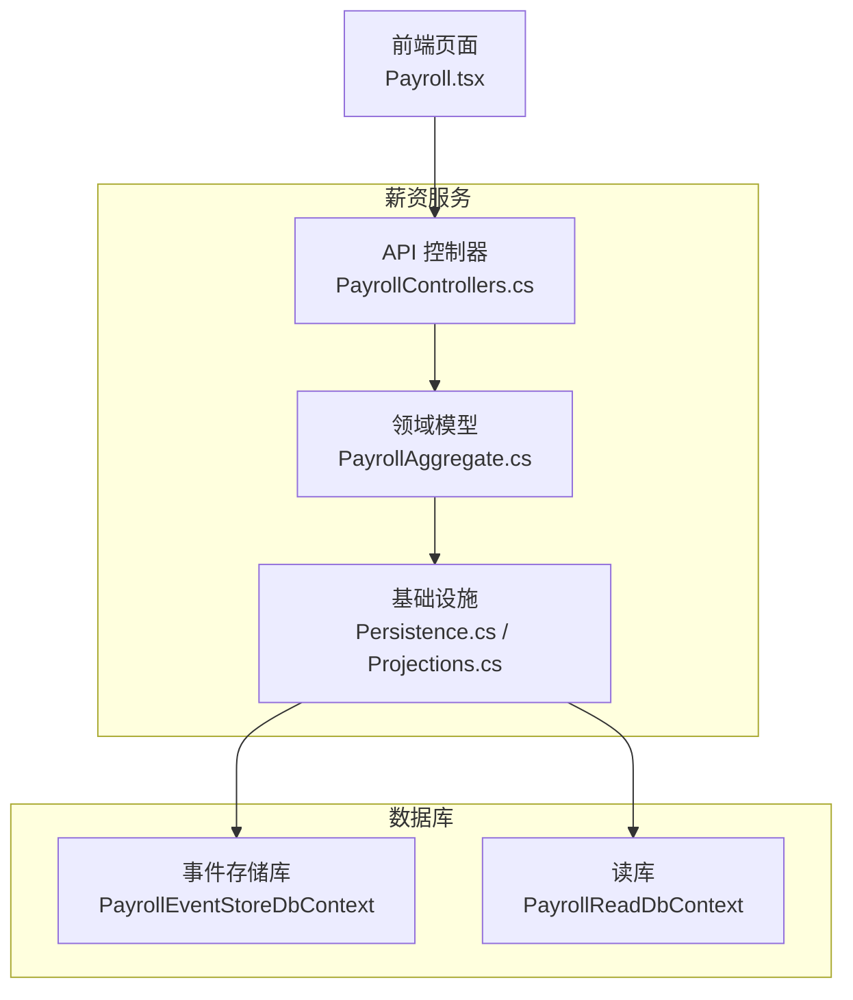

图表来源
- [PayrollControllers.cs](file://src/Services/Payroll/ErpSystem.Payroll/API/PayrollControllers.cs#L1-L278)
- [PayrollAggregate.cs](file://src/Services/Payroll/ErpSystem.Payroll/Domain/PayrollAggregate.cs#L1-L429)
- [Persistence.cs](file://src/Services/Payroll/ErpSystem.Payroll/Infrastructure/Persistence.cs#L1-L121)
- [Projections.cs](file://src/Services/Payroll/ErpSystem.Payroll/Infrastructure/Projections.cs#L1-L171)
- [Payroll.tsx](file://src/Web/ErpSystem.Web/src/pages/Payroll.tsx#L1-L289)

章节来源
- [Program.cs](file://src/Services/Payroll/ErpSystem.Payroll/Program.cs#L1-L45)
- [ErpSystem.Payroll.csproj](file://src/Services/Payroll/ErpSystem.Payroll/ErpSystem.Payroll.csproj#L1-L22)
- [appsettings.json](file://src/Services/Payroll/ErpSystem.Payroll/appsettings.json#L1-L12)

## 核心组件
- 薪资结构（SalaryStructure）：定义基础工资、收入组成与扣款项，支持百分比与固定金额两种计算方式，并可标记是否计税。
- 薪资运行（PayrollRun）：按年月组织的薪资批次，维护总应发、扣款与实发金额，跟踪状态流转（草稿、处理中、待审批、已批准、已发放、取消）。
- 工资条（Payslip）：单个员工的薪资明细，包含行项目（收入/扣款），并记录发放状态与支付信息。
- 投影处理器：将领域事件投影到读库，生成薪资结构、薪资运行与工资条的只读视图，供查询与统计使用。
- API 控制器：提供薪资结构 CRUD、组件与扣款添加；薪资运行的创建、启动处理、提交审批、批准、取消；工资条的批量添加与查询；以及按年统计接口。

章节来源
- [PayrollAggregate.cs](file://src/Services/Payroll/ErpSystem.Payroll/Domain/PayrollAggregate.cs#L185-L429)
- [Projections.cs](file://src/Services/Payroll/ErpSystem.Payroll/Infrastructure/Projections.cs#L1-L171)
- [PayrollControllers.cs](file://src/Services/Payroll/ErpSystem.Payroll/API/PayrollControllers.cs#L1-L278)

## 架构总览
薪资服务采用事件溯源与CQRS模式：
- 写模型（事件存储）：聚合产生领域事件，持久化到事件流表
- 读模型（投影）：事件处理器将事件转换为读库实体，供查询与报表使用
- API 层：控制器直接操作事件存储与读库，返回聚合根快照或读模型结果

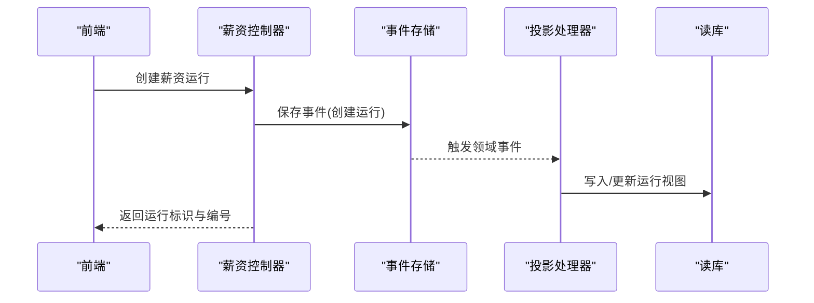

图表来源
- [PayrollControllers.cs](file://src/Services/Payroll/ErpSystem.Payroll/API/PayrollControllers.cs#L108-L124)
- [Projections.cs](file://src/Services/Payroll/ErpSystem.Payroll/Infrastructure/Projections.cs#L76-L91)

## 详细组件分析

### 薪资结构（SalaryStructure）
- 数据结构与计算
  - 基础工资：固定数值
  - 收入组成：支持固定金额与百分比两种类型，百分比基于基础工资计算
  - 扣款项：支持固定金额与百分比，用于生成薪资运行时的扣款估算
  - 总收入：基础工资 + 各组成项（含百分比换算）之和
- 关键方法
  - 添加收入组成：记录事件并更新读库中的组件列表与总收入
  - 添加扣款项：记录事件并更新读库中的扣款列表
- 读模型字段
  - 组件与扣款以 JSONB 存储，便于动态扩展
  - 提供组件数量、扣款数量与计算后的总收入

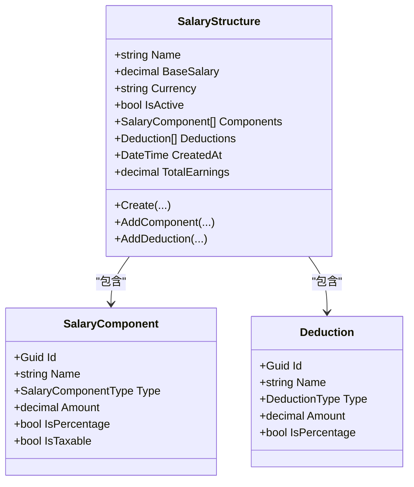

图表来源
- [PayrollAggregate.cs](file://src/Services/Payroll/ErpSystem.Payroll/Domain/PayrollAggregate.cs#L185-L249)
- [PayrollAggregate.cs](file://src/Services/Payroll/ErpSystem.Payroll/Domain/PayrollAggregate.cs#L158-L179)

章节来源
- [PayrollAggregate.cs](file://src/Services/Payroll/ErpSystem.Payroll/Domain/PayrollAggregate.cs#L185-L249)
- [Projections.cs](file://src/Services/Payroll/ErpSystem.Payroll/Infrastructure/Projections.cs#L14-L63)
- [Persistence.cs](file://src/Services/Payroll/ErpSystem.Payroll/Infrastructure/Persistence.cs#L66-L80)

### 薪资运行（PayrollRun）
- 状态机
  - 草稿 → 处理中 → 待审批 → 已批准 → 已发放
  - 可在特定状态下取消
- 计算指标
  - 总应发、总扣款、总实发、员工人数、已发放人数
- 关键操作
  - 添加工资条：校验运行状态，计算实发 = 应发 − 扣款，生成工资条事件
  - 启动处理：仅草稿态允许
  - 提交审批：仅处理态且至少有一张工资条
  - 审批：更新运行状态为已批准，并将所有工资条置为“已终审”
  - 发放标记：将指定工资条置为“已发放”，当全部工资条发放后，运行状态转为“已发放”
  - 取消：除已发放外均可取消

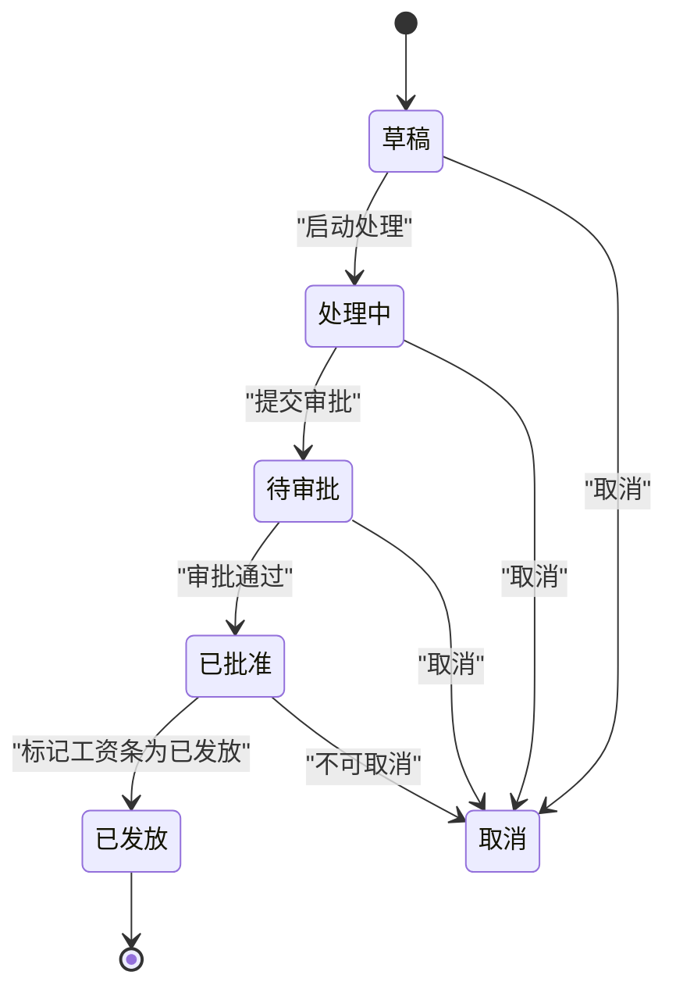

图表来源
- [PayrollAggregate.cs](file://src/Services/Payroll/ErpSystem.Payroll/Domain/PayrollAggregate.cs#L255-L406)

章节来源
- [PayrollAggregate.cs](file://src/Services/Payroll/ErpSystem.Payroll/Domain/PayrollAggregate.cs#L255-L406)
- [Projections.cs](file://src/Services/Payroll/ErpSystem.Payroll/Infrastructure/Projections.cs#L93-L167)

### 工资条（Payslip）
- 字段
  - 员工标识与姓名、年月、应发、扣款、实发、状态、支付信息与行项目
- 行项目（PayslipLine）
  - 描述、金额、是否为扣款
- 状态
  - 草稿、已终审、已发放、更正

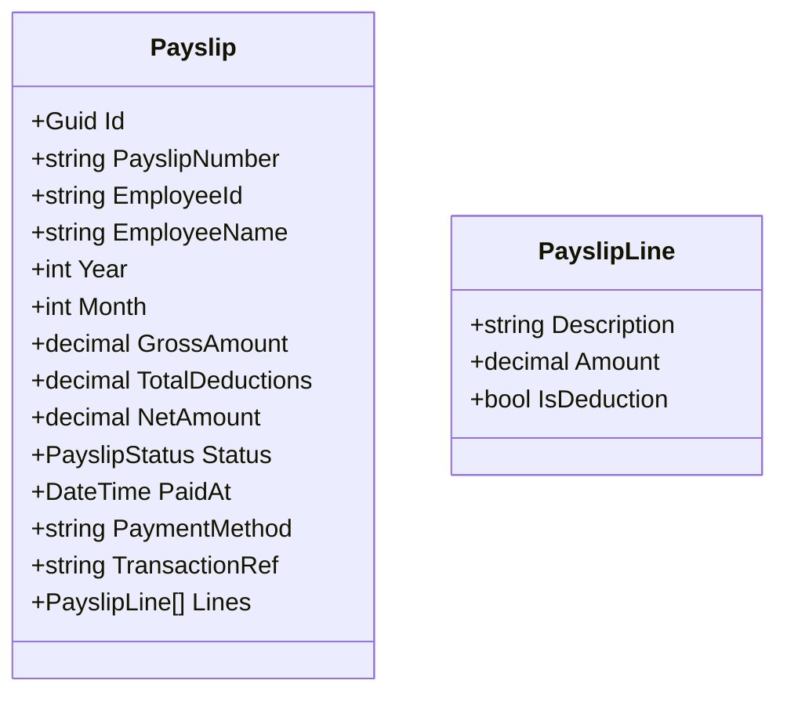

图表来源
- [PayrollAggregate.cs](file://src/Services/Payroll/ErpSystem.Payroll/Domain/PayrollAggregate.cs#L412-L429)

章节来源
- [PayrollAggregate.cs](file://src/Services/Payroll/ErpSystem.Payroll/Domain/PayrollAggregate.cs#L412-L429)
- [Persistence.cs](file://src/Services/Payroll/ErpSystem.Payroll/Infrastructure/Persistence.cs#L101-L118)

### API 流程示例：创建并处理薪资运行
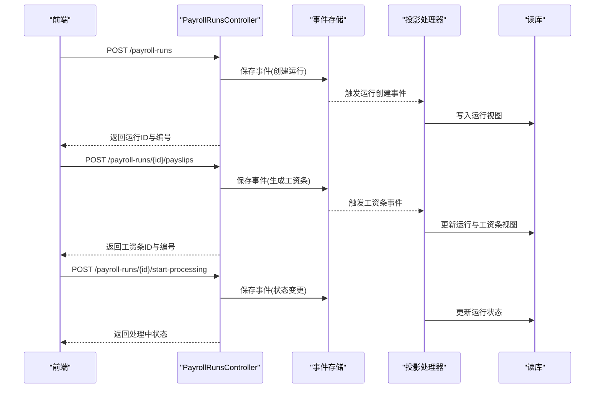

图表来源
- [PayrollControllers.cs](file://src/Services/Payroll/ErpSystem.Payroll/API/PayrollControllers.cs#L108-L156)
- [Projections.cs](file://src/Services/Payroll/ErpSystem.Payroll/Infrastructure/Projections.cs#L103-L133)

### 薪资计算算法与数据流
- 基本工资：来自薪资结构的基础工资
- 绩效奖金/加班费/提成等：可为固定金额或百分比（基于基础工资）
- 扣款项：社保、公积金、医保、失业保险、个税、贷款等，可为固定金额或百分比
- 实发工资：应发合计 − 扣款合计
- 税务处理：薪资结构中可标注收入组成是否计税，用于合规与报表口径一致

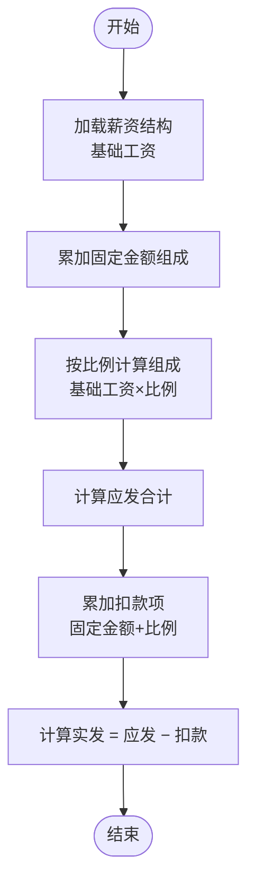

图表来源
- [PayrollAggregate.cs](file://src/Services/Payroll/ErpSystem.Payroll/Domain/PayrollAggregate.cs#L196-L201)
- [PayrollAggregate.cs](file://src/Services/Payroll/ErpSystem.Payroll/Domain/PayrollAggregate.cs#L298-L301)

章节来源
- [PayrollAggregate.cs](file://src/Services/Payroll/ErpSystem.Payroll/Domain/PayrollAggregate.cs#L196-L201)
- [PayrollAggregate.cs](file://src/Services/Payroll/ErpSystem.Payroll/Domain/PayrollAggregate.cs#L298-L301)

### 审批流程与发放管理
- 审批流程
  - 运行状态：草稿 → 处理中 → 待审批 → 已批准
  - 提交审批前必须至少包含一张工资条
  - 审批通过后，运行状态进入“已批准”，所有工资条状态变为“已终审”
- 发放管理
  - 在“已批准”或“已发放”状态下，可将工资条标记为“已发放”，并记录支付方式与交易参考
  - 当所有工资条均标记为“已发放”，运行状态自动转为“已发放”

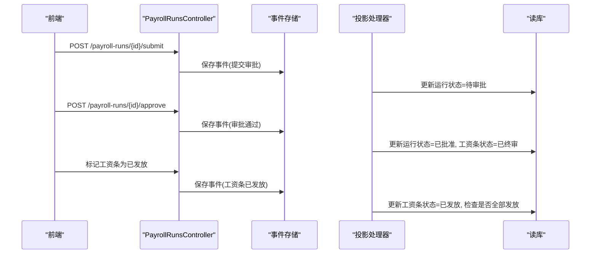

图表来源
- [PayrollControllers.cs](file://src/Services/Payroll/ErpSystem.Payroll/API/PayrollControllers.cs#L158-L189)
- [Projections.cs](file://src/Services/Payroll/ErpSystem.Payroll/Infrastructure/Projections.cs#L135-L167)

章节来源
- [PayrollControllers.cs](file://src/Services/Payroll/ErpSystem.Payroll/API/PayrollControllers.cs#L158-L189)
- [PayrollAggregate.cs](file://src/Services/Payroll/ErpSystem.Payroll/Domain/PayrollAggregate.cs#L331-L403)

### 薪资统计分析与合规检查
- 年度统计
  - 按年查询薪资运行，统计运行次数、已发放运行数、总实发金额、按月汇总实发与员工数
- 合规性检查
  - 通过薪资结构中的“是否计税”标记，确保税务口径一致
  - 通过社保、公积金、医保、失业保险等扣款类型，满足法定扣款要求

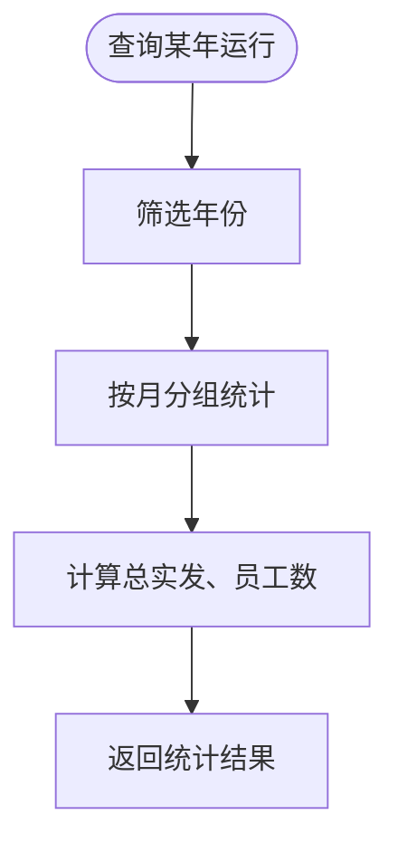

图表来源
- [PayrollControllers.cs](file://src/Services/Payroll/ErpSystem.Payroll/API/PayrollControllers.cs#L191-L209)

章节来源
- [PayrollControllers.cs](file://src/Services/Payroll/ErpSystem.Payroll/API/PayrollControllers.cs#L191-L209)

### 前端薪资页面与数据展示
- 页面功能
  - 薪资运行卡片：显示运行号、状态、员工数、应付/扣款/实发金额
  - 工资条表格：展示工资条号、员工名、期间、应发、扣款、实发与状态
  - 薪资结构卡片：展示结构名称、基础工资、总收入、组成与扣款数量
- 数据来源
  - 通过 API 获取运行与工资条列表，进行聚合统计与展示

图表来源
- [Payroll.tsx](file://src/Web/ErpSystem.Web/src/pages/Payroll.tsx#L125-L289)
- [PayrollControllers.cs](file://src/Services/Payroll/ErpSystem.Payroll/API/PayrollControllers.cs#L82-L259)

章节来源
- [Payroll.tsx](file://src/Web/ErpSystem.Web/src/pages/Payroll.tsx#L1-L289)

## 依赖关系分析
- 事件存储与读库
  - 事件存储库：保存领域事件，支持事件回放与重放
  - 读库：提供高性能查询与统计，投影处理器负责一致性更新
- 外部依赖
  - PostgreSQL（Npgsql）作为事件存储与读库后端
  - Swagger 文档用于 API 自描述
  - Dapr 事件总线（注册于 Program.cs）

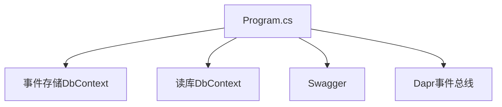

图表来源
- [Program.cs](file://src/Services/Payroll/ErpSystem.Payroll/Program.cs#L10-L33)
- [Persistence.cs](file://src/Services/Payroll/ErpSystem.Payroll/Infrastructure/Persistence.cs#L8-L20)

章节来源
- [Program.cs](file://src/Services/Payroll/ErpSystem.Payroll/Program.cs#L1-L45)
- [appsettings.json](file://src/Services/Payroll/ErpSystem.Payroll/appsettings.json#L9-L11)

## 性能考虑
- 事件存储
  - 使用 jsonb 字段存储组件与扣款列表，减少关联查询，但需注意序列化/反序列化的开销
- 读库索引
  - 对运行号、年月、状态、员工ID等常用查询字段建立索引，提升查询性能
- 投影策略
  - 事件处理器异步更新读库，避免阻塞写路径；建议结合背压与批处理策略
- 前端缓存
  - 前端对列表数据进行本地缓存，减少重复请求

## 故障排除指南
- 无法创建薪资运行
  - 检查连接字符串与数据库连通性
  - 确认事件存储与读库迁移完成
- 无法查询薪资结构或运行
  - 检查投影处理器是否正常运行，确认事件已投递
- 状态流转异常
  - 确认当前运行状态与操作前置条件匹配（如提交审批前必须有工资条）
- 发放状态不一致
  - 检查工资条发放事件是否成功投递与读库更新

章节来源
- [appsettings.json](file://src/Services/Payroll/ErpSystem.Payroll/appsettings.json#L9-L11)
- [Projections.cs](file://src/Services/Payroll/ErpSystem.Payroll/Infrastructure/Projections.cs#L93-L167)
- [PayrollAggregate.cs](file://src/Services/Payroll/ErpSystem.Payroll/Domain/PayrollAggregate.cs#L304-L349)

## 结论
薪资服务通过事件驱动架构实现了薪资结构、薪资运行与工资条的全生命周期管理，具备清晰的状态机与强一致的读视图投影。API 层提供了完整的 CRUD 与业务流程接口，前端页面直观展示关键指标与明细。该设计在保证合规性与可审计性的前提下，兼顾了扩展性与性能，适合企业级薪资管理场景。

## 附录
- 数据模型概览（读库）
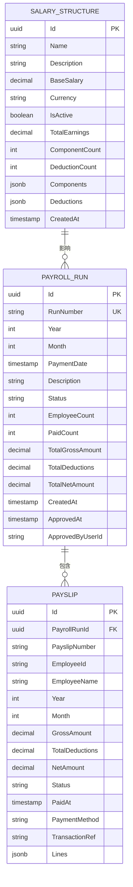

图表来源
- [Persistence.cs](file://src/Services/Payroll/ErpSystem.Payroll/Infrastructure/Persistence.cs#L66-L118)