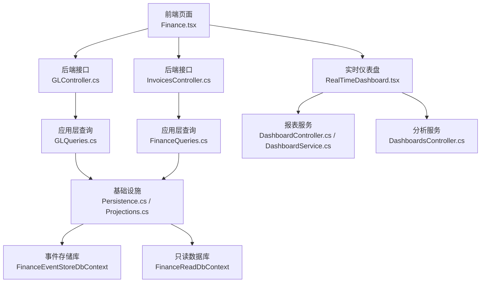
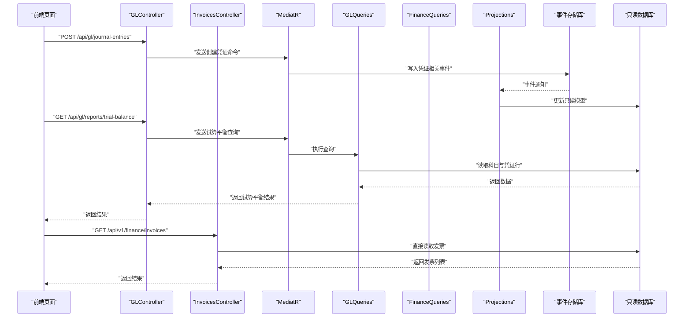
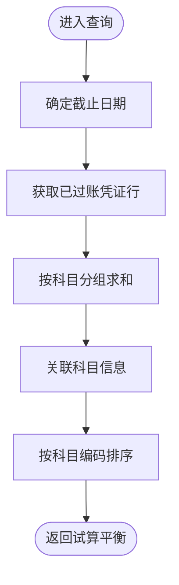
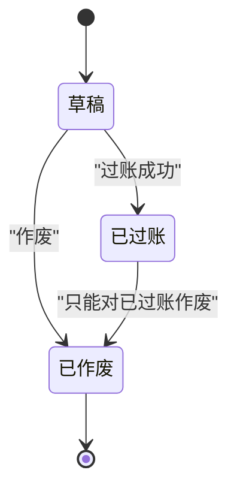
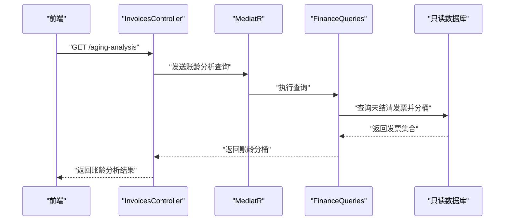
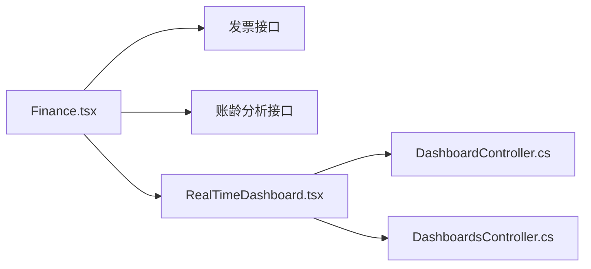
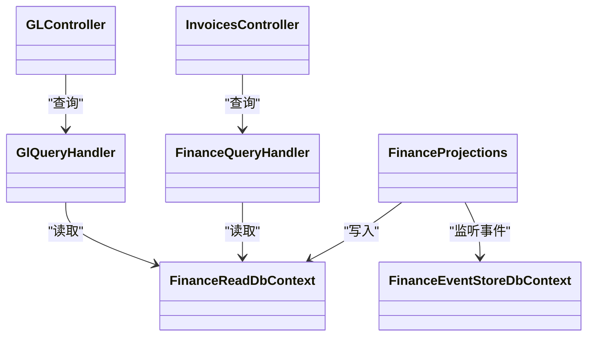

# 财务管理页面

<cite>
**本文档引用的文件**
- [Program.cs](file://src/Services/Finance/ErpSystem.Finance/Program.cs)
- [GLController.cs](file://src/Services/Finance/ErpSystem.Finance/API/GLController.cs)
- [InvoicesController.cs](file://src/Services/Finance/ErpSystem.Finance/API/InvoicesController.cs)
- [FinanceQueries.cs](file://src/Services/Finance/ErpSystem.Finance/Application/FinanceQueries.cs)
- [GLQueries.cs](file://src/Services/Finance/ErpSystem.Finance/Application/GLQueries.cs)
- [AccountAggregate.cs](file://src/Services/Finance/ErpSystem.Finance/Domain/AccountAggregate.cs)
- [JournalEntryAggregate.cs](file://src/Services/Finance/ErpSystem.Finance/Domain/JournalEntryAggregate.cs)
- [FinancialPeriodAggregate.cs](file://src/Services/Finance/ErpSystem.Finance/Domain/FinancialPeriodAggregate.cs)
- [InvoiceAggregate.cs](file://src/Services/Finance/ErpSystem.Finance/Domain/InvoiceAggregate.cs)
- [Persistence.cs](file://src/Services/Finance/ErpSystem.Finance/Infrastructure/Persistence.cs)
- [Projections.cs](file://src/Services/Finance/ErpSystem.Finance/Infrastructure/Projections.cs)
- [Finance.tsx](file://src/Web/ErpSystem.Web/src/pages/Finance.tsx)
- [RealTimeDashboard.tsx](file://src/Web/ErpSystem.Web/src/components/RealTimeDashboard.tsx)
- [DashboardController.cs](file://src/Services/Reporting/ErpSystem.Reporting/Controllers/DashboardController.cs)
- [DashboardService.cs](file://src/Services/Reporting/ErpSystem.Reporting/Application/DashboardService.cs)
- [DashboardsController.cs](file://src/Services/Analytics/ErpSystem.Analytics/API/DashboardsController.cs)
- [settingsApi.ts](file://src/Web/ErpSystem.Web/src/api/settingsApi.ts)
</cite>

## 目录
1. [简介](#简介)
2. [项目结构](#项目结构)
3. [核心组件](#核心组件)
4. [架构总览](#架构总览)
5. [详细组件分析](#详细组件分析)
6. [依赖关系分析](#依赖关系分析)
7. [性能考虑](#性能考虑)
8. [故障排除指南](#故障排除指南)
9. [结论](#结论)
10. [附录](#附录)

## 简介
本文件面向财务管理页面的实现与使用，系统性梳理了总账查询、科目余额、凭证录入、财务报表、会计期间管理、汇率与多币种支持、财务审批与预算控制、成本中心管理以及安全性与审计合规等关键能力。同时结合前端页面与后端服务的交互，给出可视化图表、数据透视与财务分析工具的集成方式，并提供可操作的优化建议与排障指引。

## 项目结构
财务管理页面由“前端页面 + 后端微服务 + 报表与分析服务”三层构成：
- 前端：React 页面负责展示发票、账龄分析、实时仪表盘等；通过 API 组件调用后端接口。
- 后端（Finance 微服务）：提供总账、凭证、发票、会计期间等领域的命令与查询处理。
- 报表与分析：Reporting 与 Analytics 服务提供汇总、趋势与实时分析能力，支撑财务看板。

图示来源
- [Finance.tsx](file://src/Web/ErpSystem.Web/src/pages/Finance.tsx#L1-L157)
- [GLController.cs](file://src/Services/Finance/ErpSystem.Finance/API/GLController.cs#L1-L76)
- [InvoicesController.cs](file://src/Services/Finance/ErpSystem.Finance/API/InvoicesController.cs#L1-L74)
- [GLQueries.cs](file://src/Services/Finance/ErpSystem.Finance/Application/GLQueries.cs#L1-L80)
- [FinanceQueries.cs](file://src/Services/Finance/ErpSystem.Finance/Application/FinanceQueries.cs#L1-L110)
- [Persistence.cs](file://src/Services/Finance/ErpSystem.Finance/Infrastructure/Persistence.cs#L1-L132)
- [Projections.cs](file://src/Services/Finance/ErpSystem.Finance/Infrastructure/Projections.cs#L1-L122)
- [RealTimeDashboard.tsx](file://src/Web/ErpSystem.Web/src/components/RealTimeDashboard.tsx#L1-L120)
- [DashboardController.cs](file://src/Services/Reporting/ErpSystem.Reporting/Controllers/DashboardController.cs#L1-L47)
- [DashboardService.cs](file://src/Services/Reporting/ErpSystem.Reporting/Application/DashboardService.cs#L1-L41)
- [DashboardsController.cs](file://src/Services/Analytics/ErpSystem.Analytics/API/DashboardsController.cs#L1-L32)

章节来源
- [Program.cs](file://src/Services/Finance/ErpSystem.Finance/Program.cs#L1-L86)
- [GLController.cs](file://src/Services/Finance/ErpSystem.Finance/API/GLController.cs#L1-L76)
- [InvoicesController.cs](file://src/Services/Finance/ErpSystem.Finance/API/InvoicesController.cs#L1-L74)
- [Finance.tsx](file://src/Web/ErpSystem.Web/src/pages/Finance.tsx#L1-L157)

## 核心组件
- 总账与凭证
  - 控制器：提供科目定义、凭证创建与过账、试算平衡查询、会计期间定义与关闭等接口。
  - 应用层：查询处理器负责从只读库读取科目、凭证明细与试算平衡。
  - 领域模型：账户、凭证、凭证行、会计期间等聚合根与值对象。
- 发票与收款
  - 控制器：发票创建、签发、作废、核销、收款登记与账龄分析等。
  - 应用层：查询处理器提供发票列表、逾期发票、账龄报表等。
  - 投影：事件投影到只读模型，维护发票状态与余额。
- 基础设施
  - 事件存储库：持久化领域事件流。
  - 只读数据库：映射只读模型（发票、凭证、账户、会计期间等），并建立必要索引。
- 前端页面
  - 财务主页：展示发票列表与账龄分析卡片。
  - 实时仪表盘：基于图表库展示统计指标与实时数据流。

章节来源
- [GLController.cs](file://src/Services/Finance/ErpSystem.Finance/API/GLController.cs#L1-L76)
- [InvoicesController.cs](file://src/Services/Finance/ErpSystem.Finance/API/InvoicesController.cs#L1-L74)
- [GLQueries.cs](file://src/Services/Finance/ErpSystem.Finance/Application/GLQueries.cs#L1-L80)
- [FinanceQueries.cs](file://src/Services/Finance/ErpSystem.Finance/Application/FinanceQueries.cs#L1-L110)
- [Persistence.cs](file://src/Services/Finance/ErpSystem.Finance/Infrastructure/Persistence.cs#L1-L132)
- [Projections.cs](file://src/Services/Finance/ErpSystem.Finance/Infrastructure/Projections.cs#L1-L122)
- [Finance.tsx](file://src/Web/ErpSystem.Web/src/pages/Finance.tsx#L1-L157)

## 架构总览
财务页面采用事件驱动的 CQRS 架构：
- 写模型（命令）：通过 MediatR 处理命令，触发领域事件并写入事件存储库。
- 读模型（查询）：通过投影将事件转换为只读模型，供查询端高效读取。
- 接口层：控制器暴露 REST API，前端通过 HTTP 与 SignalR（实时仪表盘）消费数据。

图示来源
- [GLController.cs](file://src/Services/Finance/ErpSystem.Finance/API/GLController.cs#L1-L76)
- [InvoicesController.cs](file://src/Services/Finance/ErpSystem.Finance/API/InvoicesController.cs#L1-L74)
- [GLQueries.cs](file://src/Services/Finance/ErpSystem.Finance/Application/GLQueries.cs#L1-L80)
- [FinanceQueries.cs](file://src/Services/Finance/ErpSystem.Finance/Application/FinanceQueries.cs#L1-L110)
- [Projections.cs](file://src/Services/Finance/ErpSystem.Finance/Infrastructure/Projections.cs#L1-L122)
- [Persistence.cs](file://src/Services/Finance/ErpSystem.Finance/Infrastructure/Persistence.cs#L1-L132)

## 详细组件分析

### 总账查询与试算平衡
- 查询入口：控制器提供试算平衡查询接口，按截止日期计算各科目的借/贷方累计金额。
- 计算逻辑：连接凭证行与凭证头，筛选已过账且截止日期前的记录，按科目分组求和。
- 输出格式：包含科目编码、名称、借方合计与贷方合计，便于前端表格展示。

图示来源
- [GLQueries.cs](file://src/Services/Finance/ErpSystem.Finance/Application/GLQueries.cs#L38-L78)

章节来源
- [GLController.cs](file://src/Services/Finance/ErpSystem.Finance/API/GLController.cs#L55-L60)
- [GLQueries.cs](file://src/Services/Finance/ErpSystem.Finance/Application/GLQueries.cs#L1-L80)

### 科目余额与科目树
- 科目定义：支持资产、负债、权益、收入、费用五类，支持父子级关系与余额方向。
- 余额展示：试算平衡接口返回各科目借贷合计，前端可据此计算余额方向与净额。
- 多币种：账户与发票均包含币种字段，默认人民币，便于后续扩展汇率换算。

章节来源
- [AccountAggregate.cs](file://src/Services/Finance/ErpSystem.Finance/Domain/AccountAggregate.cs#L1-L87)
- [GLQueries.cs](file://src/Services/Finance/ErpSystem.Finance/Application/GLQueries.cs#L24-L27)

### 凭证录入与过账
- 凭证创建：支持创建分录草稿，设置分录行（含账户、摘要、借/贷金额）。
- 过账校验：仅草稿状态可修改；过账前必须借贷平衡、金额大于零、状态为草稿。
- 作废：仅已过账凭证可作废，确保历史不可篡改。

图示来源
- [JournalEntryAggregate.cs](file://src/Services/Finance/ErpSystem.Finance/Domain/JournalEntryAggregate.cs#L87-L107)

章节来源
- [GLController.cs](file://src/Services/Finance/ErpSystem.Finance/API/GLController.cs#L26-L45)
- [JournalEntryAggregate.cs](file://src/Services/Finance/ErpSystem.Finance/Domain/JournalEntryAggregate.cs#L1-L136)

### 发票管理与账龄分析
- 发票生命周期：草稿 → 签发 → 部分收款 → 全款 → 核销或作废。
- 收款登记：校验状态、金额与超付限制，自动更新余额与状态。
- 账龄分析：按到期日分桶（当期、1-30天、31-60天、61-90天、90+天），支持按往来单位过滤。

图示来源
- [InvoicesController.cs](file://src/Services/Finance/ErpSystem.Finance/API/InvoicesController.cs#L60-L65)
- [FinanceQueries.cs](file://src/Services/Finance/ErpSystem.Finance/Application/FinanceQueries.cs#L73-L96)

章节来源
- [InvoiceAggregate.cs](file://src/Services/Finance/ErpSystem.Finance/Domain/InvoiceAggregate.cs#L1-L176)
- [FinanceQueries.cs](file://src/Services/Finance/ErpSystem.Finance/Application/FinanceQueries.cs#L1-L110)
- [Projections.cs](file://src/Services/Finance/ErpSystem.Finance/Infrastructure/Projections.cs#L1-L122)

### 会计期间管理
- 定义与关闭：支持定义会计期间并关闭，关闭后禁止在该期间内记账。
- 业务约束：重复关闭/重开幂等处理，避免并发问题。

章节来源
- [FinancialPeriodAggregate.cs](file://src/Services/Finance/ErpSystem.Finance/Domain/FinancialPeriodAggregate.cs#L1-L73)
- [GLController.cs](file://src/Services/Finance/ErpSystem.Finance/API/GLController.cs#L62-L74)

### 多币种支持与汇率处理
- 聚合层：账户与发票均包含币种字段，默认人民币。
- 汇率：当前代码未体现汇率字段与换算逻辑，建议在账户与发票维度引入汇率与原币金额字段，投影层同步计算本币金额，以满足多币种核算需求。

章节来源
- [AccountAggregate.cs](file://src/Services/Finance/ErpSystem.Finance/Domain/AccountAggregate.cs#L50)
- [InvoiceAggregate.cs](file://src/Services/Finance/ErpSystem.Finance/Domain/InvoiceAggregate.cs#L75)

### 财务审批流程、预算控制与成本中心管理
- 审批流程：当前代码未体现审批状态与流程引擎集成，可在发票与凭证状态中扩展审批状态枚举，并在控制器增加审批相关接口。
- 预算控制：可在凭证过账阶段增加预算可用性检查，若启用预算控制则拒绝超预算分录。
- 成本中心：可在凭证行中增加成本中心字段并在查询与报表中聚合展示。

章节来源
- [InvoiceAggregate.cs](file://src/Services/Finance/ErpSystem.Finance/Domain/InvoiceAggregate.cs#L1-L176)
- [JournalEntryAggregate.cs](file://src/Services/Finance/ErpSystem.Finance/Domain/JournalEntryAggregate.cs#L1-L136)

### 财务数据展示与分析工具
- 前端页面：财务主页展示发票列表与账龄分析卡片，支持状态颜色标识与付款按钮。
- 图表组件：实时仪表盘使用图表库渲染库存流动与波动性指标，支持响应式容器与交互式提示。
- 报表服务：仪表盘汇总、销售趋势、库存状态等数据由报表服务提供，支持跨服务聚合。

图示来源
- [Finance.tsx](file://src/Web/ErpSystem.Web/src/pages/Finance.tsx#L1-L157)
- [RealTimeDashboard.tsx](file://src/Web/ErpSystem.Web/src/components/RealTimeDashboard.tsx#L1-L120)
- [DashboardController.cs](file://src/Services/Reporting/ErpSystem.Reporting/Controllers/DashboardController.cs#L1-L47)
- [DashboardsController.cs](file://src/Services/Analytics/ErpSystem.Analytics/API/DashboardsController.cs#L1-L32)

章节来源
- [Finance.tsx](file://src/Web/ErpSystem.Web/src/pages/Finance.tsx#L1-L157)
- [RealTimeDashboard.tsx](file://src/Web/ErpSystem.Web/src/components/RealTimeDashboard.tsx#L1-L120)

## 依赖关系分析
- 控制器依赖 MediatR 处理命令与查询。
- 查询处理器依赖只读数据库上下文进行高效读取。
- 投影监听领域事件，更新只读模型。
- 前端通过统一 API 组件访问后端接口，实时仪表盘通过 Hub 获取流式数据。

图示来源
- [GLController.cs](file://src/Services/Finance/ErpSystem.Finance/API/GLController.cs#L1-L76)
- [InvoicesController.cs](file://src/Services/Finance/ErpSystem.Finance/API/InvoicesController.cs#L1-L74)
- [GLQueries.cs](file://src/Services/Finance/ErpSystem.Finance/Application/GLQueries.cs#L1-L80)
- [FinanceQueries.cs](file://src/Services/Finance/ErpSystem.Finance/Application/FinanceQueries.cs#L1-L110)
- [Projections.cs](file://src/Services/Finance/ErpSystem.Finance/Infrastructure/Projections.cs#L1-L122)
- [Persistence.cs](file://src/Services/Finance/ErpSystem.Finance/Infrastructure/Persistence.cs#L1-L132)

章节来源
- [Program.cs](file://src/Services/Finance/ErpSystem.Finance/Program.cs#L1-L86)

## 性能考虑
- 查询优化
  - 试算平衡与账龄分析涉及联表与分组聚合，建议在凭证行上建立复合索引（凭证号、账户号）与按日期分区。
  - 分页查询与只读库分离，避免写库压力。
- 事件投影
  - 将高频读取的只读模型与事件存储分离，减少复杂 JOIN。
- 前端渲染
  - 大列表采用虚拟滚动与懒加载，减少 DOM 压力。
- 实时数据
  - 使用信号通道推送增量更新，降低轮询频率。

## 故障排除指南
- 凭证过账失败
  - 检查是否为草稿状态、是否借贷平衡、金额是否大于零。
  - 若异常抛出，控制器返回错误信息，前端提示用户修正。
- 发票状态异常
  - 核对事件投影是否完成，确认只读库中的状态与余额是否同步。
- 会计期间关闭
  - 关闭后无法在该期间记账，需打开期间或选择其他期间。

章节来源
- [JournalEntryAggregate.cs](file://src/Services/Finance/ErpSystem.Finance/Domain/JournalEntryAggregate.cs#L87-L107)
- [InvoiceAggregate.cs](file://src/Services/Finance/ErpSystem.Finance/Domain/InvoiceAggregate.cs#L100-L140)
- [Projections.cs](file://src/Services/Finance/ErpSystem.Finance/Infrastructure/Projections.cs#L1-L122)

## 结论
财务管理页面以事件驱动的 CQRS 架构实现了总账、凭证、发票与会计期间的核心功能，并通过只读数据库与投影机制保证查询性能。前端页面提供了直观的发票与账龄视图，实时仪表盘展示了分析与监控能力。为进一步完善，建议补充多币种汇率处理、预算控制与审批流程集成，并在凭证与发票中扩展成本中心字段以满足精细化财务管控需求。

## 附录
- 用户偏好与货币格式
  - 前端设置接口支持货币格式选择，便于财务数据的本地化展示。

章节来源
- [settingsApi.ts](file://src/Web/ErpSystem.Web/src/api/settingsApi.ts#L1-L41)