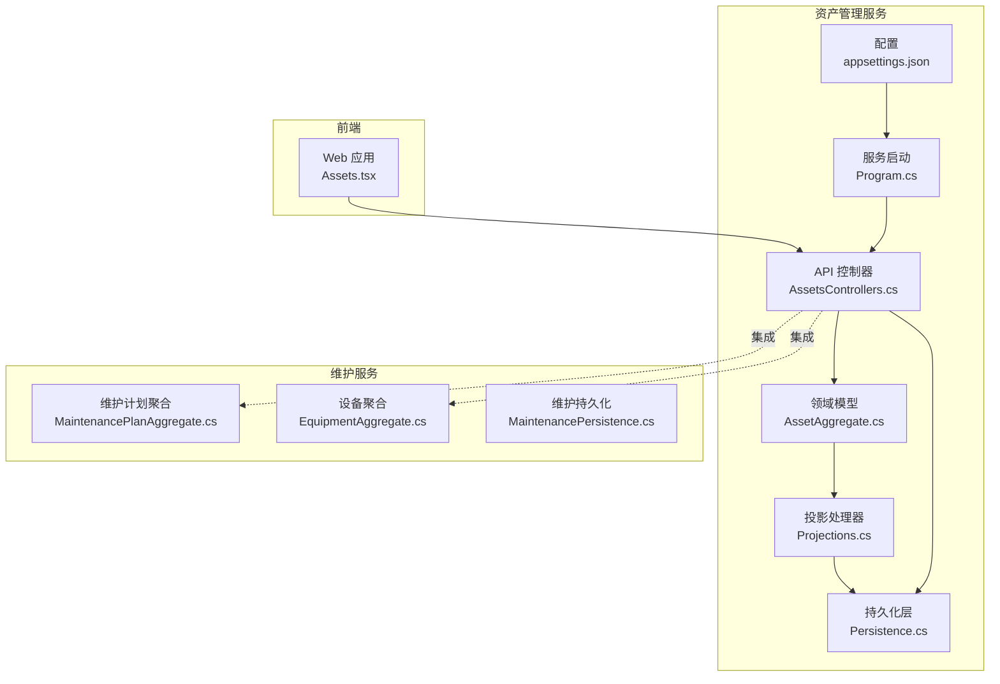
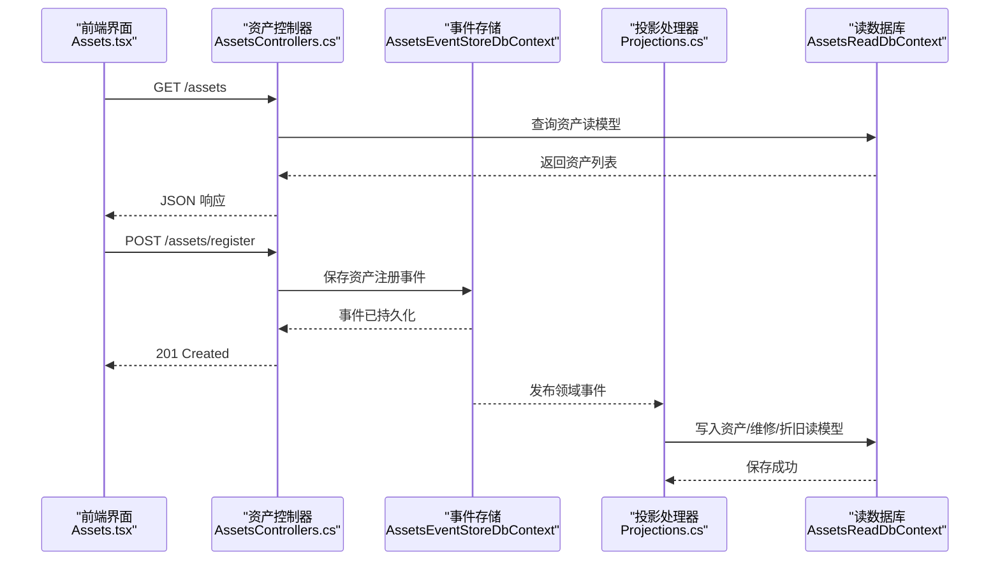
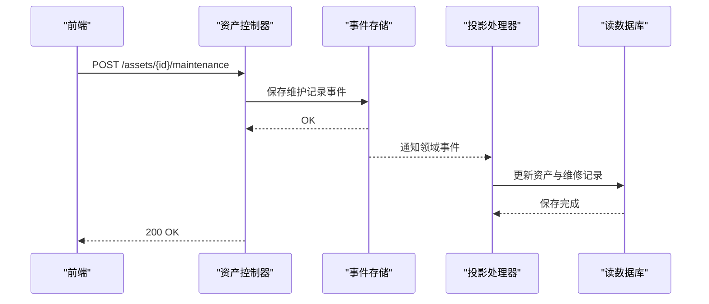
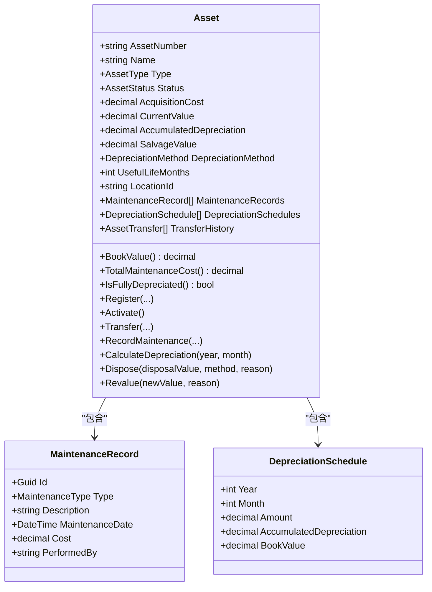
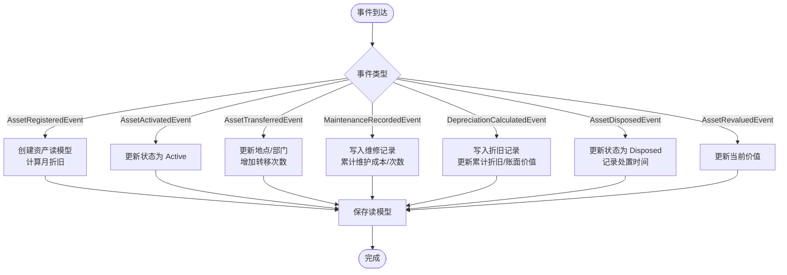
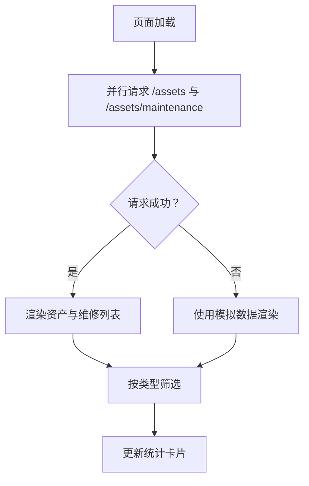
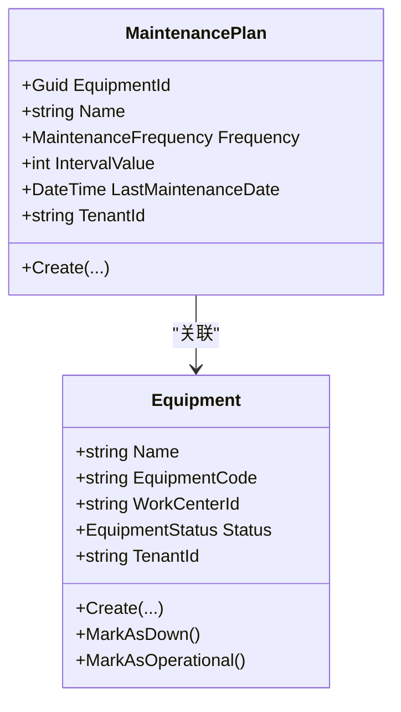
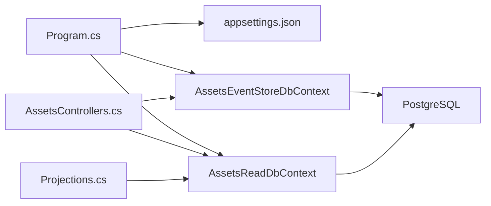
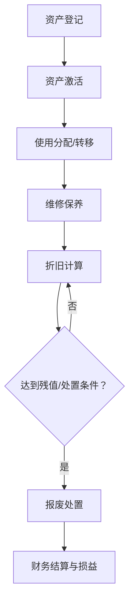

# 资产管理页面

<cite>
**本文档引用的文件**
- [AssetsControllers.cs](file://src/Services/Assets/ErpSystem.Assets/API/AssetsControllers.cs)
- [AssetAggregate.cs](file://src/Services/Assets/ErpSystem.Assets/Domain/AssetAggregate.cs)
- [Persistence.cs](file://src/Services/Assets/ErpSystem.Assets/Infrastructure/Persistence.cs)
- [Projections.cs](file://src/Services/Assets/ErpSystem.Assets/Infrastructure/Projections.cs)
- [Assets.tsx](file://src/Web/ErpSystem.Web/src/pages/Assets.tsx)
- [Program.cs](file://src/Services/Assets/ErpSystem.Assets/Program.cs)
- [appsettings.json](file://src/Services/Assets/ErpSystem.Assets/appsettings.json)
- [MaintenancePlanAggregate.cs](file://src/Services/Maintenance/ErpSystem.Maintenance/Domain/MaintenancePlanAggregate.cs)
- [EquipmentAggregate.cs](file://src/Services/Maintenance/ErpSystem.Maintenance/Domain/EquipmentAggregate.cs)
- [MaintenancePersistence.cs](file://src/Services/Maintenance/ErpSystem.Maintenance/Infrastructure/Persistence.cs)
</cite>

## 目录
1. [简介](#简介)
2. [项目结构](#项目结构)
3. [核心组件](#核心组件)
4. [架构总览](#架构总览)
5. [详细组件分析](#详细组件分析)
6. [依赖关系分析](#依赖关系分析)
7. [性能考虑](#性能考虑)
8. [故障排除指南](#故障排除指南)
9. [结论](#结论)
10. [附录](#附录)

## 简介
本文件面向资产管理页面的实现与使用，系统性阐述资产全生命周期管理能力，包括设备管理、资产登记、折旧计算与维护计划等模块。文档覆盖从资产采购入库、使用分配、维修保养到报废处置的完整流程，并说明资产价值动态跟踪、折旧方法选择、资产盘点自动化处理、利用率分析、维护成本控制以及资产优化配置的集成方案。同时提供最佳实践、风险控制与价值最大化指导建议，帮助非技术读者也能理解系统架构与使用方式。

## 项目结构
资产管理服务采用微服务架构，前端通过Web应用调用后端API，后端基于领域驱动设计（DDD）与事件溯源（Event Sourcing），读写分离的数据库模式支持高并发查询与事件持久化。

图表来源
- [AssetsControllers.cs](file://src/Services/Assets/ErpSystem.Assets/API/AssetsControllers.cs#L1-L250)
- [AssetAggregate.cs](file://src/Services/Assets/ErpSystem.Assets/Domain/AssetAggregate.cs#L1-L357)
- [Projections.cs](file://src/Services/Assets/ErpSystem.Assets/Infrastructure/Projections.cs#L1-L141)
- [Persistence.cs](file://src/Services/Assets/ErpSystem.Assets/Infrastructure/Persistence.cs#L1-L125)
- [Program.cs](file://src/Services/Assets/ErpSystem.Assets/Program.cs#L1-L45)
- [appsettings.json](file://src/Services/Assets/ErpSystem.Assets/appsettings.json#L1-L12)
- [MaintenancePlanAggregate.cs](file://src/Services/Maintenance/ErpSystem.Maintenance/Domain/MaintenancePlanAggregate.cs#L1-L73)
- [EquipmentAggregate.cs](file://src/Services/Maintenance/ErpSystem.Maintenance/Domain/EquipmentAggregate.cs#L1-L92)

章节来源
- [AssetsControllers.cs](file://src/Services/Assets/ErpSystem.Assets/API/AssetsControllers.cs#L1-L250)
- [AssetAggregate.cs](file://src/Services/Assets/ErpSystem.Assets/Domain/AssetAggregate.cs#L1-L357)
- [Persistence.cs](file://src/Services/Assets/ErpSystem.Assets/Infrastructure/Persistence.cs#L1-L125)
- [Projections.cs](file://src/Services/Assets/ErpSystem.Assets/Infrastructure/Projections.cs#L1-L141)
- [Program.cs](file://src/Services/Assets/ErpSystem.Assets/Program.cs#L1-L45)
- [appsettings.json](file://src/Services/Assets/ErpSystem.Assets/appsettings.json#L1-L12)
- [MaintenancePlanAggregate.cs](file://src/Services/Maintenance/ErpSystem.Maintenance/Domain/MaintenancePlanAggregate.cs#L1-L73)
- [EquipmentAggregate.cs](file://src/Services/Maintenance/ErpSystem.Maintenance/Domain/EquipmentAggregate.cs#L1-L92)

## 核心组件
- 资产控制器：提供资产登记、激活、转移、维修记录、折旧计算、报废处置及统计查询等API。
- 领域模型：定义资产聚合根、状态枚举、维护记录、折旧计划、领域事件与值对象。
- 投影处理器：监听领域事件，向只读数据库写入资产、维修、折旧读模型。
- 持久化层：事件存储（PostgreSQL + jsonb）与读模型数据库（索引优化）。
- 前端页面：资产列表、维修记录、折旧统计与筛选功能，支持按类型过滤与统计卡片展示。

章节来源
- [AssetsControllers.cs](file://src/Services/Assets/ErpSystem.Assets/API/AssetsControllers.cs#L1-L250)
- [AssetAggregate.cs](file://src/Services/Assets/ErpSystem.Assets/Domain/AssetAggregate.cs#L1-L357)
- [Projections.cs](file://src/Services/Assets/ErpSystem.Assets/Infrastructure/Projections.cs#L1-L141)
- [Persistence.cs](file://src/Services/Assets/ErpSystem.Assets/Infrastructure/Persistence.cs#L1-L125)
- [Assets.tsx](file://src/Web/ErpSystem.Web/src/pages/Assets.tsx#L1-L311)

## 架构总览
资产管理采用事件溯源与CQRS模式：
- 写模型（命令）：通过控制器接收请求，构建资产聚合，应用领域事件。
- 读模型（查询）：投影处理器监听事件，更新只读数据库中的资产、维修、折旧视图。
- 前端通过REST API访问读模型数据，实现高性能查询与实时统计。

图表来源
- [AssetsControllers.cs](file://src/Services/Assets/ErpSystem.Assets/API/AssetsControllers.cs#L1-L250)
- [Projections.cs](file://src/Services/Assets/ErpSystem.Assets/Infrastructure/Projections.cs#L1-L141)
- [Persistence.cs](file://src/Services/Assets/ErpSystem.Assets/Infrastructure/Persistence.cs#L1-L125)

## 详细组件分析

### 资产控制器与API工作流
- 资产查询：支持按类型、状态、地点过滤；返回资产总数与列表。
- 资产登记：生成唯一资产编号，应用资产注册事件，保存至事件存储。
- 资产激活：仅草稿资产可激活，更新状态为“Active”。
- 资产转移：记录转移历史，更新地点与部门信息。
- 维修记录：记录维护类型、成本、执行人等，累计维护成本与次数。
- 折旧计算：按月计算折旧，确保账面价值不低于残值。
- 报废处置：计算处置损益，标记资产为“Disposed”。

图表来源
- [AssetsControllers.cs](file://src/Services/Assets/ErpSystem.Assets/API/AssetsControllers.cs#L80-L96)
- [Projections.cs](file://src/Services/Assets/ErpSystem.Assets/Infrastructure/Projections.cs#L66-L91)

章节来源
- [AssetsControllers.cs](file://src/Services/Assets/ErpSystem.Assets/API/AssetsControllers.cs#L1-L250)
- [Projections.cs](file://src/Services/Assets/ErpSystem.Assets/Infrastructure/Projections.cs#L1-L141)

### 领域模型与状态流转
- 资产类型：固定资产、设备、车辆、家具、IT设备、建筑物、土地、软件等。
- 资产状态：草稿、启用、维修中、已处置、丢失、已转移。
- 折旧方法：直线法、余额递减法、双倍余额递减法、产量法、不计提折旧。
- 维护类型：预防性、纠正性、紧急、检查、校准。
- 核心聚合：资产聚合根包含财务信息、位置信息、历史记录与计算属性（账面价值、累计折旧、总维护成本、是否已折旧完毕）。

图表来源
- [AssetAggregate.cs](file://src/Services/Assets/ErpSystem.Assets/Domain/AssetAggregate.cs#L179-L357)

章节来源
- [AssetAggregate.cs](file://src/Services/Assets/ErpSystem.Assets/Domain/AssetAggregate.cs#L1-L357)

### 投影处理器与读模型
- 资产注册：初始化资产读模型，计算月折旧额。
- 资产激活：更新状态为“Active”。
- 资产转移：更新地点与部门，维护转移次数。
- 维修记录：写入维修读模型，累计资产总维护成本与次数。
- 折旧计算：写入折旧读模型，更新资产累计折旧与账面价值。
- 资产处置：更新状态为“Disposed”，记录处置时间。
- 资产重估：更新当前价值。

图表来源
- [Projections.cs](file://src/Services/Assets/ErpSystem.Assets/Infrastructure/Projections.cs#L15-L139)

章节来源
- [Projections.cs](file://src/Services/Assets/ErpSystem.Assets/Infrastructure/Projections.cs#L1-L141)
- [Persistence.cs](file://src/Services/Assets/ErpSystem.Assets/Infrastructure/Persistence.cs#L63-L125)

### 前端资产管理页面
- 页面布局：统计卡片（总资产、总账面价值、累计折旧、维修中数量）、标签页（资产、维修、折旧）、类型筛选。
- 数据来源：通过API获取资产与维修数据，支持错误降级使用模拟数据。
- 交互逻辑：异步加载、筛选过滤、状态徽章与图标展示。

图表来源
- [Assets.tsx](file://src/Web/ErpSystem.Web/src/pages/Assets.tsx#L130-L144)

章节来源
- [Assets.tsx](file://src/Web/ErpSystem.Web/src/pages/Assets.tsx#L1-L311)

### 维护计划与设备集成
- 维护计划聚合：定义设备的定期维护周期与频率，支持按天、周、月、使用小时维护。
- 设备聚合：跟踪设备状态（运行中、停机、维修中），支持状态变更事件。
- 与资产服务集成：资产页面可联动显示设备维护计划与到期提醒，形成闭环。

图表来源
- [MaintenancePlanAggregate.cs](file://src/Services/Maintenance/ErpSystem.Maintenance/Domain/MaintenancePlanAggregate.cs#L8-L73)
- [EquipmentAggregate.cs](file://src/Services/Maintenance/ErpSystem.Maintenance/Domain/EquipmentAggregate.cs#L8-L92)

章节来源
- [MaintenancePlanAggregate.cs](file://src/Services/Maintenance/ErpSystem.Maintenance/Domain/MaintenancePlanAggregate.cs#L1-L73)
- [EquipmentAggregate.cs](file://src/Services/Maintenance/ErpSystem.Maintenance/Domain/EquipmentAggregate.cs#L1-L92)

## 依赖关系分析
- 服务启动：Program.cs 注册事件存储、MediatR、Swagger，映射控制器。
- 数据库连接：appsettings.json 提供资产服务数据库连接字符串。
- 事件存储：AssetsEventStoreDbContext 使用 PostgreSQL + jsonb 存储事件流。
- 读模型数据库：AssetsReadDbContext 提供资产、维修、折旧表的索引优化查询。
- 维护服务：独立的事件存储与读库，资产服务通过领域事件与之集成。

图表来源
- [Program.cs](file://src/Services/Assets/ErpSystem.Assets/Program.cs#L1-L45)
- [appsettings.json](file://src/Services/Assets/ErpSystem.Assets/appsettings.json#L1-L12)
- [Persistence.cs](file://src/Services/Assets/ErpSystem.Assets/Infrastructure/Persistence.cs#L8-L57)

章节来源
- [Program.cs](file://src/Services/Assets/ErpSystem.Assets/Program.cs#L1-L45)
- [appsettings.json](file://src/Services/Assets/ErpSystem.Assets/appsettings.json#L1-L12)
- [Persistence.cs](file://src/Services/Assets/ErpSystem.Assets/Infrastructure/Persistence.cs#L1-L125)

## 性能考虑
- 读写分离：事件存储与读库分离，读库建立复合索引（资产编号、类型、状态、地点、维修日期、折旧年月）提升查询性能。
- 批量处理：折旧控制器提供批量折旧调度接口，便于定时任务批量计算。
- 缓存策略：结合前端缓存与后端查询缓存，降低高频查询压力。
- 数据分区：按年/月拆分折旧记录，支持分页与聚合统计。

## 故障排除指南
- 事件存储异常：检查事件存储数据库连接与权限，确认事件流表存在且jsonb字段可写。
- 投影失败：验证投影处理器是否正确监听事件，读库保存是否成功，索引是否存在。
- API 404/400：确认请求路径与参数类型，如资产ID格式、枚举值是否匹配。
- 前端数据为空：检查API连通性与跨域配置，确认读库数据是否已由投影处理器填充。

章节来源
- [AssetsControllers.cs](file://src/Services/Assets/ErpSystem.Assets/API/AssetsControllers.cs#L1-L250)
- [Projections.cs](file://src/Services/Assets/ErpSystem.Assets/Infrastructure/Projections.cs#L1-L141)
- [Persistence.cs](file://src/Services/Assets/ErpSystem.Assets/Infrastructure/Persistence.cs#L1-L125)

## 结论
资产管理页面通过事件溯源与CQRS实现了资产全生命周期的精细化管理，从前端直观展示到后端事件驱动的读模型更新，形成了高内聚、低耦合的微服务架构。结合维护计划与设备状态管理，系统能够实现资产利用率分析、维护成本控制与优化配置，为企业资产价值最大化提供坚实支撑。

## 附录

### 资产全生命周期流程

### 折旧方法选择与计算
- 直线法：月折旧 = (原值 - 残值) / 使用寿命(月)
- 余额递减法：按账面价值的固定比率折旧
- 双倍余额递减法：在直线法基础上加速折旧
- 产量法：按实际产出量分摊折旧
- 不计提折旧：适用于特定资产类型

章节来源
- [AssetAggregate.cs](file://src/Services/Assets/ErpSystem.Assets/Domain/AssetAggregate.cs#L32-L39)
- [AssetAggregate.cs](file://src/Services/Assets/ErpSystem.Assets/Domain/AssetAggregate.cs#L198-L201)
- [AssetAggregate.cs](file://src/Services/Assets/ErpSystem.Assets/Domain/AssetAggregate.cs#L267-L284)

### 资产利用率与维护成本控制
- 利用率分析：结合设备状态与使用记录，计算设备运行时间占比与闲置率。
- 维护成本控制：通过预防性维护与维修记录统计，识别高成本设备与高发故障部件，优化维护策略。
- 优化配置：根据资产类型与使用场景，调整折旧方法与维护周期，平衡资产价值与运营效率。

### 最佳实践与风险控制
- 数据完整性：严格校验资产登记字段，确保唯一性与一致性。
- 审计追踪：所有关键操作记录领域事件，支持回溯与合规检查。
- 风险控制：设置折旧上限、残值下限与报废审批流程，避免资产价值虚增或低估。
- 价值最大化：定期进行资产重估与盘点，结合市场价值与使用效率制定处置与再投资策略。