# 销售管理页面

<cite>
**本文档引用的文件**
- [Program.cs](file://src/Services/Sales/ErpSystem.Sales/Program.cs)
- [SalesOrdersController.cs](file://src/Services/Sales/ErpSystem.Sales/API/SalesOrdersController.cs)
- [SalesOrderCommands.cs](file://src/Services/Sales/ErpSystem.Sales/Application/SalesOrderCommands.cs)
- [SalesQueries.cs](file://src/Services/Sales/ErpSystem.Sales/Application/SalesQueries.cs)
- [SalesOrderAggregate.cs](file://src/Services/Sales/ErpSystem.Sales/Domain/SalesOrderAggregate.cs)
- [ShipmentAggregate.cs](file://src/Services/Sales/ErpSystem.Sales/Domain/ShipmentAggregate.cs)
- [Persistence.cs](file://src/Services/Sales/ErpSystem.Sales/Infrastructure/Persistence.cs)
- [Projections.cs](file://src/Services/Sales/ErpSystem.Sales/Infrastructure/Projections.cs)
- [ShipmentCommands.cs](file://src/Services/Sales/ErpSystem.Sales/Application/ShipmentCommands.cs)
- [SalesEvents.cs](file://src/Services/Sales/ErpSystem.Sales/Domain/SalesEvents.cs)
- [Sales.tsx](file://src/Web/ErpSystem.Web/src/pages/Sales.tsx)
- [App.tsx](file://src/Web/ErpSystem.Web/src/App.tsx)
- [appsettings.json](file://src/Services/Sales/ErpSystem.Sales/appsettings.json)
- [README.md](file://README.md)
</cite>

## 目录
1. [简介](#简介)
2. [项目结构](#项目结构)
3. [核心组件](#核心组件)
4. [架构概览](#架构概览)
5. [详细组件分析](#详细组件分析)
6. [依赖关系分析](#依赖关系分析)
7. [性能考虑](#性能考虑)
8. [故障排除指南](#故障排除指南)
9. [结论](#结论)
10. [附录](#附录)

## 简介

销售管理页面是企业资源规划(ERP)系统中的核心功能模块，负责实现完整的销售订单生命周期管理。该模块采用微服务架构设计，基于领域驱动设计(DDD)和事件溯源(Event Sourcing)模式，实现了从销售订单创建到发货跟踪的完整数字化流程。

本模块支持多仓库库存管理、实时订单状态跟踪、客户关系管理以及销售数据分析等功能。通过集成事件总线和投影机制，实现了跨服务的数据一致性保证和实时状态更新。

## 项目结构

销售管理模块在整体ERP系统中位于独立的服务层，采用分层架构设计：

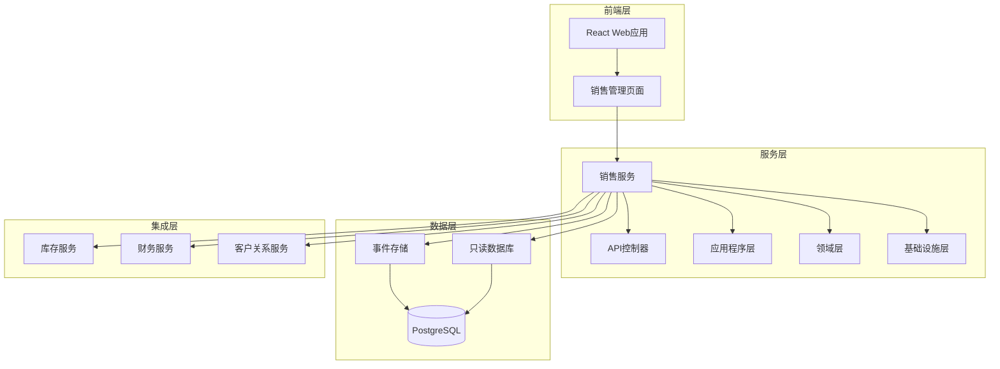

**图表来源**
- [Program.cs](file://src/Services/Sales/ErpSystem.Sales/Program.cs#L1-L72)
- [Persistence.cs](file://src/Services/Sales/ErpSystem.Sales/Infrastructure/Persistence.cs#L1-L56)

**章节来源**
- [Program.cs](file://src/Services/Sales/ErpSystem.Sales/Program.cs#L1-L72)
- [README.md](file://README.md#L130-L184)

## 核心组件

销售管理模块包含以下核心组件：

### 1. 销售订单聚合根
销售订单是模块的核心聚合，管理订单的完整生命周期状态转换。

### 2. 发货聚合
处理实际的货物发运操作，与销售订单保持关联关系。

### 3. 应用程序服务
提供订单创建、确认、取消等业务操作的命令处理能力。

### 4. 查询服务
支持订单查询、搜索和账单行计算的查询处理。

### 5. 基础设施层
包含事件存储、投影器和数据库上下文的实现。

**章节来源**
- [SalesOrderAggregate.cs](file://src/Services/Sales/ErpSystem.Sales/Domain/SalesOrderAggregate.cs#L67-L148)
- [ShipmentAggregate.cs](file://src/Services/Sales/ErpSystem.Sales/Domain/ShipmentAggregate.cs#L21-L61)
- [SalesOrderCommands.cs](file://src/Services/Sales/ErpSystem.Sales/Application/SalesOrderCommands.cs#L20-L67)

## 架构概览

销售管理模块采用事件驱动架构，实现了完整的CQRS模式：

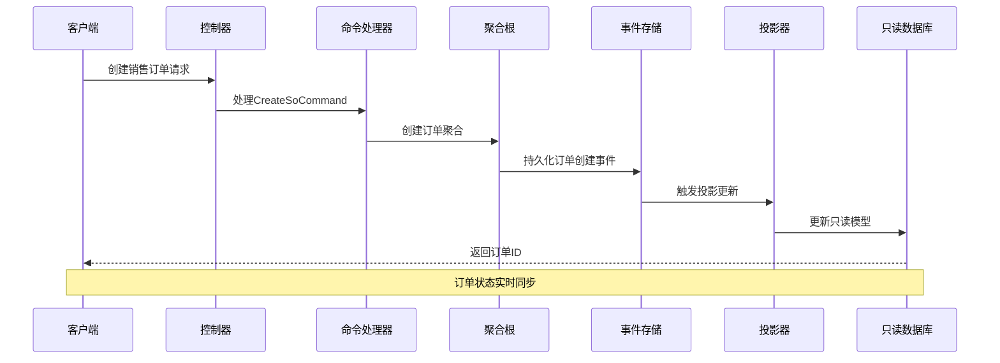

**图表来源**
- [SalesOrdersController.cs](file://src/Services/Sales/ErpSystem.Sales/API/SalesOrdersController.cs#L11-L35)
- [SalesOrderCommands.cs](file://src/Services/Sales/ErpSystem.Sales/Application/SalesOrderCommands.cs#L25-L32)
- [Projections.cs](file://src/Services/Sales/ErpSystem.Sales/Infrastructure/Projections.cs#L14-L30)

## 详细组件分析

### 销售订单管理系统

#### 订单状态流转

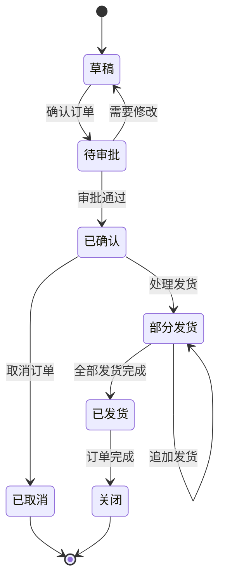

**图表来源**
- [SalesOrderAggregate.cs](file://src/Services/Sales/ErpSystem.Sales/Domain/SalesOrderAggregate.cs#L5-L14)
- [SalesOrderAggregate.cs](file://src/Services/Sales/ErpSystem.Sales/Domain/SalesOrderAggregate.cs#L91-L103)

#### 订单生命周期处理流程

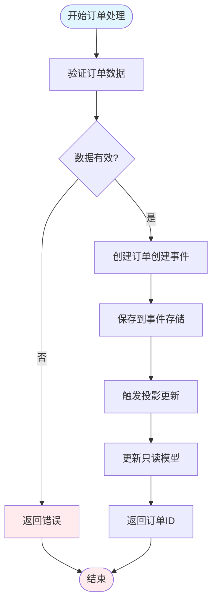

**图表来源**
- [SalesOrderCommands.cs](file://src/Services/Sales/ErpSystem.Sales/Application/SalesOrderCommands.cs#L25-L32)
- [Projections.cs](file://src/Services/Sales/ErpSystem.Sales/Infrastructure/Projections.cs#L14-L30)

**章节来源**
- [SalesOrderAggregate.cs](file://src/Services/Sales/ErpSystem.Sales/Domain/SalesOrderAggregate.cs#L67-L148)
- [SalesOrderCommands.cs](file://src/Services/Sales/ErpSystem.Sales/Application/SalesOrderCommands.cs#L20-L67)

### 发货管理模块

#### 发货处理流程

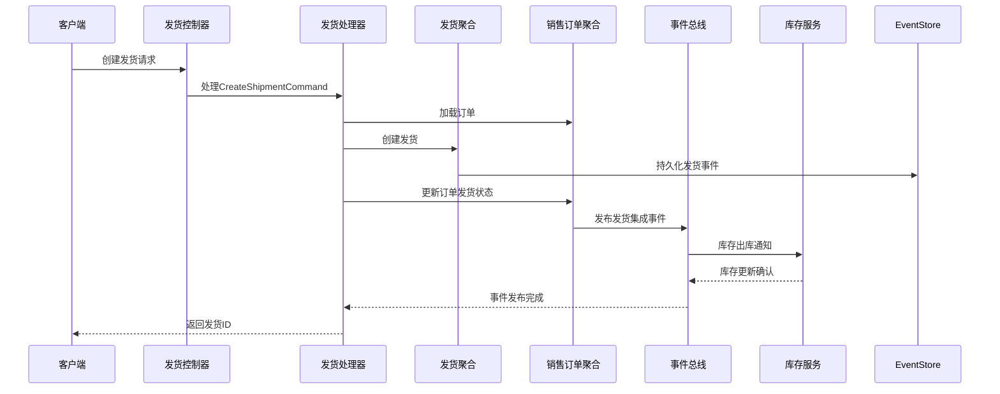

**图表来源**
- [ShipmentCommands.cs](file://src/Services/Sales/ErpSystem.Sales/Application/ShipmentCommands.cs#L22-L59)
- [SalesEvents.cs](file://src/Services/Sales/ErpSystem.Sales/Domain/SalesEvents.cs#L19-L31)

#### 发货状态管理

发货模块支持多种发货场景：
- 单行发货：部分商品的单独发货
- 多行发货：多个订单行项目的批量发货
- 退货处理：支持已发货商品的退货流程

**章节来源**
- [ShipmentAggregate.cs](file://src/Services/Sales/ErpSystem.Sales/Domain/ShipmentAggregate.cs#L21-L61)
- [ShipmentCommands.cs](file://src/Services/Sales/ErpSystem.Sales/Application/ShipmentCommands.cs#L16-L61)

### 客户管理集成

销售模块与客户关系管理(CRM)服务深度集成，提供：

#### 客户信息管理
- 客户基本信息维护
- 客户信用额度管理
- 客户等级和优惠政策
- 客户联系人信息

#### 销售机会跟踪
- 销售线索转化
- 商机状态管理
- 销售管道分析
- 客户行为分析

**章节来源**
- [SalesOrderAggregate.cs](file://src/Services/Sales/ErpSystem.Sales/Domain/SalesOrderAggregate.cs#L70-L75)

### 数据库设计

#### 事件存储架构

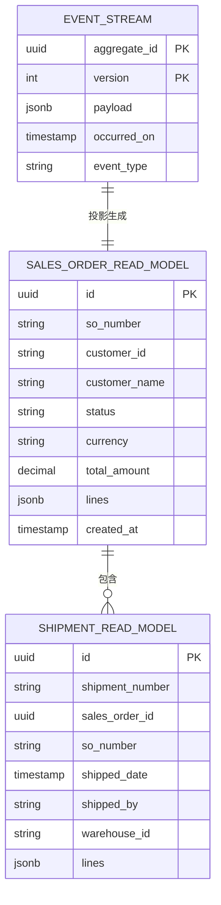

**图表来源**
- [Persistence.cs](file://src/Services/Sales/ErpSystem.Sales/Infrastructure/Persistence.cs#L6-L56)

**章节来源**
- [Persistence.cs](file://src/Services/Sales/ErpSystem.Sales/Infrastructure/Persistence.cs#L1-L56)

### 前端销售页面

#### 页面功能实现

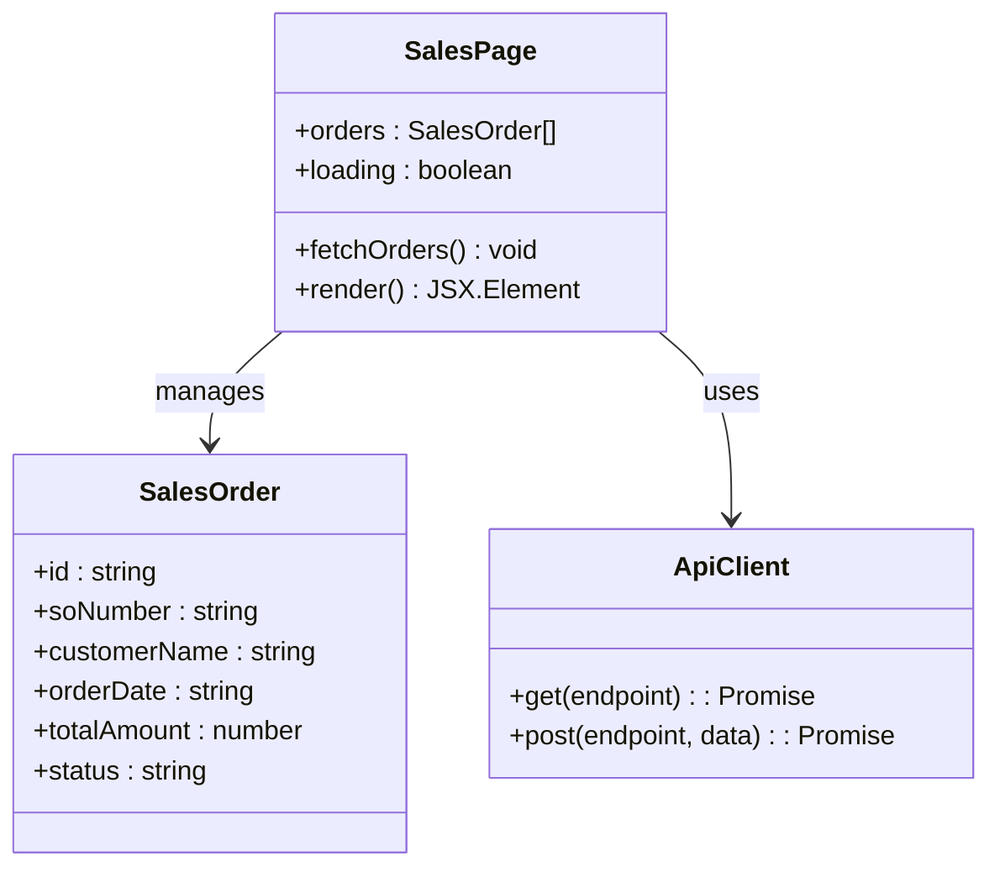

**图表来源**
- [Sales.tsx](file://src/Web/ErpSystem.Web/src/pages/Sales.tsx#L5-L12)
- [Sales.tsx](file://src/Web/ErpSystem.Web/src/pages/Sales.tsx#L14-L36)

**章节来源**
- [Sales.tsx](file://src/Web/ErpSystem.Web/src/pages/Sales.tsx#L1-L85)
- [App.tsx](file://src/Web/ErpSystem.Web/src/App.tsx#L9-L31)

## 依赖关系分析

### 服务间依赖图

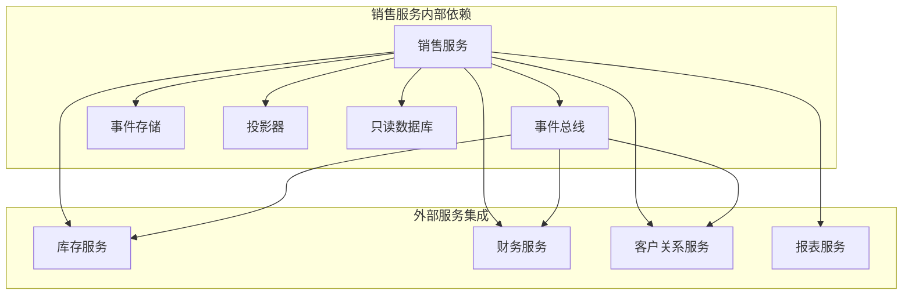

**图表来源**
- [Program.cs](file://src/Services/Sales/ErpSystem.Sales/Program.cs#L24-L46)
- [SalesEvents.cs](file://src/Services/Sales/ErpSystem.Sales/Domain/SalesEvents.cs#L5-L32)

### 数据流依赖

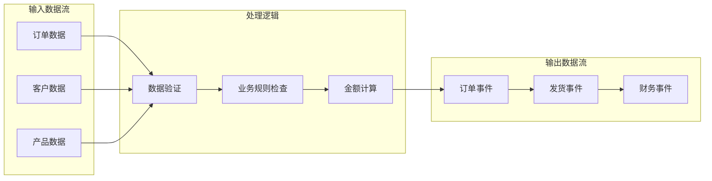

**图表来源**
- [SalesOrderAggregate.cs](file://src/Services/Sales/ErpSystem.Sales/Domain/SalesOrderAggregate.cs#L16-L29)
- [SalesOrderCommands.cs](file://src/Services/Sales/ErpSystem.Sales/Application/SalesOrderCommands.cs#L25-L32)

**章节来源**
- [Program.cs](file://src/Services/Sales/ErpSystem.Sales/Program.cs#L1-L72)
- [SalesEvents.cs](file://src/Services/Sales/ErpSystem.Sales/Domain/SalesEvents.cs#L1-L32)

## 性能考虑

### 数据库性能优化

1. **事件存储优化**
   - 使用JSONB格式存储事件负载
   - 为聚合ID和版本建立复合主键索引
   - 实现事件流的分页查询

2. **查询性能优化**
   - 只读数据库使用NoTracking查询
   - 实现分页查询避免大数据集加载
   - 使用索引优化常用查询条件

3. **缓存策略**
   - 集成分布式缓存机制
   - 实现读模型的缓存更新策略
   - 减少重复的数据库查询

### 并发控制

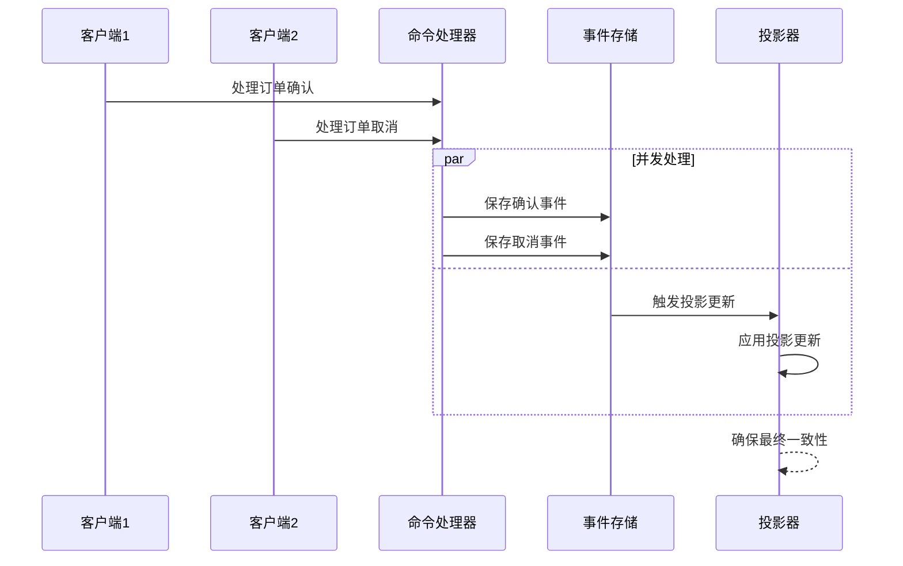

**图表来源**
- [Persistence.cs](file://src/Services/Sales/ErpSystem.Sales/Infrastructure/Persistence.cs#L12-L17)

## 故障排除指南

### 常见问题诊断

#### 订单状态异常
- **症状**：订单状态显示不正确
- **原因**：投影器执行失败或事件丢失
- **解决方案**：重新构建投影或检查事件存储完整性

#### 发货处理失败
- **症状**：发货创建后订单状态未更新
- **原因**：事件发布失败或事务回滚
- **解决方案**：检查事件总线连接和数据库事务配置

#### 查询性能问题
- **症状**：订单列表加载缓慢
- **原因**：缺少必要的数据库索引
- **解决方案**：添加适当的索引并优化查询条件

### 日志和监控

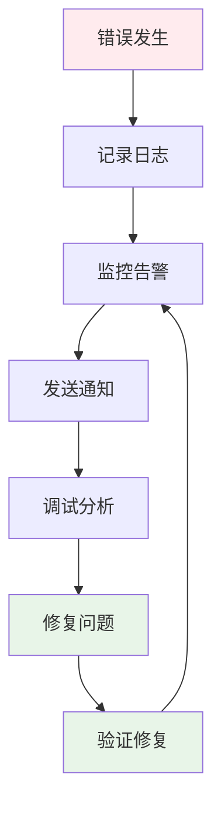

**图表来源**
- [Program.cs](file://src/Services/Sales/ErpSystem.Sales/Program.cs#L2-L4)
- [appsettings.json](file://src/Services/Sales/ErpSystem.Sales/appsettings.json#L2-L10)

**章节来源**
- [Program.cs](file://src/Services/Sales/ErpSystem.Sales/Program.cs#L1-L72)
- [appsettings.json](file://src/Services/Sales/ErpSystem.Sales/appsettings.json#L1-L12)

## 结论

销售管理页面实现了完整的销售订单生命周期管理，具有以下优势：

1. **技术架构先进**：采用事件驱动架构和CQRS模式，确保系统的可扩展性和可维护性
2. **业务覆盖全面**：从订单创建到发货跟踪的全流程数字化管理
3. **集成能力强**：与库存、财务、客户关系等服务的深度集成
4. **实时性好**：通过事件总线实现实时状态更新和数据同步

该模块为企业的销售管理提供了坚实的技术基础，支持业务的持续发展和创新需求。

## 附录

### API接口定义

#### 销售订单API
- `POST /api/v1/sales/orders` - 创建销售订单
- `GET /api/v1/sales/orders/{id}` - 获取订单详情
- `GET /api/v1/sales/orders` - 搜索订单
- `POST /api/v1/sales/orders/{id}/confirm` - 确认订单
- `POST /api/v1/sales/orders/{id}/cancel` - 取消订单
- `GET /api/v1/sales/orders/{id}/billable-lines` - 获取可开票行

#### 发货API
- `POST /api/v1/sales/shipments` - 创建发货

### 配置参数

#### 数据库连接
- `salesdb` - PostgreSQL连接字符串

#### 日志配置
- 默认日志级别：Information
- ASP.NET Core日志级别：Warning

**章节来源**
- [SalesOrdersController.cs](file://src/Services/Sales/ErpSystem.Sales/API/SalesOrdersController.cs#L7-L45)
- [appsettings.json](file://src/Services/Sales/ErpSystem.Sales/appsettings.json#L8-L10)