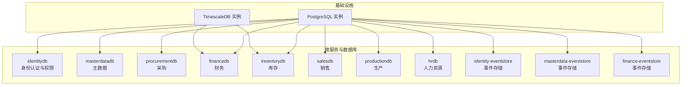
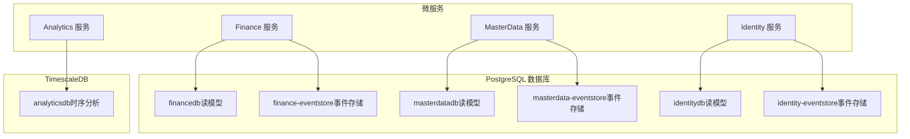
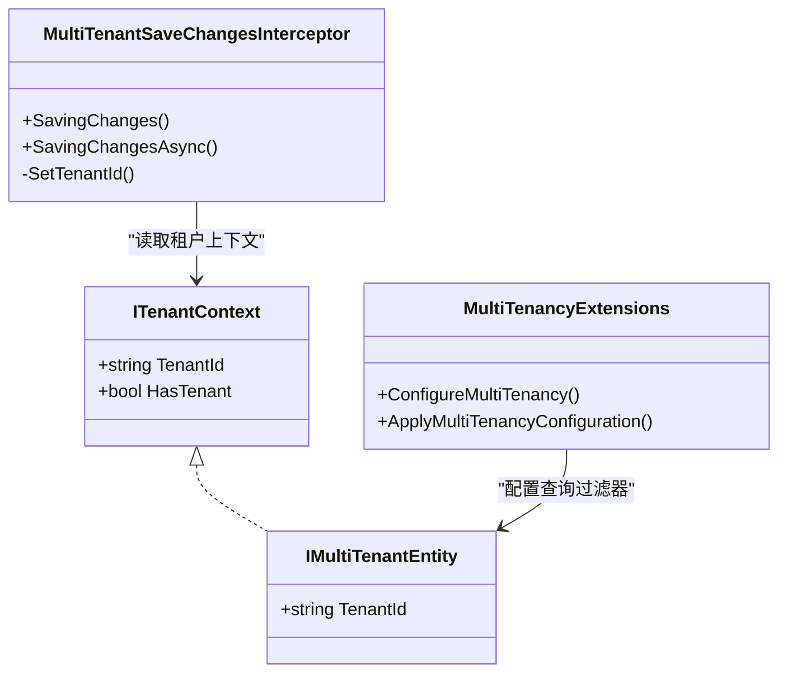
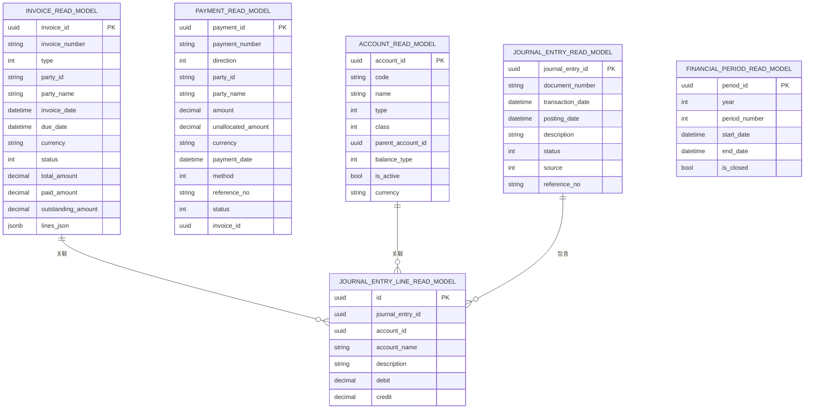
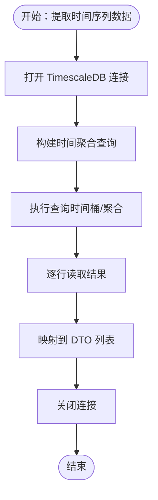
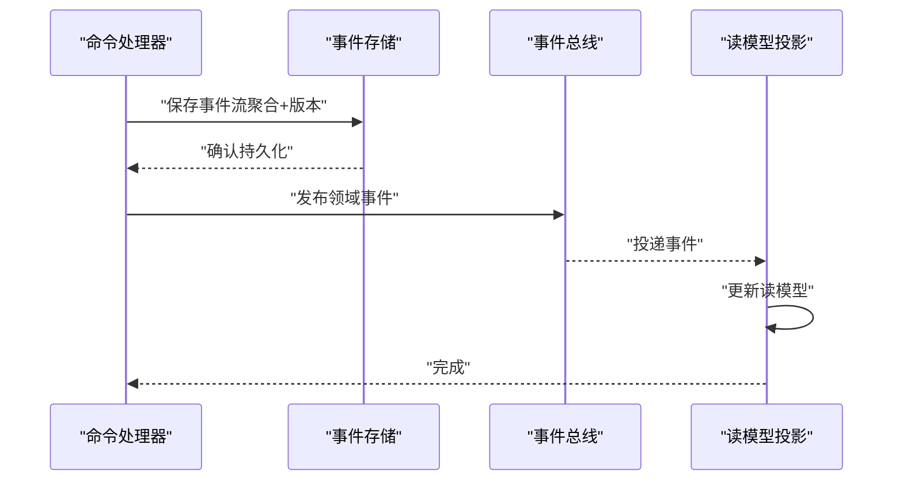
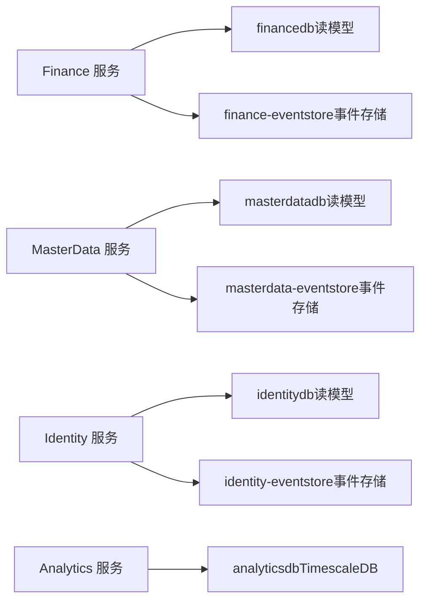

# 数据库设计

<cite>
**本文引用的文件**
- [init.sql](file://infrastructure/init.sql)
- [timescale-init.sql](file://infrastructure/timescale-init.sql)
- [TimescaleDataExtractor.cs](file://src/Services/Analytics/ErpSystem.Analytics/Infrastructure/TimescaleDataExtractor.cs)
- [MultiTenancy.cs](file://src/BuildingBlocks/ErpSystem.BuildingBlocks/MultiTenancy/MultiTenancy.cs)
- [Persistence.cs（Finance）](file://src/Services/Finance/ErpSystem.Finance/Infrastructure/Persistence.cs)
- [ReadDbContext.cs（MasterData）](file://src/Services/MasterData/ErpSystem.MasterData/Infrastructure/ReadDbContext.cs)
- [EventStore.cs（Finance）](file://src/Services/Finance/ErpSystem.Finance/Infrastructure/EventStore.cs)
- [EventStore.cs（Identity）](file://src/Services/Identity/ErpSystem.Identity/Infrastructure/EventStore.cs)
- [EventStore.cs（Maintenance）](file://src/Services/Maintenance/ErpSystem.Maintenance/Infrastructure/Persistence.cs)
- [appsettings.Development.json（MasterData）](file://src/Services/MasterData/ErpSystem.MasterData/appsettings.Development.json)
- [appsettings.json（Settings）](file://src/Services/Settings/ErpSystem.Settings/appsettings.json)
- [appsettings.json（Assets）](file://src/Services/Assets/ErpSystem.Assets/appsettings.json)
- [Program.cs（Finance）](file://src/Services/Finance/ErpSystem.Finance/Program.cs)
- [Program.cs（Maintenance）](file://src/Services/Maintenance/ErpSystem.Maintenance/Program.cs)
- [DDDBase.cs](file://src/BuildingBlocks/ErpSystem.BuildingBlocks/Domain/DDDBase.cs)
</cite>

## 目录
1. [简介](#简介)
2. [项目结构](#项目结构)
3. [核心组件](#核心组件)
4. [架构总览](#架构总览)
5. [详细组件分析](#详细组件分析)
6. [依赖关系分析](#依赖关系分析)
7. [性能考虑](#性能考虑)
8. [故障排查指南](#故障排查指南)
9. [结论](#结论)
10. [附录](#附录)

## 简介
本文件系统化梳理 ERP 微服务系统的数据库设计，重点覆盖以下方面：
- 多租户数据库架构：每个微服务独立数据库的设计理念与数据隔离策略
- PostgreSQL 配置与表结构：读写分离、JSONB 字段、索引策略
- TimescaleDB 时间序列数据库：在财务分析与库存监控中的应用
- 事件溯源数据库实现：事件存储表结构与查询优化
- 连接池、事务管理与并发控制
- 数据迁移、版本管理与备份恢复
- 数据库管理员性能调优与监控建议

## 项目结构
本项目采用“按微服务划分数据库”的多租户架构，每个服务拥有独立的读写数据库与事件存储数据库，并通过 TimescaleDB 支撑时序分析。

图表来源
- [init.sql](file://infrastructure/init.sql#L1-L9)
- [timescale-init.sql](file://infrastructure/timescale-init.sql#L1-L140)

章节来源
- [init.sql](file://infrastructure/init.sql#L1-L9)
- [timescale-init.sql](file://infrastructure/timescale-init.sql#L1-L140)

## 核心组件
- 多租户隔离层：通过全局查询过滤器与保存拦截器自动注入租户标识，确保跨服务数据隔离
- 事件存储：基于关系型数据库的事件流表，使用 JSONB 存储事件载荷，支持事件溯源
- 读模型数据库：各服务独立的只读数据库，承载投影与报表查询
- TimescaleDB：用于高基数、高吞吐的时间序列数据建模与连续聚合

章节来源
- [MultiTenancy.cs](file://src/BuildingBlocks/ErpSystem.BuildingBlocks/MultiTenancy/MultiTenancy.cs#L1-L104)
- [EventStore.cs（Finance）](file://src/Services/Finance/ErpSystem.Finance/Infrastructure/EventStore.cs#L1-L18)
- [EventStore.cs（Identity）](file://src/Services/Identity/ErpSystem.Identity/Infrastructure/EventStore.cs#L1-L19)
- [EventStore.cs（Maintenance）](file://src/Services/Maintenance/ErpSystem.Maintenance/Infrastructure/Persistence.cs#L1-L30)
- [Persistence.cs（Finance）](file://src/Services/Finance/ErpSystem.Finance/Infrastructure/Persistence.cs#L1-L130)
- [ReadDbContext.cs（MasterData）](file://src/Services/MasterData/ErpSystem.MasterData/Infrastructure/ReadDbContext.cs#L1-L125)

## 架构总览
下图展示微服务与数据库之间的关系，以及事件存储与读模型的职责分工。

图表来源
- [Program.cs（Finance）](file://src/Services/Finance/ErpSystem.Finance/Program.cs#L64-L73)
- [Program.cs（Maintenance）](file://src/Services/Maintenance/ErpSystem.Maintenance/Program.cs#L41-L51)
- [Persistence.cs（Finance）](file://src/Services/Finance/ErpSystem.Finance/Infrastructure/Persistence.cs#L1-L130)
- [ReadDbContext.cs（MasterData）](file://src/Services/MasterData/ErpSystem.MasterData/Infrastructure/ReadDbContext.cs#L1-L125)
- [EventStore.cs（Finance）](file://src/Services/Finance/ErpSystem.Finance/Infrastructure/EventStore.cs#L1-L18)
- [EventStore.cs（Identity）](file://src/Services/Identity/ErpSystem.Identity/Infrastructure/EventStore.cs#L1-L19)
- [EventStore.cs（Maintenance）](file://src/Services/Maintenance/ErpSystem.Maintenance/Infrastructure/Persistence.cs#L1-L30)
- [timescale-init.sql](file://infrastructure/timescale-init.sql#L1-L140)

## 详细组件分析

### 多租户数据库与数据隔离
- 设计理念
  - 每个租户的数据在物理上隔离于独立数据库或通过租户字段隔离
  - 在共享数据库场景下，通过全局查询过滤器与保存拦截器实现逻辑隔离
- 实现要点
  - 全局查询过滤器：对所有实现多租户接口的实体自动追加租户条件
  - 保存拦截器：在新增实体时自动填充租户标识
  - 索引策略：对租户字段建立索引，提升过滤效率
- 适用范围
  - 身份服务、主数据、财务、库存、销售、生产、HR 等服务

图表来源
- [MultiTenancy.cs](file://src/BuildingBlocks/ErpSystem.BuildingBlocks/MultiTenancy/MultiTenancy.cs#L1-L104)

章节来源
- [MultiTenancy.cs](file://src/BuildingBlocks/ErpSystem.BuildingBlocks/MultiTenancy/MultiTenancy.cs#L1-L104)

### PostgreSQL 数据库配置与表结构
- 数据库初始化
  - 创建多个业务数据库，分别对应不同微服务
- 读模型数据库
  - 财务服务：包含发票、付款、会计科目、分录、财务期间等读模型
  - 主数据服务：包含物料、分类、供应商、客户、仓库、库位、BOM 等读模型
  - JSONB 字段：用于存储复杂结构化数据（如明细、联系人、地址、组件）
- 事件存储数据库
  - 统一事件流表结构，键由聚合标识与版本组成，载荷以 JSONB 存储
- 索引策略
  - 读模型：对常用查询字段建立索引（如编号唯一索引、状态、归属人、账户等）
  - 事件存储：复合主键（聚合+版本），保证事件幂等与顺序一致性

图表来源
- [Persistence.cs（Finance）](file://src/Services/Finance/ErpSystem.Finance/Infrastructure/Persistence.cs#L50-L130)

章节来源
- [Persistence.cs（Finance）](file://src/Services/Finance/ErpSystem.Finance/Infrastructure/Persistence.cs#L1-L130)
- [ReadDbContext.cs（MasterData）](file://src/Services/MasterData/ErpSystem.MasterData/Infrastructure/ReadDbContext.cs#L1-L125)
- [EventStore.cs（Finance）](file://src/Services/Finance/ErpSystem.Finance/Infrastructure/EventStore.cs#L1-L18)
- [EventStore.cs（Identity）](file://src/Services/Identity/ErpSystem.Identity/Infrastructure/EventStore.cs#L1-L19)
- [EventStore.cs（Maintenance）](file://src/Services/Maintenance/ErpSystem.Maintenance/Infrastructure/Persistence.cs#L1-L30)

### TimescaleDB 时间序列数据库
- 应用场景
  - 库存事务与成本移动的时序分析
  - 提供日级汇总、统计分布、缺口填充与插值等高级分析能力
- 表结构与连续聚合
  - 事务表与成本移动表作为超表，按时间分区
  - 日级连续聚合视图与小时级统计聚合视图
  - 压缩策略与保留策略，平衡存储与查询性能
- 查询优化
  - 使用时间桶函数进行聚合
  - Gap-filling 与插值函数支撑预测模型
  - 工具包函数用于分位数与滚动统计

图表来源
- [TimescaleDataExtractor.cs](file://src/Services/Analytics/ErpSystem.Analytics/Infrastructure/TimescaleDataExtractor.cs#L1-L112)

章节来源
- [timescale-init.sql](file://infrastructure/timescale-init.sql#L1-L140)
- [TimescaleDataExtractor.cs](file://src/Services/Analytics/ErpSystem.Analytics/Infrastructure/TimescaleDataExtractor.cs#L1-L112)

### 事件溯源数据库实现
- 事件存储表结构
  - 聚合标识 + 版本 作为复合主键
  - 事件类型与 JSONB 载荷
- 事件发布与处理
  - 事件持久化后通过事件总线发布，驱动读模型更新
  - 读模型数据库与事件存储数据库分离，保障查询性能
- 并发与幂等
  - 版本号确保事件顺序与幂等
  - 读模型投影在处理器中异步更新

图表来源
- [DDDBase.cs](file://src/BuildingBlocks/ErpSystem.BuildingBlocks/Domain/DDDBase.cs#L43-L50)
- [EventStore.cs（Finance）](file://src/Services/Finance/ErpSystem.Finance/Infrastructure/EventStore.cs#L1-L18)
- [Program.cs（Finance）](file://src/Services/Finance/ErpSystem.Finance/Program.cs#L35-L49)

章节来源
- [DDDBase.cs](file://src/BuildingBlocks/ErpSystem.BuildingBlocks/Domain/DDDBase.cs#L1-L50)
- [EventStore.cs（Finance）](file://src/Services/Finance/ErpSystem.Finance/Infrastructure/EventStore.cs#L1-L18)
- [EventStore.cs（Identity）](file://src/Services/Identity/ErpSystem.Identity/Infrastructure/EventStore.cs#L1-L19)
- [EventStore.cs（Maintenance）](file://src/Services/Maintenance/ErpSystem.Maintenance/Infrastructure/Persistence.cs#L1-L30)
- [Program.cs（Finance）](file://src/Services/Finance/ErpSystem.Finance/Program.cs#L35-L49)

### 数据库连接与事务管理
- 连接字符串
  - 各服务在配置文件中定义独立连接串，指向对应数据库
- 生命周期与初始化
  - 应用启动时自动创建数据库（开发环境）
- 事务与并发
  - 读写分离：事件存储与读模型数据库分离，降低锁竞争
  - 多租户：通过拦截器与过滤器在保存前注入租户信息，避免跨租户数据泄露

章节来源
- [appsettings.Development.json（MasterData）](file://src/Services/MasterData/ErpSystem.MasterData/appsettings.Development.json#L1-L11)
- [appsettings.json（Settings）](file://src/Services/Settings/ErpSystem.Settings/appsettings.json#L1-L12)
- [appsettings.json（Assets）](file://src/Services/Assets/ErpSystem.Assets/appsettings.json#L1-L12)
- [Program.cs（Finance）](file://src/Services/Finance/ErpSystem.Finance/Program.cs#L64-L73)
- [Program.cs（Maintenance）](file://src/Services/Maintenance/ErpSystem.Maintenance/Program.cs#L41-L51)
- [MultiTenancy.cs](file://src/BuildingBlocks/ErpSystem.BuildingBlocks/MultiTenancy/MultiTenancy.cs#L68-L99)

### 数据迁移、版本管理与备份恢复
- 初始化脚本
  - 通过 SQL 脚本创建业务数据库与 TimescaleDB 扩展
- 版本管理
  - 建议采用数据库迁移工具（如针对 PostgreSQL 的迁移框架）管理模式演进
  - 将事件存储视为不可变审计日志，不直接修改历史事件
- 备份与恢复
  - 定期对各业务数据库与 TimescaleDB 实例执行增量/全量备份
  - 事件存储可作为审计与回放依据，支持灾难恢复与合规检查

章节来源
- [init.sql](file://infrastructure/init.sql#L1-L9)
- [timescale-init.sql](file://infrastructure/timescale-init.sql#L1-L140)

## 依赖关系分析
- 服务到数据库
  - 每个微服务拥有独立的读模型数据库与事件存储数据库
  - Analytics 服务依赖 TimescaleDB 实例
- 多租户依赖
  - 多租户扩展依赖租户上下文，贯穿实体映射与保存流程
- 事件驱动
  - 事件存储与读模型投影解耦，通过事件总线实现松耦合

图表来源
- [Program.cs（Finance）](file://src/Services/Finance/ErpSystem.Finance/Program.cs#L64-L73)
- [Program.cs（Maintenance）](file://src/Services/Maintenance/ErpSystem.Maintenance/Program.cs#L41-L51)
- [Persistence.cs（Finance）](file://src/Services/Finance/ErpSystem.Finance/Infrastructure/Persistence.cs#L1-L130)
- [ReadDbContext.cs（MasterData）](file://src/Services/MasterData/ErpSystem.MasterData/Infrastructure/ReadDbContext.cs#L1-L125)
- [EventStore.cs（Finance）](file://src/Services/Finance/ErpSystem.Finance/Infrastructure/EventStore.cs#L1-L18)
- [EventStore.cs（Identity）](file://src/Services/Identity/ErpSystem.Identity/Infrastructure/EventStore.cs#L1-L19)
- [EventStore.cs（Maintenance）](file://src/Services/Maintenance/ErpSystem.Maintenance/Infrastructure/Persistence.cs#L1-L30)
- [timescale-init.sql](file://infrastructure/timescale-init.sql#L1-L140)

## 性能考虑
- PostgreSQL
  - 读模型：对高频查询字段建立索引；合理拆分宽表与 JSONB 字段
  - 事件存储：使用复合主键避免重复；批量写入减少往返
- TimescaleDB
  - 合理设置压缩策略与保留策略；按时间分区与分段键优化查询
  - 使用连续聚合与物化视图预计算热点指标
- 连接与并发
  - 使用连接池并限制最大连接数；读写分离与只读副本
  - 控制事务粒度，避免长事务与热点行锁

## 故障排查指南
- 数据库未创建
  - 检查服务启动时的数据库创建逻辑是否执行
  - 确认连接字符串正确且具备创建权限
- 多租户数据泄漏
  - 核查全局查询过滤器是否生效；确认保存拦截器是否注入租户标识
- 事件丢失或重复
  - 校验事件存储主键与版本号；检查事件发布与订阅处理链路
- TimescaleDB 查询慢
  - 检查时间桶与索引使用；确认连续聚合刷新策略

章节来源
- [Program.cs（Finance）](file://src/Services/Finance/ErpSystem.Finance/Program.cs#L64-L73)
- [Program.cs（Maintenance）](file://src/Services/Maintenance/ErpSystem.Maintenance/Program.cs#L41-L51)
- [MultiTenancy.cs](file://src/BuildingBlocks/ErpSystem.BuildingBlocks/MultiTenancy/MultiTenancy.cs#L29-L62)
- [TimescaleDataExtractor.cs](file://src/Services/Analytics/ErpSystem.Analytics/Infrastructure/TimescaleDataExtractor.cs#L1-L112)

## 结论
本设计通过“每服务一库”的多租户架构实现了强隔离与高内聚，结合事件溯源与读模型分离，满足了复杂业务的高性能与可扩展性需求。TimescaleDB 的引入进一步强化了时序分析能力。建议在生产环境中完善迁移与备份策略，并持续优化索引与连续聚合配置以获得最佳性能。

## 附录
- 数据库初始化脚本路径
  - [init.sql](file://infrastructure/init.sql#L1-L9)
  - [timescale-init.sql](file://infrastructure/timescale-init.sql#L1-L140)
- 服务连接字符串示例
  - [appsettings.Development.json（MasterData）](file://src/Services/MasterData/ErpSystem.MasterData/appsettings.Development.json#L1-L11)
  - [appsettings.json（Settings）](file://src/Services/Settings/ErpSystem.Settings/appsettings.json#L1-L12)
  - [appsettings.json（Assets）](file://src/Services/Assets/ErpSystem.Assets/appsettings.json#L1-L12)
- 事件存储与读模型映射
  - [Persistence.cs（Finance）](file://src/Services/Finance/ErpSystem.Finance/Infrastructure/Persistence.cs#L1-L130)
  - [ReadDbContext.cs（MasterData）](file://src/Services/MasterData/ErpSystem.MasterData/Infrastructure/ReadDbContext.cs#L1-L125)
  - [EventStore.cs（Finance）](file://src/Services/Finance/ErpSystem.Finance/Infrastructure/EventStore.cs#L1-L18)
  - [EventStore.cs（Identity）](file://src/Services/Identity/ErpSystem.Identity/Infrastructure/EventStore.cs#L1-L19)
  - [EventStore.cs（Maintenance）](file://src/Services/Maintenance/ErpSystem.Maintenance/Infrastructure/Persistence.cs#L1-L30)