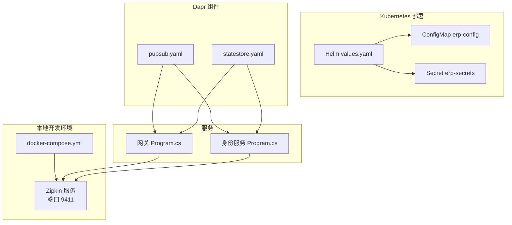
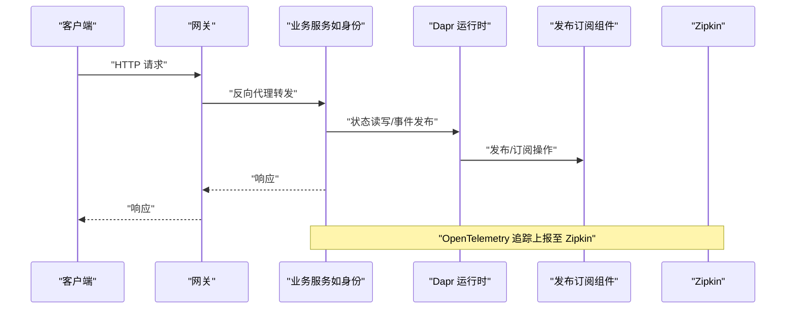
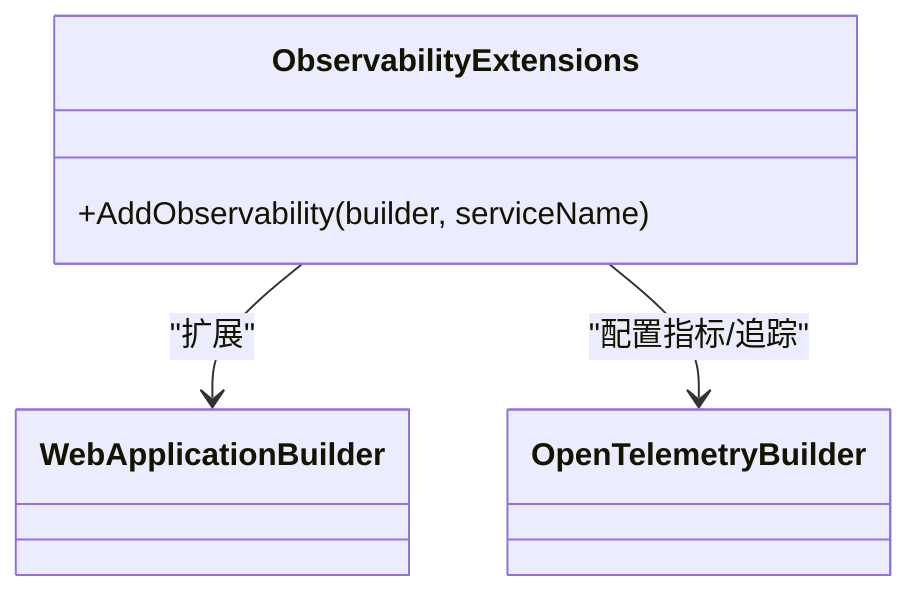
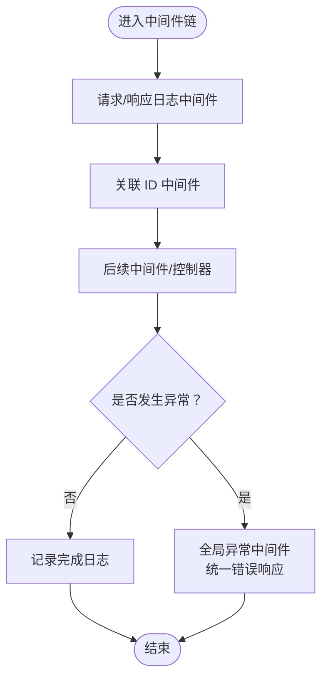
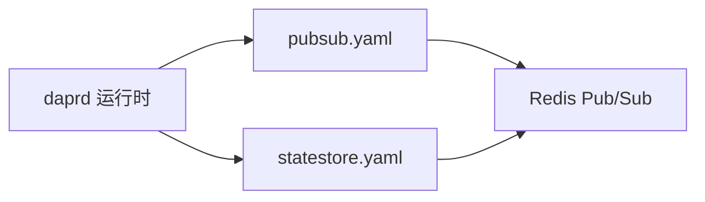
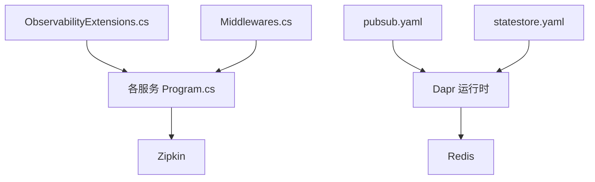

# 监控告警

<cite>
**本文引用的文件**
- [ObservabilityExtensions.cs](file://src/BuildingBlocks/ErpSystem.BuildingBlocks/Observability/ObservabilityExtensions.cs)
- [docker-compose.yml](file://docker-compose.yml)
- [values.yaml](file://deploy/helm/erp-system/values.yaml)
- [configmap.yaml](file://deploy/k8s/configmap.yaml)
- [secrets.yaml](file://deploy/k8s/secrets.yaml)
- [pubsub.yaml](file://components/pubsub.yaml)
- [statestore.yaml](file://components/statestore.yaml)
- [Middlewares.cs](file://src/BuildingBlocks/ErpSystem.BuildingBlocks/Middleware/Middlewares.cs)
- [Program.cs（身份服务）](file://src/Services/Identity/ErpSystem.Identity/Program.cs)
- [Program.cs（网关）](file://src/Gateways/ErpSystem.Gateway/Program.cs)
- [appsettings.json（身份服务）](file://src/Services/Identity/ErpSystem.Identity/appsettings.json)
- [appsettings.json（网关）](file://src/Gateways/ErpSystem.Gateway/appsettings.json)
- [appsettings.Development.json（项目）](file://src/Services/Projects/ErpSystem.Projects/appsettings.Development.json)
</cite>

## 目录
1. [简介](#简介)
2. [项目结构](#项目结构)
3. [核心组件](#核心组件)
4. [架构总览](#架构总览)
5. [组件详解](#组件详解)
6. [依赖关系分析](#依赖关系分析)
7. [性能考量](#性能考量)
8. [故障排查指南](#故障排查指南)
9. [结论](#结论)
10. [附录](#附录)

## 简介
本文件面向运维与开发团队，系统化梳理本项目的可观测性与监控告警方案，覆盖以下方面：
- 分布式运行时（Dapr）可观测性配置：指标采集、链路追踪、日志聚合
- Prometheus 集成：指标暴露、抓取配置、告警规则
- Grafana 仪表板设计：关键业务指标与性能可视化
- ELK Stack 日志收集：日志格式标准化、索引管理、搜索查询
- APM 工具集成：性能监控、错误追踪、用户体验分析
- 告警策略：阈值设定、告警级别、通知渠道
- 故障排查流程、性能优化建议、容量规划指导
- 运维手册：监控仪表板与告警处理清单

## 项目结构
本项目采用多服务微架构，结合 Dapr 作为运行时，提供状态存储与消息发布订阅能力；同时通过 Helm/Kubernetes 与 Docker Compose 提供部署与编排支持。可观测性通过 OpenTelemetry 扩展在各服务中统一启用，并通过 Zipkin 提供链路追踪。

图表来源
- [docker-compose.yml](file://docker-compose.yml#L1-L99)
- [values.yaml](file://deploy/helm/erp-system/values.yaml#L1-L127)
- [configmap.yaml](file://deploy/k8s/configmap.yaml#L1-L25)
- [secrets.yaml](file://deploy/k8s/secrets.yaml#L1-L19)
- [pubsub.yaml](file://components/pubsub.yaml#L1-L13)
- [statestore.yaml](file://components/statestore.yaml#L1-L13)
- [Program.cs（网关）](file://src/Gateways/ErpSystem.Gateway/Program.cs#L1-L107)
- [Program.cs（身份服务）](file://src/Services/Identity/ErpSystem.Identity/Program.cs#L1-L71)

章节来源
- [docker-compose.yml](file://docker-compose.yml#L1-L99)
- [values.yaml](file://deploy/helm/erp-system/values.yaml#L1-L127)
- [configmap.yaml](file://deploy/k8s/configmap.yaml#L1-L25)
- [secrets.yaml](file://deploy/k8s/secrets.yaml#L1-L19)
- [pubsub.yaml](file://components/pubsub.yaml#L1-L13)
- [statestore.yaml](file://components/statestore.yaml#L1-L13)
- [Program.cs（网关）](file://src/Gateways/ErpSystem.Gateway/Program.cs#L1-L107)
- [Program.cs（身份服务）](file://src/Services/Identity/ErpSystem.Identity/Program.cs#L1-L71)

## 核心组件
- 观测性扩展（OpenTelemetry）
  - 在各服务中通过扩展方法启用日志、指标与链路追踪，并默认导出到 OTLP（需配置端点）
  - 指标来源：ASP.NET Core、HTTP 客户端、运行时
  - 追踪来源：ASP.NET Core、HTTP 客户端、服务源码
- 中间件层
  - 请求/响应日志中间件：记录请求开始、完成与异常，包含耗时与状态码
  - 全局异常中间件：统一错误响应格式，便于日志与告警识别
  - 关联 ID 中间件：注入 X-Correlation-ID 头部，贯穿分布式调用链
- Dapr 组件
  - 发布订阅：Redis Pub/Sub
  - 状态存储：Redis
- 链路追踪
  - 本地开发使用 Zipkin 作为追踪后端
  - 生产可替换为 OTLP 导出至外部追踪系统

章节来源
- [ObservabilityExtensions.cs](file://src/BuildingBlocks/ErpSystem.BuildingBlocks/Observability/ObservabilityExtensions.cs#L1-L44)
- [Middlewares.cs](file://src/BuildingBlocks/ErpSystem.BuildingBlocks/Middleware/Middlewares.cs#L1-L125)
- [pubsub.yaml](file://components/pubsub.yaml#L1-L13)
- [statestore.yaml](file://components/statestore.yaml#L1-L13)
- [docker-compose.yml](file://docker-compose.yml#L86-L91)

## 架构总览
下图展示了从客户端到服务、再到 Dapr 与追踪系统的整体链路，以及可观测性数据流。

图表来源
- [Program.cs（网关）](file://src/Gateways/ErpSystem.Gateway/Program.cs#L22-L80)
- [Program.cs（身份服务）](file://src/Services/Identity/ErpSystem.Identity/Program.cs#L1-L71)
- [pubsub.yaml](file://components/pubsub.yaml#L1-L13)
- [docker-compose.yml](file://docker-compose.yml#L86-L91)

## 组件详解

### 观测性扩展（OpenTelemetry）
- 启用项
  - 日志：包含格式化消息与作用域
  - 指标：ASP.NET Core、HTTP 客户端、运行时
  - 追踪：ASP.NET Core、HTTP 客户端、服务源码；导出到 OTLP（需设置端点）
- 使用方式
  - 在服务启动时调用扩展方法，传入服务名
  - 通过环境变量配置 OTLP 导出端点，实现灵活切换追踪后端

图表来源
- [ObservabilityExtensions.cs](file://src/BuildingBlocks/ErpSystem.BuildingBlocks/Observability/ObservabilityExtensions.cs#L10-L42)

章节来源
- [ObservabilityExtensions.cs](file://src/BuildingBlocks/ErpSystem.BuildingBlocks/Observability/ObservabilityExtensions.cs#L1-L44)

### 中间件层（日志与异常）
- 请求/响应日志中间件
  - 记录请求开始、完成与异常，包含请求 ID、方法、路径、状态码、耗时
- 全局异常中间件
  - 统一返回错误类型、标题、状态码，便于日志聚合与告警识别
- 关联 ID 中间件
  - 注入并透传 X-Correlation-ID，支撑跨服务追踪

图表来源
- [Middlewares.cs](file://src/BuildingBlocks/ErpSystem.BuildingBlocks/Middleware/Middlewares.cs#L10-L124)

章节来源
- [Middlewares.cs](file://src/BuildingBlocks/ErpSystem.BuildingBlocks/Middleware/Middlewares.cs#L1-L125)

### Dapr 组件（发布订阅与状态存储）
- 发布订阅：使用 Redis 作为后端，简化事件驱动架构
- 状态存储：使用 Redis 作为状态后端，支持幂等与一致性场景
- 组件挂载：通过 docker-compose 将组件目录挂载给 daprd

图表来源
- [pubsub.yaml](file://components/pubsub.yaml#L1-L13)
- [statestore.yaml](file://components/statestore.yaml#L1-L13)
- [docker-compose.yml](file://docker-compose.yml#L24-L28)

章节来源
- [pubsub.yaml](file://components/pubsub.yaml#L1-L13)
- [statestore.yaml](file://components/statestore.yaml#L1-L13)
- [docker-compose.yml](file://docker-compose.yml#L21-L28)

### 链路追踪（Zipkin）
- 本地开发使用 Zipkin 作为追踪后端，端口 9411
- 生产环境可替换为 OTLP 导出至外部追踪平台（如 Jaeger、Elastic APM）

章节来源
- [docker-compose.yml](file://docker-compose.yml#L86-L91)

### 配置与部署要点
- Helm/Kubernetes
  - values.yaml 控制镜像仓库、副本数、资源限制、Dapr 开关与组件选择
  - ConfigMap 提供环境变量与服务 URL
  - Secrets 存放数据库密码、JWT 密钥、Redis 密码、Dapr API Token
- Docker Compose
  - 启动 placement、redis、postgres、zipkin
  - 为每个服务启动对应的 daprd 容器，挂载组件目录

章节来源
- [values.yaml](file://deploy/helm/erp-system/values.yaml#L1-L127)
- [configmap.yaml](file://deploy/k8s/configmap.yaml#L1-L25)
- [secrets.yaml](file://deploy/k8s/secrets.yaml#L1-L19)
- [docker-compose.yml](file://docker-compose.yml#L57-L91)

## 依赖关系分析
- 服务对可观测性的依赖
  - 各服务通过扩展方法引入 OpenTelemetry，形成统一的日志、指标与追踪基线
- 中间件对日志与异常处理的依赖
  - 请求/响应日志中间件与全局异常中间件共同构成可观测性输出的“可见性”基础
- Dapr 对 Redis 的依赖
  - 发布订阅与状态存储均依赖 Redis，需确保网络连通与认证配置正确
- 追踪后端对 Zipkin 的依赖
  - 本地开发默认使用 Zipkin；生产可替换为 OTLP 导出

图表来源
- [ObservabilityExtensions.cs](file://src/BuildingBlocks/ErpSystem.BuildingBlocks/Observability/ObservabilityExtensions.cs#L10-L42)
- [Middlewares.cs](file://src/BuildingBlocks/ErpSystem.BuildingBlocks/Middleware/Middlewares.cs#L10-L124)
- [pubsub.yaml](file://components/pubsub.yaml#L1-L13)
- [statestore.yaml](file://components/statestore.yaml#L1-L13)
- [Program.cs（网关）](file://src/Gateways/ErpSystem.Gateway/Program.cs#L1-L107)
- [Program.cs（身份服务）](file://src/Services/Identity/ErpSystem.Identity/Program.cs#L1-L71)

章节来源
- [ObservabilityExtensions.cs](file://src/BuildingBlocks/ErpSystem.BuildingBlocks/Observability/ObservabilityExtensions.cs#L1-L44)
- [Middlewares.cs](file://src/BuildingBlocks/ErpSystem.BuildingBlocks/Middleware/Middlewares.cs#L1-L125)
- [Program.cs（网关）](file://src/Gateways/ErpSystem.Gateway/Program.cs#L1-L107)
- [Program.cs（身份服务）](file://src/Services/Identity/ErpSystem.Identity/Program.cs#L1-L71)

## 性能考量
- 指标采集
  - 默认启用 ASP.NET Core、HTTP 客户端、运行时指标，建议结合业务关键指标（如请求延迟、错误率、吞吐量）进行补充
- 追踪采样
  - 在高流量场景下建议降低采样率或按业务重要性采样，避免追踪数据膨胀
- 日志级别
  - 生产环境建议使用 Information 级别，开发环境可使用 Debug 以提升诊断能力
- 资源与副本
  - Helm values.yaml 中已设置 CPU/内存请求与限制，建议根据实际压测结果调整副本数与资源配额

章节来源
- [ObservabilityExtensions.cs](file://src/BuildingBlocks/ErpSystem.BuildingBlocks/Observability/ObservabilityExtensions.cs#L22-L39)
- [appsettings.json（身份服务）](file://src/Services/Identity/ErpSystem.Identity/appsettings.json#L1-L10)
- [appsettings.json（网关）](file://src/Gateways/ErpSystem.Gateway/appsettings.json#L1-L229)
- [appsettings.Development.json（项目）](file://src/Services/Projects/ErpSystem.Projects/appsettings.Development.json#L1-L7)
- [values.yaml](file://deploy/helm/erp-system/values.yaml#L11-L19)

## 故障排查指南
- 追踪无法显示
  - 检查 OTLP 端点是否配置（扩展方法要求设置导出端点）
  - 本地开发确认 Zipkin 可访问（端口 9411）
- 日志缺失或不完整
  - 确认日志中间件已注册且日志级别正确
  - 检查异常是否被全局异常中间件捕获并返回
- Dapr 组件不可用
  - 确认 daprd 已启动并与组件目录正确挂载
  - 检查 Redis 连接参数与网络连通性
- 健康检查
  - 各服务已注册健康检查端点，可通过 /health 排查服务可用性

章节来源
- [ObservabilityExtensions.cs](file://src/BuildingBlocks/ErpSystem.BuildingBlocks/Observability/ObservabilityExtensions.cs#L36-L38)
- [docker-compose.yml](file://docker-compose.yml#L86-L91)
- [Middlewares.cs](file://src/BuildingBlocks/ErpSystem.BuildingBlocks/Middleware/Middlewares.cs#L10-L49)
- [Program.cs（网关）](file://src/Gateways/ErpSystem.Gateway/Program.cs#L66-L80)
- [Program.cs（身份服务）](file://src/Services/Identity/ErpSystem.Identity/Program.cs#L41-L56)

## 结论
本项目在多服务架构下，通过 OpenTelemetry 统一日志、指标与追踪，结合 Dapr 的发布订阅与状态存储，构建了可扩展的可观测性基线。配合 Zipkin 的链路追踪与 Helm/Kubernetes 的部署配置，能够快速落地监控告警体系。建议在生产环境中完善 OTLP 导出、Prometheus 抓取、Grafana 仪表板与 ELK 日志聚合，并制定明确的告警策略与运维手册。

## 附录

### Prometheus 集成（建议）
- 指标暴露
  - 通过 OpenTelemetry .NET 的 Prometheus Exporter 或直接启用 ASP.NET Core 内置指标端点
- 抓取配置
  - 在 Prometheus 中添加服务端点作为目标，按服务维度分组
- 告警规则
  - 示例规则（阈值与级别需结合业务实际评估）
    - 请求错误率（5xx）超过阈值持续一段时间触发告警
    - 请求延迟 P95 超过阈值触发告警
    - 副本可用性低于阈值触发告警

### Grafana 仪表板设计（建议）
- 关键指标
  - QPS、错误率、P50/P90/P95 延迟
  - CPU/内存使用率、GC 次数与堆大小
  - HTTP 客户端失败次数、重试次数
- 可视化建议
  - 多面板组合：吞吐量与延迟、错误率与 P95 延迟、资源使用趋势
  - 使用注释面板标注变更与故障时间点

### ELK Stack 日志收集（建议）
- 日志格式标准化
  - 统一 JSON 格式，包含时间戳、服务名、关联 ID、请求 ID、方法、路径、状态码、耗时、异常信息
- 索引管理
  - 按天滚动索引，保留 30–90 天
- 搜索查询
  - 常用查询：按服务名过滤、按错误类型筛选、按关联 ID 聚合

### APM 工具集成（建议）
- 性能监控
  - 使用外部追踪平台（如 Jaeger、Elastic APM）替代 Zipkin
- 错误追踪
  - 通过全局异常中间件统一错误响应，便于 APM 自动识别错误
- 用户体验分析
  - 结合前端埋点与后端追踪，定位端到端性能瓶颈

### 告警策略设计（建议）
- 阈值设置
  - 错误率：生产环境建议 0.1%~1%
  - 延迟：P95 建议与 SLA 对齐
  - 资源：CPU/内存使用率超过 80% 持续 5 分钟
- 告警级别
  - 严重：影响用户、SLA 不达标
  - 警告：潜在风险、趋势异常
  - 通知渠道
    - 钉钉/企业微信机器人、邮件、电话（严重级别）