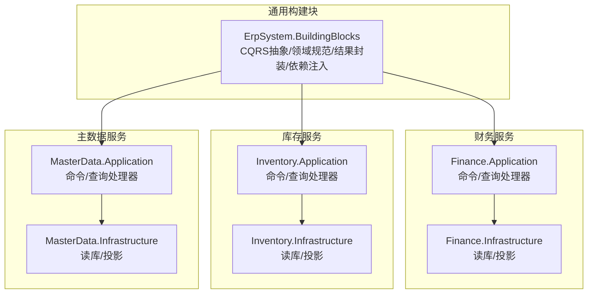
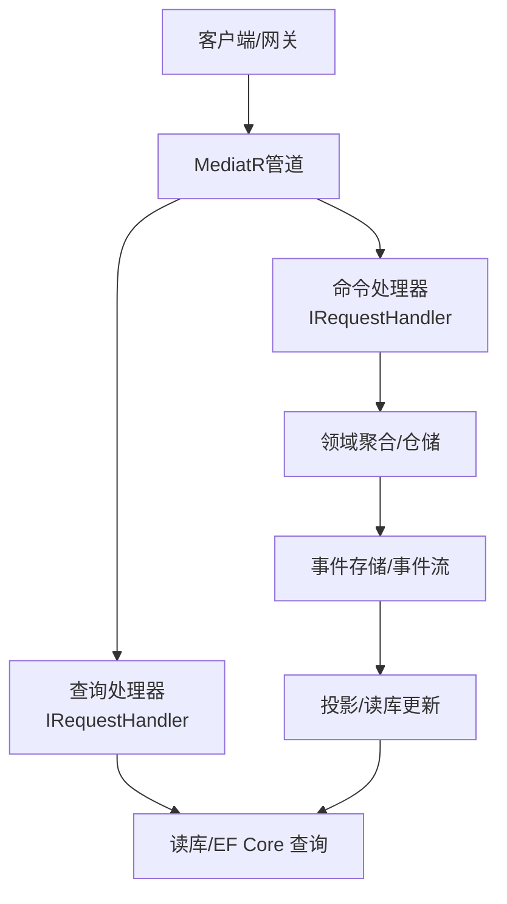
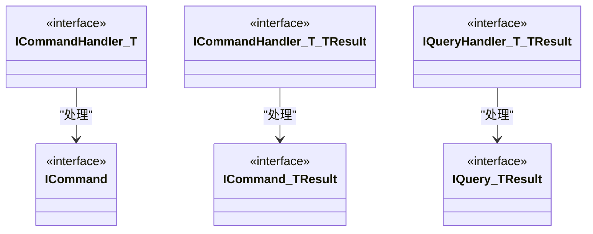
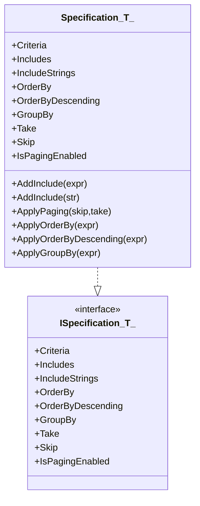
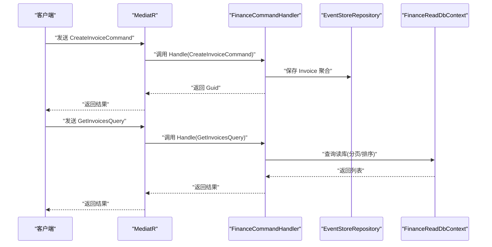
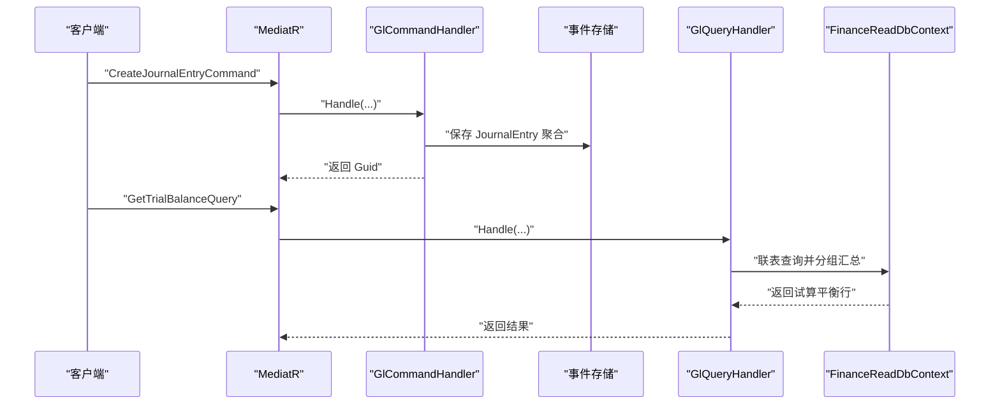
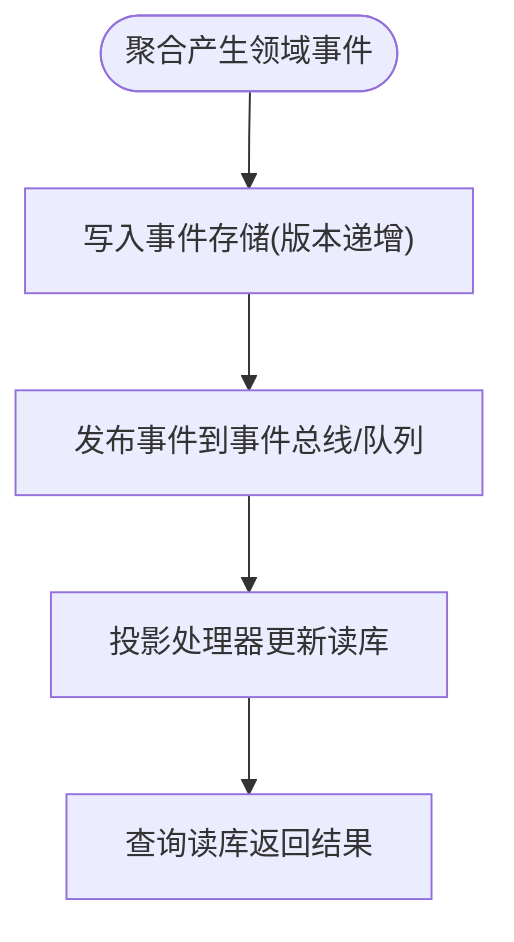
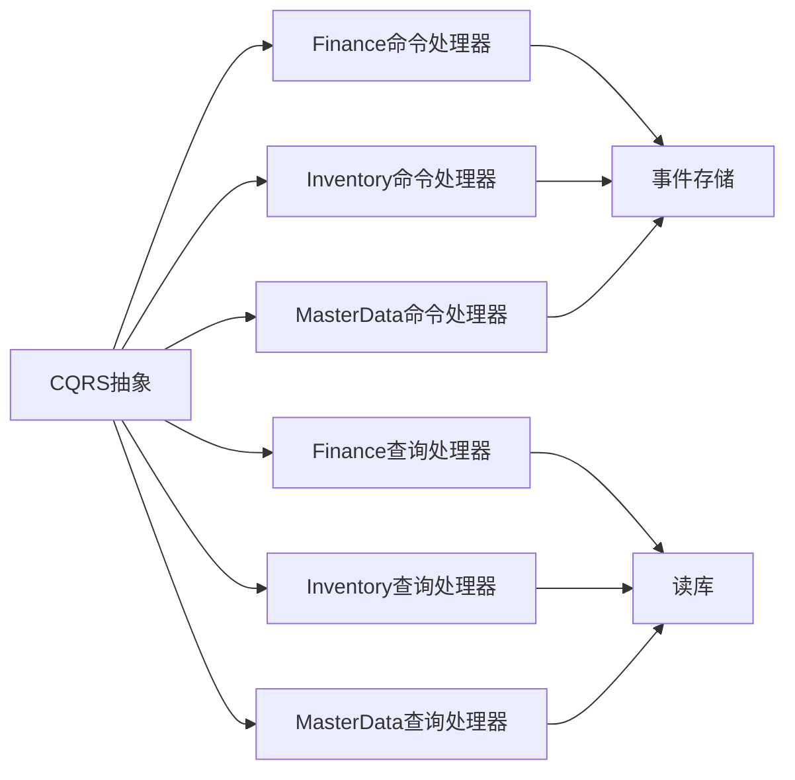

# CQRS模式实现

<cite>
**本文档引用的文件**
- [Abstractions.cs](file://src/BuildingBlocks/ErpSystem.BuildingBlocks/CQRS/Abstractions.cs)
- [ISpecification.cs](file://src/BuildingBlocks/ErpSystem.BuildingBlocks/Domain/Specifications/ISpecification.cs)
- [Specification.cs](file://src/BuildingBlocks/ErpSystem.BuildingBlocks/Domain/Specifications/Specification.cs)
- [Result.cs](file://src/BuildingBlocks/ErpSystem.BuildingBlocks/Common/Result.cs)
- [DependencyInjection.cs](file://src/BuildingBlocks/ErpSystem.BuildingBlocks/DependencyInjection.cs)
- [FinanceCommands.cs](file://src/Services/Finance/ErpSystem.Finance/Application/FinanceCommands.cs)
- [FinanceQueries.cs](file://src/Services/Finance/ErpSystem.Finance/Application/FinanceQueries.cs)
- [GLCommands.cs](file://src/Services/Finance/ErpSystem.Finance/Application/GLCommands.cs)
- [GLQueries.cs](file://src/Services/Finance/ErpSystem.Finance/Application/GLQueries.cs)
- [BOMCommands.cs](file://src/Services/MasterData/ErpSystem.MasterData/Application/BOMCommands.cs)
- [BOMQueries.cs](file://src/Services/MasterData/ErpSystem.MasterData/Application/BOMQueries.cs)
- [InventoryCommands.cs](file://src/Services/Inventory/ErpSystem.Inventory/Application/InventoryCommands.cs)
- [InventoryQueries.cs](file://src/Services/Inventory/ErpSystem.Inventory/Application/InventoryQueries.cs)
- [EventStore.cs](file://src/BuildingBlocks/ErpSystem.BuildingBlocks/Domain/DDDBase.cs)
- [EventStoreDbContext.cs](file://src/Services/Identity/ErpSystem.Identity/Infrastructure/EventStore.cs)
</cite>

## 目录
1. [引言](#引言)
2. [项目结构](#项目结构)
3. [核心组件](#核心组件)
4. [架构总览](#架构总览)
5. [详细组件分析](#详细组件分析)
6. [依赖关系分析](#依赖关系分析)
7. [性能考虑](#性能考虑)
8. [故障排除指南](#故障排除指南)
9. [结论](#结论)
10. [附录](#附录)

## 引言
本文件系统性阐述该ERP微服务仓库中基于MediatR的CQRS（命令查询职责分离）实现，覆盖以下主题：
- 命令与查询的抽象定义、处理器实现模式
- 规格模式（Specification Pattern）在查询条件组合与动态过滤中的应用
- 读写模型分离策略、事件溯源集成与数据一致性保障
- 在微服务架构中的优势与最佳实践
- 具体代码示例路径，帮助快速定位实现位置

## 项目结构
该仓库采用“按领域分层 + 按功能分模块”的组织方式：
- BuildingBlocks：跨服务通用能力（CQRS抽象、领域规范、结果封装、依赖注入等）
- Services：各业务域微服务（Finance、Inventory、MasterData等），每个包含Application（命令/查询）、Domain（聚合与事件）、Infrastructure（读库投影等）

图表来源
- [DependencyInjection.cs](file://src/BuildingBlocks/ErpSystem.BuildingBlocks/DependencyInjection.cs#L10-L31)
- [FinanceCommands.cs](file://src/Services/Finance/ErpSystem.Finance/Application/FinanceCommands.cs#L45-L142)
- [FinanceQueries.cs](file://src/Services/Finance/ErpSystem.Finance/Application/FinanceQueries.cs#L24-L111)
- [InventoryCommands.cs](file://src/Services/Inventory/ErpSystem.Inventory/Application/InventoryCommands.cs#L60-L142)
- [InventoryQueries.cs](file://src/Services/Inventory/ErpSystem.Inventory/Application/InventoryQueries.cs#L11-L48)
- [BOMCommands.cs](file://src/Services/MasterData/ErpSystem.MasterData/Application/BOMCommands.cs#L25-L47)
- [BOMQueries.cs](file://src/Services/MasterData/ErpSystem.MasterData/Application/BOMQueries.cs#L6-L23)

章节来源
- [DependencyInjection.cs](file://src/BuildingBlocks/ErpSystem.BuildingBlocks/DependencyInjection.cs#L10-L31)

## 核心组件
- CQRS抽象层：统一命令/查询与处理器接口，确保读写职责清晰分离
- 规格模式：以表达式树描述查询条件，支持动态组合与分页排序
- 结果封装：统一成功/失败与错误信息返回，避免空值风险
- 依赖注入：集中注册MediatR行为（日志、验证、幂等）与用户上下文

章节来源
- [Abstractions.cs](file://src/BuildingBlocks/ErpSystem.BuildingBlocks/CQRS/Abstractions.cs#L7-L39)
- [ISpecification.cs](file://src/BuildingBlocks/ErpSystem.BuildingBlocks/Domain/Specifications/ISpecification.cs#L5-L18)
- [Specification.cs](file://src/BuildingBlocks/ErpSystem.BuildingBlocks/Domain/Specifications/Specification.cs#L5-L50)
- [Result.cs](file://src/BuildingBlocks/ErpSystem.BuildingBlocks/Common/Result.cs#L3-L56)
- [DependencyInjection.cs](file://src/BuildingBlocks/ErpSystem.BuildingBlocks/DependencyInjection.cs#L12-L29)

## 架构总览
CQRS在本项目中的落地要点：
- 写模型（命令）：通过MediatR处理命令，调用领域聚合并持久化事件或状态变更
- 读模型（查询）：直接从读库（EF Core）查询，支持分页、排序、筛选
- 事件溯源：聚合变更以事件形式存储，读模型通过投影更新
- 统一抽象：所有命令/查询均实现对应接口，处理器实现IRequestHandler<T,R>

图表来源
- [Abstractions.cs](file://src/BuildingBlocks/ErpSystem.BuildingBlocks/CQRS/Abstractions.cs#L10-L39)
- [EventStore.cs](file://src/BuildingBlocks/ErpSystem.BuildingBlocks/Domain/DDDBase.cs#L59-L87)
- [EventStoreDbContext.cs](file://src/Services/Identity/ErpSystem.Identity/Infrastructure/EventStore.cs#L6-L19)

## 详细组件分析

### CQRS抽象与处理器模式
- 命令接口：无返回值命令实现ICommand；带返回值命令实现ICommand<TResult>
- 查询接口：IQuery<TResult>用于只读查询
- 处理器接口：ICommandHandler<TCommand>、ICommandHandler<TCommand,TResult>、IQueryHandler<TQuery,TResult>
- 实践：各服务Application层以record定义命令/查询，处理器类实现IRequestHandler接口

图表来源
- [Abstractions.cs](file://src/BuildingBlocks/ErpSystem.BuildingBlocks/CQRS/Abstractions.cs#L10-L39)

章节来源
- [Abstractions.cs](file://src/BuildingBlocks/ErpSystem.BuildingBlocks/CQRS/Abstractions.cs#L7-L39)

### 规格模式（Specification Pattern）实现
- 接口ISpecification<T>：定义Criteria、Includes、OrderBy/Descending、GroupBy、分页参数等
- 抽象基类Specification<T>：提供受保护的构建方法（添加Include、应用排序/分组、应用分页）
- 使用场景：读模型查询可组合Criteria表达式，动态拼接Include/排序/分页

图表来源
- [ISpecification.cs](file://src/BuildingBlocks/ErpSystem.BuildingBlocks/Domain/Specifications/ISpecification.cs#L5-L18)
- [Specification.cs](file://src/BuildingBlocks/ErpSystem.BuildingBlocks/Domain/Specifications/Specification.cs#L5-L50)

章节来源
- [ISpecification.cs](file://src/BuildingBlocks/ErpSystem.BuildingBlocks/Domain/Specifications/ISpecification.cs#L5-L18)
- [Specification.cs](file://src/BuildingBlocks/ErpSystem.BuildingBlocks/Domain/Specifications/Specification.cs#L5-L50)

### 财务服务：命令与查询示例
- 命令示例：发票创建、收款登记、入账、核销、作废等
- 查询示例：发票列表/详情、收款列表、账龄分析/逾期查询
- 处理器模式：命令处理器实现多个IRequestHandler接口；查询处理器实现多个IRequestHandler接口

图表来源
- [FinanceCommands.cs](file://src/Services/Finance/ErpSystem.Finance/Application/FinanceCommands.cs#L45-L142)
- [FinanceQueries.cs](file://src/Services/Finance/ErpSystem.Finance/Application/FinanceQueries.cs#L24-L111)

章节来源
- [FinanceCommands.cs](file://src/Services/Finance/ErpSystem.Finance/Application/FinanceCommands.cs#L7-L142)
- [FinanceQueries.cs](file://src/Services/Finance/ErpSystem.Finance/Application/FinanceQueries.cs#L7-L111)

### 总账（GL）命令与查询
- 命令：会计科目定义/更新、凭证创建/过账、会计期间定义/关闭
- 查询：科目表、凭证明细、试算平衡
- 处理器：命令处理器使用事件存储；查询处理器直接查询读库

图表来源
- [GLCommands.cs](file://src/Services/Finance/ErpSystem.Finance/Application/GLCommands.cs#L19-L93)
- [GLQueries.cs](file://src/Services/Finance/ErpSystem.Finance/Application/GLQueries.cs#L19-L80)

章节来源
- [GLCommands.cs](file://src/Services/Finance/ErpSystem.Finance/Application/GLCommands.cs#L8-L93)
- [GLQueries.cs](file://src/Services/Finance/ErpSystem.Finance/Application/GLQueries.cs#L7-L80)

### 主数据（BOM）命令与查询
- 命令：新增组件、激活BOM
- 查询：BOM列表/详情/按父物料筛选
- 处理器：命令处理器使用事件存储仓储；查询使用EF Core读库

章节来源
- [BOMCommands.cs](file://src/Services/MasterData/ErpSystem.MasterData/Application/BOMCommands.cs#L15-L47)
- [BOMQueries.cs](file://src/Services/MasterData/ErpSystem.MasterData/Application/BOMQueries.cs#L8-L23)

### 库存服务：命令与查询
- 命令：收货、转移、发货、预留/释放、盘点调整
- 查询：按仓库/储位/物料定位、搜索、交易流水
- 处理器：命令使用事件存储仓储；查询使用读库

章节来源
- [InventoryCommands.cs](file://src/Services/Inventory/ErpSystem.Inventory/Application/InventoryCommands.cs#L9-L142)
- [InventoryQueries.cs](file://src/Services/Inventory/ErpSystem.Inventory/Application/InventoryQueries.cs#L7-L48)

### 依赖注入与横切关注点
- 注册验证器、日志与验证行为
- 注入用户上下文，便于鉴权与审计

章节来源
- [DependencyInjection.cs](file://src/BuildingBlocks/ErpSystem.BuildingBlocks/DependencyInjection.cs#L12-L29)

### 事件溯源与读模型投影
- 事件存储：聚合变更以事件流持久化，支持版本化与发布事件
- 读模型：通过事件驱动的投影更新读库，查询时无需回放历史

图表来源
- [EventStore.cs](file://src/BuildingBlocks/ErpSystem.BuildingBlocks/Domain/DDDBase.cs#L59-L87)
- [EventStoreDbContext.cs](file://src/Services/Identity/ErpSystem.Identity/Infrastructure/EventStore.cs#L6-L19)

章节来源
- [EventStore.cs](file://src/BuildingBlocks/ErpSystem.BuildingBlocks/Domain/DDDBase.cs#L53-L87)
- [EventStoreDbContext.cs](file://src/Services/Identity/ErpSystem.Identity/Infrastructure/EventStore.cs#L6-L19)

## 依赖关系分析
- 组件内聚：每个服务的Application层仅暴露命令/查询与处理器，Domain负责业务规则，Infrastructure负责读写实现
- 组件耦合：通过MediatR解耦请求与处理器；通过事件存储与投影实现读写解耦
- 外部依赖：MediatR、EF Core、事件存储（Jsonb持久化）

图表来源
- [Abstractions.cs](file://src/BuildingBlocks/ErpSystem.BuildingBlocks/CQRS/Abstractions.cs#L10-L39)
- [FinanceCommands.cs](file://src/Services/Finance/ErpSystem.Finance/Application/FinanceCommands.cs#L45-L142)
- [FinanceQueries.cs](file://src/Services/Finance/ErpSystem.Finance/Application/FinanceQueries.cs#L24-L111)
- [InventoryCommands.cs](file://src/Services/Inventory/ErpSystem.Inventory/Application/InventoryCommands.cs#L60-L142)
- [InventoryQueries.cs](file://src/Services/Inventory/ErpSystem.Inventory/Application/InventoryQueries.cs#L11-L48)
- [BOMCommands.cs](file://src/Services/MasterData/ErpSystem.MasterData/Application/BOMCommands.cs#L25-L47)
- [BOMQueries.cs](file://src/Services/MasterData/ErpSystem.MasterData/Application/BOMQueries.cs#L6-L23)

## 性能考虑
- 查询优化：读库使用AsNoTracking、索引字段（如日期、状态、PartyId）与分页
- 事件存储：批量写入、事件序列化为Jsonb，减少Schema复杂度
- 投影策略：按需投影，避免过度连接；对高频查询可引入物化视图或缓存
- 幂等处理：通过幂等行为避免重复执行命令

## 故障排除指南
- 命令处理异常：检查KeyNotFoundException（对象不存在）、验证器失败（ValidationBehavior）
- 查询异常：确认读库连接、分页参数、过滤条件是否正确
- 事件存储问题：检查事件版本号、事件类型解析、事件持久化是否成功

章节来源
- [FinanceCommands.cs](file://src/Services/Finance/ErpSystem.Finance/Application/FinanceCommands.cs#L81-L100)
- [FinanceQueries.cs](file://src/Services/Finance/ErpSystem.Finance/Application/FinanceQueries.cs#L58-L60)
- [DependencyInjection.cs](file://src/BuildingBlocks/ErpSystem.BuildingBlocks/DependencyInjection.cs#L20-L23)

## 结论
本项目以MediatR为核心，结合事件存储与读库投影，实现了清晰的CQRS架构：
- 命令与查询职责分离，提升可维护性与扩展性
- 规格模式支持灵活的查询条件组合与分页排序
- 事件溯源保障历史可追溯与最终一致性
- 在微服务中，读写分离与事件驱动使系统具备良好的横向扩展能力

## 附录
- 代码示例路径（不展示具体代码内容）：
  - 命令定义与处理器：[FinanceCommands.cs](file://src/Services/Finance/ErpSystem.Finance/Application/FinanceCommands.cs#L7-L142)、[GLCommands.cs](file://src/Services/Finance/ErpSystem.Finance/Application/GLCommands.cs#L8-L93)
  - 查询定义与处理器：[FinanceQueries.cs](file://src/Services/Finance/ErpSystem.Finance/Application/FinanceQueries.cs#L7-L111)、[GLQueries.cs](file://src/Services/Finance/ErpSystem.Finance/Application/GLQueries.cs#L7-L80)
  - 规格模式接口与实现：[ISpecification.cs](file://src/BuildingBlocks/ErpSystem.BuildingBlocks/Domain/Specifications/ISpecification.cs#L5-L18)、[Specification.cs](file://src/BuildingBlocks/ErpSystem.BuildingBlocks/Domain/Specifications/Specification.cs#L5-L50)
  - 事件存储与读库：[EventStore.cs](file://src/BuildingBlocks/ErpSystem.BuildingBlocks/Domain/DDDBase.cs#L59-L87)、[EventStoreDbContext.cs](file://src/Services/Identity/ErpSystem.Identity/Infrastructure/EventStore.cs#L6-L19)