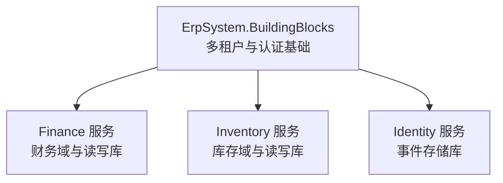
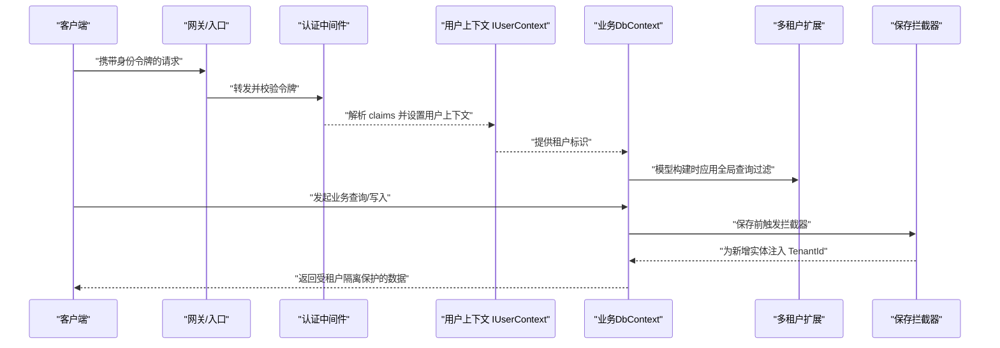
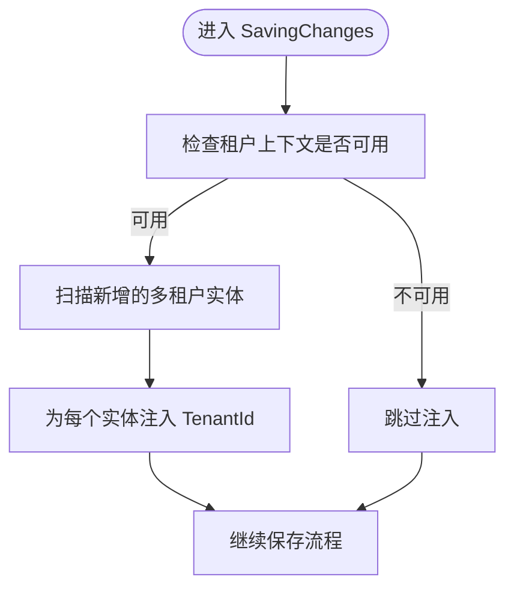
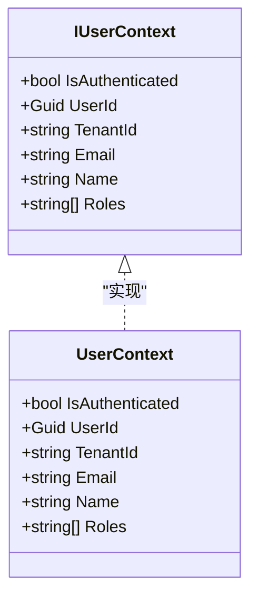
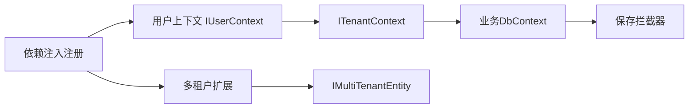

# 多租户支持

<cite>
**本文引用的文件**
- [src/BuildingBlocks/ErpSystem.BuildingBlocks/MultiTenancy/MultiTenancy.cs](file://src/BuildingBlocks/ErpSystem.BuildingBlocks/MultiTenancy/MultiTenancy.cs)
- [src/BuildingBlocks/ErpSystem.BuildingBlocks/Auth/IUserContext.cs](file://src/BuildingBlocks/ErpSystem.BuildingBlocks/Auth/IUserContext.cs)
- [src/BuildingBlocks/ErpSystem.BuildingBlocks/Auth/UserContext.cs](file://src/BuildingBlocks/ErpSystem.BuildingBlocks/Auth/UserContext.cs)
- [src/BuildingBlocks/ErpSystem.BuildingBlocks/DependencyInjection.cs](file://src/BuildingBlocks/ErpSystem.BuildingBlocks/DependencyInjection.cs)
- [src/Services/Finance/ErpSystem.Finance/Infrastructure/FinanceDbContexts.cs](file://src/Services/Finance/ErpSystem.Finance/Infrastructure/FinanceDbContexts.cs)
- [src/Services/Inventory/ErpSystem.Inventory/Infrastructure/InventoryDbContexts.cs](file://src/Services/Inventory/ErpSystem.Inventory/Infrastructure/InventoryDbContexts.cs)
- [src/Services/Identity/ErpSystem.Identity/Infrastructure/EventStoreDbContext.cs](file://src/Services/Identity/ErpSystem.Identity/Infrastructure/EventStoreDbContext.cs)
- [src/Services/Finance/ErpSystem.Finance/Domain/InvoiceAggregate.cs](file://src/Services/Finance/ErpSystem.Finance/Domain/InvoiceAggregate.cs)
- [src/Services/Inventory/ErpSystem.Inventory/Domain/InventoryItemAggregate.cs](file://src/Services/Inventory/ErpSystem.Inventory/Domain/InventoryItemAggregate.cs)
- [src/Services/Identity/ErpSystem.Identity/Domain/UserAggregate.cs](file://src/Services/Identity/ErpSystem.Identity/Domain/UserAggregate.cs)
</cite>

## 目录
1. [引言](#引言)
2. [项目结构](#项目结构)
3. [核心组件](#核心组件)
4. [架构总览](#架构总览)
5. [详细组件分析](#详细组件分析)
6. [依赖关系分析](#依赖关系分析)
7. [性能考量](#性能考量)
8. [故障排查指南](#故障排查指南)
9. [结论](#结论)
10. [附录：实现与配置示例路径](#附录实现与配置示例路径)

## 引言
本文件系统性阐述该 ERP 微服务仓库中的多租户（Multi-Tenancy）支持设计与实现，覆盖以下关键主题：
- 多租户架构设计原则、租户隔离策略与数据分区机制
- 租户标识的获取与验证、租户上下文管理
- 租户特定配置与跨租户访问限制
- 在身份认证与授权中的集成方式
- 部署与运维考虑、性能优化与安全策略
- 提供可直接定位到源码的示例路径，帮助在应用中快速落地多租户能力

## 项目结构
该仓库采用“领域驱动设计 + CQRS + 事件溯源”的分层与按服务拆分的组织方式。多租户能力主要由“基础模块”提供通用基础设施，并在各业务服务中通过 DbContext、聚合与拦截器等实现租户隔离。

图表来源
- [src/BuildingBlocks/ErpSystem.BuildingBlocks/MultiTenancy/MultiTenancy.cs](file://src/BuildingBlocks/ErpSystem.BuildingBlocks/MultiTenancy/MultiTenancy.cs#L1-L100)
- [src/BuildingBlocks/ErpSystem.BuildingBlocks/Auth/UserContext.cs](file://src/BuildingBlocks/ErpSystem.BuildingBlocks/Auth/UserContext.cs#L1-L34)
- [src/Services/Finance/ErpSystem.Finance/Infrastructure/FinanceDbContexts.cs](file://src/Services/Finance/ErpSystem.Finance/Infrastructure/FinanceDbContexts.cs#L1-L132)
- [src/Services/Inventory/ErpSystem.Inventory/Infrastructure/InventoryDbContexts.cs](file://src/Services/Inventory/ErpSystem.Inventory/Infrastructure/InventoryDbContexts.cs#L1-L79)
- [src/Services/Identity/ErpSystem.Identity/Infrastructure/EventStoreDbContext.cs](file://src/Services/Identity/ErpSystem.Identity/Infrastructure/EventStoreDbContext.cs#L1-L19)

章节来源
- [src/BuildingBlocks/ErpSystem.BuildingBlocks/MultiTenancy/MultiTenancy.cs](file://src/BuildingBlocks/ErpSystem.BuildingBlocks/MultiTenancy/MultiTenancy.cs#L1-L100)
- [src/BuildingBlocks/ErpSystem.BuildingBlocks/Auth/UserContext.cs](file://src/BuildingBlocks/ErpSystem.BuildingBlocks/Auth/UserContext.cs#L1-L34)

## 核心组件
- 多租户上下文与实体标记
  - ITenantContext：提供当前请求上下文中的租户标识与可用性判断
  - IMultiTenantEntity：多租户实体的标记接口，统一要求具备 TenantId 字段
- 全局查询过滤与索引
  - MultiTenancyExtensions.ConfigureMultiTenancy：为指定实体类型注册全局查询过滤器，确保读取时自动带入租户条件；同时为 TenantId 建立索引以提升查询性能
  - MultiTenancyExtensions.ApplyMultiTenancyConfiguration：扫描所有实体类型，对实现 IMultiTenantEntity 的实体批量应用上述过滤与索引
- 写入拦截与租户注入
  - MultiTenantSaveChangesInterceptor：在保存变更前，自动为新增的多租户实体填充 TenantId，避免遗漏导致的跨租户数据泄露
- 用户上下文与认证集成
  - IUserContext / UserContext：从 HTTP 上下文中解析用户身份信息，包含租户标识（tenant_id），用于后续多租户逻辑与鉴权

章节来源
- [src/BuildingBlocks/ErpSystem.BuildingBlocks/MultiTenancy/MultiTenancy.cs](file://src/BuildingBlocks/ErpSystem.BuildingBlocks/MultiTenancy/MultiTenancy.cs#L12-L63)
- [src/BuildingBlocks/ErpSystem.BuildingBlocks/MultiTenancy/MultiTenancy.cs](file://src/BuildingBlocks/ErpSystem.BuildingBlocks/MultiTenancy/MultiTenancy.cs#L68-L99)
- [src/BuildingBlocks/ErpSystem.BuildingBlocks/Auth/IUserContext.cs](file://src/BuildingBlocks/ErpSystem.BuildingBlocks/Auth/IUserContext.cs#L1-L12)
- [src/BuildingBlocks/ErpSystem.BuildingBlocks/Auth/UserContext.cs](file://src/BuildingBlocks/ErpSystem.BuildingBlocks/Auth/UserContext.cs#L6-L33)

## 架构总览
多租户在该系统中的运行时流程如下：
- 身份认证后，HTTP 请求中携带包含租户标识的声明
- 应用启动时通过依赖注入注册用户上下文与多租户扩展
- 各业务服务的 DbContext 在模型构建阶段应用全局查询过滤与索引
- 写入阶段通过拦截器自动注入 TenantId，保证新增数据归属正确租户
- 查询阶段自动附加租户过滤，防止跨租户数据泄露

图表来源
- [src/BuildingBlocks/ErpSystem.BuildingBlocks/Auth/UserContext.cs](file://src/BuildingBlocks/ErpSystem.BuildingBlocks/Auth/UserContext.cs#L6-L33)
- [src/BuildingBlocks/ErpSystem.BuildingBlocks/MultiTenancy/MultiTenancy.cs](file://src/BuildingBlocks/ErpSystem.BuildingBlocks/MultiTenancy/MultiTenancy.cs#L29-L63)
- [src/BuildingBlocks/ErpSystem.BuildingBlocks/MultiTenancy/MultiTenancy.cs](file://src/BuildingBlocks/ErpSystem.BuildingBlocks/MultiTenancy/MultiTenancy.cs#L68-L99)

## 详细组件分析

### 组件A：多租户扩展与拦截器
- 设计要点
  - 使用 EF Core 的全局查询过滤器，对所有实现 IMultiTenantEntity 的实体自动追加租户条件
  - 对 TenantId 建立索引，降低过滤与联接成本
  - 通过 SaveChanges 拦截器在新增实体时自动填充 TenantId，避免业务层遗漏
- 关键流程图（拦截器）

图表来源
- [src/BuildingBlocks/ErpSystem.BuildingBlocks/MultiTenancy/MultiTenancy.cs](file://src/BuildingBlocks/ErpSystem.BuildingBlocks/MultiTenancy/MultiTenancy.cs#L68-L99)

章节来源
- [src/BuildingBlocks/ErpSystem.BuildingBlocks/MultiTenancy/MultiTenancy.cs](file://src/BuildingBlocks/ErpSystem.BuildingBlocks/MultiTenancy/MultiTenancy.cs#L29-L63)
- [src/BuildingBlocks/ErpSystem.BuildingBlocks/MultiTenancy/MultiTenancy.cs](file://src/BuildingBlocks/ErpSystem.BuildingBlocks/MultiTenancy/MultiTenancy.cs#L68-L99)

### 组件B：用户上下文与租户标识解析
- 设计要点
  - 从 HTTP 上下文的 Claims 中提取用户标识、邮箱、姓名与角色列表
  - 重点：从 Claims 中读取租户标识（tenant_id），作为后续多租户逻辑的依据
- 类关系图

图表来源
- [src/BuildingBlocks/ErpSystem.BuildingBlocks/Auth/IUserContext.cs](file://src/BuildingBlocks/ErpSystem.BuildingBlocks/Auth/IUserContext.cs#L1-L12)
- [src/BuildingBlocks/ErpSystem.BuildingBlocks/Auth/UserContext.cs](file://src/BuildingBlocks/ErpSystem.BuildingBlocks/Auth/UserContext.cs#L6-L33)

章节来源
- [src/BuildingBlocks/ErpSystem.BuildingBlocks/Auth/IUserContext.cs](file://src/BuildingBlocks/ErpSystem.BuildingBlocks/Auth/IUserContext.cs#L1-L12)
- [src/BuildingBlocks/ErpSystem.BuildingBlocks/Auth/UserContext.cs](file://src/BuildingBlocks/ErpSystem.BuildingBlocks/Auth/UserContext.cs#L6-L33)

### 组件C：业务服务中的多租户应用（以财务与库存为例）
- 设计要点
  - 财务与库存服务各自维护独立的 DbContext（读/写分离或事件存储），在 OnModelCreating 中应用多租户扩展
  - 聚合根不直接继承多租户接口，但其对应的读模型或事件流实体可实现 IMultiTenantEntity，从而被全局过滤保护
- 示例（财务服务）
  - 读模型集合在 OnModelCreating 中定义，随后在应用层通过扩展应用全局过滤
  - 参考路径：[src/Services/Finance/ErpSystem.Finance/Infrastructure/FinanceDbContexts.cs](file://src/Services/Finance/ErpSystem.Finance/Infrastructure/FinanceDbContexts.cs#L1-L132)
- 示例（库存服务）
  - 读模型集合在 OnModelCreating 中定义，随后在应用层通过扩展应用全局过滤
  - 参考路径：[src/Services/Inventory/ErpSystem.Inventory/Infrastructure/InventoryDbContexts.cs](file://src/Services/Inventory/ErpSystem.Inventory/Infrastructure/InventoryDbContexts.cs#L1-L79)
- 示例（身份服务）
  - 事件存储库用于事件溯源，同样遵循多租户扩展的应用流程
  - 参考路径：[src/Services/Identity/ErpSystem.Identity/Infrastructure/EventStoreDbContext.cs](file://src/Services/Identity/ErpSystem.Identity/Infrastructure/EventStoreDbContext.cs#L1-L19)

章节来源
- [src/Services/Finance/ErpSystem.Finance/Infrastructure/FinanceDbContexts.cs](file://src/Services/Finance/ErpSystem.Finance/Infrastructure/FinanceDbContexts.cs#L1-L132)
- [src/Services/Inventory/ErpSystem.Inventory/Infrastructure/InventoryDbContexts.cs](file://src/Services/Inventory/ErpSystem.Inventory/Infrastructure/InventoryDbContexts.cs#L1-L79)
- [src/Services/Identity/ErpSystem.Identity/Infrastructure/EventStoreDbContext.cs](file://src/Services/Identity/ErpSystem.Identity/Infrastructure/EventStoreDbContext.cs#L1-L19)

### 组件D：多租户实体与聚合的关系
- 设计要点
  - 聚合根通常不直接实现 IMultiTenantEntity，而是通过读模型或事件存储实体实现该接口，从而被全局过滤保护
  - 若需要在聚合命令/查询中强制按租户隔离，可在应用层或查询层显式传入租户上下文进行二次校验
- 示例（财务聚合）
  - 发票聚合定义了丰富的领域事件与状态机，读模型通过 IMultiTenantEntity 实现租户隔离
  - 参考路径：[src/Services/Finance/ErpSystem.Finance/Domain/InvoiceAggregate.cs](file://src/Services/Finance/ErpSystem.Finance/Domain/InvoiceAggregate.cs#L67-L176)
- 示例（库存聚合）
  - 库存项聚合定义了收发转移等事件，读模型通过 IMultiTenantEntity 实现租户隔离
  - 参考路径：[src/Services/Inventory/ErpSystem.Inventory/Domain/InventoryItemAggregate.cs](file://src/Services/Inventory/ErpSystem.Inventory/Domain/InventoryItemAggregate.cs#L91-L255)
- 示例（身份聚合）
  - 用户聚合定义了登录、锁定、角色分配等事件，读模型通过 IMultiTenantEntity 实现租户隔离
  - 参考路径：[src/Services/Identity/ErpSystem.Identity/Domain/UserAggregate.cs](file://src/Services/Identity/ErpSystem.Identity/Domain/UserAggregate.cs#L55-L164)

章节来源
- [src/Services/Finance/ErpSystem.Finance/Domain/InvoiceAggregate.cs](file://src/Services/Finance/ErpSystem.Finance/Domain/InvoiceAggregate.cs#L67-L176)
- [src/Services/Inventory/ErpSystem.Inventory/Domain/InventoryItemAggregate.cs](file://src/Services/Inventory/ErpSystem.Inventory/Domain/InventoryItemAggregate.cs#L91-L255)
- [src/Services/Identity/ErpSystem.Identity/Domain/UserAggregate.cs](file://src/Services/Identity/ErpSystem.Identity/Domain/UserAggregate.cs#L55-L164)

## 依赖关系分析
- 组件耦合与内聚
  - 多租户扩展与拦截器与 EF Core 紧密耦合，但通过接口抽象（ITenantContext、IMultiTenantEntity）保持良好内聚
  - 用户上下文与 ASP.NET Core HttpContext 解耦，便于测试与替换
- 外部依赖与集成点
  - 依赖注入容器负责注册 IUserContext 与多租户扩展
  - 各业务服务的 DbContext 在模型构建阶段应用多租户扩展
- 潜在循环依赖
  - 当前结构未发现循环依赖；多租户扩展仅在基础设施层使用，不反向依赖业务层

图表来源
- [src/BuildingBlocks/ErpSystem.BuildingBlocks/DependencyInjection.cs](file://src/BuildingBlocks/ErpSystem.BuildingBlocks/DependencyInjection.cs#L12-L26)
- [src/BuildingBlocks/ErpSystem.BuildingBlocks/Auth/UserContext.cs](file://src/BuildingBlocks/ErpSystem.BuildingBlocks/Auth/UserContext.cs#L6-L33)
- [src/BuildingBlocks/ErpSystem.BuildingBlocks/MultiTenancy/MultiTenancy.cs](file://src/BuildingBlocks/ErpSystem.BuildingBlocks/MultiTenancy/MultiTenancy.cs#L12-L24)
- [src/BuildingBlocks/ErpSystem.BuildingBlocks/MultiTenancy/MultiTenancy.cs](file://src/BuildingBlocks/ErpSystem.BuildingBlocks/MultiTenancy/MultiTenancy.cs#L29-L63)

章节来源
- [src/BuildingBlocks/ErpSystem.BuildingBlocks/DependencyInjection.cs](file://src/BuildingBlocks/ErpSystem.BuildingBlocks/DependencyInjection.cs#L12-L26)
- [src/BuildingBlocks/ErpSystem.BuildingBlocks/Auth/UserContext.cs](file://src/BuildingBlocks/ErpSystem.BuildingBlocks/Auth/UserContext.cs#L6-L33)
- [src/BuildingBlocks/ErpSystem.BuildingBlocks/MultiTenancy/MultiTenancy.cs](file://src/BuildingBlocks/ErpSystem.BuildingBlocks/MultiTenancy/MultiTenancy.cs#L12-L63)

## 性能考量
- 查询过滤与索引
  - 对 TenantId 建立索引，显著降低过滤与联接成本，建议在高频过滤字段上保持索引
- 写入拦截器开销
  - 拦截器仅在新增实体时扫描 ChangeTracker，通常开销较小；若实体数量巨大，建议在批量导入场景中谨慎使用
- 读写分离与缓存
  - 结合各服务的读模型数据库与缓存策略，进一步降低查询延迟
- 数据分区策略
  - 建议在数据库层面按租户分区（如 Schema/库/表），并在应用层通过连接字符串或数据源路由实现物理隔离

## 故障排查指南
- 现象：查询返回了其他租户的数据
  - 排查：确认 DbContext 在 OnModelCreating 中已调用多租户扩展应用全局过滤
  - 参考路径：[src/Services/Finance/ErpSystem.Finance/Infrastructure/FinanceDbContexts.cs](file://src/Services/Finance/ErpSystem.Finance/Infrastructure/FinanceDbContexts.cs#L1-L132)
- 现象：新增数据未带租户标识
  - 排查：确认已注册 MultiTenantSaveChangesInterceptor；检查 ITenantContext 是否可用
  - 参考路径：[src/BuildingBlocks/ErpSystem.BuildingBlocks/MultiTenancy/MultiTenancy.cs](file://src/BuildingBlocks/ErpSystem.BuildingBlocks/MultiTenancy/MultiTenancy.cs#L68-L99)
- 现象：用户上下文无法解析租户标识
  - 排查：确认认证中间件正确将 tenant_id 写入 Claims；检查 IUserContext 的实现
  - 参考路径：[src/BuildingBlocks/ErpSystem.BuildingBlocks/Auth/UserContext.cs](file://src/BuildingBlocks/ErpSystem.BuildingBlocks/Auth/UserContext.cs#L23-L23)

章节来源
- [src/BuildingBlocks/ErpSystem.BuildingBlocks/MultiTenancy/MultiTenancy.cs](file://src/BuildingBlocks/ErpSystem.BuildingBlocks/MultiTenancy/MultiTenancy.cs#L68-L99)
- [src/BuildingBlocks/ErpSystem.BuildingBlocks/Auth/UserContext.cs](file://src/BuildingBlocks/ErpSystem.BuildingBlocks/Auth/UserContext.cs#L23-L23)
- [src/Services/Finance/ErpSystem.Finance/Infrastructure/FinanceDbContexts.cs](file://src/Services/Finance/ErpSystem.Finance/Infrastructure/FinanceDbContexts.cs#L1-L132)

## 结论
该仓库通过“用户上下文 + 多租户扩展 + 保存拦截器”的组合，在基础设施层实现了对多租户的强一致隔离。结合各业务服务的读模型与事件存储，形成了“查询自动过滤、写入自动注入”的闭环，既满足 SaaS 场景下的租户隔离需求，又保持了良好的可维护性与性能表现。建议在生产环境中配合数据库分区、读写分离与缓存策略，进一步提升稳定性与吞吐量。

## 附录：实现与配置示例路径
- 注册用户上下文与多租户扩展
  - [src/BuildingBlocks/ErpSystem.BuildingBlocks/DependencyInjection.cs](file://src/BuildingBlocks/ErpSystem.BuildingBlocks/DependencyInjection.cs#L12-L26)
- 在 DbContext 中应用多租户扩展
  - [src/Services/Finance/ErpSystem.Finance/Infrastructure/FinanceDbContexts.cs](file://src/Services/Finance/ErpSystem.Finance/Infrastructure/FinanceDbContexts.cs#L1-L132)
  - [src/Services/Inventory/ErpSystem.Inventory/Infrastructure/InventoryDbContexts.cs](file://src/Services/Inventory/ErpSystem.Inventory/Infrastructure/InventoryDbContexts.cs#L1-L79)
  - [src/Services/Identity/ErpSystem.Identity/Infrastructure/EventStoreDbContext.cs](file://src/Services/Identity/ErpSystem.Identity/Infrastructure/EventStoreDbContext.cs#L1-L19)
- 保存拦截器自动注入租户标识
  - [src/BuildingBlocks/ErpSystem.BuildingBlocks/MultiTenancy/MultiTenancy.cs](file://src/BuildingBlocks/ErpSystem.BuildingBlocks/MultiTenancy/MultiTenancy.cs#L68-L99)
- 租户上下文与用户信息解析
  - [src/BuildingBlocks/ErpSystem.BuildingBlocks/Auth/UserContext.cs](file://src/BuildingBlocks/ErpSystem.BuildingBlocks/Auth/UserContext.cs#L6-L33)
- 多租户实体标记与全局过滤
  - [src/BuildingBlocks/ErpSystem.BuildingBlocks/MultiTenancy/MultiTenancy.cs](file://src/BuildingBlocks/ErpSystem.BuildingBlocks/MultiTenancy/MultiTenancy.cs#L12-L63)