# 核心建筑块

<cite>
**本文引用的文件**
- [ErpSystem.BuildingBlocks.csproj](file://src/BuildingBlocks/ErpSystem.BuildingBlocks/ErpSystem.BuildingBlocks.csproj)
- [依赖注入扩展](file://src/BuildingBlocks/ErpSystem.BuildingBlocks/DependencyInjection.cs)
- [CQRS 抽象类型](file://src/BuildingBlocks/ErpSystem.BuildingBlocks/CQRS/Abstractions.cs)
- [通用结果模式](file://src/BuildingBlocks/ErpSystem.BuildingBlocks/Common/Result.cs)
- [DDD 基类与事件存储](file://src/BuildingBlocks/ErpSystem.BuildingBlocks/Domain/DDDBase.cs)
- [领域事件分发器](file://src/BuildingBlocks/ErpSystem.BuildingBlocks/Domain/DomainEventDispatcher.cs)
- [规格模式接口](file://src/BuildingBlocks/ErpSystem.BuildingBlocks/Domain/Specifications/ISpecification.cs)
- [规格模式实现](file://src/BuildingBlocks/ErpSystem.BuildingBlocks/Domain/Specifications/Specification.cs)
- [验证行为](file://src/BuildingBlocks/ErpSystem.BuildingBlocks/Behaviors/ValidationBehavior.cs)
- [日志行为](file://src/BuildingBlocks/ErpSystem.BuildingBlocks/Behaviors/LoggingBehavior.cs)
- [性能行为](file://src/BuildingBlocks/ErpSystem.BuildingBlocks/Behaviors/PerformanceBehavior.cs)
- [审计日志实体与行为](file://src/BuildingBlocks/ErpSystem.BuildingBlocks/Auditing/AuditLog.cs)
- [用户上下文接口](file://src/BuildingBlocks/ErpSystem.BuildingBlocks/Auth/IUserContext.cs)
- [用户上下文实现](file://src/BuildingBlocks/ErpSystem.BuildingBlocks/Auth/UserContext.cs)
- [多租户扩展与拦截器](file://src/BuildingBlocks/ErpSystem.BuildingBlocks/MultiTenancy/MultiTenancy.cs)
- [HTTP 中间件集合](file://src/BuildingBlocks/ErpSystem.BuildingBlocks/Middleware/Middlewares.cs)
- [事务性外箱消息模型](file://src/BuildingBlocks/ErpSystem.BuildingBlocks/Outbox/OutboxMessage.cs)
- [外箱处理器](file://src/BuildingBlocks/ErpSystem.BuildingBlocks/Outbox/OutboxProcessor.cs)
</cite>

## 目录
1. [简介](#简介)
2. [项目结构](#项目结构)
3. [核心组件](#核心组件)
4. [架构总览](#架构总览)
5. [组件详解](#组件详解)
6. [依赖关系分析](#依赖关系分析)
7. [性能考量](#性能考量)
8. [故障排查指南](#故障排查指南)
9. [结论](#结论)
10. [附录](#附录)

## 简介
本文件系统化梳理“核心建筑块”模块，面向初学者提供概念性理解，同时为专家提供实现细节与最佳实践。重点覆盖以下主题：
- 事件存储与聚合根设计：基于事件溯源的聚合持久化与加载流程
- 领域事件处理：EF Core 拦截器与 MediatR 分发
- CQRS 模式抽象：命令/查询的统一建模与处理器接口
- MediatR 管道行为与验证机制：日志、性能、异常与验证的横切关注点
- 通用结果模式与错误处理策略：强类型错误与安全访问
- 领域规范模式：查询条件与包含策略的可组合表达式
- 中间件管道、审计日志与多租户支持：请求追踪、合规审计与租户隔离
- 外箱模式：确保跨服务可靠消息传递

## 项目结构
该模块以“基础设施 + 通用能力 + 业务支撑”的方式组织，通过依赖注入集中注册，供各业务服务复用。

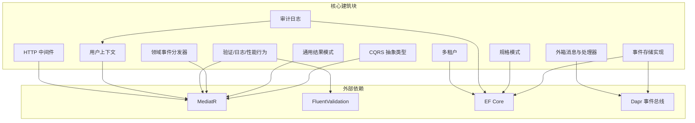

图表来源
- [CQRS 抽象类型](file://src/BuildingBlocks/ErpSystem.BuildingBlocks/CQRS/Abstractions.cs#L1-L41)
- [通用结果模式](file://src/BuildingBlocks/ErpSystem.BuildingBlocks/Common/Result.cs#L1-L56)
- [领域事件分发器](file://src/BuildingBlocks/ErpSystem.BuildingBlocks/Domain/DomainEventDispatcher.cs#L1-L88)
- [DDD 基类与事件存储](file://src/BuildingBlocks/ErpSystem.BuildingBlocks/Domain/DDDBase.cs#L1-L153)
- [规格模式接口](file://src/BuildingBlocks/ErpSystem.BuildingBlocks/Domain/Specifications/ISpecification.cs#L1-L18)
- [规格模式实现](file://src/BuildingBlocks/ErpSystem.BuildingBlocks/Domain/Specifications/Specification.cs#L1-L55)
- [验证行为](file://src/BuildingBlocks/ErpSystem.BuildingBlocks/Behaviors/ValidationBehavior.cs#L1-L41)
- [日志行为](file://src/BuildingBlocks/ErpSystem.BuildingBlocks/Behaviors/LoggingBehavior.cs#L1-L30)
- [性能行为](file://src/BuildingBlocks/ErpSystem.BuildingBlocks/Behaviors/PerformanceBehavior.cs#L1-L82)
- [审计日志实体与行为](file://src/BuildingBlocks/ErpSystem.BuildingBlocks/Auditing/AuditLog.cs#L1-L145)
- [用户上下文接口](file://src/BuildingBlocks/ErpSystem.BuildingBlocks/Auth/IUserContext.cs#L1-L12)
- [用户上下文实现](file://src/BuildingBlocks/ErpSystem.BuildingBlocks/Auth/UserContext.cs#L1-L40)
- [多租户扩展与拦截器](file://src/BuildingBlocks/ErpSystem.BuildingBlocks/MultiTenancy/MultiTenancy.cs#L1-L105)
- [HTTP 中间件集合](file://src/BuildingBlocks/ErpSystem.BuildingBlocks/Middleware/Middlewares.cs#L1-L149)
- [事务性外箱消息模型](file://src/BuildingBlocks/ErpSystem.BuildingBlocks/Outbox/OutboxMessage.cs#L1-L82)
- [外箱处理器](file://src/BuildingBlocks/ErpSystem.BuildingBlocks/Outbox/OutboxProcessor.cs#L1-L80)

章节来源
- [ErpSystem.BuildingBlocks.csproj](file://src/BuildingBlocks/ErpSystem.BuildingBlocks/ErpSystem.BuildingBlocks.csproj#L1-L30)
- [依赖注入扩展](file://src/BuildingBlocks/ErpSystem.BuildingBlocks/DependencyInjection.cs#L1-L31)

## 核心组件
- CQRS 抽象类型：定义命令、查询及其处理器接口，统一 MediatR 的请求/响应契约
- 通用结果模式：Result<Result<T>> 提供成功/失败与错误对象的强类型封装
- 领域事件分发器：在 EF Core SaveChanges 后收集并发布聚合产生的领域事件
- 事件存储实现：事件流持久化、版本管理、历史重建与事件总线/发布者联动
- 规格模式：以表达式组合查询条件、包含、排序与分页
- MediatR 行为：验证、日志、性能监控与未处理异常捕获
- 审计日志：自动记录可审计请求的变更，结合用户上下文与租户信息
- 用户上下文：从 HTTP 上下文提取认证主体、租户与角色等信息
- 多租户：全局查询过滤与保存拦截器自动设置租户隔离
- HTTP 中间件：请求/响应日志、关联 ID 注入与全局异常处理
- 外箱模式：事务内写入消息并在后台异步投递，保证最终一致性

章节来源
- [CQRS 抽象类型](file://src/BuildingBlocks/ErpSystem.BuildingBlocks/CQRS/Abstractions.cs#L1-L41)
- [通用结果模式](file://src/BuildingBlocks/ErpSystem.BuildingBlocks/Common/Result.cs#L1-L56)
- [领域事件分发器](file://src/BuildingBlocks/ErpSystem.BuildingBlocks/Domain/DomainEventDispatcher.cs#L1-L88)
- [DDD 基类与事件存储](file://src/BuildingBlocks/ErpSystem.BuildingBlocks/Domain/DDDBase.cs#L1-L153)
- [规格模式接口](file://src/BuildingBlocks/ErpSystem.BuildingBlocks/Domain/Specifications/ISpecification.cs#L1-L18)
- [规格模式实现](file://src/BuildingBlocks/ErpSystem.BuildingBlocks/Domain/Specifications/Specification.cs#L1-L55)
- [验证行为](file://src/BuildingBlocks/ErpSystem.BuildingBlocks/Behaviors/ValidationBehavior.cs#L1-L41)
- [日志行为](file://src/BuildingBlocks/ErpSystem.BuildingBlocks/Behaviors/LoggingBehavior.cs#L1-L30)
- [性能行为](file://src/BuildingBlocks/ErpSystem.BuildingBlocks/Behaviors/PerformanceBehavior.cs#L1-L82)
- [审计日志实体与行为](file://src/BuildingBlocks/ErpSystem.BuildingBlocks/Auditing/AuditLog.cs#L1-L145)
- [用户上下文接口](file://src/BuildingBlocks/ErpSystem.BuildingBlocks/Auth/IUserContext.cs#L1-L12)
- [用户上下文实现](file://src/BuildingBlocks/ErpSystem.BuildingBlocks/Auth/UserContext.cs#L1-L40)
- [多租户扩展与拦截器](file://src/BuildingBlocks/ErpSystem.BuildingBlocks/MultiTenancy/MultiTenancy.cs#L1-L105)
- [HTTP 中间件集合](file://src/BuildingBlocks/ErpSystem.BuildingBlocks/Middleware/Middlewares.cs#L1-L149)
- [事务性外箱消息模型](file://src/BuildingBlocks/ErpSystem.BuildingBlocks/Outbox/OutboxMessage.cs#L1-L82)
- [外箱处理器](file://src/BuildingBlocks/ErpSystem.BuildingBlocks/Outbox/OutboxProcessor.cs#L1-L80)

## 架构总览
核心建筑块通过依赖注入集中注册，形成横切于各业务服务的基础设施层。其关键交互如下：

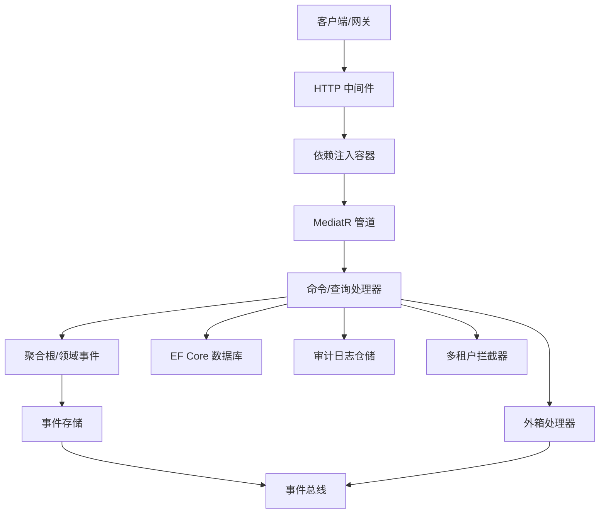

图表来源
- [依赖注入扩展](file://src/BuildingBlocks/ErpSystem.BuildingBlocks/DependencyInjection.cs#L10-L29)
- [领域事件分发器](file://src/BuildingBlocks/ErpSystem.BuildingBlocks/Domain/DomainEventDispatcher.cs#L17-L51)
- [DDD 基类与事件存储](file://src/BuildingBlocks/ErpSystem.BuildingBlocks/Domain/DDDBase.cs#L60-L132)
- [外箱处理器](file://src/BuildingBlocks/ErpSystem.BuildingBlocks/Outbox/OutboxProcessor.cs#L8-L79)
- [审计日志实体与行为](file://src/BuildingBlocks/ErpSystem.BuildingBlocks/Auditing/AuditLog.cs#L65-L111)
- [多租户扩展与拦截器](file://src/BuildingBlocks/ErpSystem.BuildingBlocks/MultiTenancy/MultiTenancy.cs#L66-L104)

## 组件详解

### 事件存储与聚合根设计
- 聚合根基类负责收集领域事件、维护版本号，并提供从历史重建的能力
- 事件存储实现将聚合变更序列化为事件流，按版本顺序写入数据库，随后通过发布者与事件总线广播
- 事件加载时根据事件类型解析器反序列化历史，重建聚合状态

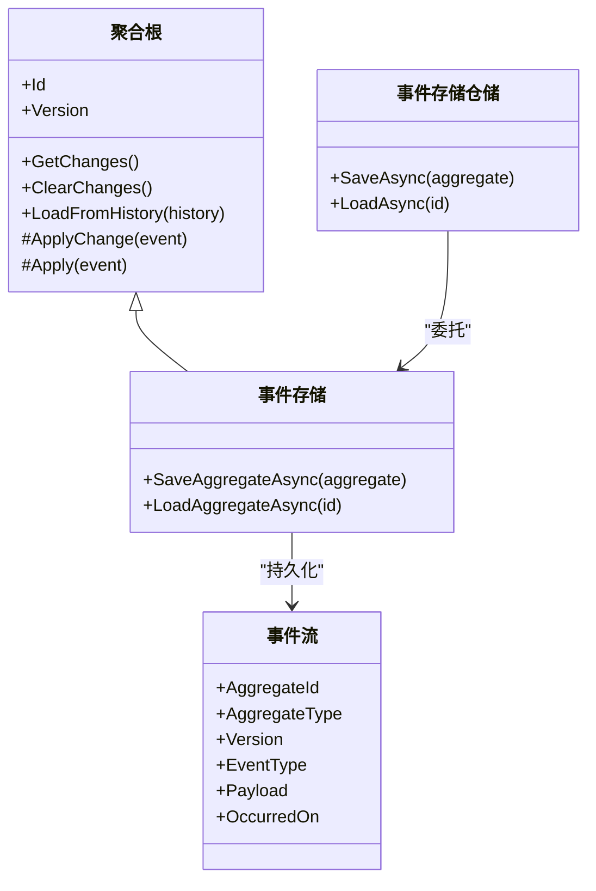

图表来源
- [DDD 基类与事件存储](file://src/BuildingBlocks/ErpSystem.BuildingBlocks/Domain/DDDBase.cs#L15-L42)
- [DDD 基类与事件存储](file://src/BuildingBlocks/ErpSystem.BuildingBlocks/Domain/DDDBase.cs#L44-L58)
- [DDD 基类与事件存储](file://src/BuildingBlocks/ErpSystem.BuildingBlocks/Domain/DDDBase.cs#L60-L132)
- [DDD 基类与事件存储](file://src/BuildingBlocks/ErpSystem.BuildingBlocks/Domain/DDDBase.cs#L134-L153)

章节来源
- [DDD 基类与事件存储](file://src/BuildingBlocks/ErpSystem.BuildingBlocks/Domain/DDDBase.cs#L1-L153)

### 领域事件处理（EF Core 拦截器 + MediatR）
- 在 EF Core SaveChanges 完成后，收集所有聚合的领域事件
- 清空已发布事件，防止重复分发
- 使用 MediatR 发布通知，确保事件处理解耦

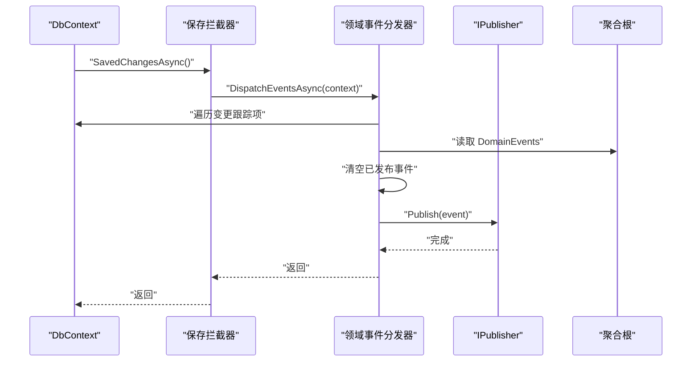

图表来源
- [领域事件分发器](file://src/BuildingBlocks/ErpSystem.BuildingBlocks/Domain/DomainEventDispatcher.cs#L57-L78)
- [领域事件分发器](file://src/BuildingBlocks/ErpSystem.BuildingBlocks/Domain/DomainEventDispatcher.cs#L17-L52)

章节来源
- [领域事件分发器](file://src/BuildingBlocks/ErpSystem.BuildingBlocks/Domain/DomainEventDispatcher.cs#L1-L88)

### CQRS 模式实现
- 命令/查询接口与处理器接口统一了请求契约
- 业务服务通过 MediatR 调用命令/查询处理器，实现读写分离

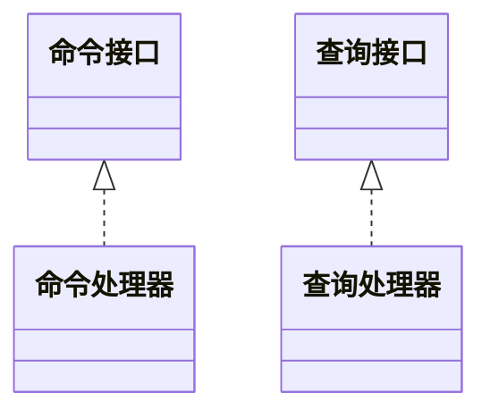

图表来源
- [CQRS 抽象类型](file://src/BuildingBlocks/ErpSystem.BuildingBlocks/CQRS/Abstractions.cs#L12-L40)

章节来源
- [CQRS 抽象类型](file://src/BuildingBlocks/ErpSystem.BuildingBlocks/CQRS/Abstractions.cs#L1-L41)

### MediatR 管道行为与验证机制
- 日志行为：记录请求进入与退出，便于可观测性
- 性能行为：统计耗时并告警慢请求
- 验证行为：批量执行 FluentValidation 并抛出统一验证异常
- 未处理异常行为：捕获异常并记录日志，向上抛出

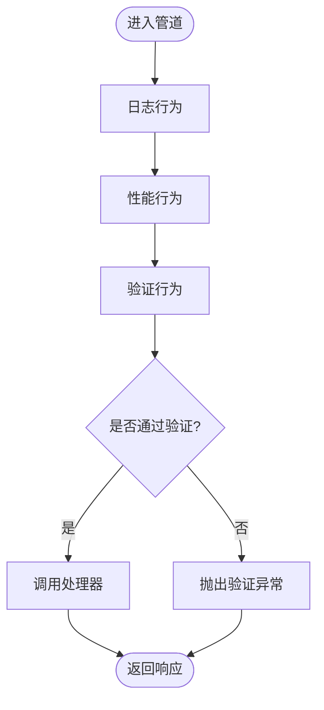

图表来源
- [日志行为](file://src/BuildingBlocks/ErpSystem.BuildingBlocks/Behaviors/LoggingBehavior.cs#L17-L28)
- [性能行为](file://src/BuildingBlocks/ErpSystem.BuildingBlocks/Behaviors/PerformanceBehavior.cs#L24-L46)
- [验证行为](file://src/BuildingBlocks/ErpSystem.BuildingBlocks/Behaviors/ValidationBehavior.cs#L16-L39)

章节来源
- [日志行为](file://src/BuildingBlocks/ErpSystem.BuildingBlocks/Behaviors/LoggingBehavior.cs#L1-L30)
- [性能行为](file://src/BuildingBlocks/ErpSystem.BuildingBlocks/Behaviors/PerformanceBehavior.cs#L1-L82)
- [验证行为](file://src/BuildingBlocks/ErpSystem.BuildingBlocks/Behaviors/ValidationBehavior.cs#L1-L41)

### 通用结果模式与错误处理策略
- Result/Result<T> 提供强类型的成功/失败与错误封装
- 通过显式构造与隐式转换，避免空值访问与错误传播

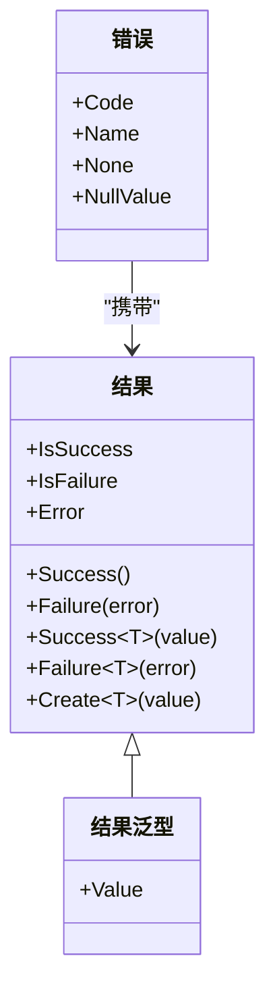

图表来源
- [通用结果模式](file://src/BuildingBlocks/ErpSystem.BuildingBlocks/Common/Result.cs#L3-L38)
- [通用结果模式](file://src/BuildingBlocks/ErpSystem.BuildingBlocks/Common/Result.cs#L40-L56)

章节来源
- [通用结果模式](file://src/BuildingBlocks/ErpSystem.BuildingBlocks/Common/Result.cs#L1-L56)

### 领域规范模式（Specification）
- 以表达式组合 Criteria、Includes、OrderBy/Descending、GroupBy、分页参数
- 支持链式构建查询条件，便于复用与组合

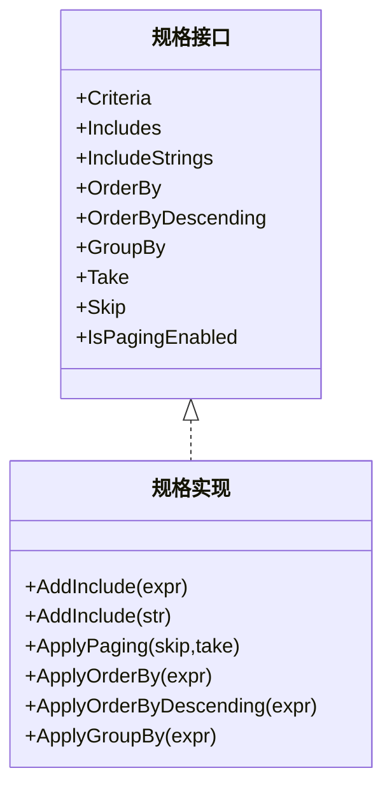

图表来源
- [规格模式接口](file://src/BuildingBlocks/ErpSystem.BuildingBlocks/Domain/Specifications/ISpecification.cs#L5-L17)
- [规格模式实现](file://src/BuildingBlocks/ErpSystem.BuildingBlocks/Domain/Specifications/Specification.cs#L5-L54)

章节来源
- [规格模式接口](file://src/BuildingBlocks/ErpSystem.BuildingBlocks/Domain/Specifications/ISpecification.cs#L1-L18)
- [规格模式实现](file://src/BuildingBlocks/ErpSystem.BuildingBlocks/Domain/Specifications/Specification.cs#L1-L55)

### 中间件管道、审计日志与多租户支持
- 请求日志中间件：记录请求方法、路径、状态码与耗时
- 关联 ID 中间件：注入 X-Correlation-ID，便于分布式追踪
- 全局异常中间件：对常见异常进行结构化响应
- 审计行为：对可审计请求自动记录操作人、租户与请求体
- 多租户：全局查询过滤 + 保存拦截器自动填充租户标识

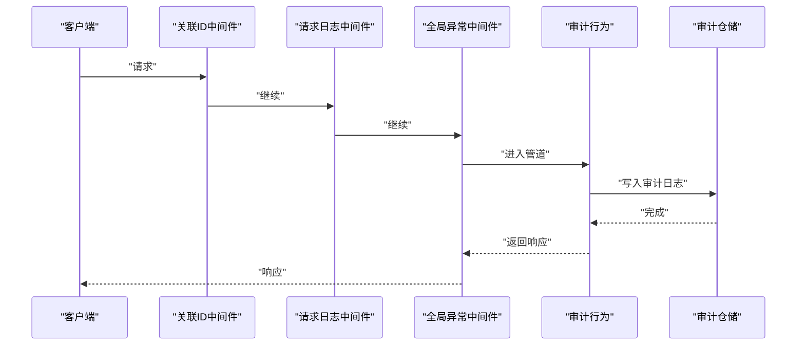

图表来源
- [HTTP 中间件集合](file://src/BuildingBlocks/ErpSystem.BuildingBlocks/Middleware/Middlewares.cs#L21-L57)
- [HTTP 中间件集合](file://src/BuildingBlocks/ErpSystem.BuildingBlocks/Middleware/Middlewares.cs#L73-L82)
- [HTTP 中间件集合](file://src/BuildingBlocks/ErpSystem.BuildingBlocks/Middleware/Middlewares.cs#L99-L148)
- [审计日志实体与行为](file://src/BuildingBlocks/ErpSystem.BuildingBlocks/Auditing/AuditLog.cs#L65-L111)

章节来源
- [HTTP 中间件集合](file://src/BuildingBlocks/ErpSystem.BuildingBlocks/Middleware/Middlewares.cs#L1-L149)
- [审计日志实体与行为](file://src/BuildingBlocks/ErpSystem.BuildingBlocks/Auditing/AuditLog.cs#L1-L145)
- [多租户扩展与拦截器](file://src/BuildingBlocks/ErpSystem.BuildingBlocks/MultiTenancy/MultiTenancy.cs#L1-L105)

### 外箱模式（Outbox）与最终一致性
- 事务内写入 OutboxMessage，确保与业务数据一致
- 后台任务定期拉取未处理消息并通过事件总线发布
- 失败重试与错误标记，保障可靠性

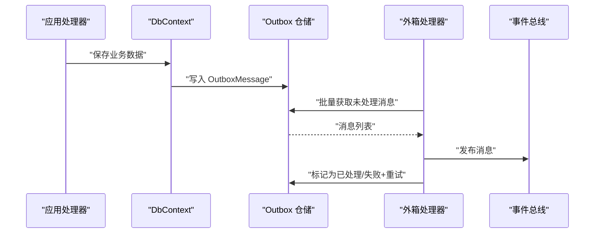

图表来源
- [事务性外箱消息模型](file://src/BuildingBlocks/ErpSystem.BuildingBlocks/Outbox/OutboxMessage.cs#L22-L54)
- [外箱处理器](file://src/BuildingBlocks/ErpSystem.BuildingBlocks/Outbox/OutboxProcessor.cs#L20-L79)

章节来源
- [事务性外箱消息模型](file://src/BuildingBlocks/ErpSystem.BuildingBlocks/Outbox/OutboxMessage.cs#L1-L82)
- [外箱处理器](file://src/BuildingBlocks/ErpSystem.BuildingBlocks/Outbox/OutboxProcessor.cs#L1-L80)

## 依赖关系分析
- 包装与引用：核心建筑块项目引用 MediatR、FluentValidation、EF Core、Dapr、OpenTelemetry、Polly 等
- 依赖注入：集中注册验证器、行为与用户上下文
- 组件耦合：事件存储依赖 EF Core 与事件总线；审计行为依赖用户上下文与仓储；多租户依赖 EF Core 拦截器

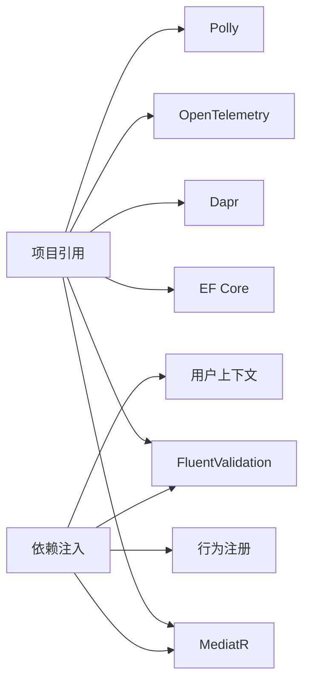

图表来源
- [ErpSystem.BuildingBlocks.csproj](file://src/BuildingBlocks/ErpSystem.BuildingBlocks/ErpSystem.BuildingBlocks.csproj#L9-L27)
- [依赖注入扩展](file://src/BuildingBlocks/ErpSystem.BuildingBlocks/DependencyInjection.cs#L12-L29)

章节来源
- [ErpSystem.BuildingBlocks.csproj](file://src/BuildingBlocks/ErpSystem.BuildingBlocks/ErpSystem.BuildingBlocks.csproj#L1-L30)
- [依赖注入扩展](file://src/BuildingBlocks/ErpSystem.BuildingBlocks/DependencyInjection.cs#L1-L31)

## 性能考量
- 管道行为开销：日志与性能行为为轻量级，建议在生产中保留但注意日志级别
- 验证行为：批量并行验证，避免阻塞主流程
- 事件存储：批量写入与异步发布，减少写放大
- 外箱批处理：固定批次大小与延迟，平衡吞吐与延迟
- EF Core 拦截器：仅在 SaveChanges 后触发，避免频繁扫描

## 故障排查指南
- 验证异常：检查请求对象与对应验证器，确认错误字段映射
- 未处理异常：查看全局异常中间件输出，定位具体异常类型与堆栈
- 审计失败：确认审计仓储可用与用户上下文信息存在
- 多租户隔离：检查租户上下文与实体是否实现多租户接口
- 事件未分发：确认 EF Core 拦截器已注册且聚合实现了领域事件集合

章节来源
- [HTTP 中间件集合](file://src/BuildingBlocks/ErpSystem.BuildingBlocks/Middleware/Middlewares.cs#L105-L148)
- [审计日志实体与行为](file://src/BuildingBlocks/ErpSystem.BuildingBlocks/Auditing/AuditLog.cs#L104-L107)
- [多租户扩展与拦截器](file://src/BuildingBlocks/ErpSystem.BuildingBlocks/MultiTenancy/MultiTenancy.cs#L92-L103)
- [领域事件分发器](file://src/BuildingBlocks/ErpSystem.BuildingBlocks/Domain/DomainEventDispatcher.cs#L66-L77)

## 结论
核心建筑块提供了统一的基础设施与通用能力，通过事件存储、领域事件分发、CQRS 抽象、MediatR 管道行为、审计与多租户等机制，显著降低了各业务服务的实现复杂度，提升了可维护性与可扩展性。建议在新业务服务中统一引入依赖注入扩展，并遵循事件溯源与外箱模式的最佳实践。

## 附录
- 使用模式建议
  - 命令/查询：通过 CQRS 抽象类型定义请求与处理器
  - 领域事件：在聚合内产生事件，由事件存储与分发器统一处理
  - 验证：为每个请求对象配置验证器，利用验证行为自动执行
  - 审计：对关键命令实现可审计接口，启用审计行为
  - 多租户：实体实现多租户接口，EF 配置全局过滤与保存拦截器
  - 外箱：对需要跨服务可靠传递的消息采用外箱模式