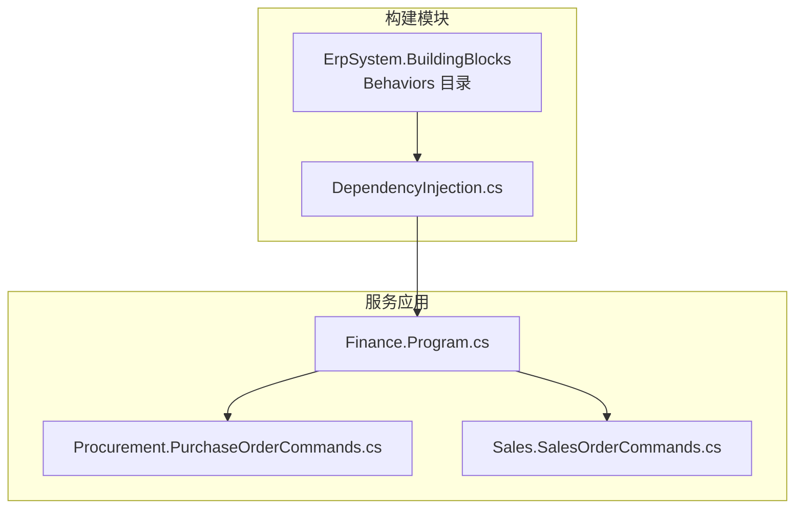
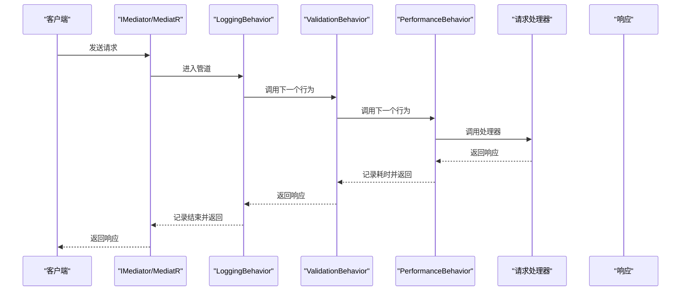
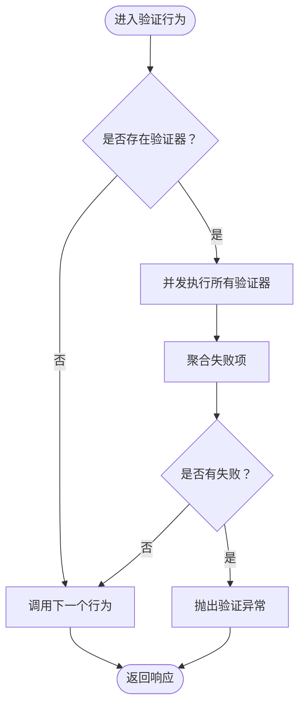
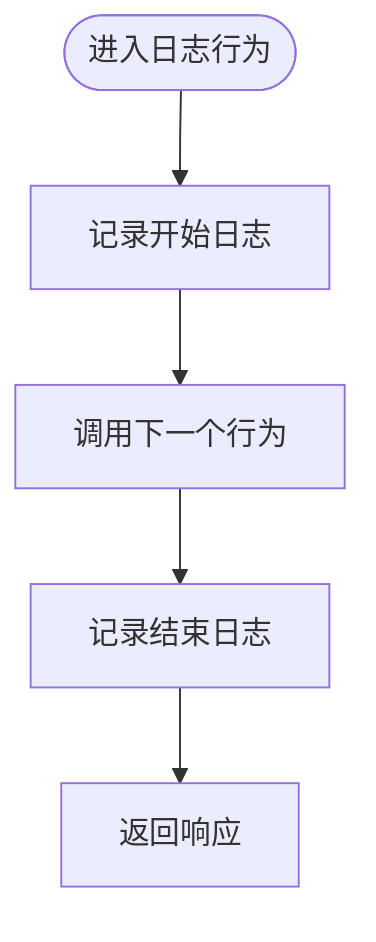
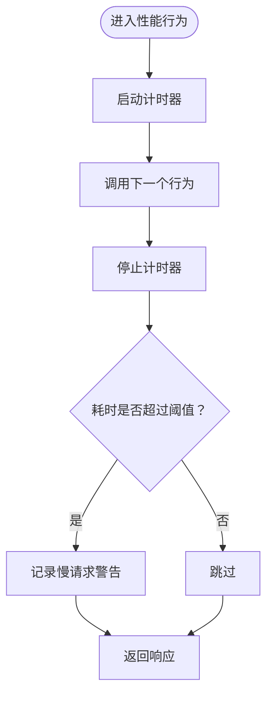
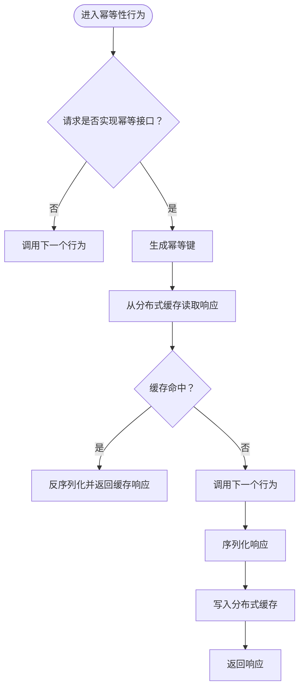
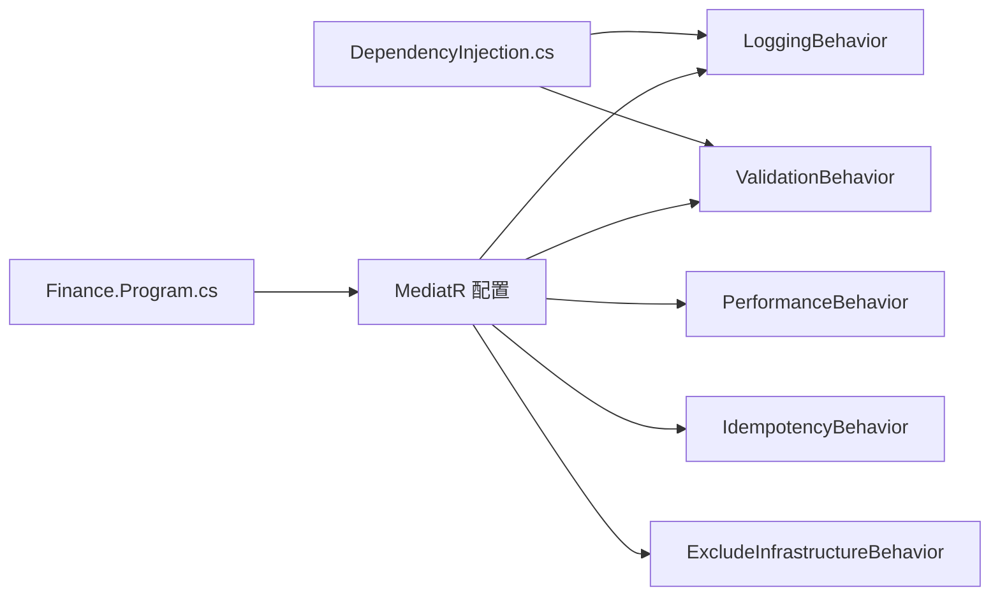

# 管道行为系统

<cite>
**本文引用的文件**
- [ValidationBehavior.cs](file://src/BuildingBlocks/ErpSystem.BuildingBlocks/Behaviors/ValidationBehavior.cs)
- [LoggingBehavior.cs](file://src/BuildingBlocks/ErpSystem.BuildingBlocks/Behaviors/LoggingBehavior.cs)
- [PerformanceBehavior.cs](file://src/BuildingBlocks/ErpSystem.BuildingBlocks/Behaviors/PerformanceBehavior.cs)
- [IdempotencyBehavior.cs](file://src/BuildingBlocks/ErpSystem.BuildingBlocks/Behaviors/IdempotencyBehavior.cs)
- [DependencyInjection.cs](file://src/BuildingBlocks/ErpSystem.BuildingBlocks/DependencyInjection.cs)
- [Program.cs（财务服务）](file://src/Services/Finance/ErpSystem.Finance/Program.cs)
- [PurchaseOrderCommands.cs](file://src/Services/Procurement/ErpSystem.Procurement/Application/PurchaseOrderCommands.cs)
- [SalesOrderCommands.cs](file://src/Services/Sales/ErpSystem.Sales/Application/SalesOrderCommands.cs)
</cite>

## 目录
1. [简介](#简介)
2. [项目结构](#项目结构)
3. [核心组件](#核心组件)
4. [架构总览](#架构总览)
5. [组件详解](#组件详解)
6. [依赖关系分析](#依赖关系分析)
7. [性能考量](#性能考量)
8. [故障排查指南](#故障排查指南)
9. [结论](#结论)
10. [附录：自定义行为与配置示例](#附录自定义行为与配置示例)

## 简介
本文件系统化阐述仓库中基于 MediatR 的“管道行为”体系，涵盖验证、日志、性能监控与幂等性控制等横切关注点的实现原理、执行顺序、拦截机制、注册与配置方式，以及在微服务架构中的扩展性与最佳实践。读者可据此理解请求在进入业务处理器前后的处理链路，并掌握如何扩展自定义行为以满足特定需求。

## 项目结构
- 行为实现集中于 BuildingBlocks 模块的 Behaviors 命名空间，包含验证、日志、性能、幂等性等通用行为。
- 服务侧通过依赖注入注册行为，并在各自 Program 中配置 MediatR 的行为链。
- 示例命令与处理器位于各业务服务的应用层，用于演示行为在真实请求处理流程中的作用。

图表来源
- [DependencyInjection.cs](file://src/BuildingBlocks/ErpSystem.BuildingBlocks/DependencyInjection.cs#L12-L29)
- [Program.cs（财务服务）](file://src/Services/Finance/ErpSystem.Finance/Program.cs#L29-L35)

章节来源
- [DependencyInjection.cs](file://src/BuildingBlocks/ErpSystem.BuildingBlocks/DependencyInjection.cs#L12-L29)
- [Program.cs（财务服务）](file://src/Services/Finance/ErpSystem.Finance/Program.cs#L29-L35)

## 核心组件
- 验证行为：对请求进行并发校验，聚合失败后统一抛出验证异常，阻止后续处理。
- 日志行为：记录请求开始与结束的日志，便于追踪与审计。
- 性能行为：统计请求耗时，超过阈值时发出警告日志，辅助性能监控。
- 幂等性行为：基于分布式缓存与哈希键，避免重复执行相同请求，支持响应缓存与复用。

章节来源
- [ValidationBehavior.cs](file://src/BuildingBlocks/ErpSystem.BuildingBlocks/Behaviors/ValidationBehavior.cs#L7-L33)
- [LoggingBehavior.cs](file://src/BuildingBlocks/ErpSystem.BuildingBlocks/Behaviors/LoggingBehavior.cs#L6-L21)
- [PerformanceBehavior.cs](file://src/BuildingBlocks/ErpSystem.BuildingBlocks/Behaviors/PerformanceBehavior.cs#L11-L39)
- [IdempotencyBehavior.cs](file://src/BuildingBlocks/ErpSystem.BuildingBlocks/Behaviors/IdempotencyBehavior.cs#L14-L50)

## 架构总览
下图展示了请求从进入 MediatR 到到达业务处理器的完整调用链，以及各行为的拦截位置与顺序。

图表来源
- [LoggingBehavior.cs](file://src/BuildingBlocks/ErpSystem.BuildingBlocks/Behaviors/LoggingBehavior.cs#L9-L20)
- [ValidationBehavior.cs](file://src/BuildingBlocks/ErpSystem.BuildingBlocks/Behaviors/ValidationBehavior.cs#L10-L32)
- [PerformanceBehavior.cs](file://src/BuildingBlocks/ErpSystem.BuildingBlocks/Behaviors/PerformanceBehavior.cs#L17-L39)

## 组件详解

### 验证行为（ValidationBehavior）
- 工作原理
  - 若未发现对应请求类型的验证器，则直接放行。
  - 否则并发执行所有验证器，收集失败项，若存在失败则抛出验证异常，阻止继续执行。
- 复杂度与性能
  - 并发验证提升吞吐，但验证器数量与复杂度直接影响整体延迟。
- 异常处理
  - 将聚合的验证失败转换为统一异常类型，便于上层捕获与处理。
- 使用建议
  - 为每个命令/查询编写针对性验证器；避免在处理器内重复校验。

图表来源
- [ValidationBehavior.cs](file://src/BuildingBlocks/ErpSystem.BuildingBlocks/Behaviors/ValidationBehavior.cs#L10-L32)

章节来源
- [ValidationBehavior.cs](file://src/BuildingBlocks/ErpSystem.BuildingBlocks/Behaviors/ValidationBehavior.cs#L7-L33)

### 日志行为（LoggingBehavior）
- 工作原理
  - 在进入处理器前后分别记录日志，包含请求名称与请求体（安全考虑应避免记录敏感字段）。
- 日志策略
  - 开始：记录请求名称与请求体，便于问题定位。
  - 结束：仅记录请求名称，避免重复输出大体量数据。
- 异常处理
  - 不改变请求生命周期，仅做日志记录。

图表来源
- [LoggingBehavior.cs](file://src/BuildingBlocks/ErpSystem.BuildingBlocks/Behaviors/LoggingBehavior.cs#L9-L20)

章节来源
- [LoggingBehavior.cs](file://src/BuildingBlocks/ErpSystem.BuildingBlocks/Behaviors/LoggingBehavior.cs#L6-L21)

### 性能行为（PerformanceBehavior）
- 工作原理
  - 使用计时器统计处理器执行时间，超过阈值（毫秒级）时记录警告日志。
- 监控指标
  - 请求名称、耗时（毫秒）、请求体（按需记录）。
- 异常处理
  - 不捕获异常，仅记录耗时；异常由后续异常行为处理。

图表来源
- [PerformanceBehavior.cs](file://src/BuildingBlocks/ErpSystem.BuildingBlocks/Behaviors/PerformanceBehavior.cs#L17-L39)

章节来源
- [PerformanceBehavior.cs](file://src/BuildingBlocks/ErpSystem.BuildingBlocks/Behaviors/PerformanceBehavior.cs#L11-L39)

### 幂等性行为（IdempotencyBehavior）
- 工作原理
  - 仅对实现幂等标记接口的请求生效；根据请求类型与幂等键生成哈希键，查询分布式缓存。
  - 若命中缓存，直接反序列化并返回缓存响应；否则放行处理器，将响应序列化写入缓存。
- 去重机制
  - 幂等键由请求类型全名与用户提供的幂等键拼接后经哈希生成，确保跨服务一致性。
  - 缓存默认过期时间较长，适合短时重复请求的快速去重。
- 异常处理
  - 处理器抛出的异常不会写入缓存，避免污染缓存结果。

图表来源
- [IdempotencyBehavior.cs](file://src/BuildingBlocks/ErpSystem.BuildingBlocks/Behaviors/IdempotencyBehavior.cs#L20-L50)

章节来源
- [IdempotencyBehavior.cs](file://src/BuildingBlocks/ErpSystem.BuildingBlocks/Behaviors/IdempotencyBehavior.cs#L14-L70)

### 未处理异常行为（UnhandledExceptionBehavior）
- 工作原理
  - 包裹下一个行为的调用，在捕获到异常时记录错误日志并重新抛出，保证异常不被吞掉。
- 适用场景
  - 作为行为链末端或独立注册，确保所有未处理异常被记录与传播。

章节来源
- [PerformanceBehavior.cs](file://src/BuildingBlocks/ErpSystem.BuildingBlocks/Behaviors/PerformanceBehavior.cs#L45-L67)

## 依赖关系分析
- 注册顺序
  - 服务通过依赖注入注册行为，注册顺序即为调用顺序：日志行为 → 验证行为 → 其他行为（如性能、幂等、异常）。
- MediatR 配置
  - 各服务在 Program 中通过 AddMediatR 注册处理器与行为；部分服务会添加排除型行为以避免加载不兼容的基础设施。
- 外部依赖
  - 幂等性行为依赖分布式缓存；性能与日志行为依赖日志记录器；验证行为依赖 FluentValidation。

图表来源
- [DependencyInjection.cs](file://src/BuildingBlocks/ErpSystem.BuildingBlocks/DependencyInjection.cs#L20-L22)
- [Program.cs（财务服务）](file://src/Services/Finance/ErpSystem.Finance/Program.cs#L29-L35)

章节来源
- [DependencyInjection.cs](file://src/BuildingBlocks/ErpSystem.BuildingBlocks/DependencyInjection.cs#L12-L29)
- [Program.cs（财务服务）](file://src/Services/Finance/ErpSystem.Finance/Program.cs#L29-L35)

## 性能考量
- 并发验证：验证行为采用并发执行多个验证器，减少等待时间，但需注意验证器本身的开销。
- 计时器精度：性能行为使用高精度计时器，建议结合采样与告警策略，避免日志风暴。
- 缓存命中率：幂等性行为依赖分布式缓存命中率，建议合理设置过期时间与键空间，避免缓存膨胀。
- 日志成本：日志行为在开始与结束均记录，建议对大体量请求体采取脱敏或裁剪策略。

## 故障排查指南
- 验证失败
  - 现象：请求被拒绝并抛出验证异常。
  - 排查：检查对应请求类型的验证器是否正确注册与实现；确认输入参数是否符合约束。
- 慢请求告警
  - 现象：性能行为记录慢请求警告。
  - 排查：定位耗时长的处理器与外部依赖（数据库、事件总线、缓存），优化关键路径。
- 幂等未生效
  - 现象：重复请求未命中缓存。
  - 排查：确认请求是否实现幂等接口；核对幂等键是否一致；检查分布式缓存可用性与键空间。
- 未处理异常
  - 现象：异常未被捕获。
  - 排查：确认已注册未处理异常行为；检查日志级别与输出目标。

章节来源
- [ValidationBehavior.cs](file://src/BuildingBlocks/ErpSystem.BuildingBlocks/Behaviors/ValidationBehavior.cs#L26-L29)
- [PerformanceBehavior.cs](file://src/BuildingBlocks/ErpSystem.BuildingBlocks/Behaviors/PerformanceBehavior.cs#L27-L36)
- [IdempotencyBehavior.cs](file://src/BuildingBlocks/ErpSystem.BuildingBlocks/Behaviors/IdempotencyBehavior.cs#L31-L35)
- [PerformanceBehavior.cs](file://src/BuildingBlocks/ErpSystem.BuildingBlocks/Behaviors/PerformanceBehavior.cs#L54-L65)

## 结论
该管道行为系统以轻量、可插拔的方式为请求处理提供了标准化的横切能力：验证保障输入质量、日志增强可观测性、性能监控辅助容量规划、幂等性提升分布式一致性与用户体验。通过统一的注册与配置机制，可在各微服务中快速启用与扩展行为，形成一致的行为链与治理策略。

## 附录：自定义行为与配置示例
- 自定义行为开发步骤
  - 实现接口：实现通用行为接口，接收请求与下一个委托，完成前置逻辑后调用下一个行为。
  - 注册行为：在服务的依赖注入配置中注册行为类型，确保其在行为链中的顺序符合预期。
  - 可选：在 MediatR 配置中添加排除型行为，避免加载不兼容的处理器或基础设施。
- 示例参考路径
  - 行为实现模板：参见日志/验证/性能/幂等行为的实现文件。
  - 服务注册示例：参见财务服务 Program 文件中 MediatR 的注册与排除行为的使用。
  - 命令与处理器示例：参见采购与销售服务的应用层命令与处理器文件，观察行为在真实请求处理中的作用。

章节来源
- [LoggingBehavior.cs](file://src/BuildingBlocks/ErpSystem.BuildingBlocks/Behaviors/LoggingBehavior.cs#L6-L21)
- [ValidationBehavior.cs](file://src/BuildingBlocks/ErpSystem.BuildingBlocks/Behaviors/ValidationBehavior.cs#L7-L33)
- [PerformanceBehavior.cs](file://src/BuildingBlocks/ErpSystem.BuildingBlocks/Behaviors/PerformanceBehavior.cs#L11-L39)
- [IdempotencyBehavior.cs](file://src/BuildingBlocks/ErpSystem.BuildingBlocks/Behaviors/IdempotencyBehavior.cs#L14-L50)
- [Program.cs（财务服务）](file://src/Services/Finance/ErpSystem.Finance/Program.cs#L29-L35)
- [PurchaseOrderCommands.cs](file://src/Services/Procurement/ErpSystem.Procurement/Application/PurchaseOrderCommands.cs#L8-L21)
- [SalesOrderCommands.cs](file://src/Services/Sales/ErpSystem.Sales/Application/SalesOrderCommands.cs#L8-L18)