# 测试策略

<cite>
**本文引用的文件**
- [IntegrationTestBase.cs](file://src/Tests/ErpSystem.IntegrationTests/IntegrationTestBase.cs)
- [ErpSystem.IntegrationTests.csproj](file://src/Tests/ErpSystem.IntegrationTests/ErpSystem.IntegrationTests.csproj)
- [GLTests.cs](file://src/Tests/ErpSystem.IntegrationTests/GLTests.cs)
- [SalesToInventoryTests.cs](file://src/Tests/ErpSystem.IntegrationTests/SalesToInventoryTests.cs)
- [ProcurementToInventoryTests.cs](file://src/Tests/ErpSystem.IntegrationTests/ProcurementToInventoryTests.cs)
- [ProductionToInventoryTests.cs](file://src/Tests/ErpSystem.IntegrationTests/ProductionToInventoryTests.cs)
- [HRToIdentityTests.cs](file://src/Tests/ErpSystem.IntegrationTests/HRToIdentityTests.cs)
- [QualityWorkflowTests.cs](file://src/Tests/ErpSystem.IntegrationTests/Quality/QualityWorkflowTests.cs)
- [Dockerfile](file://Dockerfile)
- [docker-compose.yml](file://docker-compose.yml)
- [values.yaml](file://deploy/helm/erp-system/values.yaml)
- [prd.md.resolved](file://src/prd.md.resolved)
- [ValidationBehavior.cs](file://src/BuildingBlocks/ErpSystem.BuildingBlocks/Behaviors/ValidationBehavior.cs)
- [LoggingBehavior.cs](file://src/BuildingBlocks/ErpSystem.BuildingBlocks/Behaviors/LoggingBehavior.cs)
- [ResiliencePolicies.cs](file://src/BuildingBlocks/ErpSystem.BuildingBlocks/Resilience/ResiliencePolicies.cs)
- [AutomationEngine.cs](file://src/Services/Automation/ErpSystem.Automation/Application/AutomationEngine.cs)
- [AutomationRuleAggregate.cs](file://src/Services/Automation/ErpSystem.Automation/Domain/AutomationRuleAggregate.cs)
- [Program.cs（自动化服务）](file://src/Services/Automation/ErpSystem.Automation/Program.cs)
- [Program.cs（自动化测试工具）](file://src/Services/Automation/AutomationTest/Program.cs)
</cite>

## 目录
1. [引言](#引言)
2. [项目结构](#项目结构)
3. [核心组件](#核心组件)
4. [架构总览](#架构总览)
5. [详细组件分析](#详细组件分析)
6. [依赖关系分析](#依赖关系分析)
7. [性能考虑](#性能考虑)
8. [故障排查指南](#故障排查指南)
9. [结论](#结论)
10. [附录](#附录)

## 引言
本测试策略面向 ERP 微服务系统，围绕单元测试、集成测试与端到端测试（E2E）给出可落地的实施方法；结合测试金字塔理念，明确模拟对象（Mock）与测试数据管理策略；设计跨服务集成测试套件，覆盖业务流程链路；提供覆盖率目标、性能测试与安全测试指导；记录测试环境配置、容器化与 Helm 部署要点；解释测试驱动开发（TDD）与行为驱动开发（BDD）在本项目中的应用方式，并为测试工程师与开发者提供实施指南与最佳实践。

## 项目结构
测试相关代码主要集中在集成测试工程中，采用基于 WebApplicationFactory 的端到端风格集成测试，通过内存数据库替代真实数据库，使用 Moq 替换外部依赖（如 DaprClient），并通过自定义 TestEventBus 将事件直接路由至目标服务端点，以实现跨服务验证。

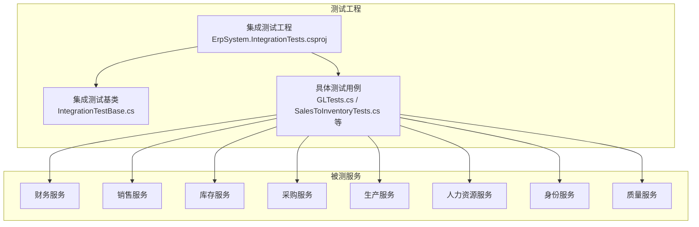

图示来源
- [ErpSystem.IntegrationTests.csproj](file://src/Tests/ErpSystem.IntegrationTests/ErpSystem.IntegrationTests.csproj#L1-L44)
- [IntegrationTestBase.cs](file://src/Tests/ErpSystem.IntegrationTests/IntegrationTestBase.cs#L1-L206)
- [GLTests.cs](file://src/Tests/ErpSystem.IntegrationTests/GLTests.cs#L1-L93)
- [SalesToInventoryTests.cs](file://src/Tests/ErpSystem.IntegrationTests/SalesToInventoryTests.cs#L1-L92)
- [ProcurementToInventoryTests.cs](file://src/Tests/ErpSystem.IntegrationTests/ProcurementToInventoryTests.cs#L1-L87)
- [ProductionToInventoryTests.cs](file://src/Tests/ErpSystem.IntegrationTests/ProductionToInventoryTests.cs#L1-L131)
- [HRToIdentityTests.cs](file://src/Tests/ErpSystem.IntegrationTests/HRToIdentityTests.cs#L1-L101)
- [QualityWorkflowTests.cs](file://src/Tests/ErpSystem.IntegrationTests/Quality/QualityWorkflowTests.cs#L1-L54)

章节来源
- [ErpSystem.IntegrationTests.csproj](file://src/Tests/ErpSystem.IntegrationTests/ErpSystem.IntegrationTests.csproj#L1-L44)
- [IntegrationTestBase.cs](file://src/Tests/ErpSystem.IntegrationTests/IntegrationTestBase.cs#L1-L206)

## 核心组件
- 集成测试基类：负责为每个服务创建 WebApplicationFactory，替换 DbContext 为内存数据库，注入 Mock 的 DaprClient，并以 TestEventBus 替换真实事件总线，将事件直接发送到目标服务端点。
- 测试用例：覆盖财务总账分录过账影响试算平衡、销售订单确认触发库存预留、采购收货更新库存、生产发料与完工更新库存、HR 员工生命周期与身份账户联动、质量控制工作流等关键业务链路。
- 行为与日志管道：通过 BuildingBlocks 中的 ValidationBehavior 与 LoggingBehavior，确保请求在进入处理逻辑前进行校验与日志记录，便于测试定位问题。
- 弹性与超时策略：ResiliencePolicies 提供熔断、重试与超时组合策略，有助于在集成测试中稳定地执行跨服务调用。
- 自动化引擎：AutomationEngine 支持邮件、Webhook、通知等动作执行，其接口在测试中可被模拟或替换，便于验证自动化规则触发与执行。

章节来源
- [IntegrationTestBase.cs](file://src/Tests/ErpSystem.IntegrationTests/IntegrationTestBase.cs#L19-L187)
- [GLTests.cs](file://src/Tests/ErpSystem.IntegrationTests/GLTests.cs#L12-L92)
- [SalesToInventoryTests.cs](file://src/Tests/ErpSystem.IntegrationTests/SalesToInventoryTests.cs#L15-L91)
- [ProcurementToInventoryTests.cs](file://src/Tests/ErpSystem.IntegrationTests/ProcurementToInventoryTests.cs#L14-L86)
- [ProductionToInventoryTests.cs](file://src/Tests/ErpSystem.IntegrationTests/ProductionToInventoryTests.cs#L15-L130)
- [HRToIdentityTests.cs](file://src/Tests/ErpSystem.IntegrationTests/HRToIdentityTests.cs#L15-L100)
- [QualityWorkflowTests.cs](file://src/Tests/ErpSystem.IntegrationTests/Quality/QualityWorkflowTests.cs#L10-L54)
- [ValidationBehavior.cs](file://src/BuildingBlocks/ErpSystem.BuildingBlocks/Behaviors/ValidationBehavior.cs#L7-L40)
- [LoggingBehavior.cs](file://src/BuildingBlocks/ErpSystem.BuildingBlocks/Behaviors/LoggingBehavior.cs#L7-L29)
- [ResiliencePolicies.cs](file://src/BuildingBlocks/ErpSystem.BuildingBlocks/Resilience/ResiliencePolicies.cs#L37-L78)
- [AutomationEngine.cs](file://src/Services/Automation/ErpSystem.Automation/Application/AutomationEngine.cs#L191-L221)
- [AutomationRuleAggregate.cs](file://src/Services/Automation/ErpSystem.Automation/Domain/AutomationRuleAggregate.cs#L124-L137)
- [Program.cs（自动化服务）](file://src/Services/Automation/ErpSystem.Automation/Program.cs#L117-L125)

## 架构总览
下图展示了测试金字塔在本项目中的落地：以单元测试为主（领域模型与聚合根、应用层命令/查询、基础设施组件），以集成测试验证跨服务交互与业务流程，以端到端测试覆盖用户路径与 UI 场景（前端仓库存在，但本节不深入其测试细节）。

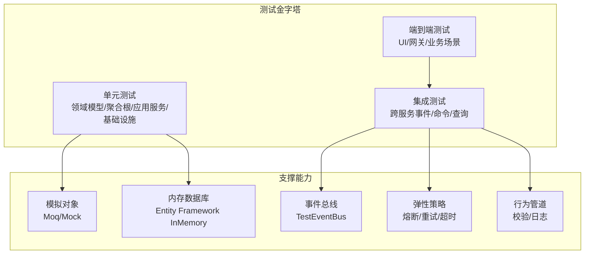

图示来源
- [IntegrationTestBase.cs](file://src/Tests/ErpSystem.IntegrationTests/IntegrationTestBase.cs#L31-L186)
- [ErpSystem.IntegrationTests.csproj](file://src/Tests/ErpSystem.IntegrationTests/ErpSystem.IntegrationTests.csproj#L10-L21)
- [ResiliencePolicies.cs](file://src/BuildingBlocks/ErpSystem.BuildingBlocks/Resilience/ResiliencePolicies.cs#L37-L78)
- [ValidationBehavior.cs](file://src/BuildingBlocks/ErpSystem.BuildingBlocks/Behaviors/ValidationBehavior.cs#L7-L40)
- [LoggingBehavior.cs](file://src/BuildingBlocks/ErpSystem.BuildingBlocks/Behaviors/LoggingBehavior.cs#L7-L29)

## 详细组件分析

### 集成测试基类与测试事件总线
- 为每个服务创建独立的 WebApplicationFactory，注入内存数据库与 Mock 的 DaprClient，避免真实外部依赖。
- 使用 TestEventBus 将事件直接 POST 到目标服务端点，从而验证事件驱动的跨服务协作。
- 通过移除真实 IEventBus 注册，确保事件不会广播到真实消息中间件，提升测试可控性与稳定性。

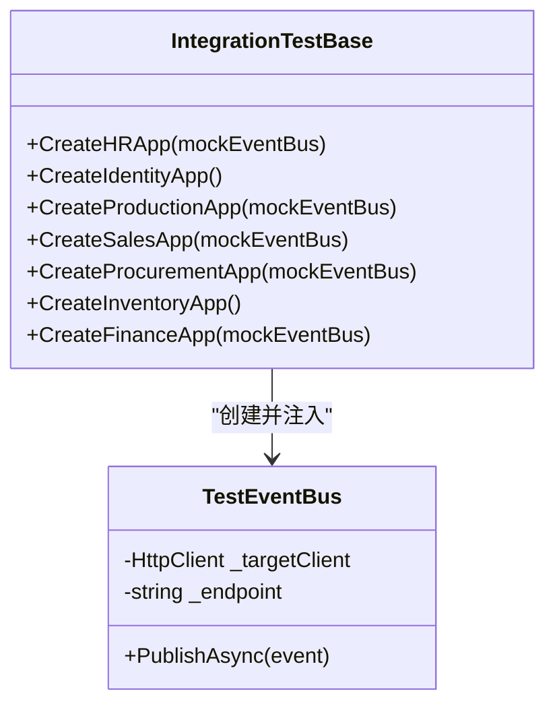

图示来源
- [IntegrationTestBase.cs](file://src/Tests/ErpSystem.IntegrationTests/IntegrationTestBase.cs#L29-L187)

章节来源
- [IntegrationTestBase.cs](file://src/Tests/ErpSystem.IntegrationTests/IntegrationTestBase.cs#L29-L187)

### 财务总账集成测试（GL）
- 验证会计分录创建与过账后对试算平衡的影响，包含科目定义、会计期间开账、分录草稿与过账状态转换、以及查询试算平衡结果。
- 通过 MediatR 发送命令与查询，等待投影更新后断言结果。

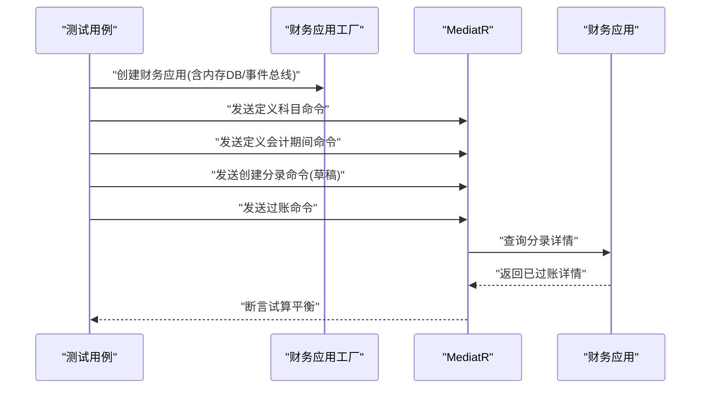

图示来源
- [GLTests.cs](file://src/Tests/ErpSystem.IntegrationTests/GLTests.cs#L14-L91)
- [IntegrationTestBase.cs](file://src/Tests/ErpSystem.IntegrationTests/IntegrationTestBase.cs#L165-L186)

章节来源
- [GLTests.cs](file://src/Tests/ErpSystem.IntegrationTests/GLTests.cs#L12-L92)

### 销售到库存集成测试（订单确认预留）
- 初始化库存，创建销售订单并确认，验证库存预留数量与预留记录。
- 使用 TestEventBus 将“订单确认”事件路由到库存服务，触发预留逻辑。

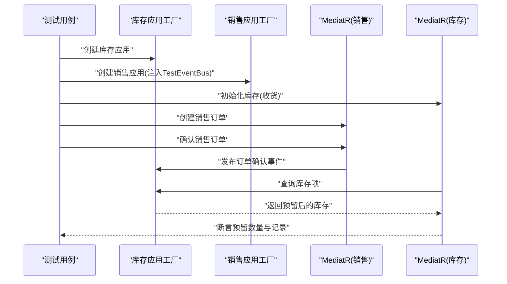

图示来源
- [SalesToInventoryTests.cs](file://src/Tests/ErpSystem.IntegrationTests/SalesToInventoryTests.cs#L17-L90)
- [IntegrationTestBase.cs](file://src/Tests/ErpSystem.IntegrationTests/IntegrationTestBase.cs#L96-L117)

章节来源
- [SalesToInventoryTests.cs](file://src/Tests/ErpSystem.IntegrationTests/SalesToInventoryTests.cs#L15-L91)

### 采购到库存集成测试（收货入账）
- 创建采购订单并推进状态，执行收货，验证库存数量增加。
- 通过 TestEventBus 将“收货完成”事件路由到库存服务。

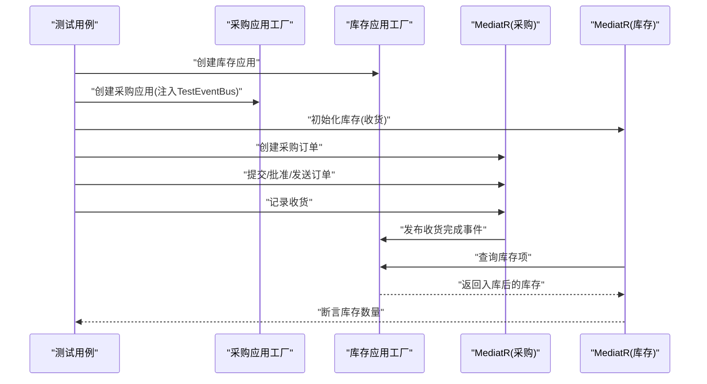

图示来源
- [ProcurementToInventoryTests.cs](file://src/Tests/ErpSystem.IntegrationTests/ProcurementToInventoryTests.cs#L16-L85)
- [IntegrationTestBase.cs](file://src/Tests/ErpSystem.IntegrationTests/IntegrationTestBase.cs#L119-L143)

章节来源
- [ProcurementToInventoryTests.cs](file://src/Tests/ErpSystem.IntegrationTests/ProcurementToInventoryTests.cs#L14-L86)

### 生产到库存集成测试（发料与完工）
- 创建并释放生产订单，执行材料消耗与完工报告，分别验证库存减少与成品入库。
- 通过 TestEventBus 将“材料 issued”与“生产完成”事件路由到库存服务。

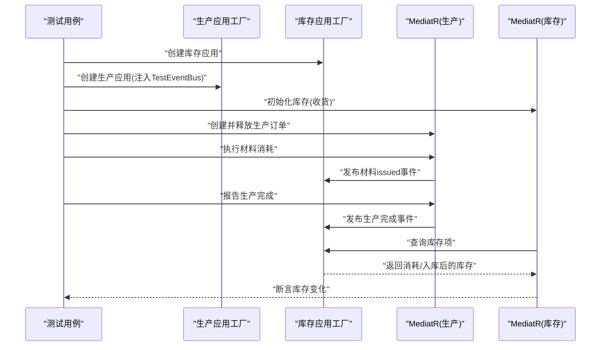

图示来源
- [ProductionToInventoryTests.cs](file://src/Tests/ErpSystem.IntegrationTests/ProductionToInventoryTests.cs#L17-L129)
- [IntegrationTestBase.cs](file://src/Tests/ErpSystem.IntegrationTests/IntegrationTestBase.cs#L73-L94)

章节来源
- [ProductionToInventoryTests.cs](file://src/Tests/ErpSystem.IntegrationTests/ProductionToInventoryTests.cs#L15-L130)

### HR 到 Identity 集成测试（员工生命周期）
- 验证员工入职自动创建身份账户，离职后锁定账户。
- 通过两个不同端点的 TestEventBus 分别处理“入职”与“离职”事件。

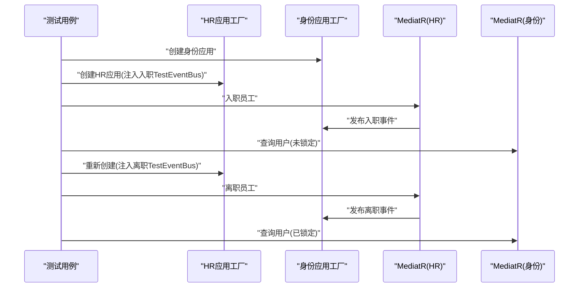

图示来源
- [HRToIdentityTests.cs](file://src/Tests/ErpSystem.IntegrationTests/HRToIdentityTests.cs#L17-L98)
- [IntegrationTestBase.cs](file://src/Tests/ErpSystem.IntegrationTests/IntegrationTestBase.cs#L31-L71)

章节来源
- [HRToIdentityTests.cs](file://src/Tests/ErpSystem.IntegrationTests/HRToIdentityTests.cs#L15-L100)

### 质量控制工作流集成测试
- 验证质量点定义、质量检查通过与告警跟踪等流程，使用 FluentAssertions 进行断言。

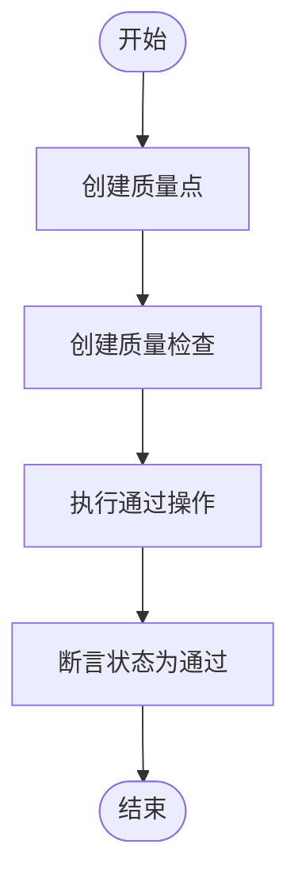

图示来源
- [QualityWorkflowTests.cs](file://src/Tests/ErpSystem.IntegrationTests/Quality/QualityWorkflowTests.cs#L11-L54)

章节来源
- [QualityWorkflowTests.cs](file://src/Tests/ErpSystem.IntegrationTests/Quality/QualityWorkflowTests.cs#L10-L54)

### 自动化引擎与动作执行
- 自动化规则聚合定义触发事件、条件与动作列表；自动化引擎支持发送邮件、Webhook、通知等动作。
- 在测试中可通过模拟服务接口或替换实现来验证规则触发与动作执行。

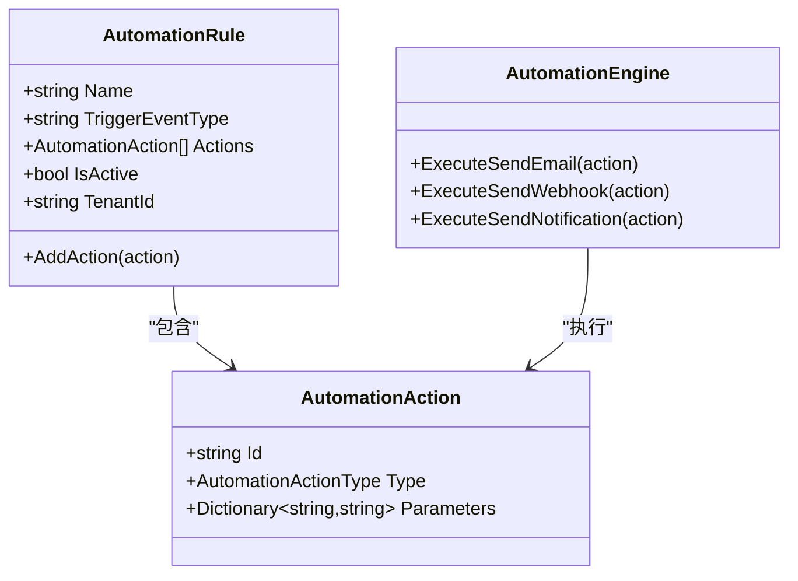

图示来源
- [AutomationRuleAggregate.cs](file://src/Services/Automation/ErpSystem.Automation/Domain/AutomationRuleAggregate.cs#L8-L137)
- [AutomationEngine.cs](file://src/Services/Automation/ErpSystem.Automation/Application/AutomationEngine.cs#L191-L221)
- [Program.cs（自动化服务）](file://src/Services/Automation/ErpSystem.Automation/Program.cs#L117-L125)

章节来源
- [AutomationRuleAggregate.cs](file://src/Services/Automation/ErpSystem.Automation/Domain/AutomationRuleAggregate.cs#L8-L173)
- [AutomationEngine.cs](file://src/Services/Automation/ErpSystem.Automation/Application/AutomationEngine.cs#L191-L221)
- [Program.cs（自动化服务）](file://src/Services/Automation/ErpSystem.Automation/Program.cs#L117-L125)

## 依赖关系分析
- 测试工程依赖所有业务服务项目，以便在单个测试套件中验证跨服务交互。
- 测试工程引入 xUnit、Moq、EF Core InMemory、MediatR、Dapr.AspNetCore 等包，支撑测试框架、模拟与事件总线。
- 通过 docker-compose 启动 PostgreSQL、Redis、Dapr Placement 与 Zipkin，为集成测试提供一致的基础设施。

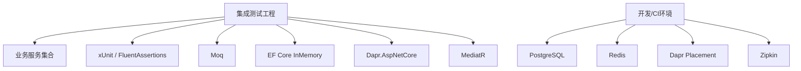

图示来源
- [ErpSystem.IntegrationTests.csproj](file://src/Tests/ErpSystem.IntegrationTests/ErpSystem.IntegrationTests.csproj#L10-L41)
- [docker-compose.yml](file://docker-compose.yml#L1-L99)

章节来源
- [ErpSystem.IntegrationTests.csproj](file://src/Tests/ErpSystem.IntegrationTests/ErpSystem.IntegrationTests.csproj#L1-L44)
- [docker-compose.yml](file://docker-compose.yml#L1-L99)

## 性能考虑
- 使用内存数据库与 Mock 外部依赖，降低测试执行时间与资源占用。
- 对异步事件处理添加合理延迟（如 Task.Delay）以等待投影更新，避免竞态条件。
- 在 CI 环境中并行运行测试套件，缩短反馈周期。
- 结合 ResiliencePolicies 的超时与熔断策略，提高跨服务调用的稳定性。

章节来源
- [IntegrationTestBase.cs](file://src/Tests/ErpSystem.IntegrationTests/IntegrationTestBase.cs#L31-L186)
- [GLTests.cs](file://src/Tests/ErpSystem.IntegrationTests/GLTests.cs#L62-L64)
- [SalesToInventoryTests.cs](file://src/Tests/ErpSystem.IntegrationTests/SalesToInventoryTests.cs#L63-L68)
- [ProcurementToInventoryTests.cs](file://src/Tests/ErpSystem.IntegrationTests/ProcurementToInventoryTests.cs#L66-L71)
- [ProductionToInventoryTests.cs](file://src/Tests/ErpSystem.IntegrationTests/ProductionToInventoryTests.cs#L58-L62)
- [ResiliencePolicies.cs](file://src/BuildingBlocks/ErpSystem.BuildingBlocks/Resilience/ResiliencePolicies.cs#L37-L78)

## 故障排查指南
- 日志与校验：通过 LoggingBehavior 记录请求处理过程，ValidationBehavior 在缺少校验器时跳过校验，有校验器时统一收集失败项，便于定位输入错误。
- 事件总线：若事件未到达目标服务，检查 TestEventBus 的端点路径与目标服务是否正确注册。
- 内存数据库：确保在测试前清理或重建内存数据库上下文，避免状态污染。
- 并发与延迟：跨服务事件可能有异步处理延迟，适当增加等待时间或轮询查询结果。
- 自动化动作：在测试中可用空实现或模拟服务接口，验证规则触发但不真正发送邮件/通知。

章节来源
- [LoggingBehavior.cs](file://src/BuildingBlocks/ErpSystem.BuildingBlocks/Behaviors/LoggingBehavior.cs#L7-L29)
- [ValidationBehavior.cs](file://src/BuildingBlocks/ErpSystem.BuildingBlocks/Behaviors/ValidationBehavior.cs#L7-L40)
- [IntegrationTestBase.cs](file://src/Tests/ErpSystem.IntegrationTests/IntegrationTestBase.cs#L194-L204)
- [Program.cs（自动化服务）](file://src/Services/Automation/ErpSystem.Automation/Program.cs#L117-L125)

## 结论
本测试策略以集成测试为核心，结合内存数据库与 Mock 对外部依赖进行隔离，通过 TestEventBus 实现事件驱动的跨服务验证，覆盖财务、销售、采购、生产、库存、HR、身份与质量等关键业务流程。建议在现有基础上补充单元测试与端到端测试，完善覆盖率与性能指标，并在 CI 中引入并行执行与报告聚合，持续提升质量保障水平。

## 附录

### 测试金字塔与覆盖率目标
- 单元测试：≥ 80% 覆盖率目标（领域模型、聚合根、应用服务、基础设施组件）。
- 集成测试：核心流程 100% 覆盖，重点验证事件驱动与跨服务交互。
- 端到端测试：关键业务场景（如从销售下单到库存预留、从采购收货到库存入账）。

章节来源
- [prd.md.resolved](file://src/prd.md.resolved#L428-L440)

### 测试命令与过滤
- 执行单元测试（按分类过滤）与集成测试套件的命令示例见产品需求文档。

章节来源
- [prd.md.resolved](file://src/prd.md.resolved#L436-L440)

### 测试环境配置与容器化
- Dockerfile 支持多服务镜像构建与健康检查。
- docker-compose 提供 PostgreSQL、Redis、Dapr Placement、Zipkin 等基础设施服务。
- Helm values 定义了服务副本数、镜像仓库与 Dapr 组件配置，便于在集群中部署测试环境。

章节来源
- [Dockerfile](file://Dockerfile#L1-L37)
- [docker-compose.yml](file://docker-compose.yml#L1-L99)
- [values.yaml](file://deploy/helm/erp-system/values.yaml#L1-L127)

### 持续集成与测试自动化
- 建议在 CI 中：
  - 拉起 docker-compose 服务作为测试后端。
  - 并行执行集成测试套件，生成测试报告与覆盖率。
  - 将覆盖率与测试结果上传至制品库或质量平台。
  - 对关键服务使用 Helm 在集群中部署并执行端到端测试。

章节来源
- [docker-compose.yml](file://docker-compose.yml#L1-L99)
- [values.yaml](file://deploy/helm/erp-system/values.yaml#L1-L127)

### 测试驱动开发（TDD）与行为驱动开发（BDD）
- TDD：先编写失败的测试，再编写最小代码使其通过，最后重构。适用于单元测试与小范围集成测试。
- BDD：以行为描述（Given/When/Then）编写测试，强调业务价值与可读性，适合跨服务业务流程测试与验收测试。

章节来源
- [QualityWorkflowTests.cs](file://src/Tests/ErpSystem.IntegrationTests/Quality/QualityWorkflowTests.cs#L11-L54)