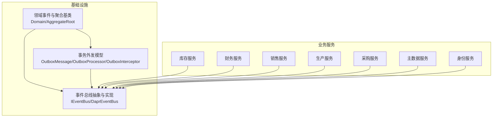
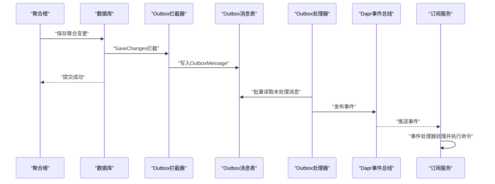
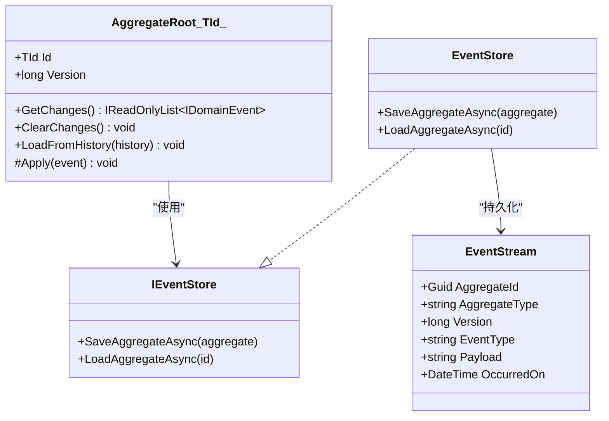
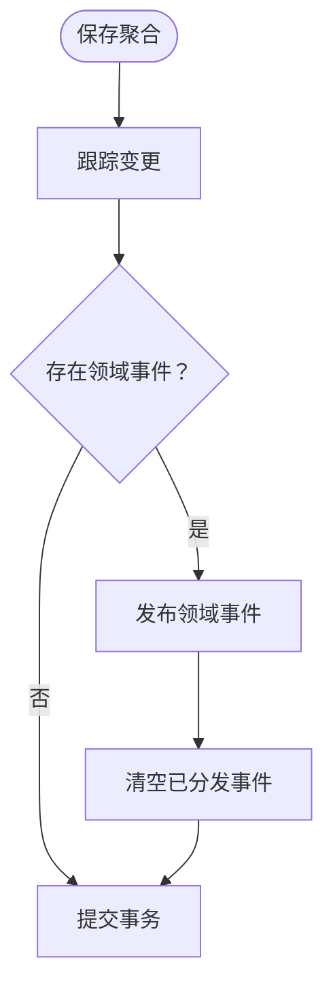
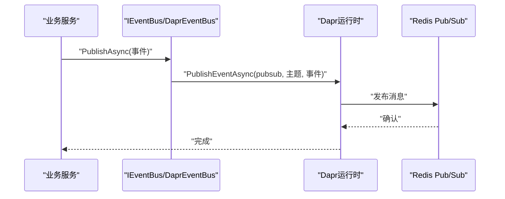
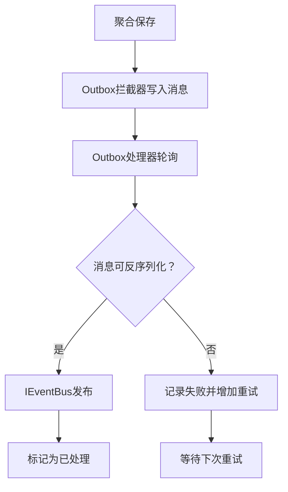
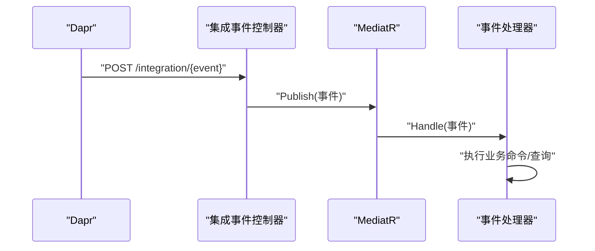
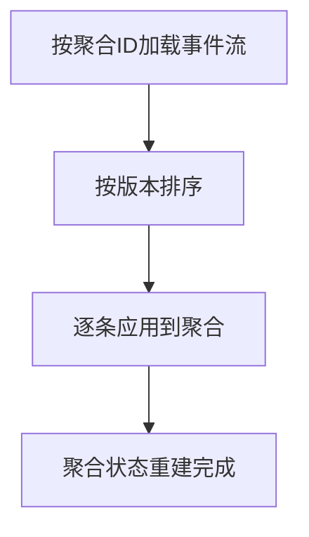
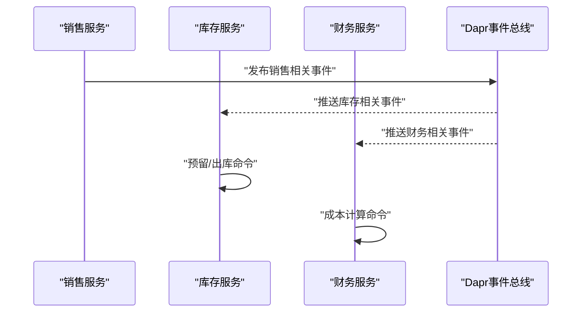
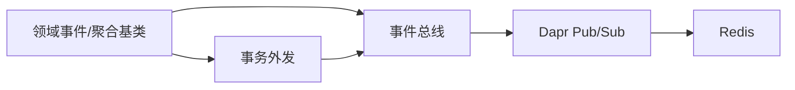

# 事件驱动架构

<cite>
**本文引用的文件**
- [DomainEventDispatcher.cs](file://src/BuildingBlocks/ErpSystem.BuildingBlocks/Domain/DomainEventDispatcher.cs)
- [DDDBase.cs](file://src/BuildingBlocks/ErpSystem.BuildingBlocks/Domain/DDDBase.cs)
- [DaprEventBus.cs](file://src/BuildingBlocks/ErpSystem.BuildingBlocks/EventBus/DaprEventBus.cs)
- [OutboxMessage.cs](file://src/BuildingBlocks/ErpSystem.BuildingBlocks/Outbox/OutboxMessage.cs)
- [OutboxProcessor.cs](file://src/BuildingBlocks/ErpSystem.BuildingBlocks/Outbox/OutboxProcessor.cs)
- [OutboxInterceptor.cs](file://src/BuildingBlocks/ErpSystem.BuildingBlocks/Outbox/OutboxInterceptor.cs)
- [pubsub.yaml](file://components/pubsub.yaml)
- [EventStore.cs（身份服务）](file://src/Services/Identity/ErpSystem.Identity/Infrastructure/EventStore.cs)
- [EventStore.cs（主数据服务）](file://src/Services/MasterData/ErpSystem.MasterData/Infrastructure/EventStore.cs)
- [IntegrationEventsController（库存服务）](file://src/Services/Inventory/ErpSystem.Inventory/API/IntegrationEventsController.cs)
- [IntegrationEventsController（财务服务）](file://src/Services/Finance/ErpSystem.Finance/API/IntegrationEventsController.cs)
- [IntegrationEventHandlers（库存服务）](file://src/Services/Inventory/ErpSystem.Inventory/Application/IntegrationEventHandlers.cs)
- [CostCalculationEventHandlers.cs（财务服务）](file://src/Services/Finance/ErpSystem.Finance/Application/CostCalculationEventHandlers.cs)
- [HRIntegrationEvents.cs（身份服务）](file://src/Services/Identity/ErpSystem.Identity/Application/IntegrationEvents/HRIntegrationEvents.cs)
- [SalesOrderAggregate.cs（销售服务）](file://src/Services/Sales/ErpSystem.Sales/Domain/SalesOrderAggregate.cs)
- [Program.cs（生产服务）](file://src/Services/Production/ErpSystem.Production/Program.cs)
- [Program.cs（采购服务）](file://src/Services/Procurement/ErpSystem.Procurement/Program.cs)
- [Program.cs（销售服务）](file://src/Services/Sales/ErpSystem.Sales/Program.cs)
</cite>

## 目录
1. [引言](#引言)
2. [项目结构](#项目结构)
3. [核心组件](#核心组件)
4. [架构总览](#架构总览)
5. [详细组件分析](#详细组件分析)
6. [依赖关系分析](#依赖关系分析)
7. [性能考量](#性能考量)
8. [故障排查指南](#故障排查指南)
9. [结论](#结论)
10. [附录](#附录)

## 引言
本文件面向ERP系统的事件驱动架构，系统性阐述事件溯源（Event Sourcing）的实现原理、领域事件的设计模式与事件存储机制；解释Dapr事件总线的集成方式、Pub/Sub消息传递与事件订阅模式；覆盖事件处理器实现、事件重放机制与数据一致性保障；并给出事件驱动的业务流程、异步处理策略与错误恢复机制，辅以架构图与事件流转示例。

## 项目结构
该仓库采用多服务微服务架构，围绕“领域事件 + 事务外发（Outbox）+ Dapr Pub/Sub”的事件驱动范式组织代码。关键模块分布如下：
- 基础设施层：领域事件分发、事件总线、事务外发与拦截器、事件存储接口与实现
- 各业务服务：按需选择事件溯源或仅使用领域事件/Outbox，通过Dapr Pub/Sub进行跨服务通信
- 部署组件：Redis Pub/Sub作为Dapr事件总线后端

图表来源
- [DDDBase.cs](file://src/BuildingBlocks/ErpSystem.BuildingBlocks/Domain/DDDBase.cs#L14-L41)
- [OutboxMessage.cs](file://src/BuildingBlocks/ErpSystem.BuildingBlocks/Outbox/OutboxMessage.cs#L10-L54)
- [OutboxProcessor.cs](file://src/BuildingBlocks/ErpSystem.BuildingBlocks/Outbox/OutboxProcessor.cs#L8-L71)
- [DaprEventBus.cs](file://src/BuildingBlocks/ErpSystem.BuildingBlocks/EventBus/DaprEventBus.cs#L11-L21)

章节来源
- [DDDBase.cs](file://src/BuildingBlocks/ErpSystem.BuildingBlocks/Domain/DDDBase.cs#L14-L41)
- [OutboxMessage.cs](file://src/BuildingBlocks/ErpSystem.BuildingBlocks/Outbox/OutboxMessage.cs#L10-L54)
- [DaprEventBus.cs](file://src/BuildingBlocks/ErpSystem.BuildingBlocks/EventBus/DaprEventBus.cs#L11-L21)

## 核心组件
- 领域事件与聚合基类：定义统一的领域事件接口、聚合根基类及历史加载能力，支持事件溯源的“重放”能力
- 事件总线：封装Dapr Pub/Sub发布接口，提供统一的事件发布能力
- 事务外发：在同一个数据库事务内持久化待发送消息，并由后台作业异步投递，确保“至少一次”投递
- 事件存储：将聚合产生的事件序列化并持久化到事件存储表，支持按聚合ID加载完整历史

章节来源
- [DDDBase.cs](file://src/BuildingBlocks/ErpSystem.BuildingBlocks/Domain/DDDBase.cs#L8-L41)
- [DaprEventBus.cs](file://src/BuildingBlocks/ErpSystem.BuildingBlocks/EventBus/DaprEventBus.cs#L6-L21)
- [OutboxMessage.cs](file://src/BuildingBlocks/ErpSystem.BuildingBlocks/Outbox/OutboxMessage.cs#L10-L54)
- [OutboxProcessor.cs](file://src/BuildingBlocks/ErpSystem.BuildingBlocks/Outbox/OutboxProcessor.cs#L8-L71)

## 架构总览
下图展示事件从领域聚合产生，经Outbox持久化与异步投递，再由Dapr Pub/Sub广播至订阅者，最终由事件处理器更新目标服务状态或触发进一步命令的完整流程。

图表来源
- [OutboxInterceptor.cs](file://src/BuildingBlocks/ErpSystem.BuildingBlocks/Outbox/OutboxInterceptor.cs#L8-L49)
- [OutboxProcessor.cs](file://src/BuildingBlocks/ErpSystem.BuildingBlocks/Outbox/OutboxProcessor.cs#L29-L70)
- [DaprEventBus.cs](file://src/BuildingBlocks/ErpSystem.BuildingBlocks/EventBus/DaprEventBus.cs#L15-L20)

## 详细组件分析

### 事件溯源与事件存储
- 事件存储表结构：包含聚合类型、版本号、事件类型、事件载荷与发生时间等字段，使用JSONB存储事件载荷
- 事件存储接口：提供保存聚合变更与按聚合ID加载历史的能力
- 加载与重放：通过事件类型解析器反序列化事件，逐条应用到聚合实例，实现完整历史重放

图表来源
- [DDDBase.cs](file://src/BuildingBlocks/ErpSystem.BuildingBlocks/Domain/DDDBase.cs#L14-L41)
- [DDDBase.cs](file://src/BuildingBlocks/ErpSystem.BuildingBlocks/Domain/DDDBase.cs#L43-L51)
- [DDDBase.cs](file://src/BuildingBlocks/ErpSystem.BuildingBlocks/Domain/DDDBase.cs#L53-L120)
- [EventStore.cs（身份服务）](file://src/Services/Identity/ErpSystem.Identity/Infrastructure/EventStore.cs#L6-L18)
- [EventStore.cs（主数据服务）](file://src/Services/MasterData/ErpSystem.MasterData/Infrastructure/EventStore.cs#L6-L18)

章节来源
- [DDDBase.cs](file://src/BuildingBlocks/ErpSystem.BuildingBlocks/Domain/DDDBase.cs#L53-L120)
- [EventStore.cs（身份服务）](file://src/Services/Identity/ErpSystem.Identity/Infrastructure/EventStore.cs#L6-L18)
- [EventStore.cs（主数据服务）](file://src/Services/MasterData/ErpSystem.MasterData/Infrastructure/EventStore.cs#L6-L18)

### 领域事件设计与分发
- 领域事件接口：统一事件标识与发生时间
- 聚合根基类：维护未提交的领域事件列表，在提交时清空已分发事件
- 保存拦截器：在EF Core SaveChanges完成后自动收集并发布领域事件

图表来源
- [DomainEventDispatcher.cs](file://src/BuildingBlocks/ErpSystem.BuildingBlocks/Domain/DomainEventDispatcher.cs#L19-L42)

章节来源
- [DomainEventDispatcher.cs](file://src/BuildingBlocks/ErpSystem.BuildingBlocks/Domain/DomainEventDispatcher.cs#L12-L43)

### Dapr事件总线与Pub/Sub集成
- 事件总线抽象：统一的发布接口，便于替换实现
- Dapr实现：默认Pub/Sub名称为“pubsub”，事件主题名采用事件类型的简单名称
- 组件配置：Redis作为Dapr Pub/Sub后端，提供高可用的消息传输

图表来源
- [DaprEventBus.cs](file://src/BuildingBlocks/ErpSystem.BuildingBlocks/EventBus/DaprEventBus.cs#L11-L21)
- [pubsub.yaml](file://components/pubsub.yaml#L1-L13)

章节来源
- [DaprEventBus.cs](file://src/BuildingBlocks/ErpSystem.BuildingBlocks/EventBus/DaprEventBus.cs#L6-L21)
- [pubsub.yaml](file://components/pubsub.yaml#L1-L13)

### 事务外发与异步投递
- 外发消息模型：在同事务内持久化事件消息，包含消息类型、载荷、创建时间、处理状态与重试计数
- 外发拦截器：在保存聚合时自动捕获领域事件并写入外发消息表
- 外发处理器：后台作业定期拉取未处理消息，发布到事件总线并标记处理结果

图表来源
- [OutboxInterceptor.cs](file://src/BuildingBlocks/ErpSystem.BuildingBlocks/Outbox/OutboxInterceptor.cs#L8-L49)
- [OutboxProcessor.cs](file://src/BuildingBlocks/ErpSystem.BuildingBlocks/Outbox/OutboxProcessor.cs#L29-L70)
- [OutboxMessage.cs](file://src/BuildingBlocks/ErpSystem.BuildingBlocks/Outbox/OutboxMessage.cs#L22-L54)

章节来源
- [OutboxMessage.cs](file://src/BuildingBlocks/ErpSystem.BuildingBlocks/Outbox/OutboxMessage.cs#L10-L54)
- [OutboxProcessor.cs](file://src/BuildingBlocks/ErpSystem.BuildingBlocks/Outbox/OutboxProcessor.cs#L8-L71)
- [OutboxInterceptor.cs](file://src/BuildingBlocks/ErpSystem.BuildingBlocks/Outbox/OutboxInterceptor.cs#L8-L49)

### 事件处理器与订阅模式
- 订阅端控制器：接收来自Dapr的HTTP回调（或通过注解声明），直接发布到本地MediatR管道
- 事件处理器：基于INotificationHandler实现，对集成事件进行业务处理（如库存预留/出库、成本计算）
- 事件类型：采用强类型记录（record）表示事件，包含业务上下文与发生时间

图表来源
- [IntegrationEventsController（库存服务）](file://src/Services/Inventory/ErpSystem.Inventory/API/IntegrationEventsController.cs#L8-L48)
- [IntegrationEventHandlers（库存服务）](file://src/Services/Inventory/ErpSystem.Inventory/Application/IntegrationEventHandlers.cs#L14-L111)
- [IntegrationEventsController（财务服务）](file://src/Services/Finance/ErpSystem.Finance/API/IntegrationEventsController.cs#L8-L16)

章节来源
- [IntegrationEventsController（库存服务）](file://src/Services/Inventory/ErpSystem.Inventory/API/IntegrationEventsController.cs#L8-L48)
- [IntegrationEventHandlers（库存服务）](file://src/Services/Inventory/ErpSystem.Inventory/Application/IntegrationEventHandlers.cs#L14-L111)
- [IntegrationEventsController（财务服务）](file://src/Services/Finance/ErpSystem.Finance/API/IntegrationEventsController.cs#L8-L16)

### 事件重放与数据一致性
- 事件重放：通过事件存储按版本顺序加载事件，逐条应用到聚合，实现历史重建
- 一致性保障：结合Outbox与事件总线，确保事件发布与业务事务原子性；事件处理器幂等设计避免重复处理
- 事件溯源服务注册：各服务在启动时注册事件存储与仓储，确保事件重放与发布链路可用

图表来源
- [DDDBase.cs](file://src/BuildingBlocks/ErpSystem.BuildingBlocks/Domain/DDDBase.cs#L101-L119)
- [Program.cs（生产服务）](file://src/Services/Production/ErpSystem.Production/Program.cs#L36-L45)
- [Program.cs（采购服务）](file://src/Services/Procurement/ErpSystem.Procurement/Program.cs#L36-L45)
- [Program.cs（销售服务）](file://src/Services/Sales/ErpSystem.Sales/Program.cs#L36-L45)

章节来源
- [DDDBase.cs](file://src/BuildingBlocks/ErpSystem.BuildingBlocks/Domain/DDDBase.cs#L101-L119)
- [Program.cs（生产服务）](file://src/Services/Production/ErpSystem.Production/Program.cs#L36-L45)
- [Program.cs（采购服务）](file://src/Services/Procurement/ErpSystem.Procurement/Program.cs#L36-L45)
- [Program.cs（销售服务）](file://src/Services/Sales/ErpSystem.Sales/Program.cs#L36-L45)

### 业务事件示例与流转
- 销售订单创建：聚合产生领域事件，经Outbox与事件总线发布；订阅方（如库存、财务）根据事件执行后续命令
- 成本计算：财务服务订阅采购入库事件，基于事件内容更新物料移动平均成本
- 人员事件：身份服务发布员工入职/离职事件，供其他服务订阅并同步用户信息

图表来源
- [SalesOrderAggregate.cs（销售服务）](file://src/Services/Sales/ErpSystem.Sales/Domain/SalesOrderAggregate.cs#L55-L64)
- [IntegrationEventHandlers（库存服务）](file://src/Services/Inventory/ErpSystem.Inventory/Application/IntegrationEventHandlers.cs#L14-L111)
- [CostCalculationEventHandlers.cs（财务服务）](file://src/Services/Finance/ErpSystem.Finance/Application/CostCalculationEventHandlers.cs#L10-L111)
- [HRIntegrationEvents.cs（身份服务）](file://src/Services/Identity/ErpSystem.Identity/Application/IntegrationEvents/HRIntegrationEvents.cs#L5-L21)

章节来源
- [SalesOrderAggregate.cs（销售服务）](file://src/Services/Sales/ErpSystem.Sales/Domain/SalesOrderAggregate.cs#L55-L64)
- [IntegrationEventHandlers（库存服务）](file://src/Services/Inventory/ErpSystem.Inventory/Application/IntegrationEventHandlers.cs#L14-L111)
- [CostCalculationEventHandlers.cs（财务服务）](file://src/Services/Finance/ErpSystem.Finance/Application/CostCalculationEventHandlers.cs#L10-L111)
- [HRIntegrationEvents.cs（身份服务）](file://src/Services/Identity/ErpSystem.Identity/Application/IntegrationEvents/HRIntegrationEvents.cs#L5-L21)

## 依赖关系分析
- 低耦合：事件总线与事件存储通过接口抽象，便于替换实现
- 可观测性：事件处理器记录日志，Outbox处理器记录异常与重试状态
- 运行时依赖：Dapr Pub/Sub组件通过Redis提供消息传输；各服务独立管理事件存储与只读投影

图表来源
- [DaprEventBus.cs](file://src/BuildingBlocks/ErpSystem.BuildingBlocks/EventBus/DaprEventBus.cs#L11-L21)
- [pubsub.yaml](file://components/pubsub.yaml#L1-L13)

章节来源
- [DaprEventBus.cs](file://src/BuildingBlocks/ErpSystem.BuildingBlocks/EventBus/DaprEventBus.cs#L11-L21)
- [pubsub.yaml](file://components/pubsub.yaml#L1-L13)

## 性能考量
- 批量处理：Outbox处理器按批次处理消息，降低数据库压力
- 索引优化：未处理消息索引过滤提升查询效率
- 序列化开销：事件载荷采用JSONB存储，建议控制事件粒度与大小
- 幂等设计：事件处理器应具备幂等能力，避免重复处理导致的性能浪费

## 故障排查指南
- 事件未投递：检查Outbox处理器是否运行、数据库连接与索引是否存在
- 事件重复：确认事件处理器幂等逻辑，检查Outbox消息处理状态
- 事件类型解析失败：核对事件类型解析器映射与事件命名约定
- Dapr订阅问题：确认主题名称与事件类型一致，检查组件配置与网络连通性

章节来源
- [OutboxProcessor.cs](file://src/BuildingBlocks/ErpSystem.BuildingBlocks/Outbox/OutboxProcessor.cs#L8-L71)
- [OutboxMessage.cs](file://src/BuildingBlocks/ErpSystem.BuildingBlocks/Outbox/OutboxMessage.cs#L67-L81)
- [DaprEventBus.cs](file://src/BuildingBlocks/ErpSystem.BuildingBlocks/EventBus/DaprEventBus.cs#L11-L21)

## 结论
本架构以“领域事件 + 事务外发 + Dapr Pub/Sub”为核心，实现了跨服务的松耦合与高可靠事件传递。事件溯源提供了完整的审计与重放能力，Outbox确保了消息交付的可靠性，事件处理器与订阅模式支撑了复杂的业务编排。通过合理的幂等设计与可观测性，系统在复杂ERP场景下具备良好的扩展性与稳定性。

## 附录
- 事件类型命名规范：采用事件类型的简单名称作为Dapr主题名
- 事件处理器最佳实践：保持无副作用、幂等、可重试；对失败事件进行隔离与告警
- 部署建议：为每个事件存储数据库单独部署，避免跨服务共享造成耦合