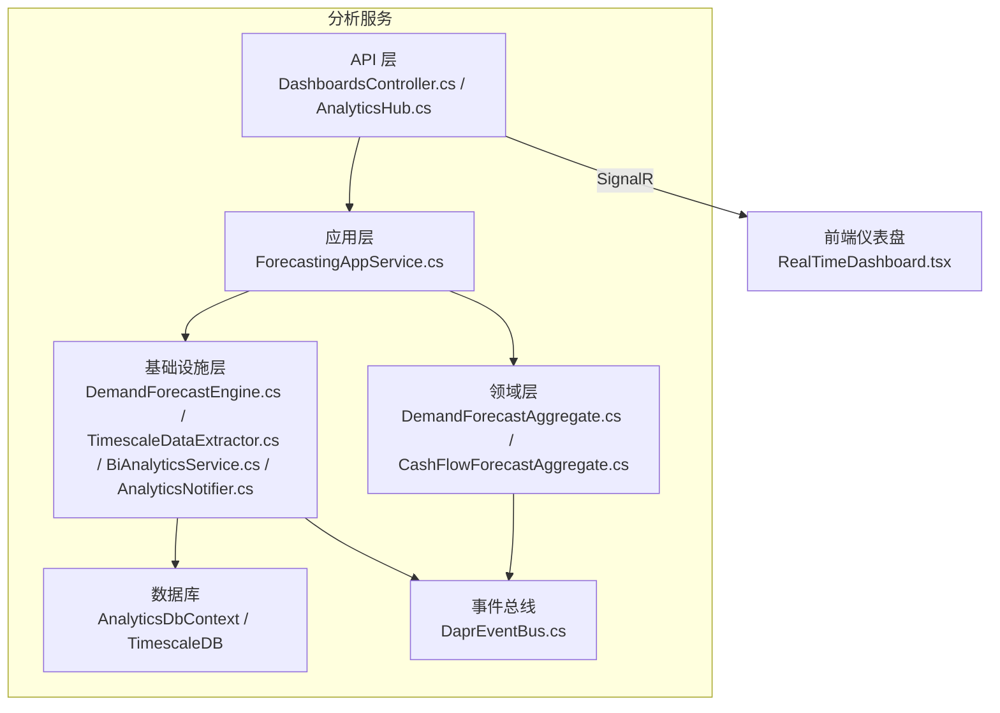
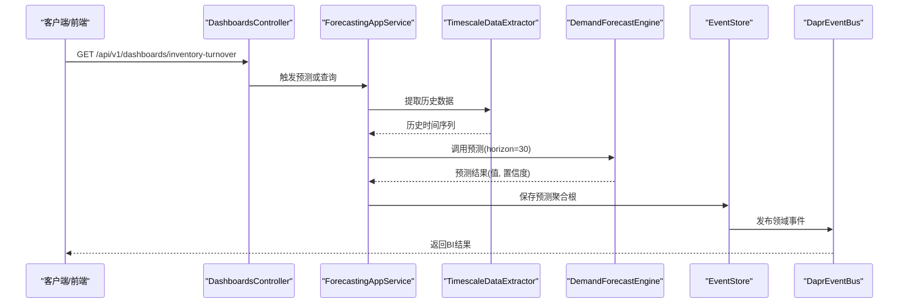
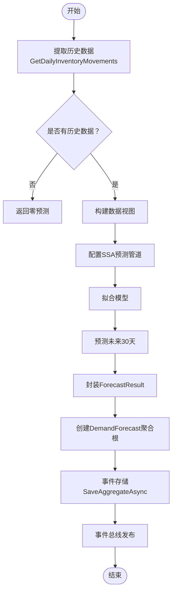
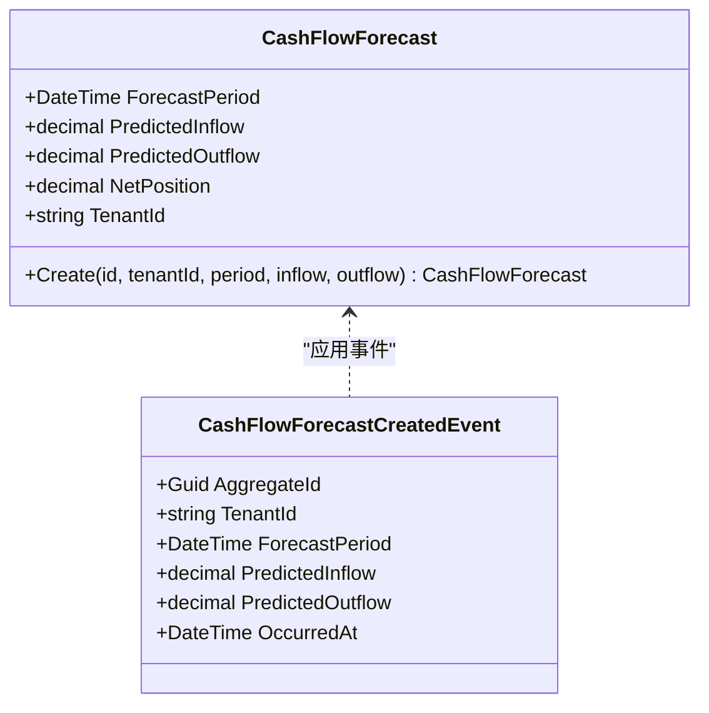
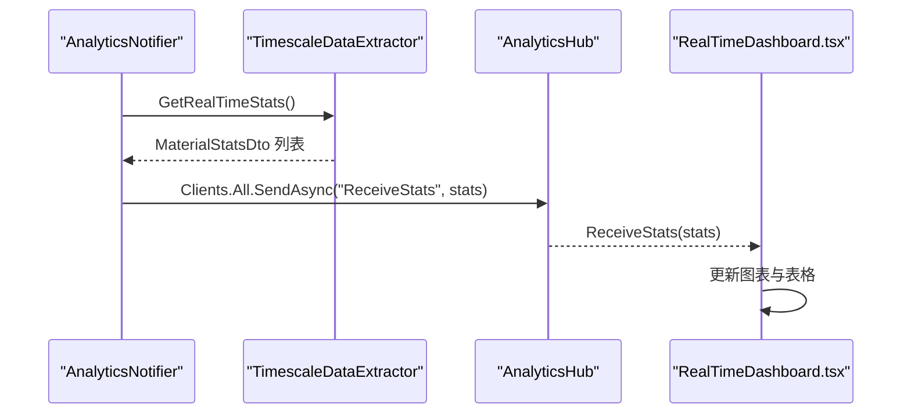
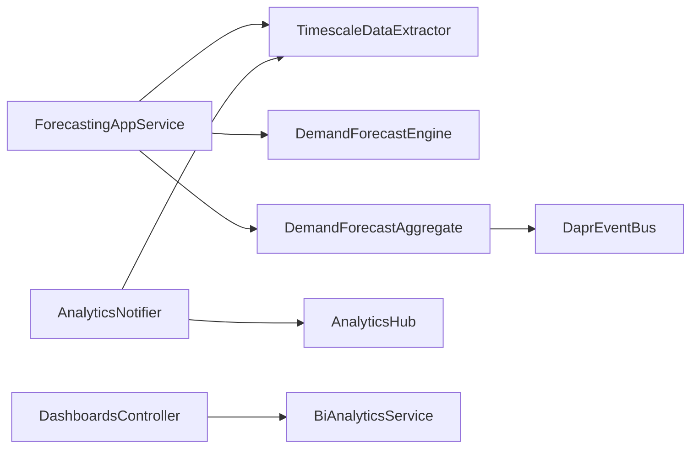

# 分析服务

<cite>
**本文引用的文件**
- [Program.cs](file://src/Services/Analytics/ErpSystem.Analytics/Program.cs)
- [appsettings.json](file://src/Services/Analytics/ErpSystem.Analytics/appsettings.json)
- [ErpSystem.Analytics.csproj](file://src/Services/Analytics/ErpSystem.Analytics/ErpSystem.Analytics.csproj)
- [ForecastingAppService.cs](file://src/Services/Analytics/ErpSystem.Analytics/Application/ForecastingAppService.cs)
- [DashboardsController.cs](file://src/Services/Analytics/ErpSystem.Analytics/API/DashboardsController.cs)
- [DemandForecastAggregate.cs](file://src/Services/Analytics/ErpSystem.Analytics/Domain/DemandForecastAggregate.cs)
- [CashFlowForecastAggregate.cs](file://src/Services/Analytics/ErpSystem.Analytics/Domain/CashFlowForecastAggregate.cs)
- [DemandForecastEngine.cs](file://src/Services/Analytics/ErpSystem.Analytics/Infrastructure/DemandForecastEngine.cs)
- [TimescaleDataExtractor.cs](file://src/Services/Analytics/ErpSystem.Analytics/Infrastructure/TimescaleDataExtractor.cs)
- [BiAnalyticsService.cs](file://src/Services/Analytics/ErpSystem.Analytics/Infrastructure/BiAnalyticsService.cs)
- [AnalyticsHub.cs](file://src/Services/Analytics/ErpSystem.Analytics/API/Hubs/AnalyticsHub.cs)
- [AnalyticsNotifier.cs](file://src/Services/Analytics/ErpSystem.Analytics/Infrastructure/BackgroundJobs/AnalyticsNotifier.cs)
- [DaprEventBus.cs](file://src/BuildingBlocks/ErpSystem.BuildingBlocks/EventBus/DaprEventBus.cs)
- [PredictiveAnalyticsTests.cs](file://src/Tests/ErpSystem.IntegrationTests/Analytics/PredictiveAnalyticsTests.cs)
- [RealTimeDashboard.tsx](file://src/Web/ErpSystem.Web/src/components/RealTimeDashboard.tsx)
</cite>

## 目录
1. [简介](#简介)
2. [项目结构](#项目结构)
3. [核心组件](#核心组件)
4. [架构总览](#架构总览)
5. [详细组件分析](#详细组件分析)
6. [依赖关系分析](#依赖关系分析)
7. [性能考虑](#性能考虑)
8. [故障排查指南](#故障排查指南)
9. [结论](#结论)
10. [附录](#附录)

## 简介
本文件为“分析服务”的微服务级技术文档，聚焦以下能力：
- 需求预测：基于历史库存移动数据，使用 ML.NET 的 SSA 时间序列预测模型进行未来需求预测，并以事件溯源方式持久化预测结果。
- 现金流预测：以聚合根形式管理预测期内的流入与流出，支持后续扩展具体算法。
- 实时分析：通过 TimescaleDB 连续聚合与工具函数，周期性提取高级统计指标并通过 SignalR 推送至前端仪表盘。
- ETL 流程：从 TimescaleDB 按天聚合抽取历史与实时统计，转换为预测输入或 BI 查询结果。
- API 设计：提供仪表盘查询接口与 SignalR 推送通道；应用层编排预测任务。
- 模型配置与优化：ML.NET 管道参数、窗口大小、置信区间与后台广播频率等。

## 项目结构
分析服务采用分层架构，包含应用层、领域层、基础设施层与 API 层，并集成事件总线、信号推送与后台作业。

图表来源
- [Program.cs](file://src/Services/Analytics/ErpSystem.Analytics/Program.cs#L1-L83)
- [DashboardsController.cs](file://src/Services/Analytics/ErpSystem.Analytics/API/DashboardsController.cs#L1-L26)
- [ForecastingAppService.cs](file://src/Services/Analytics/ErpSystem.Analytics/Application/ForecastingAppService.cs#L1-L42)
- [DemandForecastAggregate.cs](file://src/Services/Analytics/ErpSystem.Analytics/Domain/DemandForecastAggregate.cs#L1-L69)
- [CashFlowForecastAggregate.cs](file://src/Services/Analytics/ErpSystem.Analytics/Domain/CashFlowForecastAggregate.cs#L1-L60)
- [DemandForecastEngine.cs](file://src/Services/Analytics/ErpSystem.Analytics/Infrastructure/DemandForecastEngine.cs#L1-L62)
- [TimescaleDataExtractor.cs](file://src/Services/Analytics/ErpSystem.Analytics/Infrastructure/TimescaleDataExtractor.cs#L1-L142)
- [BiAnalyticsService.cs](file://src/Services/Analytics/ErpSystem.Analytics/Infrastructure/BiAnalyticsService.cs#L1-L93)
- [AnalyticsHub.cs](file://src/Services/Analytics/ErpSystem.Analytics/API/Hubs/AnalyticsHub.cs#L1-L13)
- [AnalyticsNotifier.cs](file://src/Services/Analytics/ErpSystem.Analytics/Infrastructure/BackgroundJobs/AnalyticsNotifier.cs#L1-L38)
- [DaprEventBus.cs](file://src/BuildingBlocks/ErpSystem.BuildingBlocks/EventBus/DaprEventBus.cs#L1-L31)

章节来源
- [Program.cs](file://src/Services/Analytics/ErpSystem.Analytics/Program.cs#L1-L83)
- [ErpSystem.Analytics.csproj](file://src/Services/Analytics/ErpSystem.Analytics/ErpSystem.Analytics.csproj#L1-L23)

## 核心组件
- 应用服务：编排预测任务，协调数据提取与模型预测，并保存预测聚合根。
- 领域聚合：需求预测与现金流预测的聚合根，定义不变式与事件应用逻辑。
- 预测引擎：基于 ML.NET 的 SSA 时间序列预测管道。
- 数据提取器：从 TimescaleDB 抽取日粒度库存移动、现金流与实时统计。
- BI 服务：执行仪表盘所需 SQL（如库存周转率）。
- 实时推送：后台作业周期拉取统计并经 SignalR 推送。
- API 入口：REST 控制器与 SignalR Hub。

章节来源
- [ForecastingAppService.cs](file://src/Services/Analytics/ErpSystem.Analytics/Application/ForecastingAppService.cs#L1-L42)
- [DemandForecastAggregate.cs](file://src/Services/Analytics/ErpSystem.Analytics/Domain/DemandForecastAggregate.cs#L1-L69)
- [CashFlowForecastAggregate.cs](file://src/Services/Analytics/ErpSystem.Analytics/Domain/CashFlowForecastAggregate.cs#L1-L60)
- [DemandForecastEngine.cs](file://src/Services/Analytics/ErpSystem.Analytics/Infrastructure/DemandForecastEngine.cs#L1-L62)
- [TimescaleDataExtractor.cs](file://src/Services/Analytics/ErpSystem.Analytics/Infrastructure/TimescaleDataExtractor.cs#L1-L142)
- [BiAnalyticsService.cs](file://src/Services/Analytics/ErpSystem.Analytics/Infrastructure/BiAnalyticsService.cs#L1-L93)
- [AnalyticsHub.cs](file://src/Services/Analytics/ErpSystem.Analytics/API/Hubs/AnalyticsHub.cs#L1-L13)
- [AnalyticsNotifier.cs](file://src/Services/Analytics/ErpSystem.Analytics/Infrastructure/BackgroundJobs/AnalyticsNotifier.cs#L1-L38)

## 架构总览
分析服务通过应用层编排，调用基础设施层的数据提取与预测引擎，将预测结果以领域事件形式写入事件存储，并通过事件总线发布。实时统计由后台作业周期性抓取并通过 SignalR 推送至前端。

图表来源
- [DashboardsController.cs](file://src/Services/Analytics/ErpSystem.Analytics/API/DashboardsController.cs#L1-L26)
- [ForecastingAppService.cs](file://src/Services/Analytics/ErpSystem.Analytics/Application/ForecastingAppService.cs#L1-L42)
- [TimescaleDataExtractor.cs](file://src/Services/Analytics/ErpSystem.Analytics/Infrastructure/TimescaleDataExtractor.cs#L1-L142)
- [DemandForecastEngine.cs](file://src/Services/Analytics/ErpSystem.Analytics/Infrastructure/DemandForecastEngine.cs#L1-L62)
- [DaprEventBus.cs](file://src/BuildingBlocks/ErpSystem.BuildingBlocks/EventBus/DaprEventBus.cs#L1-L31)

## 详细组件分析

### 需求预测（Demand Forecast）
- 输入：最近 N 天的日消耗量序列（从 TimescaleDB 按天聚合）。
- 算法：ML.NET SSA 时间序列预测，设置窗口大小、训练长度与预测步长，输出点预测与置信带。
- 输出：预测值与置信度，封装为领域事件并持久化为聚合根。
- 关键路径：
  - 应用层：提取历史 → 调用引擎 → 生成聚合根 → 事件存储 → 事件总线。
  - 领域层：聚合根创建事件并应用，维护不变式（如预测日期、置信分数）。

图表来源
- [ForecastingAppService.cs](file://src/Services/Analytics/ErpSystem.Analytics/Application/ForecastingAppService.cs#L1-L42)
- [DemandForecastEngine.cs](file://src/Services/Analytics/ErpSystem.Analytics/Infrastructure/DemandForecastEngine.cs#L1-L62)
- [DemandForecastAggregate.cs](file://src/Services/Analytics/ErpSystem.Analytics/Domain/DemandForecastAggregate.cs#L1-L69)

章节来源
- [ForecastingAppService.cs](file://src/Services/Analytics/ErpSystem.Analytics/Application/ForecastingAppService.cs#L1-L42)
- [DemandForecastEngine.cs](file://src/Services/Analytics/ErpSystem.Analytics/Infrastructure/DemandForecastEngine.cs#L1-L62)
- [DemandForecastAggregate.cs](file://src/Services/Analytics/ErpSystem.Analytics/Domain/DemandForecastAggregate.cs#L1-L69)
- [PredictiveAnalyticsTests.cs](file://src/Tests/ErpSystem.IntegrationTests/Analytics/PredictiveAnalyticsTests.cs#L1-L54)

### 现金流预测（Cash Flow Forecast）
- 当前实现：以聚合根承载预测期、流入、流出与净头寸，便于后续接入更复杂的预测算法。
- 扩展建议：可复用需求预测的事件存储与事件总线模式，新增现金流特征（如收入来源、成本构成）与外部因子（如采购计划、销售回款周期）。

图表来源
- [CashFlowForecastAggregate.cs](file://src/Services/Analytics/ErpSystem.Analytics/Domain/CashFlowForecastAggregate.cs#L1-L60)

章节来源
- [CashFlowForecastAggregate.cs](file://src/Services/Analytics/ErpSystem.Analytics/Domain/CashFlowForecastAggregate.cs#L1-L60)

### 实时分析与仪表盘
- 实时统计：后台作业每 5 秒从 TimescaleDB 的高级统计表中读取最近 24 小时的分布统计，通过 SignalR 推送。
- 前端展示：实时仪表盘组件订阅 SignalR 并渲染柱状图与表格。
- BI 查询：提供库存周转率等报表查询，利用连续聚合与成本移动表计算。

图表来源
- [AnalyticsNotifier.cs](file://src/Services/Analytics/ErpSystem.Analytics/Infrastructure/BackgroundJobs/AnalyticsNotifier.cs#L1-L38)
- [TimescaleDataExtractor.cs](file://src/Services/Analytics/ErpSystem.Analytics/Infrastructure/TimescaleDataExtractor.cs#L1-L142)
- [AnalyticsHub.cs](file://src/Services/Analytics/ErpSystem.Analytics/API/Hubs/AnalyticsHub.cs#L1-L13)
- [RealTimeDashboard.tsx](file://src/Web/ErpSystem.Web/src/components/RealTimeDashboard.tsx#L26-L119)

章节来源
- [AnalyticsNotifier.cs](file://src/Services/Analytics/ErpSystem.Analytics/Infrastructure/BackgroundJobs/AnalyticsNotifier.cs#L1-L38)
- [TimescaleDataExtractor.cs](file://src/Services/Analytics/ErpSystem.Analytics/Infrastructure/TimescaleDataExtractor.cs#L1-L142)
- [AnalyticsHub.cs](file://src/Services/Analytics/ErpSystem.Analytics/API/Hubs/AnalyticsHub.cs#L1-L13)
- [RealTimeDashboard.tsx](file://src/Web/ErpSystem.Web/src/components/RealTimeDashboard.tsx#L26-L119)

### API 接口设计
- 仪表盘查询
  - GET /api/v1/dashboards/inventory-turnover?days=30
  - GET /api/v1/dashboards/oee
- 实时推送
  - SignalR Hub: /hubs/analytics
  - 客户端事件: ReceiveStats

章节来源
- [DashboardsController.cs](file://src/Services/Analytics/ErpSystem.Analytics/API/DashboardsController.cs#L1-L26)
- [Program.cs](file://src/Services/Analytics/ErpSystem.Analytics/Program.cs#L56-L56)
- [AnalyticsHub.cs](file://src/Services/Analytics/ErpSystem.Analytics/API/Hubs/AnalyticsHub.cs#L1-L13)

### 数据流与 ETL
- 历史需求预测 ETL
  - 提取：按天聚合库存交易（仅负向出库），时间范围 N 天。
  - 转换：标准化为时间序列数据对象。
  - 加载：ML.NET 训练并预测，事件存储保存聚合根。
- 实时统计 ETL
  - 提取：使用 TimescaleDB 工具函数与连续聚合，最近 24 小时。
  - 转换：映射为 DTO。
  - 推送：SignalR 广播到所有客户端。
- BI 报表 ETL
  - 提取：成本移动表与日库存汇总连续聚合。
  - 计算：库存周转率等指标。
  - 返回：结构化结果集。

章节来源
- [TimescaleDataExtractor.cs](file://src/Services/Analytics/ErpSystem.Analytics/Infrastructure/TimescaleDataExtractor.cs#L1-L142)
- [BiAnalyticsService.cs](file://src/Services/Analytics/ErpSystem.Analytics/Infrastructure/BiAnalyticsService.cs#L1-L93)
- [AnalyticsNotifier.cs](file://src/Services/Analytics/ErpSystem.Analytics/Infrastructure/BackgroundJobs/AnalyticsNotifier.cs#L1-L38)

### 模型训练、更新与评估
- 训练：使用历史序列作为输入，SSA 管道拟合后得到预测器。
- 更新：当前实现未体现在线增量更新；可在后台定期重跑或引入滑动窗口再训练。
- 评估：当前返回固定置信度；建议引入留出验证、误差指标（MAE/MSE）与A/B对比。

章节来源
- [DemandForecastEngine.cs](file://src/Services/Analytics/ErpSystem.Analytics/Infrastructure/DemandForecastEngine.cs#L1-L62)
- [PredictiveAnalyticsTests.cs](file://src/Tests/ErpSystem.IntegrationTests/Analytics/PredictiveAnalyticsTests.cs#L1-L54)

## 依赖关系分析
- 组件耦合
  - 应用层依赖基础设施层（数据提取、预测引擎）与领域层（聚合根）。
  - 领域层通过事件存储与事件总线解耦外部系统。
  - 前端通过 SignalR 与后端解耦。
- 外部依赖
  - TimescaleDB：连续聚合、工具函数与时间序列表。
  - ML.NET：时间序列预测管线。
  - Dapr：事件总线发布。

图表来源
- [ForecastingAppService.cs](file://src/Services/Analytics/ErpSystem.Analytics/Application/ForecastingAppService.cs#L1-L42)
- [TimescaleDataExtractor.cs](file://src/Services/Analytics/ErpSystem.Analytics/Infrastructure/TimescaleDataExtractor.cs#L1-L142)
- [DemandForecastEngine.cs](file://src/Services/Analytics/ErpSystem.Analytics/Infrastructure/DemandForecastEngine.cs#L1-L62)
- [DemandForecastAggregate.cs](file://src/Services/Analytics/ErpSystem.Analytics/Domain/DemandForecastAggregate.cs#L1-L69)
- [DaprEventBus.cs](file://src/BuildingBlocks/ErpSystem.BuildingBlocks/EventBus/DaprEventBus.cs#L1-L31)
- [AnalyticsNotifier.cs](file://src/Services/Analytics/ErpSystem.Analytics/Infrastructure/BackgroundJobs/AnalyticsNotifier.cs#L1-L38)
- [AnalyticsHub.cs](file://src/Services/Analytics/ErpSystem.Analytics/API/Hubs/AnalyticsHub.cs#L1-L13)
- [DashboardsController.cs](file://src/Services/Analytics/ErpSystem.Analytics/API/DashboardsController.cs#L1-L26)
- [BiAnalyticsService.cs](file://src/Services/Analytics/ErpSystem.Analytics/Infrastructure/BiAnalyticsService.cs#L1-L93)

## 性能考虑
- 数据抽取
  - 使用 TimescaleDB 的 time_bucket 与连续聚合，避免全表扫描。
  - 对高频查询增加索引（如 material_id、时间范围）。
- 预测计算
  - 控制历史窗口大小与 horizon，避免过长序列导致内存与计算压力。
  - 合理设置 SSA 窗口，平衡季节性与稳定性。
- 实时推送
  - 后台作业周期 5 秒较短，建议根据数据变化频率与前端刷新策略调整。
  - 前端批量渲染，减少 DOM 更新次数。
- 缓存
  - 可对热点 BI 结果与近期预测结果进行短期缓存，降低重复查询成本。

## 故障排查指南
- 数据连接
  - 确认 AnalyticsConnection 连接字符串正确，TimescaleDB 可访问。
- 预测异常
  - 历史数据为空时返回零预测，属预期行为；检查抽取逻辑与时间范围。
  - ML.NET 异常：确认序列长度与数值类型，必要时增加边界检查。
- 实时推送
  - SignalR 连接失败：检查 Hub 映射与网络策略；查看后台作业日志。
  - 统计为空：确认连续聚合是否启用、工具函数是否可用。
- 事件总线
  - 事件未发布：检查 Dapr PubSub 配置与主题命名规则。

章节来源
- [TimescaleDataExtractor.cs](file://src/Services/Analytics/ErpSystem.Analytics/Infrastructure/TimescaleDataExtractor.cs#L1-L142)
- [AnalyticsNotifier.cs](file://src/Services/Analytics/ErpSystem.Analytics/Infrastructure/BackgroundJobs/AnalyticsNotifier.cs#L1-L38)
- [DaprEventBus.cs](file://src/BuildingBlocks/ErpSystem.BuildingBlocks/EventBus/DaprEventBus.cs#L1-L31)

## 结论
分析服务以事件驱动的方式整合了需求预测、现金流预测与实时分析能力，结合 TimescaleDB 的高效时间序列处理与 ML.NET 的预测能力，形成了可扩展的智能分析平台。后续可在模型更新、评估体系与缓存策略方面进一步完善，以提升准确性与响应性能。

## 附录
- 配置项
  - analyticsdb：分析服务主数据库连接串。
  - AnalyticsConnection：TimescaleDB 连接串，用于实时统计与 BI 查询。
- 包依赖
  - Dapr、Microsoft.ML、Microsoft.ML.TimeSeries、Npgsql.EntityFrameworkCore.PostgreSQL、Swashbuckle.AspNetCore。

章节来源
- [appsettings.json](file://src/Services/Analytics/ErpSystem.Analytics/appsettings.json#L1-L12)
- [ErpSystem.Analytics.csproj](file://src/Services/Analytics/ErpSystem.Analytics/ErpSystem.Analytics.csproj#L1-L23)