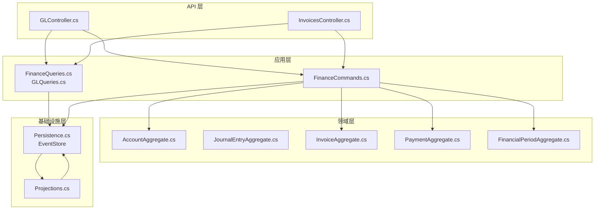
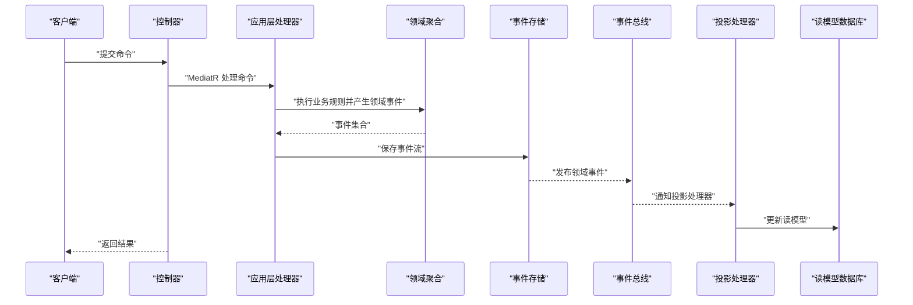
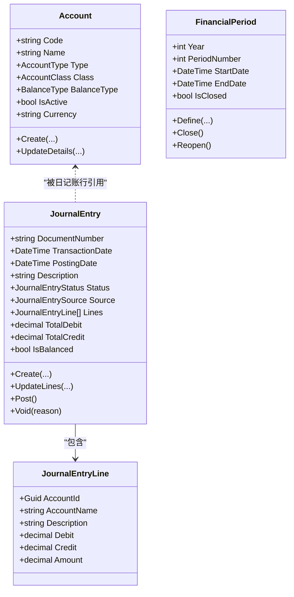
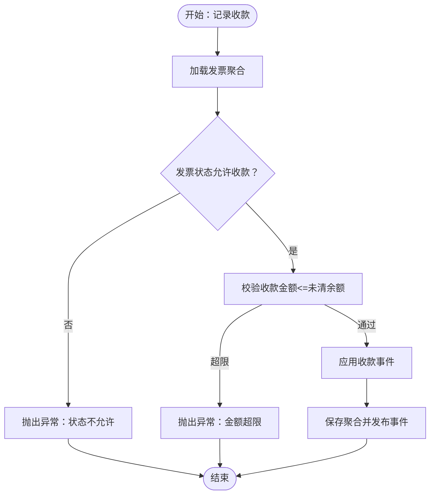
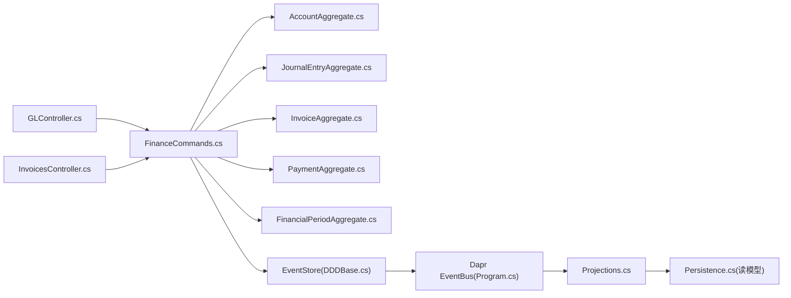

# 财务会计服务

<cite>
**本文引用的文件**
- [Program.cs](file://src/Services/Finance/ErpSystem.Finance/Program.cs)
- [appsettings.json](file://src/Services/Finance/ErpSystem.Finance/appsettings.json)
- [GLController.cs](file://src/Services/Finance/ErpSystem.Finance/API/GLController.cs)
- [InvoicesController.cs](file://src/Services/Finance/ErpSystem.Finance/API/InvoicesController.cs)
- [FinanceCommands.cs](file://src/Services/Finance/ErpSystem.Finance/Application/FinanceCommands.cs)
- [FinanceQueries.cs](file://src/Services/Finance/ErpSystem.Finance/Application/FinanceQueries.cs)
- [GLQueries.cs](file://src/Services/Finance/ErpSystem.Finance/Application/GLQueries.cs)
- [AccountAggregate.cs](file://src/Services/Finance/ErpSystem.Finance/Domain/AccountAggregate.cs)
- [JournalEntryAggregate.cs](file://src/Services/Finance/ErpSystem.Finance/Domain/JournalEntryAggregate.cs)
- [InvoiceAggregate.cs](file://src/Services/Finance/ErpSystem.Finance/Domain/InvoiceAggregate.cs)
- [PaymentAggregate.cs](file://src/Services/Finance/ErpSystem.Finance/Domain/PaymentAggregate.cs)
- [FinancialPeriodAggregate.cs](file://src/Services/Finance/ErpSystem.Finance/Domain/FinancialPeriodAggregate.cs)
- [Persistence.cs](file://src/Services/Finance/ErpSystem.Finance/Infrastructure/Persistence.cs)
- [Projections.cs](file://src/Services/Finance/ErpSystem.Finance/Infrastructure/Projections.cs)
- [DDDBase.cs](file://src/BuildingBlocks/ErpSystem.BuildingBlocks/Domain/DDDBase.cs)
</cite>

## 目录
1. [简介](#简介)
2. [项目结构](#项目结构)
3. [核心组件](#核心组件)
4. [架构总览](#架构总览)
5. [详细组件分析](#详细组件分析)
6. [依赖关系分析](#依赖关系分析)
7. [性能考虑](#性能考虑)
8. [故障排查指南](#故障排查指南)
9. [结论](#结论)
10. [附录：财务API接口规范](#附录财务api接口规范)

## 简介
本文件为财务会计服务的微服务文档，聚焦于总账管理、应收应付、成本核算与财务报表等核心能力。系统采用事件驱动的领域模型设计，结合事件溯源（Event Store）与读写模型分离（CQRS），通过领域事件驱动投影生成财务报表与分析数据，并提供统一的API接口以支撑业务流程与审计追踪。

## 项目结构
财务服务位于 src/Services/Finance/ErpSystem.Finance，主要模块划分如下：
- API 层：提供控制器暴露REST接口，如总账与发票相关接口
- 应用层：定义命令/查询与处理器，协调聚合与仓储
- 领域层：定义聚合根与值对象、领域事件与状态变更
- 基础设施层：事件存储、读模型数据库、投影处理器
- 建筑块：通用的DDD基类、事件存储实现、事件总线集成

图表来源
- [Program.cs](file://src/Services/Finance/ErpSystem.Finance/Program.cs#L20-L49)
- [Persistence.cs](file://src/Services/Finance/ErpSystem.Finance/Infrastructure/Persistence.cs#L6-L50)
- [Projections.cs](file://src/Services/Finance/ErpSystem.Finance/Infrastructure/Projections.cs#L7-L122)
- [DDDBase.cs](file://src/BuildingBlocks/ErpSystem.BuildingBlocks/Domain/DDDBase.cs#L53-L137)

章节来源
- [Program.cs](file://src/Services/Finance/ErpSystem.Finance/Program.cs#L1-L86)
- [appsettings.json](file://src/Services/Finance/ErpSystem.Finance/appsettings.json#L1-L12)

## 核心组件
- 事件存储与仓储：基于PostgreSQL的事件存储表，支持聚合版本化与事件序列持久化；应用层通过仓储保存聚合，加载时重建状态
- 读写模型分离：写模型（事件存储）与读模型（PostgreSQL只读视图）解耦，查询使用独立上下文
- 领域事件驱动投影：通过事件处理器更新读模型，支撑报表与分析
- 总账与日记账：账户、日记账分录、财务期间管理，支持过账与冲销
- 应收应付：发票生命周期（草稿/已开票/部分/全部/核销/作废），付款登记与分配
- 报表与分析：试算平衡、账龄分析、逾期查询等

章节来源
- [DDDBase.cs](file://src/BuildingBlocks/ErpSystem.BuildingBlocks/Domain/DDDBase.cs#L53-L137)
- [Persistence.cs](file://src/Services/Finance/ErpSystem.Finance/Infrastructure/Persistence.cs#L6-L50)
- [Projections.cs](file://src/Services/Finance/ErpSystem.Finance/Infrastructure/Projections.cs#L7-L122)

## 架构总览
财务服务采用事件溯源与CQRS架构，核心流程：
- 写入路径：API接收命令 → 应用层命令处理器 → 领域聚合产生领域事件 → 事件存储持久化 → 广播事件 → 投影更新读模型
- 查询路径：API直接访问读模型数据库，返回DTO或报表结果

图表来源
- [Program.cs](file://src/Services/Finance/ErpSystem.Finance/Program.cs#L26-L49)
- [DDDBase.cs](file://src/BuildingBlocks/ErpSystem.BuildingBlocks/Domain/DDDBase.cs#L59-L120)
- [Projections.cs](file://src/Services/Finance/ErpSystem.Finance/Infrastructure/Projections.cs#L7-L122)

## 详细组件分析

### 总账管理（GL）
- 聚合与事件
  - 账户聚合：账户类型、分类、余额方向、启用状态等
  - 日记账聚合：分录状态（草稿/已过账/已冲销）、来源、行项目（借/贷金额）
  - 财务期间聚合：期间定义、关闭/重新开启
- 控制器接口
  - 账户：创建、查询总账科目
  - 日记账：创建草稿、更新行项目、过账、冲销、按ID查询
  - 报表：试算平衡（可指定截止日期）
- 业务规则
  - 日记账必须借贷平衡且处于草稿状态才能过账
  - 过账后不可再修改行项目
  - 只能对已过账的日记账进行冲销

图表来源
- [AccountAggregate.cs](file://src/Services/Finance/ErpSystem.Finance/Domain/AccountAggregate.cs#L41-L87)
- [JournalEntryAggregate.cs](file://src/Services/Finance/ErpSystem.Finance/Domain/JournalEntryAggregate.cs#L55-L136)
- [FinancialPeriodAggregate.cs](file://src/Services/Finance/ErpSystem.Finance/Domain/FinancialPeriodAggregate.cs#L25-L73)

章节来源
- [GLController.cs](file://src/Services/Finance/ErpSystem.Finance/API/GLController.cs#L1-L76)
- [GLQueries.cs](file://src/Services/Finance/ErpSystem.Finance/Application/GLQueries.cs#L1-L80)
- [AccountAggregate.cs](file://src/Services/Finance/ErpSystem.Finance/Domain/AccountAggregate.cs#L1-L87)
- [JournalEntryAggregate.cs](file://src/Services/Finance/ErpSystem.Finance/Domain/JournalEntryAggregate.cs#L1-L136)
- [FinancialPeriodAggregate.cs](file://src/Services/Finance/ErpSystem.Finance/Domain/FinancialPeriodAggregate.cs#L1-L73)

### 应收应付（AR/AP）
- 聚合与事件
  - 发票聚合：类型（应收/应付）、状态机、行项目、累计收款、未清余额
  - 收款/付款聚合：方向（收入/支出）、方法、状态、分配到发票
- 控制器接口
  - 发票：创建、查询、开票、作废、核销、记录收款、收款明细查询
  - 账龄分析：按区间统计未收/付款
  - 逾期查询：按截止日筛选逾期单据
- 业务规则
  - 发票仅草稿可修改行项目；开票后校验金额大于零
  - 收款金额不得超 outstanding；不允许对草稿/已核销/已作废发票收款
  - 付款可直接登记或分配至发票；分配后更新未分配余额与发票状态

图表来源
- [InvoiceAggregate.cs](file://src/Services/Finance/ErpSystem.Finance/Domain/InvoiceAggregate.cs#L110-L122)
- [FinanceCommands.cs](file://src/Services/Finance/ErpSystem.Finance/Application/FinanceCommands.cs#L115-L124)

章节来源
- [InvoicesController.cs](file://src/Services/Finance/ErpSystem.Finance/API/InvoicesController.cs#L1-L74)
- [FinanceCommands.cs](file://src/Services/Finance/ErpSystem.Finance/Application/FinanceCommands.cs#L1-L142)
- [InvoiceAggregate.cs](file://src/Services/Finance/ErpSystem.Finance/Domain/InvoiceAggregate.cs#L1-L176)
- [PaymentAggregate.cs](file://src/Services/Finance/ErpSystem.Finance/Domain/PaymentAggregate.cs#L1-L122)
- [FinanceQueries.cs](file://src/Services/Finance/ErpSystem.Finance/Application/FinanceQueries.cs#L1-L110)

### 成本报核算（材料成本）
- 当前实现要点
  - 材料成本聚合存在但未在控制器中直接暴露API
  - 投影文件保留了备份标记，表明历史可能包含材料成本投影
- 建议
  - 如需材料成本实时计算，可在应用层引入成本计算处理器，基于事务事件（如出入库、生产领料）触发成本归集与分摊
  - 将成本聚合事件接入事件总线，供其他服务订阅（如库存、生产）

章节来源
- [MaterialCostValuationAggregate.cs](file://src/Services/Finance/ErpSystem.Finance/Domain/MaterialCostValuationAggregate.cs)
- [MaterialCostProjections.cs.bak](file://src/Services/Finance/ErpSystem.Finance/Infrastructure/MaterialCostProjections.cs.bak)

### 财务报表生成
- 试算平衡
  - 基于已过账日记账行按账户汇总借贷方，支持截止日期过滤
- 账龄分析与逾期
  - 按区间统计未收/付款金额与笔数，支持按交易方过滤
- 读模型
  - 使用专用读模型数据库上下文，字段映射清晰，便于报表展示

章节来源
- [GLQueries.cs](file://src/Services/Finance/ErpSystem.Finance/Application/GLQueries.cs#L38-L78)
- [FinanceQueries.cs](file://src/Services/Finance/ErpSystem.Finance/Application/FinanceQueries.cs#L54-L108)
- [Persistence.cs](file://src/Services/Finance/ErpSystem.Finance/Infrastructure/Persistence.cs#L20-L50)

### 事件溯源与读写分离
- 事件存储
  - 事件流表记录聚合ID、版本、事件类型与载荷，支持按版本有序加载
  - 保存事件后广播事件并发布到事件总线，驱动投影
- 读模型
  - 读模型实体与索引针对查询场景优化（如日记账行按账户索引）
- 一致性
  - 写模型通过事件存储保证历史可追溯；读模型由投影异步更新

章节来源
- [DDDBase.cs](file://src/BuildingBlocks/ErpSystem.BuildingBlocks/Domain/DDDBase.cs#L59-L120)
- [Persistence.cs](file://src/Services/Finance/ErpSystem.Finance/Infrastructure/Persistence.cs#L6-L50)
- [Projections.cs](file://src/Services/Finance/ErpSystem.Finance/Infrastructure/Projections.cs#L7-L122)

### 领域事件处理与财务规则引擎
- 领域事件
  - 账户：创建、详情更新
  - 日记账：创建、行项目更新、过账、冲销
  - 发票：创建、行项目更新、开票、收款、状态变更
  - 付款：创建、分配、完成
  - 期间：定义、关闭、重新开启
- 规则引擎
  - 业务规则内嵌在聚合Apply方法中，通过事件驱动确保规则一致性
  - 可扩展：在应用层引入规则编排器，将复杂规则抽取为独立组件

章节来源
- [AccountAggregate.cs](file://src/Services/Finance/ErpSystem.Finance/Domain/AccountAggregate.cs#L28-L87)
- [JournalEntryAggregate.cs](file://src/Services/Finance/ErpSystem.Finance/Domain/JournalEntryAggregate.cs#L30-L136)
- [InvoiceAggregate.cs](file://src/Services/Finance/ErpSystem.Finance/Domain/InvoiceAggregate.cs#L36-L176)
- [PaymentAggregate.cs](file://src/Services/Finance/ErpSystem.Finance/Domain/PaymentAggregate.cs#L9-L122)
- [FinancialPeriodAggregate.cs](file://src/Services/Finance/ErpSystem.Finance/Domain/FinancialPeriodAggregate.cs#L6-L73)

## 依赖关系分析
- 组件耦合
  - API依赖应用层；应用层依赖领域层与事件存储；投影依赖事件总线与读模型数据库
- 外部依赖
  - PostgreSQL作为事件存储与读模型数据库
  - Dapr事件总线用于跨服务事件发布
- 循环依赖
  - 无明显循环依赖；事件通过接口发布，投影通过通知接口更新

图表来源
- [Program.cs](file://src/Services/Finance/ErpSystem.Finance/Program.cs#L26-L49)
- [DDDBase.cs](file://src/BuildingBlocks/ErpSystem.BuildingBlocks/Domain/DDDBase.cs#L59-L120)
- [Projections.cs](file://src/Services/Finance/ErpSystem.Finance/Infrastructure/Projections.cs#L7-L122)
- [Persistence.cs](file://src/Services/Finance/ErpSystem.Finance/Infrastructure/Persistence.cs#L20-L50)

## 性能考虑
- 事件存储
  - 事件序列按版本递增，建议定期归档旧事件或分表策略
- 读模型
  - 日记账行按账户建立索引，提高试算平衡与账户报表查询性能
  - 对常用查询字段（如发票状态、到期日）建立索引
- 查询优化
  - 分页查询避免一次性加载大量数据
  - 使用AsNoTracking提升只读查询性能
- 异步处理
  - 投影与事件总线异步处理，降低写入延迟

## 故障排查指南
- 常见错误与定位
  - 过账失败：检查日记账是否借贷平衡、是否处于草稿状态
  - 收款异常：确认发票状态、收款金额是否超过未清余额
  - 查询为空：确认事件是否已投递、投影是否成功更新
- 审计与追踪
  - 事件存储保留完整历史，可用于审计回溯
  - 控制器返回标准HTTP状态码，便于前端与网关层处理

章节来源
- [JournalEntryAggregate.cs](file://src/Services/Finance/ErpSystem.Finance/Domain/JournalEntryAggregate.cs#L87-L107)
- [InvoiceAggregate.cs](file://src/Services/Finance/ErpSystem.Finance/Domain/InvoiceAggregate.cs#L110-L140)
- [DDDBase.cs](file://src/BuildingBlocks/ErpSystem.BuildingBlocks/Domain/DDDBase.cs#L59-L120)

## 结论
财务会计服务通过事件溯源与CQRS实现了高一致性的财务数据管理，结合投影与读模型提供了高效的报表与分析能力。建议后续增强材料成本核算的实时性与可配置规则引擎，以满足更复杂的成本管理需求。

## 附录：财务API接口规范

### 总账与日记账
- 创建账户
  - 方法：POST
  - 路径：api/gl/accounts
  - 请求体：定义账户命令
  - 响应：201 Created，Location包含账户ID
- 查询总账科目
  - 方法：GET
  - 路径：api/gl/accounts
  - 响应：200 OK，账户列表
- 创建日记账分录（草稿）
  - 方法：POST
  - 路径：api/gl/journal-entries
  - 请求体：创建日记账命令
  - 响应：200 OK，返回分录ID
- 过账日记账
  - 方法：POST
  - 路径：api/gl/journal-entries/{id}/post
  - 参数：id
  - 响应：200 OK 或 400 Bad Request（规则不满足）
- 查询日记账详情
  - 方法：GET
  - 路径：api/gl/journal-entries/{id}
  - 参数：id
  - 响应：200 OK 或 404 Not Found
- 试算平衡
  - 方法：GET
  - 路径：api/gl/reports/trial-balance
  - 查询参数：asOfDate（可选）
  - 响应：200 OK，试算平衡行列表
- 定义财务期间
  - 方法：POST
  - 路径：api/gl/periods
  - 请求体：定义期间命令
  - 响应：200 OK，返回期间ID
- 关闭财务期间
  - 方法：POST
  - 路径：api/gl/periods/{id}/close
  - 参数：id
  - 响应：200 OK

章节来源
- [GLController.cs](file://src/Services/Finance/ErpSystem.Finance/API/GLController.cs#L1-L76)
- [GLQueries.cs](file://src/Services/Finance/ErpSystem.Finance/Application/GLQueries.cs#L12-L78)

### 应收应付
- 创建发票
  - 方法：POST
  - 路径：api/v1/finance/invoices
  - 请求体：创建发票命令
  - 响应：200 OK，返回发票ID
- 获取所有发票
  - 方法：GET
  - 路径：api/v1/finance/invoices
  - 响应：200 OK，发票列表
- 按ID获取发票
  - 方法：GET
  - 路径：api/v1/finance/invoices/{id}
  - 参数：id
  - 响应：200 OK 或 404 Not Found
- 开票
  - 方法：POST
  - 路径：api/v1/finance/invoices/{id}/issue
  - 参数：id
  - 响应：204 No Content
- 作废
  - 方法：POST
  - 路径：api/v1/finance/invoices/{id}/cancel
  - 参数：id
  - 响应：204 No Content
- 核销
  - 方法：POST
  - 路径：api/v1/finance/invoices/{id}/write-off
  - 参数：id
  - 请求体：核销原因
  - 响应：204 No Content
- 记录收款
  - 方法：POST
  - 路径：api/v1/finance/invoices/{id}/payments
  - 参数：id
  - 请求体：收款命令
  - 响应：200 OK，返回收款ID
- 查询收款明细
  - 方法：GET
  - 路径：api/v1/finance/invoices/{id}/payments
  - 参数：id
  - 响应：200 OK，收款列表
- 账龄分析
  - 方法：GET
  - 路径：api/v1/finance/invoices/aging-analysis
  - 查询参数：type、asOf、partyId（可选）
  - 响应：200 OK，账龄区间列表
- 逾期查询
  - 方法：GET
  - 路径：api/v1/finance/invoices/overdue
  - 查询参数：type、asOf、partyId（可选）
  - 响应：200 OK，逾期发票列表

章节来源
- [InvoicesController.cs](file://src/Services/Finance/ErpSystem.Finance/API/InvoicesController.cs#L1-L74)
- [FinanceQueries.cs](file://src/Services/Finance/ErpSystem.Finance/Application/FinanceQueries.cs#L17-L108)