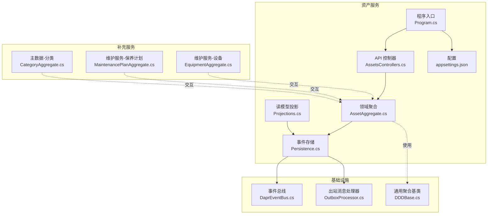
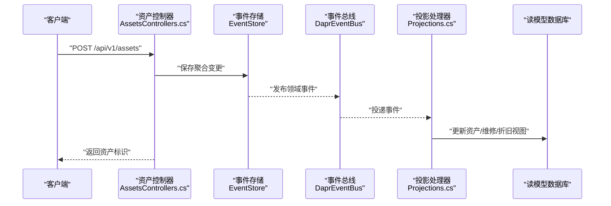
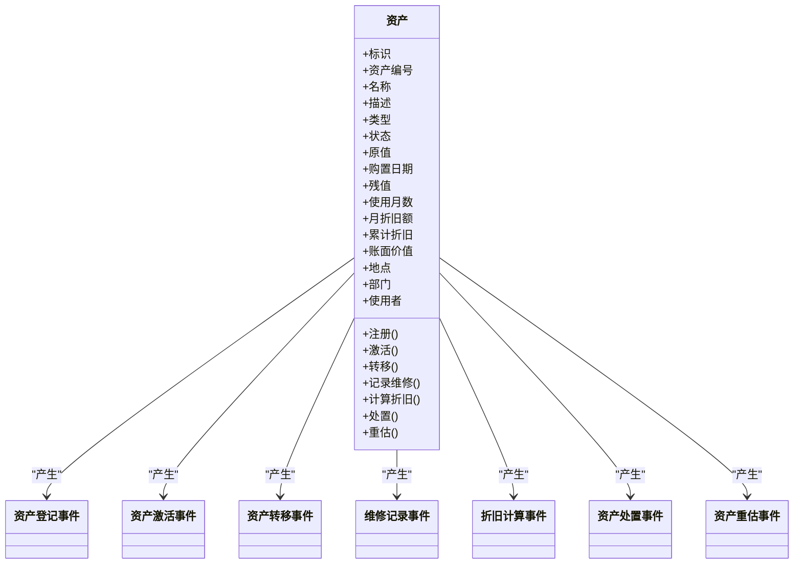
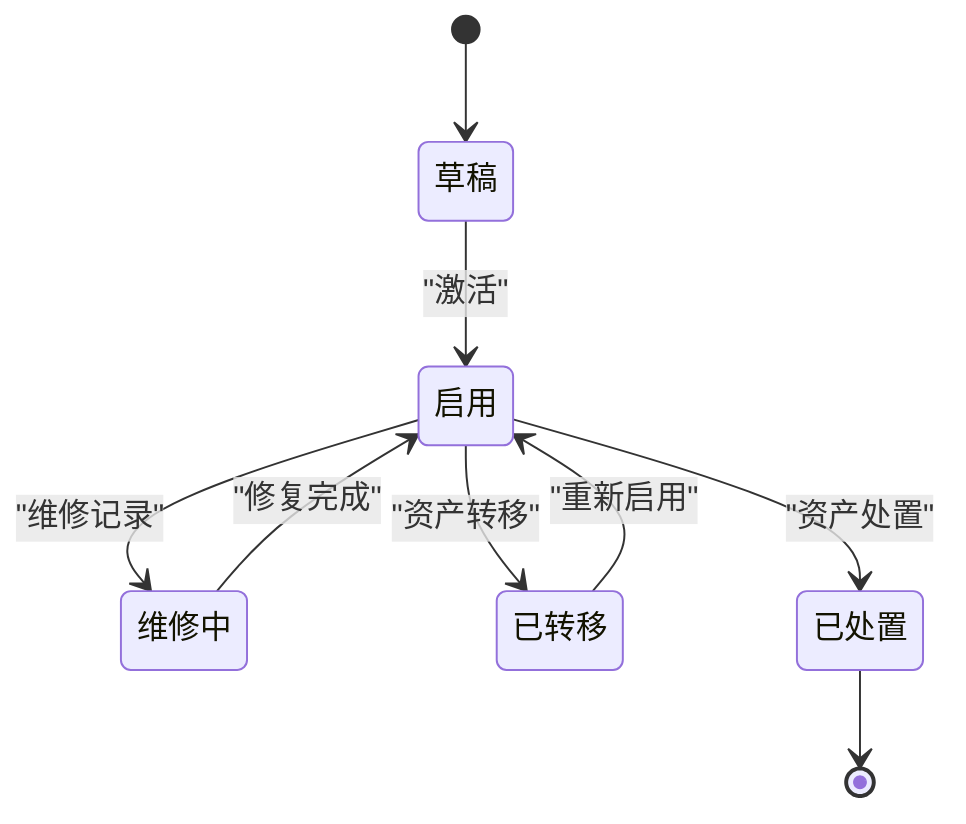
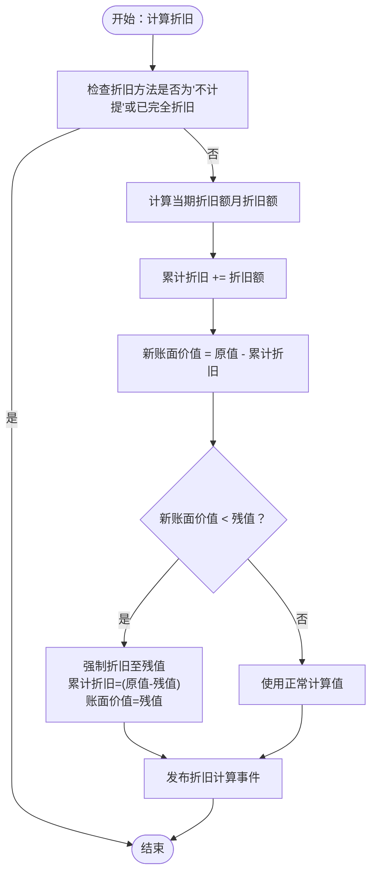
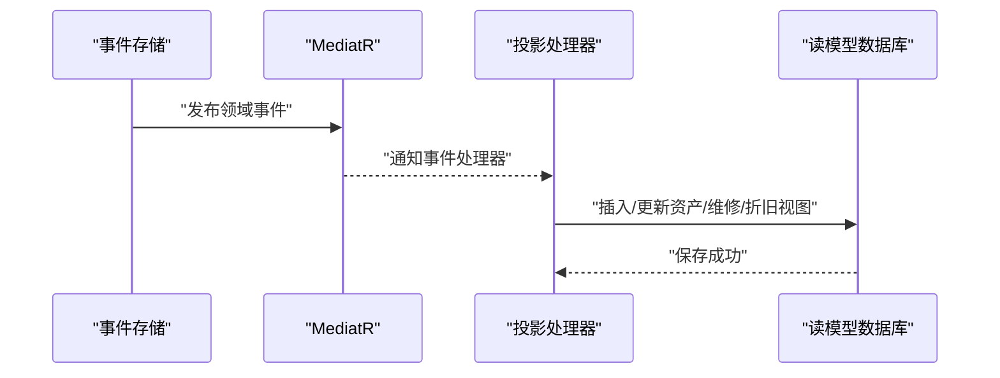
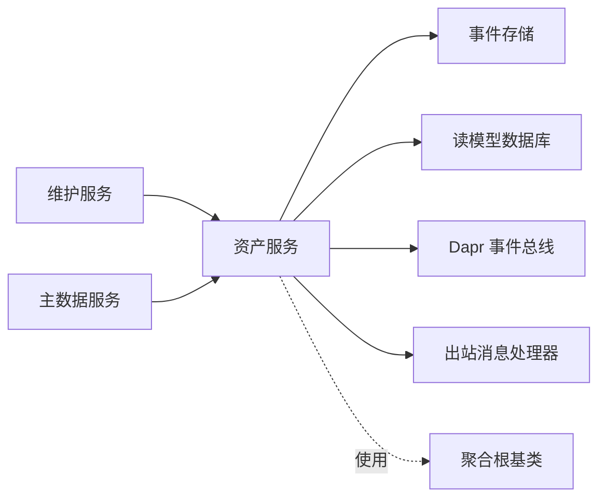

# 资产管理系统

<cite>
**本文引用的文件**
- [AssetAggregate.cs](file://src/Services/Assets/ErpSystem.Assets/Domain/AssetAggregate.cs)
- [AssetsControllers.cs](file://src/Services/Assets/ErpSystem.Assets/API/AssetsControllers.cs)
- [Persistence.cs](file://src/Services/Assets/ErpSystem.Assets/Infrastructure/Persistence.cs)
- [Projections.cs](file://src/Services/Assets/ErpSystem.Assets/Infrastructure/Projections.cs)
- [DDDBase.cs](file://src/BuildingBlocks/ErpSystem.BuildingBlocks/Domain/DDDBase.cs)
- [DaprEventBus.cs](file://src/BuildingBlocks/ErpSystem.BuildingBlocks/EventBus/DaprEventBus.cs)
- [OutboxProcessor.cs](file://src/BuildingBlocks/ErpSystem.BuildingBlocks/Outbox/OutboxProcessor.cs)
- [Program.cs](file://src/Services/Assets/ErpSystem.Assets/Program.cs)
- [appsettings.json](file://src/Services/Assets/ErpSystem.Assets/appsettings.json)
- [EquipmentAggregate.cs](file://src/Services/Maintenance/ErpSystem.Maintenance/Domain/EquipmentAggregate.cs)
- [MaintenancePlanAggregate.cs](file://src/Services/Maintenance/ErpSystem.Maintenance/Domain/MaintenancePlanAggregate.cs)
- [CategoryAggregate.cs](file://src/Services/MasterData/ErpSystem.MasterData/Domain/CategoryAggregate.cs)
</cite>

## 目录
1. [简介](#简介)
2. [项目结构](#项目结构)
3. [核心组件](#核心组件)
4. [架构总览](#架构总览)
5. [详细组件分析](#详细组件分析)
6. [依赖分析](#依赖分析)
7. [性能考虑](#性能考虑)
8. [故障排除指南](#故障排除指南)
9. [结论](#结论)
10. [附录](#附录)

## 简介
本文件为资产管理系统（Assets Service）的微服务文档，聚焦于设备资产管理、资产分类与折旧计算、资产聚合根设计、资产生命周期管理与维护计划、状态跟踪、维修记录与报废处理、事件溯源与价值计算、报表生成、API 接口设计、标签管理与盘点机制。该系统采用领域驱动设计（DDD）、事件溯源（Event Sourcing）与读写分离投影（CQRS）架构，结合 Dapr 事件总线实现跨服务解耦。

## 项目结构
资产服务位于 src/Services/Assets 下，包含领域模型、应用 API、基础设施（事件存储与读模型数据库）以及启动配置。维护服务（Maintenance）与主数据服务（MasterData）分别提供设备状态与资产分类能力，作为资产服务的补充。

**图表来源**
- [AssetsControllers.cs](file://src/Services/Assets/ErpSystem.Assets/API/AssetsControllers.cs#L1-L250)
- [AssetAggregate.cs](file://src/Services/Assets/ErpSystem.Assets/Domain/AssetAggregate.cs#L1-L357)
- [Persistence.cs](file://src/Services/Assets/ErpSystem.Assets/Infrastructure/Persistence.cs#L1-L125)
- [Projections.cs](file://src/Services/Assets/ErpSystem.Assets/Infrastructure/Projections.cs#L1-L141)
- [Program.cs](file://src/Services/Assets/ErpSystem.Assets/Program.cs#L1-L45)
- [DaprEventBus.cs](file://src/BuildingBlocks/ErpSystem.BuildingBlocks/EventBus/DaprEventBus.cs#L1-L31)
- [OutboxProcessor.cs](file://src/BuildingBlocks/ErpSystem.BuildingBlocks/Outbox/OutboxProcessor.cs#L1-L72)
- [EquipmentAggregate.cs](file://src/Services/Maintenance/ErpSystem.Maintenance/Domain/EquipmentAggregate.cs#L1-L92)
- [MaintenancePlanAggregate.cs](file://src/Services/Maintenance/ErpSystem.Maintenance/Domain/MaintenancePlanAggregate.cs#L1-L73)
- [CategoryAggregate.cs](file://src/Services/MasterData/ErpSystem.MasterData/Domain/CategoryAggregate.cs#L1-L67)

**章节来源**
- [Program.cs](file://src/Services/Assets/ErpSystem.Assets/Program.cs#L1-L45)
- [appsettings.json](file://src/Services/Assets/ErpSystem.Assets/appsettings.json#L1-L12)

## 核心组件
- 资产聚合根：定义资产类型、状态、财务与折旧参数，提供注册、激活、转移、维修、折旧计算、处置、重估等行为，并通过领域事件实现状态演进。
- 事件存储与读模型：事件持久化至 PostgreSQL 的 EventStream 表；投影处理器将事件转换为资产、维修、折旧读模型，供查询与报表使用。
- API 控制器：提供资产全生命周期的 REST 接口，包括注册、激活、转移、维修登记、折旧计算、处置、统计查询等。
- 事件总线与出站消息：通过 Dapr 事件总线发布领域事件；OutboxProcessor 异步处理出站消息，确保最终一致性。

**章节来源**
- [AssetAggregate.cs](file://src/Services/Assets/ErpSystem.Assets/Domain/AssetAggregate.cs#L179-L357)
- [Persistence.cs](file://src/Services/Assets/ErpSystem.Assets/Infrastructure/Persistence.cs#L6-L125)
- [Projections.cs](file://src/Services/Assets/ErpSystem.Assets/Infrastructure/Projections.cs#L6-L141)
- [AssetsControllers.cs](file://src/Services/Assets/ErpSystem.Assets/API/AssetsControllers.cs#L1-L250)
- [DaprEventBus.cs](file://src/BuildingBlocks/ErpSystem.BuildingBlocks/EventBus/DaprEventBus.cs#L1-L31)
- [OutboxProcessor.cs](file://src/BuildingBlocks/ErpSystem.BuildingBlocks/Outbox/OutboxProcessor.cs#L1-L72)

## 架构总览
系统采用事件溯源与 CQRS：
- 写模型：聚合根接收命令，产生领域事件，事件存储持久化事件流。
- 读模型：投影处理器监听事件，更新只读数据库中的资产、维修、折旧视图。
- 事件总线：聚合保存事件后，通过 MediatR 与 Dapr 事件总线广播事件，供其他服务订阅。

**图表来源**
- [AssetsControllers.cs](file://src/Services/Assets/ErpSystem.Assets/API/AssetsControllers.cs#L35-L56)
- [DDDBase.cs](file://src/BuildingBlocks/ErpSystem.BuildingBlocks/Domain/DDDBase.cs#L59-L120)
- [DaprEventBus.cs](file://src/BuildingBlocks/ErpSystem.BuildingBlocks/EventBus/DaprEventBus.cs#L11-L21)
- [Projections.cs](file://src/Services/Assets/ErpSystem.Assets/Infrastructure/Projections.cs#L6-L141)

## 详细组件分析

### 资产聚合根设计
资产聚合根包含：
- 标识与编号：资产编号生成规则（示例：AST-YYYYMMDD-XXXX），唯一性由读模型索引保障。
- 基本信息：名称、描述、类型（固定/设备/车辆/家具/IT/建筑物/土地/软件/其他）。
- 状态：草稿/启用/维修中/已处置/丢失/已转移。
- 财务与折旧：原值、购置日期、残值、使用月数、月折旧额、累计折旧、账面价值。
- 位置与归属：地点、部门、使用者。
- 历史记录：维修记录、折旧明细、转移历史。
- 行为方法：注册、激活、转移、记录维修、计算折旧、处置、重估。
- 领域事件：资产登记、激活、转移、维修记录、折旧计算、处置、重估。

**图表来源**
- [AssetAggregate.cs](file://src/Services/Assets/ErpSystem.Assets/Domain/AssetAggregate.cs#L179-L357)

**章节来源**
- [AssetAggregate.cs](file://src/Services/Assets/ErpSystem.Assets/Domain/AssetAggregate.cs#L52-L146)
- [AssetAggregate.cs](file://src/Services/Assets/ErpSystem.Assets/Domain/AssetAggregate.cs#L179-L357)

### 资产生命周期管理与维护计划
- 生命周期：从“草稿”到“启用”，期间可进行转移、维修、折旧；处置后进入“已处置”状态。
- 维护计划：维护服务提供设备与保养计划聚合，资产服务可通过读模型查询到期维护情况。
- 设备状态：维护服务的设备聚合跟踪设备运行/停机状态，与资产服务的维修记录形成互补。

**图表来源**
- [AssetAggregate.cs](file://src/Services/Assets/ErpSystem.Assets/Domain/AssetAggregate.cs#L22-L30)
- [EquipmentAggregate.cs](file://src/Services/Maintenance/ErpSystem.Maintenance/Domain/EquipmentAggregate.cs#L65-L70)

**章节来源**
- [AssetsControllers.cs](file://src/Services/Assets/ErpSystem.Assets/API/AssetsControllers.cs#L58-L118)
- [EquipmentAggregate.cs](file://src/Services/Maintenance/ErpSystem.Maintenance/Domain/EquipmentAggregate.cs#L8-L63)
- [MaintenancePlanAggregate.cs](file://src/Services/Maintenance/ErpSystem.Maintenance/Domain/MaintenancePlanAggregate.cs#L8-L51)

### 折旧计算与价值管理
- 折旧方法：直线法、余额递减、双倍余额递减、按产量法、不计提。
- 月折旧额：直线法下按（原值-残值）/使用月数计算。
- 折旧流程：输入年、月，计算当期折旧额，更新累计折旧与账面价值，生成折旧明细。
- 重估与处置：支持重估调整当前价值；处置时计算损益（处置收入-账面价值）。

**图表来源**
- [AssetAggregate.cs](file://src/Services/Assets/ErpSystem.Assets/Domain/AssetAggregate.cs#L198-L284)
- [Projections.cs](file://src/Services/Assets/ErpSystem.Assets/Infrastructure/Projections.cs#L93-L118)

**章节来源**
- [AssetAggregate.cs](file://src/Services/Assets/ErpSystem.Assets/Domain/AssetAggregate.cs#L32-L39)
- [AssetAggregate.cs](file://src/Services/Assets/ErpSystem.Assets/Domain/AssetAggregate.cs#L198-L284)
- [Projections.cs](file://src/Services/Assets/ErpSystem.Assets/Infrastructure/Projections.cs#L93-L118)

### 事件溯源与读模型投影
- 事件存储：事件以 JSONB 形式持久化，按聚合 ID 与版本排序，支持加载历史重建聚合状态。
- 投影处理：监听资产相关事件，更新资产、维修、折旧读模型；同时维护派生指标（如维修次数、转移次数、累计维修成本）。
- 查询接口：基于读模型提供资产列表、详情、统计、维修记录、折旧明细与汇总查询。

**图表来源**
- [DDDBase.cs](file://src/BuildingBlocks/ErpSystem.BuildingBlocks/Domain/DDDBase.cs#L59-L120)
- [Projections.cs](file://src/Services/Assets/ErpSystem.Assets/Infrastructure/Projections.cs#L6-L141)

**章节来源**
- [Persistence.cs](file://src/Services/Assets/ErpSystem.Assets/Infrastructure/Persistence.cs#L6-L125)
- [Projections.cs](file://src/Services/Assets/ErpSystem.Assets/Infrastructure/Projections.cs#L6-L141)

### API 接口设计
- 资产管理
  - GET /api/v1/assets：按类型、状态、地点过滤查询，分页返回。
  - GET /api/v1/assets/{id}：获取资产详情。
  - POST /api/v1/assets：注册资产（生成编号、创建资产）。
  - POST /api/v1/assets/{id}/activate：激活资产。
  - POST /api/v1/assets/{id}/transfer：资产转移。
  - POST /api/v1/assets/{id}/maintenance：记录维修。
  - POST /api/v1/assets/{id}/depreciate：计算折旧。
  - POST /api/v1/assets/{id}/dispose：资产处置。
  - GET /api/v1/assets/statistics：资产统计（总数、原值、账面价值、累计折旧、按类型与状态分组）。
- 维修查询
  - GET /api/v1/assets/maintenance：按资产、类型、日期区间查询维修记录，返回总计与总成本。
  - GET /api/v1/assets/maintenance/schedule：统计待维护资产与平均维修成本。
- 折旧查询
  - GET /api/v1/assets/depreciation：按资产、年、月查询折旧明细，返回总计与总折旧额。
  - GET /api/v1/assets/depreciation/summary/{year}：年度折旧汇总（按月分组）。
  - POST /api/v1/assets/depreciation/run-batch：批量折旧调度（示意）。

**章节来源**
- [AssetsControllers.cs](file://src/Services/Assets/ErpSystem.Assets/API/AssetsControllers.cs#L13-L250)

### 资产分类与标签管理
- 资产分类：主数据服务提供分类聚合，支持树形结构与层级深度控制，资产在注册时绑定分类。
- 标签管理：当前资产服务未见显式标签字段；可在读模型中扩展标签字段并建立索引以支持查询与筛选。

**章节来源**
- [CategoryAggregate.cs](file://src/Services/MasterData/ErpSystem.MasterData/Domain/CategoryAggregate.cs#L27-L67)

### 盘点机制
- 盘点建议：结合资产转移与维修记录，定期比对读模型与实际资产分布；可引入盘点任务触发器与差异报警。
- 当前实现：未发现专门的盘点聚合或接口，建议在资产服务中扩展盘点相关命令与事件。

## 依赖分析
- 资产服务依赖
  - 事件存储：EF Core + PostgreSQL（EventStream 表）。
  - 读模型数据库：EF Core + PostgreSQL（资产、维修、折旧表）。
  - 事件总线：Dapr Pub/Sub（Topic 名称与事件类型一致）。
  - 出站消息：OutboxProcessor 异步发布事件，避免事务内阻塞。
  - 通用基类：聚合根基类与事件存储实现。
- 服务间依赖
  - 维护服务：设备状态与保养计划，与资产维修记录互补。
  - 主数据服务：资产分类，资产注册时绑定分类。

**图表来源**
- [Program.cs](file://src/Services/Assets/ErpSystem.Assets/Program.cs#L9-L27)
- [DaprEventBus.cs](file://src/BuildingBlocks/ErpSystem.BuildingBlocks/EventBus/DaprEventBus.cs#L11-L21)
- [OutboxProcessor.cs](file://src/BuildingBlocks/ErpSystem.BuildingBlocks/Outbox/OutboxProcessor.cs#L8-L72)
- [DDDBase.cs](file://src/BuildingBlocks/ErpSystem.BuildingBlocks/Domain/DDDBase.cs#L14-L41)

**章节来源**
- [Program.cs](file://src/Services/Assets/ErpSystem.Assets/Program.cs#L1-L45)
- [DaprEventBus.cs](file://src/BuildingBlocks/ErpSystem.BuildingBlocks/EventBus/DaprEventBus.cs#L1-L31)
- [OutboxProcessor.cs](file://src/BuildingBlocks/ErpSystem.BuildingBlocks/Outbox/OutboxProcessor.cs#L1-L72)
- [DDDBase.cs](file://src/BuildingBlocks/ErpSystem.BuildingBlocks/Domain/DDDBase.cs#L53-L120)

## 性能考虑
- 事件存储
  - EventStream 表使用 jsonb 存储事件载荷，版本号与聚合键组合索引支持高效加载。
- 读模型
  - 资产表建立资产编号唯一索引与类型/状态/地点索引；维修与折旧表建立资产与时间复合索引，满足高频查询。
- 查询优化
  - API 使用异步 LINQ 查询与分页；统计接口聚合计算在数据库侧完成。
- 并发与一致性
  - 事件发布与数据库保存在同一事务中，结合 Outbox 异步发布，降低延迟与失败风险。

**章节来源**
- [Persistence.cs](file://src/Services/Assets/ErpSystem.Assets/Infrastructure/Persistence.cs#L12-L57)
- [AssetsControllers.cs](file://src/Services/Assets/ErpSystem.Assets/API/AssetsControllers.cs#L13-L26)

## 故障排除指南
- 事件加载失败
  - 现象：加载聚合时历史事件解析异常。
  - 排查：确认事件类型解析函数正确映射到具体事件类型；检查事件载荷格式。
- 事件未被投影
  - 现象：读模型未更新。
  - 排查：确认 MediatR 已注册并能发现事件处理器；检查 Outbox 是否启用与运行。
- 事件总线未收到事件
  - 现象：其他服务未接收到资产事件。
  - 排查：确认 Dapr Pub/Sub 配置与 Topic 名称一致；检查网络与命名空间。
- 数据库连接问题
  - 现象：事件存储或读模型数据库连接失败。
  - 排查：检查连接字符串与数据库可达性；确认凭据正确。

**章节来源**
- [DDDBase.cs](file://src/BuildingBlocks/ErpSystem.BuildingBlocks/Domain/DDDBase.cs#L59-L120)
- [OutboxProcessor.cs](file://src/BuildingBlocks/ErpSystem.BuildingBlocks/Outbox/OutboxProcessor.cs#L29-L72)
- [DaprEventBus.cs](file://src/BuildingBlocks/ErpSystem.BuildingBlocks/EventBus/DaprEventBus.cs#L11-L21)
- [appsettings.json](file://src/Services/Assets/ErpSystem.Assets/appsettings.json#L9-L12)

## 结论
资产管理系统通过事件溯源与 CQRS 实现了资产全生命周期的可追溯与高内聚写模型，配合读模型投影提供高效的查询与报表能力。结合维护服务与主数据服务，系统覆盖了设备状态、保养计划与资产分类等关键场景。建议后续增强标签管理、盘点机制与批量折旧执行能力，进一步完善资产运营闭环。

## 附录
- 启动与配置
  - 程序入口注册事件存储、MediatR、Dapr 事件总线与 Swagger；读写数据库均指向同一连接串。
- 数据模型概览
  - 资产读模型包含资产编号、类型、状态、财务与折旧字段、位置与派生指标。
  - 维修读模型包含资产标识、类型、日期、成本与执行人。
  - 折旧读模型包含年、月、金额、累计折旧与账面价值。

**章节来源**
- [Program.cs](file://src/Services/Assets/ErpSystem.Assets/Program.cs#L7-L45)
- [Persistence.cs](file://src/Services/Assets/ErpSystem.Assets/Infrastructure/Persistence.cs#L63-L125)