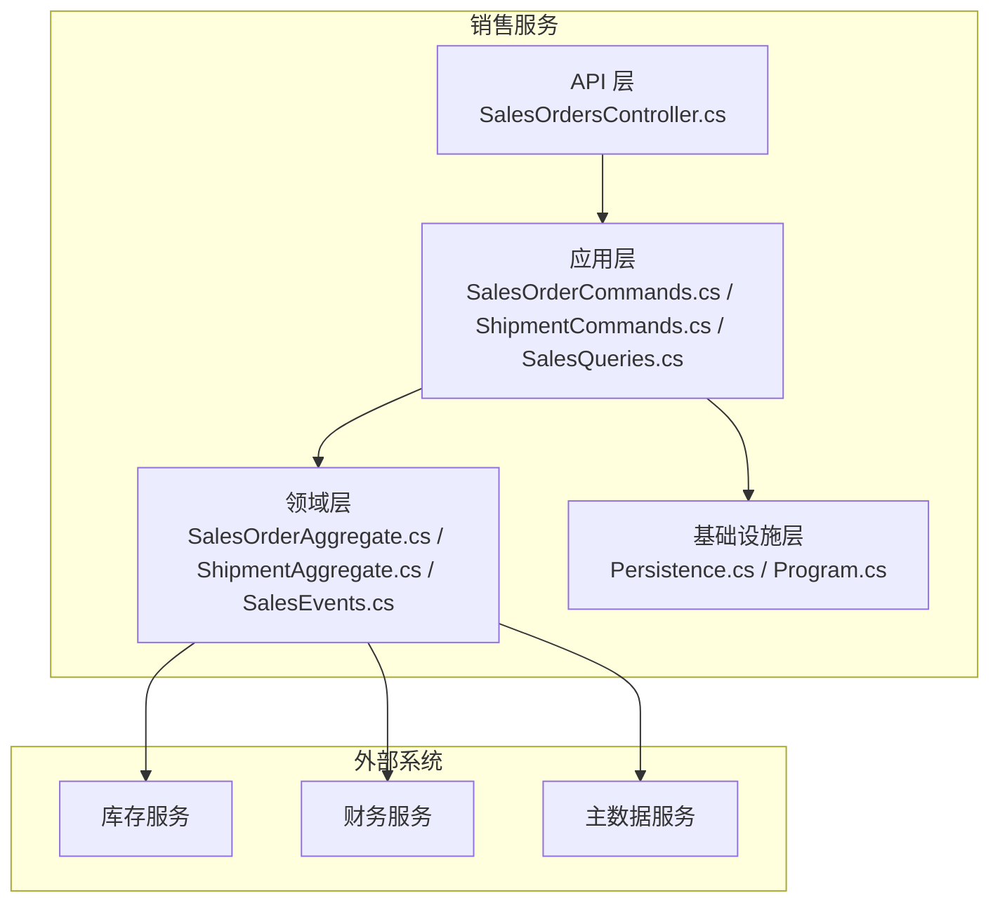
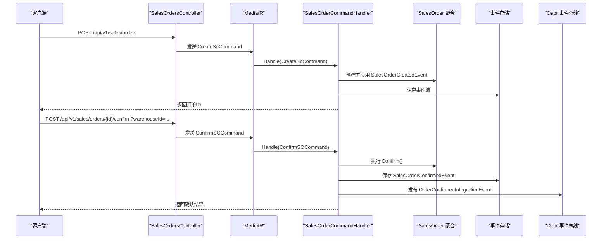
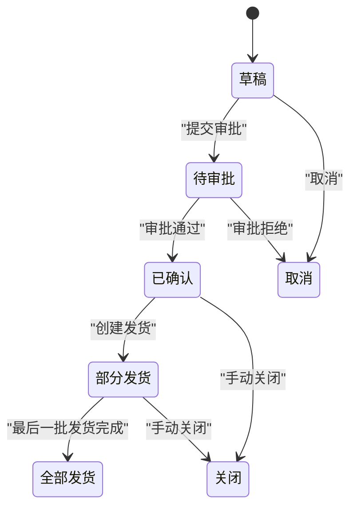
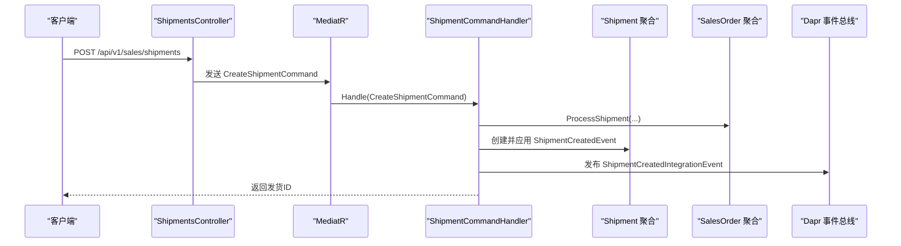
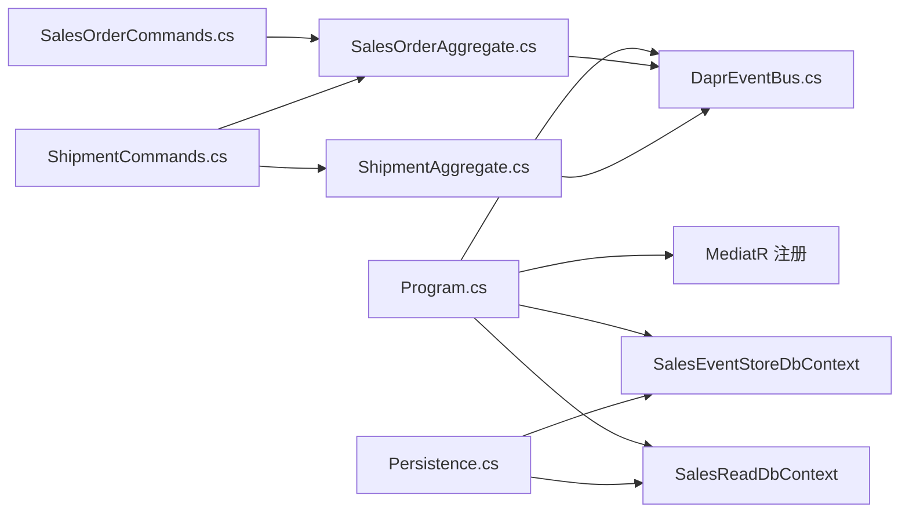

# 销售管理服务

<cite>
**本文档引用的文件**
- [Program.cs](file://src/Services/Sales/ErpSystem.Sales/Program.cs)
- [SalesOrdersController.cs](file://src/Services/Sales/ErpSystem.Sales/API/SalesOrdersController.cs)
- [ShipmentCommands.cs](file://src/Services/Sales/ErpSystem.Sales/Application/ShipmentCommands.cs)
- [SalesOrderCommands.cs](file://src/Services/Sales/ErpSystem.Sales/Application/SalesOrderCommands.cs)
- [SalesQueries.cs](file://src/Services/Sales/ErpSystem.Sales/Application/SalesQueries.cs)
- [SalesOrderAggregate.cs](file://src/Services/Sales/ErpSystem.Sales/Domain/SalesOrderAggregate.cs)
- [ShipmentAggregate.cs](file://src/Services/Sales/ErpSystem.Sales/Domain/ShipmentAggregate.cs)
- [SalesEvents.cs](file://src/Services/Sales/ErpSystem.Sales/Domain/SalesEvents.cs)
- [Persistence.cs](file://src/Services/Sales/ErpSystem.Sales/Infrastructure/Persistence.cs)
- [DaprEventBus.cs](file://src/BuildingBlocks/ErpSystem.BuildingBlocks/EventBus/DaprEventBus.cs)
- [OutboxProcessor.cs](file://src/BuildingBlocks/ErpSystem.BuildingBlocks/Outbox/OutboxProcessor.cs)
- [SalesToInventoryTests.cs](file://src/Tests/ErpSystem.IntegrationTests/SalesToInventoryTests.cs)
- [CustomerAggregate.cs](file://src/Services/MasterData/ErpSystem.MasterData/Domain/CustomerAggregate.cs)
- [InvoiceAggregate.cs](file://src/Services/Finance/ErpSystem.Finance/Domain/InvoiceAggregate.cs)
- [values.yaml](file://deploy/helm/erp-system/values.yaml)
</cite>

## 目录
1. [简介](#简介)
2. [项目结构](#项目结构)
3. [核心组件](#核心组件)
4. [架构总览](#架构总览)
5. [详细组件分析](#详细组件分析)
6. [依赖关系分析](#依赖关系分析)
7. [性能考虑](#性能考虑)
8. [故障排除指南](#故障排除指南)
9. [结论](#结论)
10. [附录](#附录)

## 简介
本文件为销售管理服务（Sales Service）的微服务文档，聚焦销售订单、发货处理、客户开票与应收账款管理的完整业务闭环。系统采用领域驱动设计（DDD），以销售聚合根为核心，结合事件驱动架构与事件溯源，实现销售流程的状态演进、价格与折扣计算、发货跟踪以及与库存、财务等子系统的集成。

销售管理服务通过命令查询职责分离（CQRS）模式，使用 MediatR 实现命令与查询处理；事件总线用于跨服务解耦；EF Core 提供事件存储与只读投影；Dapr 作为事件总线与状态存储的运行时支撑。

## 项目结构
销售服务位于 src/Services/Sales/ErpSystem.Sales，包含以下关键层次：
- API 层：控制器暴露 REST 接口，负责请求路由与响应封装
- 应用层：命令与查询处理器，协调聚合与事件发布
- 领域层：销售订单、发货聚合与领域事件定义
- 基础设施层：事件存储 DbContext、只读投影 DbContext、仓储与事件总线适配

图表来源
- [Program.cs](file://src/Services/Sales/ErpSystem.Sales/Program.cs#L1-L77)
- [SalesOrdersController.cs](file://src/Services/Sales/ErpSystem.Sales/API/SalesOrdersController.cs#L1-L45)
- [SalesOrderCommands.cs](file://src/Services/Sales/ErpSystem.Sales/Application/SalesOrderCommands.cs#L1-L67)
- [ShipmentCommands.cs](file://src/Services/Sales/ErpSystem.Sales/Application/ShipmentCommands.cs#L1-L61)
- [SalesOrderAggregate.cs](file://src/Services/Sales/ErpSystem.Sales/Domain/SalesOrderAggregate.cs#L1-L151)
- [ShipmentAggregate.cs](file://src/Services/Sales/ErpSystem.Sales/Domain/ShipmentAggregate.cs#L1-L61)
- [Persistence.cs](file://src/Services/Sales/ErpSystem.Sales/Infrastructure/Persistence.cs#L1-L56)

章节来源
- [Program.cs](file://src/Services/Sales/ErpSystem.Sales/Program.cs#L1-L77)
- [SalesOrdersController.cs](file://src/Services/Sales/ErpSystem.Sales/API/SalesOrdersController.cs#L1-L45)

## 核心组件
- 销售订单聚合根：维护订单状态机、行项目、金额计算与发货进度更新
- 发货聚合根：记录发货单信息并触发库存扣减事件
- 事件总线：基于 Dapr 的发布订阅，支持集成事件在服务间传递
- 事件存储与只读投影：EF Core DbContext 分别承载事件流与查询模型
- 应用命令/查询处理器：编排业务逻辑、发布领域事件与集成事件

章节来源
- [SalesOrderAggregate.cs](file://src/Services/Sales/ErpSystem.Sales/Domain/SalesOrderAggregate.cs#L67-L151)
- [ShipmentAggregate.cs](file://src/Services/Sales/ErpSystem.Sales/Domain/ShipmentAggregate.cs#L21-L61)
- [SalesEvents.cs](file://src/Services/Sales/ErpSystem.Sales/Domain/SalesEvents.cs#L5-L32)
- [Persistence.cs](file://src/Services/Sales/ErpSystem.Sales/Infrastructure/Persistence.cs#L6-L56)
- [DaprEventBus.cs](file://src/BuildingBlocks/ErpSystem.BuildingBlocks/EventBus/DaprEventBus.cs#L6-L31)

## 架构总览
销售服务采用事件驱动与事件溯源架构：
- 领域事件记录在事件存储中，用于重建聚合状态
- 只读投影用于查询端高效检索
- 集成事件通过事件总线发布到其他服务（如库存、财务）

图表来源
- [SalesOrdersController.cs](file://src/Services/Sales/ErpSystem.Sales/API/SalesOrdersController.cs#L11-L30)
- [SalesOrderCommands.cs](file://src/Services/Sales/ErpSystem.Sales/Application/SalesOrderCommands.cs#L20-L55)
- [SalesOrderAggregate.cs](file://src/Services/Sales/ErpSystem.Sales/Domain/SalesOrderAggregate.cs#L91-L103)
- [DaprEventBus.cs](file://src/BuildingBlocks/ErpSystem.BuildingBlocks/EventBus/DaprEventBus.cs#L11-L21)

## 详细组件分析

### 销售订单聚合与状态管理
- 状态枚举覆盖草稿、待审批、已确认、部分发货、全部发货、关闭、取消
- 行项目包含数量、单价与折扣率，单行金额按公式计算
- 聚合通过应用领域事件推进状态，并在发货处理后更新行项目的已发数量

图表来源
- [SalesOrderAggregate.cs](file://src/Services/Sales/ErpSystem.Sales/Domain/SalesOrderAggregate.cs#L5-L14)
- [SalesOrderAggregate.cs](file://src/Services/Sales/ErpSystem.Sales/Domain/SalesOrderAggregate.cs#L113-L149)

章节来源
- [SalesOrderAggregate.cs](file://src/Services/Sales/ErpSystem.Sales/Domain/SalesOrderAggregate.cs#L67-L151)

### 发货处理与库存联动
- 发货命令处理器加载销售订单，创建发货聚合，并更新订单发货进度
- 发布库存出库集成事件，携带物料、仓库与数量信息
- 集成测试验证确认订单后库存预留生效

图表来源
- [SalesOrdersController.cs](file://src/Services/Sales/ErpSystem.Sales/API/SalesOrdersController.cs#L42-L44)
- [ShipmentCommands.cs](file://src/Services/Sales/ErpSystem.Sales/Application/ShipmentCommands.cs#L16-L60)
- [ShipmentAggregate.cs](file://src/Services/Sales/ErpSystem.Sales/Domain/ShipmentAggregate.cs#L21-L61)
- [SalesEvents.cs](file://src/Services/Sales/ErpSystem.Sales/Domain/SalesEvents.cs#L19-L31)

章节来源
- [ShipmentCommands.cs](file://src/Services/Sales/ErpSystem.Sales/Application/ShipmentCommands.cs#L22-L60)
- [SalesToInventoryTests.cs](file://src/Tests/ErpSystem.IntegrationTests/SalesToInventoryTests.cs#L14-L87)

### 客户关系管理与信用额度
- 主数据服务中的客户聚合包含信用额度、账期与默认地址等信息
- 销售侧可基于客户信用信息进行业务决策（如是否允许超额下单）
- 该能力为销售流程前置条件，确保后续开票与回款管理的合规性

章节来源
- [CustomerAggregate.cs](file://src/Services/MasterData/ErpSystem.MasterData/Domain/CustomerAggregate.cs#L46-L96)

### 应收账款与发票生命周期
- 财务服务的发票聚合定义了应收类型、状态（草稿、已开票、部分收款、全部收款、核销、取消）与付款方式
- 发票金额、已收金额与未收金额自动计算，状态随收款记录动态变化
- 销售发货完成后，可据发货明细生成发票并进入收款流程

章节来源
- [InvoiceAggregate.cs](file://src/Services/Finance/ErpSystem.Finance/Domain/InvoiceAggregate.cs#L67-L176)

### 事件驱动与集成
- 销售确认与发货分别发布集成事件，供库存预留与库存扣减使用
- 事件总线基于 Dapr，Topic 名称约定为事件类型名
- Outbox 模式用于保证消息可靠投递，后台处理器批量处理未处理消息

章节来源
- [SalesEvents.cs](file://src/Services/Sales/ErpSystem.Sales/Domain/SalesEvents.cs#L5-L32)
- [DaprEventBus.cs](file://src/BuildingBlocks/ErpSystem.BuildingBlocks/EventBus/DaprEventBus.cs#L11-L21)
- [OutboxProcessor.cs](file://src/BuildingBlocks/ErpSystem.BuildingBlocks/Outbox/OutboxProcessor.cs#L8-L72)

### API 设计与业务规则
- 销售订单 API：创建、按 ID 查询、按客户与状态搜索、确认、取消、查询可开票行
- 发货 API：创建发货单
- 业务规则：
  - 订单仅草稿或待审批状态可确认
  - 已发货或关闭的订单不可取消
  - 发货后根据已发数量更新订单状态（部分/全部发货）

章节来源
- [SalesOrdersController.cs](file://src/Services/Sales/ErpSystem.Sales/API/SalesOrdersController.cs#L11-L36)
- [SalesOrderCommands.cs](file://src/Services/Sales/ErpSystem.Sales/Application/SalesOrderCommands.cs#L34-L65)
- [SalesQueries.cs](file://src/Services/Sales/ErpSystem.Sales/Application/SalesQueries.cs#L8-L76)

## 依赖关系分析
- 运行时依赖：EF Core（事件存储与只读投影）、Dapr 事件总线、MediatR
- 组件耦合：应用层通过仓储与事件总线与领域层交互，避免直接依赖外部系统
- 外部集成：通过集成事件与 Dapr Pub/Sub 解耦库存与财务服务

图表来源
- [Program.cs](file://src/Services/Sales/ErpSystem.Sales/Program.cs#L18-L49)
- [DaprEventBus.cs](file://src/BuildingBlocks/ErpSystem.BuildingBlocks/EventBus/DaprEventBus.cs#L11-L21)
- [SalesOrderCommands.cs](file://src/Services/Sales/ErpSystem.Sales/Application/SalesOrderCommands.cs#L20-L67)
- [ShipmentCommands.cs](file://src/Services/Sales/ErpSystem.Sales/Application/ShipmentCommands.cs#L16-L61)
- [Persistence.cs](file://src/Services/Sales/ErpSystem.Sales/Infrastructure/Persistence.cs#L6-L56)

章节来源
- [Program.cs](file://src/Services/Sales/ErpSystem.Sales/Program.cs#L18-L49)
- [Persistence.cs](file://src/Services/Sales/ErpSystem.Sales/Infrastructure/Persistence.cs#L6-L56)

## 性能考虑
- 事件存储：使用 PostgreSQL + jsonb 存储事件负载，适合高写入场景
- 只读投影：EF Core AsNoTracking 查询优化读取性能
- 并发控制：事件版本号保证聚合重放一致性
- 异步事件：通过事件总线异步通知下游，降低请求延迟
- 批量处理：Outbox 后台处理器以批处理方式投递消息，减少频繁 IO

## 故障排除指南
- 订单不存在：确认订单 ID 正确且事件流已持久化
- 确认失败：检查订单状态是否为草稿或待审批
- 取消失败：若订单已发货或关闭则无法取消
- 发货失败：核对销售订单是否存在、行号是否匹配
- 集成事件未到达：检查 Dapr Pub/Sub 组件配置与订阅
- Outbox 消息堆积：查看 OutboxProcessor 日志，确认数据库连接与权限

章节来源
- [SalesOrderCommands.cs](file://src/Services/Sales/ErpSystem.Sales/Application/SalesOrderCommands.cs#L37-L65)
- [ShipmentCommands.cs](file://src/Services/Sales/ErpSystem.Sales/Application/ShipmentCommands.cs#L24-L26)
- [DaprEventBus.cs](file://src/BuildingBlocks/ErpSystem.BuildingBlocks/EventBus/DaprEventBus.cs#L15-L21)
- [OutboxProcessor.cs](file://src/BuildingBlocks/ErpSystem.BuildingBlocks/Outbox/OutboxProcessor.cs#L29-L72)

## 结论
销售管理服务通过清晰的领域建模与事件驱动架构，实现了从销售订单到发货、再到库存与财务的端到端闭环。事件溯源保障了业务历史可追溯，CQRS 提升了读写性能与扩展性。建议在生产环境中完善监控与告警、强化幂等性与一致性保障，并持续优化价格策略与折扣计算的业务规则引擎。

## 附录
- 部署参数参考：Helm values 中包含服务副本数、镜像仓库与 Dapr 组件配置

章节来源
- [values.yaml](file://deploy/helm/erp-system/values.yaml#L39-L46)
- [values.yaml](file://deploy/helm/erp-system/values.yaml#L117-L123)