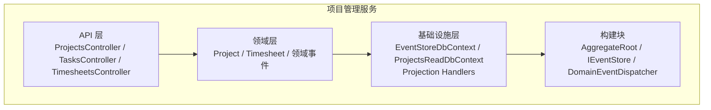
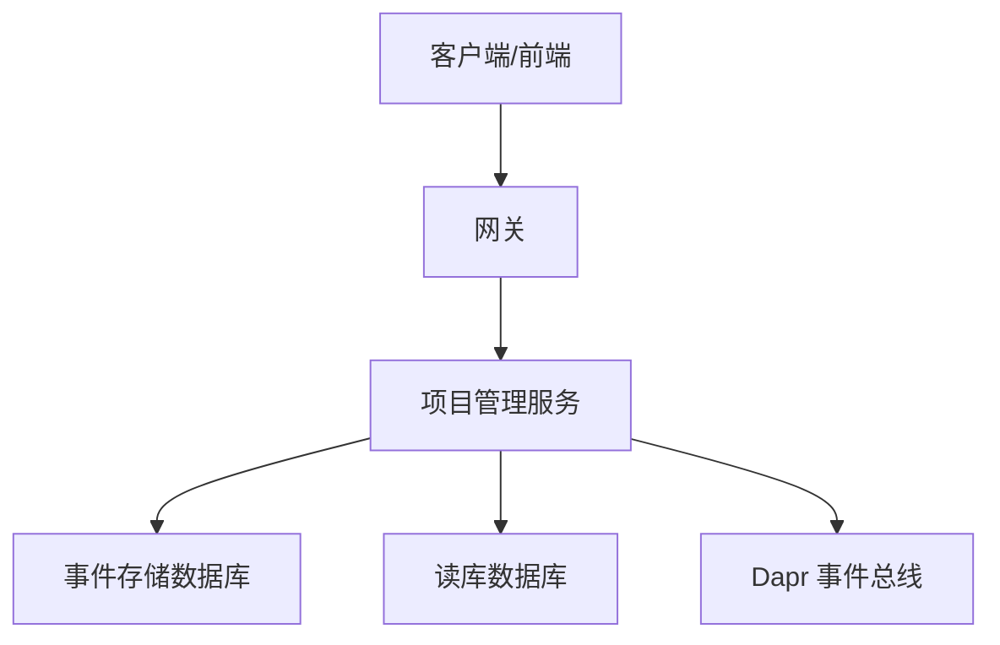
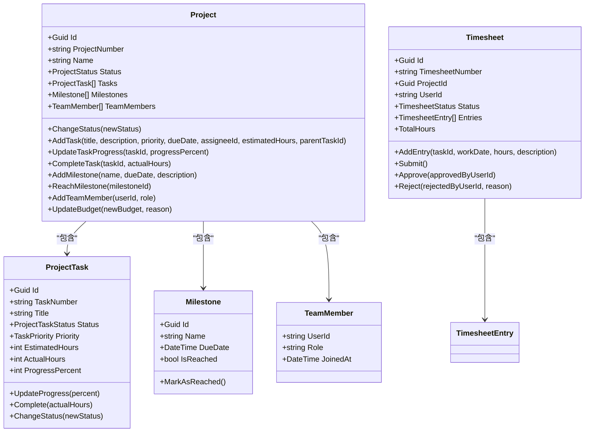
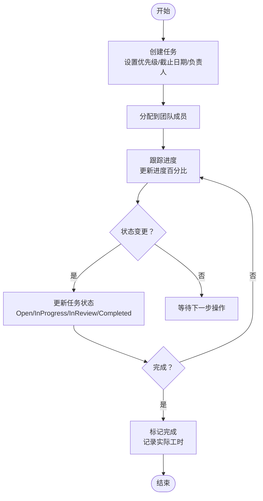
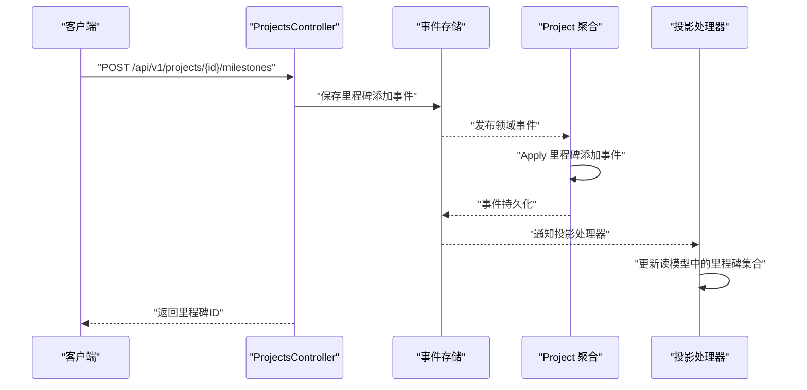
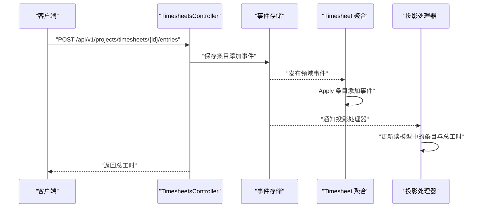
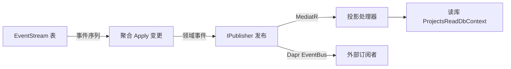
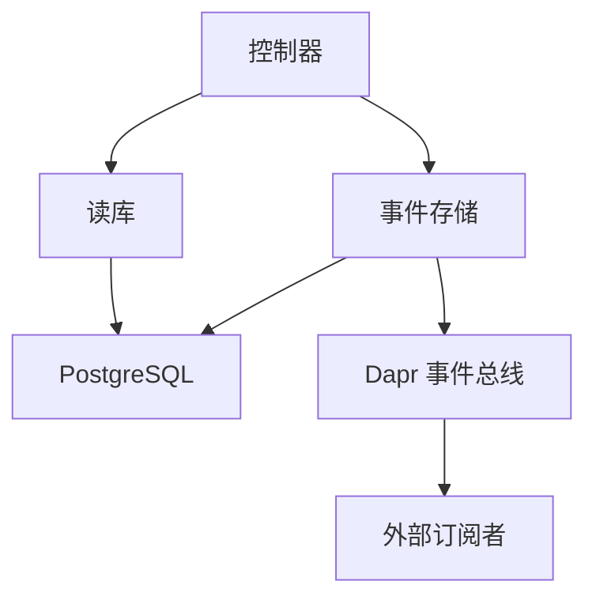

# 项目管理服务

<cite>
**本文档引用的文件**
- [Program.cs](file://src/Services/Projects/ErpSystem.Projects/Program.cs)
- [ProjectsController.cs](file://src/Services/Projects/ErpSystem.Projects/API/ProjectsController.cs)
- [TasksController.cs](file://src/Services/Projects/ErpSystem.Projects/API/TasksController.cs)
- [TimesheetsController.cs](file://src/Services/Projects/ErpSystem.Projects/API/TimesheetsController.cs)
- [ProjectAggregate.cs](file://src/Services/Projects/ErpSystem.Projects/Domain/ProjectAggregate.cs)
- [TimesheetAggregate.cs](file://src/Services/Projects/ErpSystem.Projects/Domain/TimesheetAggregate.cs)
- [Persistence.cs](file://src/Services/Projects/ErpSystem.Projects/Infrastructure/Persistence.cs)
- [Projections.cs](file://src/Services/Projects/ErpSystem.Projects/Infrastructure/Projections.cs)
- [DDDBase.cs](file://src/BuildingBlocks/ErpSystem.BuildingBlocks/Domain/DDDBase.cs)
- [DomainEventDispatcher.cs](file://src/BuildingBlocks/ErpSystem.BuildingBlocks/Domain/DomainEventDispatcher.cs)
- [values.yaml](file://deploy/helm/erp-system/values.yaml)
- [deployment.md](file://docs/deployment.md)
</cite>

## 目录
1. [简介](#简介)
2. [项目结构](#项目结构)
3. [核心组件](#核心组件)
4. [架构总览](#架构总览)
5. [详细组件分析](#详细组件分析)
6. [依赖关系分析](#依赖关系分析)
7. [性能考虑](#性能考虑)
8. [故障排除指南](#故障排除指南)
9. [结论](#结论)
10. [附录](#附录)

## 简介
本文件为项目管理服务（ErpSystem.Projects）的详细微服务文档，聚焦于项目规划、任务管理与工时跟踪三大核心能力，系统性阐述事件驱动的聚合根设计、任务调度与资源分配策略、项目进度与里程碑管理、成本控制机制、事件溯源与读模型投影、甘特图生成与资源优化思路，以及API接口设计、工作流引擎与通知机制的集成方案。该服务采用领域驱动设计（DDD）、事件溯源与CQRS模式，结合MediatR、EF Core与Dapr事件总线，提供高内聚、低耦合且可扩展的微服务架构。

## 项目结构
项目管理服务位于 src/Services/Projects/ErpSystem.Projects，包含以下关键层次：
- API 层：提供 RESTful 控制器，暴露项目、任务、工时相关的 CRUD 与状态变更接口
- 领域层：定义聚合根（Project、Timesheet）与实体、值对象、领域事件
- 基础设施层：事件存储 DbContext、读库 DbContext、投影处理器、事件存储实现
- 构建块：通用的事件存储、聚合基类、领域事件分发器等

**图表来源**
- [Program.cs](file://src/Services/Projects/ErpSystem.Projects/Program.cs#L1-L49)
- [ProjectsController.cs](file://src/Services/Projects/ErpSystem.Projects/API/ProjectsController.cs#L1-L163)
- [TasksController.cs](file://src/Services/Projects/ErpSystem.Projects/API/TasksController.cs#L1-L102)
- [TimesheetsController.cs](file://src/Services/Projects/ErpSystem.Projects/API/TimesheetsController.cs#L1-L141)
- [ProjectAggregate.cs](file://src/Services/Projects/ErpSystem.Projects/Domain/ProjectAggregate.cs#L1-L451)
- [TimesheetAggregate.cs](file://src/Services/Projects/ErpSystem.Projects/Domain/TimesheetAggregate.cs#L1-L218)
- [Persistence.cs](file://src/Services/Projects/ErpSystem.Projects/Infrastructure/Persistence.cs#L1-L127)
- [Projections.cs](file://src/Services/Projects/ErpSystem.Projects/Infrastructure/Projections.cs#L1-L220)
- [DDDBase.cs](file://src/BuildingBlocks/ErpSystem.BuildingBlocks/Domain/DDDBase.cs#L1-L137)
- [DomainEventDispatcher.cs](file://src/BuildingBlocks/ErpSystem.BuildingBlocks/Domain/DomainEventDispatcher.cs#L1-L72)

**章节来源**
- [Program.cs](file://src/Services/Projects/ErpSystem.Projects/Program.cs#L1-L49)
- [ProjectsController.cs](file://src/Services/Projects/ErpSystem.Projects/API/ProjectsController.cs#L1-L163)
- [TasksController.cs](file://src/Services/Projects/ErpSystem.Projects/API/TasksController.cs#L1-L102)
- [TimesheetsController.cs](file://src/Services/Projects/ErpSystem.Projects/API/TimesheetsController.cs#L1-L141)
- [Persistence.cs](file://src/Services/Projects/ErpSystem.Projects/Infrastructure/Persistence.cs#L1-L127)
- [Projections.cs](file://src/Services/Projects/ErpSystem.Projects/Infrastructure/Projections.cs#L1-L220)
- [DDDBase.cs](file://src/BuildingBlocks/ErpSystem.BuildingBlocks/Domain/DDDBase.cs#L1-L137)
- [DomainEventDispatcher.cs](file://src/BuildingBlocks/ErpSystem.BuildingBlocks/Domain/DomainEventDispatcher.cs#L1-L72)

## 核心组件
- 事件存储与聚合根
  - 通过 EventStore 将领域事件持久化并发布，支持加载聚合历史快照
  - 聚合根负责应用领域事件并维护内部状态，确保一致性
- 读模型与投影
  - 使用 ProjectsReadDbContext 维护查询侧数据，投影处理器监听领域事件并更新读模型
  - 读模型字段覆盖项目、任务、工时的关键指标，便于统计与展示
- 控制器与API
  - 提供项目生命周期管理、任务进度更新、里程碑添加、团队成员管理
  - 提供工时表创建、条目录入、提交审批、汇总统计等接口
- 事件溯源与CQRS
  - 写模型（聚合）与读模型（投影）分离，事件作为唯一真相源
  - 支持跨服务事件发布与订阅，便于工作流编排与通知

**章节来源**
- [DDDBase.cs](file://src/BuildingBlocks/ErpSystem.BuildingBlocks/Domain/DDDBase.cs#L53-L120)
- [ProjectAggregate.cs](file://src/Services/Projects/ErpSystem.Projects/Domain/ProjectAggregate.cs#L280-L451)
- [TimesheetAggregate.cs](file://src/Services/Projects/ErpSystem.Projects/Domain/TimesheetAggregate.cs#L105-L218)
- [Persistence.cs](file://src/Services/Projects/ErpSystem.Projects/Infrastructure/Persistence.cs#L6-L127)
- [Projections.cs](file://src/Services/Projects/ErpSystem.Projects/Infrastructure/Projections.cs#L1-L220)
- [ProjectsController.cs](file://src/Services/Projects/ErpSystem.Projects/API/ProjectsController.cs#L1-L163)
- [TasksController.cs](file://src/Services/Projects/ErpSystem.Projects/API/TasksController.cs#L1-L102)
- [TimesheetsController.cs](file://src/Services/Projects/ErpSystem.Projects/API/TimesheetsController.cs#L1-L141)

## 架构总览
项目管理服务采用事件驱动架构，写模型与读模型解耦，通过事件总线实现跨服务通信。

**图表来源**
- [Program.cs](file://src/Services/Projects/ErpSystem.Projects/Program.cs#L15-L30)
- [Persistence.cs](file://src/Services/Projects/ErpSystem.Projects/Infrastructure/Persistence.cs#L8-L61)
- [Projections.cs](file://src/Services/Projects/ErpSystem.Projects/Infrastructure/Projections.cs#L1-L220)

**章节来源**
- [Program.cs](file://src/Services/Projects/ErpSystem.Projects/Program.cs#L1-L49)
- [values.yaml](file://deploy/helm/erp-system/values.yaml#L117-L122)

## 详细组件分析

### 项目聚合根设计
- 聚合边界与职责
  - Project 聚合负责项目全生命周期：创建、状态变更、任务管理、里程碑管理、预算更新、团队成员管理
  - Timesheet 聚合负责工时表的创建、条目录入、提交、审批与拒绝
- 领域事件与状态机
  - 通过领域事件驱动状态变更，如项目状态变更、任务进度推进、里程碑达成、工时表提交/审批
  - 事件作为唯一真相源，确保跨服务一致性
- 值对象与约束
  - DateRange、Budget 等值对象封装业务规则；聚合内方法对输入进行校验，保证不变式

**图表来源**
- [ProjectAggregate.cs](file://src/Services/Projects/ErpSystem.Projects/Domain/ProjectAggregate.cs#L173-L451)
- [TimesheetAggregate.cs](file://src/Services/Projects/ErpSystem.Projects/Domain/TimesheetAggregate.cs#L77-L218)

**章节来源**
- [ProjectAggregate.cs](file://src/Services/Projects/ErpSystem.Projects/Domain/ProjectAggregate.cs#L1-L451)
- [TimesheetAggregate.cs](file://src/Services/Projects/ErpSystem.Projects/Domain/TimesheetAggregate.cs#L1-L218)

### 任务调度与资源分配
- 任务调度
  - 通过任务优先级与截止日期进行排序与分配，支持父子任务与依赖关系（DependsOnTaskIds）
  - 进度百分比与状态联动：0%->Open，>0且非完成->InProgress，100%进入InReview
- 资源分配
  - 团队成员角色与加入时间记录在读模型中，便于资源可视化与容量评估
  - 工时表按周汇总，支持按用户与项目维度的成本归集

**图表来源**
- [ProjectAggregate.cs](file://src/Services/Projects/ErpSystem.Projects/Domain/ProjectAggregate.cs#L175-L246)

**章节来源**
- [ProjectAggregate.cs](file://src/Services/Projects/ErpSystem.Projects/Domain/ProjectAggregate.cs#L175-L246)
- [Projections.cs](file://src/Services/Projects/ErpSystem.Projects/Infrastructure/Projections.cs#L102-L130)

### 项目进度跟踪、里程碑管理与成本控制
- 进度跟踪
  - 项目整体进度 = 所有任务进度百分比之和 / 任务总数
  - 逾期判断：当前日期 > 截止日期且项目未完成
- 里程碑管理
  - 添加里程碑并记录到期日期；里程碑达成后标记为已达成
  - 里程碑信息以JSONB形式存储在读模型中，便于前端展示
- 成本控制
  - 预算更新事件记录变更；实际成本由工时表汇总（需在读模型中聚合）

**图表来源**
- [ProjectsController.cs](file://src/Services/Projects/ErpSystem.Projects/API/ProjectsController.cs#L93-L102)
- [ProjectAggregate.cs](file://src/Services/Projects/ErpSystem.Projects/Domain/ProjectAggregate.cs#L128-L138)
- [Projections.cs](file://src/Services/Projects/ErpSystem.Projects/Infrastructure/Projections.cs#L102-L118)

**章节来源**
- [ProjectAggregate.cs](file://src/Services/Projects/ErpSystem.Projects/Domain/ProjectAggregate.cs#L301-L305)
- [Projections.cs](file://src/Services/Projects/ErpSystem.Projects/Infrastructure/Projections.cs#L102-L118)

### 工时跟踪与审批流程
- 工时表生命周期
  - 创建 -> 录入条目 -> 提交 -> 审批/拒绝 -> 归档
  - 条目校验：每日工时范围与工作日限制
- 审批流
  - 仅“已提交”状态可审批或拒绝；拒绝需提供原因
  - 审批人信息与审批时间记录在读模型中

**图表来源**
- [TimesheetsController.cs](file://src/Services/Projects/ErpSystem.Projects/API/TimesheetsController.cs#L56-L65)
- [TimesheetAggregate.cs](file://src/Services/Projects/ErpSystem.Projects/Domain/TimesheetAggregate.cs#L20-L31)
- [Projections.cs](file://src/Services/Projects/ErpSystem.Projects/Infrastructure/Projections.cs#L171-L182)

**章节来源**
- [TimesheetAggregate.cs](file://src/Services/Projects/ErpSystem.Projects/Domain/TimesheetAggregate.cs#L138-L178)
- [Projections.cs](file://src/Services/Projects/ErpSystem.Projects/Infrastructure/Projections.cs#L171-L216)

### 事件溯源与读模型投影
- 事件存储
  - EventStream 表存储聚合事件，版本号递增，Payload 为 JSONB
- 读模型
  - ProjectReadModel、TaskReadModel、TimesheetReadModel 提供查询优化
  - 投影处理器监听领域事件，同步更新读模型
- 分发机制
  - 事件发布至 MediatR 与 Dapr 事件总线，支持跨服务消费

**图表来源**
- [DDDBase.cs](file://src/BuildingBlocks/ErpSystem.BuildingBlocks/Domain/DDDBase.cs#L59-L120)
- [Persistence.cs](file://src/Services/Projects/ErpSystem.Projects/Infrastructure/Persistence.cs#L8-L61)
- [Projections.cs](file://src/Services/Projects/ErpSystem.Projects/Infrastructure/Projections.cs#L1-L220)

**章节来源**
- [DDDBase.cs](file://src/BuildingBlocks/ErpSystem.BuildingBlocks/Domain/DDDBase.cs#L59-L120)
- [Persistence.cs](file://src/Services/Projects/ErpSystem.Projects/Infrastructure/Persistence.cs#L1-L127)
- [Projections.cs](file://src/Services/Projects/ErpSystem.Projects/Infrastructure/Projections.cs#L1-L220)

### 甘特图生成与资源优化
- 甘特图数据来源
  - 项目起止时间、任务起止时间（基于任务截止日期与实际完成时间）、里程碑到期时间
- 资源优化建议
  - 基于读模型中团队成员与任务分配，识别瓶颈与冲突
  - 结合工时表汇总，评估资源利用率并调整任务优先级

[本节为概念性内容，不直接分析具体文件]

### API 接口设计
- 项目管理
  - GET /api/v1/projects/projects：分页查询项目（支持状态、类型、负责人过滤）
  - GET /api/v1/projects/projects/{id}：获取项目详情
  - POST /api/v1/projects/projects：创建项目
  - PUT /api/v1/projects/projects/{id}/status：变更项目状态
  - POST /api/v1/projects/projects/{id}/tasks：新增任务
  - POST /api/v1/projects/projects/{id}/milestones：新增里程碑
  - POST /api/v1/projects/projects/{id}/team-members：添加团队成员
  - GET /api/v1/projects/projects/statistics：项目统计
- 任务管理
  - GET /api/v1/projects/tasks：分页查询任务（支持项目ID、状态、负责人过滤）
  - GET /api/v1/projects/tasks/{id}：获取任务详情
  - PUT /api/v1/projects/tasks/{id}/progress：更新任务进度
  - POST /api/v1/projects/tasks/{id}/complete：完成任务
  - GET /api/v1/projects/tasks/kanban/{projectId}：看板视图
  - GET /api/v1/projects/tasks/my-tasks：我的任务
- 工时管理
  - GET /api/v1/projects/timesheets：分页查询工时表（支持项目ID、用户ID、状态过滤）
  - GET /api/v1/projects/timesheets/{id}：获取工时表详情
  - POST /api/v1/projects/timesheets：创建工作时表
  - POST /api/v1/projects/timesheets/{id}/entries：添加工时条目
  - POST /api/v1/projects/timesheets/{id}/submit：提交工时表
  - POST /api/v1/projects/timesheets/{id}/approve：审批工时表
  - POST /api/v1/projects/timesheets/{id}/reject：拒绝工时表
  - GET /api/v1/projects/timesheets/pending-approval：待审批工时表
  - GET /api/v1/projects/timesheets/summary：项目工时汇总

**章节来源**
- [ProjectsController.cs](file://src/Services/Projects/ErpSystem.Projects/API/ProjectsController.cs#L1-L163)
- [TasksController.cs](file://src/Services/Projects/ErpSystem.Projects/API/TasksController.cs#L1-L102)
- [TimesheetsController.cs](file://src/Services/Projects/ErpSystem.Projects/API/TimesheetsController.cs#L1-L141)

### 工作流引擎与通知机制
- 工作流引擎
  - 基于领域事件与 MediatR 处理器，可扩展为规则引擎或自动化流程编排
  - 可参考自动化服务中的动作执行（发送邮件、Webhook、通知），在项目管理场景中用于审批流转与状态变更通知
- 通知机制
  - 通过 Dapr 事件总线与 MediatR 发布领域事件，订阅方实现通知服务（邮件、站内信、推送）
  - 前端可通过 SignalR 实现实时通知（参考其他模块的前端集成）

**章节来源**
- [Projections.cs](file://src/Services/Projects/ErpSystem.Projects/Infrastructure/Projections.cs#L1-L220)
- [DDDBase.cs](file://src/BuildingBlocks/ErpSystem.BuildingBlocks/Domain/DDDBase.cs#L8-L42)

## 依赖关系分析
- 组件耦合
  - 控制器依赖事件存储与读库上下文，聚合依赖事件存储实现
  - 投影处理器依赖读库上下文，监听领域事件并更新读模型
- 外部依赖
  - Dapr 事件总线用于跨服务事件发布
  - PostgreSQL 存储事件与读模型，Redis 用于状态存储与发布订阅（Helm 配置）

**图表来源**
- [Program.cs](file://src/Services/Projects/ErpSystem.Projects/Program.cs#L15-L30)
- [Persistence.cs](file://src/Services/Projects/ErpSystem.Projects/Infrastructure/Persistence.cs#L8-L61)
- [values.yaml](file://deploy/helm/erp-system/values.yaml#L117-L122)

**章节来源**
- [Program.cs](file://src/Services/Projects/ErpSystem.Projects/Program.cs#L1-L49)
- [values.yaml](file://deploy/helm/erp-system/values.yaml#L1-L127)

## 性能考虑
- 查询优化
  - 在读库中为常用查询字段建立索引（项目编号、状态、负责人、任务状态、工时状态等）
- 事件存储
  - 使用 JSONB 存储事件负载，减少关联查询；聚合版本号递增，便于增量重放
- 并发与一致性
  - 事件存储采用乐观并发控制（版本号）；读写分离降低锁竞争
- 缓存与限流
  - 对热点查询结果进行缓存；对外接口增加限流与熔断策略

[本节提供一般性指导，不直接分析具体文件]

## 故障排除指南
- 事件重放失败
  - 检查事件类型解析函数是否正确映射到领域事件类型
  - 确认事件序列完整且无缺失版本
- 读模型不同步
  - 核查投影处理器是否正常运行；检查 JSONB 字段序列化/反序列化逻辑
- 工时表状态异常
  - 确认状态转换前置条件（仅草稿或被拒绝可提交；仅已提交可审批）
  - 校验条目日期与工时范围约束

**章节来源**
- [DDDBase.cs](file://src/BuildingBlocks/ErpSystem.BuildingBlocks/Domain/DDDBase.cs#L101-L120)
- [Projections.cs](file://src/Services/Projects/ErpSystem.Projects/Infrastructure/Projections.cs#L171-L216)
- [TimesheetAggregate.cs](file://src/Services/Projects/ErpSystem.Projects/Domain/TimesheetAggregate.cs#L138-L178)

## 结论
项目管理服务通过事件驱动架构实现了项目规划、任务管理与工时跟踪的完整闭环。聚合根与领域事件确保业务一致性，事件存储与读模型投影提供高性能查询能力，Dapr 事件总线支撑跨服务协作。结合本文档的API设计、工作流与通知机制，可进一步完善项目进度可视化、甘特图生成与资源优化方案，满足企业级项目管理需求。

## 附录
- 部署与运维
  - 使用 Helm Chart 部署至 Kubernetes，包含 PostgreSQL 与 Redis 组件
  - 支持环境变量覆盖与健康检查端点

**章节来源**
- [deployment.md](file://docs/deployment.md#L1-L115)
- [values.yaml](file://deploy/helm/erp-system/values.yaml#L1-L127)