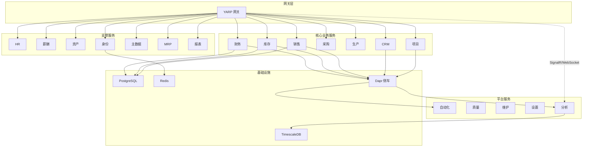
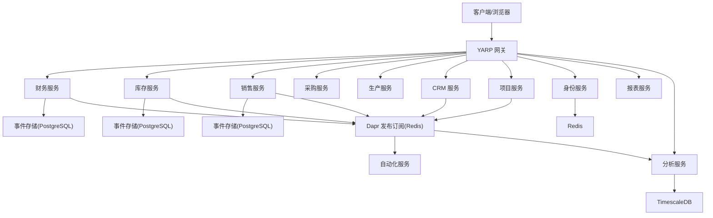
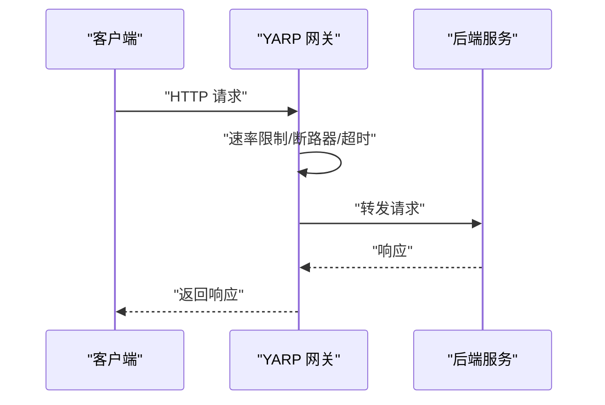
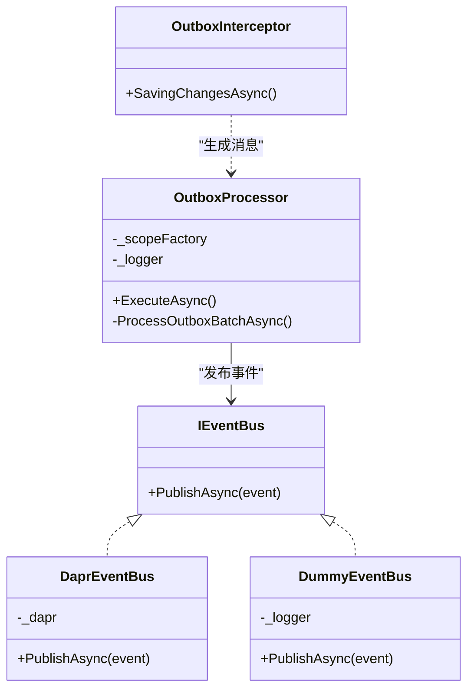
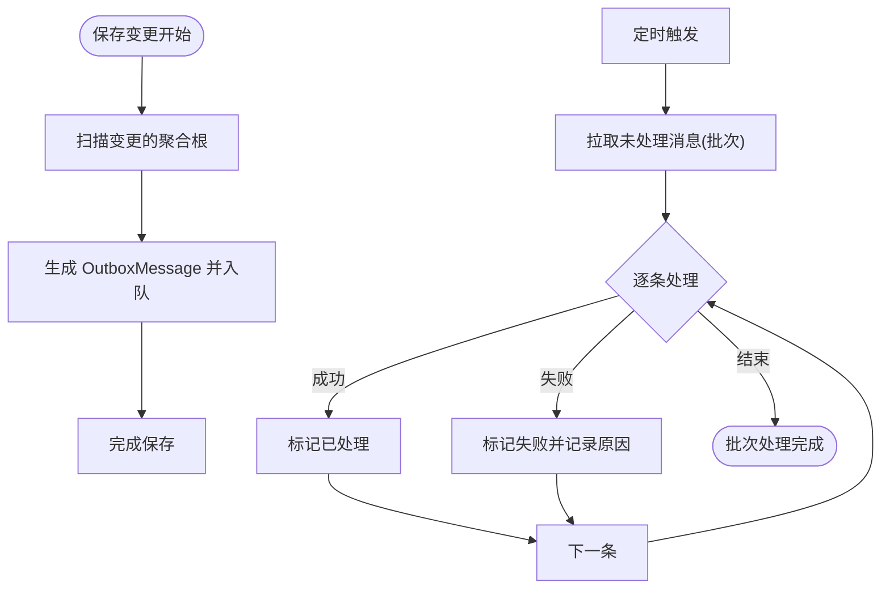
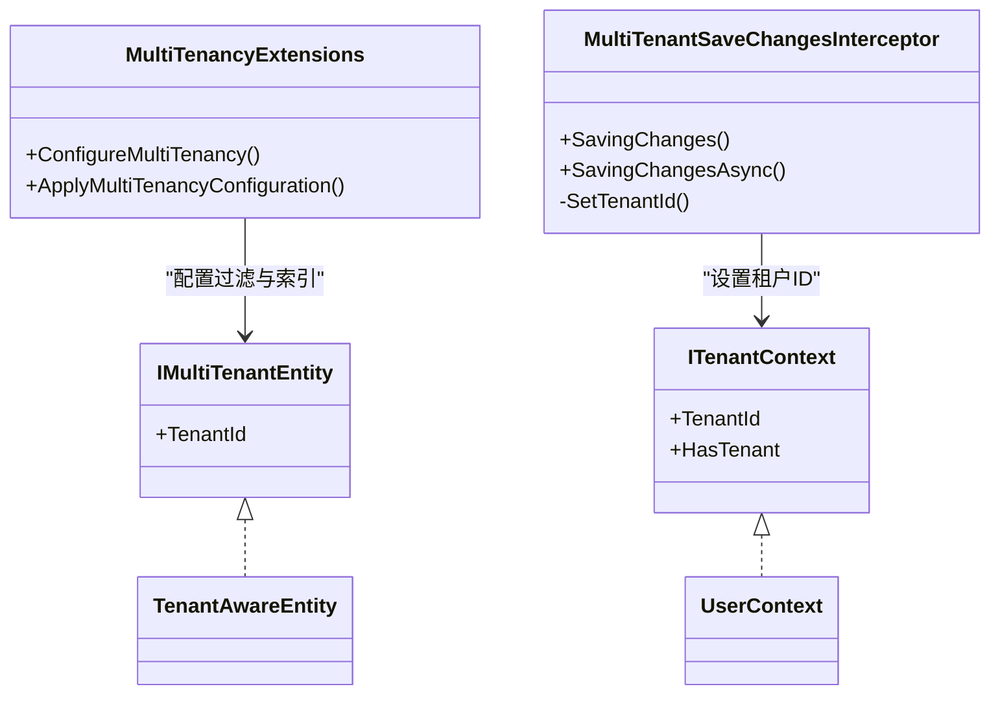
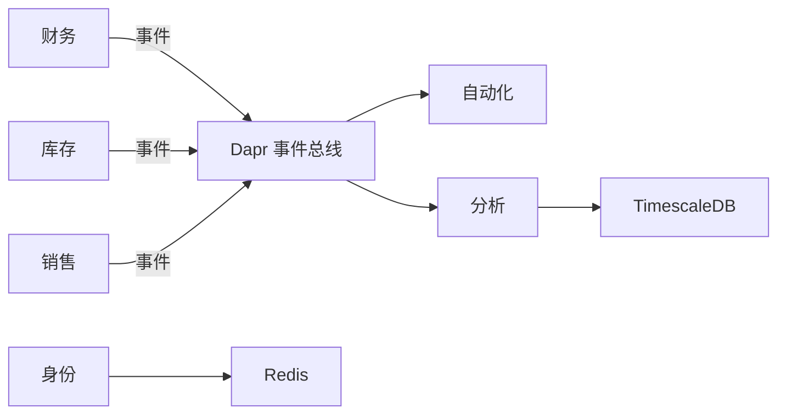

# 系统架构

<cite>
**本文引用的文件**
- [README.md](file://README.md)
- [docs/deployment.md](file://docs/deployment.md)
- [deploy/k8s/ingress.yaml](file://deploy/k8s/ingress.yaml)
- [deploy/k8s/services/gateway.yaml](file://deploy/k8s/services/gateway.yaml)
- [deploy/helm/erp-system/values.yaml](file://deploy/helm/erp-system/values.yaml)
- [components/pubsub.yaml](file://components/pubsub.yaml)
- [components/statestore.yaml](file://components/statestore.yaml)
- [src/Gateways/ErpSystem.Gateway/Program.cs](file://src/Gateways/ErpSystem.Gateway/Program.cs)
- [src/BuildingBlocks/ErpSystem.BuildingBlocks/EventBus/DaprEventBus.cs](file://src/BuildingBlocks/ErpSystem.BuildingBlocks/EventBus/DaprEventBus.cs)
- [src/BuildingBlocks/ErpSystem.BuildingBlocks/EventBus/EventBusExtensions.cs](file://src/BuildingBlocks/ErpSystem.BuildingBlocks/EventBus/EventBusExtensions.cs)
- [src/BuildingBlocks/ErpSystem.BuildingBlocks/Outbox/OutboxProcessor.cs](file://src/BuildingBlocks/ErpSystem.BuildingBlocks/Outbox/OutboxProcessor.cs)
- [src/BuildingBlocks/ErpSystem.BuildingBlocks/Outbox/OutboxInterceptor.cs](file://src/BuildingBlocks/ErpSystem.BuildingBlocks/Outbox/OutboxInterceptor.cs)
- [src/BuildingBlocks/ErpSystem.BuildingBlocks/MultiTenancy/MultiTenancy.cs](file://src/BuildingBlocks/ErpSystem.BuildingBlocks/MultiTenancy/MultiTenancy.cs)
- [src/BuildingBlocks/ErpSystem.BuildingBlocks/DependencyInjection.cs](file://src/BuildingBlocks/ErpSystem.BuildingBlocks/DependencyInjection.cs)
- [src/Services/Finance/ErpSystem.Finance/Program.cs](file://src/Services/Finance/ErpSystem.Finance/Program.cs)
- [src/Services/Inventory/ErpSystem.Inventory/Program.cs](file://src/Services/Inventory/ErpSystem.Inventory/Program.cs)
- [src/Services/Analytics/ErpSystem.Analytics/Program.cs](file://src/Services/Analytics/ErpSystem.Analytics/Program.cs)
- [src/Services/Reporting/ErpSystem.Reporting/Program.cs](file://src/Services/Reporting/ErpSystem.Reporting/Program.cs)
</cite>

## 目录
1. [引言](#引言)
2. [项目结构](#项目结构)
3. [核心组件](#核心组件)
4. [架构总览](#架构总览)
5. [详细组件分析](#详细组件分析)
6. [依赖关系分析](#依赖关系分析)
7. [性能考量](#性能考量)
8. [故障排查指南](#故障排查指南)
9. [结论](#结论)
10. [附录](#附录)

## 引言
本架构文档面向ERP微服务系统，聚焦于高层设计、架构模式与系统边界，阐述微服务划分策略、服务间通信机制与数据流设计，详解Dapr分布式应用运行时的集成方式、事件总线架构与消息传递模式，并覆盖基础设施要求、可扩展性与部署拓扑。同时，文档对安全、可观测性与灾难恢复等横切关注点进行说明，记录技术栈、第三方依赖与版本兼容性。

## 项目结构
系统采用多服务分层组织：网关层（YARP）、核心业务服务（财务、库存、销售、采购、生产、CRM、项目管理等）、支撑服务（HR、薪酬、资产、身份、主数据、MRP、报表）、平台服务（自动化、质量、维护、设置、分析）以及基础设施（PostgreSQL、TimescaleDB、Redis、Dapr侧车）。前端使用React单页应用，通过网关统一对外暴露REST与WebSocket接口。

图表来源
- [README.md](file://README.md#L130-L183)
- [deploy/k8s/ingress.yaml](file://deploy/k8s/ingress.yaml#L12-L22)
- [deploy/k8s/services/gateway.yaml](file://deploy/k8s/services/gateway.yaml#L50-L59)

章节来源
- [README.md](file://README.md#L130-L183)
- [deploy/k8s/ingress.yaml](file://deploy/k8s/ingress.yaml#L1-L37)
- [deploy/k8s/services/gateway.yaml](file://deploy/k8s/services/gateway.yaml#L1-L60)

## 核心组件
- 网关层（YARP）：负责反向代理、路由、健康检查、速率限制与弹性策略注入，统一入口与安全边界。
- 事件总线与Dapr：基于Redis的发布订阅组件，实现跨服务解耦与可靠事件传播；Outbox处理器保障事务内事件可靠投递。
- 企业通用模块（BuildingBlocks）：提供验证、日志、幂等、审计、性能、多租户、缓存、异常处理、CQRS抽象、领域事件派发等横切能力。
- 数据存储：PostgreSQL用于业务读写库；TimescaleDB用于时间序列分析；Redis用于状态与发布订阅；部分服务使用MongoDB（如MRP）。
- 实时分析与通知：SignalR提供实时仪表盘推送；ML.NET用于需求预测；TimescaleDB支持高吞吐时间序列。

章节来源
- [src/Gateways/ErpSystem.Gateway/Program.cs](file://src/Gateways/ErpSystem.Gateway/Program.cs#L16-L70)
- [src/BuildingBlocks/ErpSystem.BuildingBlocks/EventBus/DaprEventBus.cs](file://src/BuildingBlocks/ErpSystem.BuildingBlocks/EventBus/DaprEventBus.cs#L1-L44)
- [src/BuildingBlocks/ErpSystem.BuildingBlocks/Outbox/OutboxProcessor.cs](file://src/BuildingBlocks/ErpSystem.BuildingBlocks/Outbox/OutboxProcessor.cs#L1-L80)
- [src/BuildingBlocks/ErpSystem.BuildingBlocks/Outbox/OutboxInterceptor.cs](file://src/BuildingBlocks/ErpSystem.BuildingBlocks/Outbox/OutboxInterceptor.cs#L1-L50)
- [src/BuildingBlocks/ErpSystem.BuildingBlocks/MultiTenancy/MultiTenancy.cs](file://src/BuildingBlocks/ErpSystem.BuildingBlocks/MultiTenancy/MultiTenancy.cs#L1-L105)
- [src/BuildingBlocks/ErpSystem.BuildingBlocks/DependencyInjection.cs](file://src/BuildingBlocks/ErpSystem.BuildingBlocks/DependencyInjection.cs#L1-L31)

## 架构总览
系统采用云原生微服务架构，结合领域驱动设计（DDD）、事件溯源（ES）、命令查询职责分离（CQRS）与SaaS多租户隔离。服务通过Dapr事件总线实现松耦合通信，Outbox保障最终一致性；网关统一接入与弹性治理；数据库按场景选择关系型与时间序列数据库；前端通过SignalR实现实时看板。

图表来源
- [README.md](file://README.md#L130-L183)
- [components/pubsub.yaml](file://components/pubsub.yaml#L1-L13)
- [components/statestore.yaml](file://components/statestore.yaml#L1-L13)
- [src/Services/Finance/ErpSystem.Finance/Program.cs](file://src/Services/Finance/ErpSystem.Finance/Program.cs#L21-L47)
- [src/Services/Inventory/ErpSystem.Inventory/Program.cs](file://src/Services/Inventory/ErpSystem.Inventory/Program.cs#L20-L39)
- [src/Services/Analytics/ErpSystem.Analytics/Program.cs](file://src/Services/Analytics/ErpSystem.Analytics/Program.cs#L18-L44)

## 详细组件分析

### 网关（YARP）组件
- 职责：反向代理、路由、健康检查、CORS、速率限制、超时与断路器策略注入。
- 部署：双副本，LoadBalancer类型服务，暴露健康端点。
- 安全：开发环境开放OpenAPI；生产环境建议启用TLS与鉴权。

图表来源
- [src/Gateways/ErpSystem.Gateway/Program.cs](file://src/Gateways/ErpSystem.Gateway/Program.cs#L34-L70)
- [deploy/k8s/services/gateway.yaml](file://deploy/k8s/services/gateway.yaml#L10-L46)

章节来源
- [src/Gateways/ErpSystem.Gateway/Program.cs](file://src/Gateways/ErpSystem.Gateway/Program.cs#L1-L111)
- [deploy/k8s/services/gateway.yaml](file://deploy/k8s/services/gateway.yaml#L1-L60)

### 事件总线与Dapr集成
- Dapr组件：Redis作为发布订阅与状态存储。
- 事件总线抽象：IEventBus接口与DaprEventBus实现；开发阶段可用DummyEventBus。
- Outbox模式：EF SaveChanges拦截器生成OutboxMessage，后台任务批量投递，失败重试与标记。

图表来源
- [src/BuildingBlocks/ErpSystem.BuildingBlocks/EventBus/DaprEventBus.cs](file://src/BuildingBlocks/ErpSystem.BuildingBlocks/EventBus/DaprEventBus.cs#L6-L43)
- [src/BuildingBlocks/ErpSystem.BuildingBlocks/EventBus/EventBusExtensions.cs](file://src/BuildingBlocks/ErpSystem.BuildingBlocks/EventBus/EventBusExtensions.cs#L7-L13)
- [src/BuildingBlocks/ErpSystem.BuildingBlocks/Outbox/OutboxProcessor.cs](file://src/BuildingBlocks/ErpSystem.BuildingBlocks/Outbox/OutboxProcessor.cs#L8-L79)
- [src/BuildingBlocks/ErpSystem.BuildingBlocks/Outbox/OutboxInterceptor.cs](file://src/BuildingBlocks/ErpSystem.BuildingBlocks/Outbox/OutboxInterceptor.cs#L7-L49)

章节来源
- [components/pubsub.yaml](file://components/pubsub.yaml#L1-L13)
- [components/statestore.yaml](file://components/statestore.yaml#L1-L13)
- [src/BuildingBlocks/ErpSystem.BuildingBlocks/EventBus/DaprEventBus.cs](file://src/BuildingBlocks/ErpSystem.BuildingBlocks/EventBus/DaprEventBus.cs#L1-L44)
- [src/BuildingBlocks/ErpSystem.BuildingBlocks/EventBus/EventBusExtensions.cs](file://src/BuildingBlocks/ErpSystem.BuildingBlocks/EventBus/EventBusExtensions.cs#L1-L15)
- [src/BuildingBlocks/ErpSystem.BuildingBlocks/Outbox/OutboxProcessor.cs](file://src/BuildingBlocks/ErpSystem.BuildingBlocks/Outbox/OutboxProcessor.cs#L1-L80)
- [src/BuildingBlocks/ErpSystem.BuildingBlocks/Outbox/OutboxInterceptor.cs](file://src/BuildingBlocks/ErpSystem.BuildingBlocks/Outbox/OutboxInterceptor.cs#L1-L50)

### Outbox处理流程
- 拦截保存变更：在EF保存前扫描聚合根变更，生成OutboxMessage并入队。
- 后台批处理：定时拉取未处理消息，发布到事件总线，更新状态或标记失败。
- 错误处理：捕获异常、记录日志、失败标记，保证幂等与可恢复。

图表来源
- [src/BuildingBlocks/ErpSystem.BuildingBlocks/Outbox/OutboxInterceptor.cs](file://src/BuildingBlocks/ErpSystem.BuildingBlocks/Outbox/OutboxInterceptor.cs#L9-L48)
- [src/BuildingBlocks/ErpSystem.BuildingBlocks/Outbox/OutboxProcessor.cs](file://src/BuildingBlocks/ErpSystem.BuildingBlocks/Outbox/OutboxProcessor.cs#L37-L78)

章节来源
- [src/BuildingBlocks/ErpSystem.BuildingBlocks/Outbox/OutboxInterceptor.cs](file://src/BuildingBlocks/ErpSystem.BuildingBlocks/Outbox/OutboxInterceptor.cs#L1-L50)
- [src/BuildingBlocks/ErpSystem.BuildingBlocks/Outbox/OutboxProcessor.cs](file://src/BuildingBlocks/ErpSystem.BuildingBlocks/Outbox/OutboxProcessor.cs#L1-L80)

### 多租户隔离
- 上下文接口：ITenantContext提供租户标识；实体实现IMultiTenantEntity自动带租户字段。
- 查询过滤：全局查询过滤器按租户隔离；索引优化。
- 保存拦截：新增实体自动填充租户ID，确保数据一致性。

图表来源
- [src/BuildingBlocks/ErpSystem.BuildingBlocks/MultiTenancy/MultiTenancy.cs](file://src/BuildingBlocks/ErpSystem.BuildingBlocks/MultiTenancy/MultiTenancy.cs#L10-L104)

章节来源
- [src/BuildingBlocks/ErpSystem.BuildingBlocks/MultiTenancy/MultiTenancy.cs](file://src/BuildingBlocks/ErpSystem.BuildingBlocks/MultiTenancy/MultiTenancy.cs#L1-L105)

### 服务注册与通用行为
- 依赖注入：统一注册验证器、日志与验证行为、用户上下文。
- MediatR：注册管道行为（日志、验证、性能、幂等），简化横切逻辑。
- 结果模式：Result<T>与错误类型封装，提升错误处理一致性。

章节来源
- [src/BuildingBlocks/ErpSystem.BuildingBlocks/DependencyInjection.cs](file://src/BuildingBlocks/ErpSystem.BuildingBlocks/DependencyInjection.cs#L10-L31)

### 典型业务服务（财务、库存、分析）
- 财务服务：事件存储（PostgreSQL）、事件总线、MediatR、控制器、Swagger。
- 库存服务：事件存储、事件总线、预测服务、MediatR。
- 分析服务：SignalR Hub、预测引擎、TimescaleDB、后台作业。

章节来源
- [src/Services/Finance/ErpSystem.Finance/Program.cs](file://src/Services/Finance/ErpSystem.Finance/Program.cs#L14-L77)
- [src/Services/Inventory/ErpSystem.Inventory/Program.cs](file://src/Services/Inventory/ErpSystem.Inventory/Program.cs#L13-L79)
- [src/Services/Analytics/ErpSystem.Analytics/Program.cs](file://src/Services/Analytics/ErpSystem.Analytics/Program.cs#L10-L66)

## 依赖关系分析
- 组件耦合：服务间通过Dapr事件总线解耦；Outbox降低直接依赖；网关集中治理。
- 外部依赖：PostgreSQL、TimescaleDB、Redis、Dapr组件、Kubernetes/Helm。
- 可能的循环依赖：通过事件驱动与异步消息避免直接循环调用。

图表来源
- [components/pubsub.yaml](file://components/pubsub.yaml#L1-L13)
- [components/statestore.yaml](file://components/statestore.yaml#L1-L13)
- [src/Services/Finance/ErpSystem.Finance/Program.cs](file://src/Services/Finance/ErpSystem.Finance/Program.cs#L27-L47)
- [src/Services/Inventory/ErpSystem.Inventory/Program.cs](file://src/Services/Inventory/ErpSystem.Inventory/Program.cs#L29-L39)
- [src/Services/Analytics/ErpSystem.Analytics/Program.cs](file://src/Services/Analytics/ErpSystem.Analytics/Program.cs#L18-L44)

章节来源
- [components/pubsub.yaml](file://components/pubsub.yaml#L1-L13)
- [components/statestore.yaml](file://components/statestore.yaml#L1-L13)

## 性能考量
- 弹性策略：指数退避重试、断路器、超时，避免级联故障。
- 批处理：Outbox批处理减少事件发布频率与数据库压力。
- 缓存：分布式缓存扩展，GetOrSet模式提升热点查询性能。
- 数据库：PostgreSQL分区与索引优化；TimescaleDB时间序列压缩与物化视图。
- 资源：Kubernetes资源请求/限制与水平扩展副本数。

## 故障排查指南
- 健康检查：所有服务暴露/liveness与/readiness端点，便于探针检测。
- 日志与审计：统一日志与审计行为，定位异常与追踪操作。
- 事件丢失：检查OutboxProcessor是否运行、消息是否被标记失败、重试间隔是否合理。
- 事件风暴：确认断路器阈值、限流策略与消费者处理能力。
- 数据库连接：核对连接字符串、迁移脚本与数据库初始化顺序。

章节来源
- [docs/deployment.md](file://docs/deployment.md#L103-L114)
- [src/BuildingBlocks/ErpSystem.BuildingBlocks/Outbox/OutboxProcessor.cs](file://src/BuildingBlocks/ErpSystem.BuildingBlocks/Outbox/OutboxProcessor.cs#L20-L35)

## 结论
该ERP微服务系统以云原生与DDD为核心，结合事件溯源、CQRS与多租户模式，通过Dapr事件总线实现服务解耦与可靠消息传递。网关统一治理与弹性策略保障入口稳定；数据库与时间序列库满足不同场景需求；实时分析与SignalR提供业务洞察与用户体验。整体架构具备良好的可扩展性与可运维性，适合中大型企业级部署。

## 附录

### 技术栈与版本兼容性
- 运行时与框架：.NET 10、ASP.NET Core、Entity Framework Core、MediatR、FluentValidation。
- 数据库：PostgreSQL（业务事件存储与读库）、TimescaleDB（时间序列）、MongoDB（MRP服务）。
- 消息与状态：Dapr（发布订阅、状态存储）、Redis（发布订阅、缓存）。
- 部署：Kubernetes（Helm Chart、原生清单）、Docker。
- 实时：SignalR、WebSockets。
- 机器学习：ML.NET（预测）。

章节来源
- [README.md](file://README.md#L219-L226)
- [src/Services/Mrp/ErpSystem.Mrp/appsettings.json](file://src/Services/Mrp/ErpSystem.Mrp/appsettings.json#L9-L16)

### 部署拓扑与基础设施
- Helm参数：命名空间、服务副本、Ingress主机、PostgreSQL/Redis启用与凭据、Dapr组件选择。
- Kubernetes清单：命名空间、ConfigMap/Secrets、服务与Ingress、网关部署。
- Ingress路由：根路径至网关；/api/dashboard与/api/reports指向报表服务。

章节来源
- [deploy/helm/erp-system/values.yaml](file://deploy/helm/erp-system/values.yaml#L1-L127)
- [docs/deployment.md](file://docs/deployment.md#L26-L76)
- [deploy/k8s/ingress.yaml](file://deploy/k8s/ingress.yaml#L12-L36)