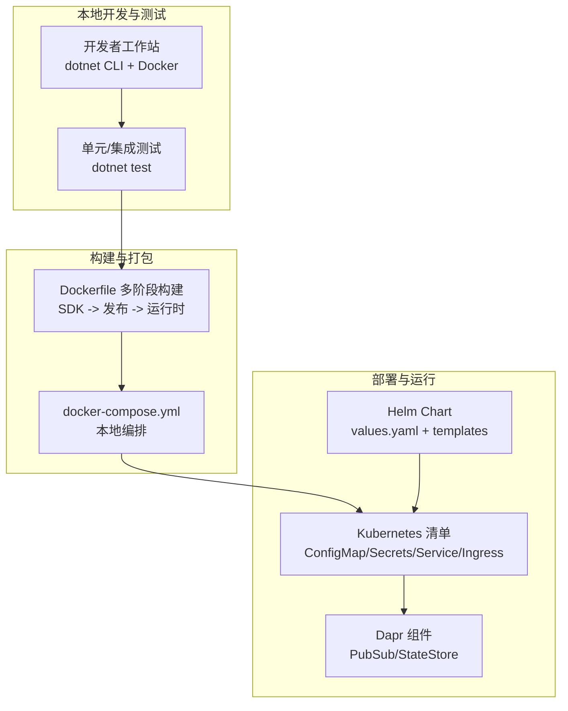
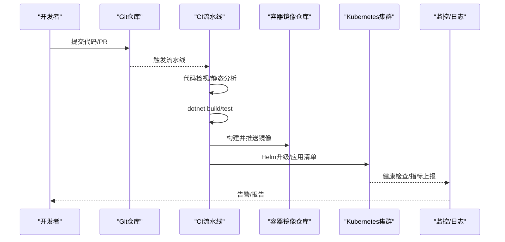
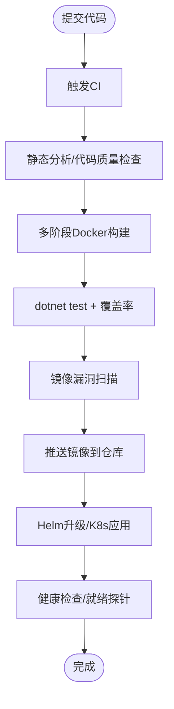
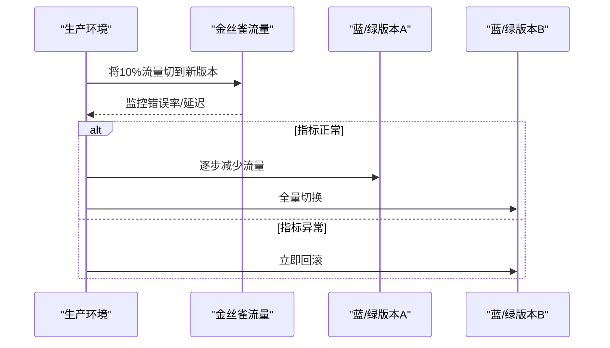
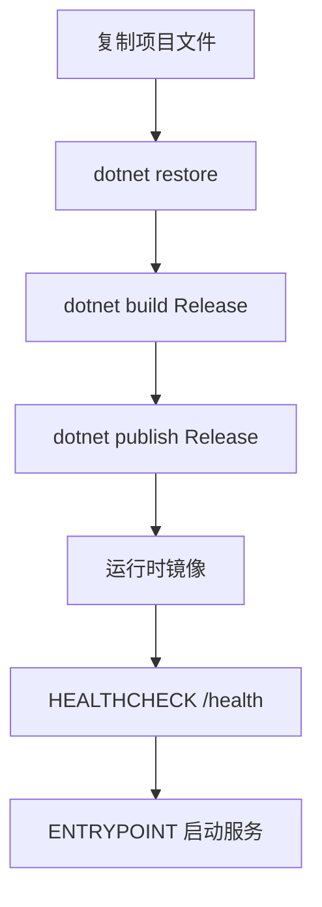
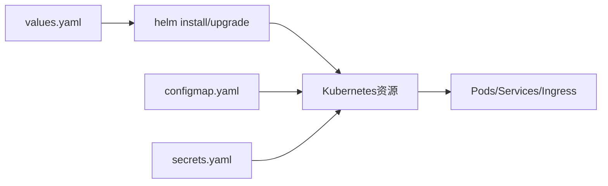
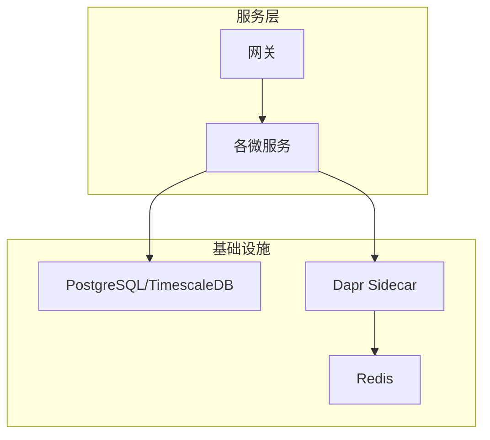

# CI/CD流水线

<cite>
**本文档引用的文件**
- [README.md](file://README.md)
- [DEVELOPMENT_PLAN.md](file://DEVELOPMENT_PLAN.md)
- [Dockerfile](file://Dockerfile)
- [docker-compose.yml](file://docker-compose.yml)
- [deploy/helm/erp-system/values.yaml](file://deploy/helm/erp-system/values.yaml)
- [deploy/helm/erp-system/Chart.yaml](file://deploy/helm/erp-system/Chart.yaml)
- [deploy/helm/erp-system/templates/deployment.yaml](file://deploy/helm/erp-system/templates/deployment.yaml)
- [deploy/helm/erp-system/templates/service.yaml](file://deploy/helm/erp-system/templates/service.yaml)
- [deploy/helm/erp-system/templates/ingress.yaml](file://deploy/helm/erp-system/templates/ingress.yaml)
- [deploy/k8s/services/gateway.yaml](file://deploy/k8s/services/gateway.yaml)
- [deploy/k8s/configmap.yaml](file://deploy/k8s/configmap.yaml)
- [deploy/k8s/secrets.yaml](file://deploy/k8s/secrets.yaml)
- [components/pubsub.yaml](file://components/pubsub.yaml)
- [components/statestore.yaml](file://components/statestore.yaml)
- [docs/deployment.md](file://docs/deployment.md)
- [src/Gateways/ErpSystem.Gateway/Dockerfile](file://src/Gateways/ErpSystem.Gateway/Dockerfile)
- [src/Services/Identity/ErpSystem.Identity/Dockerfile](file://src/Services/Identity/ErpSystem.Identity/Dockerfile)
- [src/BuildingBlocks/ErpSystem.BuildingBlocks/ErpSystem.BuildingBlocks.csproj](file://src/BuildingBlocks/ErpSystem.BuildingBlocks/ErpSystem.BuildingBlocks.csproj)
- [src/ErpSystem.sln](file://src/ErpSystem.sln)
</cite>

## 目录
1. [简介](#简介)
2. [项目结构](#项目结构)
3. [核心组件](#核心组件)
4. [架构总览](#架构总览)
5. [详细组件分析](#详细组件分析)
6. [依赖关系分析](#依赖关系分析)
7. [性能考虑](#性能考虑)
8. [故障排除指南](#故障排除指南)
9. [结论](#结论)
10. [附录](#附录)

## 简介
本文件面向DevOps团队，系统化梳理该ERP微服务项目的CI/CD流水线设计与实践，覆盖持续集成流程、代码质量检查、自动化测试、持续部署策略（蓝绿部署与金丝雀发布）、构建管道配置、Docker镜像构建与版本管理、自动化部署脚本、环境管理与配置同步、回滚策略、故障恢复与灾难恢复计划、安全扫描与漏洞检测、合规性检查，以及性能测试、负载测试与压力测试流程，并提供流水线设计与优化指导。

## 项目结构
该项目采用多服务微架构，包含网关层、核心业务服务、支撑服务与平台服务，结合Dapr边车、PostgreSQL/TimescaleDB、Redis、Helm/Kubernetes进行部署。关键目录与文件如下：
- 根目录：Dockerfile、docker-compose.yml、README.md、DEVELOPMENT_PLAN.md、docs/deployment.md
- 部署层：deploy/helm/erp-system（Helm Chart与values）、deploy/k8s（原生K8s清单）
- 组件层：components（Dapr组件定义）
- 服务层：src/Services/*（各微服务）、src/Gateways/ErpSystem.Gateway（YARP网关）
- 基础设施：infrastructure（数据库初始化脚本）

图表来源
- [Dockerfile](file://Dockerfile#L1-L37)
- [docker-compose.yml](file://docker-compose.yml#L1-L99)
- [deploy/helm/erp-system/values.yaml](file://deploy/helm/erp-system/values.yaml#L1-L127)
- [deploy/helm/erp-system/templates/deployment.yaml](file://deploy/helm/erp-system/templates/deployment.yaml)
- [deploy/k8s/configmap.yaml](file://deploy/k8s/configmap.yaml#L1-L25)
- [deploy/k8s/secrets.yaml](file://deploy/k8s/secrets.yaml#L1-L19)
- [components/pubsub.yaml](file://components/pubsub.yaml#L1-L13)
- [components/statestore.yaml](file://components/statestore.yaml#L1-L13)

章节来源
- [README.md](file://README.md#L217-L286)
- [docs/deployment.md](file://docs/deployment.md#L1-L115)

## 核心组件
- 微服务镜像构建：统一使用多阶段Dockerfile，基于.NET 10 SDK构建，最终运行时基于ASP.NET 10，支持健康检查与入口点配置。
- 本地编排：docker-compose定义了网关、身份服务、Dapr Placement、Redis、PostgreSQL/TimescaleDB与Zipkin等服务，便于本地联调。
- Kubernetes部署：提供Helm Chart与原生K8s清单，支持Ingress、Service、ConfigMap、Secrets与探针配置。
- Dapr组件：通过pubsub与statestore组件连接Redis，支撑事件发布订阅与状态存储。
- 网关：YARP网关作为统一入口，暴露健康检查端点，支持负载均衡与路由转发。

章节来源
- [Dockerfile](file://Dockerfile#L1-L37)
- [docker-compose.yml](file://docker-compose.yml#L1-L99)
- [deploy/helm/erp-system/values.yaml](file://deploy/helm/erp-system/values.yaml#L1-L127)
- [deploy/k8s/services/gateway.yaml](file://deploy/k8s/services/gateway.yaml#L1-L60)
- [components/pubsub.yaml](file://components/pubsub.yaml#L1-L13)
- [components/statestore.yaml](file://components/statestore.yaml#L1-L13)

## 架构总览
下图展示从代码提交到生产部署的关键路径，包括构建、测试、镜像推送、Helm/K8s部署与监控观测。

图表来源
- [README.md](file://README.md#L234-L251)
- [docs/deployment.md](file://docs/deployment.md#L12-L44)
- [deploy/helm/erp-system/values.yaml](file://deploy/helm/erp-system/values.yaml#L1-L127)

## 详细组件分析

### 持续集成流程
- 触发条件：分支保护规则、PR合并、标签发布。
- 步骤：
  1) 代码检视：静态分析（如Roslyn Analyzers、SonarQube或GitHub Security Alerts）。
  2) 构建：使用多阶段Dockerfile构建Release二进制。
  3) 测试：执行dotnet test，建议启用覆盖率收集。
  4) 安全扫描：镜像漏洞扫描（Trivy/Snyk）与依赖审计。
  5) 镜像推送：按版本标签推送至镜像仓库。
  6) 部署：Helm升级或kubectl应用清单。
  7) 回归验证：健康检查、端到端测试、性能回归。

图表来源
- [Dockerfile](file://Dockerfile#L1-L37)
- [README.md](file://README.md#L234-L251)
- [docs/deployment.md](file://docs/deployment.md#L12-L44)

章节来源
- [README.md](file://README.md#L234-L251)
- [docs/deployment.md](file://docs/deployment.md#L12-L44)

### 代码质量检查与自动化测试
- 质量门禁：在PR中强制执行静态分析与测试通过。
- 测试策略：
  - 单元测试：针对BuildingBlocks与各服务的命令/查询处理器。
  - 集成测试：跨服务事件流验证（如采购->库存->财务）。
  - 端到端测试：前端SPA与后端API联调。
- 覆盖率：建议启用并设置阈值，避免回归。
- 工具链：推荐使用SonarQube、CodeClimate或GitHub Code Scanning。

章节来源
- [README.md](file://README.md#L326-L339)
- [src/BuildingBlocks/ErpSystem.BuildingBlocks/ErpSystem.BuildingBlocks.csproj](file://src/BuildingBlocks/ErpSystem.BuildingBlocks/ErpSystem.BuildingBlocks.csproj)

### 持续部署策略
- 蓝绿部署：
  - 使用Helm values中的replicaCount与滚动更新策略。
  - 通过Ingress切换流量至新版本服务。
  - 建议保留旧版本至少一个副本以快速回滚。
- 金丝雀发布：
  - 逐步增加新版本副本比例，配合Prometheus/Grafana观察指标。
  - 可结合Istio/NGINX Ingress的权重路由实现。
- 回滚策略：
  - Helm rollback至历史版本。
  - K8s set image回滚到上一个镜像标签。
  - 建议保留最近3个版本镜像以便快速回滚。

图表来源
- [deploy/helm/erp-system/values.yaml](file://deploy/helm/erp-system/values.yaml#L11-L20)
- [deploy/helm/erp-system/templates/ingress.yaml](file://deploy/helm/erp-system/templates/ingress.yaml)

章节来源
- [deploy/helm/erp-system/values.yaml](file://deploy/helm/erp-system/values.yaml#L11-L20)

### 构建管道配置与Docker镜像构建
- 多阶段构建：SDK阶段还原依赖与编译，发布阶段生成可执行文件，最终运行时镜像仅包含ASP.NET运行时与发布产物。
- 参数化构建：通过SERVICE_NAME参数选择目标服务，支持批量构建多个服务镜像。
- 健康检查：容器内置HTTP健康检查端点，K8s探针基于/health与/health/ready。
- 网关镜像：独立Dockerfile，便于网关单独构建与部署。

图表来源
- [Dockerfile](file://Dockerfile#L1-L37)
- [src/Gateways/ErpSystem.Gateway/Dockerfile](file://src/Gateways/ErpSystem.Gateway/Dockerfile#L1-L22)

章节来源
- [Dockerfile](file://Dockerfile#L1-L37)
- [src/Gateways/ErpSystem.Gateway/Dockerfile](file://src/Gateways/ErpSystem.Gateway/Dockerfile#L1-L22)

### 版本管理与镜像标签策略
- 语义化版本：主版本.次版本.修订号，配合Git标签。
- 镜像标签：
  - 最新稳定版：latest
  - 版本标签：v1.2.3
  - 开发分支：dev-branch-hash
- Helm Chart版本：Chart.yaml中的version/appVersion与values.yaml中的image.tag联动。

章节来源
- [deploy/helm/erp-system/Chart.yaml](file://deploy/helm/erp-system/Chart.yaml#L1-L27)
- [deploy/helm/erp-system/values.yaml](file://deploy/helm/erp-system/values.yaml#L26-L37)

### 自动化部署脚本与环境管理
- Helm部署：
  - 依赖更新：helm dependency update
  - 安装/升级：helm install/upgrade
  - 环境覆盖：通过-f values-*.yaml传入不同环境配置
- 原生K8s部署：
  - Namespace -> ConfigMap/Secrets -> Services -> Ingress
  - 支持kubectl apply -f deploy/k8s/*
- 环境变量与密钥：
  - ConfigMap：ASPNETCORE_ENVIRONMENT、数据库连接字符串、服务URL
  - Secrets：DB_PASSWORD、JWT_SECRET、REDIS_PASSWORD、DAPR_API_TOKEN

图表来源
- [deploy/helm/erp-system/values.yaml](file://deploy/helm/erp-system/values.yaml#L1-L127)
- [docs/deployment.md](file://docs/deployment.md#L26-L76)
- [deploy/k8s/configmap.yaml](file://deploy/k8s/configmap.yaml#L1-L25)
- [deploy/k8s/secrets.yaml](file://deploy/k8s/secrets.yaml#L1-L19)

章节来源
- [docs/deployment.md](file://docs/deployment.md#L26-L76)
- [deploy/k8s/configmap.yaml](file://deploy/k8s/configmap.yaml#L1-L25)
- [deploy/k8s/secrets.yaml](file://deploy/k8s/secrets.yaml#L1-L19)

### 配置同步与Dapr组件
- Dapr组件：pubsub与statestore指向Redis，确保事件驱动与状态一致性。
- 组件挂载：docker-compose中通过volumes将components挂载到daprd容器。
- 生产建议：使用Helm部署Dapr并配置安全令牌与网络策略。

章节来源
- [components/pubsub.yaml](file://components/pubsub.yaml#L1-L13)
- [components/statestore.yaml](file://components/statestore.yaml#L1-L13)
- [docker-compose.yml](file://docker-compose.yml#L24-L28)

### 回滚策略、故障恢复与灾难恢复
- 回滚：
  - Helm：helm history + helm rollback
  - K8s：kubectl rollout undo
- 故障恢复：
  - Pod重启与自动扩缩容（HPA）配合
  - 健康检查失败时自动替换不健康实例
- 灾难恢复：
  - 数据库备份与恢复演练（PostgreSQL/TimescaleDB）
  - 配置与密钥的版本化管理（GitOps）
  - 多可用区部署与跨区域备份

章节来源
- [deploy/helm/erp-system/values.yaml](file://deploy/helm/erp-system/values.yaml#L11-L20)
- [deploy/k8s/services/gateway.yaml](file://deploy/k8s/services/gateway.yaml#L35-L46)

### 安全扫描、漏洞检测与合规性检查
- 镜像扫描：Trivy/Snyk扫描基础镜像与依赖漏洞
- 依赖审计：dotnet outdated + 安全更新策略
- 合规性：最小权限原则、只读根文件系统、非root运行、TLS与密钥轮换
- 网络策略：K8s NetworkPolicy限制服务间访问

章节来源
- [Dockerfile](file://Dockerfile#L31-L36)
- [deploy/k8s/secrets.yaml](file://deploy/k8s/secrets.yaml#L7-L19)

### 性能测试、负载测试与压力测试
- 性能测试：
  - 基准测试：wrk/ab压测关键API端点
  - 指标：P50/P95延迟、吞吐量、错误率
- 负载测试：
  - 逐步增加并发用户数，观察CPU/内存/数据库连接池
- 压力测试：
  - 突发流量与限流策略验证
- 工具链：JMeter/K6/Loader.io + Prometheus/Grafana

章节来源
- [docs/deployment.md](file://docs/deployment.md#L109-L115)

## 依赖关系分析
- 服务依赖：各微服务通过Dapr Pub/Sub与State Store交互；网关统一路由。
- 数据依赖：PostgreSQL/TimescaleDB存储业务数据；Redis缓存与事件存储。
- 部署依赖：Helm Chart依赖Bitnami的postgresql与redis；values.yaml控制镜像与副本数。

图表来源
- [docker-compose.yml](file://docker-compose.yml#L1-L99)
- [deploy/helm/erp-system/Chart.yaml](file://deploy/helm/erp-system/Chart.yaml#L18-L27)
- [deploy/helm/erp-system/values.yaml](file://deploy/helm/erp-system/values.yaml#L99-L123)

章节来源
- [docker-compose.yml](file://docker-compose.yml#L1-L99)
- [deploy/helm/erp-system/Chart.yaml](file://deploy/helm/erp-system/Chart.yaml#L18-L27)
- [deploy/helm/erp-system/values.yaml](file://deploy/helm/erp-system/values.yaml#L99-L123)

## 性能考虑
- 资源配额：为各服务设置requests/limits，避免资源争抢。
- 探针配置：健康检查间隔与超时合理设置，避免误判。
- 缓存策略：Redis缓存热点数据，降低数据库压力。
- 数据库优化：TimescaleDB时间序列索引、分区与压缩策略。
- 网关性能：YARP路由缓存与连接池复用。

章节来源
- [deploy/helm/erp-system/values.yaml](file://deploy/helm/erp-system/values.yaml#L13-L19)
- [deploy/k8s/services/gateway.yaml](file://deploy/k8s/services/gateway.yaml#L28-L46)

## 故障排除指南
- 健康检查失败：
  - 检查/health与/health/ready端点返回
  - 查看容器日志与Dapr sidecar日志
- 服务不可达：
  - 核对Service/Ingress配置与DNS解析
  - 检查防火墙与NetworkPolicy
- 数据库连接问题：
  - 校验ConfigMap中的连接字符串与Secrets
  - TimescaleDB初始化脚本是否执行成功
- 镜像拉取失败：
  - 检查镜像仓库凭证与网络策略
  - 确认镜像tag与Chart中的配置一致

章节来源
- [deploy/k8s/configmap.yaml](file://deploy/k8s/configmap.yaml#L11-L25)
- [deploy/k8s/secrets.yaml](file://deploy/k8s/secrets.yaml#L7-L19)
- [deploy/helm/erp-system/values.yaml](file://deploy/helm/erp-system/values.yaml#L26-L37)

## 结论
本项目的CI/CD流水线以多阶段Docker构建为基础，结合Helm/K8s实现标准化部署，辅以Dapr事件驱动与Redis/TimescaleDB基础设施，形成可扩展、可观测、可回滚的现代化交付体系。建议在现有基础上进一步完善自动化测试覆盖率、引入GitOps与安全扫描自动化、细化金丝雀发布策略与性能基线，以提升交付质量与稳定性。

## 附录
- 快速参考
  - 构建镜像：docker build -t erp-system/{service}:latest --build-arg SERVICE_NAME={ServiceName} .
  - Helm安装：helm install erp-system deploy/helm/erp-system --set postgresql.auth.password=your-pass
  - 验证部署：kubectl get pods/svc/ingress -n erp-system
- 最佳实践
  - 将values-*.yaml纳入版本控制，区分环境
  - 使用Git标签与镜像tag保持一致
  - 引入Prometheus/Grafana与Sentry/ELK进行监控与告警
  - 定期演练灾难恢复与回滚流程