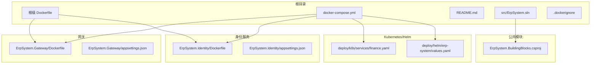
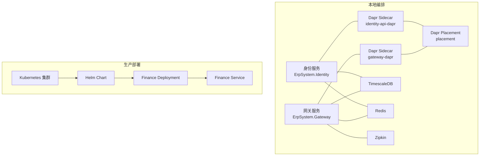
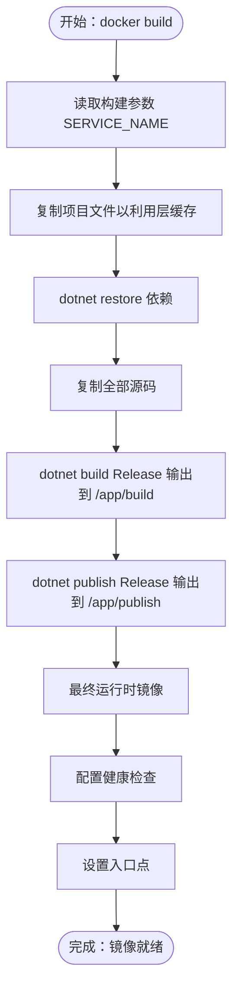
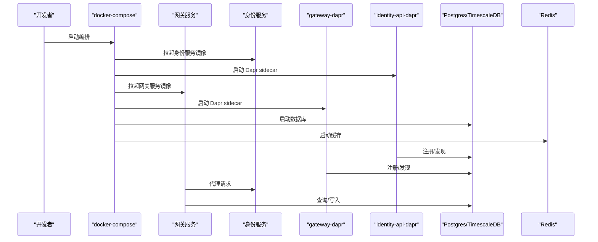
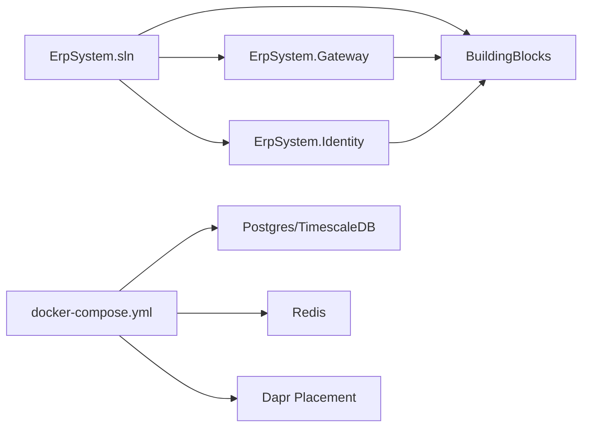

# 构建管道

<cite>
**本文引用的文件**
- [docker-compose.yml](file://docker-compose.yml)
- [Dockerfile](file://Dockerfile)
- [README.md](file://README.md)
- [src/ErpSystem.sln](file://src/ErpSystem.sln)
- [src/BuildingBlocks/ErpSystem.BuildingBlocks/ErpSystem.BuildingBlocks.csproj](file://src/BuildingBlocks/ErpSystem.BuildingBlocks/ErpSystem.BuildingBlocks.csproj)
- [src/Services/Identity/ErpSystem.Identity/Dockerfile](file://src/Services/Identity/ErpSystem.Identity/Dockerfile)
- [src/Gateways/ErpSystem.Gateway/Dockerfile](file://src/Gateways/ErpSystem.Gateway/Dockerfile)
- [src/Services/Identity/ErpSystem.Identity/appsettings.json](file://src/Services/Identity/ErpSystem.Identity/appsettings.json)
- [src/Gateways/ErpSystem.Gateway/appsettings.json](file://src/Gateways/ErpSystem.Gateway/appsettings.json)
- [deploy/k8s/services/finance.yaml](file://deploy/k8s/services/finance.yaml)
- [deploy/helm/erp-system/values.yaml](file://deploy/helm/erp-system/values.yaml)
- [src/.dockerignore](file://src/.dockerignore)
</cite>

## 目录
1. [简介](#简介)
2. [项目结构](#项目结构)
3. [核心组件](#核心组件)
4. [架构总览](#架构总览)
5. [详细组件分析](#详细组件分析)
6. [依赖分析](#依赖分析)
7. [性能考虑](#性能考虑)
8. [故障排除指南](#故障排除指南)
9. [结论](#结论)
10. [附录](#附录)

## 简介
本文件面向开发团队，系统化阐述该 .NET 10 微服务项目的构建管道：从本地开发到容器化与多服务打包，再到 Docker Compose 编排与 Kubernetes/Helm 部署。文档覆盖以下主题：
- .NET 10 解决方案构建与测试流程
- 多阶段 Docker 镜像构建策略与镜像命名规范
- 多服务打包与镜像分发策略
- docker-compose.yml 的服务编排、依赖关系与网络设置
- 构建日志分析、错误排查与性能优化建议
- 构建脚本编写、环境变量配置与构建参数调优
- 增量构建、并行构建与缓存策略
- 构建产物管理、版本标记与发布准备
- 最佳实践与故障排除指导

## 项目结构
该项目采用“单解决方案（Solution）+ 多服务（Services）+ 网关（Gateway）+ 公共模块（BuildingBlocks）”的组织方式，支持本地开发与容器化部署。关键目录与文件如下：
- 根级 Dockerfile：通用多阶段构建模板，通过构建参数选择目标服务进行镜像构建
- 各服务独立 Dockerfile：针对具体服务的精简多阶段构建
- docker-compose.yml：本地多服务编排，包含数据库、缓存、Dapr sidecar 与 Zipkin
- Kubernetes 与 Helm：提供生产级部署模板与可配置值
- .dockerignore：控制构建上下文与层缓存命中率

**图表来源**
- [Dockerfile](file://Dockerfile#L1-L37)
- [docker-compose.yml](file://docker-compose.yml#L1-L99)
- [src/ErpSystem.sln](file://src/ErpSystem.sln#L1-L400)
- [src/BuildingBlocks/ErpSystem.BuildingBlocks/ErpSystem.BuildingBlocks.csproj](file://src/BuildingBlocks/ErpSystem.BuildingBlocks/ErpSystem.BuildingBlocks.csproj#L1-L30)
- [src/Gateways/ErpSystem.Gateway/Dockerfile](file://src/Gateways/ErpSystem.Gateway/Dockerfile#L1-L22)
- [src/Services/Identity/ErpSystem.Identity/Dockerfile](file://src/Services/Identity/ErpSystem.Identity/Dockerfile#L1-L24)
- [deploy/k8s/services/finance.yaml](file://deploy/k8s/services/finance.yaml#L1-L66)
- [deploy/helm/erp-system/values.yaml](file://deploy/helm/erp-system/values.yaml#L1-L127)

**章节来源**
- [README.md](file://README.md#L217-L251)
- [src/ErpSystem.sln](file://src/ErpSystem.sln#L1-L400)

## 核心组件
- .NET 10 解决方案与构建
  - 使用解决方案统一构建与测试，支持并行与增量构建
  - 参考路径：[解决方案文件](file://src/ErpSystem.sln#L1-L400)
- 公共模块（BuildingBlocks）
  - 提供领域驱动设计、CQRS、行为拦截、可观测性等企业级能力
  - 参考路径：[公共模块项目文件](file://src/BuildingBlocks/ErpSystem.BuildingBlocks/ErpSystem.BuildingBlocks.csproj#L1-L30)
- 网关（YARP）与服务镜像
  - 网关与各业务服务均提供独立 Dockerfile，便于按需构建
  - 参考路径：[网关 Dockerfile](file://src/Gateways/ErpSystem.Gateway/Dockerfile#L1-L22)、[身份服务 Dockerfile](file://src/Services/Identity/ErpSystem.Identity/Dockerfile#L1-L24)
- 根级 Dockerfile（多服务模板）
  - 通过构建参数选择服务，实现同一模板多服务复用
  - 参考路径：[根级 Dockerfile](file://Dockerfile#L1-L37)
- docker-compose 编排
  - 定义服务间依赖、端口映射、环境变量与网络
  - 参考路径：[docker-compose.yml](file://docker-compose.yml#L1-L99)
- Kubernetes 与 Helm
  - 提供部署清单与可配置值，支持副本数、镜像仓库与资源限制
  - 参考路径：[Kubernetes 清单](file://deploy/k8s/services/finance.yaml#L1-L66)、[Helm values](file://deploy/helm/erp-system/values.yaml#L1-L127)

**章节来源**
- [README.md](file://README.md#L217-L251)
- [src/ErpSystem.sln](file://src/ErpSystem.sln#L1-L400)
- [src/BuildingBlocks/ErpSystem.BuildingBlocks/ErpSystem.BuildingBlocks.csproj](file://src/BuildingBlocks/ErpSystem.BuildingBlocks/ErpSystem.BuildingBlocks.csproj#L1-L30)
- [src/Gateways/ErpSystem.Gateway/Dockerfile](file://src/Gateways/ErpSystem.Gateway/Dockerfile#L1-L22)
- [src/Services/Identity/ErpSystem.Identity/Dockerfile](file://src/Services/Identity/ErpSystem.Identity/Dockerfile#L1-L24)
- [Dockerfile](file://Dockerfile#L1-L37)
- [docker-compose.yml](file://docker-compose.yml#L1-L99)
- [deploy/k8s/services/finance.yaml](file://deploy/k8s/services/finance.yaml#L1-L66)
- [deploy/helm/erp-system/values.yaml](file://deploy/helm/erp-system/values.yaml#L1-L127)

## 架构总览
下图展示本地与生产环境的构建与运行架构：本地通过 docker-compose 启动多服务与基础设施；生产通过 Kubernetes/Helm 部署，并启用 Dapr sidecar。

**图表来源**
- [docker-compose.yml](file://docker-compose.yml#L1-L99)
- [deploy/k8s/services/finance.yaml](file://deploy/k8s/services/finance.yaml#L1-L66)
- [deploy/helm/erp-system/values.yaml](file://deploy/helm/erp-system/values.yaml#L1-L127)

## 详细组件分析

### .NET 10 解决方案构建与测试
- 构建流程
  - 在根目录执行解决方案构建，确保所有项目在 Release 配置下生成
  - 参考路径：[README 快速开始](file://README.md#L227-L241)
- 测试流程
  - 支持全量测试与按筛选器运行特定模块
  - 参考路径：[README 测试命令](file://README.md#L326-L339)
- 并行与增量
  - 利用 MSBuild 的并行与增量构建能力，减少重复编译时间
  - 参考路径：[解决方案文件](file://src/ErpSystem.sln#L1-L400)

**章节来源**
- [README.md](file://README.md#L227-L241)
- [README.md](file://README.md#L326-L339)
- [src/ErpSystem.sln](file://src/ErpSystem.sln#L1-L400)

### 多阶段 Docker 镜像构建
- 根级 Dockerfile 模板
  - 通过构建参数选择服务，先复制项目文件以提升层缓存命中率，再恢复依赖与构建发布
  - 参考路径：[根级 Dockerfile](file://Dockerfile#L1-L37)
- 网关与身份服务专用 Dockerfile
  - 精简复制范围，仅包含必要项目文件与配置，提升构建速度
  - 参考路径：[网关 Dockerfile](file://src/Gateways/ErpSystem.Gateway/Dockerfile#L1-L22)、[身份服务 Dockerfile](file://src/Services/Identity/ErpSystem.Identity/Dockerfile#L1-L24)
- 健康检查与入口点
  - 发布阶段关闭 AppHost，最终镜像暴露端口并配置健康检查
  - 参考路径：[根级 Dockerfile 健康检查段落](file://Dockerfile#L31-L37)

**图表来源**
- [Dockerfile](file://Dockerfile#L1-L37)

**章节来源**
- [Dockerfile](file://Dockerfile#L1-L37)
- [src/Gateways/ErpSystem.Gateway/Dockerfile](file://src/Gateways/ErpSystem.Gateway/Dockerfile#L1-L22)
- [src/Services/Identity/ErpSystem.Identity/Dockerfile](file://src/Services/Identity/ErpSystem.Identity/Dockerfile#L1-L24)

### 多服务打包策略
- 镜像命名与标签
  - 本地使用 erp-{service} 命名，便于区分不同服务镜像
  - 参考路径：[README 本地运行示例](file://README.md#L243-L251)
- 按需构建
  - 通过根级 Dockerfile 的 SERVICE_NAME 参数选择目标服务，避免不必要的全量构建
  - 参考路径：[根级 Dockerfile 构建参数](file://Dockerfile#L4-L5)
- .dockerignore
  - 排除 IDE、bin/obj、日志与无关文件，缩小构建上下文，提升缓存命中率
  - 参考路径：[.dockerignore](file://src/.dockerignore#L1-L20)

**章节来源**
- [README.md](file://README.md#L243-L251)
- [Dockerfile](file://Dockerfile#L4-L5)
- [src/.dockerignore](file://src/.dockerignore#L1-L20)

### docker-compose.yml 配置与服务编排
- 服务定义与镜像来源
  - 网关与身份服务分别指定 Dockerfile 路径与构建上下文
  - 参考路径：[docker-compose.yml 服务定义](file://docker-compose.yml#L3-L46)
- 依赖关系
  - 网关与身份服务依赖数据库、缓存与 Dapr placement
  - 参考路径：[docker-compose.yml 依赖](file://docker-compose.yml#L14-L17)
- 网络与存储
  - 统一桥接网络 erp-network；数据库数据卷持久化
  - 参考路径：[docker-compose.yml 网络与存储](file://docker-compose.yml#L93-L99)
- 环境变量
  - ASPNETCORE_URLS、连接字符串等关键配置
  - 参考路径：[docker-compose.yml 环境变量](file://docker-compose.yml#L11-L13)

**图表来源**
- [docker-compose.yml](file://docker-compose.yml#L1-L99)

**章节来源**
- [docker-compose.yml](file://docker-compose.yml#L1-L99)

### 网关路由与集群配置
- 路由规则
  - 网关通过 ReverseProxy 将 /api/v1/{module}/{**remainder} 路由到对应服务集群
  - 参考路径：[网关 appsettings.json 路由段](file://src/Gateways/ErpSystem.Gateway/appsettings.json#L9-L113)
- 集群与目标地址
  - 每个模块配置 ClusterId 与目标地址，便于本地调试与扩展
  - 参考路径：[网关 appsettings.json 集群段](file://src/Gateways/ErpSystem.Gateway/appsettings.json#L114-L228)
- 身份配置
  - 身份服务基础日志与跨域配置
  - 参考路径：[身份 appsettings.json](file://src/Services/Identity/ErpSystem.Identity/appsettings.json#L1-L10)

**章节来源**
- [src/Gateways/ErpSystem.Gateway/appsettings.json](file://src/Gateways/ErpSystem.Gateway/appsettings.json#L1-L229)
- [src/Services/Identity/ErpSystem.Identity/appsettings.json](file://src/Services/Identity/ErpSystem.Identity/appsettings.json#L1-L10)

### Kubernetes 与 Helm 部署
- 部署清单
  - Finance 服务示例包含 Deployment、Service、探针与资源限制
  - 参考路径：[Kubernetes 清单](file://deploy/k8s/services/finance.yaml#L1-L66)
- Helm 值
  - 支持副本数、镜像仓库与标签、Ingress 主机、数据库与 Redis 配置、Dapr 组件等
  - 参考路径：[Helm values](file://deploy/helm/erp-system/values.yaml#L1-L127)

**章节来源**
- [deploy/k8s/services/finance.yaml](file://deploy/k8s/services/finance.yaml#L1-L66)
- [deploy/helm/erp-system/values.yaml](file://deploy/helm/erp-system/values.yaml#L1-L127)

## 依赖分析
- 项目依赖
  - BuildingBlocks 作为共享模块被多个服务引用，确保一致的企业级能力
  - 参考路径：[解决方案文件中 BuildingBlocks 引用](file://src/ErpSystem.sln#L6-L9)
- 运行时依赖
  - docker-compose 中服务依赖数据库、缓存与 Dapr placement
  - 参考路径：[docker-compose.yml 依赖段](file://docker-compose.yml#L14-L17)

**图表来源**
- [src/ErpSystem.sln](file://src/ErpSystem.sln#L1-L400)
- [docker-compose.yml](file://docker-compose.yml#L1-L99)

**章节来源**
- [src/ErpSystem.sln](file://src/ErpSystem.sln#L1-L400)
- [docker-compose.yml](file://docker-compose.yml#L1-L99)

## 性能考虑
- 构建性能
  - 使用 .dockerignore 缩小构建上下文，提升层缓存命中率
    - 参考路径：[.dockerignore](file://src/.dockerignore#L1-L20)
  - 根级 Dockerfile 先复制项目文件再复制源码，最大化利用缓存
    - 参考路径：[根级 Dockerfile](file://Dockerfile#L9-L19)
- 运行时性能
  - Kubernetes/Helm 中为每个服务设置合理的资源请求与限制，避免资源争抢
    - 参考路径：[Helm values 资源段](file://deploy/helm/erp-system/values.yaml#L11-L20)
  - 健康检查与探针缩短故障恢复时间
    - 参考路径：[Kubernetes 清单探针段](file://deploy/k8s/services/finance.yaml#L41-L52)

**章节来源**
- [src/.dockerignore](file://src/.dockerignore#L1-L20)
- [Dockerfile](file://Dockerfile#L9-L19)
- [deploy/helm/erp-system/values.yaml](file://deploy/helm/erp-system/values.yaml#L11-L20)
- [deploy/k8s/services/finance.yaml](file://deploy/k8s/services/finance.yaml#L41-L52)

## 故障排除指南
- 构建失败
  - 检查 .dockerignore 是否误排除必要文件
    - 参考路径：[.dockerignore](file://src/.dockerignore#L1-L20)
  - 确认根级 Dockerfile 的 SERVICE_NAME 参数是否正确
    - 参考路径：[根级 Dockerfile 构建参数](file://Dockerfile#L4-L5)
- 服务启动异常
  - 查看 docker-compose 环境变量与端口映射是否冲突
    - 参考路径：[docker-compose.yml 环境变量与端口](file://docker-compose.yml#L11-L13)
  - 确认数据库初始化脚本是否成功挂载
    - 参考路径：[docker-compose.yml 数据库卷](file://docker-compose.yml#L79-L82)
- 探针与健康检查
  - Kubernetes 中探针路径与端口需与应用一致
    - 参考路径：[Kubernetes 清单探针段](file://deploy/k8s/services/finance.yaml#L41-L52)
- 网关路由问题
  - 检查网关 appsettings.json 中路由与集群目标地址
    - 参考路径：[网关 appsettings.json](file://src/Gateways/ErpSystem.Gateway/appsettings.json#L9-L228)

**章节来源**
- [src/.dockerignore](file://src/.dockerignore#L1-L20)
- [Dockerfile](file://Dockerfile#L4-L5)
- [docker-compose.yml](file://docker-compose.yml#L11-L13)
- [docker-compose.yml](file://docker-compose.yml#L79-L82)
- [deploy/k8s/services/finance.yaml](file://deploy/k8s/services/finance.yaml#L41-L52)
- [src/Gateways/ErpSystem.Gateway/appsettings.json](file://src/Gateways/ErpSystem.Gateway/appsettings.json#L9-L228)

## 结论
本构建管道以 .NET 10 为核心，结合多阶段 Docker 构建、docker-compose 本地编排与 Kubernetes/Helm 生产部署，形成从开发到生产的完整流水线。通过合理的缓存策略、依赖管理与探针配置，能够显著提升构建与运行效率。建议团队在 CI/CD 中复用现有模板与配置，确保一致性与可维护性。

## 附录
- 构建脚本编写建议
  - 使用根级 Dockerfile 的 SERVICE_NAME 参数实现多服务一键构建
    - 参考路径：[根级 Dockerfile](file://Dockerfile#L4-L5)
- 环境变量配置
  - docker-compose 与 Helm 均支持环境变量注入，建议集中管理于 values 或 .env 文件
    - 参考路径：[docker-compose.yml 环境变量](file://docker-compose.yml#L11-L13)、[Helm values 环境段](file://deploy/helm/erp-system/values.yaml#L124-L127)
- 构建参数调优
  - 控制构建上下文大小与缓存命中率，优先复制项目文件与配置
    - 参考路径：[根级 Dockerfile 层缓存段](file://Dockerfile#L9-L19)
- 增量构建与并行构建
  - 利用 MSBuild 的并行与增量能力，减少重复工作
    - 参考路径：[README 构建命令](file://README.md#L234-L236)
- 构建产物管理与版本标记
  - 使用语义化版本与镜像标签，配合 Helm values 的镜像 tag 字段
    - 参考路径：[Helm values 镜像段](file://deploy/helm/erp-system/values.yaml#L26-L29)

**章节来源**
- [Dockerfile](file://Dockerfile#L4-L5)
- [docker-compose.yml](file://docker-compose.yml#L11-L13)
- [deploy/helm/erp-system/values.yaml](file://deploy/helm/erp-system/values.yaml#L26-L29)
- [README.md](file://README.md#L234-L236)