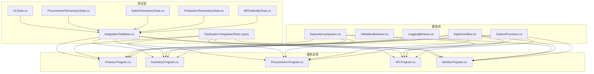
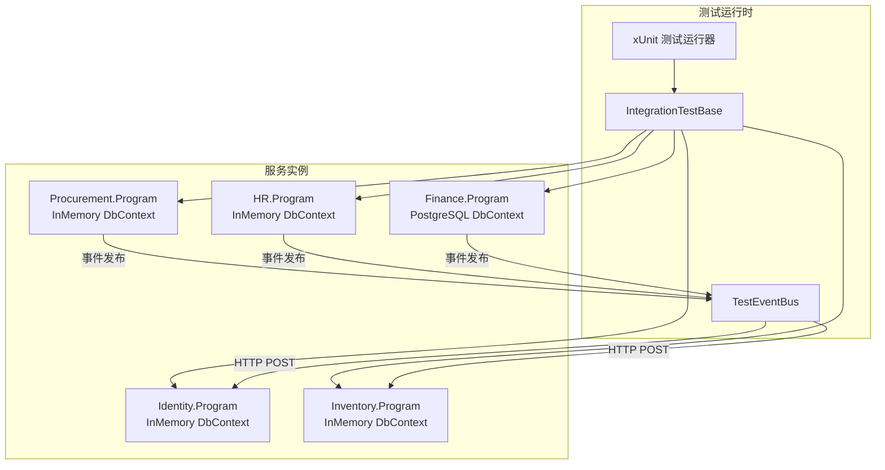
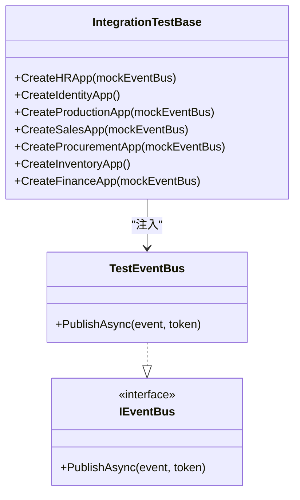
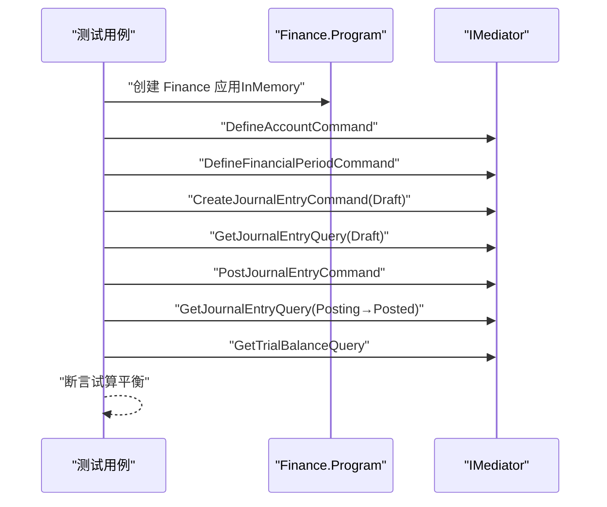
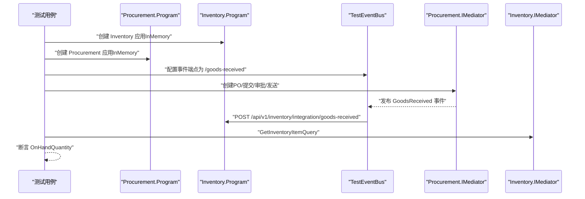
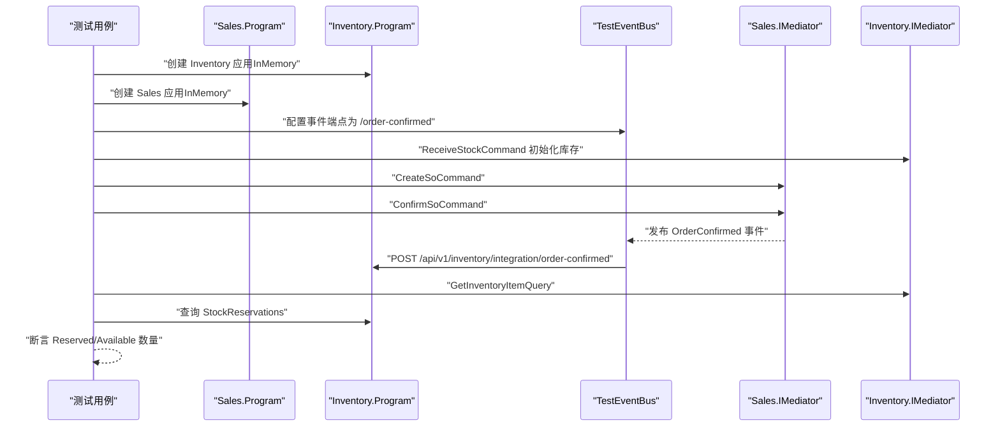
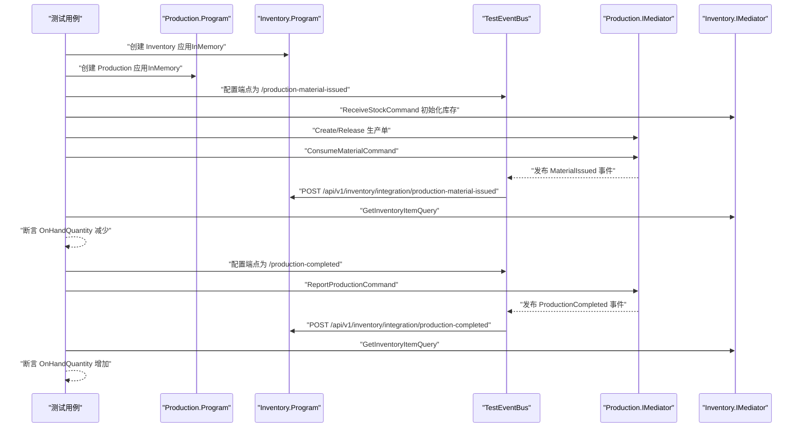
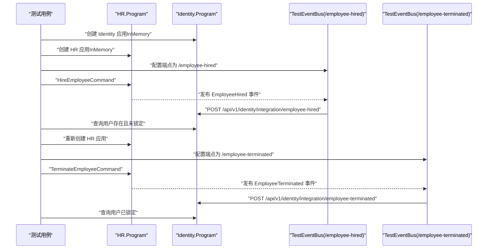
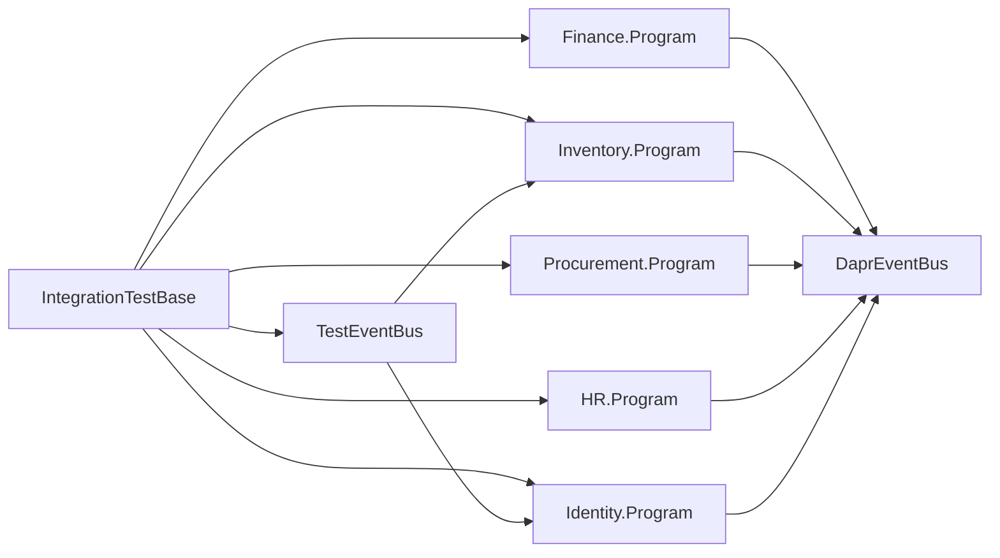

# 测试自动化

<cite>
**本文引用的文件**
- [IntegrationTestBase.cs](file://src/Tests/ErpSystem.IntegrationTests/IntegrationTestBase.cs)
- [GLTests.cs](file://src/Tests/ErpSystem.IntegrationTests/GLTests.cs)
- [ProcurementToInventoryTests.cs](file://src/Tests/ErpSystem.IntegrationTests/ProcurementToInventoryTests.cs)
- [SalesToInventoryTests.cs](file://src/Tests/ErpSystem.IntegrationTests/SalesToInventoryTests.cs)
- [ProductionToInventoryTests.cs](file://src/Tests/ErpSystem.IntegrationTests/ProductionToInventoryTests.cs)
- [HRToIdentityTests.cs](file://src/Tests/ErpSystem.IntegrationTests/HRToIdentityTests.cs)
- [ErpSystem.IntegrationTests.csproj](file://src/Tests/ErpSystem.IntegrationTests/ErpSystem.IntegrationTests.csproj)
- [DependencyInjection.cs](file://src/BuildingBlocks/ErpSystem.BuildingBlocks/DependencyInjection.cs)
- [ValidationBehavior.cs](file://src/BuildingBlocks/ErpSystem.BuildingBlocks/Behaviors/ValidationBehavior.cs)
- [LoggingBehavior.cs](file://src/BuildingBlocks/ErpSystem.BuildingBlocks/Behaviors/LoggingBehavior.cs)
- [DaprEventBus.cs](file://src/BuildingBlocks/ErpSystem.BuildingBlocks/EventBus/DaprEventBus.cs)
- [OutboxProcessor.cs](file://src/BuildingBlocks/ErpSystem.BuildingBlocks/Outbox/OutboxProcessor.cs)
- [Program.cs（财务）](file://src/Services/Finance/ErpSystem.Finance/Program.cs)
- [Program.cs（库存）](file://src/Services/Inventory/ErpSystem.Inventory/Program.cs)
- [Program.cs（采购）](file://src/Services/Procurement/ErpSystem.Procurement/Program.cs)
- [Program.cs（HR）](file://src/Services/HR/ErpSystem.HR/Program.cs)
- [Program.cs（身份）](file://src/Services/Identity/ErpSystem.Identity/Program.cs)
- [init.sql](file://infrastructure/init.sql)
</cite>

## 目录
1. [引言](#引言)
2. [项目结构](#项目结构)
3. [核心组件](#核心组件)
4. [架构总览](#架构总览)
5. [详细组件分析](#详细组件分析)
6. [依赖关系分析](#依赖关系分析)
7. [性能与并发测试](#性能与并发测试)
8. [故障排查指南](#故障排查指南)
9. [结论](#结论)
10. [附录](#附录)

## 引言
本文件面向QA与开发团队，系统化阐述该ERP微服务项目的测试自动化体系，覆盖集成测试框架、测试用例设计与测试数据管理；详述测试环境搭建、数据库初始化与测试服务配置；记录测试执行流程、结果分析与失败排查方法；提供单元测试编写、模拟对象使用与断言策略建议；解释性能测试、负载测试与压力测试的实施要点；包含测试覆盖率统计、代码质量检查与持续测试反馈机制，并给出面向微服务场景的测试策略与最佳实践。

## 项目结构
测试相关的核心目录与文件如下：
- 集成测试工程：src/Tests/ErpSystem.IntegrationTests
  - 基类与工具：IntegrationTestBase.cs、ErpSystem.IntegrationTests.csproj
  - 典型测试用例：GLTests.cs、ProcurementToInventoryTests.cs、SalesToInventoryTests.cs、ProductionToInventoryTests.cs、HRToIdentityTests.cs
- 建造块（BuildingBlocks）
  - 依赖注入与通用行为：DependencyInjection.cs、Behaviors/*（ValidationBehavior.cs、LoggingBehavior.cs）、EventBus/*（DaprEventBus.cs）、Outbox/*（OutboxProcessor.cs）
- 各微服务应用入口
  - 财务、库存、采购、HR、身份等服务的 Program.cs
- 数据库初始化脚本
  - infrastructure/init.sql

图表来源
- [IntegrationTestBase.cs](file://src/Tests/ErpSystem.IntegrationTests/IntegrationTestBase.cs#L1-L187)
- [ErpSystem.IntegrationTests.csproj](file://src/Tests/ErpSystem.IntegrationTests/ErpSystem.IntegrationTests.csproj#L1-L44)
- [DependencyInjection.cs](file://src/BuildingBlocks/ErpSystem.BuildingBlocks/DependencyInjection.cs#L1-L31)
- [DaprEventBus.cs](file://src/BuildingBlocks/ErpSystem.BuildingBlocks/EventBus/DaprEventBus.cs#L1-L31)
- [OutboxProcessor.cs](file://src/BuildingBlocks/ErpSystem.BuildingBlocks/Outbox/OutboxProcessor.cs#L1-L72)
- [Program.cs（财务）](file://src/Services/Finance/ErpSystem.Finance/Program.cs#L1-L86)
- [Program.cs（库存）](file://src/Services/Inventory/ErpSystem.Inventory/Program.cs#L1-L74)
- [Program.cs（采购）](file://src/Services/Procurement/ErpSystem.Procurement/Program.cs#L1-L72)
- [Program.cs（HR）](file://src/Services/HR/ErpSystem.HR/Program.cs#L1-L72)
- [Program.cs（身份）](file://src/Services/Identity/ErpSystem.Identity/Program.cs#L1-L71)

章节来源
- [ErpSystem.IntegrationTests.csproj](file://src/Tests/ErpSystem.IntegrationTests/ErpSystem.IntegrationTests.csproj#L1-L44)

## 核心组件
- 集成测试基类与测试事件总线
  - IntegrationTestBase 提供按服务隔离的 WebApplicationFactory 工厂方法，统一设置 Testing 环境、替换 DbContext 为 InMemory、注入 Mock 的 DaprClient，并以 IEventBus 的方式注入可控制的事件发布器。
  - TestEventBus 将事件通过 HttpClient 直接 POST 到目标服务的指定集成端点，用于跨服务验证事件驱动的数据一致性。
- 测试用例组织
  - 按业务流分组：GLTests（总账）、ProcurementToInventoryTests（采购到库存）、SalesToInventoryTests（销售到库存）、ProductionToInventoryTests（生产到库存）、HRToIdentityTests（HR到身份）。
  - 使用 MediatR 发送命令/查询，断言读模型或仓储状态，部分用例在事件后等待短暂延迟以确保投影完成。
- 建造块与测试支撑
  - 依赖注入注册：统一注册验证器、日志与管道行为，保证测试中行为一致。
  - 事件总线：DaprEventBus 生产事件；DummyEventBus 用于非测试环境占位；OutboxProcessor 在后台批量处理出站消息，保障最终一致性。
- 服务应用入口
  - 各服务 Program.cs 中注册 DbContext、MediatR、事件存储与 EventBus，开发/演示环境自动迁移数据库；测试环境跳过自动迁移，由基类注入 InMemory 数据库。

章节来源
- [IntegrationTestBase.cs](file://src/Tests/ErpSystem.IntegrationTests/IntegrationTestBase.cs#L1-L187)
- [GLTests.cs](file://src/Tests/ErpSystem.IntegrationTests/GLTests.cs#L1-L89)
- [ProcurementToInventoryTests.cs](file://src/Tests/ErpSystem.IntegrationTests/ProcurementToInventoryTests.cs#L1-L80)
- [SalesToInventoryTests.cs](file://src/Tests/ErpSystem.IntegrationTests/SalesToInventoryTests.cs#L1-L87)
- [ProductionToInventoryTests.cs](file://src/Tests/ErpSystem.IntegrationTests/ProductionToInventoryTests.cs#L1-L126)
- [HRToIdentityTests.cs](file://src/Tests/ErpSystem.IntegrationTests/HRToIdentityTests.cs#L1-L97)
- [DependencyInjection.cs](file://src/BuildingBlocks/ErpSystem.BuildingBlocks/DependencyInjection.cs#L1-L31)
- [DaprEventBus.cs](file://src/BuildingBlocks/ErpSystem.BuildingBlocks/EventBus/DaprEventBus.cs#L1-L31)
- [OutboxProcessor.cs](file://src/BuildingBlocks/ErpSystem.BuildingBlocks/Outbox/OutboxProcessor.cs#L1-L72)
- [Program.cs（财务）](file://src/Services/Finance/ErpSystem.Finance/Program.cs#L1-L86)
- [Program.cs（库存）](file://src/Services/Inventory/ErpSystem.Inventory/Program.cs#L1-L74)
- [Program.cs（采购）](file://src/Services/Procurement/ErpSystem.Procurement/Program.cs#L1-L72)
- [Program.cs（HR）](file://src/Services/HR/ErpSystem.HR/Program.cs#L1-L72)
- [Program.cs（身份）](file://src/Services/Identity/ErpSystem.Identity/Program.cs#L1-L71)

## 架构总览
下图展示集成测试如何通过基类工厂启动各服务，利用 TestEventBus 触发事件，验证读模型与仓储状态的一致性。

图表来源
- [IntegrationTestBase.cs](file://src/Tests/ErpSystem.IntegrationTests/IntegrationTestBase.cs#L19-L176)
- [DaprEventBus.cs](file://src/BuildingBlocks/ErpSystem.BuildingBlocks/EventBus/DaprEventBus.cs#L11-L21)
- [Program.cs（财务）](file://src/Services/Finance/ErpSystem.Finance/Program.cs#L20-L46)
- [Program.cs（库存）](file://src/Services/Inventory/ErpSystem.Inventory/Program.cs#L16-L35)
- [Program.cs（采购）](file://src/Services/Procurement/ErpSystem.Procurement/Program.cs#L15-L39)
- [Program.cs（HR）](file://src/Services/HR/ErpSystem.HR/Program.cs#L15-L39)
- [Program.cs（身份）](file://src/Services/Identity/ErpSystem.Identity/Program.cs#L20-L37)

## 详细组件分析

### 集成测试基类与事件总线
- 目标
  - 为每个服务提供独立的 WebApplicationFactory 实例，隔离数据库与事件总线，便于跨服务事件驱动验证。
- 关键实现
  - 环境切换：UseEnvironment("Testing")，避免自动迁移与健康检查。
  - DbContext 替换：移除原数据库连接，注入 InMemory 数据库，确保测试可重复与快速。
  - Mock 依赖：注入 Mock 的 DaprClient 与自定义 IEventBus（TestEventBus），将事件直接路由到目标服务端点。
- 设计权衡
  - TestEventBus 采用同步 HTTP POST，简化测试；在真实环境中使用 DaprEventBus 通过 PubSub 发布。

图表来源
- [IntegrationTestBase.cs](file://src/Tests/ErpSystem.IntegrationTests/IntegrationTestBase.cs#L19-L176)
- [DaprEventBus.cs](file://src/BuildingBlocks/ErpSystem.BuildingBlocks/EventBus/DaprEventBus.cs#L6-L9)

章节来源
- [IntegrationTestBase.cs](file://src/Tests/ErpSystem.IntegrationTests/IntegrationTestBase.cs#L1-L187)
- [DaprEventBus.cs](file://src/BuildingBlocks/ErpSystem.BuildingBlocks/EventBus/DaprEventBus.cs#L1-L31)

### 总账集成测试（GLTests）
- 流程概览
  - 定义账户 → 定义并打开会计期间 → 创建日记账分录（草稿）→ 过账 → 等待投影 → 查询试算平衡表 → 断言借贷平衡。
- 关键点
  - 使用 MediatR 发送命令/查询，断言读模型字段值。
  - 通过短暂延时等待投影完成，确保读模型一致性。
- 失败排查
  - 若断言失败，检查账户类型、余额方向与日记账行是否匹配；确认会计期间状态与过账流程。

图表来源
- [GLTests.cs](file://src/Tests/ErpSystem.IntegrationTests/GLTests.cs#L11-L77)
- [IntegrationTestBase.cs](file://src/Tests/ErpSystem.IntegrationTests/IntegrationTestBase.cs#L155-L176)

章节来源
- [GLTests.cs](file://src/Tests/ErpSystem.IntegrationTests/GLTests.cs#L1-L89)

### 采购到库存集成测试（ProcurementToInventoryTests）
- 流程概览
  - 启动 Inventory 与 Procurement 应用 → 通过 TestEventBus 将“收货”事件路由至 Inventory → 断言库存数量更新。
- 关键点
  - 事件路由端点：/api/v1/inventory/integration/goods-received。
  - 通过 MediatR 控制 PO 生命周期（提交、审批、发送、收货）。
- 失败排查
  - 若库存未更新，检查事件主题名、端点路径与事件处理器是否正确订阅。

图表来源
- [ProcurementToInventoryTests.cs](file://src/Tests/ErpSystem.IntegrationTests/ProcurementToInventoryTests.cs#L13-L78)
- [IntegrationTestBase.cs](file://src/Tests/ErpSystem.IntegrationTests/IntegrationTestBase.cs#L109-L133)

章节来源
- [ProcurementToInventoryTests.cs](file://src/Tests/ErpSystem.IntegrationTests/ProcurementToInventoryTests.cs#L1-L80)

### 销售到库存集成测试（SalesToInventoryTests）
- 流程概览
  - 初始化库存 → 创建销售订单 → 确认订单触发预留 → 断言预留数量与可用量。
- 关键点
  - 事件路由端点：/api/v1/inventory/integration/order-confirmed。
  - 直接查询仓储中的预留记录，增强断言覆盖度。
- 失败排查
  - 若预留不生效，检查确认流程与事件处理器；核对仓库与货位参数。

图表来源
- [SalesToInventoryTests.cs](file://src/Tests/ErpSystem.IntegrationTests/SalesToInventoryTests.cs#L14-L86)
- [IntegrationTestBase.cs](file://src/Tests/ErpSystem.IntegrationTests/IntegrationTestBase.cs#L86-L107)

章节来源
- [SalesToInventoryTests.cs](file://src/Tests/ErpSystem.IntegrationTests/SalesToInventoryTests.cs#L1-L87)

### 生产到库存集成测试（ProductionToInventoryTests）
- 流程概览
  - 物料发出：创建并释放生产单 → 消耗物料 → 断言原材料库存减少。
  - 成品入库：报告生产 → 断言成品库存增加。
- 关键点
  - 两个用例分别验证“物料发出”和“生产完成”两条链路。
  - 事件端点分别为“production-material-issued”和“production-completed”。

图表来源
- [ProductionToInventoryTests.cs](file://src/Tests/ErpSystem.IntegrationTests/ProductionToInventoryTests.cs#L12-L125)
- [IntegrationTestBase.cs](file://src/Tests/ErpSystem.IntegrationTests/IntegrationTestBase.cs#L63-L84)

章节来源
- [ProductionToInventoryTests.cs](file://src/Tests/ErpSystem.IntegrationTests/ProductionToInventoryTests.cs#L1-L126)

### HR到身份集成测试（HRToIdentityTests）
- 流程概览
  - 启动 Identity 应用 → 启动 HR 应用并发布“员工入职”事件 → 断言用户创建且未锁定 → 重新配置事件总线 → 发布“员工离职”事件 → 断言用户被锁定。
- 关键点
  - TestEventBus 当前仅支持单一端点，因此需重新创建应用以切换事件端点。
- 失败排查
  - 若用户不存在或状态不符，检查事件处理器、用户标识映射与延迟时间。

图表来源
- [HRToIdentityTests.cs](file://src/Tests/ErpSystem.IntegrationTests/HRToIdentityTests.cs#L13-L96)
- [IntegrationTestBase.cs](file://src/Tests/ErpSystem.IntegrationTests/IntegrationTestBase.cs#L21-L61)

章节来源
- [HRToIdentityTests.cs](file://src/Tests/ErpSystem.IntegrationTests/HRToIdentityTests.cs#L1-L97)

### 测试数据管理与初始化
- 数据库初始化
  - 通过 init.sql 创建各微服务数据库；服务 Program.cs 在非测试环境自动迁移数据库。
- 测试环境隔离
  - IntegrationTestBase 将所有 DbContext 注册为 InMemory，避免真实数据库耦合。
- 读模型与仓储断言
  - 部分测试直接查询仓储实体（如库存预留），提升断言粒度与稳定性。

章节来源
- [init.sql](file://infrastructure/init.sql#L1-L9)
- [Program.cs（财务）](file://src/Services/Finance/ErpSystem.Finance/Program.cs#L63-L71)
- [Program.cs（库存）](file://src/Services/Inventory/ErpSystem.Inventory/Program.cs#L52-L60)
- [Program.cs（采购）](file://src/Services/Procurement/ErpSystem.Procurement/Program.cs#L50-L58)
- [Program.cs（HR）](file://src/Services/HR/ErpSystem.HR/Program.cs#L50-L58)
- [Program.cs（身份）](file://src/Services/Identity/ErpSystem.Identity/Program.cs#L58-L66)
- [IntegrationTestBase.cs](file://src/Tests/ErpSystem.IntegrationTests/IntegrationTestBase.cs#L29-L56)

### 单元测试与模拟对象
- 模拟对象
  - 使用 Moq.Mock<DaprClient>() 注入测试容器，避免真实 Dapr 依赖。
  - 使用 InMemory DbContext 替代真实数据库，加速测试。
- 断言策略
  - 使用 FluentAssertions（在 csproj 中引用）进行更丰富的断言表达。
  - 对于异步事件驱动流程，使用短暂 Task.Delay 确保投影完成后再断言。
- 行为与管道
  - 通过建造块中的 ValidationBehavior 与 LoggingBehavior 保持测试中行为一致性。

章节来源
- [ErpSystem.IntegrationTests.csproj](file://src/Tests/ErpSystem.IntegrationTests/ErpSystem.IntegrationTests.csproj#L10-L21)
- [DependencyInjection.cs](file://src/BuildingBlocks/ErpSystem.BuildingBlocks/DependencyInjection.cs#L12-L29)
- [ValidationBehavior.cs](file://src/BuildingBlocks/ErpSystem.BuildingBlocks/Behaviors/ValidationBehavior.cs#L7-L34)
- [LoggingBehavior.cs](file://src/BuildingBlocks/ErpSystem.BuildingBlocks/Behaviors/LoggingBehavior.cs#L6-L22)
- [IntegrationTestBase.cs](file://src/Tests/ErpSystem.IntegrationTests/IntegrationTestBase.cs#L35-L59)

### 测试执行流程与结果分析
- 执行流程
  - 基类工厂创建服务实例 → 注入测试依赖 → 发送命令/查询 → 触发事件 → 等待投影 → 断言结果。
- 结果分析
  - 使用 xUnit 断言与 FluentAssertions；对异常信息进行日志输出以便定位。
- 失败排查
  - 检查事件端点路径、事件处理器注册、仓储查询条件与延迟时间。

章节来源
- [GLTests.cs](file://src/Tests/ErpSystem.IntegrationTests/GLTests.cs#L11-L87)
- [ProcurementToInventoryTests.cs](file://src/Tests/ErpSystem.IntegrationTests/ProcurementToInventoryTests.cs#L13-L78)
- [SalesToInventoryTests.cs](file://src/Tests/ErpSystem.IntegrationTests/SalesToInventoryTests.cs#L14-L86)
- [ProductionToInventoryTests.cs](file://src/Tests/ErpSystem.IntegrationTests/ProductionToInventoryTests.cs#L12-L125)
- [HRToIdentityTests.cs](file://src/Tests/ErpSystem.IntegrationTests/HRToIdentityTests.cs#L13-L96)

## 依赖关系分析
- 组件耦合
  - 测试用例依赖 IntegrationTestBase 与各服务 Program.cs 的 MediatR 注册。
  - TestEventBus 依赖目标服务的集成端点路径。
- 外部依赖
  - Dapr PubSub 用于生产环境事件发布；测试中以 HTTP 直连替代。
  - Entity Framework Core InMemory 用于测试数据库隔离。
- 循环依赖
  - 通过接口 IEventBus 解耦事件发布与订阅，避免循环依赖。

图表来源
- [IntegrationTestBase.cs](file://src/Tests/ErpSystem.IntegrationTests/IntegrationTestBase.cs#L19-L176)
- [DaprEventBus.cs](file://src/BuildingBlocks/ErpSystem.BuildingBlocks/EventBus/DaprEventBus.cs#L11-L21)
- [Program.cs（财务）](file://src/Services/Finance/ErpSystem.Finance/Program.cs#L26-L46)
- [Program.cs（库存）](file://src/Services/Inventory/ErpSystem.Inventory/Program.cs#L27-L35)
- [Program.cs（采购）](file://src/Services/Procurement/ErpSystem.Procurement/Program.cs#L25-L39)
- [Program.cs（HR）](file://src/Services/HR/ErpSystem.HR/Program.cs#L24-L39)
- [Program.cs（身份）](file://src/Services/Identity/ErpSystem.Identity/Program.cs#L29-L37)

章节来源
- [IntegrationTestBase.cs](file://src/Tests/ErpSystem.IntegrationTests/IntegrationTestBase.cs#L1-L187)
- [DaprEventBus.cs](file://src/BuildingBlocks/ErpSystem.BuildingBlocks/EventBus/DaprEventBus.cs#L1-L31)

## 性能与并发测试
- 性能测试
  - 使用基准测试框架（如 BenchmarkDotNet）对关键领域操作（如 JournalEntry 过账、库存预留/扣减）进行微基准测试，关注吞吐量与延迟分布。
- 负载测试
  - 通过压测工具（如 k6/JMeter）对服务端点施加并发请求，观察响应时间、错误率与资源占用；结合 OutboxProcessor 的批处理能力评估最终一致性延迟。
- 压力测试
  - 逐步提升并发与数据规模，定位瓶颈（数据库锁、事件处理队列、内存与GC）；在测试环境使用 InMemory DbContext 降低外部依赖影响。
- 并发一致性
  - 事件驱动架构下，通过 OutboxProcessor 的批处理与幂等处理（如 IdempotencyBehavior）保障高并发下的数据一致性。

章节来源
- [OutboxProcessor.cs](file://src/BuildingBlocks/ErpSystem.BuildingBlocks/Outbox/OutboxProcessor.cs#L8-L72)

## 故障排查指南
- 事件未到达
  - 检查 TestEventBus 端点路径与目标服务控制器路由；确认事件处理器已注册。
- 投影未更新
  - 增加等待时间或引入轮询查询；检查事件处理器是否抛出异常。
- 数据库连接问题
  - 测试环境应使用 InMemory DbContext；非测试环境检查连接字符串与迁移脚本。
- 断言失败
  - 输出异常信息与堆栈；核对命令参数、状态机转换与读模型字段映射。

章节来源
- [IntegrationTestBase.cs](file://src/Tests/ErpSystem.IntegrationTests/IntegrationTestBase.cs#L29-L56)
- [GLTests.cs](file://src/Tests/ErpSystem.IntegrationTests/GLTests.cs#L56-L76)
- [ProcurementToInventoryTests.cs](file://src/Tests/ErpSystem.IntegrationTests/ProcurementToInventoryTests.cs#L57-L64)
- [SalesToInventoryTests.cs](file://src/Tests/ErpSystem.IntegrationTests/SalesToInventoryTests.cs#L57-L71)
- [ProductionToInventoryTests.cs](file://src/Tests/ErpSystem.IntegrationTests/ProductionToInventoryTests.cs#L52-L57)
- [HRToIdentityTests.cs](file://src/Tests/ErpSystem.IntegrationTests/HRToIdentityTests.cs#L73-L82)

## 结论
该测试自动化体系以 IntegrationTestBase 为核心，通过 InMemory DbContext 与 TestEventBus 实现跨服务事件驱动验证，覆盖财务、库存、采购、销售与生产等关键业务流。配合建造块中的通用行为与事件总线，测试具备良好的可维护性与扩展性。建议后续补充性能与压力测试、完善断言策略与覆盖率统计，并在CI中集成测试与质量门禁。

## 附录
- 测试环境搭建清单
  - 安装 .NET SDK、SQL Server 或 PostgreSQL（用于非测试环境）、Docker（可选）。
  - 初始化数据库：执行 init.sql 创建各微服务数据库。
  - 在测试工程中安装必要包：xUnit、FluentAssertions、Moq、EntityFrameworkCore.InMemory、MediatR、Dapr.AspNetCore。
- 测试执行建议
  - 使用 dotnet test 运行测试套件；在 CI 中启用 coverlet.collector 生成覆盖率报告。
  - 对关键路径添加基准测试与负载测试脚本，定期回归。