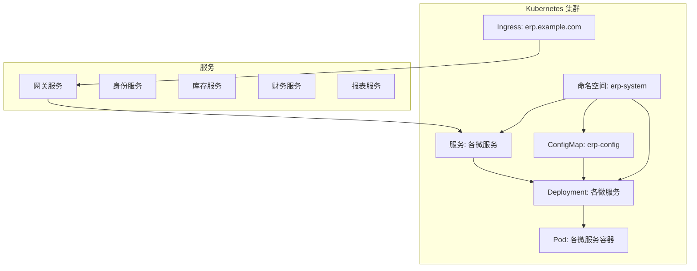
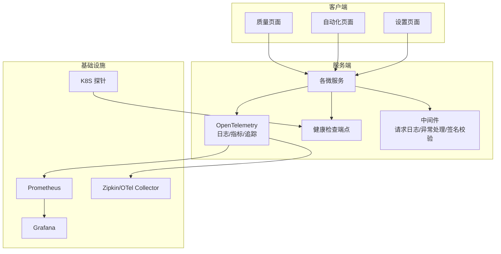
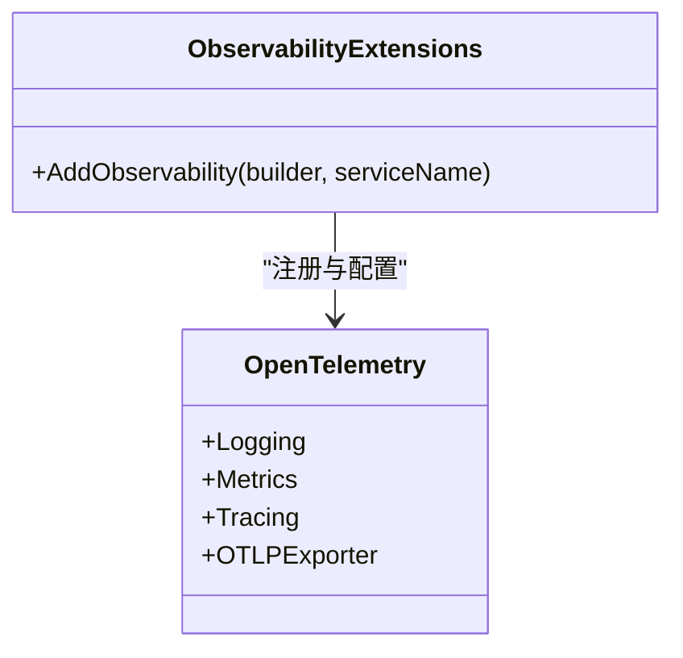
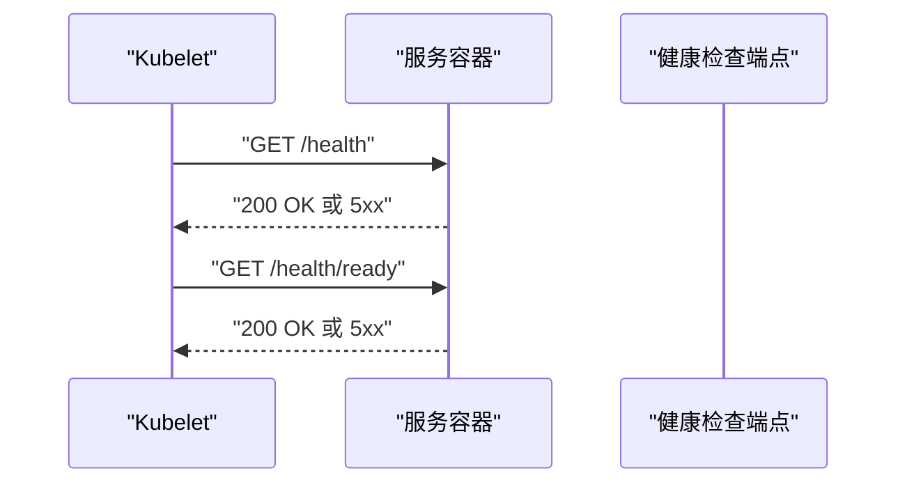
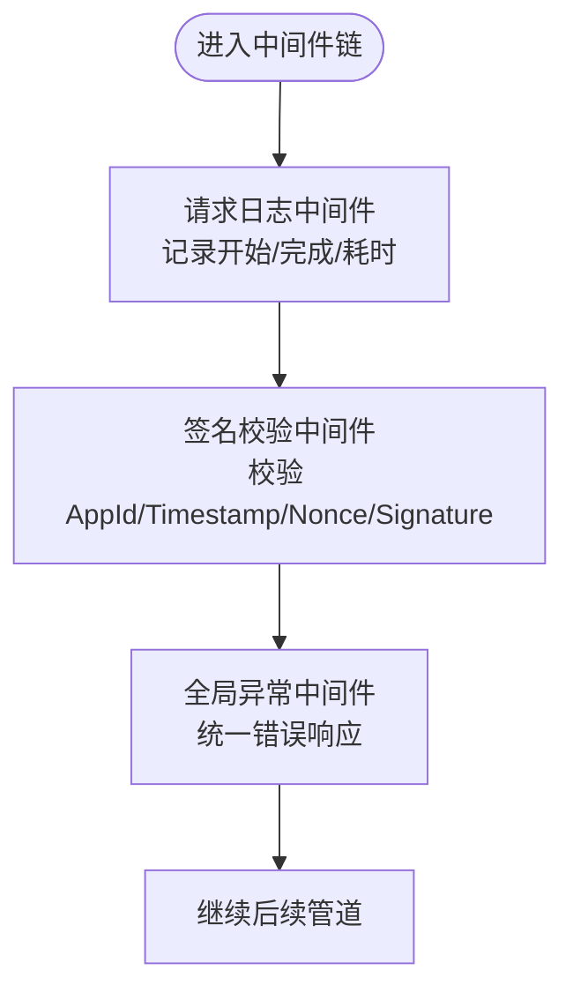
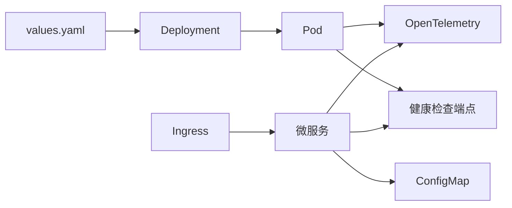

# 监控告警

<cite>
**本文引用的文件**
- [ObservabilityExtensions.cs](file://src/BuildingBlocks/ErpSystem.BuildingBlocks/Observability/ObservabilityExtensions.cs)
- [deployment.yaml](file://deploy/helm/erp-system/templates/deployment.yaml)
- [values.yaml](file://deploy/helm/erp-system/values.yaml)
- [configmap.yaml](file://deploy/helm/erp-system/templates/configmap.yaml)
- [ingress.yaml](file://deploy/helm/erp-system/templates/ingress.yaml)
- [Program.cs（Gateway）](file://src/Gateways/ErpSystem.Gateway/Program.cs)
- [Program.cs（Identity）](file://src/Services/Identity/ErpSystem.Identity/Program.cs)
- [Program.cs（Reporting）](file://src/Services/Reporting/ErpSystem.Reporting/Program.cs)
- [Middlewares.cs](file://src/BuildingBlocks/ErpSystem.BuildingBlocks/Middleware/Middlewares.cs)
- [SignatureVerificationMiddleware.cs](file://src/BuildingBlocks/ErpSystem.BuildingBlocks/Auth/SignatureVerificationMiddleware.cs)
- [deployment.md](file://docs/deployment.md)
- [QualityAlertAggregate.cs](file://src/Services/Quality/ErpSystem.Quality/Domain/QualityAlertAggregate.cs)
- [QualityWorkflowTests.cs](file://src/Tests/ErpSystem.IntegrationTests/Quality/QualityWorkflowTests.cs)
- [Quality.tsx](file://src/Web/ErpSystem.Web/src/pages/Quality.tsx)
- [Automation.tsx](file://src/Web/ErpSystem.Web/src/pages/Automation.tsx)
- [Settings.tsx](file://src/Web/ErpSystem.Web/src/pages/Settings.tsx)
- [prd.md.resolved](file://src/prd.md.resolved)
</cite>

## 目录
1. [简介](#简介)
2. [项目结构](#项目结构)
3. [核心组件](#核心组件)
4. [架构总览](#架构总览)
5. [详细组件分析](#详细组件分析)
6. [依赖关系分析](#依赖关系分析)
7. [性能考量](#性能考量)
8. [故障排查指南](#故障排查指南)
9. [结论](#结论)
10. [附录](#附录)

## 简介
本文件面向运维与开发团队，系统化梳理 ERP 微服务项目的监控与告警体系，覆盖应用监控配置、指标采集与日志管理策略；明确 Prometheus 监控、Grafana 仪表板与告警规则的落地方式；记录分布式追踪配置、Zipkin/OTel 集成与性能监控实践；提供健康检查端点、存活探针与就绪探针配置；解释错误率、延迟与资源使用监控方法；并给出告警通知配置、阈值设定与故障自动恢复建议，帮助构建稳定可靠的生产级可观测性体系。

## 项目结构
本项目采用多服务微架构，通过 Helm Chart 统一编排部署，各服务均暴露健康检查端点，并在 Helm 模板中统一配置存活与就绪探针。OpenTelemetry 扩展在构建块中集中注入，为日志、指标与追踪提供基础能力。

图表来源
- [deployment.yaml](file://deploy/helm/erp-system/templates/deployment.yaml#L1-L58)
- [ingress.yaml](file://deploy/helm/erp-system/templates/ingress.yaml#L1-L47)
- [values.yaml](file://deploy/helm/erp-system/values.yaml#L1-L127)
- [configmap.yaml](file://deploy/helm/erp-system/templates/configmap.yaml#L1-L20)

章节来源
- [deployment.md](file://docs/deployment.md#L103-L115)
- [deployment.yaml](file://deploy/helm/erp-system/templates/deployment.yaml#L44-L55)
- [values.yaml](file://deploy/helm/erp-system/values.yaml#L1-L127)

## 核心组件
- 观测性扩展（OpenTelemetry）
  - 日志：启用 OpenTelemetry 日志记录，包含格式化消息与作用域。
  - 指标：ASP.NET Core、HttpClient、运行时指标。
  - 追踪：ASP.NET Core、HttpClient、服务源代码追踪，并导出到 OTLP（如 Jaeger/Aspire/Seq/Elastic）。
- 健康检查端点
  - 网关服务：/health
  - 报表服务：/health、/health/ready
  - 身份服务：/health
- 探针配置
  - 存活探针：/health
  - 就绪探针：/health/ready
- 中间件与安全
  - 请求日志中间件：记录请求开始/完成、状态码与耗时。
  - 全局异常中间件：统一错误响应。
  - 签名校验中间件：基于 AppId/Timestamp/Nonce/Signature 的 HMAC-SHA256 校验。
- 前端监控与通知
  - 质量模块页面展示“开放告警数”、“平均检查时间”等指标。
  - 自动化规则页面展示触发器与执行状态。
  - 设置页面支持通知偏好开关。

章节来源
- [ObservabilityExtensions.cs](file://src/BuildingBlocks/ErpSystem.BuildingBlocks/Observability/ObservabilityExtensions.cs#L12-L42)
- [Program.cs（Gateway）](file://src/Gateways/ErpSystem.Gateway/Program.cs#L80-L80)
- [Program.cs（Reporting）](file://src/Services/Reporting/ErpSystem.Reporting/Program.cs#L29-L30)
- [Program.cs（Identity）](file://src/Services/Identity/ErpSystem.Identity/Program.cs#L55-L55)
- [deployment.yaml](file://deploy/helm/erp-system/templates/deployment.yaml#L44-L55)
- [Middlewares.cs](file://src/BuildingBlocks/ErpSystem.BuildingBlocks/Middleware/Middlewares.cs#L10-L49)
- [SignatureVerificationMiddleware.cs](file://src/BuildingBlocks/ErpSystem.BuildingBlocks/Auth/SignatureVerificationMiddleware.cs#L14-L76)
- [Quality.tsx](file://src/Web/ErpSystem.Web/src/pages/Quality.tsx#L43-L64)
- [Automation.tsx](file://src/Web/ErpSystem.Web/src/pages/Automation.tsx#L61-L75)
- [Settings.tsx](file://src/Web/ErpSystem.Web/src/pages/Settings.tsx#L266-L294)

## 架构总览
下图展示了服务端到客户端的监控链路：服务通过 OpenTelemetry 输出指标与追踪，日志由 OpenTelemetry 收集；探针保障健康状态；前端页面消费实时数据并展示告警与自动化规则状态。

图表来源
- [ObservabilityExtensions.cs](file://src/BuildingBlocks/ErpSystem.BuildingBlocks/Observability/ObservabilityExtensions.cs#L14-L39)
- [Program.cs（Gateway）](file://src/Gateways/ErpSystem.Gateway/Program.cs#L80-L80)
- [Program.cs（Reporting）](file://src/Services/Reporting/ErpSystem.Reporting/Program.cs#L29-L30)
- [Program.cs（Identity）](file://src/Services/Identity/ErpSystem.Identity/Program.cs#L55-L55)
- [deployment.yaml](file://deploy/helm/erp-system/templates/deployment.yaml#L44-L55)

## 详细组件分析

### 观测性与 OpenTelemetry 配置
- 日志：启用格式化消息与作用域，便于结构化日志采集与检索。
- 指标：包含 ASP.NET Core、HttpClient、运行时指标，覆盖请求量、响应时间、内存/CPU 使用等。
- 追踪：启用 ASP.NET Core、HttpClient、服务源代码追踪，并通过 OTLP 导出，适配 Jaeger/Aspire/Seq/Elastic 等后端。
- 环境变量：OTEL_EXPORTER_OTLP_ENDPOINT 需在部署时配置以启用追踪导出。

图表来源
- [ObservabilityExtensions.cs](file://src/BuildingBlocks/ErpSystem.BuildingBlocks/Observability/ObservabilityExtensions.cs#L12-L42)

章节来源
- [ObservabilityExtensions.cs](file://src/BuildingBlocks/ErpSystem.BuildingBlocks/Observability/ObservabilityExtensions.cs#L12-L42)

### 健康检查与探针
- 健康检查端点
  - 网关服务：/health
  - 报表服务：/health、/health/ready
  - 身份服务：/health
- 探针配置（Helm 模板）
  - 存活探针：/health，初始延时 10 秒，周期 30 秒
  - 就绪探针：/health/ready，初始延时 5 秒，周期 10 秒
- Ingress 将 / 与 /api/dashboard、/api/reports 路由至相应服务，确保监控与前端访问路径一致。

图表来源
- [deployment.yaml](file://deploy/helm/erp-system/templates/deployment.yaml#L44-L55)
- [Program.cs（Gateway）](file://src/Gateways/ErpSystem.Gateway/Program.cs#L80-L80)
- [Program.cs（Reporting）](file://src/Services/Reporting/ErpSystem.Reporting/Program.cs#L29-L30)
- [Program.cs（Identity）](file://src/Services/Identity/ErpSystem.Identity/Program.cs#L55-L55)
- [ingress.yaml](file://deploy/helm/erp-system/templates/ingress.yaml#L21-L45)

章节来源
- [deployment.md](file://docs/deployment.md#L103-L115)
- [deployment.yaml](file://deploy/helm/erp-system/templates/deployment.yaml#L44-L55)
- [ingress.yaml](file://deploy/helm/erp-system/templates/ingress.yaml#L21-L45)

### 日志与中间件
- 请求日志中间件：记录请求开始/完成、状态码与耗时，便于快速定位慢请求与异常。
- 全局异常中间件：对常见异常进行统一响应，避免泄漏内部细节。
- 签名校验中间件：对 API 请求进行 AppId/Timestamp/Nonce/Signature 校验，防止重放与篡改。

图表来源
- [Middlewares.cs](file://src/BuildingBlocks/ErpSystem.BuildingBlocks/Middleware/Middlewares.cs#L10-L49)
- [SignatureVerificationMiddleware.cs](file://src/BuildingBlocks/ErpSystem.BuildingBlocks/Auth/SignatureVerificationMiddleware.cs#L14-L76)

章节来源
- [Middlewares.cs](file://src/BuildingBlocks/ErpSystem.BuildingBlocks/Middleware/Middlewares.cs#L10-L49)
- [SignatureVerificationMiddleware.cs](file://src/BuildingBlocks/ErpSystem.BuildingBlocks/Auth/SignatureVerificationMiddleware.cs#L14-L76)

### 前端监控与通知
- 质量页面：展示“开放告警数”、“平均检查时间”，用于运营侧快速掌握质量态势。
- 自动化页面：展示自动化规则名称、触发器、动作数量、状态与最近运行时间，便于运维核对规则有效性。
- 设置页面：支持开启邮件通知、系统通知与推送通知等偏好，支撑告警通知闭环。

章节来源
- [Quality.tsx](file://src/Web/ErpSystem.Web/src/pages/Quality.tsx#L43-L64)
- [Automation.tsx](file://src/Web/ErpSystem.Web/src/pages/Automation.tsx#L61-L75)
- [Settings.tsx](file://src/Web/ErpSystem.Web/src/pages/Settings.tsx#L266-L294)

### 分布式追踪与性能监控
- 追踪配置：通过 OpenTelemetry 追踪 ASP.NET Core、HttpClient 与服务源代码，导出到 OTLP。
- 性能监控：结合指标（请求耗时、错误率、并发）与追踪（端到端调用链），定位热点与瓶颈。
- 建议：在生产环境设置 OTEL_EXPORTER_OTLP_ENDPOINT 指向 Zipkin/OTel Collector，统一采集与查询。

章节来源
- [ObservabilityExtensions.cs](file://src/BuildingBlocks/ErpSystem.BuildingBlocks/Observability/ObservabilityExtensions.cs#L29-L39)

### 错误率、延迟与资源使用监控
- 错误率：通过健康检查端点与全局异常中间件输出的错误响应统计，结合探针失败次数评估稳定性。
- 延迟：请求日志中间件记录耗时，结合指标中的 HTTP 请求耗时分布（分位数）进行分析。
- 资源使用：运行时指标覆盖 CPU/内存，结合 K8s 节点与 Pod 资源限制进行容量规划。

章节来源
- [Middlewares.cs](file://src/BuildingBlocks/ErpSystem.BuildingBlocks/Middleware/Middlewares.cs#L10-L49)
- [ObservabilityExtensions.cs](file://src/BuildingBlocks/ErpSystem.BuildingBlocks/Observability/ObservabilityExtensions.cs#L23-L28)
- [values.yaml](file://deploy/helm/erp-system/values.yaml#L13-L19)

### 告警规则与通知
- 告警规则建议
  - 错误率：服务 5xx 错误率超过阈值持续一段时间触发。
  - 延迟：HTTP 请求 P95/P99 超过阈值触发。
  - 资源：CPU/内存使用率或重启次数超过阈值触发。
  - 探针：存活/就绪探针连续失败触发。
- 通知配置
  - 在前端设置页面开启邮件/系统/推送通知偏好。
  - 结合业务事件（如质量告警）与自动化规则，形成“发现-处置-反馈”的闭环。

章节来源
- [Settings.tsx](file://src/Web/ErpSystem.Web/src/pages/Settings.tsx#L266-L294)
- [Quality.tsx](file://src/Web/ErpSystem.Web/src/pages/Quality.tsx#L43-L64)
- [QualityWorkflowTests.cs](file://src/Tests/ErpSystem.IntegrationTests/Quality/QualityWorkflowTests.cs#L54-L73)
- [QualityAlertAggregate.cs](file://src/Services/Quality/ErpSystem.Quality/Domain/QualityAlertAggregate.cs#L8-L95)

## 依赖关系分析
- 服务到基础设施
  - 服务通过 OpenTelemetry 输出日志、指标与追踪。
  - 探针依赖健康检查端点。
  - Ingress 将外部流量路由到对应服务。
- 配置与资源
  - ConfigMap 提供环境变量（如数据库连接、Redis 地址）。
  - values.yaml 控制副本数、资源请求/限制与 Dapr 组件选择。

图表来源
- [configmap.yaml](file://deploy/helm/erp-system/templates/configmap.yaml#L8-L19)
- [values.yaml](file://deploy/helm/erp-system/values.yaml#L11-L19)
- [ingress.yaml](file://deploy/helm/erp-system/templates/ingress.yaml#L21-L45)
- [deployment.yaml](file://deploy/helm/erp-system/templates/deployment.yaml#L1-L58)

章节来源
- [configmap.yaml](file://deploy/helm/erp-system/templates/configmap.yaml#L8-L19)
- [values.yaml](file://deploy/helm/erp-system/values.yaml#L11-L19)
- [ingress.yaml](file://deploy/helm/erp-system/templates/ingress.yaml#L21-L45)
- [deployment.yaml](file://deploy/helm/erp-system/templates/deployment.yaml#L1-L58)

## 性能考量
- 指标粒度：建议在关键业务接口增加自定义指标（如领域事件处理耗时、外部依赖调用耗时）。
- 资源配额：根据 values.yaml 中的 requests/limits 合理设置，避免突发流量导致 OOM 或频繁重启。
- 追踪采样：在高流量场景下调低采样率，平衡可观测性与性能。
- 缓存与降级：结合中间件与熔断/限流策略，提升系统韧性。

## 故障排查指南
- 健康检查失败
  - 检查 /health 与 /health/ready 是否可达。
  - 关注探针参数（初始延时、周期）是否合理。
- 日志与异常
  - 查看请求日志中间件输出的耗时与状态码。
  - 全局异常中间件会统一返回错误类型与状态码，便于定位。
- 签名验证失败
  - 确认请求头包含 X-AppId、X-Timestamp、X-Nonce、X-Signature。
  - 校验时间戳窗口与签名算法一致性。
- 前端告警与自动化
  - 质量页面“开放告警数”异常增多时，结合追踪与日志定位根因。
  - 自动化规则状态异常时，检查规则触发器与最近运行时间。

章节来源
- [deployment.yaml](file://deploy/helm/erp-system/templates/deployment.yaml#L44-L55)
- [Middlewares.cs](file://src/BuildingBlocks/ErpSystem.BuildingBlocks/Middleware/Middlewares.cs#L10-L49)
- [SignatureVerificationMiddleware.cs](file://src/BuildingBlocks/ErpSystem.BuildingBlocks/Auth/SignatureVerificationMiddleware.cs#L14-L76)
- [Quality.tsx](file://src/Web/ErpSystem.Web/src/pages/Quality.tsx#L43-L64)
- [Automation.tsx](file://src/Web/ErpSystem.Web/src/pages/Automation.tsx#L61-L75)

## 结论
本项目已具备完善的观测性基础：OpenTelemetry 日志/指标/追踪、统一健康检查端点与探针、中间件链路的可观测性增强。建议在生产环境中完成以下落地：
- 明确 Prometheus/Grafana/Zipkin/OTel Collector 的部署与集成。
- 设定合理的告警阈值与通知策略，结合前端可视化与自动化规则形成闭环。
- 持续优化指标与追踪采样策略，保障性能与成本平衡。

## 附录
- 部署与监控参考
  - 参考部署文档中的健康检查与监控说明，确认服务端点与监控工具对接。
- 产品需求与通知
  - 参考 PRD 中关于实时通知与通知渠道的需求，完善前端通知偏好与后端通知通道。

章节来源
- [deployment.md](file://docs/deployment.md#L103-L115)
- [prd.md.resolved](file://src/prd.md.resolved#L258-L276)