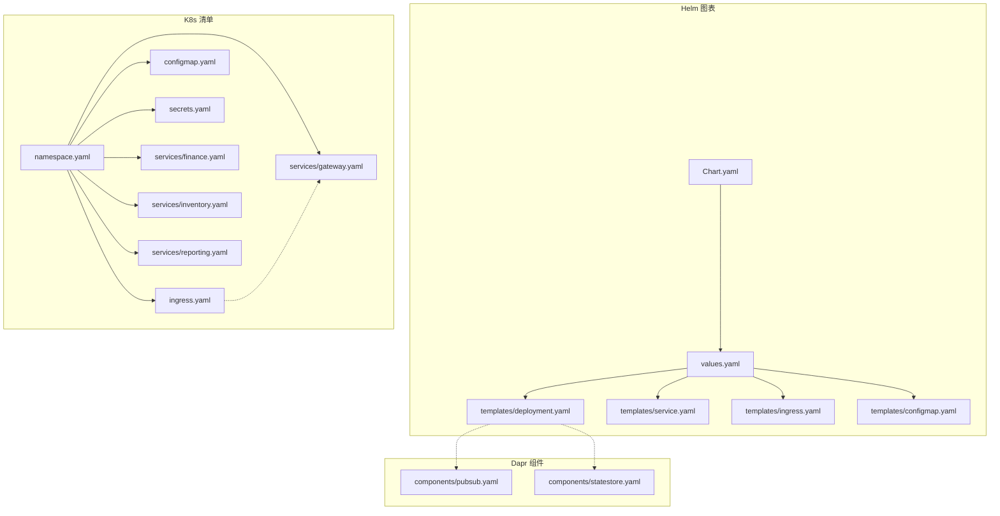
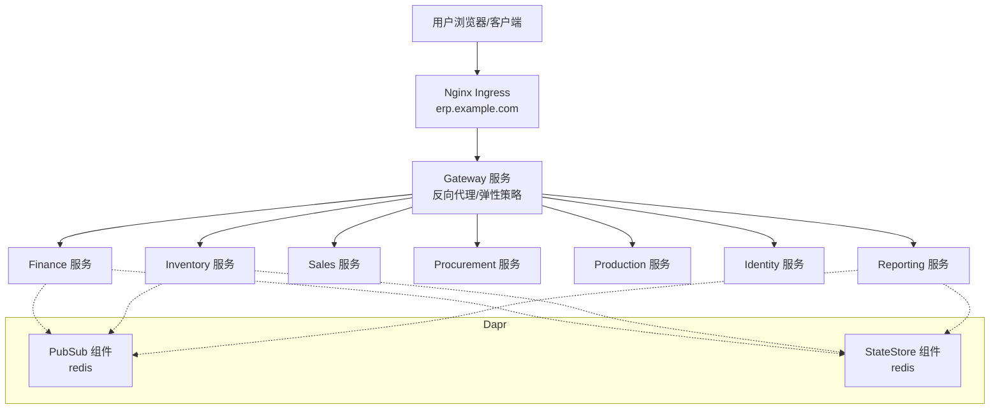
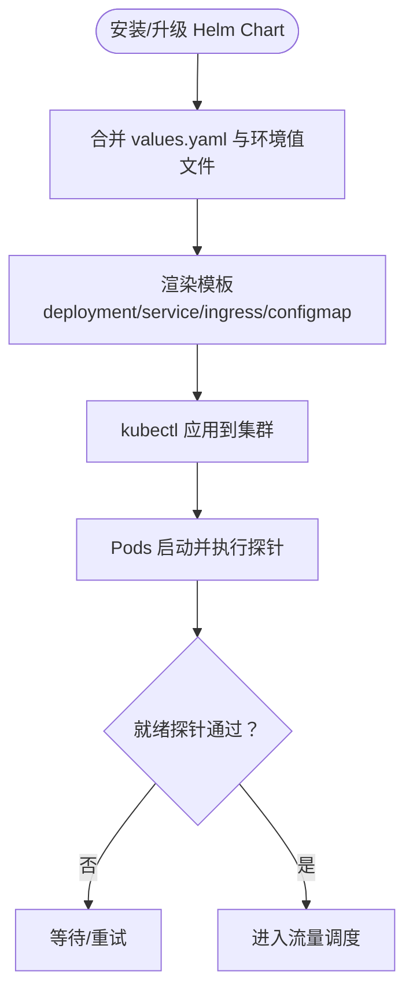
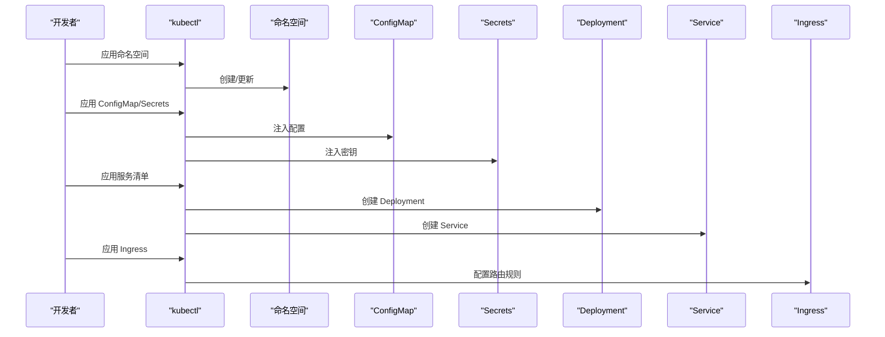
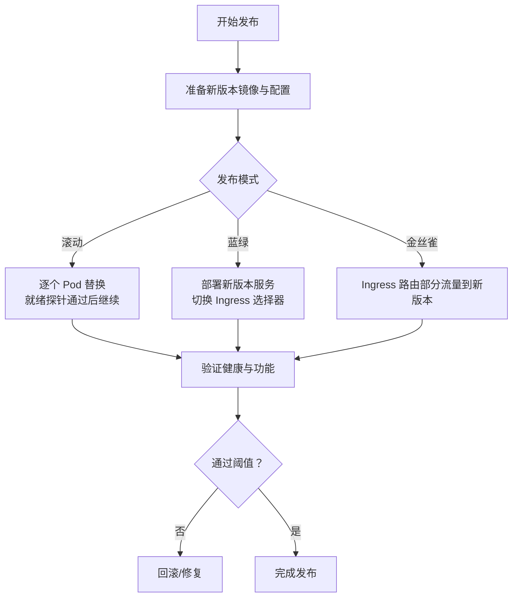
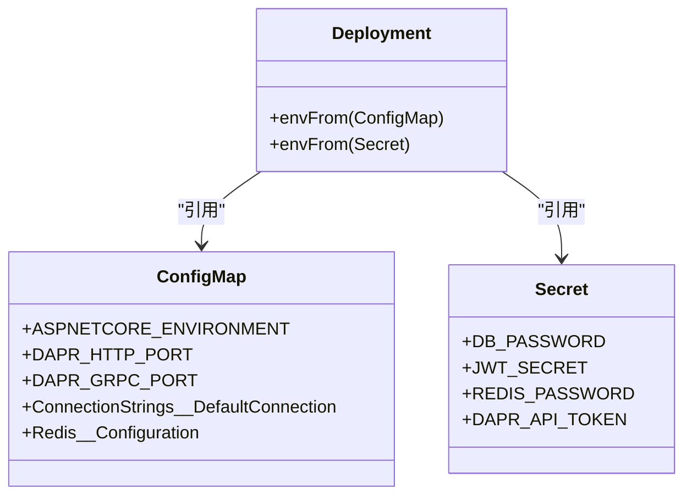
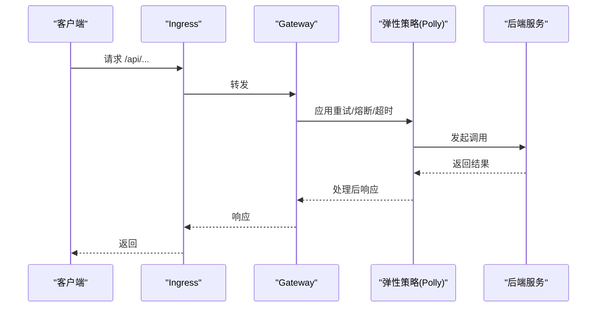
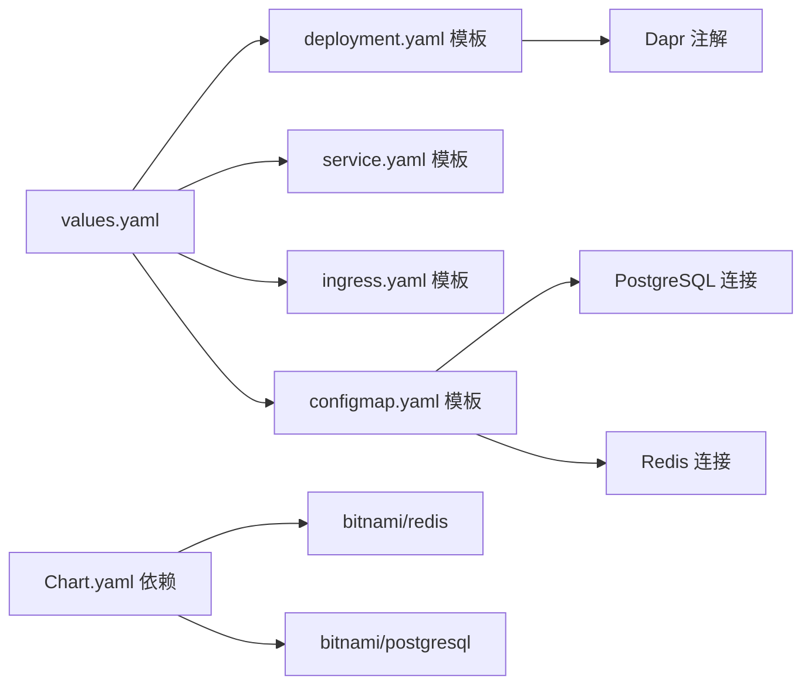

# 部署策略

<cite>
**本文引用的文件**
- [Chart.yaml](file://deploy/helm/erp-system/Chart.yaml)
- [values.yaml](file://deploy/helm/erp-system/values.yaml)
- [deployment.yaml](file://deploy/helm/erp-system/templates/deployment.yaml)
- [service.yaml](file://deploy/helm/erp-system/templates/service.yaml)
- [ingress.yaml](file://deploy/helm/erp-system/templates/ingress.yaml)
- [configmap.yaml](file://deploy/helm/erp-system/templates/configmap.yaml)
- [namespace.yaml](file://deploy/k8s/namespace.yaml)
- [ingress.yaml](file://deploy/k8s/ingress.yaml)
- [configmap.yaml](file://deploy/k8s/configmap.yaml)
- [secrets.yaml](file://deploy/k8s/secrets.yaml)
- [finance.yaml](file://deploy/k8s/services/finance.yaml)
- [gateway.yaml](file://deploy/k8s/services/gateway.yaml)
- [inventory.yaml](file://deploy/k8s/services/inventory.yaml)
- [reporting.yaml](file://deploy/k8s/services/reporting.yaml)
- [pubsub.yaml](file://components/pubsub.yaml)
- [statestore.yaml](file://components/statestore.yaml)
- [Program.cs](file://src/Gateways/ErpSystem.Gateway/Program.cs)
- [deployment.md](file://docs/deployment.md)
</cite>

## 目录
1. [简介](#简介)
2. [项目结构](#项目结构)
3. [核心组件](#核心组件)
4. [架构总览](#架构总览)
5. [详细组件分析](#详细组件分析)
6. [依赖关系分析](#依赖关系分析)
7. [性能考虑](#性能考虑)
8. [故障排查指南](#故障排查指南)
9. [结论](#结论)
10. [附录](#附录)

## 简介
本文件系统化阐述 ERP 微服务在 Kubernetes 上的部署策略与实践，覆盖 Helm 图表管理、服务编排、多发布模式（蓝绿、金丝雀、滚动更新）、环境配置与密钥管理、配置热更新、部署脚本、健康检查与自动扩缩容、服务网格与流量管理、以及监控与故障恢复最佳实践。目标是帮助运维团队高效、安全地交付与维护系统。

## 项目结构
- Helm 图表位于 deploy/helm/erp-system，包含 Chart 定义、values 值与模板（Deployment、Service、Ingress、ConfigMap）。
- 原生 Kubernetes 清单位于 deploy/k8s，包含命名空间、Ingress、ConfigMap、Secrets 以及各服务的 Deployment/Service。
- 组件层的 Dapr 组件定义位于 components，用于状态存储与事件发布订阅。
- 网关服务位于 src/Gateways/ErpSystem.Gateway，提供反向代理、健康检查与弹性策略。

图示来源
- [Chart.yaml](file://deploy/helm/erp-system/Chart.yaml#L1-L27)
- [values.yaml](file://deploy/helm/erp-system/values.yaml#L1-L127)
- [deployment.yaml](file://deploy/helm/erp-system/templates/deployment.yaml#L1-L58)
- [service.yaml](file://deploy/helm/erp-system/templates/service.yaml#L1-L22)
- [ingress.yaml](file://deploy/helm/erp-system/templates/ingress.yaml#L1-L47)
- [configmap.yaml](file://deploy/helm/erp-system/templates/configmap.yaml#L1-L20)
- [namespace.yaml](file://deploy/k8s/namespace.yaml#L1-L8)
- [ingress.yaml](file://deploy/k8s/ingress.yaml#L1-L37)
- [configmap.yaml](file://deploy/k8s/configmap.yaml#L1-L25)
- [secrets.yaml](file://deploy/k8s/secrets.yaml#L1-L19)
- [finance.yaml](file://deploy/k8s/services/finance.yaml#L1-L66)
- [inventory.yaml](file://deploy/k8s/services/inventory.yaml#L1-L66)
- [gateway.yaml](file://deploy/k8s/services/gateway.yaml#L1-L60)
- [reporting.yaml](file://deploy/k8s/services/reporting.yaml#L1-L64)
- [pubsub.yaml](file://components/pubsub.yaml#L1-L13)
- [statestore.yaml](file://components/statestore.yaml#L1-L13)

章节来源
- [Chart.yaml](file://deploy/helm/erp-system/Chart.yaml#L1-L27)
- [values.yaml](file://deploy/helm/erp-system/values.yaml#L1-L127)
- [deployment.yaml](file://deploy/helm/erp-system/templates/deployment.yaml#L1-L58)
- [service.yaml](file://deploy/helm/erp-system/templates/service.yaml#L1-L22)
- [ingress.yaml](file://deploy/helm/erp-system/templates/ingress.yaml#L1-L47)
- [configmap.yaml](file://deploy/helm/erp-system/templates/configmap.yaml#L1-L20)
- [namespace.yaml](file://deploy/k8s/namespace.yaml#L1-L8)
- [ingress.yaml](file://deploy/k8s/ingress.yaml#L1-L37)
- [configmap.yaml](file://deploy/k8s/configmap.yaml#L1-L25)
- [secrets.yaml](file://deploy/k8s/secrets.yaml#L1-L19)
- [finance.yaml](file://deploy/k8s/services/finance.yaml#L1-L66)
- [inventory.yaml](file://deploy/k8s/services/inventory.yaml#L1-L66)
- [gateway.yaml](file://deploy/k8s/services/gateway.yaml#L1-L60)
- [reporting.yaml](file://deploy/k8s/services/reporting.yaml#L1-L64)
- [pubsub.yaml](file://components/pubsub.yaml#L1-L13)
- [statestore.yaml](file://components/statestore.yaml#L1-L13)

## 核心组件
- Helm 图表：统一管理服务清单与依赖（PostgreSQL、Redis），支持按服务覆盖副本数、镜像与资源限制。
- 健康检查：所有服务暴露 /health（存活）与 /health/ready（就绪）端点，配合探针保障平滑升级与自愈。
- 服务网格（Dapr）：通过注解启用 Dapr，使用 Redis 作为状态存储与发布订阅组件，简化服务间通信与事件驱动。
- 入口网关：Nginx Ingress 将外部流量路由到网关服务，并对报表子路径进行定向转发。
- 配置与密钥：ConfigMap 提供运行时配置，Secrets 存放敏感信息；支持环境值文件覆盖与生产安全注入。

章节来源
- [values.yaml](file://deploy/helm/erp-system/values.yaml#L1-L127)
- [deployment.yaml](file://deploy/helm/erp-system/templates/deployment.yaml#L44-L55)
- [ingress.yaml](file://deploy/helm/erp-system/templates/ingress.yaml#L21-L31)
- [configmap.yaml](file://deploy/helm/erp-system/templates/configmap.yaml#L1-L20)
- [secrets.yaml](file://deploy/k8s/secrets.yaml#L1-L19)
- [pubsub.yaml](file://components/pubsub.yaml#L1-L13)
- [statestore.yaml](file://components/statestore.yaml#L1-L13)

## 架构总览
下图展示从外部请求到内部服务的端到端路径，以及服务间的 Dapr 交互。

图示来源
- [ingress.yaml](file://deploy/helm/erp-system/templates/ingress.yaml#L21-L31)
- [gateway.yaml](file://deploy/k8s/services/gateway.yaml#L1-L60)
- [finance.yaml](file://deploy/k8s/services/finance.yaml#L1-L66)
- [inventory.yaml](file://deploy/k8s/services/inventory.yaml#L1-L66)
- [reporting.yaml](file://deploy/k8s/services/reporting.yaml#L1-L64)
- [pubsub.yaml](file://components/pubsub.yaml#L1-L13)
- [statestore.yaml](file://components/statestore.yaml#L1-L13)

## 详细组件分析

### Helm 图表与模板
- Chart.yaml：声明应用名称、版本、依赖（redis、postgresql）与关键字，便于检索与分发。
- values.yaml：集中式配置入口，支持全局命名空间、通用资源、服务级覆盖、Ingress 主机、数据库与 Redis 开关、Dapr 组件选择、环境变量等。
- 模板：
  - deployment.yaml：按服务生成 Deployment，注入 Dapr 注解、镜像、资源、探针、ConfigMap/Secret 引用。
  - service.yaml：按服务生成 Service，类型可按服务覆盖（默认 ClusterIP）。
  - ingress.yaml：统一入口规则，将根路径转发至网关，报表路径转发至 reporting 服务。
  - configmap.yaml：注入 ASP.NET 环境、Dapr 端口、数据库连接串（当启用 PostgreSQL）、Redis 地址（当启用 Redis）。

图示来源
- [Chart.yaml](file://deploy/helm/erp-system/Chart.yaml#L1-L27)
- [values.yaml](file://deploy/helm/erp-system/values.yaml#L1-L127)
- [deployment.yaml](file://deploy/helm/erp-system/templates/deployment.yaml#L1-L58)
- [service.yaml](file://deploy/helm/erp-system/templates/service.yaml#L1-L22)
- [ingress.yaml](file://deploy/helm/erp-system/templates/ingress.yaml#L1-L47)
- [configmap.yaml](file://deploy/helm/erp-system/templates/configmap.yaml#L1-L20)

章节来源
- [Chart.yaml](file://deploy/helm/erp-system/Chart.yaml#L1-L27)
- [values.yaml](file://deploy/helm/erp-system/values.yaml#L1-L127)
- [deployment.yaml](file://deploy/helm/erp-system/templates/deployment.yaml#L1-L58)
- [service.yaml](file://deploy/helm/erp-system/templates/service.yaml#L1-L22)
- [ingress.yaml](file://deploy/helm/erp-system/templates/ingress.yaml#L1-L47)
- [configmap.yaml](file://deploy/helm/erp-system/templates/configmap.yaml#L1-L20)

### 原生 K8s 清单与服务编排
- 命名空间：隔离资源，便于权限与配额控制。
- Ingress：统一入口，支持路径级路由到不同后端服务。
- ConfigMap：集中存放非敏感配置，如数据库连接串、Redis 地址、服务 URL 映射。
- Secrets：存放数据库密码、JWT 密钥、Redis 密钥等敏感数据。
- 服务清单：每个业务服务包含 Deployment（含探针、资源、Dapr 注解）与 Service（ClusterIP/LoadBalancer）。

图示来源
- [namespace.yaml](file://deploy/k8s/namespace.yaml#L1-L8)
- [configmap.yaml](file://deploy/k8s/configmap.yaml#L1-L25)
- [secrets.yaml](file://deploy/k8s/secrets.yaml#L1-L19)
- [finance.yaml](file://deploy/k8s/services/finance.yaml#L1-L66)
- [gateway.yaml](file://deploy/k8s/services/gateway.yaml#L1-L60)
- [ingress.yaml](file://deploy/k8s/ingress.yaml#L1-L37)

章节来源
- [namespace.yaml](file://deploy/k8s/namespace.yaml#L1-L8)
- [ingress.yaml](file://deploy/k8s/ingress.yaml#L1-L37)
- [configmap.yaml](file://deploy/k8s/configmap.yaml#L1-L25)
- [secrets.yaml](file://deploy/k8s/secrets.yaml#L1-L19)
- [finance.yaml](file://deploy/k8s/services/finance.yaml#L1-L66)
- [inventory.yaml](file://deploy/k8s/services/inventory.yaml#L1-L66)
- [gateway.yaml](file://deploy/k8s/services/gateway.yaml#L1-L60)
- [reporting.yaml](file://deploy/k8s/services/reporting.yaml#L1-L64)

### 发布策略与滚动更新
- 滚动更新：Helm 与原生清单均采用 Deployment 的滚动更新策略，结合就绪探针确保新旧实例交替，避免中断。
- 蓝绿部署：通过为新版本分配独立标签并在 Ingress 中切换服务选择器或使用双套服务+Ingress 规则实现零停机切换。
- 金丝雀发布：利用 Ingress 路由规则将部分流量（如基于路径或 Header）导入新版本，逐步扩大比例。
- 版本标记：Deployment 标签中包含 version 字段，便于区分蓝绿两套。

图示来源
- [deployment.yaml](file://deploy/helm/erp-system/templates/deployment.yaml#L12-L16)
- [ingress.yaml](file://deploy/helm/erp-system/templates/ingress.yaml#L21-L31)
- [finance.yaml](file://deploy/k8s/services/finance.yaml#L7-L8)
- [gateway.yaml](file://deploy/k8s/services/gateway.yaml#L7-L8)

章节来源
- [deployment.yaml](file://deploy/helm/erp-system/templates/deployment.yaml#L12-L16)
- [ingress.yaml](file://deploy/helm/erp-system/templates/ingress.yaml#L21-L31)
- [finance.yaml](file://deploy/k8s/services/finance.yaml#L7-L8)
- [gateway.yaml](file://deploy/k8s/services/gateway.yaml#L7-L8)

### 环境配置管理与密钥管理
- ConfigMap：集中存放非敏感配置，如 ASP.NET 环境、Dapr 端口、数据库与 Redis 连接串（根据启用开关动态注入）。
- Secrets：存放数据库密码、JWT 密钥、Redis 密钥等敏感信息，容器通过 envFrom 引用。
- 环境值文件：通过 Helm -f 或 --set 注入不同环境的覆盖值，实现多环境一致性与安全性。

图示来源
- [configmap.yaml](file://deploy/helm/erp-system/templates/configmap.yaml#L8-L19)
- [secrets.yaml](file://deploy/k8s/secrets.yaml#L7-L18)
- [deployment.yaml](file://deploy/helm/erp-system/templates/deployment.yaml#L37-L41)

章节来源
- [configmap.yaml](file://deploy/helm/erp-system/templates/configmap.yaml#L8-L19)
- [secrets.yaml](file://deploy/k8s/secrets.yaml#L7-L18)
- [deployment.yaml](file://deploy/helm/erp-system/templates/deployment.yaml#L37-L41)

### 配置热更新
- ConfigMap 变更：通过挂载方式注入的 ConfigMap 在不重启 Pod 的情况下可被应用感知（取决于应用实现）。建议将关键配置放入 ConfigMap 并在变更后触发滚动更新以确保一致性。
- Secrets 变更：Secret 更新后通常不会自动刷新到现有 Pod，需滚动更新或使用工具（如 kubectl set env 或重新创建 Pod）使新值生效。

章节来源
- [configmap.yaml](file://deploy/helm/erp-system/templates/configmap.yaml#L1-L20)
- [secrets.yaml](file://deploy/k8s/secrets.yaml#L1-L19)

### 部署脚本与自动化
- 构建镜像：通过 Dockerfile 构建各服务镜像，支持多服务并行构建。
- Helm 安装/升级：使用 helm dependency update、helm install/upgrade 与环境值文件实现标准化部署。
- 验证命令：提供 kubectl get pods/svc/ingress 快速校验部署状态。

章节来源
- [deployment.md](file://docs/deployment.md#L12-L76)

### 健康检查与自动扩缩容
- 健康检查：所有服务均暴露 /health（存活）与 /health/ready（就绪）端点，配合探针保障升级与自愈。
- 自动扩缩容：可通过 HorizontalPodAutoscaler（HPA）基于 CPU/内存或自定义指标进行扩缩容，建议为高流量服务开启。

章节来源
- [deployment.yaml](file://deploy/helm/erp-system/templates/deployment.yaml#L44-L55)
- [Program.cs](file://src/Gateways/ErpSystem.Gateway/Program.cs#L66-L80)

### 服务网格与流量管理
- Dapr：通过 Deployment 注解启用 Dapr，使用 Redis 作为 PubSub 与 StateStore，简化服务间通信与事件驱动。
- Ingress：统一入口，支持路径级路由；可在网关层实现灰度、限流与熔断。
- 网关弹性：网关内置重试、熔断与超时策略，提升下游稳定性。

图示来源
- [Program.cs](file://src/Gateways/ErpSystem.Gateway/Program.cs#L30-L58)
- [ingress.yaml](file://deploy/helm/erp-system/templates/ingress.yaml#L21-L31)
- [pubsub.yaml](file://components/pubsub.yaml#L1-L13)
- [statestore.yaml](file://components/statestore.yaml#L1-L13)

章节来源
- [Program.cs](file://src/Gateways/ErpSystem.Gateway/Program.cs#L30-L58)
- [pubsub.yaml](file://components/pubsub.yaml#L1-L13)
- [statestore.yaml](file://components/statestore.yaml#L1-L13)

### 监控、日志与性能指标
- 健康端点：/health 与 /health/ready 便于探针与外部监控系统集成。
- 资源限制：为各服务设置 requests/limits，便于 Prometheus/Grafana 采集与告警。
- 建议：接入 Prometheus Operator 与 Grafana，建立服务可用性、延迟、错误率与资源使用率仪表盘。

章节来源
- [deployment.yaml](file://deploy/helm/erp-system/templates/deployment.yaml#L44-L45)
- [deployment.md](file://docs/deployment.md#L109-L115)

## 依赖关系分析
- Helm Chart 依赖：redis 与 postgresql 作为可选依赖，通过 condition 控制启用与否。
- 服务依赖：各业务服务依赖 ConfigMap/Secrets 提供的连接信息；网关作为统一入口聚合多个服务。
- Dapr 依赖：通过组件定义使用 Redis 作为 PubSub 与 StateStore。

图示来源
- [Chart.yaml](file://deploy/helm/erp-system/Chart.yaml#L18-L26)
- [values.yaml](file://deploy/helm/erp-system/values.yaml#L100-L123)
- [deployment.yaml](file://deploy/helm/erp-system/templates/deployment.yaml#L22-L26)
- [configmap.yaml](file://deploy/helm/erp-system/templates/configmap.yaml#L13-L19)

章节来源
- [Chart.yaml](file://deploy/helm/erp-system/Chart.yaml#L18-L26)
- [values.yaml](file://deploy/helm/erp-system/values.yaml#L100-L123)
- [deployment.yaml](file://deploy/helm/erp-system/templates/deployment.yaml#L22-L26)
- [configmap.yaml](file://deploy/helm/erp-system/templates/configmap.yaml#L13-L19)

## 性能考虑
- 资源规划：为不同服务设置合理的 requests/limits，避免资源争抢与 OOM。
- 探针参数：根据服务启动时间与负载调整 initialDelaySeconds 与 periodSeconds，减少误判。
- 网关弹性：合理配置重试次数、熔断阈值与超时时间，防止级联故障。
- 数据库与缓存：确保 PostgreSQL 与 Redis 的持久化与副本策略满足高可用要求。

## 故障排查指南
- 部署失败：检查命名空间、RBAC 权限与镜像拉取策略；查看 Pod 事件与日志。
- 无法访问：确认 Ingress 类名、TLS 配置与主机名；验证 Service 端口与选择器。
- 健康异常：检查 /health 与 /health/ready 端点返回；查看探针配置与容器端口。
- 配置问题：核对 ConfigMap/Secrets 是否正确挂载；确认环境值文件覆盖顺序。
- 网关异常：检查网关弹性策略是否触发熔断；验证路由规则与后端服务可达性。

章节来源
- [deployment.md](file://docs/deployment.md#L46-L57)
- [ingress.yaml](file://deploy/helm/erp-system/templates/ingress.yaml#L14-L20)
- [deployment.yaml](file://deploy/helm/erp-system/templates/deployment.yaml#L44-L55)

## 结论
该部署方案以 Helm 为核心，结合原生 K8s 清单与 Dapr 组件，实现了标准化、可扩展且具备弹性能力的服务编排。通过健康检查、探针与弹性策略，保障了发布过程中的稳定性与用户体验。建议在生产环境中进一步完善自动扩缩容、监控告警与安全加固（如 TLS、RBAC、镜像签名等）。

## 附录
- 快速参考
  - 构建镜像：使用 docs/deployment.md 中的构建命令。
  - Helm 安装/升级：使用 docs/deployment.md 中的 Helm 命令。
  - 验证部署：使用 docs/deployment.md 中的 kubectl 命令。
- 最佳实践
  - 使用环境值文件管理差异化配置。
  - 对敏感信息使用 Secrets 并定期轮换。
  - 为关键服务启用 HPA 与资源限制。
  - 在网关层实施限流与熔断，保护后端。
  - 采用蓝绿/金丝雀策略降低发布风险。

章节来源
- [deployment.md](file://docs/deployment.md#L12-L115)