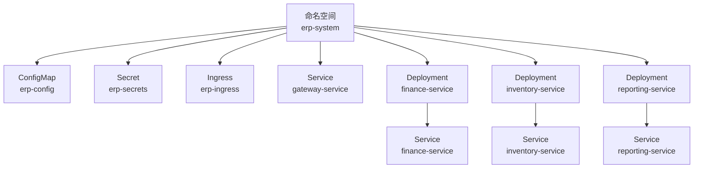
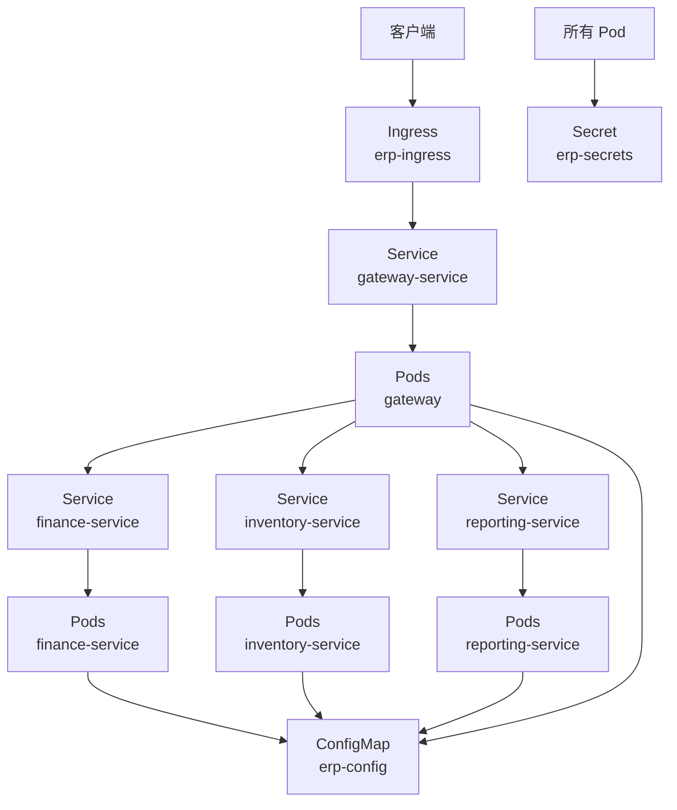
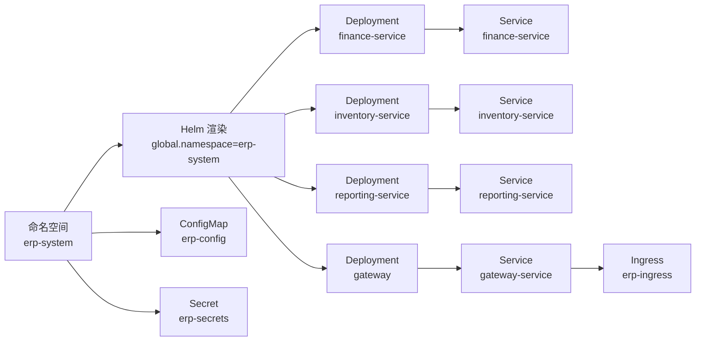

# 命名空间管理

<cite>
**本文引用的文件**
- [namespace.yaml](file://deploy/k8s/namespace.yaml)
- [values.yaml](file://deploy/helm/erp-system/values.yaml)
- [_helpers.tpl](file://deploy/helm/erp-system/templates/_helpers.tpl)
- [configmap.yaml](file://deploy/k8s/configmap.yaml)
- [secrets.yaml](file://deploy/k8s/secrets.yaml)
- [ingress.yaml](file://deploy/k8s/ingress.yaml)
- [finance.yaml](file://deploy/k8s/services/finance.yaml)
- [inventory.yaml](file://deploy/k8s/services/inventory.yaml)
- [reporting.yaml](file://deploy/k8s/services/reporting.yaml)
- [gateway.yaml](file://deploy/k8s/services/gateway.yaml)
</cite>

## 目录
1. [简介](#简介)
2. [项目结构](#项目结构)
3. [核心组件](#核心组件)
4. [架构总览](#架构总览)
5. [详细组件分析](#详细组件分析)
6. [依赖分析](#依赖分析)
7. [性能考虑](#性能考虑)
8. [故障排除指南](#故障排除指南)
9. [结论](#结论)
10. [附录](#附录)

## 简介
本文件系统化阐述该仓库中针对 Kubernetes 命名空间“erp-system”的管理与使用方式，重点覆盖以下方面：
- 命名空间的作用与重要性：资源隔离、权限管理、多租户支持
- “erp-system”命名空间的配置要点：标签选择器、元数据管理
- 命名空间级资源配额与请求设置（当前仓库未直接定义资源配额，但包含各工作负载的资源请求/限制）
- 命名空间的创建、删除与状态监控操作指南
- 命名空间与 RBAC 权限系统的关联关系与最佳实践
- 常见问题与解决方案

## 项目结构
围绕“erp-system”命名空间的相关文件主要分布在以下位置：
- 根级命名空间定义：deploy/k8s/namespace.yaml
- Helm 图表配置：deploy/helm/erp-system/values.yaml、deploy/helm/erp-system/templates/_helpers.tpl
- 配置与密钥：deploy/k8s/configmap.yaml、deploy/k8s/secrets.yaml
- 入口与服务暴露：deploy/k8s/ingress.yaml
- 各微服务部署与服务对象：deploy/k8s/services/*.yaml

图表来源
- [namespace.yaml](file://deploy/k8s/namespace.yaml#L1-L8)
- [configmap.yaml](file://deploy/k8s/configmap.yaml#L1-L25)
- [secrets.yaml](file://deploy/k8s/secrets.yaml#L1-L19)
- [ingress.yaml](file://deploy/k8s/ingress.yaml#L1-L37)
- [finance.yaml](file://deploy/k8s/services/finance.yaml#L1-L66)
- [inventory.yaml](file://deploy/k8s/services/inventory.yaml#L1-L66)
- [reporting.yaml](file://deploy/k8s/services/reporting.yaml#L1-L64)
- [gateway.yaml](file://deploy/k8s/services/gateway.yaml#L1-L60)

章节来源
- [namespace.yaml](file://deploy/k8s/namespace.yaml#L1-L8)
- [values.yaml](file://deploy/helm/erp-system/values.yaml#L1-L127)
- [_helpers.tpl](file://deploy/helm/erp-system/templates/_helpers.tpl#L1-L51)
- [configmap.yaml](file://deploy/k8s/configmap.yaml#L1-L25)
- [secrets.yaml](file://deploy/k8s/secrets.yaml#L1-L19)
- [ingress.yaml](file://deploy/k8s/ingress.yaml#L1-L37)
- [finance.yaml](file://deploy/k8s/services/finance.yaml#L1-L66)
- [inventory.yaml](file://deploy/k8s/services/inventory.yaml#L1-L66)
- [reporting.yaml](file://deploy/k8s/services/reporting.yaml#L1-L64)
- [gateway.yaml](file://deploy/k8s/services/gateway.yaml#L1-L60)

## 核心组件
- 命名空间定义：通过根级 YAML 定义“erp-system”命名空间及其标签，用于标识该命名空间属于“erp-platform”平台的一部分。
- Helm 图表：values.yaml 提供全局命名空间、副本数、资源请求/限制等配置；_helpers.tpl 提供模板化的标签与选择器生成逻辑。
- 工作负载与网络：各微服务以 Deployment 形式部署在“erp-system”命名空间内，配套 Service 暴露服务；Ingress 将外部流量路由至网关服务。
- 配置与密钥：ConfigMap 与 Secret 均位于“erp-system”命名空间，为工作负载提供运行时配置与敏感信息。

章节来源
- [namespace.yaml](file://deploy/k8s/namespace.yaml#L1-L8)
- [values.yaml](file://deploy/helm/erp-system/values.yaml#L1-L127)
- [_helpers.tpl](file://deploy/helm/erp-system/templates/_helpers.tpl#L1-L51)
- [configmap.yaml](file://deploy/k8s/configmap.yaml#L1-L25)
- [secrets.yaml](file://deploy/k8s/secrets.yaml#L1-L19)
- [ingress.yaml](file://deploy/k8s/ingress.yaml#L1-L37)
- [finance.yaml](file://deploy/k8s/services/finance.yaml#L1-L66)
- [inventory.yaml](file://deploy/k8s/services/inventory.yaml#L1-L66)
- [reporting.yaml](file://deploy/k8s/services/reporting.yaml#L1-L64)
- [gateway.yaml](file://deploy/k8s/services/gateway.yaml#L1-L60)

## 架构总览
下图展示“erp-system”命名空间内的整体拓扑：Ingress 接收外部请求，转发到网关服务；网关再将内部 API 请求路由到各业务服务；ConfigMap/Secret 提供统一配置与密钥。

图表来源
- [ingress.yaml](file://deploy/k8s/ingress.yaml#L1-L37)
- [gateway.yaml](file://deploy/k8s/services/gateway.yaml#L1-L60)
- [finance.yaml](file://deploy/k8s/services/finance.yaml#L1-L66)
- [inventory.yaml](file://deploy/k8s/services/inventory.yaml#L1-L66)
- [reporting.yaml](file://deploy/k8s/services/reporting.yaml#L1-L64)
- [configmap.yaml](file://deploy/k8s/configmap.yaml#L1-L25)
- [secrets.yaml](file://deploy/k8s/secrets.yaml#L1-L19)

## 详细组件分析

### 命名空间定义与元数据
- 命名空间名称：erp-system
- 标签：
  - app.kubernetes.io/name: erp-system
  - app.kubernetes.io/part-of: erp-platform
- 作用：通过标签实现资源分组与归属识别，便于策略、监控与治理。

章节来源
- [namespace.yaml](file://deploy/k8s/namespace.yaml#L1-L8)

### Helm 图表中的命名空间与标签
- 全局命名空间：values.yaml 中 global.namespace 指定为 erp-system，确保所有 Helm 渲染产物默认部署到该命名空间。
- 标签与选择器模板：_helpers.tpl 提供 labels 与 selectorLabels 的模板，用于工作负载的标签与选择器一致性生成。

章节来源
- [values.yaml](file://deploy/helm/erp-system/values.yaml#L1-L127)
- [_helpers.tpl](file://deploy/helm/erp-system/templates/_helpers.tpl#L1-L51)

### 资源配额与请求设置
- 命名空间级资源配额：当前仓库未在“erp-system”命名空间中直接定义 ResourceQuota 或 LimitRange。
- 工作负载级资源请求/限制：各服务在 Deployment 中显式设置了 requests 与 limits，例如：
  - finance-service、inventory-service、reporting-service：内存请求约 128Mi，CPU 请求约 100m；内存限制约 512Mi，CPU 限制约 500m。
  - gateway-service：内存请求约 64Mi，CPU 请求约 50m；内存限制约 256Mi，CPU 限制约 250m。
- 建议：如需在命名空间层面强制资源约束，可在“erp-system”命名空间中添加 ResourceQuota/LimitRange，以统一限制该命名空间内所有工作负载的资源总量与单容器默认限制。

章节来源
- [finance.yaml](file://deploy/k8s/services/finance.yaml#L1-L66)
- [inventory.yaml](file://deploy/k8s/services/inventory.yaml#L1-L66)
- [reporting.yaml](file://deploy/k8s/services/reporting.yaml#L1-L64)
- [gateway.yaml](file://deploy/k8s/services/gateway.yaml#L1-L60)
- [values.yaml](file://deploy/helm/erp-system/values.yaml#L1-L127)

### 配置与密钥管理
- ConfigMap（erp-config）：集中存放运行时配置，如环境变量、数据库连接串、Redis 地址及各服务内部 URL。
- Secret（erp-secrets）：存放敏感信息，如数据库密码、JWT 密钥、Redis 密码等。
- 命名空间归属：两者均位于“erp-system”命名空间，确保工作负载可按需挂载引用。

章节来源
- [configmap.yaml](file://deploy/k8s/configmap.yaml#L1-L25)
- [secrets.yaml](file://deploy/k8s/secrets.yaml#L1-L19)

### 入口与服务暴露
- Ingress（erp-ingress）：将域名 erp.example.com 的流量根据路径规则转发至相应后端服务，其中根路径转发至网关服务，部分报表路径转发至 reporting-service。
- 服务类型：网关服务为 LoadBalancer，其他服务为 ClusterIP，符合内部服务间通信与外部入口分离的设计。

章节来源
- [ingress.yaml](file://deploy/k8s/ingress.yaml#L1-L37)
- [gateway.yaml](file://deploy/k8s/services/gateway.yaml#L1-L60)
- [finance.yaml](file://deploy/k8s/services/finance.yaml#L1-L66)
- [inventory.yaml](file://deploy/k8s/services/inventory.yaml#L1-L66)
- [reporting.yaml](file://deploy/k8s/services/reporting.yaml#L1-L64)

### 微服务部署与选择器
- 选择器与标签：各服务的 Deployment 使用 matchLabels 与 pod 模板中的 labels，形成稳定的标签选择器，确保 Service 正确关联到对应 Pod。
- 示例：
  - finance-service：selector.matchLabels 为 app=finance，Pod 标签包含 app=finance。
  - inventory-service：selector.matchLabels 为 app=inventory，Pod 标签包含 app=inventory。
  - reporting-service：selector.matchLabels 为 app=reporting，Pod 标签包含 app=reporting。
- 这些标签与 Helm 模板中的 selectorLabels 保持一致，确保跨工具链的一致性。

章节来源
- [finance.yaml](file://deploy/k8s/services/finance.yaml#L1-L66)
- [inventory.yaml](file://deploy/k8s/services/inventory.yaml#L1-L66)
- [reporting.yaml](file://deploy/k8s/services/reporting.yaml#L1-L64)
- [_helpers.tpl](file://deploy/helm/erp-system/templates/_helpers.tpl#L33-L36)

## 依赖分析
- 命名空间依赖关系：
  - 所有核心资源（Deployment、Service、Ingress、ConfigMap、Secret）均依赖“erp-system”命名空间存在。
  - Helm 渲染时通过 global.namespace 统一注入命名空间，避免分散配置。
- 标签与选择器依赖：
  - Service 依赖 Deployment 的标签选择器；Helm 模板通过 selectorLabels 保证一致性。
- 外部依赖：
  - Ingress 依赖集群的 Ingress 控制器（className: nginx）。
  - 网关服务作为统一入口，依赖各后端服务的可用性与健康检查。

图表来源
- [values.yaml](file://deploy/helm/erp-system/values.yaml#L1-L127)
- [finance.yaml](file://deploy/k8s/services/finance.yaml#L1-L66)
- [inventory.yaml](file://deploy/k8s/services/inventory.yaml#L1-L66)
- [reporting.yaml](file://deploy/k8s/services/reporting.yaml#L1-L64)
- [gateway.yaml](file://deploy/k8s/services/gateway.yaml#L1-L60)
- [ingress.yaml](file://deploy/k8s/ingress.yaml#L1-L37)
- [configmap.yaml](file://deploy/k8s/configmap.yaml#L1-L25)
- [secrets.yaml](file://deploy/k8s/secrets.yaml#L1-L19)

## 性能考虑
- 资源规划：当前各服务已设置明确的 requests/limits，建议结合实际压测结果进行迭代优化。
- 副本数：多数服务副本数为 2，具备基本高可用能力；可根据 SLA 与流量峰值调整。
- Ingress 层面：可通过注解优化代理体大小与超时参数，提升大文件上传与报表导出体验。
- 命名空间级配额：若集群资源紧张，建议在“erp-system”命名空间启用 ResourceQuota/LimitRange，防止资源争用。

## 故障排除指南
- 命名空间不存在或命名空间不匹配
  - 现象：应用部署报错，提示无法找到目标命名空间。
  - 处理：确认命名空间 YAML 已创建，且 Helm 渲染时 global.namespace 指向 erp-system。
  - 参考
    - [namespace.yaml](file://deploy/k8s/namespace.yaml#L1-L8)
    - [values.yaml](file://deploy/helm/erp-system/values.yaml#L1-L127)
- 服务无法访问
  - 现象：Ingress 404 或 502。
  - 处理：检查 Ingress 规则与后端 Service 名称是否一致；确认 Service 选择器与 Pod 标签匹配；验证 Pod 健康探针与就绪状态。
  - 参考
    - [ingress.yaml](file://deploy/k8s/ingress.yaml#L1-L37)
    - [gateway.yaml](file://deploy/k8s/services/gateway.yaml#L1-L60)
    - [finance.yaml](file://deploy/k8s/services/finance.yaml#L1-L66)
    - [inventory.yaml](file://deploy/k8s/services/inventory.yaml#L1-L66)
    - [reporting.yaml](file://deploy/k8s/services/reporting.yaml#L1-L64)
- 配置或密钥加载失败
  - 现象：应用启动时报缺少配置项或无法解析密钥。
  - 处理：确认 ConfigMap/Secret 名称与挂载引用一致；检查键名拼写；在生产环境使用 Secret 管理敏感值。
  - 参考
    - [configmap.yaml](file://deploy/k8s/configmap.yaml#L1-L25)
    - [secrets.yaml](file://deploy/k8s/secrets.yaml#L1-L19)
- 资源不足或被驱逐
  - 现象：Pod 频繁重启或被 OOMKilled。
  - 处理：核对 requests/limits 设置；必要时在命名空间启用 ResourceQuota/LimitRange 并调整各服务资源上限。
  - 参考
    - [finance.yaml](file://deploy/k8s/services/finance.yaml#L1-L66)
    - [inventory.yaml](file://deploy/k8s/services/inventory.yaml#L1-L66)
    - [reporting.yaml](file://deploy/k8s/services/reporting.yaml#L1-L64)
    - [gateway.yaml](file://deploy/k8s/services/gateway.yaml#L1-L60)

## 结论
- “erp-system”命名空间通过清晰的标签与统一的命名空间注入，实现了资源的有序组织与一致化管理。
- 当前仓库未在命名空间层直接定义资源配额，但各工作负载已具备明确的资源请求/限制，建议结合业务负载在命名空间层面补充 ResourceQuota/LimitRange。
- Ingress、网关与各微服务的配合提供了清晰的外部入口与内部服务拓扑，便于扩展与维护。

## 附录

### 操作指南：创建、删除与状态监控
- 创建命名空间
  - 使用根级命名空间定义文件创建命名空间。
  - 参考
    - [namespace.yaml](file://deploy/k8s/namespace.yaml#L1-L8)
- 应用工作负载
  - 通过 Helm 安装或直接应用各 YAML 文件，确保 global.namespace 指向 erp-system。
  - 参考
    - [values.yaml](file://deploy/helm/erp-system/values.yaml#L1-L127)
    - [finance.yaml](file://deploy/k8s/services/finance.yaml#L1-L66)
    - [inventory.yaml](file://deploy/k8s/services/inventory.yaml#L1-L66)
    - [reporting.yaml](file://deploy/k8s/services/reporting.yaml#L1-L64)
    - [gateway.yaml](file://deploy/k8s/services/gateway.yaml#L1-L60)
    - [ingress.yaml](file://deploy/k8s/ingress.yaml#L1-L37)
    - [configmap.yaml](file://deploy/k8s/configmap.yaml#L1-L25)
    - [secrets.yaml](file://deploy/k8s/secrets.yaml#L1-L19)
- 删除命名空间
  - 删除顺序建议：先删除 Ingress、Service、Deployment，最后删除 ConfigMap/Secret，再删除命名空间本身。
  - 注意：删除命名空间会级联删除其下的所有资源，请谨慎操作。
- 状态监控
  - 查看命名空间状态：kubectl get namespace erp-system
  - 查看资源状态：kubectl -n erp-system get pods,services,ingress,configmaps,secrets
  - 查看事件：kubectl -n erp-system describe pod <pod-name>

### RBAC 权限系统关联关系与最佳实践
- 关联关系
  - 命名空间是 RBAC 最小作用域：ClusterRole/ClusterRoleBinding 可绑定到特定命名空间内的 Role/RoleBinding，实现细粒度权限控制。
  - 在“erp-system”命名空间内，可为不同团队或角色授予只读、部署或全权权限，避免越权访问。
- 最佳实践
  - 最小权限原则：仅授予完成任务所需的最小权限集合。
  - 分离职责：开发、测试、运维分别使用不同 ServiceAccount 与 Role，避免混用。
  - 审计与追踪：启用 RBAC 审计日志，定期审查权限分配。
  - 命名空间隔离：将不同租户或业务线置于独立命名空间，降低相互影响。