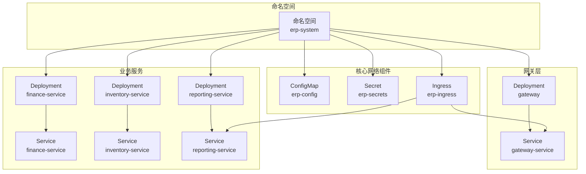
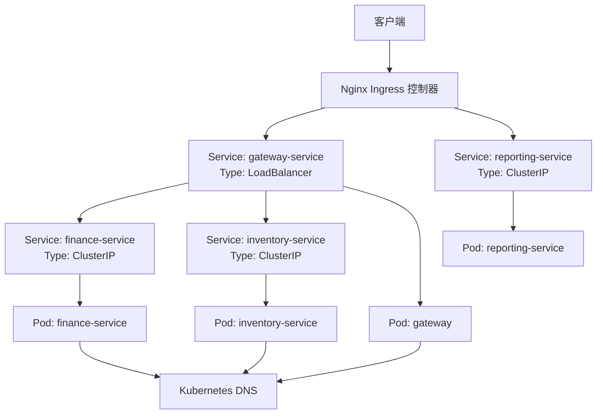
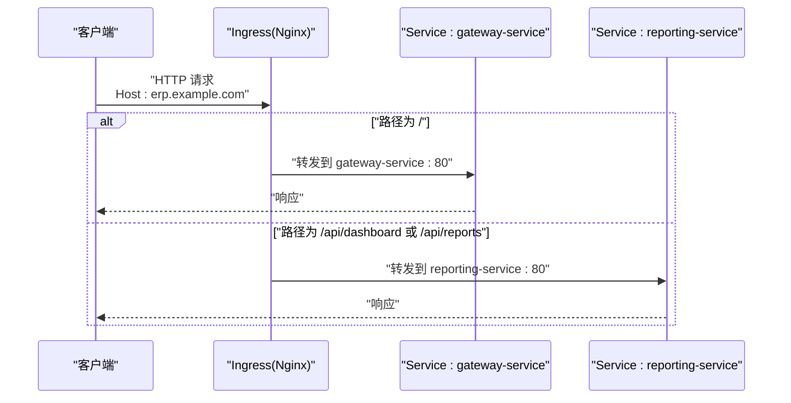
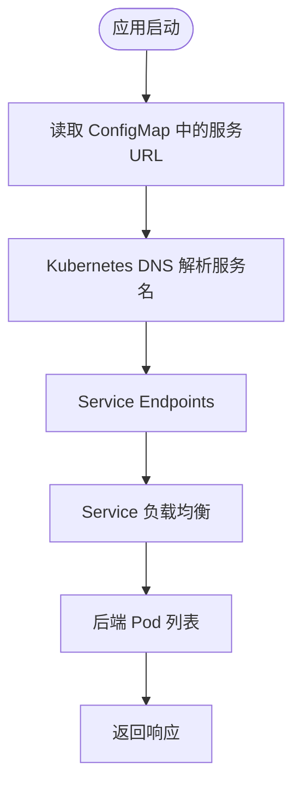
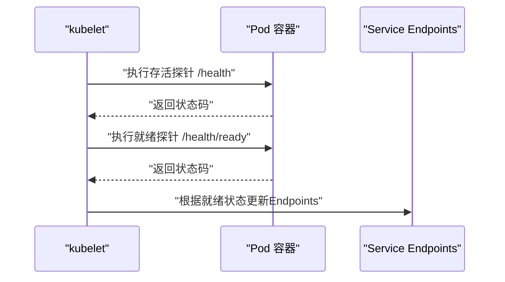
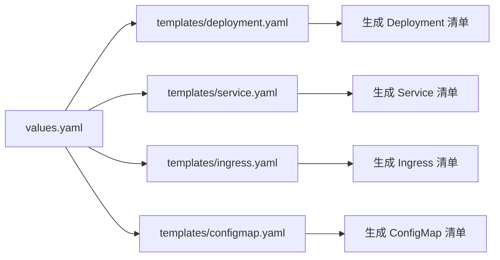
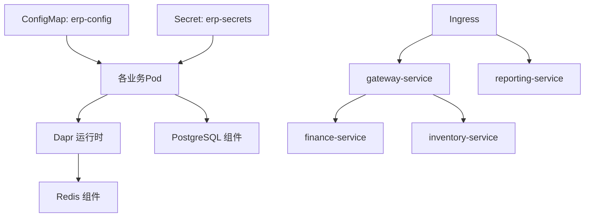

# 服务发现与网络

<cite>
**本文引用的文件**
- [deploy/k8s/services/gateway.yaml](file://deploy/k8s/services/gateway.yaml)
- [deploy/k8s/services/finance.yaml](file://deploy/k8s/services/finance.yaml)
- [deploy/k8s/services/inventory.yaml](file://deploy/k8s/services/inventory.yaml)
- [deploy/k8s/services/reporting.yaml](file://deploy/k8s/services/reporting.yaml)
- [deploy/k8s/ingress.yaml](file://deploy/k8s/ingress.yaml)
- [deploy/k8s/configmap.yaml](file://deploy/k8s/configmap.yaml)
- [deploy/k8s/secrets.yaml](file://deploy/k8s/secrets.yaml)
- [deploy/k8s/namespace.yaml](file://deploy/k8s/namespace.yaml)
- [deploy/helm/erp-system/values.yaml](file://deploy/helm/erp-system/values.yaml)
- [deploy/helm/erp-system/templates/service.yaml](file://deploy/helm/erp-system/templates/service.yaml)
- [deploy/helm/erp-system/templates/ingress.yaml](file://deploy/helm/erp-system/templates/ingress.yaml)
- [deploy/helm/erp-system/templates/deployment.yaml](file://deploy/helm/erp-system/templates/deployment.yaml)
- [deploy/helm/erp-system/templates/configmap.yaml](file://deploy/helm/erp-system/templates/configmap.yaml)
- [components/pubsub.yaml](file://components/pubsub.yaml)
- [components/statestore.yaml](file://components/statestore.yaml)
</cite>

## 目录
1. 引言
2. 项目结构
3. 核心组件
4. 架构总览
5. 组件详解
6. 依赖关系分析
7. 性能考量
8. 故障排除指南
9. 结论
10. 附录

## 引言
本文件聚焦于该ERP微服务项目的Kubernetes服务发现与网络配置，系统性说明以下主题：
- Service资源类型选择（ClusterIP、NodePort、LoadBalancer）及适用场景
- Ingress控制器配置与路由规则
- 各微服务的Service暴露方式与端口映射
- 网络策略（NetworkPolicy）的配置思路与安全规则定义
- DNS解析与服务间通信机制
- 负载均衡、会话亲和性与健康检查
- 故障排除与性能优化建议

## 项目结构
该项目同时提供了两种部署方式：Kubernetes原生清单与Helm Chart模板。两者在服务暴露、Ingress路由、环境变量与Dapr集成方面保持一致。

- 原生Kubernetes清单位于 deploy/k8s 及 deploy/k8s/services 下，包含命名空间、ConfigMap、Secret、各微服务Deployment与Service、以及Ingress。
- Helm Chart位于 deploy/helm/erp-system，通过 values.yaml 驱动 templates 下的模板生成统一的部署产物。

图表来源
- [deploy/k8s/namespace.yaml](file://deploy/k8s/namespace.yaml#L1-L8)
- [deploy/k8s/configmap.yaml](file://deploy/k8s/configmap.yaml#L1-L25)
- [deploy/k8s/secrets.yaml](file://deploy/k8s/secrets.yaml#L1-L19)
- [deploy/k8s/services/gateway.yaml](file://deploy/k8s/services/gateway.yaml#L1-L60)
- [deploy/k8s/services/finance.yaml](file://deploy/k8s/services/finance.yaml#L1-L66)
- [deploy/k8s/services/inventory.yaml](file://deploy/k8s/services/inventory.yaml#L1-L66)
- [deploy/k8s/services/reporting.yaml](file://deploy/k8s/services/reporting.yaml#L1-L64)
- [deploy/k8s/ingress.yaml](file://deploy/k8s/ingress.yaml#L1-L37)

章节来源
- [deploy/k8s/namespace.yaml](file://deploy/k8s/namespace.yaml#L1-L8)
- [deploy/k8s/configmap.yaml](file://deploy/k8s/configmap.yaml#L1-L25)
- [deploy/k8s/secrets.yaml](file://deploy/k8s/secrets.yaml#L1-L19)
- [deploy/k8s/services/gateway.yaml](file://deploy/k8s/services/gateway.yaml#L1-L60)
- [deploy/k8s/services/finance.yaml](file://deploy/k8s/services/finance.yaml#L1-L66)
- [deploy/k8s/services/inventory.yaml](file://deploy/k8s/services/inventory.yaml#L1-L66)
- [deploy/k8s/services/reporting.yaml](file://deploy/k8s/services/reporting.yaml#L1-L64)
- [deploy/k8s/ingress.yaml](file://deploy/k8s/ingress.yaml#L1-L37)

## 核心组件
- 命名空间：集中隔离所有资源，便于网络策略与权限控制。
- ConfigMap：集中存放运行时配置（如数据库连接字符串、Redis地址、服务URL等），供Pod以环境变量形式注入。
- Secret：存放敏感信息（如数据库密码、JWT密钥、Dapr API Token等），以密文形式注入。
- Service：
  - ClusterIP：内部服务（finance、inventory、reporting）默认使用，仅在集群内可访问。
  - LoadBalancer：网关服务（gateway）使用，对外暴露HTTP 80端口。
- Ingress：统一入口，基于路径将流量转发到不同后端服务。
- Dapr：通过容器注解启用，提供服务调用、状态管理、发布订阅等能力。

章节来源
- [deploy/k8s/namespace.yaml](file://deploy/k8s/namespace.yaml#L1-L8)
- [deploy/k8s/configmap.yaml](file://deploy/k8s/configmap.yaml#L1-L25)
- [deploy/k8s/secrets.yaml](file://deploy/k8s/secrets.yaml#L1-L19)
- [deploy/k8s/services/gateway.yaml](file://deploy/k8s/services/gateway.yaml#L48-L60)
- [deploy/k8s/services/finance.yaml](file://deploy/k8s/services/finance.yaml#L54-L66)
- [deploy/k8s/services/inventory.yaml](file://deploy/k8s/services/inventory.yaml#L54-L66)
- [deploy/k8s/services/reporting.yaml](file://deploy/k8s/services/reporting.yaml#L52-L64)
- [deploy/k8s/ingress.yaml](file://deploy/k8s/ingress.yaml#L1-L37)

## 架构总览
下图展示了从外部到内部的流量路径：客户端经由Ingress进入，根据路径规则分发至网关或报告服务；网关再向内部服务发起请求；服务间通过Kubernetes DNS进行解析与通信。

图表来源
- [deploy/k8s/ingress.yaml](file://deploy/k8s/ingress.yaml#L1-L37)
- [deploy/k8s/services/gateway.yaml](file://deploy/k8s/services/gateway.yaml#L48-L60)
- [deploy/k8s/services/finance.yaml](file://deploy/k8s/services/finance.yaml#L54-L66)
- [deploy/k8s/services/inventory.yaml](file://deploy/k8s/services/inventory.yaml#L54-L66)
- [deploy/k8s/services/reporting.yaml](file://deploy/k8s/services/reporting.yaml#L52-L64)

## 组件详解

### Service类型选择与使用场景
- ClusterIP（默认）
  - 适用：内部服务（finance、inventory、reporting）之间相互通信。
  - 特点：不暴露到集群外，仅通过服务名称与端口访问，具备负载均衡与高可用。
  - 示例参考：[finance-service](file://deploy/k8s/services/finance.yaml#L54-L66)、[inventory-service](file://deploy/k8s/services/inventory.yaml#L54-L66)、[reporting-service](file://deploy/k8s/services/reporting.yaml#L52-L64)。
- LoadBalancer
  - 适用：需要从集群外部直接访问的服务（本项目中为网关gateway）。
  - 特点：由云提供商分配公网IP，简化外部流量接入。
  - 示例参考：[gateway-service](file://deploy/k8s/services/gateway.yaml#L48-L60)。
- NodePort（未在此仓库中使用）
  - 适用：无需云提供商LB但需要从节点端口访问的场景。
  - 说明：本项目未采用该类型，因此不展开实现细节。

章节来源
- [deploy/k8s/services/gateway.yaml](file://deploy/k8s/services/gateway.yaml#L48-L60)
- [deploy/k8s/services/finance.yaml](file://deploy/k8s/services/finance.yaml#L54-L66)
- [deploy/k8s/services/inventory.yaml](file://deploy/k8s/services/inventory.yaml#L54-L66)
- [deploy/k8s/services/reporting.yaml](file://deploy/k8s/services/reporting.yaml#L52-L64)

### Ingress控制器配置与路由规则
- 控制器类名：nginx
- 主机名：erp.example.com
- 路由规则：
  - 根路径“/”：转发至 gateway-service:80
  - 路径前缀“/api/dashboard”：转发至 reporting-service:80
  - 路径前缀“/api/reports”：转发至 reporting-service:80
- 注解：
  - 重写目标路径为“/”
  - 关闭SSL重定向（开发环境）
  - 设置代理请求体大小

图表来源
- [deploy/k8s/ingress.yaml](file://deploy/k8s/ingress.yaml#L1-L37)

章节来源
- [deploy/k8s/ingress.yaml](file://deploy/k8s/ingress.yaml#L1-L37)

### 各微服务的Service暴露方式与端口映射
- 网关（gateway）
  - Service类型：LoadBalancer
  - 暴露端口：80
  - Pod端口：80
  - 参考：[gateway-service](file://deploy/k8s/services/gateway.yaml#L48-L60)
- 财务（finance）
  - Service类型：ClusterIP
  - 暴露端口：80
  - Pod端口：80
  - 参考：[finance-service](file://deploy/k8s/services/finance.yaml#L54-L66)
- 库存（inventory）
  - Service类型：ClusterIP
  - 暴露端口：80
  - Pod端口：80
  - 参考：[inventory-service](file://deploy/k8s/services/inventory.yaml#L54-L66)
- 报表（reporting）
  - Service类型：ClusterIP
  - 暴露端口：80
  - Pod端口：80
  - 参考：[reporting-service](file://deploy/k8s/services/reporting.yaml#L52-L64)

章节来源
- [deploy/k8s/services/gateway.yaml](file://deploy/k8s/services/gateway.yaml#L48-L60)
- [deploy/k8s/services/finance.yaml](file://deploy/k8s/services/finance.yaml#L54-L66)
- [deploy/k8s/services/inventory.yaml](file://deploy/k8s/services/inventory.yaml#L54-L66)
- [deploy/k8s/services/reporting.yaml](file://deploy/k8s/services/reporting.yaml#L52-L64)

### 网络策略（NetworkPolicy）配置示例与安全规则定义
说明：本仓库未提供NetworkPolicy清单。以下为通用配置思路，便于在生产环境中落地：
- 默认拒绝所有入站流量，仅允许来自Ingress与特定命名空间的出站访问。
- 对内部服务（ClusterIP）仅放行来自网关与同命名空间的调用。
- 对网关（LoadBalancer）仅放行来自Ingress控制器的入站流量。
- 建议为每个Service配套相应的NetworkPolicy对象，并结合标签选择器精确控制。

[本节为概念性指导，不直接分析具体文件，故无章节来源]

### DNS解析与服务间通信机制
- 内部DNS：服务名即主机名，例如 http://finance-service、http://inventory-service、http://reporting-service。
- ConfigMap集中维护服务URL键值，便于应用读取并发起跨服务调用。
- Dapr注解：各业务服务均启用Dapr，支持服务到服务调用、状态存储与发布订阅。

图表来源
- [deploy/k8s/configmap.yaml](file://deploy/k8s/configmap.yaml#L17-L24)
- [deploy/k8s/services/finance.yaml](file://deploy/k8s/services/finance.yaml#L19-L22)
- [deploy/k8s/services/inventory.yaml](file://deploy/k8s/services/inventory.yaml#L19-L22)
- [deploy/k8s/services/reporting.yaml](file://deploy/k8s/services/reporting.yaml#L19-L22)

章节来源
- [deploy/k8s/configmap.yaml](file://deploy/k8s/configmap.yaml#L17-L24)
- [deploy/k8s/services/finance.yaml](file://deploy/k8s/services/finance.yaml#L19-L22)
- [deploy/k8s/services/inventory.yaml](file://deploy/k8s/services/inventory.yaml#L19-L22)
- [deploy/k8s/services/reporting.yaml](file://deploy/k8s/services/reporting.yaml#L19-L22)

### 负载均衡、会话亲和性与健康检查
- 负载均衡：Service层默认轮询策略，配合Pod就绪探针确保流量只导向健康实例。
- 会话亲和性：当前未启用sessionAffinity，若业务需要粘性会话可在Service上开启。
- 健康检查：
  - 存活探针（livenessProbe）：定期探测 /health
  - 就绪探针（readinessProbe）：定期探测 /health/ready
  - 探针参数（延迟、周期等）已在各服务中配置，确保平滑滚动与快速恢复。

图表来源
- [deploy/k8s/services/gateway.yaml](file://deploy/k8s/services/gateway.yaml#L35-L46)
- [deploy/k8s/services/finance.yaml](file://deploy/k8s/services/finance.yaml#L41-L52)
- [deploy/k8s/services/inventory.yaml](file://deploy/k8s/services/inventory.yaml#L41-L52)
- [deploy/k8s/services/reporting.yaml](file://deploy/k8s/services/reporting.yaml#L39-L50)

章节来源
- [deploy/k8s/services/gateway.yaml](file://deploy/k8s/services/gateway.yaml#L35-L46)
- [deploy/k8s/services/finance.yaml](file://deploy/k8s/services/finance.yaml#L41-L52)
- [deploy/k8s/services/inventory.yaml](file://deploy/k8s/services/inventory.yaml#L41-L52)
- [deploy/k8s/services/reporting.yaml](file://deploy/k8s/services/reporting.yaml#L39-L50)

### Helm部署与一致性验证
- values.yaml定义了全局命名空间、镜像仓库、服务副本数、Ingress主机与TLS、PostgreSQL/Redis启用状态、Dapr组件等。
- 模板按服务迭代生成Deployment与Service，Service类型可通过values覆盖（默认ClusterIP）。
- Ingress模板根据values生成，与原生清单保持一致的路由规则。

图表来源
- [deploy/helm/erp-system/values.yaml](file://deploy/helm/erp-system/values.yaml#L1-L127)
- [deploy/helm/erp-system/templates/deployment.yaml](file://deploy/helm/erp-system/templates/deployment.yaml#L1-L58)
- [deploy/helm/erp-system/templates/service.yaml](file://deploy/helm/erp-system/templates/service.yaml#L1-L22)
- [deploy/helm/erp-system/templates/ingress.yaml](file://deploy/helm/erp-system/templates/ingress.yaml#L1-L47)
- [deploy/helm/erp-system/templates/configmap.yaml](file://deploy/helm/erp-system/templates/configmap.yaml#L1-L20)

章节来源
- [deploy/helm/erp-system/values.yaml](file://deploy/helm/erp-system/values.yaml#L1-L127)
- [deploy/helm/erp-system/templates/deployment.yaml](file://deploy/helm/erp-system/templates/deployment.yaml#L1-L58)
- [deploy/helm/erp-system/templates/service.yaml](file://deploy/helm/erp-system/templates/service.yaml#L1-L22)
- [deploy/helm/erp-system/templates/ingress.yaml](file://deploy/helm/erp-system/templates/ingress.yaml#L1-L47)
- [deploy/helm/erp-system/templates/configmap.yaml](file://deploy/helm/erp-system/templates/configmap.yaml#L1-L20)

## 依赖关系分析
- 环境变量依赖：ConfigMap提供数据库连接、Redis地址与服务URL；Secret提供敏感信息。
- Dapr依赖：各业务服务通过注解启用Dapr，使用Redis作为状态存储与发布订阅组件。
- Ingress依赖：路由规则依赖Service名称与端口；需确保Service已存在且Endpoints非空。

图表来源
- [deploy/k8s/configmap.yaml](file://deploy/k8s/configmap.yaml#L1-L25)
- [deploy/k8s/secrets.yaml](file://deploy/k8s/secrets.yaml#L1-L19)
- [components/pubsub.yaml](file://components/pubsub.yaml#L1-L13)
- [components/statestore.yaml](file://components/statestore.yaml#L1-L13)
- [deploy/k8s/ingress.yaml](file://deploy/k8s/ingress.yaml#L1-L37)
- [deploy/k8s/services/gateway.yaml](file://deploy/k8s/services/gateway.yaml#L48-L60)
- [deploy/k8s/services/finance.yaml](file://deploy/k8s/services/finance.yaml#L54-L66)
- [deploy/k8s/services/inventory.yaml](file://deploy/k8s/services/inventory.yaml#L54-L66)
- [deploy/k8s/services/reporting.yaml](file://deploy/k8s/services/reporting.yaml#L52-L64)

章节来源
- [deploy/k8s/configmap.yaml](file://deploy/k8s/configmap.yaml#L1-L25)
- [deploy/k8s/secrets.yaml](file://deploy/k8s/secrets.yaml#L1-L19)
- [components/pubsub.yaml](file://components/pubsub.yaml#L1-L13)
- [components/statestore.yaml](file://components/statestore.yaml#L1-L13)
- [deploy/k8s/ingress.yaml](file://deploy/k8s/ingress.yaml#L1-L37)
- [deploy/k8s/services/gateway.yaml](file://deploy/k8s/services/gateway.yaml#L48-L60)
- [deploy/k8s/services/finance.yaml](file://deploy/k8s/services/finance.yaml#L54-L66)
- [deploy/k8s/services/inventory.yaml](file://deploy/k8s/services/inventory.yaml#L54-L66)
- [deploy/k8s/services/reporting.yaml](file://deploy/k8s/services/reporting.yaml#L52-L64)

## 性能考量
- 资源配额：为各服务设置合理的requests/limits，避免资源争抢导致抖动。
- 探针参数：适当调整初始延迟与探测周期，平衡启动时间与故障感知速度。
- Ingress代理体大小：根据业务需要调整代理请求体上限，避免大文件上传失败。
- DNS缓存：合理利用Kubernetes DNS缓存，减少频繁查询开销。
- Dapr组件：Redis应独立部署并具备足够资源，避免成为瓶颈。

[本节提供通用建议，不直接分析具体文件，故无章节来源]

## 故障排除指南
- 外部无法访问网关
  - 检查gateway-service是否为LoadBalancer类型，确认外部IP已分配。
  - 检查Ingress控制器是否正常运行，路由规则是否正确指向gateway-service。
  - 参考：[gateway-service](file://deploy/k8s/services/gateway.yaml#L48-L60)、[Ingress规则](file://deploy/k8s/ingress.yaml#L12-L22)
- 访问报表接口返回错误
  - 检查/reporting路径是否正确转发至reporting-service:80。
  - 确认reporting-service的就绪探针返回健康状态。
  - 参考：[Ingress规则](file://deploy/k8s/ingress.yaml#L23-L29)、[reporting-service](file://deploy/k8s/services/reporting.yaml#L52-L64)
- 服务间通信失败
  - 使用服务名进行DNS解析，确认ConfigMap中的ServiceUrls配置正确。
  - 检查Dapr注解是否生效，确认Dapr Sidecar与应用在同一Pod内。
  - 参考：[ConfigMap服务URL](file://deploy/k8s/configmap.yaml#L17-L24)、[Dapr注解示例](file://deploy/k8s/services/finance.yaml#L19-L22)
- 健康检查持续失败
  - 检查/liveness与/readiness端点是否可达，调整initialDelaySeconds与periodSeconds。
  - 参考：[网关健康检查](file://deploy/k8s/services/gateway.yaml#L35-L46)、[财务健康检查](file://deploy/k8s/services/finance.yaml#L41-L52)

章节来源
- [deploy/k8s/services/gateway.yaml](file://deploy/k8s/services/gateway.yaml#L35-L46)
- [deploy/k8s/services/finance.yaml](file://deploy/k8s/services/finance.yaml#L41-L52)
- [deploy/k8s/services/reporting.yaml](file://deploy/k8s/services/reporting.yaml#L39-L50)
- [deploy/k8s/ingress.yaml](file://deploy/k8s/ingress.yaml#L12-L29)
- [deploy/k8s/configmap.yaml](file://deploy/k8s/configmap.yaml#L17-L24)

## 结论
本项目通过清晰的Service类型划分、统一的Ingress入口与集中化的ConfigMap/Secret管理，实现了稳定的微服务网络拓扑。结合Dapr组件，进一步增强了服务间通信与可观测性。建议在生产环境中补充NetworkPolicy以强化网络安全，并根据业务流量特征优化探针与Ingress参数。

[本节为总结性内容，不直接分析具体文件，故无章节来源]

## 附录
- Dapr组件配置
  - 发布订阅组件：[pubsub.yaml](file://components/pubsub.yaml#L1-L13)
  - 状态存储组件：[statestore.yaml](file://components/statestore.yaml#L1-L13)

章节来源
- [components/pubsub.yaml](file://components/pubsub.yaml#L1-L13)
- [components/statestore.yaml](file://components/statestore.yaml#L1-L13)