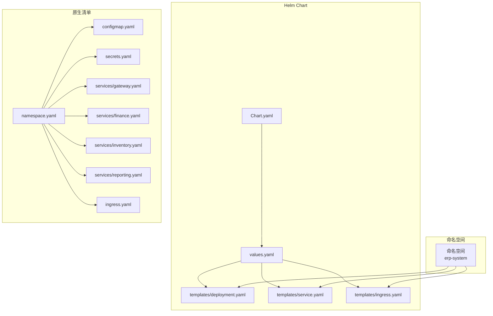
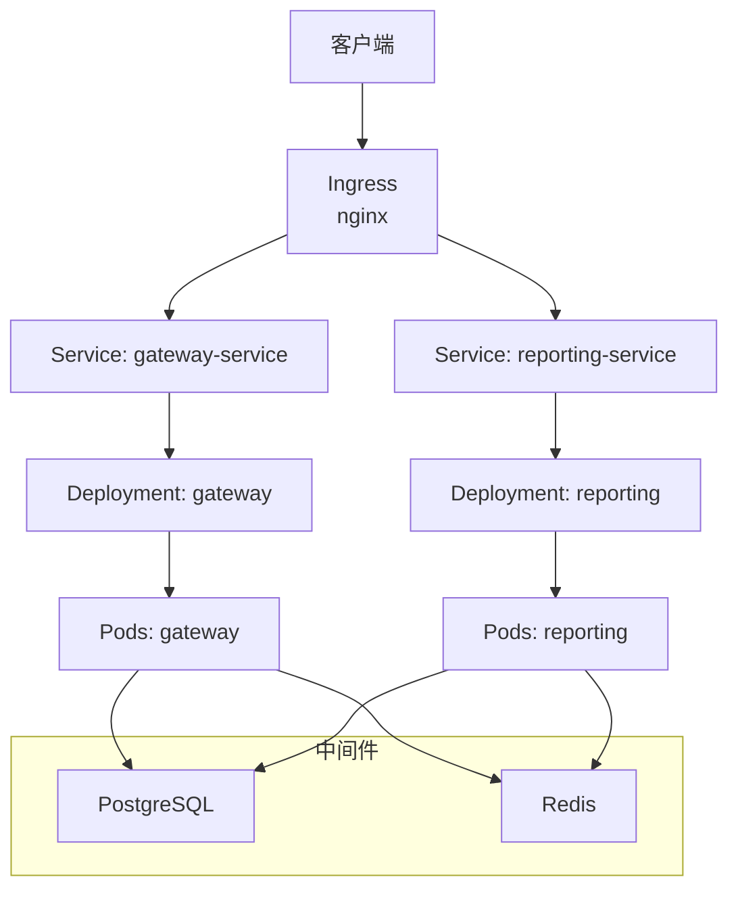
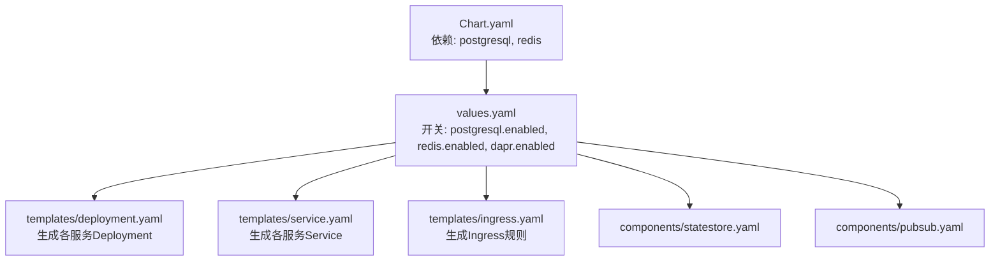
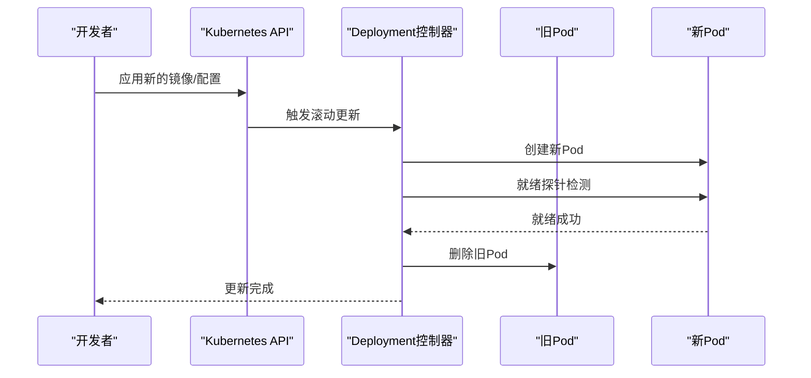
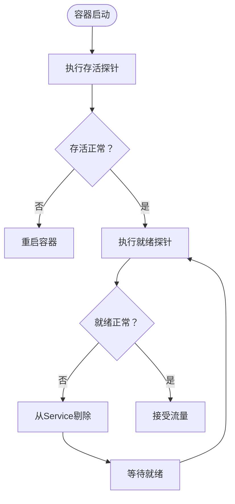

# 资源编排

<cite>
**本文引用的文件**
- [deploy/k8s/services/gateway.yaml](file://deploy/k8s/services/gateway.yaml)
- [deploy/k8s/services/finance.yaml](file://deploy/k8s/services/finance.yaml)
- [deploy/k8s/services/inventory.yaml](file://deploy/k8s/services/inventory.yaml)
- [deploy/k8s/services/reporting.yaml](file://deploy/k8s/services/reporting.yaml)
- [deploy/k8s/configmap.yaml](file://deploy/k8s/configmap.yaml)
- [deploy/k8s/secrets.yaml](file://deploy/k8s/secrets.yaml)
- [deploy/k8s/ingress.yaml](file://deploy/k8s/ingress.yaml)
- [deploy/k8s/namespace.yaml](file://deploy/k8s/namespace.yaml)
- [deploy/helm/erp-system/values.yaml](file://deploy/helm/erp-system/values.yaml)
- [deploy/helm/erp-system/templates/deployment.yaml](file://deploy/helm/erp-system/templates/deployment.yaml)
- [deploy/helm/erp-system/templates/service.yaml](file://deploy/helm/erp-system/templates/service.yaml)
- [deploy/helm/erp-system/templates/ingress.yaml](file://deploy/helm/erp-system/templates/ingress.yaml)
- [deploy/helm/erp-system/Chart.yaml](file://deploy/helm/erp-system/Chart.yaml)
- [docs/deployment.md](file://docs/deployment.md)
- [components/statestore.yaml](file://components/statestore.yaml)
- [components/pubsub.yaml](file://components/pubsub.yaml)
</cite>

## 目录
1. [简介](#简介)
2. [项目结构](#项目结构)
3. [核心组件](#核心组件)
4. [架构总览](#架构总览)
5. [详细组件分析](#详细组件分析)
6. [依赖关系分析](#依赖关系分析)
7. [性能与资源规划](#性能与资源规划)
8. [故障排查指南](#故障排查指南)
9. [结论](#结论)
10. [附录](#附录)

## 简介
本文件面向Kubernetes资源编排，围绕Deployment、StatefulSet与DaemonSet的适用场景与配置差异展开；结合仓库中的网关与业务服务示例，系统阐述滚动更新、蓝绿部署与金丝雀发布策略；同时覆盖Pod生命周期管理、重启策略与存活探针配置；给出资源请求与限制的最佳实践；解释副本数量与可用区分布策略；并提供故障恢复、节点驱逐与优雅停机处理建议，以及资源监控与性能调优指南。

## 项目结构
该仓库采用“Helm Chart + 原生清单”的双轨部署方式：
- Helm Chart：集中定义服务模板、默认值与依赖（PostgreSQL、Redis），统一生成Deployment、Service、Ingress等资源。
- 原生清单：在deploy/k8s目录下提供可直接应用的服务清单，便于快速验证或非Helm环境部署。

图表来源
- [deploy/helm/erp-system/Chart.yaml](file://deploy/helm/erp-system/Chart.yaml#L1-L27)
- [deploy/helm/erp-system/values.yaml](file://deploy/helm/erp-system/values.yaml#L1-L127)
- [deploy/helm/erp-system/templates/deployment.yaml](file://deploy/helm/erp-system/templates/deployment.yaml#L1-L58)
- [deploy/helm/erp-system/templates/service.yaml](file://deploy/helm/erp-system/templates/service.yaml#L1-L22)
- [deploy/helm/erp-system/templates/ingress.yaml](file://deploy/helm/erp-system/templates/ingress.yaml#L1-L47)
- [deploy/k8s/namespace.yaml](file://deploy/k8s/namespace.yaml#L1-L8)
- [deploy/k8s/configmap.yaml](file://deploy/k8s/configmap.yaml#L1-L25)
- [deploy/k8s/secrets.yaml](file://deploy/k8s/secrets.yaml#L1-L19)
- [deploy/k8s/services/gateway.yaml](file://deploy/k8s/services/gateway.yaml#L1-L60)
- [deploy/k8s/services/finance.yaml](file://deploy/k8s/services/finance.yaml#L1-L66)
- [deploy/k8s/services/inventory.yaml](file://deploy/k8s/services/inventory.yaml#L1-L66)
- [deploy/k8s/services/reporting.yaml](file://deploy/k8s/services/reporting.yaml#L1-L64)
- [deploy/k8s/ingress.yaml](file://deploy/k8s/ingress.yaml#L1-L37)

章节来源
- [docs/deployment.md](file://docs/deployment.md#L1-L115)
- [deploy/helm/erp-system/Chart.yaml](file://deploy/helm/erp-system/Chart.yaml#L1-L27)

## 核心组件
- 命名空间：统一隔离资源，避免冲突。
- 配置与密钥：通过ConfigMap与Secret集中管理运行时配置与敏感信息。
- 服务暴露：Gateway作为入口，配合Ingress进行路径路由到不同后端服务。
- Helm模板：以values.yaml为唯一真相，按服务维度生成Deployment与Service，支持复用与扩展。

章节来源
- [deploy/k8s/namespace.yaml](file://deploy/k8s/namespace.yaml#L1-L8)
- [deploy/k8s/configmap.yaml](file://deploy/k8s/configmap.yaml#L1-L25)
- [deploy/k8s/secrets.yaml](file://deploy/k8s/secrets.yaml#L1-L19)
- [deploy/k8s/ingress.yaml](file://deploy/k8s/ingress.yaml#L1-L37)
- [deploy/helm/erp-system/values.yaml](file://deploy/helm/erp-system/values.yaml#L1-L127)
- [deploy/helm/erp-system/templates/deployment.yaml](file://deploy/helm/erp-system/templates/deployment.yaml#L1-L58)
- [deploy/helm/erp-system/templates/service.yaml](file://deploy/helm/erp-system/templates/service.yaml#L1-L22)
- [deploy/helm/erp-system/templates/ingress.yaml](file://deploy/helm/erp-system/templates/ingress.yaml#L1-L47)

## 架构总览
整体架构由“入口网关 + 多个业务服务 + 中间件”构成。Gateway负责统一入口与路由，业务服务通过Service暴露，Ingress根据路径将流量分发至对应后端。中间件（PostgreSQL、Redis）由Helm依赖管理，Dapr组件用于状态存储与消息订阅。

图表来源
- [deploy/k8s/ingress.yaml](file://deploy/k8s/ingress.yaml#L1-L37)
- [deploy/k8s/services/gateway.yaml](file://deploy/k8s/services/gateway.yaml#L1-L60)
- [deploy/k8s/services/reporting.yaml](file://deploy/k8s/services/reporting.yaml#L1-L64)
- [deploy/helm/erp-system/values.yaml](file://deploy/helm/erp-system/values.yaml#L100-L122)

## 详细组件分析

### Deployment、StatefulSet与DaemonSet的使用场景与配置差异
- Deployment：无状态或有状态但不需持久卷独占的业务服务，适合水平扩展与滚动更新。仓库中所有业务服务均采用Deployment，具备副本数控制与滚动升级能力。
- StatefulSet：需要稳定网络标识、持久化存储且对顺序有要求的应用（如数据库主从、消息队列）。仓库未提供示例，但可通过增加volumeClaimTemplates与稳定的headless Service实现。
- DaemonSet：确保每个节点运行一个Pod（如日志采集、节点监控代理）。仓库未提供示例，但可用于Sidecar或节点级任务。

章节来源
- [deploy/k8s/services/gateway.yaml](file://deploy/k8s/services/gateway.yaml#L1-L60)
- [deploy/k8s/services/finance.yaml](file://deploy/k8s/services/finance.yaml#L1-L66)
- [deploy/k8s/services/inventory.yaml](file://deploy/k8s/services/inventory.yaml#L1-L66)
- [deploy/k8s/services/reporting.yaml](file://deploy/k8s/services/reporting.yaml#L1-L64)
- [deploy/helm/erp-system/templates/deployment.yaml](file://deploy/helm/erp-system/templates/deployment.yaml#L1-L58)

### 滚动更新、蓝绿部署与金丝雀发布
- 滚动更新（RollingUpdate）
  - 通过Deployment的滚动更新策略实现，逐步替换旧Pod，保证服务连续性。
  - 关键参数：maxUnavailable、maxSurge，可在values.yaml中为各服务单独配置。
  - 参考路径：[滚动更新策略定义](file://deploy/helm/erp-system/templates/deployment.yaml#L13-L16)

- 蓝绿部署（Blue-Green）
  - 使用两套完全相同的Deployment，通过切换Service选择器实现流量切换。
  - 可在values.yaml中为同一服务定义两组副本，分别指向不同标签集，再通过Service切换。

- 金丝雀发布（Canary）
  - 通过多套Deployment（如v1与v2），按比例将部分流量导入新版本，逐步扩大份额。
  - 结合Ingress注解或外部流量管理（如Istio、NGINX Ingress的权重路由）实现。

章节来源
- [deploy/helm/erp-system/templates/deployment.yaml](file://deploy/helm/erp-system/templates/deployment.yaml#L1-L58)
- [deploy/helm/erp-system/values.yaml](file://deploy/helm/erp-system/values.yaml#L21-L89)

### Pod生命周期管理、重启策略与存活探针
- 重启策略
  - 默认Always，容器退出即重启；可根据服务特性调整（例如批处理任务使用Never+重试策略）。
  - 参考路径：[重启策略位置](file://deploy/helm/erp-system/templates/deployment.yaml#L27-L55)

- 存活探针（livenessProbe）
  - 通过HTTP GET探测健康端点，失败则重启容器。
  - 参考路径：[存活探针定义](file://deploy/k8s/services/gateway.yaml#L35-L40)

- 就绪探针（readinessProbe）
  - 控制Pod是否加入Service后端，避免向未就绪实例转发流量。
  - 参考路径：[就绪探针定义](file://deploy/k8s/services/gateway.yaml#L41-L46)

- 优雅停机（terminationGracePeriodSeconds）
  - 在删除Pod前给应用时间完成收尾（关闭连接、清理资源）。
  - 参考路径：[优雅停机配置位置](file://deploy/helm/erp-system/templates/deployment.yaml#L27-L55)

章节来源
- [deploy/k8s/services/gateway.yaml](file://deploy/k8s/services/gateway.yaml#L35-L46)
- [deploy/k8s/services/finance.yaml](file://deploy/k8s/services/finance.yaml#L41-L52)
- [deploy/k8s/services/inventory.yaml](file://deploy/k8s/services/inventory.yaml#L41-L52)
- [deploy/k8s/services/reporting.yaml](file://deploy/k8s/services/reporting.yaml#L39-L50)
- [deploy/helm/erp-system/templates/deployment.yaml](file://deploy/helm/erp-system/templates/deployment.yaml#L27-L55)

### 资源限制与请求设置最佳实践
- 请求（requests）：保障Pod被调度到有足够资源的节点，避免被驱逐。
- 限制（limits）：防止个别Pod占用过多资源影响集群稳定性。
- 建议
  - CPU：以历史峰值与并发量估算，预留安全余量。
  - 内存：结合GC行为与峰值内存使用，设置合理上限。
  - 可在values.yaml中为各服务单独覆盖，保持一致性与差异化平衡。
- 参考路径：[资源请求与限制](file://deploy/helm/erp-system/values.yaml#L11-L19)，[服务级别覆盖](file://deploy/helm/erp-system/values.yaml#L22-L89)

章节来源
- [deploy/helm/erp-system/values.yaml](file://deploy/helm/erp-system/values.yaml#L11-L19)
- [deploy/helm/erp-system/values.yaml](file://deploy/helm/erp-system/values.yaml#L22-L89)

### 副本数量管理与可用区分布策略
- 副本数量
  - 通过values.yaml统一管理，或在服务级覆盖，满足SLA与成本平衡。
  - 参考路径：[副本数定义](file://deploy/helm/erp-system/values.yaml#L12-L89)

- 可用区分布
  - 使用亲和性/反亲和性与拓扑键，确保Pod跨可用区分布，提升容灾能力。
  - 可在Deployment模板中添加nodeAffinity与topologySpreadConstraints。
  - 参考路径：[模板中可扩展位置](file://deploy/helm/erp-system/templates/deployment.yaml#L13-L26)

章节来源
- [deploy/helm/erp-system/values.yaml](file://deploy/helm/erp-system/values.yaml#L12-L89)
- [deploy/helm/erp-system/templates/deployment.yaml](file://deploy/helm/erp-system/templates/deployment.yaml#L13-L26)

### 故障恢复、节点驱逐与优雅停机
- 节点驱逐
  - 当节点资源紧张时，kubelet会驱逐低QoS Pod（无requests/limits或超出limit）。
  - 建议：为所有Pod设置合理的requests与limits，避免被优先驱逐。

- 优雅停机
  - 设置terminationGracePeriodSeconds，确保应用在Pod终止前完成清理。
  - 参考路径：[优雅停机位置](file://deploy/helm/erp-system/templates/deployment.yaml#L27-L55)

- 探针失败与重启
  - livenessProbe失败触发重启；readinessProbe失败阻止流量进入。
  - 参考路径：[探针定义](file://deploy/k8s/services/gateway.yaml#L35-L46)

章节来源
- [deploy/k8s/services/gateway.yaml](file://deploy/k8s/services/gateway.yaml#L35-L46)
- [deploy/helm/erp-system/templates/deployment.yaml](file://deploy/helm/erp-system/templates/deployment.yaml#L27-L55)

### 资源使用监控与性能调优
- 监控栈
  - Prometheus + Grafana + Kubernetes原生指标，结合服务暴露的健康端点进行观测。
  - 参考路径：[监控建议](file://docs/deployment.md#L109-L114)

- 性能调优
  - 调整副本数与资源配额，观察延迟与错误率。
  - 使用HPA（基于CPU/内存或自定义指标）自动扩缩容（需在模板中启用）。
  - 参考路径：[健康检查端点](file://docs/deployment.md#L103-L107)

章节来源
- [docs/deployment.md](file://docs/deployment.md#L103-L114)

## 依赖关系分析
Helm Chart定义了PostgreSQL与Redis依赖，values.yaml中开启与否决定是否安装；Dapr组件通过独立文件声明，与业务服务通过annotations集成。

图表来源
- [deploy/helm/erp-system/Chart.yaml](file://deploy/helm/erp-system/Chart.yaml#L18-L27)
- [deploy/helm/erp-system/values.yaml](file://deploy/helm/erp-system/values.yaml#L100-L122)
- [deploy/helm/erp-system/templates/deployment.yaml](file://deploy/helm/erp-system/templates/deployment.yaml#L1-L58)
- [deploy/helm/erp-system/templates/service.yaml](file://deploy/helm/erp-system/templates/service.yaml#L1-L22)
- [deploy/helm/erp-system/templates/ingress.yaml](file://deploy/helm/erp-system/templates/ingress.yaml#L1-L47)
- [components/statestore.yaml](file://components/statestore.yaml#L1-L13)
- [components/pubsub.yaml](file://components/pubsub.yaml#L1-L13)

章节来源
- [deploy/helm/erp-system/Chart.yaml](file://deploy/helm/erp-system/Chart.yaml#L18-L27)
- [deploy/helm/erp-system/values.yaml](file://deploy/helm/erp-system/values.yaml#L100-L122)

## 性能与资源规划
- 资源规划
  - 以服务类型与负载特征为依据，区分CPU密集型与IO密集型，分别设置requests与limits。
  - 对于高并发服务（如网关），适当提高副本数与CPU上限，避免单点瓶颈。
- 扩展策略
  - 横向扩展：通过增加副本数与Service负载均衡。
  - 纵向扩展：根据监控数据逐步提升requests/limits。
- 调度优化
  - 使用节点选择器/污点容忍，将有状态服务调度到专用节点。
  - 使用拓扑分散策略，避免同质化Pod集中在同一AZ。

[本节为通用指导，无需特定文件来源]

## 故障排查指南
- 健康检查失败
  - 检查livenessProbe/readinessProbe路径与端口是否正确。
  - 参考路径：[健康端点说明](file://docs/deployment.md#L103-L107)

- 资源不足导致反复重启
  - 提升requests/limits或减少并发峰值。
  - 参考路径：[资源限制定义](file://deploy/helm/erp-system/values.yaml#L11-L19)

- Ingress无法访问
  - 校验IngressClassName、host与路径规则，确认后端Service名称与端口一致。
  - 参考路径：[Ingress配置](file://deploy/k8s/ingress.yaml#L1-L37)，[Helm Ingress模板](file://deploy/helm/erp-system/templates/ingress.yaml#L1-L47)

- 密钥与配置问题
  - 确认ConfigMap/Secret已创建且被容器正确挂载。
  - 参考路径：[ConfigMap](file://deploy/k8s/configmap.yaml#L1-L25)，[Secret](file://deploy/k8s/secrets.yaml#L1-L19)

章节来源
- [docs/deployment.md](file://docs/deployment.md#L103-L107)
- [deploy/helm/erp-system/values.yaml](file://deploy/helm/erp-system/values.yaml#L11-L19)
- [deploy/k8s/ingress.yaml](file://deploy/k8s/ingress.yaml#L1-L37)
- [deploy/helm/erp-system/templates/ingress.yaml](file://deploy/helm/erp-system/templates/ingress.yaml#L1-L47)
- [deploy/k8s/configmap.yaml](file://deploy/k8s/configmap.yaml#L1-L25)
- [deploy/k8s/secrets.yaml](file://deploy/k8s/secrets.yaml#L1-L19)

## 结论
本项目通过Helm实现了标准化、可维护的微服务编排，结合原生清单便于快速落地。Deployment适配当前无状态/有状态但无独占持久卷的服务形态；通过滚动更新、蓝绿与金丝雀策略可平滑演进；借助探针、资源配额与Ingress路由形成完整的可观测与高可用体系。后续可在模板中引入HPA、拓扑分散与更细粒度的探针策略，进一步增强弹性与韧性。

[本节为总结性内容，无需特定文件来源]

## 附录

### 关键流程图：滚动更新序列

图表来源
- [deploy/helm/erp-system/templates/deployment.yaml](file://deploy/helm/erp-system/templates/deployment.yaml#L13-L16)
- [deploy/k8s/services/gateway.yaml](file://deploy/k8s/services/gateway.yaml#L35-L46)

### 关键流程图：探针决策流

图表来源
- [deploy/k8s/services/gateway.yaml](file://deploy/k8s/services/gateway.yaml#L35-L46)