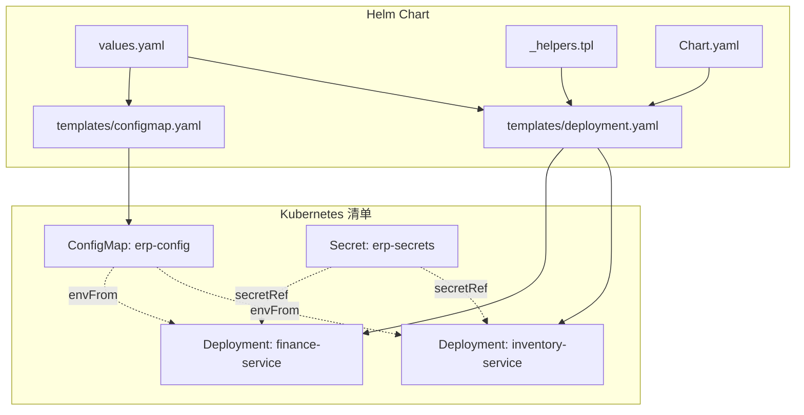
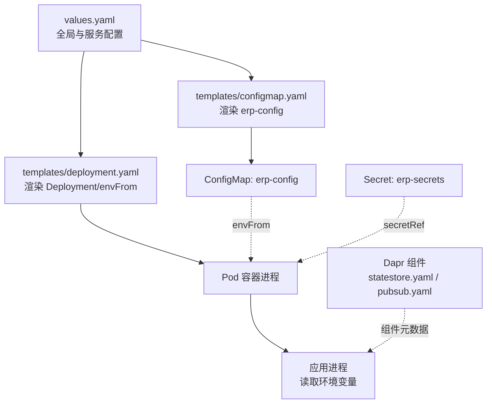
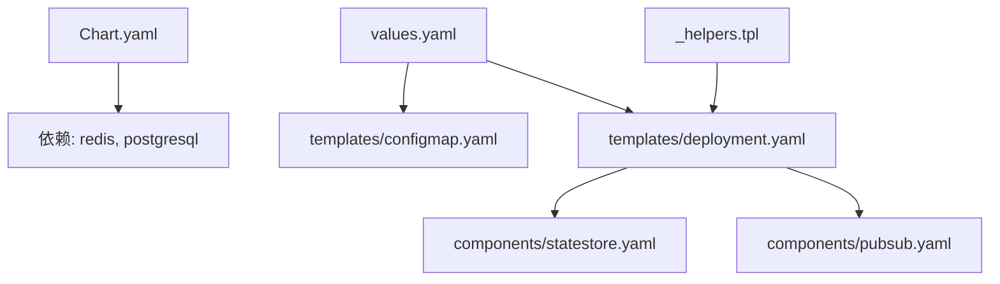

# 配置管理

<cite>
**本文引用的文件**
- [deploy/k8s/configmap.yaml](file://deploy/k8s/configmap.yaml)
- [deploy/k8s/secrets.yaml](file://deploy/k8s/secrets.yaml)
- [deploy/k8s/services/finance.yaml](file://deploy/k8s/services/finance.yaml)
- [deploy/k8s/services/inventory.yaml](file://deploy/k8s/services/inventory.yaml)
- [deploy/helm/erp-system/values.yaml](file://deploy/helm/erp-system/values.yaml)
- [deploy/helm/erp-system/templates/_helpers.tpl](file://deploy/helm/erp-system/templates/_helpers.tpl)
- [deploy/helm/erp-system/templates/configmap.yaml](file://deploy/helm/erp-system/templates/configmap.yaml)
- [deploy/helm/erp-system/templates/deployment.yaml](file://deploy/helm/erp-system/templates/deployment.yaml)
- [deploy/helm/erp-system/Chart.yaml](file://deploy/helm/erp-system/Chart.yaml)
- [docs/deployment.md](file://docs/deployment.md)
- [components/statestore.yaml](file://components/statestore.yaml)
- [components/pubsub.yaml](file://components/pubsub.yaml)
- [src/Gateways/ErpSystem.Gateway/appsettings.json](file://src/Gateways/ErpSystem.Gateway/appsettings.json)
- [src/Services/Finance/ErpSystem.Finance/appsettings.json](file://src/Services/Finance/ErpSystem.Finance/appsettings.json)
- [src/Services/Inventory/ErpSystem.Inventory/appsettings.json](file://src/Services/Inventory/ErpSystem.Inventory/appsettings.json)
</cite>

## 目录
1. [简介](#简介)
2. [项目结构](#项目结构)
3. [核心组件](#核心组件)
4. [架构总览](#架构总览)
5. [详细组件分析](#详细组件分析)
6. [依赖关系分析](#依赖关系分析)
7. [性能考量](#性能考量)
8. [故障排查指南](#故障排查指南)
9. [结论](#结论)
10. [附录](#附录)

## 简介
本文件系统性阐述该ERP微服务项目在Kubernetes中的配置管理方案，覆盖ConfigMap与Secret的差异与使用边界、敏感信息保护与非敏感配置分离、配置创建与更新、热重载机制、环境变量注入与卷挂载方式、密钥管理最佳实践（含加密存储与访问控制）、配置版本管理与回滚策略、配置验证与测试、部署流程以及常见配置错误的诊断与修复方法。文档以仓库中现有的Kubernetes清单与Helm模板为依据，结合应用层配置文件，给出可操作的实践建议。

## 项目结构
本项目在部署层面采用两种方式：
- 原生Kubernetes清单：通过独立的ConfigMap与Secret定义非敏感与敏感配置，再由各服务Deployment通过envFrom引用。
- Helm Chart：通过values.yaml集中管理全局与服务级配置，模板动态生成ConfigMap、Deployment等资源。

图表来源
- [deploy/k8s/configmap.yaml](file://deploy/k8s/configmap.yaml#L1-L25)
- [deploy/k8s/secrets.yaml](file://deploy/k8s/secrets.yaml#L1-L19)
- [deploy/k8s/services/finance.yaml](file://deploy/k8s/services/finance.yaml#L29-L33)
- [deploy/k8s/services/inventory.yaml](file://deploy/k8s/services/inventory.yaml#L29-L33)
- [deploy/helm/erp-system/values.yaml](file://deploy/helm/erp-system/values.yaml#L1-L127)
- [deploy/helm/erp-system/templates/configmap.yaml](file://deploy/helm/erp-system/templates/configmap.yaml#L1-L20)
- [deploy/helm/erp-system/templates/deployment.yaml](file://deploy/helm/erp-system/templates/deployment.yaml#L37-L41)
- [deploy/helm/erp-system/templates/_helpers.tpl](file://deploy/helm/erp-system/templates/_helpers.tpl#L1-L51)
- [deploy/helm/erp-system/Chart.yaml](file://deploy/helm/erp-system/Chart.yaml#L1-L27)

章节来源
- [deploy/k8s/configmap.yaml](file://deploy/k8s/configmap.yaml#L1-L25)
- [deploy/k8s/secrets.yaml](file://deploy/k8s/secrets.yaml#L1-L19)
- [deploy/helm/erp-system/values.yaml](file://deploy/helm/erp-system/values.yaml#L1-L127)
- [deploy/helm/erp-system/templates/configmap.yaml](file://deploy/helm/erp-system/templates/configmap.yaml#L1-L20)
- [deploy/helm/erp-system/templates/deployment.yaml](file://deploy/helm/erp-system/templates/deployment.yaml#L1-L58)
- [deploy/helm/erp-system/templates/_helpers.tpl](file://deploy/helm/erp-system/templates/_helpers.tpl#L1-L51)
- [deploy/helm/erp-system/Chart.yaml](file://deploy/helm/erp-system/Chart.yaml#L1-L27)
- [docs/deployment.md](file://docs/deployment.md#L1-L115)

## 核心组件
- ConfigMap：用于存放非敏感配置键值对，如运行环境、Dapr端口、数据库连接串（不含密码）、Redis地址、服务间URL映射等。
- Secret：用于存放敏感数据，如数据库密码、JWT密钥、Redis密码、Dapr API Token等。
- Deployment：通过envFrom同时引用ConfigMap与Secret，实现环境变量注入；部分服务也通过卷挂载方式读取Secret（见后续“卷挂载”小节）。
- Helm Values与模板：集中管理全局命名空间、副本数、镜像、Ingress域名、数据库与缓存启用状态等；模板根据条件渲染ConfigMap与Deployment。

章节来源
- [deploy/k8s/configmap.yaml](file://deploy/k8s/configmap.yaml#L1-L25)
- [deploy/k8s/secrets.yaml](file://deploy/k8s/secrets.yaml#L1-L19)
- [deploy/helm/erp-system/values.yaml](file://deploy/helm/erp-system/values.yaml#L1-L127)
- [deploy/helm/erp-system/templates/configmap.yaml](file://deploy/helm/erp-system/templates/configmap.yaml#L1-L20)
- [deploy/helm/erp-system/templates/deployment.yaml](file://deploy/helm/erp-system/templates/deployment.yaml#L37-L41)

## 架构总览
下图展示配置在Kubernetes中的流向：Helm根据values渲染ConfigMap与Deployment；Pod启动时通过envFrom注入环境变量；应用从配置中心或环境变量读取参数；Dapr组件通过独立的statestore与pubsub组件文件进行状态与消息订阅配置。

图表来源
- [deploy/helm/erp-system/values.yaml](file://deploy/helm/erp-system/values.yaml#L1-L127)
- [deploy/helm/erp-system/templates/configmap.yaml](file://deploy/helm/erp-system/templates/configmap.yaml#L1-L20)
- [deploy/helm/erp-system/templates/deployment.yaml](file://deploy/helm/erp-system/templates/deployment.yaml#L37-L41)
- [deploy/k8s/configmap.yaml](file://deploy/k8s/configmap.yaml#L1-L25)
- [deploy/k8s/secrets.yaml](file://deploy/k8s/secrets.yaml#L1-L19)
- [components/statestore.yaml](file://components/statestore.yaml#L1-L13)
- [components/pubsub.yaml](file://components/pubsub.yaml#L1-L13)

## 详细组件分析

### ConfigMap 与 Secret 的区别与使用场景
- 区别
  - ConfigMap：明文键值对，适合非敏感配置，如运行环境、端口、服务URL、缓存地址等。
  - Secret：二进制或敏感文本，适合密码、密钥、令牌等，Kubernetes会以安全方式存储。
- 使用场景
  - 非敏感配置：ASPNETCORE_ENVIRONMENT、DAPR_HTTP_PORT、DAPR_GRPC_PORT、Redis地址、服务间URL映射等。
  - 敏感配置：数据库密码、JWT密钥、Redis密码、Dapr API Token等。

章节来源
- [deploy/k8s/configmap.yaml](file://deploy/k8s/configmap.yaml#L7-L24)
- [deploy/k8s/secrets.yaml](file://deploy/k8s/secrets.yaml#L8-L18)

### 配置创建与更新
- 创建
  - 使用原生清单：先apply ConfigMap与Secret，再apply各服务Deployment。
  - 使用Helm：helm install/upgrade时，Chart根据values渲染并创建资源。
- 更新
  - ConfigMap：支持滚动更新，容器内可通过重新加载或重启触发新配置生效（见“热重载机制”）。
  - Secret：同样支持滚动更新，但需注意容器内读取方式与刷新策略。

章节来源
- [docs/deployment.md](file://docs/deployment.md#L63-L76)
- [docs/deployment.md](file://docs/deployment.md#L26-L44)
- [deploy/helm/erp-system/templates/configmap.yaml](file://deploy/helm/erp-system/templates/configmap.yaml#L1-L20)
- [deploy/helm/erp-system/templates/deployment.yaml](file://deploy/helm/erp-system/templates/deployment.yaml#L37-L41)

### 热重载机制
- ConfigMap热重载
  - Kubernetes支持通过envFrom自动传播变更，但具体应用是否实时感知取决于其配置读取机制。若应用未实现动态重载，通常需要滚动更新触发新Pod拉起。
- Secret热重载
  - Secret滚动更新后，Pod内的挂载路径会更新，但同样需要应用具备动态刷新能力或通过滚动更新生效。
- 实践建议
  - 对于关键配置（如数据库连接、缓存地址），建议在应用侧实现配置变更监听与重载逻辑，避免停机切换。
  - 对于敏感配置（如密钥、密码），优先通过卷挂载而非环境变量注入，降低泄露风险。

章节来源
- [deploy/helm/erp-system/templates/deployment.yaml](file://deploy/helm/erp-system/templates/deployment.yaml#L37-L41)

### 环境变量注入与卷挂载
- 环境变量注入
  - 通过envFrom同时引用ConfigMap与Secret，实现键值注入到容器环境变量。
- 卷挂载
  - 可通过volumeMounts将Secret作为文件挂载至容器路径，供应用按文件读取（例如读取证书、密钥文件）。当前仓库中未显式展示卷挂载示例，可在Deployment中扩展实现。

章节来源
- [deploy/k8s/services/finance.yaml](file://deploy/k8s/services/finance.yaml#L29-L33)
- [deploy/k8s/services/inventory.yaml](file://deploy/k8s/services/inventory.yaml#L29-L33)
- [deploy/helm/erp-system/templates/deployment.yaml](file://deploy/helm/erp-system/templates/deployment.yaml#L37-L41)

### 密钥管理最佳实践
- 加密存储
  - 将敏感数据放入Secret，避免硬编码在ConfigMap或镜像中。
- 访问控制
  - 限制命名空间与RBAC权限，仅授权必要服务账户访问对应Secret。
- 轮换策略
  - 定期轮换数据库密码、JWT密钥、Dapr API Token等；更新后通过滚动升级使新Pod生效。
- 最小权限
  - 仅授予服务所需的最小权限，避免过度授权。

章节来源
- [deploy/k8s/secrets.yaml](file://deploy/k8s/secrets.yaml#L1-L19)
- [deploy/helm/erp-system/values.yaml](file://deploy/helm/erp-system/values.yaml#L100-L116)

### 配置版本管理与回滚策略
- 版本管理
  - 使用Helm进行版本化管理，values文件按环境拆分（如values-prod.yaml、values-staging.yaml）。
- 回滚策略
  - 使用helm rollback快速回退至上一个版本；结合ConfigMap/Secret的变更历史，定位问题版本。
- 环境隔离
  - 通过不同values文件区分开发、测试、生产环境，避免误操作。

章节来源
- [docs/deployment.md](file://docs/deployment.md#L93-L101)
- [docs/deployment.md](file://docs/deployment.md#L42-L44)
- [deploy/helm/erp-system/values.yaml](file://deploy/helm/erp-system/values.yaml#L1-L127)

### 配置验证、测试与部署流程
- 验证
  - 部署后使用kubectl检查Pod、Service、Ingress状态，确认健康探针通过。
- 测试
  - 通过调用服务的健康端点（/health、/health/ready）验证配置正确性。
- 部署
  - 推荐使用Helm安装/升级；也可直接应用原生清单。

章节来源
- [docs/deployment.md](file://docs/deployment.md#L46-L57)
- [docs/deployment.md](file://docs/deployment.md#L26-L44)
- [docs/deployment.md](file://docs/deployment.md#L59-L76)

### 应用层配置与Kubernetes配置的衔接
- 应用通过环境变量读取配置，如数据库连接字符串、日志级别、允许主机等。
- Gateway通过appsettings.json定义反向代理路由与集群地址；在K8s中这些地址应指向内部服务DNS名称。

章节来源
- [src/Services/Finance/ErpSystem.Finance/appsettings.json](file://src/Services/Finance/ErpSystem.Finance/appsettings.json#L1-L12)
- [src/Services/Inventory/ErpSystem.Inventory/appsettings.json](file://src/Services/Inventory/ErpSystem.Inventory/appsettings.json#L1-L10)
- [src/Gateways/ErpSystem.Gateway/appsettings.json](file://src/Gateways/ErpSystem.Gateway/appsettings.json#L1-L229)

## 依赖关系分析
- Helm Chart依赖PostgreSQL与Redis子Chart，通过condition启用与否控制ConfigMap中数据库与缓存地址的渲染。
- Deployment模板通过helpers生成标签与选择器，确保资源一致性。
- Dapr组件通过独立的statestore与pubsub组件文件定义，与应用配置协同工作。

图表来源
- [deploy/helm/erp-system/Chart.yaml](file://deploy/helm/erp-system/Chart.yaml#L18-L27)
- [deploy/helm/erp-system/values.yaml](file://deploy/helm/erp-system/values.yaml#L100-L123)
- [deploy/helm/erp-system/templates/configmap.yaml](file://deploy/helm/erp-system/templates/configmap.yaml#L13-L19)
- [deploy/helm/erp-system/templates/deployment.yaml](file://deploy/helm/erp-system/templates/deployment.yaml#L22-L26)
- [deploy/helm/erp-system/templates/_helpers.tpl](file://deploy/helm/erp-system/templates/_helpers.tpl#L23-L28)
- [components/statestore.yaml](file://components/statestore.yaml#L1-L13)
- [components/pubsub.yaml](file://components/pubsub.yaml#L1-L13)

章节来源
- [deploy/helm/erp-system/Chart.yaml](file://deploy/helm/erp-system/Chart.yaml#L18-L27)
- [deploy/helm/erp-system/values.yaml](file://deploy/helm/erp-system/values.yaml#L100-L123)
- [deploy/helm/erp-system/templates/configmap.yaml](file://deploy/helm/erp-system/templates/configmap.yaml#L13-L19)
- [deploy/helm/erp-system/templates/deployment.yaml](file://deploy/helm/erp-system/templates/deployment.yaml#L22-L26)
- [deploy/helm/erp-system/templates/_helpers.tpl](file://deploy/helm/erp-system/templates/_helpers.tpl#L23-L28)
- [components/statestore.yaml](file://components/statestore.yaml#L1-L13)
- [components/pubsub.yaml](file://components/pubsub.yaml#L1-L13)

## 性能考量
- 合理设置资源请求与限制，避免因配置过多导致内存压力。
- 使用健康探针（liveness/readiness）保障服务可用性，减少无效流量。
- 在高并发场景下，建议将热点配置放入缓存（如Redis），并通过ConfigMap统一管理缓存地址。

## 故障排查指南
- 症状：Pod处于CrashLoopBackOff
  - 检查ConfigMap/Secret是否正确创建且键名匹配应用期望。
  - 确认envFrom引用的ConfigMap/Secret名称与命名空间一致。
- 症状：服务无法连接数据库或缓存
  - 核对ConnectionStrings与Redis地址是否随Helm启用状态正确渲染。
  - 检查PostgreSQL/Redis子Chart是否成功部署。
- 症状：健康探针失败
  - 查看Pod日志，确认应用已正确读取环境变量并监听预期端口。
- 症状：Dapr组件不可用
  - 检查statestore与pubsub组件文件是否正确部署，容器内Dapr注解是否启用。

章节来源
- [deploy/helm/erp-system/templates/deployment.yaml](file://deploy/helm/erp-system/templates/deployment.yaml#L44-L55)
- [deploy/helm/erp-system/templates/configmap.yaml](file://deploy/helm/erp-system/templates/configmap.yaml#L13-L19)
- [components/statestore.yaml](file://components/statestore.yaml#L1-L13)
- [components/pubsub.yaml](file://components/pubsub.yaml#L1-L13)

## 结论
本项目通过ConfigMap与Secret实现了非敏感与敏感配置的清晰分离，并结合Helm实现了配置的集中化与版本化管理。通过envFrom注入与健康探针保障了配置的正确下发与服务可用性。建议在应用侧进一步完善配置动态重载能力，并强化Secret的访问控制与轮换策略，以提升整体安全性与可维护性。

## 附录
- 关键配置键参考
  - 运行环境：ASPNETCORE_ENVIRONMENT
  - Dapr端口：DAPR_HTTP_PORT、DAPR_GRPC_PORT
  - 数据库连接：ConnectionStrings__DefaultConnection（密码建议放入Secret）
  - 缓存地址：Redis__Configuration
  - 服务URL映射：ServiceUrls__*（内部K8s DNS）

章节来源
- [deploy/k8s/configmap.yaml](file://deploy/k8s/configmap.yaml#L7-L24)
- [deploy/k8s/secrets.yaml](file://deploy/k8s/secrets.yaml#L8-L18)
- [deploy/helm/erp-system/templates/configmap.yaml](file://deploy/helm/erp-system/templates/configmap.yaml#L9-L19)