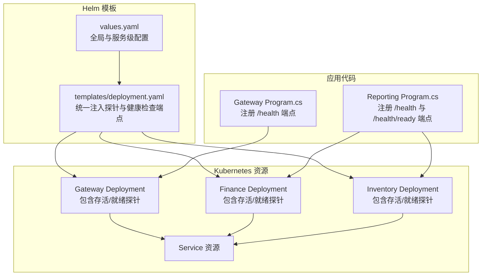
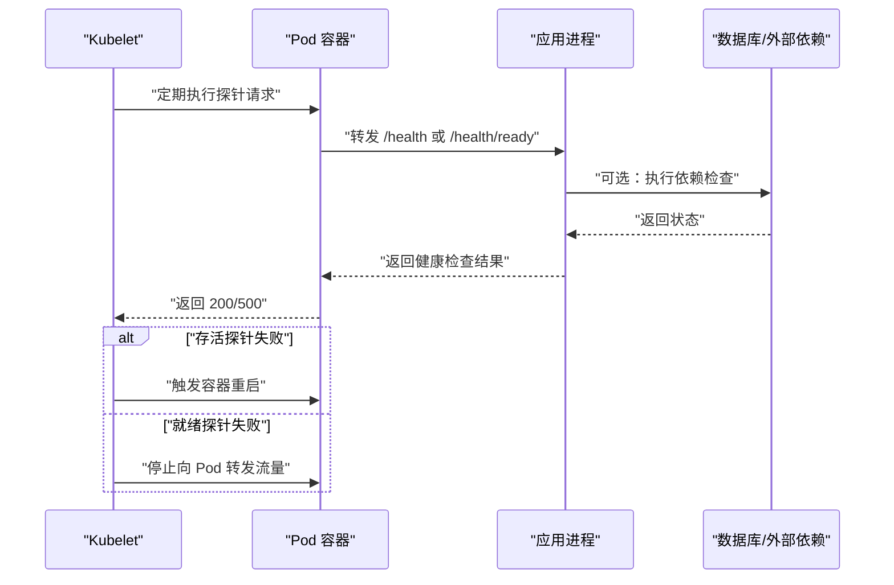
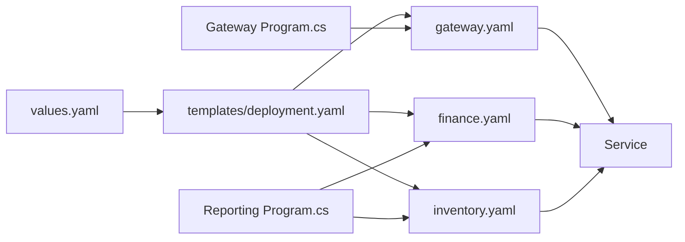

# 健康检查与探针

<cite>
**本文引用的文件**
- [deploy/k8s/services/gateway.yaml](file://deploy/k8s/services/gateway.yaml)
- [deploy/k8s/services/finance.yaml](file://deploy/k8s/services/finance.yaml)
- [deploy/k8s/services/inventory.yaml](file://deploy/k8s/services/inventory.yaml)
- [deploy/helm/erp-system/values.yaml](file://deploy/helm/erp-system/values.yaml)
- [deploy/helm/erp-system/templates/deployment.yaml](file://deploy/helm/erp-system/templates/deployment.yaml)
- [src/Gateways/ErpSystem.Gateway/Program.cs](file://src/Gateways/ErpSystem.Gateway/Program.cs)
- [src/Services/Reporting/ErpSystem.Reporting/Program.cs](file://src/Services/Reporting/ErpSystem.Reporting/Program.cs)
- [src/BuildingBlocks/ErpSystem.BuildingBlocks/Observability/ObservabilityExtensions.cs](file://src/BuildingBlocks/ErpSystem.BuildingBlocks/Observability/ObservabilityExtensions.cs)
</cite>

## 目录
1. [引言](#引言)
2. [项目结构](#项目结构)
3. [核心组件](#核心组件)
4. [架构总览](#架构总览)
5. [详细组件分析](#详细组件分析)
6. [依赖关系分析](#依赖关系分析)
7. [性能考量](#性能考量)
8. [故障排查指南](#故障排查指南)
9. [结论](#结论)
10. [附录](#附录)

## 引言
本文件围绕健康检查与探针系统进行系统化梳理，覆盖以下关键主题：
- 存活探针（Liveness Probe）、就绪探针（Readiness Probe）与启动探针（Startup Probe）的配置与行为差异
- 健康检查端点的实现与路由映射
- 自定义健康检查逻辑与依赖服务检查的扩展方式
- 探针超时、重试与失败处理策略
- Kubernetes 集成、容器重启策略与滚动更新配置
- 健康检查最佳实践、性能影响分析与故障排查方法
- 健康检查在服务可用性保障与自动恢复中的作用

## 项目结构
本项目采用多服务微架构，通过 Helm 模板统一生成 Deployment，并在 K8s 中为各服务配置存活与就绪探针。健康检查端点在部分服务中显式注册，另一些服务通过通用模板统一注入。

图表来源
- [deploy/helm/erp-system/templates/deployment.yaml](file://deploy/helm/erp-system/templates/deployment.yaml#L44-L55)
- [deploy/helm/erp-system/values.yaml](file://deploy/helm/erp-system/values.yaml#L1-L127)
- [deploy/k8s/services/gateway.yaml](file://deploy/k8s/services/gateway.yaml#L35-L46)
- [deploy/k8s/services/finance.yaml](file://deploy/k8s/services/finance.yaml#L41-L52)
- [deploy/k8s/services/inventory.yaml](file://deploy/k8s/services/inventory.yaml#L41-L52)
- [src/Gateways/ErpSystem.Gateway/Program.cs](file://src/Gateways/ErpSystem.Gateway/Program.cs#L80-L80)
- [src/Services/Reporting/ErpSystem.Reporting/Program.cs](file://src/Services/Reporting/ErpSystem.Reporting/Program.cs#L29-L30)

章节来源
- [deploy/helm/erp-system/templates/deployment.yaml](file://deploy/helm/erp-system/templates/deployment.yaml#L1-L58)
- [deploy/helm/erp-system/values.yaml](file://deploy/helm/erp-system/values.yaml#L1-L127)
- [deploy/k8s/services/gateway.yaml](file://deploy/k8s/services/gateway.yaml#L1-L60)
- [deploy/k8s/services/finance.yaml](file://deploy/k8s/services/finance.yaml#L1-L66)
- [deploy/k8s/services/inventory.yaml](file://deploy/k8s/services/inventory.yaml#L1-L66)
- [src/Gateways/ErpSystem.Gateway/Program.cs](file://src/Gateways/ErpSystem.Gateway/Program.cs#L1-L107)
- [src/Services/Reporting/ErpSystem.Reporting/Program.cs](file://src/Services/Reporting/ErpSystem.Reporting/Program.cs#L1-L34)

## 核心组件
- 探针配置来源
  - Helm 模板统一注入：在模板中为所有启用的服务添加存活与就绪探针，路径分别为 /health 与 /health/ready，初始延迟与周期可在模板中集中调整。
  - K8s 清单独立配置：Gateway、Finance、Inventory 的 Deployment 明确声明了探针参数，便于按服务差异化调优。
- 健康检查端点
  - Gateway：显式注册 /health 端点。
  - Reporting：显式注册 /health 与 /health/ready 端点。
  - 其他服务：通过 Helm 模板统一注入健康检查中间件或端点映射，确保一致性。
- 观测性与指标
  - 通过观测性扩展模块注册日志、指标与追踪，辅助定位探针失败原因与性能瓶颈。

章节来源
- [deploy/helm/erp-system/templates/deployment.yaml](file://deploy/helm/erp-system/templates/deployment.yaml#L44-L55)
- [deploy/k8s/services/gateway.yaml](file://deploy/k8s/services/gateway.yaml#L35-L46)
- [deploy/k8s/services/finance.yaml](file://deploy/k8s/services/finance.yaml#L41-L52)
- [deploy/k8s/services/inventory.yaml](file://deploy/k8s/services/inventory.yaml#L41-L52)
- [src/Gateways/ErpSystem.Gateway/Program.cs](file://src/Gateways/ErpSystem.Gateway/Program.cs#L80-L80)
- [src/Services/Reporting/ErpSystem.Reporting/Program.cs](file://src/Services/Reporting/ErpSystem.Reporting/Program.cs#L29-L30)
- [src/BuildingBlocks/ErpSystem.BuildingBlocks/Observability/ObservabilityExtensions.cs](file://src/BuildingBlocks/ErpSystem.BuildingBlocks/Observability/ObservabilityExtensions.cs#L1-L44)

## 架构总览
下图展示健康检查在 Kubernetes 与应用之间的交互流程，以及探针参数如何影响 Pod 生命周期与流量控制。

图表来源
- [deploy/helm/erp-system/templates/deployment.yaml](file://deploy/helm/erp-system/templates/deployment.yaml#L44-L55)
- [src/Gateways/ErpSystem.Gateway/Program.cs](file://src/Gateways/ErpSystem.Gateway/Program.cs#L80-L80)
- [src/Services/Reporting/ErpSystem.Reporting/Program.cs](file://src/Services/Reporting/ErpSystem.Reporting/Program.cs#L29-L30)

## 详细组件分析

### 探针配置与行为
- 存活探针（Liveness）
  - 目的：判断容器是否“存活”，失败时触发重启。
  - 配置位置：Helm 模板与 K8s 清单均提供示例；模板默认路径为 /health，初始延迟与周期可集中管理。
- 就绪探针（Readiness）
  - 目的：判断容器是否“就绪”，未就绪时不接收流量。
  - 配置位置：模板与清单均提供示例；模板默认路径为 /health/ready。
- 启动探针（Startup）
  - 目的：避免应用启动阶段被误判为失败。
  - 当前仓库未发现显式配置，建议在长时间初始化或预热场景中启用。

章节来源
- [deploy/helm/erp-system/templates/deployment.yaml](file://deploy/helm/erp-system/templates/deployment.yaml#L44-L55)
- [deploy/k8s/services/gateway.yaml](file://deploy/k8s/services/gateway.yaml#L35-L46)
- [deploy/k8s/services/finance.yaml](file://deploy/k8s/services/finance.yaml#L41-L52)
- [deploy/k8s/services/inventory.yaml](file://deploy/k8s/services/inventory.yaml#L41-L52)

### 健康检查端点实现
- Gateway
  - 在应用启动后注册 /health 端点，用于存活探针访问。
- Reporting
  - 注册 /health 与 /health/ready 两个端点，分别用于存活与就绪探针。
- 其他服务
  - 通过 Helm 模板统一注入健康检查中间件或端点映射，确保一致性与可维护性。

章节来源
- [src/Gateways/ErpSystem.Gateway/Program.cs](file://src/Gateways/ErpSystem.Gateway/Program.cs#L80-L80)
- [src/Services/Reporting/ErpSystem.Reporting/Program.cs](file://src/Services/Reporting/ErpSystem.Reporting/Program.cs#L29-L30)
- [deploy/helm/erp-system/templates/deployment.yaml](file://deploy/helm/erp-system/templates/deployment.yaml#L44-L55)

### 自定义健康检查逻辑与依赖服务检查
- 可扩展点
  - 在应用中注册自定义健康检查检查器，对数据库连接、缓存、消息总线等依赖进行检查。
  - 结合观测性模块输出日志与指标，便于定位失败原因。
- 实施建议
  - 将关键依赖检查封装为独立健康检查项，避免单一检查项阻塞整体健康判定。
  - 对外部依赖使用短超时与快速失败策略，防止探针成为性能瓶颈。

章节来源
- [src/BuildingBlocks/ErpSystem.BuildingBlocks/Observability/ObservabilityExtensions.cs](file://src/BuildingBlocks/ErpSystem.BuildingBlocks/Observability/ObservabilityExtensions.cs#L1-L44)

### 探针超时设置、重试策略与失败处理
- 超时与周期
  - 模板与清单示例提供了初始延迟与周期的参考值，可根据服务启动时间与依赖复杂度调整。
- 重试策略
  - 应用层可通过弹性策略（如指数退避重试、断路器）提升对外部依赖的容错能力，减少探针抖动。
- 失败处理
  - 存活探针失败触发容器重启；就绪探针失败阻止流量进入，待恢复后再开放。
  - 建议结合滚动更新策略与探针参数，降低变更对用户的影响。

章节来源
- [deploy/helm/erp-system/templates/deployment.yaml](file://deploy/helm/erp-system/templates/deployment.yaml#L44-L55)
- [src/Gateways/ErpSystem.Gateway/Program.cs](file://src/Gateways/ErpSystem.Gateway/Program.cs#L30-L58)

### Kubernetes 集成、容器重启策略与滚动更新配置
- 集成要点
  - 通过 Helm 模板统一注入探针与健康检查端点，确保各服务一致。
  - K8s 清单示例展示了探针参数的具体写法，便于按需微调。
- 重启策略
  - 存活探针失败将触发容器重启，应配合合理的探针超时与周期，避免频繁重启。
- 滚动更新
  - 建议在滚动更新时保留足够的副本数，结合就绪探针确保新旧实例交替期间无流量中断。

章节来源
- [deploy/helm/erp-system/values.yaml](file://deploy/helm/erp-system/values.yaml#L1-L127)
- [deploy/helm/erp-system/templates/deployment.yaml](file://deploy/helm/erp-system/templates/deployment.yaml#L1-L58)
- [deploy/k8s/services/gateway.yaml](file://deploy/k8s/services/gateway.yaml#L1-L60)
- [deploy/k8s/services/finance.yaml](file://deploy/k8s/services/finance.yaml#L1-L66)
- [deploy/k8s/services/inventory.yaml](file://deploy/k8s/services/inventory.yaml#L1-L66)

## 依赖关系分析
下图展示 Helm 模板、K8s 清单与应用代码之间的依赖关系，以及健康检查端点与探针配置的耦合点。

图表来源
- [deploy/helm/erp-system/values.yaml](file://deploy/helm/erp-system/values.yaml#L1-L127)
- [deploy/helm/erp-system/templates/deployment.yaml](file://deploy/helm/erp-system/templates/deployment.yaml#L1-L58)
- [deploy/k8s/services/gateway.yaml](file://deploy/k8s/services/gateway.yaml#L1-L60)
- [deploy/k8s/services/finance.yaml](file://deploy/k8s/services/finance.yaml#L1-L66)
- [deploy/k8s/services/inventory.yaml](file://deploy/k8s/services/inventory.yaml#L1-L66)
- [src/Gateways/ErpSystem.Gateway/Program.cs](file://src/Gateways/ErpSystem.Gateway/Program.cs#L80-L80)
- [src/Services/Reporting/ErpSystem.Reporting/Program.cs](file://src/Services/Reporting/ErpSystem.Reporting/Program.cs#L29-L30)

章节来源
- [deploy/helm/erp-system/values.yaml](file://deploy/helm/erp-system/values.yaml#L1-L127)
- [deploy/helm/erp-system/templates/deployment.yaml](file://deploy/helm/erp-system/templates/deployment.yaml#L1-L58)
- [deploy/k8s/services/gateway.yaml](file://deploy/k8s/services/gateway.yaml#L1-L60)
- [deploy/k8s/services/finance.yaml](file://deploy/k8s/services/finance.yaml#L1-L66)
- [deploy/k8s/services/inventory.yaml](file://deploy/k8s/services/inventory.yaml#L1-L66)
- [src/Gateways/ErpSystem.Gateway/Program.cs](file://src/Gateways/ErpSystem.Gateway/Program.cs#L80-L80)
- [src/Services/Reporting/ErpSystem.Reporting/Program.cs](file://src/Services/Reporting/ErpSystem.Reporting/Program.cs#L29-L30)

## 性能考量
- 探针频率与超时
  - 过短的周期与过长的超时会放大探针对系统的影响；应根据服务启动时间与依赖复杂度平衡。
- 依赖检查开销
  - 健康检查应尽量轻量，避免对数据库或外部服务造成额外压力；必要时采用连接池与短超时。
- 观测性与资源
  - 开启日志与指标有助于定位问题，但需控制采样率与导出成本，避免成为性能瓶颈。

## 故障排查指南
- 常见症状与定位
  - 存活探针持续失败：检查应用启动日志、依赖连接与异常堆栈；确认探针超时与周期合理。
  - 就绪探针失败：检查应用是否完成初始化、依赖是否可用；确认 /health/ready 端点可达。
  - 探针抖动：检查外部依赖的稳定性与网络状况；优化弹性策略与探针参数。
- 工具与手段
  - 使用观测性模块输出的日志与指标，结合 K8s 事件与容器日志进行交叉验证。
  - 临时提高探针超时与周期，观察是否缓解抖动，再逐步收敛到最优值。

章节来源
- [src/BuildingBlocks/ErpSystem.BuildingBlocks/Observability/ObservabilityExtensions.cs](file://src/BuildingBlocks/ErpSystem.BuildingBlocks/Observability/ObservabilityExtensions.cs#L1-L44)

## 结论
健康检查与探针是保障微服务可用性与自动恢复的关键机制。通过统一的 Helm 模板与 K8s 清单，项目实现了探针与健康检查端点的一致性与可维护性；结合可观测性与弹性策略，能够在复杂依赖环境下稳定运行并快速恢复。

## 附录
- 最佳实践摘要
  - 统一注入探针与健康检查端点，避免重复配置。
  - 就绪探针优先于存活探针，确保流量不进入未就绪实例。
  - 控制探针频率与超时，避免对系统造成额外负载。
  - 对外部依赖进行轻量级检查，必要时引入断路器与降级策略。
  - 在滚动更新中保持足够副本数，结合探针参数降低变更风险。