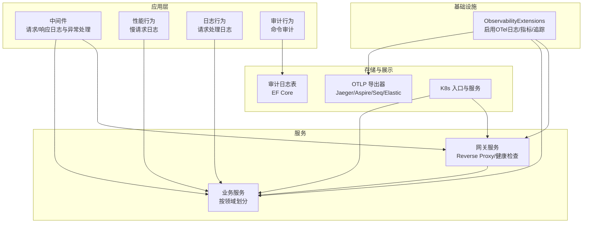
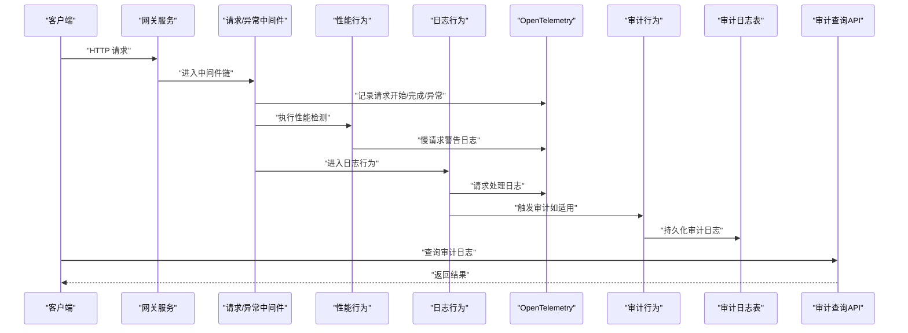
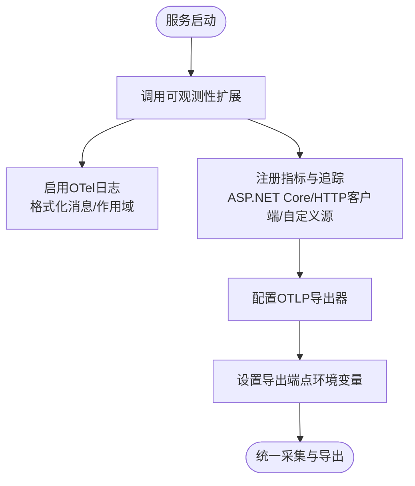
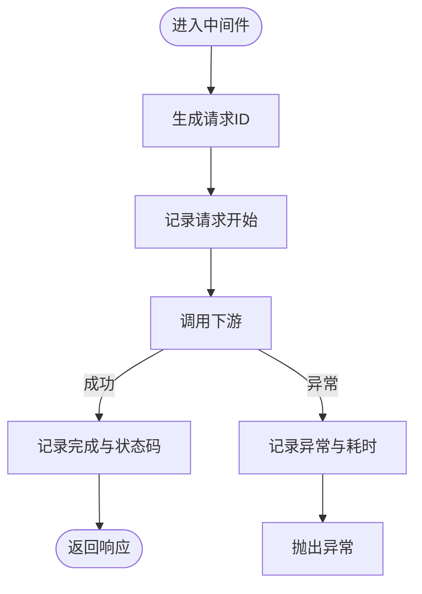
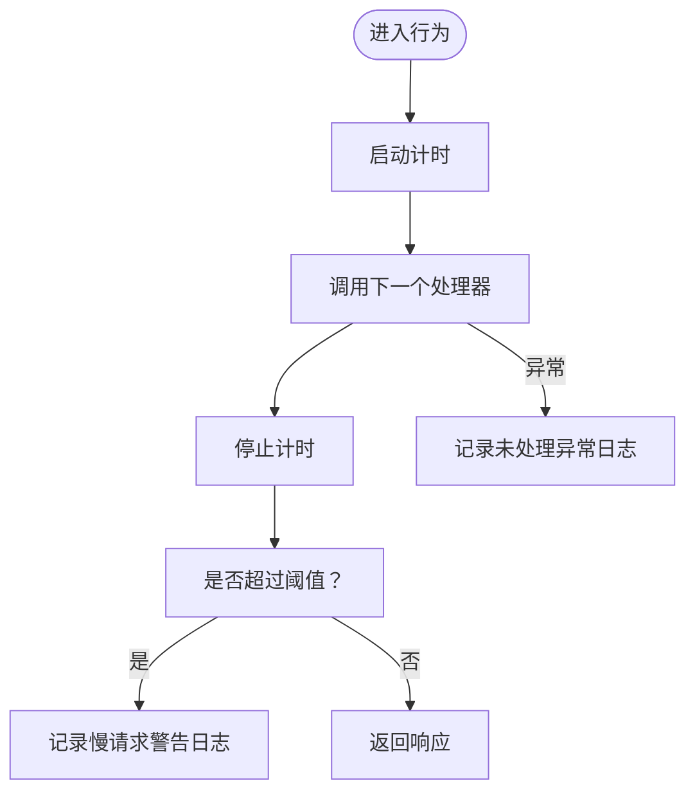
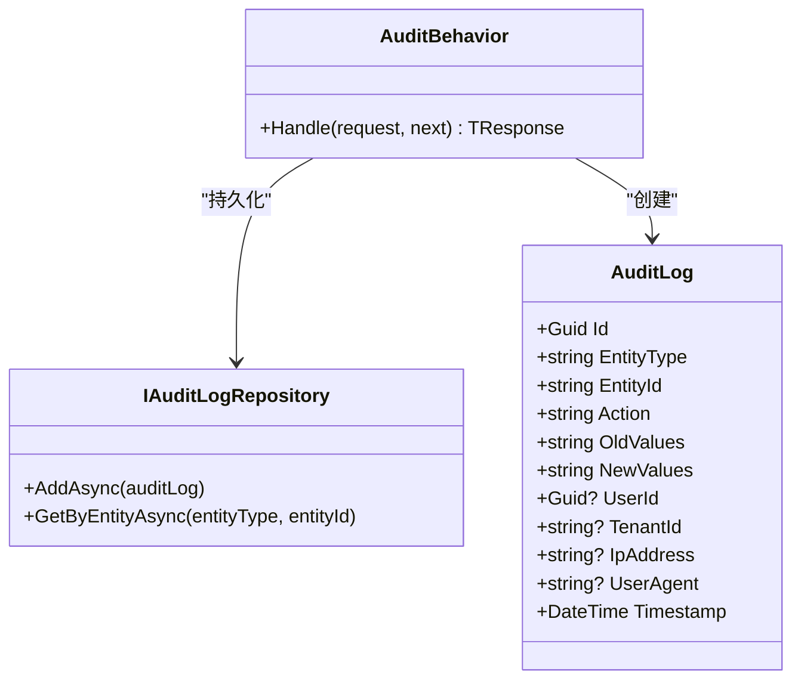
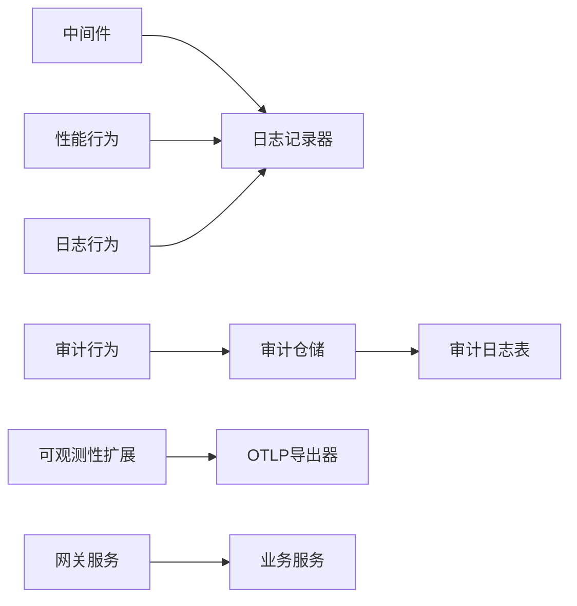

# 日志管理

<cite>
**本文引用的文件**
- [ObservabilityExtensions.cs](file://src/BuildingBlocks/ErpSystem.BuildingBlocks/Observability/ObservabilityExtensions.cs)
- [AuditLog.cs](file://src/BuildingBlocks/ErpSystem.BuildingBlocks/Auditing/AuditLog.cs)
- [AuditController.cs](file://src/Services/Identity/API/AuditController.cs)
- [LoggingBehavior.cs](file://src/BuildingBlocks/ErpSystem.BuildingBlocks/Behaviors/LoggingBehavior.cs)
- [PerformanceBehavior.cs](file://src/BuildingBlocks/ErpSystem.BuildingBlocks/Behaviors/PerformanceBehavior.cs)
- [Middlewares.cs](file://src/BuildingBlocks/ErpSystem.BuildingBlocks/Middleware/Middlewares.cs)
- [DependencyInjection.cs](file://src/BuildingBlocks/ErpSystem.BuildingBlocks/DependencyInjection.cs)
- [appsettings.json（Gateway）](file://src/Gateways/ErpSystem.Gateway/appsettings.json)
- [appsettings.Development.json（Gateway）](file://src/Gateways/ErpSystem.Gateway/appsettings.Development.json)
- [appsettings.json（Analytics）](file://src/Services/Analytics/ErpSystem.Analytics/appsettings.json)
- [appsettings.json（MasterData）](file://src/Services/MasterData/ErpSystem.MasterData/appsettings.json)
- [appsettings.json（Reporting）](file://src/Services/Reporting/ErpSystem.Reporting/appsettings.json)
- [Program.cs（Gateway）](file://src/Gateways/ErpSystem.Gateway/Program.cs)
- [deployment.md](file://docs/deployment.md)
- [ingress.yaml（Helm）](file://deploy/helm/erp-system/templates/ingress.yaml)
- [ingress.yaml（K8s）](file://deploy/k8s/ingress.yaml)
</cite>

## 目录
1. [简介](#简介)
2. [项目结构](#项目结构)
3. [核心组件](#核心组件)
4. [架构总览](#架构总览)
5. [详细组件分析](#详细组件分析)
6. [依赖关系分析](#依赖关系分析)
7. [性能考量](#性能考量)
8. [故障排查指南](#故障排查指南)
9. [结论](#结论)
10. [附录](#附录)

## 简介
本文件系统性阐述本项目的日志管理方案，覆盖结构化日志配置、OpenTelemetry 日志采集与导出、日志级别与轮转策略、存储与检索、ELK Stack 集成建议、日志聚合与搜索、日志关联与上下文信息、审计日志、日志分析与实时监控、以及在故障排查、安全审计与性能分析中的应用。文档以仓库现有实现为基础，结合部署与网关配置，给出可操作的落地建议。

## 项目结构
围绕日志管理的关键位置如下：
- 基础设施层：统一通过“可观测性扩展”接入 OpenTelemetry 日志、指标与追踪，并在各服务中启用。
- 应用层：请求级日志、性能慢调用日志、未处理异常日志、请求/响应与相关联 ID 的中间件。
- 审计层：命令执行审计记录，持久化到数据库并提供查询接口。
- 网关层：集中路由与健康检查，便于统一日志采集与可观测性导出。
- 部署层：Kubernetes 与 Helm 模板定义了服务暴露与入口规则，支撑日志聚合与可视化。

图表来源
- [ObservabilityExtensions.cs](file://src/BuildingBlocks/ErpSystem.BuildingBlocks/Observability/ObservabilityExtensions.cs#L12-L39)
- [Middlewares.cs](file://src/BuildingBlocks/ErpSystem.BuildingBlocks/Middleware/Middlewares.cs#L10-L49)
- [PerformanceBehavior.cs](file://src/BuildingBlocks/ErpSystem.BuildingBlocks/Behaviors/PerformanceBehavior.cs#L11-L39)
- [LoggingBehavior.cs](file://src/BuildingBlocks/ErpSystem.BuildingBlocks/Behaviors/LoggingBehavior.cs#L6-L21)
- [AuditLog.cs](file://src/BuildingBlocks/ErpSystem.BuildingBlocks/Auditing/AuditLog.cs#L65-L101)
- [Program.cs（Gateway）](file://src/Gateways/ErpSystem.Gateway/Program.cs#L22-L79)
- [ingress.yaml（Helm）](file://deploy/helm/erp-system/templates/ingress.yaml#L1-L46)
- [ingress.yaml（K8s）](file://deploy/k8s/ingress.yaml#L1-L36)

章节来源
- [ObservabilityExtensions.cs](file://src/BuildingBlocks/ErpSystem.BuildingBlocks/Observability/ObservabilityExtensions.cs#L12-L39)
- [appsettings.json（Gateway）](file://src/Gateways/ErpSystem.Gateway/appsettings.json#L2-L7)
- [Program.cs（Gateway）](file://src/Gateways/ErpSystem.Gateway/Program.cs#L22-L79)
- [ingress.yaml（Helm）](file://deploy/helm/erp-system/templates/ingress.yaml#L1-L46)
- [ingress.yaml（K8s）](file://deploy/k8s/ingress.yaml#L1-L36)

## 核心组件
- 结构化日志与 OpenTelemetry
  - 在基础模块中通过扩展方法启用 OpenTelemetry 日志、指标与追踪，包含 OTLP 导出器配置，便于对接 Jaeger、Aspire Dashboard、Seq 或 Elastic 等后端。
  - 各服务在启动时调用该扩展以统一采集与导出。
- 请求级日志与中间件
  - 中间件负责记录请求开始/完成/失败、状态码、耗时与请求 ID；异常捕获并记录。
  - 性能行为对超过阈值的请求进行慢调用警告日志。
  - 日志行为对每个请求的处理过程进行信息级日志。
- 审计日志
  - 审计行为自动记录可审计命令的请求体与用户上下文，持久化为结构化 JSON 字段，支持按实体类型/ID 查询。
  - 提供审计查询 API，支持时间范围与事件类型过滤。
- 配置与部署
  - 各服务 appsettings 中定义默认日志级别与 ASP.NET Core 级别，网关服务包含反向代理与集群配置。
  - Kubernetes/Helm 模板定义入口与服务暴露，便于集中采集。

章节来源
- [ObservabilityExtensions.cs](file://src/BuildingBlocks/ErpSystem.BuildingBlocks/Observability/ObservabilityExtensions.cs#L12-L39)
- [Middlewares.cs](file://src/BuildingBlocks/ErpSystem.BuildingBlocks/Middleware/Middlewares.cs#L10-L49)
- [PerformanceBehavior.cs](file://src/BuildingBlocks/ErpSystem.BuildingBlocks/Behaviors/PerformanceBehavior.cs#L11-L39)
- [LoggingBehavior.cs](file://src/BuildingBlocks/ErpSystem.BuildingBlocks/Behaviors/LoggingBehavior.cs#L6-L21)
- [AuditLog.cs](file://src/BuildingBlocks/ErpSystem.BuildingBlocks/Auditing/AuditLog.cs#L65-L101)
- [AuditController.cs](file://src/Services/Identity/API/AuditController.cs#L9-L23)
- [appsettings.json（Gateway）](file://src/Gateways/ErpSystem.Gateway/appsettings.json#L2-L7)
- [appsettings.json（Analytics）](file://src/Services/Analytics/ErpSystem.Analytics/appsettings.json#L2-L7)
- [appsettings.json（MasterData）](file://src/Services/MasterData/ErpSystem.MasterData/appsettings.json#L2-L7)
- [appsettings.json（Reporting）](file://src/Services/Reporting/ErpSystem.Reporting/appsettings.json#L2-L7)
- [Program.cs（Gateway）](file://src/Gateways/ErpSystem.Gateway/Program.cs#L22-L79)

## 架构总览
下图展示了从请求进入网关，经由中间件与行为管道，到 OpenTelemetry 日志与审计日志的完整流程，并标注了导出路径与查询入口。

图表来源
- [Middlewares.cs](file://src/BuildingBlocks/ErpSystem.BuildingBlocks/Middleware/Middlewares.cs#L10-L49)
- [PerformanceBehavior.cs](file://src/BuildingBlocks/ErpSystem.BuildingBlocks/Behaviors/PerformanceBehavior.cs#L11-L39)
- [LoggingBehavior.cs](file://src/BuildingBlocks/ErpSystem.BuildingBlocks/Behaviors/LoggingBehavior.cs#L6-L21)
- [AuditLog.cs](file://src/BuildingBlocks/ErpSystem.BuildingBlocks/Auditing/AuditLog.cs#L65-L101)
- [AuditController.cs](file://src/Services/Identity/API/AuditController.cs#L9-L23)
- [ObservabilityExtensions.cs](file://src/BuildingBlocks/ErpSystem.BuildingBlocks/Observability/ObservabilityExtensions.cs#L12-L39)

## 详细组件分析

### 组件A：OpenTelemetry 日志与导出
- 功能要点
  - 启用 OpenTelemetry 日志，包含格式化消息与作用域。
  - 注册指标与追踪，设置资源信息，添加 ASP.NET Core、HTTP 客户端与自定义源的仪器化。
  - 添加 OTLP 导出器，需在部署环境设置导出端点环境变量。
- 配置与使用
  - 在服务启动时调用扩展方法，即可在所有服务中统一采集日志与追踪数据。
  - 导出端点通过环境变量配置，便于在不同环境切换。
- 与 ELK 集成建议
  - 可将 OTLP 导出器指向 OpenTelemetry Collector，再由 Collector 转发至 Elasticsearch/Logstash，实现与 ELK 的无缝对接。

图表来源
- [ObservabilityExtensions.cs](file://src/BuildingBlocks/ErpSystem.BuildingBlocks/Observability/ObservabilityExtensions.cs#L12-L39)

章节来源
- [ObservabilityExtensions.cs](file://src/BuildingBlocks/ErpSystem.BuildingBlocks/Observability/ObservabilityExtensions.cs#L12-L39)

### 组件B：请求/响应与异常日志中间件
- 功能要点
  - 记录请求开始、完成、失败、状态码与耗时。
  - 生成短请求 ID，贯穿整个请求生命周期，便于日志关联。
  - 捕获异常并记录错误日志，保持一致性错误响应。
- 日志格式与上下文
  - 使用结构化字段记录方法、路径、状态码、耗时等，便于搜索与聚合。
  - 通过 Correlation ID 中间件注入关联 ID，支持跨服务追踪。

图表来源
- [Middlewares.cs](file://src/BuildingBlocks/ErpSystem.BuildingBlocks/Middleware/Middlewares.cs#L10-L49)

章节来源
- [Middlewares.cs](file://src/BuildingBlocks/ErpSystem.BuildingBlocks/Middleware/Middlewares.cs#L10-L49)

### 组件C：慢请求与未处理异常日志行为
- 功能要点
  - 性能行为对超过阈值的请求输出慢请求警告日志，包含请求名、耗时与请求对象。
  - 未处理异常行为捕获异常并记录错误日志，包含请求名与请求对象。
- 与日志聚合的关系
  - 这两类日志可作为性能与稳定性分析的关键信号，配合 OTel 指标与追踪进行根因定位。

图表来源
- [PerformanceBehavior.cs](file://src/BuildingBlocks/ErpSystem.BuildingBlocks/Behaviors/PerformanceBehavior.cs#L11-L67)

章节来源
- [PerformanceBehavior.cs](file://src/BuildingBlocks/ErpSystem.BuildingBlocks/Behaviors/PerformanceBehavior.cs#L11-L67)

### 组件D：请求处理日志行为
- 功能要点
  - 对每个请求处理前后分别记录信息级日志，包含请求名与请求对象。
- 与审计的区别
  - 处理日志关注执行过程，审计日志关注变更事实与合规性。

章节来源
- [LoggingBehavior.cs](file://src/BuildingBlocks/ErpSystem.BuildingBlocks/Behaviors/LoggingBehavior.cs#L6-L21)

### 组件E：审计日志与查询
- 数据模型与持久化
  - 审计日志实体包含实体类型、实体 ID、动作、旧值、新值、用户 ID、租户 ID、IP、UA、时间戳等字段。
  - EF Core 配置审计日志表，建立多维索引以优化查询。
- 自动化审计
  - 审计行为在命令处理完成后自动记录，包含用户上下文与请求对象序列化。
- 查询接口
  - 提供审计日志查询 API，支持按时间范围与事件类型过滤，限制返回条数。

图表来源
- [AuditLog.cs](file://src/BuildingBlocks/ErpSystem.BuildingBlocks/Auditing/AuditLog.cs#L12-L134)

章节来源
- [AuditLog.cs](file://src/BuildingBlocks/ErpSystem.BuildingBlocks/Auditing/AuditLog.cs#L12-L134)
- [AuditController.cs](file://src/Services/Identity/API/AuditController.cs#L9-L23)

### 组件F：日志级别与服务配置
- 网关服务
  - 默认日志级别为信息级，ASP.NET Core 为警告级；保留反向代理与集群配置。
- 业务服务
  - 多个服务采用信息级默认日志级别，ASP.NET Core 为警告级或调试级（部分服务），便于开发与生产差异化控制。
- 生产建议
  - 生产环境建议统一默认级别为信息级，仅在需要时临时提升到调试级。

章节来源
- [appsettings.json（Gateway）](file://src/Gateways/ErpSystem.Gateway/appsettings.json#L2-L7)
- [appsettings.Development.json（Gateway）](file://src/Gateways/ErpSystem.Gateway/appsettings.Development.json#L2-L8)
- [appsettings.json（Analytics）](file://src/Services/Analytics/ErpSystem.Analytics/appsettings.json#L2-L7)
- [appsettings.json（MasterData）](file://src/Services/MasterData/ErpSystem.MasterData/appsettings.json#L2-L7)
- [appsettings.json（Reporting）](file://src/Services/Reporting/ErpSystem.Reporting/appsettings.json#L2-L7)

### 组件G：日志轮转与存储管理
- 现状
  - 仓库未提供专用的日志轮转配置文件；OpenTelemetry 日志导出依赖 OTLP 端点配置。
- 建议
  - 在容器运行时使用日志驱动的轮转策略（如 JSON 文件驱动的轮转），并结合外部日志收集器（如 Fluent Bit/Fluentd/OpenTelemetry Collector）进行集中存储与轮转。
  - 将 OTLP 导出器指向本地或远端日志后端，确保日志持久化与归档。

章节来源
- [ObservabilityExtensions.cs](file://src/BuildingBlocks/ErpSystem.BuildingBlocks/Observability/ObservabilityExtensions.cs#L36-L38)

### 组件H：ELK Stack 集成与日志聚合
- 现状
  - 未直接包含 ELK 配置文件；但通过 OTLP 导出器可与 OpenTelemetry Collector 集成，再转发至 ELK。
- 建议
  - 在部署层增加 OpenTelemetry Collector 与 ELK 组件，将 OTLP 导出器指向 Collector，实现日志聚合与搜索。
  - 利用网关与服务的入口规则，统一采集访问日志与应用日志。

章节来源
- [ObservabilityExtensions.cs](file://src/BuildingBlocks/ErpSystem.BuildingBlocks/Observability/ObservabilityExtensions.cs#L36-L38)
- [ingress.yaml（Helm）](file://deploy/helm/erp-system/templates/ingress.yaml#L1-L46)
- [ingress.yaml（K8s）](file://deploy/k8s/ingress.yaml#L1-L36)

### 组件I：日志关联、上下文与审计
- 关联与上下文
  - 中间件生成请求 ID 并注入响应头，支持跨服务追踪。
  - 审计日志包含用户 ID、租户 ID、IP、UA、时间戳等上下文信息。
- 审计配置
  - 审计行为自动记录可审计请求，EF Core 配置索引以加速查询。
- 查询能力
  - 审计查询 API 支持时间范围与事件类型过滤，便于问题回溯与合规审计。

章节来源
- [Middlewares.cs](file://src/BuildingBlocks/ErpSystem.BuildingBlocks/Middleware/Middlewares.cs#L54-L68)
- [AuditLog.cs](file://src/BuildingBlocks/ErpSystem.BuildingBlocks/Auditing/AuditLog.cs#L28-L53)
- [AuditLog.cs](file://src/BuildingBlocks/ErpSystem.BuildingBlocks/Auditing/AuditLog.cs#L115-L134)
- [AuditController.cs](file://src/Services/Identity/API/AuditController.cs#L9-L23)

### 组件J：日志分析工具、实时监控与告警
- 工具与可视化
  - 通过 OTel 指标与追踪，结合 Jaeger/Aspire Dashboard/Seq/Elastic 等后端进行可视化。
- 实时监控
  - 网关暴露健康检查端点，服务内嵌健康检查，便于监控系统拉取。
- 告警设置
  - 建议基于慢请求日志、异常日志与健康检查失败事件设置告警规则。

章节来源
- [ObservabilityExtensions.cs](file://src/BuildingBlocks/ErpSystem.BuildingBlocks/Observability/ObservabilityExtensions.cs#L22-L39)
- [Program.cs（Gateway）](file://src/Gateways/ErpSystem.Gateway/Program.cs#L66-L80)
- [PerformanceBehavior.cs](file://src/BuildingBlocks/ErpSystem.BuildingBlocks/Behaviors/PerformanceBehavior.cs#L27-L36)

## 依赖关系分析
- 组件耦合
  - 中间件与行为均依赖日志记录器，形成统一日志入口。
  - 审计行为依赖用户上下文与审计仓储，与 EF Core 模型耦合。
- 外部依赖
  - OTLP 导出器依赖环境变量配置，部署阶段决定导出目标。
  - 网关与服务通过入口规则暴露，便于集中采集。

图表来源
- [Middlewares.cs](file://src/BuildingBlocks/ErpSystem.BuildingBlocks/Middleware/Middlewares.cs#L10-L49)
- [PerformanceBehavior.cs](file://src/BuildingBlocks/ErpSystem.BuildingBlocks/Behaviors/PerformanceBehavior.cs#L11-L39)
- [LoggingBehavior.cs](file://src/BuildingBlocks/ErpSystem.BuildingBlocks/Behaviors/LoggingBehavior.cs#L6-L21)
- [AuditLog.cs](file://src/BuildingBlocks/ErpSystem.BuildingBlocks/Auditing/AuditLog.cs#L65-L101)
- [ObservabilityExtensions.cs](file://src/BuildingBlocks/ErpSystem.BuildingBlocks/Observability/ObservabilityExtensions.cs#L12-L39)
- [Program.cs（Gateway）](file://src/Gateways/ErpSystem.Gateway/Program.cs#L22-L79)

章节来源
- [DependencyInjection.cs](file://src/BuildingBlocks/ErpSystem.BuildingBlocks/DependencyInjection.cs#L20-L26)
- [ObservabilityExtensions.cs](file://src/BuildingBlocks/ErpSystem.BuildingBlocks/Observability/ObservabilityExtensions.cs#L12-L39)

## 性能考量
- 日志开销控制
  - 使用信息级默认级别，避免调试级日志在生产环境造成过多 IO。
  - 慢请求阈值与异常日志用于精准定位问题，减少无效日志量。
- 导出与传输
  - OTLP 导出器应配置合理的批量大小与重试策略，避免网络拥塞。
- 存储与检索
  - 审计日志建立多维索引，查询时优先使用时间戳与实体键过滤。

## 故障排查指南
- 快速定位
  - 使用请求 ID 在日志中检索一次请求的全链路日志。
  - 关注慢请求与异常日志，结合追踪 ID 进行根因分析。
- 审计回溯
  - 通过审计查询 API 获取指定实体的变更历史，核对用户、时间、IP、UA 等上下文。
- 健康检查
  - 通过网关与服务的健康检查端点确认服务可用性。

章节来源
- [Middlewares.cs](file://src/BuildingBlocks/ErpSystem.BuildingBlocks/Middleware/Middlewares.cs#L17-L46)
- [PerformanceBehavior.cs](file://src/BuildingBlocks/ErpSystem.BuildingBlocks/Behaviors/PerformanceBehavior.cs#L27-L36)
- [AuditController.cs](file://src/Services/Identity/API/AuditController.cs#L9-L23)
- [Program.cs（Gateway）](file://src/Gateways/ErpSystem.Gateway/Program.cs#L78-L80)

## 结论
本项目已具备完善的日志管理基础：统一的 OpenTelemetry 日志采集、请求级与性能级日志、异常捕获与审计记录，以及可扩展的 ELK 集成路径。建议在部署层完善 OTLP 导出与日志轮转策略，结合健康检查与告警机制，形成闭环的可观测体系，以支撑故障排查、安全审计与性能分析。

## 附录
- 部署与入口
  - 通过 Helm 与 Kubernetes 模板定义入口与服务暴露，便于集中采集与可视化。
- 开发与生产差异
  - 开发环境可适度提高日志级别以辅助调试，生产环境维持信息级默认级别。

章节来源
- [deployment.md](file://docs/deployment.md#L59-L115)
- [ingress.yaml（Helm）](file://deploy/helm/erp-system/templates/ingress.yaml#L1-L46)
- [ingress.yaml（K8s）](file://deploy/k8s/ingress.yaml#L1-L36)